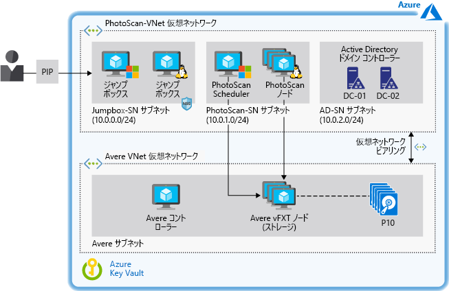

# Azure でのデジタル イメージベースのモデリングの高速化

このシナリオの例では、Azure のサービスとしてのインフラストラクチャ (IaaS) 上でイメージ ベースのモデリングを実行する必要がある組織向けにアーキテクチャと設計のガイダンスを提供します。 このシナリオは処理時間を短縮するための高パフォーマンス ストレージを使用して Azure Virtual Machines (VM) 上でフォトグラメトリ ソフトウェアを実行するように設計されています。 環境は必要に応じてスケールアップとスケールダウンを行うことができ、パフォーマンスを損なわずに数 TB のストレージをサポートしています。

## 関連するユース ケース

関連するユース ケース:

- ビル、エンジニアリング構造物、および科学捜査上の事故シーンをモデリングおよび測定する。
- コンピューター ゲームやムービーの視覚効果を作成する。
- デジタル画像を使用して、都市計画などの用途で、さまざまな規模のオブジェクトの測定値を直接生成する。

## アーキテクチャ

この例では、Avere vFXT ストレージを活用した Agisoft PhotoScan フォトグラメトリ ソフトウェアの使用について説明します。 PhotoScan は、地理情報システム (GIS) アプリケーション、文化遺産ドキュメント、ゲーム開発、および視覚効果プロダクションで広く普及していることから選択されました。 近距離フォトグラメトリと航空写真の両方に適しています。

この記事で扱う概念は、インフラストラクチャとして管理されるスケジューラとワーカー ノードに基づくすべてのハイ パフォーマンス コンピューティング (HPC) ワークロードに適用されます。  このワークロードに対して、ベンチマーク テスト中に優れたパフォーマンスを示した Avere vFXT が選択されました。  ただし、このシナリオでは他のストレージ ソリューションを使用できるように処理からストレージを切り離してあります (このドキュメントで後述する「[代替手段](#alternatives)」を参照してください)。

このアーキテクチャには、Azure リソースへのアクセスを制御し、ドメイン ネーム システム (DNS) を通じて内部名前解決を提供する Active Directory ドメイン コントローラーも含まれています。 ジャンプ ボックスから、ソリューションを実行する Windows と Linux VM に対する管理者アクセスが提供されます。

1. ユーザーは、PhotoScan にさまざまなイメージを送信します。
2. PhotoScan スケジューラは、ヘッド ノードとして機能し、ユーザーのイメージの処理を指示する Windows VM で実行されます。
3. PhotoScan は写真上の共通点を検索し、グラフィックス プロセッシング ユニット (GPU) を搭載した VM で実行されている PhotoScan 処理ノードを使用してジオメトリ (メッシュ) を構築します。
4. Avere vFXT は、ネットワーク ファイル システム バージョン 3 (NFSv3) に基づき、少なくとも 4 つの VM から構成されて、Azure での高パフォーマンス ストレージ ソリューションを提供します。
5. PhotoScan は、モデルをレンダリングします。

### コンポーネント

- [Agisoft PhotoScan](http://www.agisoft.com/):PhotoScan スケジューラは、Windows 2016 Server VM で実行され、処理ノードは、CentOS Linux 7.5 を実行している、GPU を搭載した 5 つの VM を使用します。
- [Avere vFXT](/azure/avere-vfxt/avere-vfxt-overview) は、大規模なデータセットの格納に最適化された、オブジェクト ストレージと従来のネットワーク接続ストレージ (NAS) を使用するファイル キャッシュ ソリューションです。 次の情報が含まれます。
  - Avere コントローラー。 この VM は、Avere vFXT クラスターをインストールするスクリプトを実行し、Ubuntu 18.04 LTS を実行します。 この VM は、クラスターのノード追加または削除と、クラスターの破棄のために後で使用できます。
  - vFXT クラスター。 Avere OS 5.0.2.1 に基づく Avere vFXT ノードごとに 1 つ、少なくとも 3 つの VM が使用されます。 これらの VM は、Azure Blob Storage に接続されている vFXT クラスターを形成します。
- [Microsoft Active Directory ドメイン コントローラー](/windows/desktop/ad/active-directory-domain-services)は、ドメイン リソースへのホスト アクセスを許可して、DNS 名前解決を提供します。 Avere vFXT は多数の A レコードを追加します。たとえば、vFXT クラスター内の各 A レコードは各 Avere vFXT ノードの IP アドレスを指します。 このセットアップでは、すべての VM で vFXT へのアクセスにラウンドロビン パターンを使用します。
- [他の VM](/azure/virtual-machines/) は、管理者はスケジューラと処理ノードにアクセスするために使用するジャンプ ボックスとして機能します。 Windows のジャンプ ボックスは、管理者がリモート デスクトップ プロトコル経由でヘッド ノードにアクセスするために必要です。 2 番目のジャンプ ボックスは省略可能で、ワーカー ノードの管理用に Linux を実行します。
- [ネットワーク セキュリティ グループ](/azure/virtual-network/manage-network-security-group) (NSG) は、パブリック IP アドレス (PIP) へのアクセスを制限し、ジャンプ ボックスのサブネットに接続されている VM にアクセスするためにポート 3389 と 22 を許可します。
- [仮想ネットワーク ピアリング](/azure/virtual-network/virtual-network-peering-overview)は、PhotoScan 仮想ネットワークを Avere 仮想ネットワークに接続します。
- [Azure Blob Storage](/azure/storage/blobs/storage-blobs-introduction) は、処理されているコミットされたデータを格納するコア ファィラーとして Avere vFXT と連携します。 Avere vFXT では、Azure BLOB に格納されているアクティブなデータを識別し、PhotoScan ジョブの実行中に、コンピューティング ノードでキャッシングに使用されるソリッド ステート ドライブ (SSD) 内で階層化します。 変更が加えられると、データはコア フィルターに非同期的にコミットされます。
- [Azure Key Vault](/azure/key-vault/key-vault-overview) は、管理者のパスワードと PhotoScan アクティブ化コードを格納するために使用されます。

### 代替手段

- HPC クラスターを管理するために Azure サービスを利用するには、テンプレートまたはスクリプトを使用してリソースを管理するのではなく Azure CycleCloud、Azure Batch などのツールを使用します。
- Avere vFXT の代わりに Azure 上のバックエンド ストレージとして BeeGFS 並列仮想ファイル システムをデプロイします。 [BeeGFS テンプレート](https://github.com/paulomarquesc/beegfs-template)を使用して、Azure でこのエンド ツー エンド ソリューションをデプロイします。
- GlusterFS、Lustre、Windows 記憶域スペース ダイレクトなど、任意のストレージ ソリューションをデプロイします。 これを行うには、目的のストレージ ソリューションと連携するように [PhotoScan テンプレート](https://github.com/paulomarquesc/photoscan-template)を編集します。
- 既定のオプションである Linux ではなく、Windows オペレーティング システムでワーカー ノードをデプロイします。 Windows ノードを選択するときに、ストレージの統合オプションは、デプロイ テンプレートによって実行されません。 既存のストレージ ソリューションと環境を手動で統合するか、「[リポジトリ](https://github.com/paulomarquesc/photoscan-template/blob/master/docs/AverePostDeploymentSteps.md)」の説明に従って、このような自動化を提供するように PhotoScan テンプレートをカスタマイズする必要があります。

## 考慮事項

このシナリオは、Windows または Linux に配置されたかどうかに関わらず、HPC ワークロード向けの高パフォーマンス ストレージを提供することに特化して設計されています。 通常、HPC ワークロードのストレージの構成は、オンプレミス デプロイで使用される適切なベスト プラクティスと一致する必要があります。

デプロイに関する考慮事項は、使用するアプリケーションとサービスによって異なりますが、いくつかの注意事項が適用されます。

- 高パフォーマンス アプリケーションを構築する場合は、Azure Premium Storage を使用して、[アプリケーション レイヤーを最適化](/azure/virtual-machines/windows/premium-storage-performance)します。 Azure BLOB [ホット層アクセス](/azure/storage/blobs/storage-blob-storage-tiers)を使用して頻繁なアクセス向けにストレージを最適化します。
- 可用性とパフォーマンスの要件を満たすストレージ [レプリケーション オプション](/azure/storage/common/storage-redundancy)を使用します。 この例で Avere vFXT は既定で、ローカル冗長ストレージ (LRS) を使用して高可用性向けに構成されています。 このセットアップでは、負荷分散のために、すべての VM で vFXT へのアクセスにラウンドロビン パターンを使用します。
- バックエンド ストレージを Windows クライアントと Linux クライアントの両方で使用する場合は、Samba サーバーを使用して Windows ノードをサポートします。 BeeGFS に基づくこの例のシナリオの 1 [バージョン](https://github.com/paulomarquesc/beegfs-template)では、Windows で実行されている HPC ワークロード (PhotoScan) のスケジューラ ノードをサポートするために Samba を使用します。 DNS ラウンドロビンのスマート置換ように機能するようにロード バランサーがデプロイされます。
- [Windows](/azure/virtual-machines/windows/sizes-hpc) または [Linux](/azure/virtual-machines/linux/sizes?toc=%2fazure%2fvirtual-machines%2flinux%2ftoc.json) のワークロードに最適な VM の種類を使用して HPC アプリケーションを実行してください。
- ストレージ リソースから HPC ワークロードを分離するには、独自の仮想ネットワーク内にそれぞれをデプロイしたうえで、仮想ネットワーク [ピアリング](/azure/virtual-network/virtual-network-peering-overview)を使用してこの 2 つを接続します。 ピアリングによって、異なる仮想ネットワーク内のリソース間に低待機時間、高帯域幅の接続が作られ、プライベート IP アドレスのみを介した Microsoft のバックボーン インフラストラクチャを通じてトラフィックがルーティングされます。

### セキュリティ

この例では、HPC ワークロード向けの高パフォーマンス ストレージ ソリューションのデプロイについて説明しており、セキュリティ ソリューションではありません。 変更を加えるには、必ずセキュリティ チームが関与するようにしてください。

セキュリティを強化する場合、このサンプルのインフラストラクチャでは、すべての Windows VM をドメインに参加済みにすることと、一元認証に Active Directory を使用することができます。 すべての VM 用にカスタム DNS サービスも提供します。 環境の保護を容易にするために、このテンプレートでは[ネットワーク セキュリティ グループ (NSG)](/azure/virtual-network/security-overview) を利用しています。 NSG は、基本的なトラフィック フィルターとセキュリティ規則を提供します。

このシナリオでのセキュリティをさらに強化するには、次のオプションを検討してください。

- Fortinet、Checkpoint、Juniper などのネットワーク仮想アプライアンスを使用します。
- [ロールベースのアクセス制御](/azure/role-based-access-control/overview)をリソース グループに適用します。
- ジャンプ ボックスにインターネット経由でアクセスする場合、VM [JIT](/azure/security-center/security-center-just-in-time) アクセスを有効にします。
- [Azure Key Vault](/azure/key-vault/quick-create-portal) を使用して管理者アカウントで使用されるパスワードを保存します。

## 価格

このシナリオを実行するコストは、複数の要因に応じて大きく異なります。  VM の数とサイズ、必要なストレージの量、ジョブを完了するためにかかる時間によってコストが決まります。

[Azure 料金計算ツール](https://azure.com/e/42362ddfd2e245a28a8e78bc609c80f3)での次のコスト プロファイル例は、Avere vFXT と PhotoScan に対する一般的な構成に基づきます。

- Avere コントローラーを実行する 1 つの A1\_v2 Ubuntu VM。
- vFXT クラスターを形成する Avere vFXT ノードごとに 1 つの 3 つの D16s\_v3 Avere OS VM。
- PhotoScan 処理ノードで必要な GPU を提供する 5 つの NC24\_v2 Linux VM。
- PhotoScan スケジューラ ノードの 1 つの D8s\_v3 CentOS VM。
- 管理者のジャンプ ボックスとして使用する 1 つの DS2\_v2 CentOS。
- Active Directory ドメイン コントローラー用の 2 つの DS2\_v2 VM。
- Premium Managed Disks。
- LRS とホット層アクセスを装備した汎用 v2 (GPv2) BLOB ストレージ (GPv2 ストレージ アカウントのみがアクセス層属性を公開)。
- 10 TB のデータ転送をサポートする仮想ネットワーク。

このアーキテクチャについて詳しくは、[電子ブック](https://azure.microsoft.com/en-us/resources/deploy-agisoft-photoscan-on-azure-with-azere-vfxt-for-azure-or-beegfs/)を参照してください。 特定のユース ケースについて料金の変化を確認するには、予想されるデプロイに合わせて料金計算ツールでさまざまな VM サイズを選択します。

## Deployment

Avere FxT または BeeGFS のいずれかを使用するためのすべての前提条件を含む、このアーキテクチャをデプロイする手順については、次の電子ブックをダウンロードしてください。[Avere vFXT for Azure または BeeGFS を使用して Agisoft PhotoScan を Azure にデプロイする](https://azure.microsoft.com/en-us/resources/deploy-agisoft-photoscan-on-azure-with-azere-vfxt-for-azure-or-beegfs/)。

## 関連リソース

次のリソースは、このシナリオで使用されるコンポーネントの詳細と、Azure でのバッチ コンピューティング用の代替方法を提供します。

- [Avere vFXT for Azure](/azure/avere-vfxt/avere-vfxt-overview) の概要
- [Agisoft PhotoScan](https://www.agisoft.com/) ホーム ページ
- [Azure Storage のパフォーマンスとスケーラビリティのチェック リスト](/azure/storage/common/storage-performance-checklist)
- [Microsoft Azure での並列の仮想ファイル システム:Lustre、GlusterFS、および BeeGFS のパフォーマンス テスト](https://azure.microsoft.com/mediahandler/files/resourcefiles/parallel-virtual-file-systems-on-microsoft-azure/Parallel_Virtual_File_Systems_on_Microsoft_Azure.pdf) (PDF)
- [Azure でのコンピューター支援エンジニアリング (CAE)](/azure/architecture/example-scenario/apps/hpc-saas) シナリオ例
- [Azure での HPC](https://azure.microsoft.com/en-us/solutions/high-performance-computing/) ホーム ページ
- 概要: [ビッグ コンピューティング:HPC &amp;および Microsoft Batch](https://azure.microsoft.com/en-us/solutions/big-compute/)