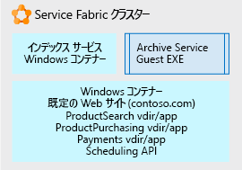

# Service Fabric を使用したモノリシック アプリケーションの分解Using Service Fabric to decompose monolithic applications

このシナリオの例では、扱いにくいモノリシック アプリケーションを分解するためのプラットフォームとして [Service Fabric](/azure/service-fabric/service-fabric-overview) を使用するアプローチについて説明します。In this example scenario, we walk through an approach using [Service Fabric](/azure/service-fabric/service-fabric-overview) as a platform for decomposing an unwieldy monolithic application. ここでは、IIS/ASP.Net Web サイトを管理しやすい複数のマイクロサービスから成るアプリケーションに分解する反復的なアプローチを検討します。Here we consider an iterative approach to decomposing an IIS/ASP.NET web site into an application composed of multiple, manageable microservices.

モノリシック アーキテクチャからマイクロサービス アーキテクチャに移行すると、次のような利点があります。Moving from a monolithic architecture to a microservice architecture provides the following benefits:

- 1 つの小さなわかりやすいコード単位を変更して、その単位のみを展開することができます。You can change one small, understandable unit of code and deploy only that unit.
- 各コード単位の展開にかかる時間はわずか数分です。Each code unit requires just a few minutes or less to deploy.
- 小さな単位にエラーがある場合、アプリケーション全体ではなくその単位のみが動作を停止します。If there is an error in that small unit, only that unit stops working, not the whole application.
- 小さいコード単位を複数の開発チームに個別に配布する処理も簡単です。Small units of code can be distributed easily and discretely among multiple development teams.
- 新規の開発者でも、単位の個別機能を短時間で簡単に理解できます。New developers can quickly and easily grasp the discrete functionality of each unit.

この例ではサーバー ファームの大規模な IIS アプリケーションを使用しますが、反復的な分解とホスティングの概念は、任意の種類の大規模アプリケーションに使用できます。A large IIS application on a server farm is used in this example, but the concepts of iterative decomposition and hosting can be used for any type of large application. このソリューションでは Windows を使用しますが、Service Fabric は Linux OS でも実行できます。While this solution uses Windows, Service Fabric can also run on Linux. オンプレミス、Azure、または任意のクラウド プロバイダー内の VM ノードで実行できます。It can be run on-premises, in Azure, or on VM nodes in the cloud provider of your choice.

## 関連するユース ケースRelevant use cases

このシナリオは、次のことが発生している大規模なモノリシック Web アプリケーションを使用する組織に関連します。This scenario is relevant to organizations with large monolithic Web applications that are experiencing:

- 小さなコード変更のエラーで Web サイト全体が中断する。Errors in small code changes that break the entire website.
- Web サイト全体を更新する必要があるためリリースに何日もかかる。Releases taking multiple days due to the need to release update the entire website.
- 1 人では把握できないほどの複雑なコード ベースなので、新規の開発者やチームのオンボード時に能力向上に時間がかかる。Long ramp-up times when onboarding new developers or teams due to the complex code base, requiring a single individual to know more than is feasible.

## アーキテクチャArchitecture

ホスティング プラットフォームとして Service Fabric を使用すると、次に示すように、大規模な IIS Web サイトをマイクロサービスのコレクションに変換できます。Using Service Fabric as the hosting platform, we can convert a large IIS web site into a collection of microservices as shown below:

上の図では、大きな IIS アプリケーションのすべての部分を次のように分解しています。In the picture above, we decomposed all the parts of a large IIS application into:

- 受信したブラウザー要求を受け付け、解析してそれを処理するサービスを決定し、そのサービスに要求を転送する、ルーティングまたはゲートウェイ サービス。A routing or gateway service that accepts incoming browser requests, parses them to determine what service should handle them, and forwards the request to that service.
- 前は ASP.NET アプリケーションとして実行する 1 つの IIS サイトの下の正式な仮想ディレクトリだった 4 つの ASP.NET Core アプリケーション。Four ASP.NET Core applications that were formally virtual directories under the single IIS site running as ASP.NET applications. アプリケーションは、独自の独立したマイクロサービスに分けられました。The applications were separated into their own independent microservices. それにより、変更、バージョン管理、アップグレードを個別に行うことができます。The effect is that they can be changed, versioned, and upgraded separately. この例では、.Net Core と ASP.NET Core を使用して各アプリケーションを書き直してします。In this example, we rewrote each application using .Net Core and ASP.NET Core. これらは [Reliable Services](/azure/service-fabric/service-fabric-reliable-services-introduction) として記述されているので、完全な Service Fabric プラットフォームの機能と利点 (通信サービス、正常性レポート、通知など) にネイティブにアクセスできます。These were written as [Reliable Services](/azure/service-fabric/service-fabric-reliable-services-introduction) so they can natively access the full Service Fabric platform capabilities and benefits (communication services, health reports, notifications, etc.).
- *Indexing Service* という Windows サービス。基になるサーバーのレジストリを直接変更せず、自己完結型で実行してすべての依存関係を 1 つの単位として展開できるように Windows コンテナーに配置されています。A Windows service called *Indexing Service*, placed in a Windows container so that it no longer makes direct changes to registry of the underlying server, but can run self-contained and be deployed with all its dependencies as a single unit.
- アーカイブ サービス。スケジュールに従ってサイトのいくつかのタスクを実行する単なる実行可能ファイルです。An Archive service, which is just an executable that runs according to a schedule and performs some tasks for the sites. 変更しなくても必要な処理が実行され、変更する投資価値がないと判断されたため、スタンドアロン実行可能ファイルとして直接ホストされています。It is hosted directly as a stand-alone executable because we determined it does what it needs to do without modification and it is not worth the investment to change.

## 考慮事項Considerations

最初の課題は、モノリスで呼び出すことができるマイクロサービスとしてモノリスから抽出できる小さいコードを識別することです。The first challenge is to begin to identify smaller bits of code that can be factored out from the monolith into microservices that the monolith can call. 時間をかけて繰り返し、開発者が容易に理解して変更し、低リスクで迅速に展開できるマイクロサービスのコレクションにモノリスを分解します。Iteratively over time, the monolith is broken up into a collection of these microservices that developers can easily understand, change, and quickly deploy at low risk.

さまざまなフォームでのすべてのマイクロサービスの実行をサポートできるため、Service Fabric を選択します。Service Fabric was chosen because it is capable of supporting running all the microservices in their various forms. たとえば、スタンドアロンの実行可能ファイル、新しい小さい Web サイト、新しい小さい API、コンテナー化サービスなどを混在させることができます。Service Fabric は、1 つのクラスターにこれらすべてのサービス タイプを組み合わせることができます。For example you may have a mix of stand-alone executables, new small web sites, new small APIs, and containerized services, etc. Service Fabric can combine all these service types onto a single cluster.

この最終的な分解されたアプリケーションを得るため、反復的なアプローチを使用しています。To get to this final, decomposed application, we used an iterative approach. 最初にサーバー ファームには大規模な IIS/ASP.NET Web サイトがあります。We started with a large IIS/ASP.NET web site on a server farm. サーバー ファームの 1 つのノードを次に示します。A single node of the server farm is pictured below. これには、元の Web サイトと複数の仮想ディレクトリ、サイトが呼び出す追加の Windows サービス、定期的なサイト アーカイブ メンテナンスを行う実行可能ファイルが含まれます。It contains the original web site with several virtual directories, an additional Windows Service the site calls, and an executable that does some periodic site archive maintenance.

最初の開発イテレーションでは、IIS サイトとその仮想ディレクトリを [Windows コンテナー](/azure/service-fabric/service-fabric-containers-overview)内に配置します。On the first development iteration, the IIS site and its virtual directories placed in a [Windows Container](/azure/service-fabric/service-fabric-containers-overview). このようにすると、サイトは動作可能なままですが、基になるサーバー ノード OS には密接にバインドされなくなります。Doing this allows the site to remain operational, but not tightly bound to the underlying server node OS. コンテナーは基になる Service Fabric ノードによって実行およびオーケストレーションされますが、ノードはサイトが依存する状態を持つ必要がありません (レジストリ エントリ、ファイルなど)。The container is run and orchestrated by the underlying Service Fabric node, but the node does not have to have any state that the site is dependent on (registry entries, files, etc.). これらのアイテムはすべてコンテナー内にあります。All of those items are in the container. 同じ理由で、インデックス サービスも Windows コンテナーに配置しました。We have also placed the Indexing service in a Windows Container for the same reasons. コンテナーは、個別に展開、バージョン管理、スケーリングできます。The containers can be deployed, versioned, and scaled independently. 最後に、アーカイブ サービスは、特別な要件のない自己完結型 exe であるため、単純な[スタンドアロンの実行可能ファイル](/azure/service-fabric/service-fabric-guest-executables-introduction)としてホストします。Finally, we hosted the Archive Service a simple [stand-alone executable file](/azure/service-fabric/service-fabric-guest-executables-introduction) since it is a self-contained .exe with no special requirements.

次の図は、大規模な Web サイトが独立ユニットとして部分的に分解され、時間の許す限り詳細に分解する準備ができたことを示しています。The picture below shows how our large web site is now partially decomposed into independent units and ready to be decomposed more as time allows.

さらなる開発では、上の図で示されている 1 つの大きい既定の Web サイト コンテナーを分離することに注目します。Further development focuses on separating the single large Default Web site container pictured above. 各仮想ディレクトリ ASP.NET アプリが一度に 1 つずつコンテナーから削除されて、ASP.NET Core の[リライアブル サービス](/azure/service-fabric/service-fabric-reliable-services-introduction) に移植されます。Each of the virtual directory ASP.NET apps is removed from the container one at a time and ported to ASP.NET Core [reliable services](/azure/service-fabric/service-fabric-reliable-services-introduction).

各仮想ディレクトリが取り除かれた後、既定の Web サイトは、受信したブラウザー要求を受け取って適切な ASP.NET アプリケーションにルーティングする ASP.NET Core のリライアブル サービスとして記述されます。Once each of the virtual directories has been factored out, the Default Web site is written as an ASP.NET Core reliable service, which accepts incoming browser requests and routes them to the correct ASP.NET application.

### 可用性、スケーラビリティ、セキュリティAvailability, Scalability, and Security

Service Fabric は、[さまざまな形式のマイクロサービスをサポートできる](/azure/service-fabric/service-fabric-choose-framework)一方で、同じクラスター上でのそれらの間の呼び出しを高速かつシンプルに保ちます。Service Fabric is [capable of supporting various forms of microservices](/azure/service-fabric/service-fabric-choose-framework) while keeping calls between them on the same cluster fast and simple. Service Fabric は、[フォールト トレラント](/azure/service-fabric/service-fabric-availability-services)な自己復旧クラスターであり、コンテナーや実行可能ファイルを実行でき、直接マイクロサービスを記述するためのネイティブ API さえ備えています (前述の "Reliable Services")。Service Fabric is a [fault tolerant](/azure/service-fabric/service-fabric-availability-services), self-healing cluster that can run containers, executables, and even has a native API for writing microservices directly to it (the 'Reliable Services' referred to above). そのプラットフォームは、各マイクロサービスのローリング アップグレードとバージョン管理を容易にします。The platform facilitates rolling upgrades and versioning of each microservice. 必要なマイクロサービスだけに[スケール](/azure/service-fabric/service-fabric-concepts-scalability)インまたはスケールアウトするため、Service Fabric クラスター全体に分散する特定のマイクロサービスをさらに多くまたは少なく実行するように、プラットフォームに指示できます。You can tell the platform to run more or fewer of any given microservice distributed across the Service Fabric cluster in order to [scale](/azure/service-fabric/service-fabric-concepts-scalability) in or out only the microservices you need.

Service Fabric は、仮想 (または物理) ノードのインフラストラクチャ上に構築されたクラスターであり、ネットワーク、ストレージ、およびオペレーティング システムを備えています。Service Fabric is a cluster built on an infrastructure of virtual (or physical) nodes, which have networking, storage, and an operating system. そのため、一連の管理、保守、および監視タスクがあります。As such, it has a set of administrative, maintenance, and monitoring tasks.

クラスターのガバナンスと制御も考慮します。You'll also want to consider governance and control of the cluster. ユーザーが運用データベース サーバーに勝手にデータベースを展開するのが望ましくないのと同様に、監視なしにユーザーが Service Fabric クラスターにアプリケーションを展開するのも望ましくありません。Just as you would not want people arbitrarily deploying databases to your production database server, neither would you want people deploying applications to the Service Fabric cluster without some oversight.

Service Fabric は多くの異なる[アプリケーション シナリオ](/azure/service-fabric/service-fabric-application-scenarios)をホストできるので、実際のシナリオに適用されるものを時間をかけて確認してください。Service Fabric is capable of hosting many different [application scenarios](/azure/service-fabric/service-fabric-application-scenarios), take some time to see which ones apply to your scenario.

## 価格Pricing

Azure でホストされる Service Fabric クラスターの場合、コストの最大部分はクラスター内のノードの数とサイズです。For a Service Fabric cluster hosted in Azure, the largest part of the cost is the number and size of the nodes in your cluster. Azure では、指定した基になるノード サイズで構成されるクラスターを迅速かつ簡単に作成できますが、コンピューティング料金はノード数にノード サイズを掛けたものに基づきます。Azure allows quick and simple creation of a cluster composed of the underlying node size you specify, but the compute charges are based on the node size multiplied by the number of nodes.

それよりコストのかからない他のコンポーネントは、各ノードの仮想ディスクに対するストレージ料金と、Azure からのネットワーク IO 送信料金です (たとえば、Azure からユーザーのブラウザーへのネットワーク トラフィック)。Other less costly components of cost are the storage charges for each node's virtual disks and network IO egress charges from Azure (for example network traffic out of Azure to a user's browser).

コストがどれくらいになるかわかるよう、クラスター サイズ、ネットワーク、ストレージについていくつかの既定値を使用して例を作成してあります。[料金計算ツール](https://azure.com/e/52dea096e5844d5495a7b22a9b2ccdde)をご覧ください。To get an idea of cost, we have created an example using some default values for cluster size, networking, and storage: Take a look at the [pricing calculator](https://azure.com/e/52dea096e5844d5495a7b22a9b2ccdde). この既定の計算ツールの値を、実際の状況に関連する値に自由に更新してください。Feel free to update the values in this default calculator to those relevant to your situation.

## 次の手順Next Steps

[ドキュメント](/azure/service-fabric/service-fabric-overview)を読み、Service Fabric の多くの異なる[アプリケーション シナリオ](/azure/service-fabric/service-fabric-application-scenarios)を確認して、プラットフォームをよく理解してください。Take some time to familiarize yourself with the platform by going through the [documentation](/azure/service-fabric/service-fabric-overview) and reviewing the many different [application scenarios](/azure/service-fabric/service-fabric-application-scenarios) for Service Fabric. ドキュメントでは、クラスターを構成するもの、クラスターを実行できる環境、ソフトウェア アーキテクチャ、およびメンテナンスについてわかります。The documentation will tell you what a cluster consists of, what it can run on, software architecture, and maintenance for it.

既存の .NET アプリケーションに対する Service Fabric のデモを見るには、Service Fabric の[クイック スタート](/azure/service-fabric/service-fabric-quickstart-dotnet)を展開してください。To see a demonstration of Service Fabric for an existing .NET application, deploy the Service Fabric [quickstart](/azure/service-fabric/service-fabric-quickstart-dotnet).

まずは、現在のアプリケーションの観点から、そのさまざまな機能について考えてみてください。From the standpoint of your current application, begin to think about its different functions. 機能の 1 つを選択し、その機能だけを全体から分離できる方法を検討します。Choose one of them and think through how you can separate only that function from the whole. 一度に 1 つの独立した理解しやすい部分を取り出します。Take it one discrete, understandable, piece at a time.

## 関連リソースRelated resources

- [Azure でのマイクロサービスの構築Building Microservices on Azure](/azure/architecture/microservices)
- [Service Fabric の概要Service Fabric Overview](/azure/service-fabric/service-fabric-overview)
- [Service Fabric のプログラミング モデルService Fabric Programming Model](/azure/service-fabric/service-fabric-choose-framework)
- [Service Fabric の可用性Service Fabric Availability](/azure/service-fabric/service-fabric-availability-services)
- [Service Fabric のスケーリングScaling Service Fabric](/azure/service-fabric/service-fabric-concepts-scalability)
- [Service Fabric でのコンテナーのホストHosting Containers in Service Fabric](/azure/service-fabric/service-fabric-containers-overview)
- [Service Fabric でのスタンドアロン実行可能ファイルのホストHosting Stand-Alone Executables in Service Fabric](/azure/service-fabric/service-fabric-guest-executables-introduction)
- [Service Fabric のネイティブな Reliable ServicesService Fabric Native Reliable Services](/azure/service-fabric/service-fabric-reliable-services-introduction)
- [Service Fabric アプリケーションのシナリオService Fabric Application Scenarios](/azure/service-fabric/service-fabric-application-scenarios)