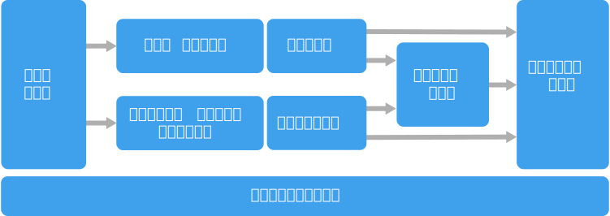

# ビッグ データ アーキテクチャのスタイルBig data architecture style

ビッグ データ アーキテクチャは、従来のデータベース システムには多すぎる、または複雑すぎるデータのインジェスト、処理、分析を扱うために設計されています。A big data architecture is designed to handle the ingestion, processing, and analysis of data that is too large or complex for traditional database systems.

ビッグ データ ソリューションには、通常は、次の種類のワークロードが 1 つ以上関係しています。Big data solutions typically involve one or more of the following types of workload:

- 保存されているビッグ データ ソースのバッチ処理。Batch processing of big data sources at rest.
- 動作中のビッグ データのリアルタイム処理。Real-time processing of big data in motion.
- ビッグ データの対話型探索。Interactive exploration of big data.
- 予測分析と機械学習。Predictive analytics and machine learning.

大部分のビッグ データ アーキテクチャには、次のコンポーネントの一部またはすべてが含まれています。Most big data architectures include some or all of the following components:

- **データ ソース**:すべてのビッグ データ ソリューションは、1 つ以上のデータ ソースから始まります。**Data sources**: All big data solutions start with one or more data sources. たとえば、次のようになります。Examples include:

  - リレーショナル データベースなど、アプリケーション データ ストア。Application data stores, such as relational databases.
  - Web サーバー ログ ファイルなど、アプリケーションによって生成された静的ファイル。Static files produced by applications, such as web server log files.
  - IoT デバイスなど、リアルタイムのデータ ソース。Real-time data sources, such as IoT devices.

- **データ ストレージ**:バッチ処理操作のためのデータは、通常は、さまざまな形式の大きなファイルを大量に保持できる分散ファイル ストアに保存されます。**Data storage**: Data for batch processing operations is typically stored in a distributed file store that can hold high volumes of large files in various formats. この種のストアは、*Data Lake* とも呼ばれます。This kind of store is often called a *data lake*. このストレージを実装するための選択肢としては、Azure Data Lake Store、または Azure Storage 内の BLOB コンテナーなどがあります。Options for implementing this storage include Azure Data Lake Store or blob containers in Azure Storage.

- **バッチ処理**:データ セットは非常に大きいため、多くの場合、ビッグ データ ソリューションでは、実行時間の長いバッチ ジョブの使用によってデータ ファイルを処理し、フィルター処理や集計を行うなどして分析用のデータを準備する必要があります。**Batch processing**: Because the data sets are so large, often a big data solution must process data files using long-running batch jobs to filter, aggregate, and otherwise prepare the data for analysis. 通常、これらのジョブには、ソース ファイルの読み取り、ソース ファイルの処理、新しいファイルへの出力の書き込みが含まれます。Usually these jobs involve reading source files, processing them, and writing the output to new files. 選択肢には、Azure Data Lake Analytics での U-SQL ジョブの実行、HDInsight Hadoop クラスターでの Hive、Pig、またはカスタム Map/Reduce ジョブの使用、あるいは HDInsight Spark クラスターでの Java、Scala、または Python プログラムの使用などがあります。Options include running U-SQL jobs in Azure Data Lake Analytics, using Hive, Pig, or custom Map/Reduce jobs in an HDInsight Hadoop cluster, or using Java, Scala, or Python programs in an HDInsight Spark cluster.

- **リアルタイム メッセージ取り込み**:ソリューションにリアルタイム ソースが含まれている場合は、アーキテクチャに、ストリーム処理のためにリアルタイム メッセージを取得して保存する方法が含まれている必要があります。**Real-time message ingestion**: If the solution includes real-time sources, the architecture must include a way to capture and store real-time messages for stream processing. これは、受信メッセージを処理用のフォルダーにドロップするような、単純なデータ ストアにすることもできます。This might be a simple data store, where incoming messages are dropped into a folder for processing. ただし、多くのソリューションには、メッセージのためのバッファーとして機能し、スケールアウト処理、信頼性の高い配信、その他のメッセージ キューのセマンティクスをサポートするメッセージ インジェスト ストアが必要です。However, many solutions need a message ingestion store to act as a buffer for messages, and to support scale-out processing, reliable delivery, and other message queuing semantics. 選択肢には、Azure Event Hubs、Azure IoT Hubs、Kafka などがあります。Options include Azure Event Hubs, Azure IoT Hubs, and Kafka.

- **ストリーム処理**:このソリューションでは、リアルタイム メッセージを取得した後、分析用にデータをフィルターしたり、集計したり、その他の準備を行ったりして、それらのメッセージを処理する必要があります。**Stream processing**: After capturing real-time messages, the solution must process them by filtering, aggregating, and otherwise preparing the data for analysis. 処理されたストリーム データは、その後、出力シンクに書き込まれます。The processed stream data is then written to an output sink. Azure Stream Analytics では、バインドされていないストリームを操作する SQL クエリの絶え間ない実行に基づいて、管理されたストリーム処理サービスが提供されます。Azure Stream Analytics provides a managed stream processing service based on perpetually running SQL queries that operate on unbounded streams. HDInsight クラスターで、Storm や Spark Streaming など、オープン ソースの Apache ストリーミング テクノロジを使用することもできます。You can also use open source Apache streaming technologies like Storm and Spark Streaming in an HDInsight cluster.

- **分析データ ストア**:多くのビッグ データ ソリューションでは、分析用にデータが準備されてから、処理されたデータが提供されます。このデータは分析ツールを使用して照会可能な、構造化された形式になります。**Analytical data store**: Many big data solutions prepare data for analysis and then serve the processed data in a structured format that can be queried using analytical tools. これらのクエリの処理に使用する分析データ ストアは、従来のほとんどのビジネス インテリジェンス (BI) ソリューションに見られるように、Kimball スタイルのリレーショナル データ ウェアハウスにすることができます。The analytical data store used to serve these queries can be a Kimball-style relational data warehouse, as seen in most traditional business intelligence (BI) solutions. 別の方法としては、HBase などの待機時間の短い NoSQL テクノロジや、分散データ ストア内のデータ ファイル上のメタデータ抽象化を提供する対話型 Hive データベースを通じて、データを利用できます。Alternatively, the data could be presented through a low-latency NoSQL technology such as HBase, or an interactive Hive database that provides a metadata abstraction over data files in the distributed data store. Azure SQL Data Warehouse では、クラウドベースの大規模なデータ ウェアハウスのための、管理されたサービスが提供されます。Azure SQL Data Warehouse provides a managed service for large-scale, cloud-based data warehousing. HDInsight では対話型の Hive、HBase、Spark SQL をサポートしており、これらを使用して分析用のデータを処理することもできます。HDInsight supports Interactive Hive, HBase, and Spark SQL, which can also be used to serve data for analysis.

- **分析とレポート**:ほとんどのビッグ データ ソリューションの目的は、分析とレポートによってデータに関する実用的な情報を提供することにあります。**Analysis and reporting**: The goal of most big data solutions is to provide insights into the data through analysis and reporting. ユーザーによるデータ分析を支援するために、Azure Analysis Services での多次元 OLAP キューブまたは表形式データ モデルなどのデータ モデリング レイヤーをアーキテクチャに組み込むことができます。To empower users to analyze the data, the architecture may include a data modeling layer, such as a multidimensional OLAP cube or tabular data model in Azure Analysis Services. Microsoft Power BI または Microsoft Excel 内のモデリング テクノロジおよび視覚化テクノロジを使用して、セルフサービス BI をサポートすることもできます。It might also support self-service BI, using the modeling and visualization technologies in Microsoft Power BI or Microsoft Excel. 分析とレポートは、データ サイエンティストやデータ アナリストによる対話型のデータ探索の形で行うこともできます。Analysis and reporting can also take the form of interactive data exploration by data scientists or data analysts. これらのシナリオでは、多くの Azure サービスで Jupyter などの分析ノートブックがサポートされており、そのユーザーは Python や R に関する既存のスキルを活用できます。大規模なデータ探索の場合は、Microsoft R Server をスタンドアロンでも、Spark と組み合わせても使用できます。For these scenarios, many Azure services support analytical notebooks, such as Jupyter, enabling these users to leverage their existing skills with Python or R. For large-scale data exploration, you can use Microsoft R Server, either standalone or with Spark.

- **オーケストレーション**:ほとんどのビッグ データ ソリューションはデータの反復処理操作で構成されており、ワークフロー内でカプセル化されています。この処理操作では、ソース データの変換や複数のソースとシンクとの間でのデータ移動、処理されたデータの分析データ ストアへの読み込み、レポートまたはダッシュボードへのダイレクトな結果のプッシュが行われます。**Orchestration**: Most big data solutions consist of repeated data processing operations, encapsulated in workflows, that transform source data, move data between multiple sources and sinks, load the processed data into an analytical data store, or push the results straight to a report or dashboard. これらのワークフローを自動化するために、Azure Data Factory や Apache Oozie および Sqoop などのオーケストレーション テクノロジを使用できます。To automate these workflows, you can use an orchestration technology such Azure Data Factory or Apache Oozie and Sqoop.

Azure には、ビッグ データ アーキテクチャで使用できる数多くのサービスがあります。Azure includes many services that can be used in a big data architecture. それらは、ほぼ次の 2 つのカテゴリに分類されます。They fall roughly into two categories:

- Azure Data Lake Store、Azure Data Lake Analytics、Azure Data Warehouse、Azure Stream Analytics、Azure Event Hub、Azure IoT Hub、Azure Data Factory などの、管理されたサービス。Managed services, including Azure Data Lake Store, Azure Data Lake Analytics, Azure Data Warehouse, Azure Stream Analytics, Azure Event Hub, Azure IoT Hub, and Azure Data Factory.
- HDFS、HBase、Hive、Pig、Spark、Storm、Oozie、Sqoop、Kafka などの、Apache Hadoop プラットフォームを基盤とするオープン ソース テクノロジ。Open source technologies based on the Apache Hadoop platform, including HDFS, HBase, Hive, Pig, Spark, Storm, Oozie, Sqoop, and Kafka. これらのテクノロジは、Azure 上の Azure HDInsight サービス内で利用できます。These technologies are available on Azure in the Azure HDInsight service.

これらの選択肢は相互に排他的ではなく、多くのソリューションでは、Azure サービスとオープン ソース テクノロジが組み合わされています。These options are not mutually exclusive, and many solutions combine open source technologies with Azure services.

## このアーキテクチャを使用する状況When to use this architecture

次のことが必要な場合は、このアーキテクチャ スタイルの使用を検討してください。Consider this architecture style when you need to:

- 従来のデータベースには多すぎる、大量のデータを保存および処理する。Store and process data in volumes too large for a traditional database.
- 分析とレポートのために非構造化データを変換する。Transform unstructured data for analysis and reporting.
- リアルタイムで、または短い待機時間で、バインドされていないデータ ストリームを取得、処理、分析する。Capture, process, and analyze unbounded streams of data in real time, or with low latency.
- Azure Machine Learning または Microsoft Cognitive Services を使用する。Use Azure Machine Learning or Microsoft Cognitive Services.

## メリットBenefits

- **テクノロジの選択**。**Technology choices**. HDInsight クラスター内で Azure の管理されたサービスと Apache テクノロジを組み合わせて適合させることで、既存のスキルやテクノロジへの投資を有効に活用できます。You can mix and match Azure managed services and Apache technologies in HDInsight clusters, to capitalize on existing skills or technology investments.
- **並列処理によるパフォーマンス**。**Performance through parallelism**. ビッグ データ ソリューションでは並列処理の強みを活かして、大量のデータをスケーリングする高パフォーマンスのソリューションを実現できます。Big data solutions take advantage of parallelism, enabling high-performance solutions that scale to large volumes of data.
- **柔軟なスケール**。**Elastic scale**. ビッグ データ アーキテクチャ内のすべてのコンポーネントで、スケールアウトのプロビジョニングがサポートされています。このサポートにより、ご自分のソリューションをワークロードの規模に合わせて調整でき、しかも使用した分のリソースにしか料金がかかりません。All of the components in the big data architecture support scale-out provisioning, so that you can adjust your solution to small or large workloads, and pay only for the resources that you use.
- **既存のソリューションとの相互運用性**。**Interoperability with existing solutions**. ビッグ データ アーキテクチャのコンポーネントは、IoT 処理および企業向けの BI ソリューションにも使用されており、お客様がすべてのデータ ワークロードにわたる統合されたソリューションを作成できるようにします。The components of the big data architecture are also used for IoT processing and enterprise BI solutions, enabling you to create an integrated solution across data workloads.

## 課題Challenges

- **複雑さ**。**Complexity**. ビッグ データ ソリューションは、多数のコンポーネントで複数のデータ ソースからのデータ インジェストを処理するため、非常に複雑になる可能性があります。Big data solutions can be extremely complex, with numerous components to handle data ingestion from multiple data sources. ビッグ データ プロセスの構築、テスト、トラブルシューティングは、困難を伴う場合があります。It can be challenging to build, test, and troubleshoot big data processes. その上、パフォーマンスを最適化するために使用する構成の設定が、大量かつ複数のシステムにわたって必要になる可能性があります。Moreover, there may be a large number of configuration settings across multiple systems that must be used in order to optimize performance.
- **スキルセット**。**Skillset**. 多くのビッグ データ テクノロジは、非常に専門化されており、より一般的なアプリケーション アーキテクチャではあまり使用されていないフレームワークと言語を使用しています。Many big data technologies are highly specialized, and use frameworks and languages that are not typical of more general application architectures. 一方で、ビッグ データ テクノロジは、確立されたより多くの言語を基に構築された、新しい API を発展させています。On the other hand, big data technologies are evolving new APIs that build on more established languages. たとえば、Azure Data Lake Analytics での U-SQL 言語は、Transact-SQL と C# の組合せが基盤になっています。For example, the U-SQL language in Azure Data Lake Analytics is based on a combination of Transact-SQL and C#. 同様に、SQL ベースの API を Hive、HBase、Spark で使用できます。Similarly, SQL-based APIs are available for Hive, HBase, and Spark.
- **テクノロジの成熟度**。**Technology maturity**. ビッグ データで使用されるテクノロジの多くは、進化しています。Many of the technologies used in big data are evolving. Hive や Pig などの主要な Hadoop テクノロジが安定しているのに対して、Spark などの新興テクノロジでは、新たなリリースのたびに大幅な変更と改良が採用されます。While core Hadoop technologies such as Hive and Pig have stabilized, emerging technologies such as Spark introduce extensive changes and enhancements with each new release. Azure Data Lake Analytics や Azure Data Factory などの管理されたサービスは、他の Azure サービスと比べて比較的新しく、時間と共に進化する可能性があります。Managed services such as Azure Data Lake Analytics and Azure Data Factory are relatively young, compared with other Azure services, and will likely evolve over time.
- **セキュリティ**。**Security**. ビッグ データ ソリューションは、通常は、一元化された Data Lake へのすべての静的データの保存に頼っています。Big data solutions usually rely on storing all static data in a centralized data lake. このデータへのアクセスを保護することが課題となる可能性があります。特に、データを複数のアプリケーションとプラットフォームでインジェストして使用される必要がある場合には、それが顕著になります。Securing access to this data can be challenging, especially when the data must be ingested and consumed by multiple applications and platforms.

## ベスト プラクティスBest practices

- **並行処理の活用**。**Leverage parallelism**. 大部分のビッグ データ処理テクノロジでは、複数の処理単位にわたり、ワークロードが分散されます。Most big data processing technologies distribute the workload across multiple processing units. このためには、分割可能な形式で静的なデータ ファイルを作成し保存することが必要です。This requires that static data files are created and stored in a splittable format. HDFS などの分散ファイル システムでは、読み取りと書き込みのパフォーマンスを最適化できます。実際の処理は、複数のクラスター ノードで並列的に実行されることで、全体的なジョブの時間は短縮されます。Distributed file systems such as HDFS can optimize read and write performance, and the actual processing is performed by multiple cluster nodes in parallel, which reduces overall job times.

- **データのパーティション分割**。**Partition data**. バッチ処理は、通常は、週次や月次など、定期的なスケジュールで行われます。Batch processing usually happens on a recurring schedule &mdash; for example, weekly or monthly. 処理スケジュールに一致するテンポラルの期間に基づいて、データ ファイルや、テーブルなどのデータ構造をパーティション分割します。Partition data files, and data structures such as tables, based on temporal periods that match the processing schedule. これにより、データ インジェストやジョブ スケジューリングが簡略化され、障害のトラブルシューティングが簡単になります。That simplifies data ingestion and job scheduling, and makes it easier to troubleshoot failures. また、Hive、U-SQL、または SQL クエリで使用されるテーブルをパーティション分割すると、クエリ パフォーマンスが大幅に向上します。Also, partitioning tables that are used in Hive, U-SQL, or SQL queries can significantly improve query performance.

- **読み取り時のスキーマのセマンティクスの適用**。**Apply schema-on-read semantics**. Data Lake を使用すると、構造化、半構造化、非構造化のいずれであるかに関係なく、複数の形式のファイル用にストレージを結合できます。Using a data lake lets you to combine storage for files in multiple formats, whether structured, semi-structured, or unstructured. データ保存時ではなくデータ処理時にデータにスキーマが投影される、*読み取り時のスキーマ*のセマンティクスを使用します。Use *schema-on-read* semantics, which project a schema onto the data when the data is processing, not when the data is stored. このことで、ソリューションに柔軟性が組み込まれ、データ検証と型チェックによって起こる、データ インジェスト中のボトルネックを防ぐことができます。This builds flexibility into the solution, and prevents bottlenecks during data ingestion caused by data validation and type checking.

- **適所でのデータの処理**。**Process data in-place**. 従来の BI ソリューションでは、多くの場合、データ ウェアハウスにデータを移動するのに、抽出、変換、読み込み (ETL) のプロセスが使用されます。Traditional BI solutions often use an extract, transform, and load (ETL) process to move data into a data warehouse. 大量のデータとさまざまな種類の形式が使用されるビッグ データ ソリューションでは、一般に、変換、抽出、読み込み (TEL) など、ETL が変化したものが使用されます。With larger volumes data, and a greater variety of formats, big data solutions generally use variations of ETL, such as transform, extract, and load (TEL). この方法では、データは分散データ ストア内で処理され、必要な構造に変換されてから分析データ ストアに移動されます。With this approach, the data is processed within the distributed data store, transforming it to the required structure, before moving the transformed data into an analytical data store.

- **使用率と時間的なコストの均衡化**。**Balance utilization and time costs**. バッチ処理ジョブの場合は、コンピューティング ノードの単位あたりのコストと、それらのノードを使用してジョブを完了する 1 分あたりのコストという、2 つの要因を考慮することが重要です。For batch processing jobs, it's important to consider two factors: The per-unit cost of the compute nodes, and the per-minute cost of using those nodes to complete the job. たとえば、1 つのバッチ ジョブが、4 つのクラスター ノードで 8 時間かけて行われるとします。For example, a batch job may take eight hours with four cluster nodes. ただし、そのジョブでは最初の 2 時間のみ 4 つすべてのノードが使用され、それ以降は、2 つのノードのみが必要になるということがわかったとします。However, it might turn out that the job uses all four nodes only during the first two hours, and after that, only two nodes are required. その場合は、すべてのジョブを 2 つのノードで実行すると、ジョブの合計時間は長くなりますが倍にはならないため、総コストは低くなります。In that case, running the entire job on two nodes would increase the total job time, but would not double it, so the total cost would be less. 一部のビジネス シナリオでは、使用率の低いクラスター リソースの使用にかかるコストが高くつくよりも、処理時間が長くなるほうが好まれる場合もあります。In some business scenarios, a longer processing time may be preferable to the higher cost of using under-utilized cluster resources.

- **クラスター リソースの分離**。**Separate cluster resources**. HDInsight クラスターをデプロイするときは、通常は、ワークロードの種類ごとに別個のクラスター リソースをプロビジョニングしてパフォーマンスを向上させます。When deploying HDInsight clusters, you will normally achieve better performance by provisioning separate cluster resources for each type of workload. たとえば、Spark クラスターには Hive が含まれますが、Hive と Spark の両方で大規模な処理を実行する必要がある場合は、Spark および Hadoop 専用のクラスターを別々にデプロイすることを検討する必要があります。For example, although Spark clusters include Hive, if you need to perform extensive processing with both Hive and Spark, you should consider deploying separate dedicated Spark and Hadoop clusters. 同様に、待機時間の短いストリーム処理に HBase と Storm を、バッチ処理に Hive を使用している場合は、Storm、HBase、Hadoop のために別個のクラスターを使用することを検討してください。Similarly, if you are using HBase and Storm for low latency stream processing and Hive for batch processing, consider separate clusters for Storm, HBase, and Hadoop.

- **データ インジェストの調整**。**Orchestrate data ingestion**. 場合によっては、既存のビジネス アプリケーションが、バッチ処理のためのデータ ファイルを Azure Storage Blob コンテナーに直接書き込むことができ、そこで、そのデータ ファイルを HDInsight または Azure Data Lake Analytics で使用できます。In some cases, existing business applications may write data files for batch processing directly into Azure storage blob containers, where they can be consumed by HDInsight or Azure Data Lake Analytics. ただし、多くの場合、オンプレミスまたは外部のデータ ソースから Data Lake へのデータのインジェストを調整する必要があります。However, you will often need to orchestrate the ingestion of data from on-premises or external data sources into the data lake. 予測可能な一元的に管理できる方法でこれを実現するには、Azure Data Factory や Oozie でサポートされているようなオーケストレーション ワークフローまたはパイプラインを使用します。Use an orchestration workflow or pipeline, such as those supported by Azure Data Factory or Oozie, to achieve this in a predictable and centrally manageable fashion.

- **機密性の高いデータの早期の除外**。**Scrub sensitive data early**. データ インジェスト ワークフローでは、プロセスの早い段階で機密性の高いデータを除外して、Data Lake に保存しないようにする必要があります。The data ingestion workflow should scrub sensitive data early in the process, to avoid storing it in the data lake.

## IoT アーキテクチャIoT architecture

モノのインターネット (IoT) は、ビッグ データ ソリューションの中の特殊なサブセットです。Internet of Things (IoT) is a specialized subset of big data solutions. 次の図は、IoT で考えられる論理アーキテクチャを示しています。The following diagram shows a possible logical architecture for IoT. この図では、アーキテクチャのイベント ストリーミング コンポーネントが強調されています。The diagram emphasizes the event-streaming components of the architecture.

**クラウド ゲートウェイ**が、信頼性の高い低待機時間のメッセージング システムを使用して、クラウドの境界でデバイスのイベントを取り込みます。The **cloud gateway** ingests device events at the cloud boundary, using a reliable, low latency messaging system.

デバイスは、クラウド ゲートウェイに直接イベントを送信するか、**フィールド ゲートウェイ**を介して送信します。Devices might send events directly to the cloud gateway, or through a **field gateway**. フィールド ゲートウェイは特殊なデバイスまたはソフトウェアで、通常はデバイスと共に配置され、イベントを受信してクラウド ゲートウェイに転送します。A field gateway is a specialized device or software, usually colocated with the devices, that receives events and forwards them to the cloud gateway. フィールド ゲートウェイは、フィルター処理、集計、またはプロトコルの変換などの関数を実行する、ロウ デバイス イベントの前処理を行うこともあります。The field gateway might also preprocess the raw device events, performing functions such as filtering, aggregation, or protocol transformation.

取り込み後、イベントは 1 つ以上の**ストリーム プロセッサ**を経由します。それらのプロセッサは、データをルーティングしたり (ストレージへのルーティングなど)、分析やその他の処理を実行したりできます。After ingestion, events go through one or more **stream processors** that can route the data (for example, to storage) or perform analytics and other processing.

一般的な処理の種類を次に示します。The following are some common types of processing. (このリストは全てを網羅しているわけではありません。)(This list is certainly not exhaustive.)

- アーカイブまたはバッチ分析のための、コールド ストレージへのイベント データの書き込み。Writing event data to cold storage, for archiving or batch analytics.

- イベント ストリームを (ほぼ) リアルタイムで分析するホット パス分析で異常を検出し、ローリング時間枠でパターンを認識し、ストリームで特定の条件が発生した場合にアラートをトリガーする。Hot path analytics, analyzing the event stream in (near) real time, to detect anomalies, recognize patterns over rolling time windows, or trigger alerts when a specific condition occurs in the stream.

- 通知やアラームなど、デバイスからの特殊な非テレメトリ メッセージを処理。Handling special types of non-telemetry messages from devices, such as notifications and alarms.

- 機械学習。Machine learning.

網掛けのグレーのボックスに、IoT システムのコンポーネントが表示されています。これらのコンポーネントはイベント ストリーミングに直接関連はありませんが、ここでは完全を期すために盛り込んでいます。The boxes that are shaded gray show components of an IoT system that are not directly related to event streaming, but are included here for completeness.

- **デバイス レジストリ**はプロビジョニングされたデバイスのデータベースで、デバイス ID と、通常は位置情報などのデバイスのメタデータを含みます。The **device registry** is a database of the provisioned devices, including the device IDs and usually device metadata, such as location.

- **プロビジョニング API** は新しいデバイスをプロビジョニングし登録するための一般的な外部インターフェイスです。The **provisioning API** is a common external interface for provisioning and registering new devices.

- 一部の IoT ソリューションでは、**コマンドやコントロール メッセージ**をデバイスに送信できます。Some IoT solutions allow **command and control messages** to be sent to devices.

> このセクションでは IoT の概要について示しましたが、考慮すべき詳細や課題は多数あります。This section has presented a very high-level view of IoT, and there are many subtleties and challenges to consider. さらに詳細な参照アーキテクチャやディスカッションについては、「[Microsoft Azure IoT Reference Architecture (Microsoft Azure IoT 参照アーキテクチャ)][iot-ref-arch]」 (PDF ダウンロード) をご覧ください。For a more detailed reference architecture and discussion, see the [Microsoft Azure IoT Reference Architecture][iot-ref-arch] (PDF download).

## 次の手順Next steps

- [ビッグ データ アーキテクチャ](../../data-guide/big-data/index.md)の詳細を確認します。Learn more about [big data architectures](../../data-guide/big-data/index.md).

 <!-- links -->

[iot-ref-arch]: https://azure.microsoft.com/updates/microsoft-azure-iot-reference-architecture-available/
