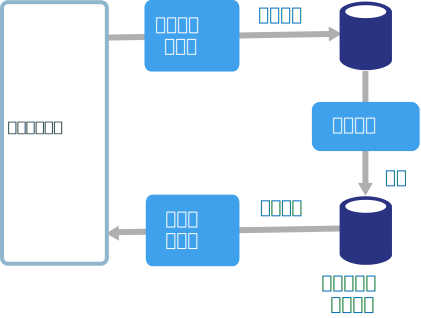
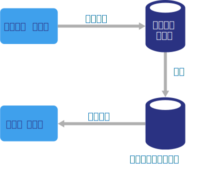

# CQRS アーキテクチャのスタイルCQRS architecture style

コマンド クエリ責務分離 (CQRS) は、読み取り操作と書き込み操作を分離するアーキテクチャ スタイルです。Command and Query Responsibility Segregation (CQRS) is an architecture style that separates read operations from write operations.

従来のアーキテクチャでは、データベースの更新とクエリに同じデータ モデルが使用されます。In traditional architectures, the same data model is used to query and update a database. このシンプルな方法は、基本的な CRUD 操作に適しています。That's simple and works well for basic CRUD operations. ただし、複雑なアプリケーションの場合、このアプローチではうまくいかないことがあります。In more complex applications, however, this approach can become unwieldy. たとえば、読み取り側でさまざまなクエリが実行され、形式の異なる複数のデータ転送オブジェクト (DTO) が返される場合もあります。For example, on the read side, the application may perform many different queries, returning data transfer objects (DTOs) with different shapes. これにより、オブジェクトのマッピングが複雑になる可能性があります。Object mapping can become complicated. また書き込み側のモデルでは、複雑な検証とビジネス ロジックが実装される可能性があります。On the write side, the model may implement complex validation and business logic. その結果、モデルが複雑になりすきる恐れがあります。As a result, you can end up with an overly complex model that does too much.

さらに、読み取りと書き込みのワークロードが不均衡になりやすいため、パフォーマンスやスケールの要件が大きく異なってくる可能性もあります。Another potential problem is that read and write workloads are often asymmetrical, with very different performance and scale requirements.

CQRS では、データを更新するための**コマンド**とデータを読み取るための**クエリ**を使用し、読み取りと書き込みを個別のモデルに分離することで、これらの問題に対処します。CQRS addresses these problems by separating reads and writes into separate models, using **commands** to update data, and **queries** to read data.

- コマンドは、データ中心ではなく、タスクベースにしますCommands should be task based, rather than data centric. (「ReservationStatus を Reserved に設定する」などではなく、「ホテルの部屋を予約する」などの形式にします)。コマンドは、同期的に処理するのではなく、非同期処理のキューに配置できます。("Book hotel room," not "set ReservationStatus to Reserved.") Commands may be placed on a queue for asynchronous processing, rather than being processed synchronously.

- クエリでは、データベースは変更されません。Queries never modify the database. クエリでは、ドメイン ナレッジをカプセル化しない DTO が返されます。A query returns a DTO that does not encapsulate any domain knowledge.

分離性を高めるために、読み取りデータと書き込みデータを物理的に分離することもできます。For greater isolation, you can physically separate the read data from the write data. その場合は、読み取りデータベースでは、クエリ用に最適化された独自のデータ スキーマを使用できます。In that case, the read database can use its own data schema that is optimized for queries. たとえば、結合や O/RM マッピングが複雑になるのを回避するために、データの[具体化されたビュー][materialized-view]を格納することもできます。For example, it can store a [materialized view][materialized-view] of the data, in order to avoid complex joins or complex O/RM mappings. また、異なる種類のデータ ストアを使用することもできます。It might even use a different type of data store. たとえば、書き込みデータベースをリレーショナルにし、読み取りデータベースをドキュメント データベースにすることもできます。For example, the write database might be relational, while the read database is a document database.

読み取りデータベースと書き込みデータベースを個別に使用する場合は、両者の同期を維持する必要があります。これは通常、データベースの更新時に書き込みモデルでイベントを発行することによって達成されます。If separate read and write databases are used, they must be kept in sync. Typically this is accomplished by having the write model publish an event whenever it updates the database. データベースの更新とイベントの発行は、単一のトランザクションで行う必要があります。Updating the database and publishing the event must occur in a single transaction.

CQRS の実装では、[イベント ソーシング パターン][event-sourcing]が使用される場合があります。Some implementations of CQRS use the [Event Sourcing pattern][event-sourcing]. このパターンを使用すると、アプリケーションの状態が一連のイベントとして格納されます。With this pattern, application state is stored as a sequence of events. 各イベントは、データに対する一連の変更を表します。Each event represents a set of changes to the data. 現在の状態は、これらのイベントを再生することによって構築されます。The current state is constructed by replaying the events. CQRS の場合、イベント ソーシングの利点の 1 つは、他のコンポーネントへの通知 (特に、読み取りモデルへの通知) に、同じイベントを使用できることです。In a CQRS context, one benefit of Event Sourcing is that the same events can be used to notify other components &mdash; in particular, to notify the read model. 読み取りモデルでは、現在の状態のスナップショットを作成するのにイベントが使用されます (そのほうが、クエリにとってより効率的です)。The read model uses the events to create a snapshot of the current state, which is more efficient for queries. ただし、イベント ソーシングを使用すると、設計がより複雑になります。However, Event Sourcing adds complexity to the design.

## このアーキテクチャを使用する状況When to use this architecture

多数のユーザーが同じデータにアクセスするコラボラティブなドメインについては、CQRS の使用を検討してください (特に、読み取りと書き込みのワークロードが不均衡な場合)。Consider CQRS for collaborative domains where many users access the same data, especially when the read and write workloads are asymmetrical.

CQRS は、システム全体に適用される最上位レベルのアーキテクチャではありません。CQRS is not a top-level architecture that applies to an entire system. CQRS は、読み取りと書き込みを分離することが効果的であるとはっきりわかっているサブシステムにのみ適用してください。Apply CQRS only to those subsystems where there is clear value in separating reads and writes. その他の場合は、複雑さが増すだけでメリットがありません。Otherwise, you are creating additional complexity for no benefit.

## メリットBenefits

- **独立してスケーリングできる**。**Independently scaling**. CQRS では、読み取りと書き込みの各ワークロードを個別にスケーリングできるので、ロック競合を減らせる可能性があります。CQRS allows the read and write workloads to scale independently, and may result in fewer lock contentions.
- **最適化されたデータ スキーマ**。**Optimized data schemas**. 読み取り側ではクエリ用に最適化されたスキーマを使用し、書き込み側では更新用に最適化されたスキーマを使用できます。The read side can use a schema that is optimized for queries, while the write side uses a schema that is optimized for updates.
- **セキュリティ**。**Security**. 適切なドメイン エンティティだけがデータへの書き込みを実行している状態を維持しやすくなります。It's easier to ensure that only the right domain entities are performing writes on the data.
- **懸念事項の分離**。**Separation of concerns**. 読み取り側と書き込み側を分離することで、モデルの保守性と柔軟性を向上できる可能性があります。Segregating the read and write sides can result in models that are more maintainable and flexible. 複雑なビジネス ロジックの多くは、書き込みモデルになります。Most of the complex business logic goes into the write model. 読み取りモデルは、比較的シンプルにすることができます。The read model can be relatively simple.
- **クエリがよりシンプル**。**Simpler queries**. 具体化されたビューを読み取りデータベースに格納することで、クエリ時の複雑な結合を回避できます。By storing a materialized view in the read database, the application can avoid complex joins when querying.

## 課題Challenges

- **複雑さ**。**Complexity**. CQRS の基本的な考え方はシンプルです。The basic idea of CQRS is simple. ただし、アプリケーションの設計は複雑になる可能性があります。このことは、イベント ソーシング パターンが含まれる場合には特に顕著です。But it can lead to a more complex application design, especially if they include the Event Sourcing pattern.

- **メッセージング**。**Messaging**. CQRS ではメッセージングは必須ではありませんが、コマンドの発行やイベントの更新を処理するためにメッセージングが使用されることもよくあります。Although CQRS does not require messaging, it's common to use messaging to process commands and publish update events. その場合には、メッセージのエラーや重複を処理する必要が生じます。In that case, the application must handle message failures or duplicate messages.

- **最終的な一貫性**。**Eventual consistency**. 読み取りデータベースと書き込みデータベースを分割すると、読み取りデータが古くなる可能性があります。If you separate the read and write databases, the read data may be stale.

## ベスト プラクティスBest practices

- CQRS の実装の詳細については、[CQRS パターン][cqrs-pattern]に関するページを参照してください。For more information about implementing CQRS, see the [CQRS pattern][cqrs-pattern].

- [イベント ソーシング][event-sourcing] パターンを使用して、更新の競合を回避することを検討してください。Consider using the [Event Sourcing][event-sourcing] pattern to avoid update conflicts.

- 読み取りモデルに[具体化されたビュー パターン][materialized-view]を使用して、クエリのスキーマを最適化することを検討してしてください。Consider using the [Materialized View pattern][materialized-view] for the read model, to optimize the schema for queries.

## マイクロサービスでのCQRSCQRS in microservices

CQRS は、[マイクロサービス アーキテクチャ][microservices]で特に役に立ちます。CQRS can be especially useful in a [microservices architecture][microservices]. マイクロサービスの原則の 1 つは、サービスから別のサービスのデータ ストアに直接アクセスできないということです。One of the principles of microservices is that a service cannot directly access another service's data store.

次の図では、サービス A がデータ ストアに書き込みを行い、サービス B が、具体化されたビューのデータを保持しています。In the following diagram, Service A writes to a data store, and Service B keeps a materialized view of the data. サービス A は、データ ストアに書き込みを行う際、必ずイベントを発行します。Service A publishes an event whenever it writes to the data store. サービス B は、そのイベントをサブスクライブします。Service B subscribes to the event.

<!-- links -->

[cqrs-pattern]: ../../patterns/cqrs.md
[event-sourcing]: ../../patterns/event-sourcing.md
[materialized-view]: ../../patterns/materialized-view.md
[microservices]: ./microservices.md
