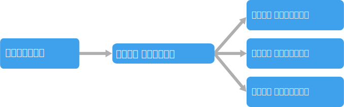

# イベント ドリブン アーキテクチャのスタイル

イベント ドリブン アーキテクチャは、イベントのストリームを生成する**イベント プロデューサー**と、イベントをリッスンする**イベント コンシューマー**で構成されます。

イベントはほぼリアルタイムで配信されるため、イベントが発生するとコンシューマーはすぐに応答できます。 プロデューサーはコンシューマーから分離されており、&mdash;プロデューサーにはどのコンシューマーがリッスンしているのかがわかりません。 コンシューマーも互いに分離されており、すべてのコンシューマーがすべてのイベントを見ることができます。 これは[競合コンシューマー][competing-consumers] パターンとは異なり、コンシューマーがキューからメッセージを取得し、メッセージは一度だけ処理されます (エラーは想定されません)。 IoT などの一部のシステムでは、イベントを大量に取り込む必要があります。

イベント ドリブン アーキテクチャでは、パブリッシュ/サブスクライブ モデルやイベント ストリーム モデルを使用できます。

- **パブリッシュ/サブスクライブ**:メッセージング インフラストラクチャではサブスクリプションを追跡します。 イベントが発行されると、各サブスクライバーにイベントが送信されます。 イベントの受信後は、イベントを再生することはできません。また、そのイベントは新しいサブスクライバーに表示されません。

- **イベント ストリーミング**:イベントがログに書き込まれます。 イベントは (パーティション内で) 厳密に順序付けされ、持続します。 クライアントはストリームにサブスクライブしませんが、その代わり、ストリームのどの部分からでも読み取ることができます。 ストリーム内でクライアントの位置を進めるのは、クライアントの役割です。 つまりクライアントはいつでも参加でき、イベントを再生できます。

コンシューマー側には、いくつかの一般的なバリエーションがあります。

- **簡単なイベント処理**。 イベントがコンシューマーのアクションを即時トリガーします。 たとえば、お客様は Service Bus トリガーを備えた Azure Functions を使用でき、それにより、Service Bus トピックにメッセージが発行されるたびに関数が実行されます。

- **複合イベント処理**。 コンシューマーは一連のイベントを処理し、Azure Stream Analytics または Apache Storm などのテクノロジを使用してイベント データのパターンを検索します。 たとえば、組み込みデバイスからの測定値を時間枠で集計し、移動平均が特定のしきい値を超えた場合に通知を生成することができます。

- **イベント ストリーム処理**. Azure IoT Hub や Apache Kafka などのデータ ストリーミング プラットフォームを、イベントを取り込んでストリーム プロセッサにフィードするパイプラインとして使用します。 ストリーム プロセッサは、ストリームの処理や変換を行います。 アプリケーションの異なるサブシステムに対して、複数のストリーム プロセッサが存在する場合があります。 この手法は IoT ワークロードに適しています。

イベントのソースはシステムの外部にある場合があります。たとえば、IoT ソリューションの物理デバイスなどです。 その場合、システムはデータ ソースで必要なボリュームとスループットでデータを取り込むことができる必要があります。

上記の図では、コンシューマーが種類ごとに 1 つのボックスで表示されています。 実際には、1 つのコンシューマーに複数のインスタンスがあるのが一般的ですが、それはコンシューマーがシステムの単一障害点にならないようにするためです。 イベントのボリュームと頻度を制御するのに、複数のインスタンスが必要になることもあります。 また、1 つのコンシューマーが複数のスレッドのイベントを処理することもあります。 イベントを順番に処理しなければならない、または正確に 1 回のセマンティクスが必要な場合には、このために課題が発生することがあります。 [「Minimize Coordination (調整を最小限に抑える)」][minimize-coordination]をご覧ください。

## このアーキテクチャを使用する状況

- 複数のサブシステムで同じイベントを処理する必要がある。
- 最小のタイム ラグのリアルタイム処理。
- パターン マッチングや時間枠での集計などの複合イベント処理。
- IoT などの高ボリューム、高ベロシティのデータ。

## メリット

- プロデューサーとコンシューマーが分離。
- ポイント ツー ポイント統合でない。 システムに新しいコンシューマーを追加するのが簡単。
- コンシューマーは、イベントが到着するとすぐに応答可能。
- 高い拡張性と分散。
- サブシステムにイベント ストリームの独立したビューがある。

## 課題

- 保証された配信。 一部のシステムでは (特に IoT シナリオで)、イベントが配信されたことを保証することが重要です。
- イベントを順番に、または正確に 1 回処理。 各コンシューマー タイプは通常、回復性とスケーラビリティのために複数のインスタンスで実行されます。 (コンシューマー タイプ内で) 順番にイベントを処理する必要がある場合や、処理ロジックがべき等でない場合は、このために課題が発生することがあります。

 <!-- links -->

[competing-consumers]: ../../patterns/competing-consumers.md
[minimize-coordination]: ../design-principles/minimize-coordination.md
