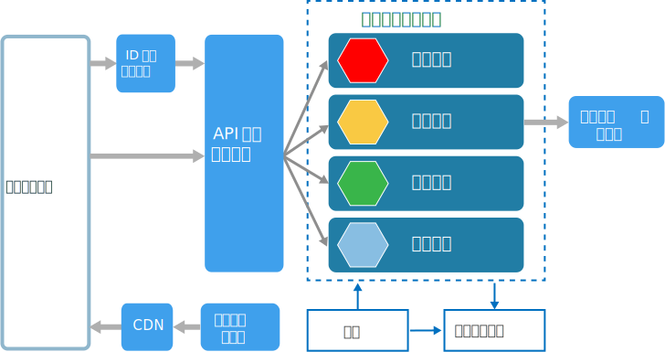
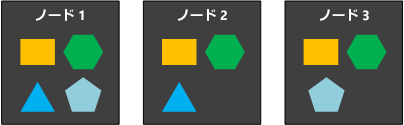

# マイクロサービス アーキテクチャ スタイル

マイクロサービス アーキテクチャは、小さな自律サービスのコレクションで構成されています。 各サービスは自己完結型であり、1 つのビジネス機能を実装している必要があります。 Azure でのマイクロサービス アーキテクチャの構築に関する詳細なガイダンスいついては、「[Azure でのマイクロサービスの設計、構築、および操作](../../microservices/index.md)」をご覧ください。

 
いくつかの点で、マイクロサービスはサービス指向アーキテクチャ (SOA) の自然な進化形と言えますが、マイクロサービスと SOA にはいくつかの違いがあります。 次に、マイクロサービスの特徴を定義します。

- マイクロサービス アーキテクチャでは、サービスは小さく、独立的で、疎結合しています。

- 各サービスは個別のコードベースであり、小規模な開発チームで管理できます。

- サービスは個別にデプロイできます。 チームは、アプリケーション全体を再構築したり再デプロイしたりすることなく、既存のサービスを更新できます。

- サービスはサービスのデータや外部の状態を保持する役割を担います。 これは、個別のデータ層でデータを保持する従来のモデルと異なる点です。

- サービスは、明確に定義された API を使用して、互いに通信します。 各サービス内部の実装の詳細は、他のサービスに開示されません。

- サービスは、同じテクノロジ スタック、ライブラリ、またはフレームワークを共有する必要はありません。

また、サービス自体については、いくつかの他のコンポーネントが次のような一般的なマイクロサービス アーキテクチャで使用されます。

**管理**。 管理コンポーネントは、ノードへのサービスの配置、障害の特定、ノード間のサービスの再調整などを行う役割を担います。  

**サービスの探索**。  サービスのリストとサービスが配置されているノードを保持します。 サービスがサービスのためにエンドポイントを探索できるようにします。 

**API ゲートウェイ**。 API ゲートウェイは、クライアントのエントリ ポイントです。 クライアントは直接サービスを呼び出すことはしません。 代わりに API ゲートウェイを呼び出し、その呼び出しをバック エンドの適切なサービスに転送します。 API ゲートウェイは、複数のサービスからの応答を集計して、集計された応答を返すことがあります。 

API ゲートウェイを使用することには次のようなメリットがあります。

- サービスからクライアントを切り離します。 サービスのバージョン管理とリファクタリングを、すべてのクライアントを更新する必要なく行うことができます。

-  サービスは、AMQP などの Web フレンドリではないメッセージング プロトコルを使用できます。

- API ゲートウェイは、認証、ログ記録、SSL 終了、負荷分散などの他の横断的な関数を実行できます。

## このアーキテクチャを使用する状況

次の場合に、このアーキテクチャ スタイルを検討してください。

- リリースの早さが要求される大規模アプリケーション。

- 高い拡張性が必要とされる複雑なアプリケーション。

- ドメインが豊富な、またはサブドメインが多いアプリケーション。

- 小規模な開発チームから構成されている組織。

## メリット 

- **独立したデプロイ**。 アプリケーション全体を再デプロイしなくてもサービスを更新できたり、問題が生じた場合に更新プログラムをロールバックまたはロールフォワードできたりします。 バグ修正プログラムと機能のリリースがより管理しやすく、リスクが低くなります。

- **独立した開発**。 1 つの開発チームでサービスのビルド、テスト、デプロイが可能です。 その結果、イノベーションを継続し、より早い周期でリリースが可能になります。 

- **集中的な小規模チーム**。 チームは 1 つのサービスに専念できます。 各サービスの範囲が狭いことでコード ベースが理解しやすく、新しいチーム メンバーを増員しやすくなります。

- **障害の分離**。 サービスがダウンしても、アプリケーション全体を停止することはありません。 ただし、無料で回復性を得られるという意味ではありません。 回復性のベスト プラクティスと設計パターンに従う必要があります。 「[Designing resilient applications for Azure (回復性に優れた Azure 用アプリケーションの設計)][resiliency-overview]」をご覧ください。

- **混在テクノロジ スタック**。 チームは、自分たちのサービスに最適なテクノロジを選択できます。 

- **詳細なスケーリング**。 サービスは個別にスケールできます。 同時に、VM あたりのサービスの密度が高いということは、VM リソースがフルに活用されるということです。 配置の制約を使用して、サービスを VM プロファイル (高 CPU、ハイ メモリなど) に合わせることができます。

## 課題

- **複雑さ**。 マイクロサービス アプリケーションは、同等のモノリシック アプリケーションよりも多くの動的パーツで構成されています。 各サービスはより単純ですが、システム全体としてはより複雑です。

- **開発とテスト**。 サービスの依存関係に対する開発では、別のアプローチが必要です。 既存のツールは、必ずしもサービスの依存関係を処理するようには設計されていません。 サービス間の境界にまたがってリファクタリングを行うことは困難です。 また、アプリケーションの進化が早い場合は特に、サービスの依存関係をテストすることは困難です。

- **ガバナンスの欠如**。 マイクロサービスを構築する際に分散アプローチをとることにはメリットがありますが、問題が発生しやすくもなります。 多くの異なる言語やフレームワークを使用するために、アプリケーションの維持が難しくなることがあります。 プロジェクト全体に適用される標準を導入する方が役立ち、チームの柔軟性を過度に制限せずに済むということもあります。 これは特に、ログ記録などの横断的な機能に適用されます。

- **ネットワークの輻輳と待機時間**。 多くの小さく細分化されたサービスを使用すると、よりインタラクティブな通信が可能になります。 また、サービスの依存関係のチェーンが長すぎる (サービス A が B を呼び出し、その B が C を呼び出すなどの) 場合、追加される待機時間が問題になることがあります。 API は慎重に設計する必要があります。 API を過度に使用することを避け、シリアル化形式について検討し、非同期通信パターンを使用する場所を探してください。

- **データ整合性**。 独自のデータを永続化する各マイクロサービスを使用します。 結果として、データの整合性をとることが難しくなることがあります。 可能であれば、最終的な整合性を優先します。

- **管理**。 マイクロサービスを成功させるには、成熟した DevOps カルチャが必要です。 サービス間で相互に関連付けられたログを記録することは難しい場合があります。 通常、ログ記録は単一のユーザー操作を要求するために複数のサービスの呼び出しを関連付ける必要があります。

- **バージョン管理**。 サービスの更新プログラムは、依存しているサービスを中断してはいけません。 複数のサービスが特定の時点で更新される場合があるため、慎重に設計しないと下位互換性または上位互換性に問題が生じる可能性があります。

- **スキルセット**。 マイクロサービスは高度な分散システムです。 成功のために必要なスキルと経験がチームにあるかどうかを慎重に評価してください。

## ベスト プラクティス

- ビジネス分野周辺のモデル サービス。 

- すべてを分散化します。 個々のチームがサービスの設計と構築を担います。 コードまたはデータのスキーマを共有しないようにします。 

- データ ストレージは、そのデータを所有するサービス専用にする必要があります。 各サービスとデータの種類に最適なストレージを使用します。 

- サービスが、適切に設計された API を介して通信するようにします。 実装の詳細が漏えいしないようにします。 API は、サービス内部の実装ではなく、ドメインをモデル化する必要があります。

- サービス間の結合は行わないようにします。 結合の原因には、共有データベース スキーマや固定の通信プロトコルなどがあります。

- 認証や SSL 終了などの横断的な懸念事項をゲートウェイにオフロードします。

- ドメインのナレッジをゲートウェイの外部で保持します。 ゲートウェイは、ビジネス ルールやドメイン ロジックのナレッジを使用せずに、クライアントの要求を処理し、ルーティングする必要があります。 そうしなければ、ゲートウェイが依存関係となり、サービス間の結合が生じる可能性があります。

- サービスには、疎結合と機能の高い凝集度が必要です。 まとめて変更される可能性がある機能は、まとめてパッケージ化してデプロイする必要があります。 それらの機能が別々のサービスに格納された場合、1 つのサービスの変更には他のサービスの更新が必要であるため、結果として密接に結合されることになります。 2 つのサービス間で過度に通信が行われると、密接な結合と低い凝集度の問題が生じる可能性があります。 

- 障害を分離します。 回復性戦略を使用して、サービス内の障害が連鎖しないようにします。 「[Resiliency patterns (回復性パターン)][resiliency-patterns]」と「[Designing resilient applications (回復性に優れたアプリケーションの設計)][resiliency-overview]」をご覧ください。

## Azure Container Service を使用したマイクロサービス 

[Azure Container Service](/azure/container-service/) を使用して、Docker クラスターを構成およびプロビジョニングできます。 Azure Container Service では、Kubernetes、DC/OS、Docker Swarm などのよく利用されているコンテナー オーケストレーターがサポートされています。

 
**公開ノード**。 公開ノードには、公開されたロード バランサーを使用してアクセスできます。 API ゲートウェイは公開ノードでホストされます。

**バックエンド ノード**。 バックエンド ノードは、クライアントが API ゲートウェイを経由してアクセスするサービスを実行します。 バックエンド ノードは、インターネット トラフィックを直接は受信しません。 バックエンド ノードには、VM の 1 つ以上のプールが、それぞれ異なるハードウェア プロファイルとともに含まれる場合があります。 たとえば、一般的なコンピューティング ワークロード、高 CPU ワークロード、ハイ メモリ ワークロードについて個別のプールを作成できます。 

**管理 VM**。 管理 VM は、コンテナー オーケストレーター用のマスター ノードを実行します。 

**ネットワーク**。 公開ノード、バックエンド ノード、管理 VM は、同じ仮想ネットワーク (VNet) 内の別のサブネットに配置されます。 

**ロード バランサー**。  外部に公開されたロード バランサーは、公開ノードの前に配置されます。 ロード バランサーは公開ノードにインターネット要求を配分します。 別のロード バランサーは管理 VM の前に配置され、NAT ルールを使用して管理 VM への Secure Shell (ssh) トラフィックを許可します。

信頼性と拡張性を確保するため、各サービスは複数の VM 間でレプリケートされます。 ただし、サービスは (モノリシック アプリケーションと比較して) 比較的軽量でもあるため、複数のサービスは通常 1 つの VM にまとめられます。 密度が高いことで、リソース使用率が向上します。 特定のサービスが多くのリソースを使用しない場合、そのサービスの実行に VM 全体を専念させる必要はありません。

次の図は、4 つの異なるサービスを実行する 3 つのノードを示しています (異なる形で示されています)。 各サービスは少なくとも 2 つのインスタンスを持っていることに注目してください。 
 

## Azure Service Fabric を使用したマイクロサービス

次の図は、[Azure Service Fabric](/azure/service-fabric/) を使用したマイクロサービス アーキテクチャを示しています。

Service Fabric クラスターは、1 つ以上の VM スケール セットにデプロイされます。 さまざまな VM の種類を混在させるために、クラスター内に 1 つ以上の VM スケール セットがある場合もあります。 API ゲートウェイは、クライアント要求を受信する外部のロード バランサーとともに、Service Fabric クラスターの前に配置されます。

Service Fabric ランタイムは、サービスの配置、ノードのフェールオーバー、正常性の監視などのクラスター管理を実行します。 このランタイムは、クラスター ノード自体にデプロイされます。 個別のクラスター管理 VM のセットはありません。

サービスは、Service Fabric に組み込まれているリバース プロキシを使用して、相互に通信します。 Service Fabric は、名前付きサービスのエンドポイントを解決できる探索サービスを提供します。

<!-- links -->

[resiliency-overview]: ../../resiliency/index.md
[resiliency-patterns]: ../../patterns/category/resiliency.md

