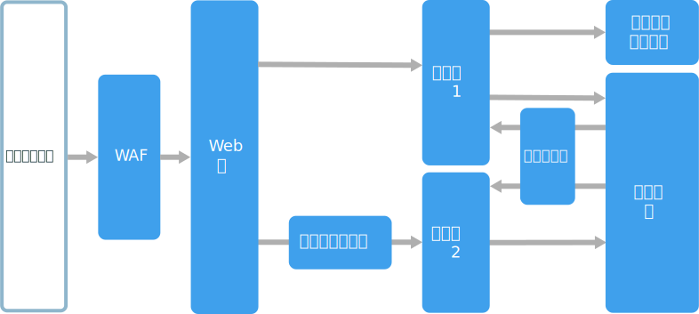

# n 層アーキテクチャのスタイルN-tier architecture style

n 層アーキテクチャは、アプリケーションを**論理レイヤー**と**物理層**に分離します。An N-tier architecture divides an application into **logical layers** and **physical tiers**. 

レイヤーは役割を切り離し、依存関係を管理する方法です。Layers are a way to separate responsibilities and manage dependencies. 各レイヤーには特定の役割があります。Each layer has a specific responsibility. 上位レイヤーは下位レイヤーのサービスを使用できますが、その逆はありません。A higher layer can use services in a lower layer, but not the other way around. 

各層は物理的に分離されており、個別のマシンで実行されます。Tiers are physically separated, running on separate machines. 層は、別の層を直接呼び出したり、非同期メッセージング (メッセージ キュー) を使用したりできます。A tier can call to another tier directly, or use asynchronous messaging (message queue). 各レイヤーはそれぞれの層でホストされることがありますが、それは必須ではありません。Although each layer might be hosted in its own tier, that's not required. 複数のレイヤーが同じ層でホストされることもあります。Several layers might be hosted on the same tier. 層を物理的に分離することで拡張性と回復性が向上しますが、ネットワーク通信が追加されると待機時間も増加します。Physically separating the tiers improves scalability and resiliency, but also adds latency from the additional network communication. 

従来の 3 層アプリケーションには、プレゼンテーション層、中間層、データベース層があります。A traditional three-tier application has a presentation tier, a middle tier, and a database tier. 中間層はオプションです。The middle tier is optional. 複雑なアプリケーションでは、層が 3 層よりも多くなることがあります。More complex applications can have more than three tiers. 上記の図は、2 つの中間層があり、異なる機能領域をカプセル化するアプリケーションを示しています。The diagram above shows an application with two middle tiers, encapsulating different areas of functionality. 

n 層アプリケーションは、**クローズド レイヤー アーキテクチャ**にすることも、**オープン レイヤー アーキテクチャ**にすることもできます。An N-tier application can have a **closed layer architecture** or an **open layer architecture**:

- クローズド レイヤー アーキテクチャでは、レイヤーは直下のレイヤーのみを呼び出すことができます。In a closed layer architecture, a layer can only call the next layer immediately down. 
- オープン アーキテクチャでは、レイヤーは下位のどのレイヤーでも呼び出すことができます。In an open layer architecture, a layer can call any of the layers below it. 

クローズド レイヤー アーキテクチャでは、レイヤー間の依存関係が制限されます。A closed layer architecture limits the dependencies between layers. ただし、レイヤーが次のレイヤーに要求をただ渡すだけでも、不要なネットワーク トラフィックが発生する可能性があります。However, it might create unnecessary network traffic, if one layer simply passes requests along to the next layer. 

## このアーキテクチャを使用する状況When to use this architecture

n 層アーキテクチャは通常、サービスとしてのインフラストラクチャ (IaaS) アプリケーションとして実装され、各層は個別の VM セットで実行されます。N-tier architectures are typically implemented as infrastructure-as-service (IaaS) applications, with each tier running on a separate set of VMs. ただし、n 層アプリケーションは純粋な IaaS である必要はありません。However, an N-tier application doesn't need to be pure IaaS. 多くの場合、アーキテクチャの一部、特にキャッシュ、メッセージング、データ ストレージに管理サービスを使用するのが有用です。Often, it's advantageous to use managed services for some parts of the architecture, particularly caching, messaging, and data storage.

n 層アーキテクチャで以下の点を考慮してください。Consider an N-tier architecture for:

- シンプルな Web アプリケーション。Simple web applications. 
- 最小限のリファクタリングでオンプレミス アプリケーションを Azure に移行。Migrating an on-premises application to Azure with minimal refactoring.
- オンプレミス アプリケーションとクラウド アプリケーションの統合開発。Unified development of on-premises and cloud applications.

n 層アーキテクチャは従来のオンプレミス アプリケーションで非常によく使用されているため、既存のワークロードを Azure に移行するのにとても適しています。N-tier architectures are very common in traditional on-premises applications, so it's a natural fit for migrating existing workloads to Azure.

## メリットBenefits

- クラウドとオンプレミス間、またクラウド プラットフォーム間での移植性。Portability between cloud and on-premises, and between cloud platforms.
- ほとんどの開発者が短時間で習得。Less learning curve for most developers.
- 従来のアプリケーション モデルからの自然な進化。Natural evolution from the traditional application model.
- 異機種混在環境 (Windows と Linux) でも利用可能Open to heterogeneous environment (Windows/Linux)

## 課題Challenges

- データベースで CRUD 操作のみを行う中間層で終わらせるのが簡単なため、有効な作業を行うことなく待機時間が増えます。It's easy to end up with a middle tier that just does CRUD operations on the database, adding extra latency without doing any useful work. 
- モノリシックな設計により、機能の個別のデプロイが回避されます。Monolithic design prevents independent deployment of features.
- IaaS アプリケーションの管理は、管理サービスのみを使用するアプリケーションよりも手がかかります。Managing an IaaS application is more work than an application that uses only managed services. 
- 大規模なシステムでネットワークのセキュリティを管理するのは難しいことがあります。It can be difficult to manage network security in a large system.

## ベスト プラクティスBest practices

- 自動スケールを使用して負荷の変化に対応する。Use autoscaling to handle changes in load. 「[自動スケールのベスト プラクティス][autoscaling]」をご覧ください。See [Autoscaling best practices][autoscaling].
- 非同期メッセージングを使用して層を分離する。Use asynchronous messaging to decouple tiers.
- 半静的なデータをキャッシュする。Cache semi-static data. [キャッシュのベスト プラクティス][caching]に関する記事をご覧ください。See [Caching best practices][caching].
- [SQL Server Always On 可用性グループ][sql-always-on]のようなソリューションを使用して、高可用性のデータベース層を構成する。Configure database tier for high availability, using a solution such as [SQL Server Always On Availability Groups][sql-always-on].
- フロント エンドとインターネットの間に Web アプリケーション ファイアウォール (WAF) を配置する。Place a web application firewall (WAF) between the front end and the Internet.
- 各層をそれぞれのサブネットに配置し、サブネットをセキュリティ境界として使用する。Place each tier in its own subnet, and use subnets as a security boundary. 
- 中間層からの要求のみを許可して、データ層へのアクセスを制限する。Restrict access to the data tier, by allowing requests only from the middle tier(s).

## 仮想マシンでの n 層アーキテクチャN-tier architecture on virtual machines

このセクションでは、VM で実行される推奨の n 層アーキテクチャについて説明します。This section describes a recommended N-tier architecture running on VMs. 

各層は 2 つ以上の VM で構成され、可用性セットまたは VM スケール セットに配置されます。Each tier consists of two or more VMs, placed in an availability set or VM scale set. VM を複数配置すると、1 つの VM が失敗した場合の回復性があります。Multiple VMs provide resiliency in case one VM fails. 層内の VM 間で要求を分散させるには、ロード バランサーが使用されます。Load balancers are used to distribute requests across the VMs in a tier. プールに VM を追加することで、層を水平方向にスケールできます。A tier can be scaled horizontally by adding more VMs to the pool. 

各層はそれぞれのサブネット内にも配置されますが、それは、その内部 IP アドレスが同じアドレス範囲内になることを意味します。Each tier is also placed inside its own subnet, meaning their internal IP addresses fall within the same address range. そのため、ネットワーク セキュリティ グループ (NSG) ルールを適用して個別の層にテーブルをルーティングするのが容易になります。That makes it easy to apply network security group (NSG) rules and route tables to individual tiers.

Web 層とビジネス層はステートレスです。The web and business tiers are stateless. どの VM も、その層へのあらゆる要求を処理できます。Any VM can handle any request for that tier. データ層は、レプリケートされたデータベースで構成されます。The data tier should consist of a replicated database. Windows の場合は、SQL Server で Always On 可用性グループを使用して高可用性を実現することをお勧めします。For Windows, we recommend SQL Server, using Always On Availability Groups for high availability. Linux の場合は、Apache Cassandra などの、レプリケーションをサポートするデータベースを選択します。For Linux, choose a database that supports replication, such as Apache Cassandra. 

ネットワーク セキュリティ グループ (NSG) により、各層へのアクセスを制限します。Network Security Groups (NSGs) restrict access to each tier. たとえば、データベース層ではビジネス層からのアクセスのみが許可されます。For example, the database tier only allows access from the business tier.

詳細について、また配置可能な Resource Manager テンプレートについては、次の参照アーキテクチャをご覧ください。For more details and a deployable Resource Manager template, see the following reference architectures:

- [Run Windows VMs for an N-tier application (n 層アプリケーションの Windows VM を実行する)][n-tier-windows][Run Windows VMs for an N-tier application][n-tier-windows]
- [Run Linux VMs for an N-tier application (n 層アプリケーションの Linux VM を実行する)][n-tier-linux][Run Linux VMs for an N-tier application][n-tier-linux]

### 追加の考慮事項Additional considerations

- n 層アーキテクチャは 3 層に制限されているわけではありません。N-tier architectures are not restricted to three tiers. 複雑なアプリケーションの場合は、さらに層が増えるのが一般的です。For more complex applications, it is common to have more tiers. その場合は、レイヤー 7 ルーティングを使用して特定の層に要求をルートすることを検討してください。In that case, consider using layer-7 routing to route requests to a particular tier.

- 層は拡張性、信頼性、セキュリティの境界です。Tiers are the boundary of scalability, reliability, and security. これらの領域で異なる要件を持つ各サービスには、個別の層を使用することを検討してください。Consider having separate tiers for services with different requirements in those areas.

- 自動スケールには、VM Scale Sets を使用してください。Use VM Scale Sets for autoscaling.

- 大幅にリファクタリングせずに管理サービスを使用できる、アーキテクチャ内の場所を探してください。Look for places in the architecture where you can use a managed service without significant refactoring. 具体的には、キャッシュ、メッセージング、ストレージ、データベースを確認してください。In particular, look at caching, messaging, storage, and databases. 

- セキュリティを高めるために、アプリケーションの前にネットワーク DMZ を配置してください。For higher security, place a network DMZ in front of the application. DMZ には、ファイアウォールやパケット検査などのセキュリティ機能を実装する、ネットワーク仮想アプライアンス (NVA) が含まれています。The DMZ includes network virtual appliances (NVAs) that implement security functionality such as firewalls and packet inspection. 詳細については、[ネットワーク DMZ 参照アーキテクチャ][dmz]に関する記事をご覧ください。For more information, see [Network DMZ reference architecture][dmz].

- 高可用性のために、可用性セットに複数の NVA を配置してください。外部のロード バランサーを使用して、インターネット要求をインスタンス間で分散させてください。For high availability, place two or more NVAs in an availability set, with an external load balancer to distribute Internet requests across the instances. 詳細については、「[Deploy highly available network virtual appliances (高可用性ネットワーク仮想アプライアンスのデプロイ)][ha-nva]」をご覧ください。For more information, see [Deploy highly available network virtual appliances][ha-nva].

- アプリケーション コードを実行している VM には、RDP または SSH から直接アクセスできないようにしてください。Do not allow direct RDP or SSH access to VMs that are running application code. その代わりに、オペレーターは要塞ホストとも呼ばれる JumpBox にログインする必要があります。Instead, operators should log into a jumpbox, also called a bastion host. これは、管理者が他の VM への接続に使用するネットワーク上の VM です。This is a  VM on the network that administrators use to connect to the other VMs. JumpBox には、承認されたパブリック IP アドレスからの RDP または SSH のみを許可する NSG があります。The jumpbox has an NSG that allows RDP or SSH only from approved public IP addresses.

- サイト間の仮想プライベート ネットワーク (VPN) または Azure ExpressRoute を使用して、Azure 仮想ネットワークをお客様のオンプレミス ネットワークに拡張できます。You can extend the Azure virtual network to your on-premises network using a site-to-site virtual private network (VPN) or Azure ExpressRoute. 詳細については、[ハイブリッド ネットワーク 参照アーキテクチャ][hybrid-network]に関する記事をご覧ください。For more information, see [Hybrid network reference architecture][hybrid-network].

- お客様の組織が Active Directory を使用して ID を管理している場合、Active Directory 環境を Azure VNet に拡張できます。If your organization uses Active Directory to manage identity, you may want to extend your Active Directory environment to the Azure VNet. 詳細については、[ID 管理参照アーキテクチャ][identity]に関する記事をご覧ください。For more information, see [Identity management reference architecture][identity].

- VM の Azure SLA で提供されるよりも高い可用性が必要な場合は、アプリケーションを 2 つのリージョンにレプリケートして、Azure Traffic Manager を使用してフェールオーバーを行います。If you need higher availability than the Azure SLA for VMs provides, replicate the application across two regions and use Azure Traffic Manager for failover. 詳細については、[複数リージョンでの Windows VM の実行][ multiregion-windows]、または[複数リージョンでの Linux VM の実行][multiregion-linux]に関する記事をご覧ください。For more information, see [Run Windows VMs in multiple regions][multiregion-windows] or [Run Linux VMs in multiple regions][multiregion-linux].

[autoscaling]: ../../best-practices/auto-scaling.md
[caching]: ../../best-practices/caching.md
[dmz]: ../../reference-architectures/dmz/index.md
[ha-nva]: ../../reference-architectures/dmz/nva-ha.md
[hybrid-network]: ../../reference-architectures/hybrid-networking/index.md
[identity]: ../../reference-architectures/identity/index.md
[multiregion-linux]: ../../reference-architectures/virtual-machines-linux/multi-region-application.md
[multiregion-windows]: ../../reference-architectures/virtual-machines-windows/multi-region-application.md
[n-tier-linux]: ../../reference-architectures/virtual-machines-linux/n-tier.md
[n-tier-windows]: ../../reference-architectures/virtual-machines-windows/n-tier.md
[sql-always-on]: /sql/database-engine/availability-groups/windows/always-on-availability-groups-sql-server