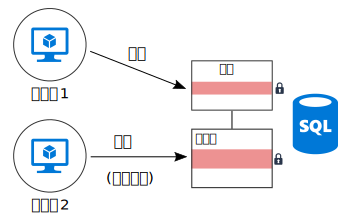
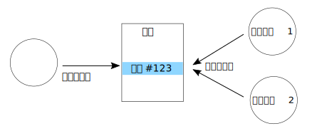

# 調整を最小限に抑える 

## アプリケーション サービス間の調整を最小限に抑えてスケーラビリティを実現する

ほとんどのクラウド アプリケーションは、複数のアプリケーション サービスで構成されています&mdash;Web フロント エンド、データベース、ビジネス プロセス、レポートおよび分析などです。 スケーラビリティと信頼性を実現するには、それらのサービスの各々を複数のインスタンスで実行する必要があります。 

2 つのインスタンスが、共有状態に影響する操作を同時に実行しようとすると、どうなるでしょうか。 場合によっては、たとえば、ACID 保証を維持するために、ノード間で調整の必要があります。 この図では、`Node2` は `Node1` がデータベース ロックを解放するのを待っています。

調整は水平スケールの利点を制限し、ボトルネックを作り出します。 この例では、アプリケーションをスケールアウトしてより多くのインスタンスを追加すると、ロックの競合が増加することがわかります。 最悪の場合、フロント エンド インスタンスはほとんどの時間をロック待機に費やします。

"1 回限り" のセマンティクスは、もう 1 つのよくある調整の発生源です。 たとえば、1 つの注文は 1 回だけ処理されなければいけません。 2 つのワーカーが新しい注文をリッスンしています。 `Worker1` は、1 つの注文を処理するために取得します。 アプリケーションは `Worker2` がこの作業を重複しないように、しかしまた、もし `Worker1` がクラッシュしたらこの注文が抜け落ちないようにする必要があります。

[Scheduler Agent Supervisor][sas-pattern] のようなパターンを使用してワーカー間を調整することができますが、ここでは、作業を分割するのがより適切な方法かもしれません。 各ワーカーには、注文の特定の範囲 (たとえば、請求先リージョンごと) が割り当てられます。 ワーカーがクラッシュした場合、新しいインスタンスは直前のインスタンスが中断された場所を取得しますが、複数のインスタンスは競合しません。

## 推奨事項

**最終的な整合性の受容**。 データを分散すると、強力な整合性を保証するには調整が必要になります。 たとえば、1 つの操作が 2 つのデータベースを更新するとします。 1 つのトランザクション スコープに入れるのではなく、そのシステムが最終的な整合性に対応できるのであれば (おそらく[補正トランザクション][compensating-transaction]パターンを使用して)、エラーの後に論理的にロールバックするほうがよいでしょう。

**ドメイン イベントを使用した状態の同期**。 [ドメイン イベント][domain-event]は、ドメイン内で重要な出来事が発生したときに記録するイベントです。 対象サービスは、グローバル トランザクションを使用して複数サービスを調整するのではなく、このイベントをリッスンすることができます。 この手法を使用する場合、システムは最終的な整合性を許容する必要があります (前の項目を参照してください)。 

**CQRS およびイベント ソーシングなどのパターンの検討**。 これら 2 つのパターンは、読み取りワークロードと書き込みワークロードの競合を削減するのに役立ちます。 

- [CQRS パターン][cqrs-pattern]は、書き込み操作と読み取り操作を分けます。 一部の実装では、読み取りデータは書き込みデータから物理的に分離されます。 

- [イベント ソーシングのパターン][event-sourcing]では、状態の変更は、一連のイベントとして追加専用のデータ ストアに記録されます。 ストリームへのイベント追加はアトミック操作であり、最小限のロックを必要とします。 

これら 2 つのパターンは、相互に補完します。 CQRS の書き込み専用ストアでイベント ソーシングを使用する場合は、読み取り専用ストアは同じイベントをリッスンして、クエリ用に最適化された、現在の状態の読み取り可能なスナップショットを作成することができます。 ただし、CQRS またはイベント ソーシングを採用するときは、この手法についての課題に注意してください。 詳細については、[CQRS アーキテクチャ スタイル][cqrs-style]に関する記事をご覧ください。

**データのパーティション分割**。  すべてのデータを、多くのアプリケーション サービス間で共有されている 1 つのデータ スキーマに配置することは避けます。 マイクロサービス アーキテクチャでは、各サービスにそれ自身のデータ ストアを担当させることにより、この原則を強制します。 1 つのデータベース内では、データをシャードに分割すると同時実行を向上させることができますが、これは、1 つのシャードへ書き込むサービスは別のシャードに書き込むサービスに影響しないからです。

**べき等操作の設計**。 可能であれば、操作がべき等になるように設計します。 こうすれば、1 回以上のセマンティクスを使用して、それらを処理できます。 たとえば、1 つのキューに作業項目を配置します。 1 つの操作の途中でワーカーがクラッシュしたら、別のワーカーがその作業項目を取得するだけです。

**非同期の並列処理の使用**。 1 つの操作で、非同期に実行される複数の手順 (リモート サービスの呼び出しなど) が必要な場合は、それらを並列で呼び出してから、結果を集計することができます。 この方法では、各々の手順が直前の手順の結果に依存しないことを前提としています。   

**オプティミスティック同時実行制御の使用 (可能な場合)**。 ペシミスティック同時実行制御は、競合を防ぐためにデータベース ロックを使用します。 これはパフォーマンスの低下を発生させ、可用性を低下させる場合があります。 オプティミスティック同時実行制御では、各トランザクションは、データのコピーまたはスナップショットを変更します。 トランザクションがコミットされると、データベース エンジンはトランザクションを検証し、データベースの整合性に影響を与えるトランザクションを拒否します。 

Azure SQL Database および SQL Server は、[スナップショット分離][sql-snapshot-isolation]によってオプティミスティック同時実行制御をサポートします。 一部の Azure ストレージ サービスは、[Azure Cosmos DB][cosmosdb-faq] および [Azure Storage][storage-concurrency] を含む Etag を使用して、オプティミスティック同時実行制御をサポートします。

**MapReduce またはその他の並列の分散アルゴリズムの検討**。 実行するデータと作業の種類によっては、作業を、並行して動作する複数のノードで実行できる独立したタスクに分割することができます。 [大規模なコンピューティング アーキテクチャ スタイル][big-compute]に関する記事をご覧ください。

**調整でのリーダー選択の使用**。 操作を調整する必要がある場合、コーディネーターがアプリケーションの単一障害点にならないことを確認します。 [リーダー選択パターン][leader-election]を使用すると、1 つのインスタンスはいつでもリーダーで、コーディネーターとして機能します。 このリーダーが失敗した場合、新しいインスタンスがリーダーに選択されます。 
 

<!-- links -->

[big-compute]: ../architecture-styles/big-compute.md
[compensating-transaction]: ../../patterns/compensating-transaction.md
[cqrs-style]: ../architecture-styles/cqrs.md
[cqrs-pattern]: ../../patterns/cqrs.md
[cosmosdb-faq]: /azure/cosmos-db/faq
[domain-event]: https://martinfowler.com/eaaDev/DomainEvent.html
[event-sourcing]: ../../patterns/event-sourcing.md
[leader-election]: ../../patterns/leader-election.md
[sas-pattern]: ../../patterns/scheduler-agent-supervisor.md
[sql-snapshot-isolation]: /sql/t-sql/statements/set-transaction-isolation-level-transact-sql
[storage-concurrency]: https://azure.microsoft.com/blog/managing-concurrency-in-microsoft-azure-storage-2/