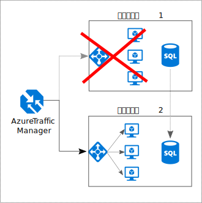

# すべてを冗長化Make all things redundant

## 単一障害点をなくすために、冗長性をアプリケーションに組み込みますBuild redundancy into your application, to avoid having single points of failure

耐障害性のあるアプリケーションでは障害が回避されます。A resilient application routes around failure. アプリケーションのクリティカル パスを特定してください。Identify the critical paths in your application. パスの各ポイントに冗長性が確保されていますか。Is there redundancy at each point in the path? サブシステムで障害が発生した場合に、アプリケーションは他にフェールオーバーしますか。If a subsystem fails, will the application fail over to something else?

## RecommendationsRecommendations

**ビジネス要件を考慮する**。**Consider business requirements**. システムにどのくらいの冗長性を組み込むかは、コストと複雑さの両方に影響します。The amount of redundancy built into a system can affect both cost and complexity. アーキテクチャには、目標復旧時間 (RTO) などのビジネス要件の情報が必要です。Your architecture should be informed by your business requirements, such as recovery time objective (RTO). たとえば、複数リージョンのデプロイは、単一リージョンのデプロイよりもコストがかかり、管理も複雑です。For example, a multi-region deployment is more expensive than a single-region deployment, and is more complicated to manage. フェールオーバーとフェールバックを処理するための操作手順が必要になります。You will need operational procedures to handle failover and failback. 追加コストと複雑さが理にかなっているかどうかは、ビジネス シナリオによって異なります。The additional cost and complexity might be justified for some business scenarios and not others.

**VM をロード バランサーの内側に配置する**。**Place VMs behind a load balancer**. ミッション クリティカルなワークロードには、単一 VM を使用しないでください。Don't use a single VM for mission-critical workloads. 代わりに、複数の VM をロード バランサーの内側に配置します。Instead, place multiple VMs behind a load balancer. VM が使用できなくなると、ロード バランサーは、残りの正常な VM にトラフィックを分散します。If any VM becomes unavailable, the load balancer distributes traffic to the remaining healthy VMs. この構成をデプロイする方法については、[スケーラビリティと可用性のための複数の VM][multi-vm-blueprint] に関するページをご覧ください。To learn how to deploy this configuration, see [Multiple VMs for scalability and availability][multi-vm-blueprint].

**データベースをレプリケートする**。**Replicate databases**. Azure SQL Database と Cosmos DB を使用すると、リージョン内でデータが自動的にレプリケートされ、リージョン間では geo レプリケーションを有効にできます。Azure SQL Database and Cosmos DB automatically replicate the data within a region, and you can enable geo-replication across regions. IaaS データベース ソリューションを使用している場合は、[SQL Server Always On 可用性グループ][sql-always-on]など、レプリケーションとフェールオーバーをサポートするものを選択します。If you are using an IaaS database solution, choose one that supports replication and failover, such as [SQL Server Always On Availability Groups][sql-always-on].

**geo レプリケーションを有効にする**。**Enable geo-replication**. [Azure SQL Database][sql-geo-replication] と [Cosmos DB][cosmosdb-geo-replication] の geo レプリケーションにより、1 つ以上のセカンダリ リージョンにデータの読み取り可能セカンダリ レプリカが作成されます。Geo-replication for [Azure SQL Database][sql-geo-replication] and [Cosmos DB][cosmosdb-geo-replication] creates secondary readable replicas of your data in one or more secondary regions. 障害発生時、データベースは書き込みのためにセカンダリ リージョンにフェールオーバーできます。In the event of an outage, the database can fail over to the secondary region for writes.

**可用性のためにパーティション分割する**。**Partition for availability**. データベース パーティション分割は、通常、スケーラビリティ向上のために使用されますが、可用性を向上させることもできます。Database partitioning is often used to improve scalability, but it can also improve availability. あるシャードがダウンしても、それ以外のシャードには引き続きアクセスできます。If one shard goes down, the other shards can still be reached. あるシャードで発生した障害によって中断されるのは、トランザクション全体のサブセットのみです。A failure in one shard will only disrupt a subset of the total transactions.

**複数のリージョンにデプロイする**。**Deploy to more than one region**. 最大の高可用性を実現するために、アプリケーションを複数のリージョンにデプロイします。For the highest availability, deploy the application to more than one region. これにより、まれではありますが、問題がリージョン全体に影響を及ぼす場合に、アプリケーションを別のリージョンにフェールオーバーできます。That way, in the rare case when a problem affects an entire region, the application can fail over to another region. 次の図は、Azure Traffic Manager を使用してフェールオーバーを処理する複数リージョン アプリケーションを示しています。The following diagram shows a multi-region application that uses Azure Traffic Manager to handle failover.

**フロントエンドおよびバックエンドのフェールオーバーを同期する**。**Synchronize front and backend failover**. Azure Traffic Manager を使用して、フロントエンドにフェールオーバーします。Use Azure Traffic Manager to fail over the front end. あるリージョンでフロントエンドにアクセスできなくなると、Traffic Manager は、新しい要求をセカンダリ リージョンにルーティングします。If the front end becomes unreachable in one region, Traffic Manager will route new requests to the secondary region. データベース ソリューションによっては、データベースのフェールオーバーの調整が必要になる場合があります。Depending on your database solution, you may need to coordinate failing over the database.

**自動フェールオーバーを使用するが、フェールバックは手動で行う**。**Use automatic failover but manual failback**. Traffic Manager は自動フェールオーバーに使用し、自動フェールバックには使用しないでください。Use Traffic Manager for automatic failover, but not for automatic failback. 自動フェールバックには、完全に正常な状態に戻る前に、プライマリ リージョンに切り替えられてしまうリスクがあります。Automatic failback carries a risk that you might switch to the primary region before the region is completely healthy. そうではなく、手動でフェールバックする前に、すべてのアプリケーション サブシステムが正常であることを確認してください。Instead, verify that all application subsystems are healthy before manually failing back. また、データベースによっては、フェールバックの前に、データの一貫性チェックが必要になる場合があります。Also, depending on the database, you might need to check data consistency before failing back.

**Traffic Manager の冗長性を確保する**。**Include redundancy for Traffic Manager**. Traffic Manager が障害ポイントになる可能性があります。Traffic Manager is a possible failure point. Traffic Manager の SLA を確認し、Traffic Manager を使用するだけで、高可用性のビジネス要件を満たすかどうかを確かめてください。Review the Traffic Manager SLA, and determine whether using Traffic Manager alone meets your business requirements for high availability. 満たさない場合は、代替システムとして他のトラフィック管理ソリューションを追加することを検討してください。If not, consider adding another traffic management solution as a failback. Azure Traffic Manager サービスで障害が発生した場合は、他のトラフィック管理サービスを参照するように、DNS の CNAME レコードを変更します。If the Azure Traffic Manager service fails, change your CNAME records in DNS to point to the other traffic management service.

<!-- links -->

[multi-vm-blueprint]: ../../reference-architectures/virtual-machines-windows/multi-vm.md

[cassandra]: https://cassandra.apache.org/
[cosmosdb-geo-replication]: /azure/cosmos-db/distribute-data-globally
[sql-always-on]: https://msdn.microsoft.com/library/hh510230.aspx
[sql-geo-replication]: /azure/sql-database/sql-database-geo-replication-overview
