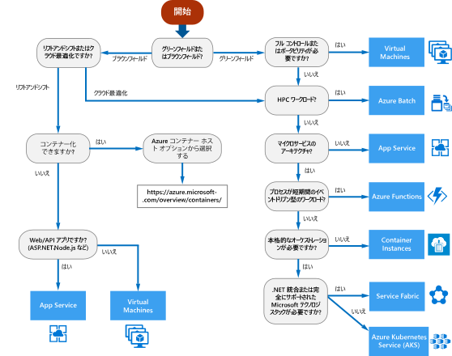

# Azure コンピューティング サービスのデシジョン ツリーDecision tree for Azure compute services

Azure では、複数の方法でお使いのアプリケーション コードをホストできます。Azure offers a number of ways to host your application code. "*コンピューティング*" という用語は、アプリケーションがそこで実行されるコンピューティング リソースのホスティング モデルを指します。The term *compute* refers to the hosting model for the computing resources that your application runs on. 次のフローチャートは、お使いのアプリケーションのコンピューティング サービスを選択するうえで役立ちます。The following flowchart will help you to choose a compute service for your application. このフローチャートは、推奨事項を導き出すための一連の主要な意思決定基準を示しています。The flowchart guides you through a set of key decision criteria to reach a recommendation. 

**このフローチャートを原案として使用します。****Treat this flowchart as a starting point.** すべてのアプリケーションには固有の要件があるため、推奨事項は原案として使用してください。Every application has unique requirements, so use the recommendation as a starting point. その後、詳細な評価を実行し、次の点を確認します。Then perform a more detailed evaluation, looking at aspects such as:
 
- 機能セットFeature set
- [サービスの制限Service limits](/azure/azure-subscription-service-limits)
- [コストCost](https://azure.microsoft.com/pricing/)
- [SLASLA](https://azure.microsoft.com/support/legal/sla/)
- [リージョン別の提供状況Regional availability](https://azure.microsoft.com/global-infrastructure/services/)
- 開発者のエコシステムとチームのスキルDeveloper ecosystem and team skills
- [コンピューティングの比較表Compute comparison tables](./compute-comparison.md)

アプリケーションが複数のワークロードで構成されている場合は、それぞれのワークロードを個別に評価します。If your application consists of multiple workloads, evaluate each workload separately. 完全なソリューションに、複数のコンピューティング サービスに組み込むことができます。A complete solution may incorporate two or more compute services.

