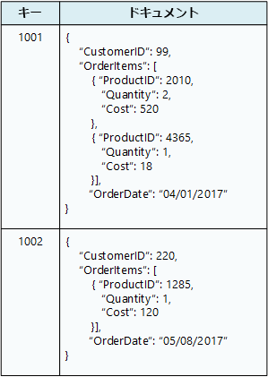

# 適切なデータ ストアの選択Choose the right data store

現代のビジネス システムで管理するデータの量は急速に増加しています。Modern business systems manage increasingly large volumes of data. データは、外部サービスから取り込まれたり、システム自体によって生成されたり、またはユーザーによって作成されたりする場合があります。Data may be ingested from external services, generated by the system itself, or created by users. これらのデータ セットは、きわめて多様な特性や処理要件を持つことがあります。These data sets may have extremely varied characteristics and processing requirements. 企業は、データを使用して、傾向を評価したり、ビジネス プロセスをトリガーしたり、経営を監査したり、顧客の行動を分析したり、他のさまざまなことを行ったりします。Businesses use data to assess trends, trigger business processes, audit their operations, analyze customer behavior, and many other things.

この多様性は、単一のデータ ストアがいつも最善のアプローチであることを意味しません。This heterogeneity means that a single data store is usually not the best approach. 代わりに、異なる種類のデータを、それぞれ特定のワークロードや使用パターンに重点を置いた異なるデータ ストアに格納する方が適切です。Instead, it's often better to store different types of data in different data stores, each focused towards a specific workload or usage pattern. *ポリグロット パーシステンス*という用語は、さまざまなデータ ストア テクノロジを組み合わせて使用するソリューションを表すために使われます。The term *polyglot persistence* is used to describe solutions that use a mix of data store technologies.

要件に応じた正しいデータ ストアを選択することは、重要な設計上の意思決定です。Selecting the right data store for your requirements is a key design decision. SQL および NoSQL データベースの文字通り何百もの実装の中から選択することになります。There are literally hundreds of implementations to choose from among SQL and NoSQL databases. データ ストアは、多くの場合、データの構造とサポートする操作の種類によって分類されます。Data stores are often categorized by how they structure data and the types of operations they support. この記事では、最も一般的ないくつかのストレージ モデルについて説明します。This article describes several of the most common storage models. 特定のデータ ストア テクノロジで、複数のストレージ モデルをサポートしていることがあるので注意してください。Note that a particular data store technology may support multiple storage models. たとえば、リレーショナル データベース管理システム (RDBMS) では、キー/値のストレージやグラフ ストレージもサポートしていることがあります。For example, a relational database management systems (RDBMS) may also support key/value or graph storage. 実際に、1 つのデータベース システムで複数のモデルをサポートする、いわゆる*マルチモデル* サポートに対する一般的な傾向があります。In fact, there is a general trend for so-called *multimodel* support, where a single database system supports several models. ただし、概要的にさまざまなモデルを理解しておくことも役に立ちます。But it's still useful to understand the different models at a high level.

特定のカテゴリのすべてのデータ ストアが、同じ機能セットを提供するとは限りません。Not all data stores in a given category provide the same feature-set. ほとんどのデータ ストアは、データをクエリして処理するサーバー側機能を提供します。Most data stores provide server-side functionality to query and process data. この機能は、データ ストレージ エンジンに組み込まれている場合があります。Sometimes this functionality is built into the data storage engine. 他の例では、データのストレージ機能と処理機能が分離され、処理と分析のための複数のオプションがある場合もあります。In other cases, the data storage and processing capabilities are separated, and there may be several options for processing and analysis. データ ストアは、さまざまなプログラムおよび管理インターフェイスもサポートします。Data stores also support different programmatic and management interfaces.

一般に、要件に最適なストレージ モデルを検討することから始める必要があります。Generally, you should start by considering which storage model is best suited for your requirements. 次に、機能セット、コスト、および管理しやすさなどの要因に基づいて、そのカテゴリ内の特定のデータ ストアを検討します。Then consider a particular data store within that category, based on factors such as feature set, cost, and ease of management.

## リレーショナル データベース管理システムRelational database management systems

リレーショナル データベースでは、行と列がある一連の 2 次元テーブルとしてデータを編成します。Relational databases organize data as a series of two-dimensional tables with rows and columns. 各テーブルには固有の列があり、テーブルのすべての行に同じ列のセットがあります。Each table has its own columns, and every row in a table has the same set of columns. このモデルは、数学上のベースとなり、ほとんどのベンダーが、データを取得し、管理するために Structured Query Language (SQL) の言語を提供しています。This model is mathematically based, and most vendors provide a dialect of the Structured Query Language (SQL) for retrieving and managing data. RDBMS は一般に、情報の更新用に、ACID (原子性、一貫性、独立性、永続性) モデルに準拠する、トランザクションの一貫性があるメカニズムを実装します。An RDBMS typically implements a transactionally consistent mechanism that conforms to the ACID (Atomic, Consistent, Isolated, Durable) model for updating information.

RDBMS は一般に、データ構造が事前定義されている Schema on Write モデルをサポートしており、すべての読み取りまたは書き込み操作でそのスキーマを使用する必要があります。An RDBMS typically supports a schema-on-write model, where the data structure is defined ahead of time, and all read or write operations must use the schema. これは、ほとんどの NoSQL データ ストア (特にキー/値タイプ) とは対照的です。このデータ ストアでは、Schema On Read モデルで、クライアントがデータベースから取得するデータに、独自の解釈型スキーマを強制することを前提とし、書き込まれるデータ形式に依存しません。This is in contrast to most NoSQL data stores, particularly key/value types, where the schema-on-read model assumes that the client will be imposing its own interpretive schema on data coming out of the database, and is agnostic to the data format being written.

強力な一貫性の保証が重要な場合、RDBMS はきわめて有益です。RDBMS では、すべての変更がアトミックで、トランザクションは常にデータを一貫性のある状態のままにします。An RDBMS is very useful when strong consistency guarantees are important &mdash; where all changes are atomic, and transactions always leave the data in a consistent state. ただし、基になる構造はストレージを分散し、コンピューター全体で処理することによるスケール アウトには適していません。However, the underlying structures do not lend themselves to scaling out by distributing storage and processing across machines. また、RDBMS に格納された情報は、正規化プロセスに従って、リレーショナル構造に配置する必要があります。Also, information stored in an RDBMS, must be put into a relational structure by following the normalization process. このプロセスは十分に解明されていますが、論理エンティティを個々のテーブル内の行に逆アセンブルし、次にクエリの実行時に、データを再アセンブルする必要があるため、非効率性につながる可能性があります。While this process is well understood, it can lead to inefficiencies, because of the need to disassemble logical entities into rows in separate tables, and then reassemble the data when running queries.

関連 Azure サービス:Relevant Azure service:

- [Azure SQL Database][sql-db][Azure SQL Database][sql-db]
- [Azure Database for MySQL][mysql][Azure Database for MySQL][mysql]
- [Azure Database for PostgreSQL][postgres][Azure Database for PostgreSQL][postgres]

## キー/値のストアKey/value stores

キー/値のストアは、本質的に大規模なハッシュ テーブルです。A key/value store is essentially a large hash table. 各データ値を一意のキーに関連付けると、キー/値のストアがこのキーを使用し、適切なハッシュ関数を使用してデータを格納します。You associate each data value with a unique key, and the key/value store uses this key to store the data by using an appropriate hashing function. ハッシュ関数は、データ ストレージ間でハッシュされたキーを均等に分散するために選択されます。The hashing function is selected to provide an even distribution of hashed keys across the data storage.

ほとんどのキー/値のストアは、簡単なクエリ、挿入、および削除操作のみをサポートしています。Most key/value stores only support simple query, insert, and delete operations. (部分的または完全に) 値を変更するには、アプリケーションで値全体の既存のデータを上書きする必要があります。To modify a value (either partially or completely), an application must overwrite the existing data for the entire value. ほとんどの実装で、1 つの値の読み取りや書き込みは、アトミック操作です。In most implementations, reading or writing a single value is an atomic operation. 値が大きい場合、書き込みにいくらか時間がかかることがあります。If the value is large, writing may take some time.

一部のキー/値のストアでは値の最大サイズに制限を課すものがありますが、アプリケーションは、一連の値として任意のデータを格納できます。An application can store arbitrary data as a set of values, although some key/value stores impose limits on the maximum size of values. 格納された値は、ストレージ システム ソフトウェアに非透過的です。The stored values are opaque to the storage system software. すべてのスキーマ情報が提供され、アプリケーションによって解釈される必要があります。Any schema information must be provided and interpreted by the application. 基本的に、値は BLOB で、キー/値のストアは単純にキーによって、値を取得または格納します。Essentially, values are blobs and the key/value store simply retrieves or stores the value by key.

キー/値のストアは、単純なルックアップを実行するアプリケーション用に高度に最適化されていますが、さまざまなキー/値のストア間でデータをクエリする必要があるシステムにはあまり適していません。Key/value stores are highly optimized for applications performing simple lookups, but are less suitable for systems that need to query data across different key/value stores. さらに、キー/値のストアは、キーのみに基づいてルックアップを実行するよりも値によるクエリが重要なシナリオ用に最適化されていません。Key/value stores are also not optimized for scenarios where querying by value is important, rather than performing lookups based only on keys. たとえば、リレーショナル データベースでは、WHERE 句を使用してレコードを見つけることができますが、キー/値のストアには通常、この種類の値のルックアップ機能がありません。For example, with a relational database, you can find a record by using a WHERE clause, but key/values stores usually do not have this type of lookup capability for values.

1 つのキー/値のストアでは、個々のコンピューター上の複数のノード間でデータを簡単に分散できるため、きわめてスケーラブルにすることができます。A single key/value store can be extremely scalable, as the data store can easily distribute data across multiple nodes on separate machines.

関連 Azure サービス:Relevant Azure services:

- [Cosmos DB][cosmosdb][Cosmos DB][cosmosdb]
- [Azure Redis Cache][redis-cache][Azure Redis Cache][redis-cache]

## ドキュメント データベースDocument databases

ドキュメント データベースは、概念的にキー/値のストアに似ていますが、名前付きフィールドとデータのコレクション (ドキュメントと呼ばれる) を格納する点が異なります。各データは単純なスカラー項目か、リストや子コレクションなどの複合要素などです。A document database is conceptually similar to a key/value store, except that it stores a collection of named fields and data (known as documents), each of which could be simple scalar items or compound elements such as lists and child collections. ドキュメントのフィールド内のデータは、XML、YAML、JSON、BSON などのさまざまな方法でエンコードしたり、またはプレーン テキストとして格納することもできます。The data in the fields of a document can be encoded in a variety of ways, including XML, YAML, JSON, BSON,or even stored as plain text. キー/値のストアとは異なり、ドキュメント内のフィールドは、ストレージ管理システムに公開されるため、アプリケーションで、これらのフィールドの値を使用して データをクエリおよびフィルターできます。Unlike key/value stores, the fields in documents are exposed to the storage management system, enabling an application to query and filter data by using the values in these fields.

一般に、ドキュメントには、エンティティのデータ全体が含まれます。Typically, a document contains the entire data for an entity. エンティティを構成する項目は、アプリケーション固有です。What items constitute an entity are application specific. たとえば、エンティティに、顧客、注文、または両方の組み合わせの詳細を格納できます。For example, an entity could contain the details of a customer, an order, or a combination of both. RDBMS 内の複数のリレーショナル テーブル間に分散されている情報を 1 つのドキュメントに格納できます。A single document may contain information that would be spread across several relational tables in an RDBMS.

ドキュメント ストアでは、すべてのドキュメントが同じ構造をしている必要はありません。A document store does not require that all documents have the same structure. この自由形式のアプローチにより、大幅な柔軟性を提供します。This free-form approach provides a great deal of flexibility. アプリケーションは、ビジネス要件の変更に応じて、さまざまなデータをドキュメントに格納できます。Applications can store different data in documents as business requirements change.

アプリケーションは、ドキュメント キーを使用してドキュメントを取得できます。The application can retrieve documents by using the document key. これはドキュメントの一意の識別子で、多くの場合にハッシュされ、データを均等に分散するのに役立ちます。This is a unique identifier for the document, which is often hashed, to help distribute data evenly. 一部のドキュメント データベースは、ドキュメント キーを自動的に作成します。Some document databases create the document key automatically. 他は、ユーザーがキーとして使用するドキュメントの属性を指定できます。Others enable you to specify an attribute of the document to use as the key. アプリケーションは、1 つまたは複数のフィールドの値に基づいて、ドキュメントをクエリすることもできます。The application can also query documents based on the value of one or more fields. 一部のドキュメント データベースでは、インデックスをサポートし、1 つまたは複数のインデックス付きフィールドに基づいたドキュメントの高速のルックアップを容易にします。Some document databases support indexing to facilitate fast lookup of documents based on one or more indexed fields.

多くのドキュメント データベースで、インプレース更新をサポートしているため、アプリケーションは、ドキュメント全体を書き直すことなく、ドキュメント内の特定のフィールドの値を変更できます。Many document databases support in-place updates, enabling an application to modify the values of specific fields in a document without rewriting the entire document. 1 つのドキュメントの複数のフィールドに対する読み取りおよび書き込み操作は、通常アトミックです。Read and write operations over multiple fields in a single document are usually atomic.

関連 Azure サービス:[Cosmos DB][cosmosdb]Relevant Azure service: [Cosmos DB][cosmosdb]

## グラフ データベースGraph databases

グラフ データベースは、ノードとエッジの 2 種類の情報を格納します。A graph database stores two types of information, nodes and edges. ノードはエンティティと考えることができます。You can think of nodes as entities. エッジはノード間のリレーションシップを指定します。Edges which specify the relationships between nodes. ノードもエッジも、そのノードやエッジに関する情報を提供するプロパティを持つことができ、テーブルの列に似ています。Both nodes and edges can have properties that provide information about that node or edge, similar to columns in a table. エッジは、リレーションシップの性質を示す方向を持つこともできます。Edges can also have a direction indicating the nature of the relationship.

グラフ データベースの目的は、アプリケーションが、ノードとエッジのネットワークを通過するクエリを効率的に実行して、エンティティ間のリレーションシップを分析できるようにすることです。The purpose of a graph database is to allow an application to efficiently perform queries that traverse the network of nodes and edges, and to analyze the relationships between entities. 次の図にグラフとして構築された組織の職員のデータベースを示します。The following diagram shows an organization's personnel database structured as a graph. エンティティは従業員や部門で、エッジは社内の直属の上下関係と従業員が勤務する部署を示しています。The entities are employees and departments, and the edges indicate reporting relationships and the department in which employees work. このグラフでは、エッジの矢印は、上下関係の方向を示しています。In this graph, the arrows on the edges show the direction of the relationships.

この構造により、"Sarah に直接または間接的に報告するすべての従業員を見つける" または "John と同じ部門で働いている人" などのクエリの実行が簡単になります。This structure makes it straightforward to perform queries such as "Find all employees who report directly or indirectly to Sarah" or "Who works in the same department as John?" 大量のエンティティとリレーションシップを含む大規模なグラフでは、きわめて複雑な分析をすばやく実行できます。For large graphs with lots of entities and relationships, you can perform very complex analyses very quickly. 多くのグラフ データベースは、リレーションシップのネットワークを効率的に走査するために使用できるクエリ言語を提供しています。Many graph databases provide a query language that you can use to traverse a network of relationships efficiently.

関連 Azure サービス:[Cosmos DB][cosmosdb]Relevant Azure service: [Cosmos DB][cosmosdb]

## 列ファミリのデータベースColumn-family databases

列ファミリのデータベースは、データを行と列に編成します。A column-family database organizes data into rows and columns. 列ファミリのデータベースは、その最も単純な形式では、少なくとも概念的にリレーショナル データベースによく似ています。In its simplest form, a column-family database can appear very similar to a relational database, at least conceptually. 列ファミリのデータベースの真の能力は、スパース データの構築のための非正規化されたアプローチにあります。The real power of a column-family database lies in its denormalized approach to structuring sparse data.

列ファミリのデータベースは、行と列を含む表形式データを保持するものと考えることができますが、列は*列ファミリ*と呼ばれるグループに分類されます。You can think of a column-family database as holding tabular data with rows and columns, but the columns are divided into groups known as *column families*. 各列のファミリは論理的に相互に関連する列のセットを保持し、一般にユニットとして取得または操作されます。Each column family holds a set of columns that are logically related together and are typically retrieved or manipulated as a unit. 個別にアクセスされるその他のデータは、個別の列ファミリに格納できます。Other data that is accessed separately can be stored in separate column families. 列ファミリ内では、新しい列を動的に追加することができ、行をスパースにする (つまり、行のすべての列に値を持つ必要がない) ことができます。Within a column family, new columns can be added dynamically, and rows can be sparse (that is, a row doesn't need to have a value for every column).

次の図は、`Identity` と `Contact Info` の 2 つの列ファミリのある例を示しています。The following diagram shows an example with two column families, `Identity` and `Contact Info`. 単一のエンティティのデータは、各列ファミリに同じ行キーを持ちます。The data for a single entity has the same row key in each column-family. 列ファミリ内の任意の特定のオブジェクトの行を動的に変えることができるこの構造は、列ファミリ アプローチの重要な利点であり、この形式のデータ ストアが、構造化された揮発性データの格納に最適とされます。This structure, where the rows for any given object in a column family can vary dynamically, is an important benefit of the column-family approach, making this form of data store highly suited for storing structured, volatile data.

キー/値のストアまたはドキュメント データベースとは異なり、ほとんどの列ファミリのデータベースは、ハッシュを計算するのではなく、キー順序でデータを格納します。Unlike a key/value store or a document database, most column-family databases store data in key order, rather than by computing a hash. 多くの実装で、列ファミリ内の特定の列に対してインデックスを作成できます。Many implementations allow you to create indexes over specific columns in a column-family. インデックスを使用すると、行キーではなく、列値によってデータを取得できます。Indexes let you retrieve data by columns value, rather than row key.

一部の実装では、複数の列ファミリにまたがる行全体で原子性を提供するものもありますが、行の読み取りと書き込みの操作は通常、単一の列ファミリでアトミックです。Read and write operations for a row are usually atomic with a single column-family, although some implementations provide atomicity across the entire row, spanning multiple column-families.

関連 Azure サービス:[HDInsight の HBase][hbase]Relevant Azure service: [HBase in HDInsight][hbase]

## データ分析Data analytics

データ分析ストアは、データの取り込み、保存、および分析のための大規模な並列ソリューションを提供します。Data analytics stores provide massively parallel solutions for ingesting, storing, and analyzing data. このデータは、シェアード ナッシング アーキテクチャを使用して、複数のサーバー間で分散され、スケーラビリティを最大化し、依存関係を最小にします。This data is distributed across multiple servers using a share-nothing architecture to maximize scalability and minimize dependencies. データは静的である可能性は低いため、これらのストアでは、新しいクエリの処理を続行しながら、複数のストリームから多様な形式で到着する大量の情報を処理できる必要があります。The data is unlikely to be static, so these stores must be able to handle large quantities of information, arriving in a variety of formats from multiple streams, while continuing to process new queries.

関連 Azure サービス:Relevant Azure services:

- [SQL Data Warehouse][sql-dw][SQL Data Warehouse][sql-dw]
- [Azure Data Lake][data-lake][Azure Data Lake][data-lake]

## 検索エンジンのデータベースSearch Engine Databases  

検索エンジンのデータベースは、外部データ ストアおよびサービスで保持されている情報を検索する機能をサポートします。A search engine database supports the ability to search for information held in external data stores and services. 検索エンジンのデータベースを使用して、膨大な量のデータのインデックスを作成し、これらのインデックスへのほぼリアルタイムのアクセスを提供できます。A search engine database can be used to index massive volumes of data and provide near real-time access to these indexes. 検索エンジンのデータベースは一般に Web と同義として考えられますが、多くの大規模なシステムではそれらを使用して、独自のデータベース上に構造化されたアドホック検索機能を提供します。Although search engine databases are commonly thought of as being synonymous with the web, many large-scale systems use them to provide structured and ad-hoc search capabilities on top of their own databases.

検索エンジンのデータベースの主な特性は、情報をきわめて迅速に格納して、インデックス作成し、検索要求に対して高速の応答時間を実現する機能です。The key characteristics of a search engine database are the ability to store and index information very quickly, and provide fast response times for search requests. インデックスは、多次元にすることができ、大量のテキスト データ間でフリーテキスト検索をサポートできます。Indexes can be multi-dimensional and may support free-text searches across large volumes of text data. インデックス作成は、検索エンジンのデータベースによってトリガーされるプルモデルを使用するか、外部のアプリケーション コードによって開始されるプッシュ モデルを使用して実行できます。Indexing can be performed using a pull model, triggered by the search engine database, or using a push model, initiated by external application code.

検索は、完全でもあいまいでも可能です。Searching can be exact or fuzzy. あいまい検索では、一連の用語に一致するドキュメントを検索し、それらがどの程度一致しているかを計算します。A fuzzy search finds documents that match a set of terms and calculates how closely they match. 一部の検索エンジンは、シノニム、ジャンル拡張 (たとえば、`dogs` を `pets` に一致させる)、およびステミング (同じ語幹を持つ単語を照合する) に基づいて一致を返すことができる言語分析もサポートします。Some search engines also support linguistic analysis that can return matches based on synonyms, genre expansions (for example, matching `dogs` to `pets`), and stemming (matching words with the same root).

関連 Azure サービス:[Azure Search][search]Relevant Azure service: [Azure Search][search]

## タイム シリーズ データベースTime Series Databases

タイム シリーズ データは時間によって編成された一連の値であり、タイム シリーズ データベースは、この種類のデータに最適化されたデータベースです。Time series data is a set of values organized by time, and a time series database is a database that is optimized for this type of data. タイム シリーズのデータベースは、通常多数のソースからリアルタイムで大量のデータを収集するため、きわめて大量の書き込みをサポートする必要があります。Time series databases must support a very high number of writes, as they typically collect large amounts of data in real time from a large number of sources. 更新はまれであり、削除は多くの場合に一括操作として行われます。Updates are rare, and deletes are often done as bulk operations. タイム シリーズのデータベースに書き込まれるレコードは通常小さいですが、多くの場合にレコード数が多く、合計データ サイズが急速に増大する可能性があります。Although the records written to a time-series database are generally small,  there are often a large number of records, and total data size can grow rapidly.

タイム シリーズのデータベースは、テレメトリ データの格納に適しています。Time series databases are good for storing telemetry data. シナリオには、IoT センサーやアプリケーション/システム カウンターが含まれます。Scenarios include IoT sensors or application/system counters.

関連 Azure サービス:[Time Series Insights][time-series]Relevant Azure service: [Time Series Insights][time-series]

## オブジェクト ストレージObject storage  

オブジェクト ストレージは、大規模なバイナリ オブジェクト (イメージ、ファイル、ビデオおよびオーディオ ストリーム、大規模なアプリケーション データ オブジェクトおよびドキュメント、仮想マシン ディスク イメージ) の格納と取得に最適です。Object storage is optimized for storing and retrieving large binary objects (images, files, video and audio streams, large application data objects and documents, virtual machine disk images). これらのストアの種類のオブジェクトは、格納されたデータ、いくつかのメタデータ、およびオブジェクトにアクセスするための一意の ID で構成されます。Objects in these store types are composed of the stored data, some metadata, and a unique ID for accessing the object. オブジェクト ストアは、著しく大量の非構造化データの管理を可能にします。Object stores enables the management of extremely large amounts of unstructured data.

関連 Azure サービス:[Blob Storage][blob]Relevant Azure service: [Blob Storage][blob]

## 共有ファイルShared files

場合によっては、単純なフラット ファイルを使用することが、情報の格納と取得の最も効率的な手段である可能性があります。Sometimes, using simple flat files can be the most effective means of storing and retrieving information. ファイル共有を使用すると、ネットワーク経由でファイルにアクセスできます。Using file shares enables files to be accessed across a network. 適切なセキュリティおよび同時実行アクセス制御メカニズムがあれば、この方法でデータを共有することにより、分散型サービスが可能になり、単純な読み取りおよび書き込み要求などの基本的な低レベルの操作のための高度にスケーラブルなデータ アクセスを提供します。Given appropriate security and concurrent access control mechanisms, sharing data in this way can enable distributed services to provide highly scalable data access for performing basic, low-level operations such as simple read and write requests.

関連 Azure サービス:[File Storage][file-storage]Relevant Azure service: [File Storage][file-storage]

<!-- links -->

[blob]: https://azure.microsoft.com/services/storage/blobs/
[cosmosdb]: https://azure.microsoft.com/services/cosmos-db/
[data-lake]: https://azure.microsoft.com/solutions/data-lake/
[file-storage]: https://azure.microsoft.com/services/storage/files/
[hbase]: /azure/hdinsight/hdinsight-hbase-overview
[mysql]: https://azure.microsoft.com/services/mysql/
[postgres]: https://azure.microsoft.com/services/postgresql/
[redis-cache]: https://azure.microsoft.com/services/cache/
[search]: https://azure.microsoft.com/services/search/
[sql-db]: https://azure.microsoft.com/services/sql-database
[sql-dw]: https://azure.microsoft.com/services/sql-data-warehouse/
[time-series]: https://azure.microsoft.com/services/time-series-insights/
