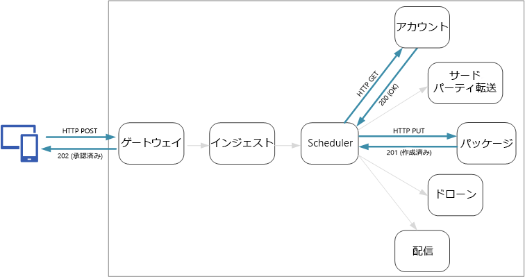
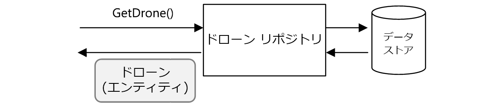
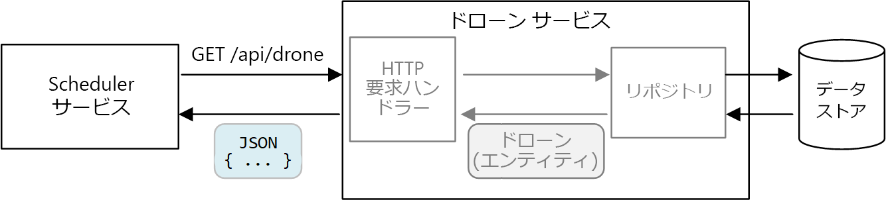
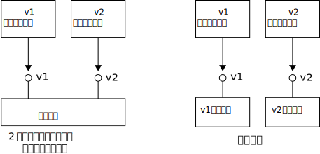

# <a name="designing-microservices-api-design"></a>マイクロサービスの設計: API の設計

サービス間のすべてのデータ交換はメッセージまたは API 呼び出しのいずれかによって行われるため、マイクロサービス アーキテクチャでは優れた API 設計にすることが重要です。 [頻度の高い I/O](../antipatterns/chatty-io/index.md) の作成を避けるために、API は効率的にする必要があります。 サービスは独立して作業する複数のチームによって設計されるため、API はセマンティクスとバージョン管理スキームを明確に定義する必要があります。



2 種類の API を区別することが重要です。

- クライアント アプリケーションが呼び出すパブリック API。 
- サービス間通信に使用されるバックエンド API。

これら 2 つのユース ケースには、異なる要件が一部にあります。 パブリック API には、クライアント アプリケーション (通常はブラウザー アプリケーションやネイティブ モバイル アプリケーション) と互換性を持たせる必要があります。 ほとんどの場合、パブリック API は REST over HTTP を使用します。 一方、バックエンド API では、ネットワークのパフォーマンスを考慮する必要があります。 サービスの細分性によっては、サービス間通信で多くのネットワーク トラフィックが発生する可能性があります。 サービスはすぐに I/O に縛られる可能性があります。 そのため、シリアル化の速度やペイロード サイズなどの考慮事項が重要になります。 REST over HTTP の一般的な代替手段として、gRPC、Apache Avro、Apache Thrift などがあります。 これらのプロトコルはバイナリのシリアル化をサポートするので、一般に HTTP より効率的です。

## <a name="considerations"></a>考慮事項

API の実装方法を選択する際に考慮すべき事項がいくつかあります。

**REST と RPC**。 REST スタイルのインターフェイスと RPC スタイルのインターフェイスのトレードオフを考えてみましょう。

- REST はリソースをモデル化します。自然な方法でドメイン モデルを表現することができます。 また、HTTP 動詞に基づいて統一インターフェイスを定義し、進化を促進しています。 REST には、べき等、副作用、および応答コードに関して明確に定義されたセマンティクスがあります。 また、ステートレスな通信を強制するため、スケーラビリティが向上します。 

- RPC は操作やコマンドを中心にしています。 RPC インターフェイスはローカルのメソッド呼び出しに似ているため、過度に冗長な API を設計することになる可能性があります。 ただし、RPC が常に冗長という意味ではありません。 インターフェイスを設計するときには注意する必要があるということです。

RESTful インターフェイスの場合、最も一般的な選択肢は、JSON を使用した REST over HTTP です。 RPC スタイルのインターフェイスには、gRPC、Apache Avro、Apache Thrift などの一般的なフレームワークがいくつかあります。

**効率**。 速度、メモリ、およびペイロード サイズに関して効率を考慮してください。 通常、gRPC ベースのインターフェイスは、REST over HTTP よりも高速です。

**インターフェイス定義言語 (IDL)**。 IDL は、API のメソッド、パラメーター、および戻り値を定義するために使用されます。 IDL は、クライアント コード、シリアル化コード、および API ドキュメントの生成に使用できます。 IDL は、Postman などの API テスト ツールでも使用できます。 gRPC、Avro、および Thrift などのフレームワークには、独自の IDL 仕様が定義されています。 REST over HTTP に標準の IDL 形式はありませんが、一般的な選択肢は OpenAPI (旧 Swagger) です。 正式な定義言語を使用せずに HTTP REST API を作成することもできますが、コード生成とテストのメリットは失われます。

**シリアル化**。 ネットワーク経由の場合、オブジェクトはどのようにシリアル化しますか。 選択肢として、テキストベースの形式 (主に JSON) やプロトコル バッファーなどのバイナリ形式があります。 バイナリ形式は一般的にテキストベース形式より高速です。 ただし、ほとんどの言語とフレームワークが JSON のシリアル化をサポートしているため、JSON は相互運用性の面で利点があります。 シリアル化形式には固定スキーマが必要なものや、スキーマ定義ファイルのコンパイルが必要なものがあります。 その場合は、次の手順をビルド プロセスに組み込む必要があります。 

**フレームワークと言語のサポート**。 HTTP はほぼすべてのフレームワークと言語でサポートされています。 gRPC、Avro、Thrift には、いずれも C++、C#、Java、Python 用のライブラリがあります。 Thrift と gRPC は Go もサポートしています。 

**互換性と相互運用性**。 gRPC のようなプロトコルを選択する場合は、公開 API とバックエンドの間にプロトコル変換レイヤーが必要な場合があります。 その機能は[ゲートウェイ](./gateway.md)で実行できます。 サービス メッシュを使用している場合は、サービス メッシュと互換性のあるプロトコルを検討してください。 たとえば、linkerd には、HTTP、Thrift、および gRPC のサポートが組み込まれています。 

基本的に、バイナリ プロトコルのパフォーマンス上の利点が必要な場合を除き、REST over HTTP を選択することをお勧めします。 REST over HTTP に特別なライブラリは必要ありません。 呼び出し側はサービスと通信するためにクライアント スタブを必要としないため、結合が最小限に抑えられます。 RESTful HTTP エンドポイントのスキーマ定義、テスト、および監視をサポートするツールの豊富なエコシステムがあります。 最後に、HTTP はブラウザー クライアントと互換性があるため、クライアントとバックエンドの間にプロトコル変換レイヤーは必要ありません。 

ただし、REST over HTTP を選択した場合は、開発プロセスの早い段階でパフォーマンスと負荷テストを行い、シナリオに十分に適しているかどうかを検証する必要があります。

## <a name="restful-api-design"></a>RESTful API の設計

RESTful API を設計するには、多くのリソースがあります。 そのうち参考になるリソースをいくつか紹介します。

- [API 設計](../best-practices/api-design.md) 

- [API 実装](../best-practices/api-implementation.md) 

- [Microsoft REST API のガイドライン](https://github.com/Microsoft/api-guidelines)

留意すべき具体的な考慮事項をいくつか挙げます。

- 内部実装の詳細を漏えいする API や、単純に内部データベース スキーマをミラーリングする API には注意してください。 API でドメインをモデル化するようにします。 これはサービス間のコントラクトです。何らかのコードのリファクタリングやデータベース テーブルの正規化のためだけでなく、新しい機能が追加されたときにのみ変更するのが理想的です。 

- モバイル アプリケーションやデスクトップの Web ブラウザーなど、クライアントの種類によって必要なペイロード サイズや相互作用パターンが異なる可能性があります。 [フロントエンド用のバックエンド パターン](../patterns/backends-for-frontends.md)を使用して、各クライアント用に個別のバックエンドを作成し、そのクライアントに最適なインターフェイスを公開することを検討します。

- 副作用のある操作については、べき等化して PUT メソッドとして実装することを検討します。 こうすることで、安全な再試行が可能になり、回復性が向上します。 この問題の詳細については、[インジェストとワークフロー](./ingestion-workflow.md#idempotent-vs-non-idempotent-operations)と[サービス間通信](./interservice-communication.md)に関する章を参照してください。

- HTTP メソッドは非同期セマンティクスを持つことができます。このようなメソッドでは応答が直ちに返されますが、サービスは非同期に処理を実行します。 その場合、メソッドは [HTTP 202](https://www.w3.org/Protocols/rfc2616/rfc2616-sec10.html) 応答コードを返す必要があります。これは要求の処理が受け入れられたことを示しますが、処理はまだ完了していません。

## <a name="mapping-rest-to-ddd-patterns"></a>REST を DDD パターンにマッピングする

エンティティ、集計、値オブジェクトなどのパターンは、ドメイン モデルのオブジェクトに特定の制約を課すように設計されています。 DDD に関する多くの議論では、コンストラクターやプロパティ ゲッターやセッターなどのオブジェクト指向 (OO) 言語の概念を使用してパターンをモデル化しています。 たとえば、*値オブジェクト*は不変にすることになっています。 OO プログラミング言語では、この不変性を強制するために、コンストラクターに値を割り当て、プロパティを読み取り専用にしています。

```ts
export class Location {
    readonly latitude: number;
    readonly longitude: number;

    constructor(latitude: number, longitude: number) {
        if (latitude < -90 || latitude > 90) {
            throw new RangeError('latitude must be between -90 and 90');
        }
        if (longitude < -180 || longitude > 180) {
            throw new RangeError('longitude must be between -180 and 180');
        }
        this.latitude = latitude;
        this.longitude = longitude;
    }
}
```

このような種類のコーディングは、従来のモノリシック アプリケーションを構築する場合に特に重要です。 大規模なコードベースでは、多くのサブシステムが `Location` オブジェクトを使用する可能性があるため、オブジェクトが正しい動作を実行することが重要です。 

もう 1 つの例は、アプリケーションの他の部分がデータ ストアの読み込みや書き込みを直接行わないようにするリポジトリ パターンです。



一方、マイクロサービス アーキテクチャでは、サービスは同じコード ベースを共有せず、データ ストアを共有しません。 代わりに、API を介して通信します。 スケジューラ サービスがドローン サービスにドローンに関する情報を要求する場合を考えてみましょう。 ドローン サービスには、コードで表現されたドローンの内部モデルがあります。 ただし、スケジューラにはそれが見えません。 代わりに、ドローン エンティティ &mdash; の*表現* (JSON オブジェクトなど) を HTTP 応答で返します。



スケジューラ サービスは、ドローン サービスの内部モデルを変更できません。また、ドローン サービスのデータ ストアに書き込むこともできません。 つまり、ドローン サービスを実装するコードでは、従来のモノリシック コードと比較して公開される表面領域が小さくなります。 ドローン サービスで Location クラスが定義されている場合、そのクラスのスコープは制限されています。そのため、他のサービスはそのクラスを直接使用しません。 

これらの理由から、このガイダンスは、戦術的な DDD パターンに関連するコーディング方法にあまり焦点を当てていません。 ただし、REST API を使用して多くの DDD パターンをモデル化することもできます。 

例: 

- 集計は、REST 内の*リソース*に自然にマップされます。 たとえば、Delivery の集計は Delivery API によってリソースとして公開されます。

- 集計は一貫性の境界です。 集計に対する操作で、集計が矛盾した状態にならないようにする必要があります。 そのため、クライアントが集計の内部状態を操作できるような API は作成しないでください。 代わりに、リソースとして集計を公開する粗い API を優先します。

- エンティティには固有の ID があります。 REST のリソースには URL 形式の一意の識別子があります。 エンティティのドメイン ID に対応するリソース URL を作成します。 URL からドメイン ID へのマッピングは、クライアントに対して非透過にすることができます。

- 集計の子エンティティには、ルート エンティティからたどって到達することができます。 [HATEOAS](https://en.wikipedia.org/wiki/HATEOAS) の原則に従うと、親エンティティの表現のリンクを介して子エンティティに到達することができます。 

- 値オブジェクトは不変なので、値オブジェクト全体を置き換えることで更新が実行されます。 REST では、PUT または PATCH 要求を使用して更新を実装します。 

- クライアントはリポジトリを使用して、コレクション内のオブジェクトを照会、追加、または削除して、基になるデータ ストアの詳細を抽象化できます。 REST では、コレクションを照会するメソッド、またはコレクションに新しいエンティティを追加するメソッドを使用して、コレクションを個別のリソースにすることができます。

API を設計する場合は、モデル内のデータだけでなく、ビジネス操作やデータの制約など、ドメイン モデルの表現方法について考える必要があります。

| DDD の概念 | 同等の REST | 例 | 
|-------------|-----------------|---------|
| 集計 | リソース | `{ "1":1234, "status":"pending"... }` | 
| ID | URL | `http://delivery-service/deliveries/1` |
| 子エンティティ | リンク | `{ "href": "/deliveries/1/confirmation" }` |
| 値オブジェクトの更新 | PUT または PATCH | `PUT http://delivery-service/deliveries/1/dropoff` |
| リポジトリ | コレクション | `http://delivery-service/deliveries?status=pending` |


## <a name="api-versioning"></a>API のバージョン管理

API は、サービスとそのサービスのクライアントまたはコンシューマー間のコントラクトです。 API が変更された場合、外部クライアントか他のマイクロサービスかにかかわらず、API に依存するクライアントが中断する危険があります。 そのため、API の変更回数を最小限に抑えることをお勧めします。 多くの場合、基になる実装の変更で API を変更する必要はありません。 ただし現実的には、どこかの時点で、既存の API の変更が必要になる新しい特徴や新しい機能を追加する必要が出てきます。

可能な限り、API の変更を下位互換にします。 たとえば、モデルからフィールドを削除することは避けます。フィールドが存在すると想定しているクライアントが中断する可能性があるためです。 フィールドを追加しても互換性は損なわれません。クライアントは応答の理解できないフィールドを無視するためです。 ただし、サービスでは、古いクライアントが要求の新しいフィールドを省略した場合に対応する必要があります。 

API コントラクトのバージョン管理をサポートします。 API の重大な変更を導入する場合は、新しい API バージョンに変更してください。 以前のバージョンを引き続きサポートし、クライアントが呼び出すバージョンを選択できるようにします。 これを行うにはいくつかの方法があります。 1 つは、単に両方のバージョンを同じサービスで公開する方法です。 もう 1 つは、サービスの 2 つのバージョンを並行して実行し、HTTP ルーティング ルールに基づいて要求を一方または別のバージョンにルーティングする方法です。 



開発者の時間、テスト、および運用上のオーバーヘッドの観点から、複数のバージョンをサポートするには、コストがかかります。 そのため、できるだけ早く古いバージョンを非推奨にすることをお勧めします。 内部 API の場合、API を所有するチームは他のチームと協力して新しいバージョンに移行することができます。 このような場合に、チーム間のガバナンス プロセスを持つことが有効です。 外部 (パブリック) API の場合、特に API がサードパーティまたはネイティブ クライアント アプリケーションによって使用されている場合、API バージョンを非推奨にすることは困難です。 

サービスの実装が変更されると、その変更をバージョンでタグ付けすると便利です。 このバージョンでは、エラーのトラブルシューティングに重要な情報が提供されます。 根本原因解析で、呼び出されたサービスのバージョンを正確に把握する場合に非常に役立ちます。 サービス バージョンに[セマンティック バージョン管理](https://semver.org/)を使用することを検討してください。 セマンティックなバージョン管理は、*MAJOR.MINOR.PATCH* 形式を使用します。 ただし、クライアントは、メジャー バージョン番号の API のみを選択することが推奨されます。マイナー バージョン間で重大な (中断されない) 変更があった場合にのみ、マイナー バージョンを選択します。 つまり、クライアントが API のバージョン 1 またはバージョン 2 を選択するのは合理的ですが、バージョン 2.1.3 は選択しないようにします。 そのレベルの粒度を許可すると、バージョン数の増加をサポートする必要があります。 

API のバージョン管理の詳細については、[RESTful Web API のバージョン管理](../best-practices/api-design.md#versioning-a-restful-web-api)に関するページを参照してください。

> [!div class="nextstepaction"]
> [インジェストとワークフロー](./ingestion-workflow.md)