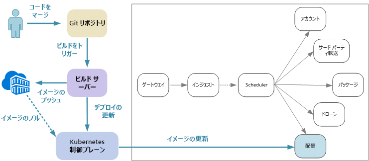
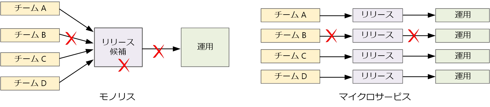

# マイクロサービスの設計: 継続的インテグレーション

継続的インテグレーションと継続的デリバリー (CI/CD) は、マイクロサービスで成功を収めるための重要な要件です。 良質の CI/CD プロセスなしでは、マイクロサービスが約束する機敏性は達成できません。 マイクロサービスに対する CI/CD の課題の一部は、多様なサービスのための複数のコード ベースと異種ビルド環境が存在することに起因します。 この章では、これらの課題について説明し、問題に対処するために推奨するいくつかの方法を示します。

マイクロサービス アーキテクチャを採用する最大の理由の 1 つは、リリース サイクルの高速化です。 

純粋なモノリシック アプリケーションには、その出力がアプリケーション実行可能ファイルである単一のビルド パイプラインがあります。 すべての開発作業は、このパイプラインに注ぎ込まれます。 優先度の高いバグが見つかった場合、修正を統合し、テストして発行する必要がありますが、それによって新機能のリリースが遅れる可能性があります。 確かに、これらの問題は、十分にファクタリングされたモジュールを用意し、機能ブランチを使用してコード変更の影響を最小限に抑えることで軽減できます。 ただし、アプリケーションが複雑になり、機能が追加されるにつれて、モノリシックのリリース プロセスは不安定になり、中断される可能性があります。 

マイクロサービスの理念に従うと、すべてのチームは、リリースするために一列に並んで待つ必要はありません。 サービス "A" をビルドしているチームは、サービス "B" の変更がマージされ、テストされ、デプロイされるまで待たずに、更新プログラムをいつでもリリースできます。 CI/CD プロセスは、これを可能にするために非常に重要です。 リリース パイプラインは、更新プログラムのデプロイ リスクを最小限に抑えることができるように、自動化された高い信頼性を持つものにする必要があります。 毎日または 1 日に数回、運用環境にリリースを行っていれば、エラーの再発やサービスの中断はめったに発生しないはずです。 同時に、不適切な更新プログラムがデプロイされた場合は、信頼性の高い方法で、サービスの前のバージョンに迅速にロールバックするかロールフォワードする必要があります。

CI/CD の話は、実際には、継続的インテグレーション、継続的デリバリー、および継続的配置という関連する複数のプロセスについての話です。

- 継続的インテグレーションとは、コード変更が、自動化されたビルドとテストのプロセスを使用して頻繁にメイン ブランチにマージされ、メイン ブランチのコードが常に製品レベルの品質であることが保証されることを意味します。

- 継続的配信とは、CI プロセスに合格したコード変更が運用環境に似た環境に自動的に公開されることを意味します。 運用環境へのデプロイには手動による承認が必要な場合がありますが、それ以外の場合は自動化されます。 目標は、コードが常に運用環境にデプロイされる "*準備ができている*" ことです。

- 継続的配置とは、CI/CD プロセスに合格したコード変更が運用環境に自動的にデプロイされることを意味します。

Kubernetes とマイクロサービスのコンテキストでは、CI 段階はコンテナー イメージのビルドとテスト、およびこれらのイメージのコンテナー レジストリへのプッシュに関係しています。 デプロイ段階では、最新の運用イメージを取得するためにポッド仕様が更新されます。

## 課題

- **多数の小さな独立したコード ベース**。 各チームは、独自のビルド パイプラインを使用して独自のサービスをビルドします。 組織によっては、チームは別々のコード リポジトリを使用する場合があります。 このため、システムをビルドするための知識がチームに分散し、アプリケーション全体をデプロイする方法を知っている人物が組織内に存在しないという状況に陥る可能性があります。 たとえば、ディザスター リカバリー シナリオで、すぐに新しいクラスターへのデプロイが必要になったら、どうしたらよいのでしょうか。   

- **複数の言語とフレームワーク**。 各チームはテクノロジーを独自に組み合わせて使用するため、組織全体で動作する単一のビルド プロセスを作成するのは困難になる可能性があります。 ビルド プロセスは、すべてのチームが言語やフレームワークを選択できる柔軟性を備えている必要があります。 

- **統合とロード テスト**。 チームは独自のペースで更新プログラムをリリースするため、堅牢なエンド ツー エンド テストを設計するのは困難である可能性があります。これは特にサービスに他のサービスとの依存関係がある場合にそうなります。 さらに、運用クラスター全体の実行は負荷がかかる可能性があるため、すべてのチームが独自のクラスター全体をテスト目的でのみ運用環境規模で実行できる可能性はほとんどありません。 

- **リリース管理**。 すべてのチームが、更新プログラムを運用環境にデプロイできる必要があります。 これは、すべてのチーム メンバーがこれを行う権限を持っているという意味ではありません。 ただし、一元的なリリース マネージャー ロールを使用すると、デプロイの速度が遅くなる可能性があります。 CI/CD プロセスが自動化され、信頼性が高くなるにつれて、一元的な権限は必要なくなっていきます。 ただし、主要な機能の更新プログラムのリリースと小さなバグ修正に対して、異なるポリシーを設定できます。 一元化しないことは、まったく管理しないことを意味するものではありません。

- **コンテナー イメージのバージョン管理**。 開発とテストのサイクル中、CI/CD 処理は、多数のコンテナー イメージをビルドします。 リリース候補になるのはその一部のみであり、さらにリリース候補の一部のみが運用環境にプッシュされます。 明確なバージョン管理戦略を策定して、どのバージョンが現在運用環境にデプロイされているかを把握し、必要な場合に前のバージョンにロールバックできるようにする必要があります。 

- **サービスの更新**。 サービスを新しいバージョンに更新するときは、それに依存するその他のサービスの中断が発生してはなりません。 ローリング アップデートを行う場合は、複数のバージョンが混在して実行される期間が存在します。 
 
これらの課題は、根本的な緊張関係を反映しています。 一方では、チームは、できるだけ独立して作業する必要があります。 他方では、1 人の人間が、統合テストの実行、新しいクラスターへのソリューション全体の再デプロイ、不適切な更新のロールバックなどのタスクを実行できるように、何らかの調整を行う必要があります。 
 
## マイクロサービスの CI/CD アプローチ

すべてのサービス チームは、各自のビルド環境をコンテナー化することをお勧めします。 このコンテナーには、サービスのコード成果物をビルドするために必要なすべてのツールが含まれている必要があります。 多くの場合、使用する言語とフレームワークに適した公式 Docker イメージを見つけることができます。 `docker run` または Docker Compose を使用してビルドを実行できます。 

この方法では、新しいビルド環境のセットアップは取るに足りない問題です。 コードをビルドする開発者は、一連のビルド ツールをインストールする必要はなく、コンテナー イメージを実行するだけです。 おそらく、もっと重要なのは、同様の操作を実行するようにビルド サーバーを構成できることです。 つまり、ビルド サーバー上にこれらのツールをインストールしたり、ツールのバージョンの競合を管理したりする必要はありません。 

ローカルの開発とテストでは、Docker を使用して、コンテナーの内部でサービスを実行します。 このプロセスの一環として、ローカル テストで必要なモック サービスやテスト データベースがある他のコンテナーの実行が必要になる場合があります。 Docker Compose を使用してこれらのコンテナーを調整するか、Minikube を使用して Kubernetes をローカルで実行できます。 

コードが準備できたら、pull request を開き、マスターにマージします。 ビルド サーバー上でジョブを開始します。

1. コード アセットをビルドします。 
2. コードに対して単体テストを実行します。
3. コンテナー イメージをビルドします。
4. 実行中のコンテナーで機能テストを実行することで、コンテナー イメージをテストします。 この手順で、無効なエントリ ポイントなどの Docker ファイル内のエラーをキャッチできます。
5. イメージをコンテナー レジストリにプッシュします。
6. 新しいイメージでテスト クラスターを更新し、統合テストを実行します。

イメージを運用環境に移動する準備ができたら、必要に応じて、最新のイメージを指定するようにデプロイ ファイルを更新し、Kubernetes 構成ファイルも更新します。 更新プログラムを運用クラスターに適用します。

信頼性の高いデプロイを行うための推奨事項を次に示します。
 
- クラスター (ポッドやサービスなど) にデプロイされるリソースのコンテナー タグ、バージョン管理、および名前付けに関する組織規模の規則を定義します。 これにより、デプロイに関する問題が診断しやすくなります。 

- 開発/テスト用と運用環境用の 2 つのコンテナー レジストリを作成します。 運用環境にデプロイする準備ができるまで、イメージを運用レジストリにプッシュしないでください。 このプラクティスとコンテナー イメージのセマンティックなバージョン管理を組み合わせると、リリースを承認されていないバージョンが誤ってデプロイされる可能性を低くすることができます。

## サービスの更新

既に運用環境にあるサービスを更新する戦略は複数あります。 ここでは、ローリング アップデート、ブルーグリーン デプロイ、およびカナリヤ リリースという 3 つの一般的なオプションについて説明します。

### ローリング アップデート 

ローリング アップデートでは、サービスの新しいインスタンスをデプロイし、新しいインスタンスがただちに要求の受信を開始します。 新しいインスタンスが起動すると、前のインスタンスは削除されます。

ローリング アップデートは、Deployment のポッド仕様を更新するときの Kubernetes の既定の動作です。 Deployment コントローラーは、更新されたポッドの新しい ReplicaSet を作成します。 次に、目的のレプリカ数を維持するために、古い ReplicaSet をスケールダウンしながら新しい ReplicaSet をスケールアップします。 古いポッドは、新しいポッドが準備されるまで削除されません。 Kubernetes は更新の履歴を保持するため、必要な場合は、kubectl を使用して更新をロールバックできます。 

サービスで長いスタートアップ タスクが実行される場合は、準備プローブを定義できます。 準備プローブは、コンテナーがトラフィックの受信を開始する準備ができたときに、その旨を報告します。 Kubernetes は、プローブが成功を報告するまで、ポッドにトラフィックを送信しません。 

ローリング アップデートの 1 つの課題は、更新プロセス中は古いバージョンと新しいバージョンが混在して実行され、トラフィックを受信することです。 この期間中は、すべての要求が 2 つのバージョンのどちらにもルーティングされる可能性があります。 これは、2 つのバージョン間の変更範囲に応じて、問題になる場合も問題にならない場合もあります。 

### ブルーグリーン デプロイ

ブルーグリーン デプロイでは、新しいバージョンを前のバージョンと並行してデプロイします。 新しいバージョンを検証した後、すべてのトラフィックを前のバージョンから新しいバージョンに一度に切り替えます。 切り替え後、アプリケーションを監視して問題があるかどうかを確認します。 問題が生じた場合は、古いバージョンに戻すことができます。 問題がないことを前提として、古いバージョンを削除できます。

従来のモノリシックまたは N 層アプリケーションでは、ブルーグリーン デプロイは、通常は、2 つの同一環境をプロビジョニングすることを意味します。 新しいバージョンをステージング環境にデプロイした後、クライアント トラフィックをステージング環境にリダイレクトします (たとえば、VIP アドレスをスワップします)。

Kubernetes では、ブルーグリーン デプロイを実行するために別のクラスターをプロビジョニングする必要はありません。 代わりに、セレクターの利点を実行できます。 新しいポッド仕様と異なるラベル セットを使用して、新しい Deployment リソースを作成します。 このデプロイは、前のデプロイの削除や、それを指しているサービスの変更を行わずに作成します。 新しいポッドが実行されたら、新しいデプロイと一致するように、サービスのセレクターを更新できます。 

ブルーグリーン デプロイの利点は、サービスがすべてのポッドを同時に切り替えることです。 サービスが更新されると、すべての新しい要求は、新しいバージョンにルーティングされます。 1 つの欠点は、更新中は、サービスで 2 倍のポッド (現在のポッドと次のポッド) が実行されることです。 ポッドが大量の CPU またはメモリ リソースを必要とする場合は、リソースの消費量を処理するために、クラスターを一時的にスケールアウトする必要があります。 

### カナリア リリース

カナリヤ リリースでは、更新されたバージョンを少数のクライアントにロールアウトします。 その後、すべてのクライアントにロールアウトする前に、新しいサービスの動作を監視します。 これにより、制御された方法でロールアウトを時間をかけて実行し、実際のデータを観察し、すべてのユーザーが影響を受ける前に問題を見分けることができます。

カナリヤ リリースは、異なるバージョンのサービスに要求を動的にルーティングする必要があるため、ブルーグリーン デプロイやローリング アップデートよりも管理が複雑になります。 Kubernetes では、2 つのレプリカ セット (バージョンごとに 1 つ) にまたがるように Service を構成し、レプリカの数を手動で調整できます。 ただし、この方法は、Kubernetes の負荷がポッド間に分散されるため、粒度が粗くなります。 たとえば、合計 10 個のレプリカがある場合、トラフィックのシフトは 10 % 刻みのみで実行できます。 サービス メッシュを使用する場合は、サービス メッシュのルーティング規則を使用して、より高度なカナリヤ リリース戦略を実装できます。 役に立ついくつかのリソースを次に示します。

- サービス メッシュのない Kubernetes: [カナリヤ デプロイ](https://kubernetes.io/docs/concepts/cluster-administration/manage-deployment/#canary-deployments)
- Linkerd: [動的な要求のルーティング](https://linkerd.io/features/routing/)
- Istio: [Istio を使用したカナリヤ デプロイ](https://istio.io/blog/canary-deployments-using-istio.html)

## まとめ

近年、この業界では、"*レコード システム*" の構築から "*エンゲージメント システム*" の構築への移行という著しい変化が起こっています。

レコード システムとは、従来のバック オフィス データ管理アプリケーションのことです。 これらのシステムの中心には、多くの場合、信頼できる単一のソースである RDBMS が存在しています。 "エンゲージメント システム" という用語は、Geoffrey Moore が 2011 年に記述した「*Systems of Engagement and the Future of Enterprise IT*」(エンゲージメント システムとエンタープライズ IT の未来) という文書で提唱したものです。 エンゲージメント システムは、コミュニケーションとコラボレーションに重点を置いたアプリケーションです。 それらは、ユーザーをリアルタイムで結びます。 それらは、24 時間年中無休で使用できる必要があります。 新機能は、アプリケーションをオフラインにすることなく、定期的に導入されます。 ユーザーの期待は高く、予期しない遅延やダウンタイムは許容されません。

消費者市場では、優れたユーザー エクスペリエンスは、重要なビジネス価値を持つ可能性があります。 ユーザーがアプリケーションを使用する時間を、収益に直接変換できる可能性があります。 そして、ビジネス システムの領域では、ユーザーの期待は変化しています。 これらのシステムがコミュニケーションとコラボレーションを目指しているのであれば、コンシューマー向けのアプリケーションからヒントを得る必要があります。

マイクロサービスは、この変化する状況に対する 1 つの答えです。 モノリシック アプリケーションを緩やかに結合されたサービスのグループに分解することで、各サービスのリリース サイクルを制御でき、ダウンタイムや重大な変更なしで更新を頻繁に実行できます。 マイクロサービスは、スケーラビリティ、障害の分離、および回復性にも役立ちます。 同時に、クラウド プラットフォームは、自動化されたコンピューティング リソースのプロビジョニング、サービスとしてのコンテナー オーケストレーター、およびイベント ドリブン サーバーレス環境によって、マイクロサービスを簡単にビルドして実行できるようにしています。

ただし、ここで説明したように、マイクロサービス アーキテクチャには、多くの課題もあります。 成功するには、堅実な設計から始める必要があります。 ドメインの分析、テクノロジの選択、データのモデリング、API の設計、および成熟した DevOps カルチャの構築について、慎重に考慮する必要があります。 このガイドと添付の[リファレンス実装](https://github.com/mspnp/microservices-reference-implementation)が、道標として役に立てば幸いです。 

