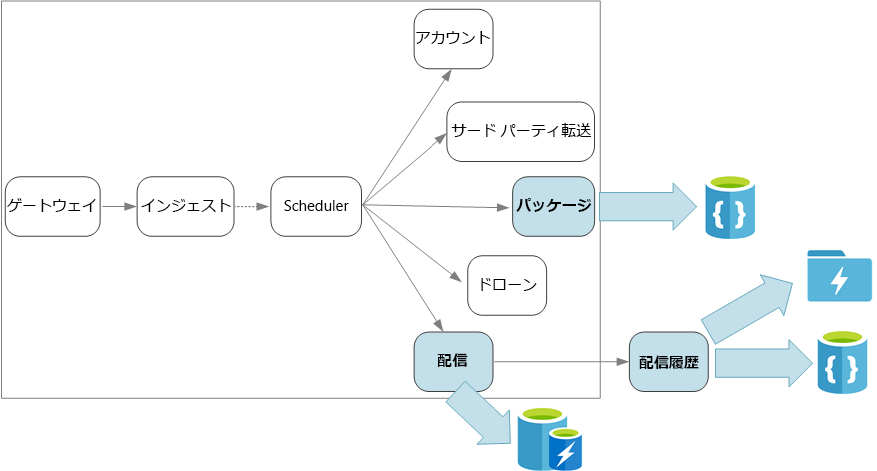

# マイクロサービスのデータに関する考慮事項

この記事では、マイクロサービス アーキテクチャでデータを管理するための考慮事項を説明します。 それぞれのマイクロサービスが自らのデータを管理するため、データの整合性とデータの一貫性が重要な課題です。

マイクロサービスの基本原則は、各サービスがそれぞれ自身のデータを管理することです。 2 つのサービスはデータ ストアを共有しません。 代わりに、各サービスは自身のプライベート データ ストアに責任を持ち、他のサービスがそのデータ ストアに直接アクセスすることはできません。

このルールの理由は、サービス同士の意図しない結合を回避するためです。サービスが基礎となるデータ スキーマを共有する場合はサービスの結合が発生することがあります。 データ スキーマに対する変更がある場合、そのデータベースに依存するすべてのサービス間でその変更を調整する必要があります。 各サービスのデータ ストアを分離させることにより、変更の範囲をg限定し、完全に独立したデプロイの機敏性を維持できます。 もう 1 つの理由は、各マイクロサービスが独自のデータ モデル、クエリ、読み取り/書き込みパターンを持つことができるようにするためです。 共有データ ストアを使用すると、各チームによる特定のサービス用のデータ ストレージの最適化が制限されます。

このアプローチは、[多言語パーシステンス](https://martinfowler.com/bliki/PolyglotPersistence.html) (単一アプリケーションで複数のデータ ストレージ テクノロジを使用すること) に自然につながります。 あるサービスでは、ドキュメント データベースのスキーマオンリード機能が必要な場合があります。 別のサービスでは、RDBMS で提供される参照整合性が必要な場合があります。 各チームはそれぞれのサービスに最適な選択を自由に行うことができます。 多言語パーシステンスの原則について詳しくは、「[ジョブに最適なデータ ストアの使用](../../guide/design-principles/use-the-best-data-store.md)」をご覧ください。

> [!NOTE]
> 複数のサービスが同じ物理データベース サーバーを共有することは問題ありません。 問題が発生するのは、サービスが同じスキーマを共有するとき、すなわちデータベース テーブルの同じセットに対して読み取りや書き込みを行うときです。

## 課題

データの管理に対するこのような分散アプローチからいくつかの課題が生じています。 まず、複数の場所に同一アイテムのデータが出現し、データ ストア間で冗長性が存在する場合があります。 たとえば、データがトランザクションの一部として格納され、さらに分析、レポート、またはアーカイブのために別の場所に格納される場合があります。 重複したデータつまりパーティション分割されたデータが、データの整合性や一貫性の問題を引き起こす可能性があります。 データ リレーションシップが複数のサービスにまたがる場合、従来のデータ管理方法を使用してそのリレーションシップを適用することはできません。

従来のデータ モデルでは "1 箇所に 1 つのファクト" というルールが使用されます。 どのエンティティもスキーマ内で 1 回だけ出現します。 他のエンティティがそのエンティティに対する参照を保持することはできますが、複製することはできません。 従来のアプローチの明らかな利点は、更新が 1 箇所で行われるためデータ一貫性に関する問題を回避できることです。 マイクロサービス アーキテクチャでは、サービス間で更新を伝播する方法や、データが複数の場所に存在するために一貫性が十分でない場合に最終的な一貫性を管理する方法を考慮する必要があります。

## データ管理のアプローチ

すべてのケースで正解になる 1 つのアプローチはありませんが、マイクロサービス アーキテクチャでデータを管理するための一般的なガイドラインをいくつか説明します。

- 可能であれば、最終的な整合性を優先します。 システム内で、強力な一貫性すなわち ACID トランザクションを必要とする場所と、最終的な一貫性が許容される場所を理解します。

- 強力な一貫性が必要な場合には、1 つのサービスが所定のエンティティの真のソースを表すことができます。これは API を介して公開されます。 その他のサービスは、データまたはデータのサブセットのコピーを独自に保持する可能性があります。これらは、最終的にマスター データと一貫性を持つようになりますが、真のソースとは見なされません。 たとえば、顧客発注サービスと推奨サービスを含む eコマース システムを想像してください。 推奨サービスは発注サービスのイベントをリッスンしますが、顧客が払い戻しを要求した場合に、完全なトランザクション履歴を持っているのは推奨サービスではなく発注サービスです。

- トランザクションの場合は、[Scheduler Agent Supervisor](../../patterns/scheduler-agent-supervisor.md) や[補正トランザクション](../../patterns/compensating-transaction.md)などのパターンを使用して、複数のサービス間でデータ一貫性を保ちます。  複数のサービス間での部分的な失敗を回避するため、場合によっては、複数のサービスにまたがる作業単位の状態を取得する追加データを格納する必要があります。 たとえば、複数ステップのトランザクションが進行している間、永続的なキューに作業項目を保持します。

- サービスに必要なデータだけを格納します。 サービスでは、ドメイン エンティティに関する情報のサブセットのみが必要になることがあります。 たとえば、配送のコンテキスト境界では、特定の配送にどの顧客が関連付けられているかを知る必要があります。 ただし、顧客の請求先住所は必要がありません。これはアカウントのコンテキスト境界によって管理されます。 ドメインについて注意深く考えることと DDD アプローチを使用することが、ここでは役立ちます。

- サービスが明確であり、ゆるやかに結合かれているかどうかを考慮します。 2 つのサービスが互いに情報の交換を継続し、API の使用頻度が高い場合は、2 つのサービスをマージするか、それらのサービスの機能をリファクタリングして、サービスの境界を設定し直す必要があるかもしれません。

- [イベント ドリブン アーキテクチャのスタイル](../../guide/architecture-styles/event-driven.md)を使用します。 このアーキテクチャ スタイルでは、サービスがイベントを発行するのは、サービスのパブリック モデルまたはエンティティに変更がある場合です。 関心を持つサービスがそのようなイベントをサブスクライブできます。 たとえば、別のサービスがイベントを使用して、データの具体化されたビュー (クエリに適している) を構築できます。

- イベントを所有するサービスはスキーマを公開する必要があります。これはイベントのシリアル化やシリアル化解除の自動化に使用でき、パブリッシャーとサブスクライバーの密接な結合が回避されます。 JSON スキーマ、または [Microsoft Bond](https://github.com/Microsoft/bond)、Protobuf、Avro などのフレームワークを検討してください。

- 大きな規模で見ると、イベントはシステムのボトルネックになることもあります。集計やバッチ処理を使用して、全体的な負荷を下げることを検討してください。

## 例:ドローン配送アプリケーションのデータ ストアを選択する

このシリーズのこれまでの記事では、継続的な例としてドローン配送サービスについて説明しています。 シナリオおよび対応する参照実装の詳細については、[こちら](./index.md)を参照してください。

要約すると、このアプリケーションでは、ドローンによる配送をスケジュールするための複数のマイクロサービスを定義します。 ユーザーが新しい配送をスケジュール設定すると、クライアント要求には、配送 (集荷場所や引き渡し場所) とパッケージ (サイズや重量) に関する情報が含まれます。 この情報によって作業単位が定義されます。

さまざまなバックエンド サービスは、要求の情報の異なる部分に関心を持ち、読み取りと書き込みのプロファイルも異なっています。

### 配送サービス

配送サービスは、現在スケジュールされている配送または進行中の配送すべてについての情報を格納します。 ドローンからのイベントをリッスンし、進行中の配送の状態を追跡します。 配送状態の更新を含むドメイン イベントの送信も行います。

ユーザーはパッケージを待っている間に配送の状態を頻繁に確認すると考えられます。 そのため、配送サービスでは、長期的な格納よりもスループット (読み取りおよび書き込み) を重視したデータ ストアが必要です。 また、配送サービスは複雑なクエリや分析は実行しません。所定の配送に関する最新状態をフェッチするだけです。 配信サービス チームは、読み取りと書き込みの性能の高さから Azure Redis Cache を選択しました。 Redis に格納される情報の存続期間は比較的短めです。 配信が完了すると、配送履歴サービスがレコードのシステムになります。

### 配送履歴サービス

配送履歴サービスは、配送サービスからの配送状態イベントをリッスンします。 そのデータを長期的なストレージに格納します。 この履歴データには 2 つの異なるユースケースがあり、データ記憶域の要件も異なります。

最初のシナリオは、業務の最適化またはサービス品質の向上を目的とした、データ分析のためのデータの集計です。 配送履歴サービスは実際のデータ分析を実行しないことに注意してください。 インジェストと格納のみを担当します。 このシナリオでは、ストレージは大容量のデータ セット用ではなくデータ分析用に最適化する必要があります。スキーマオンリード アプローチを使用して、さまざまなデータ ソースを格納するようにします。 [Azure Data Lake Store](/azure/data-lake-store/) はこのシナリオに最適です。 Data Lake Store は、Hadoop 分散ファイル システム (HDFS) と互換性のある Apache Hadoop ファイル システムであり、データ分析シナリオに適したパフォーマンスにチューニングされています。

もう 1 つのシナリオは、配送の完了後にユーザーが配送履歴を調べられるようにすることです。 Azure Data Lake はこのシナリオに特に適しているわけではありません。 最適なパフォーマンスを得るには、Data Lake において日付でパーティション分割されたフォルダーに時系列データを格納することをお勧めします。 (「[Azure Data Lake Store のパフォーマンス チューニング](/azure/data-lake-store/data-lake-store-performance-tuning-guidance)」をご覧ください)。 ただし、この構造は個々のレコードを ID で検索するには向いていません。 タイムスタンプもわかっているのではない限り、ID による検索ではコレクション全体のスキャンが必要です。 そのため、配送履歴サービスは迅速な検索のために履歴データのサブセットを Cosmos DB にも格納します。 レコードを Cosmos DB に無期限に保存する必要はありません。 たとえば、1 か月以上前の古い配送レコードはアーカイブできます。 これはバッチ プロセスを不定期に実行して処理できます。

### パッケージ サービス

パッケージ サービスは、すべてのパッケージに関する情報を格納します。 パッケージのストレージの要件は次のとおりです。

- 長期ストレージ。
- 多数のパッケージを処理できるように、高い書き込みスループットが必要です。
- パッケージ ID による単純なクエリに対応します。 複雑な結合はなく、参照整合性も必要ありません。

パッケージのデータはリレーショナルではないため、ドキュメント指向データベースが適切です。Cosmos DB はシャード コレクションを使用して非常に高いスループットを実現できます。 パッケージ サービスに取り組むチームは MEAN スタック (MongoDB、Express.js、AngularJS、Node.js) に詳しいため、Cosmos DB 対応の [MongoDB API](/azure/cosmos-db/mongodb-introduction) を選択しました。 これにより、MongoDB での経験を活用しながら、管理型 Azure サービスである Cosmos DB のメリットを得ることができます。
