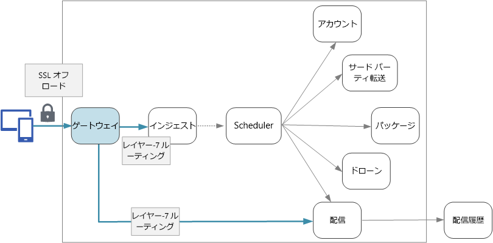

# マイクロサービスの設計: API ゲートウェイ

マイクロサービス アーキテクチャでは、クライアントは、1 つ以上のフロント エンド サービスと対話する可能性があります。 この事実を前提として、クライアントは、呼び出し先のエンドポイントをどのような方法で知るのでしょうか。 新しいサービスが導入されたり、既存のサービスがリファクタリングされた場合は何が起こるのでしょうか。 サービスは、SSL 終了、認証、およびその他の問題をどのように処理するのでしょうか。 "*API ゲートウェイ*" は、これらの課題に対処するのに役立ちます。 

## API ゲートウェイとは

API ゲートウェイは、クライアントとサービスの間に位置します。 それは、要求をクライアントからサービスにルーティングするリバース プロキシとして機能します。 さらに、認証、SSL 終了、レート制限などのさまざまな横断的タスクを実行できます。 ゲートウェイをデプロイしない場合、クライアントは、フロント エンド サービスに直接要求を送信する必要があります。 ただし、クライアントにサービスを直接公開することには潜在的な問題があります。

- クライアント コードが複雑になる可能性があります。 クライアントは、複数のエンドポイントを追跡し、回復力のある方法でエラーを処理する必要があります。 
- クライアントとバックエンド間の結合が作成されます。 クライアントは、個々のサービスを分解する方法を知る必要があります。 これにより、クライアントの管理がますます困難になり、同時にサービスのリファクターも難しくなります。
- 単一の操作で、複数のサービスの呼び出しが必要な場合があります。 これにより、クライアントとサーバー間で複数のネットワーク ラウンド トリップが発生し、待機時間が大幅に長くなる可能性があります。 
- 各公開サービスで、認証、SSL、クライアントのレート制限などの問題を処理する必要があります。 
- サービスは、HTTP や WebSocket などのクライアントに適したプロトコルを公開する必要があります。 これにより、[通信プロトコル](./interservice-communication.md)の選択肢が制限されます。 
- パブリック エンドポイントを使用するサービスは潜在的な攻撃対象であるため、セキュリティで保護する必要があります。

ゲートウェイは、サービスからクライアントを分離することによって、これらの問題に対処するのに役立ちます。 ゲートウェイは、多数の異なる機能を実行できますが、そのすべてが必要であるわけではありません。 機能は、次のデザイン パターンに分類できます。

[ゲートウェイ ルーティング](../patterns/gateway-routing.md)。 第 7 層のルーティングを使用して、1 つ以上のバックエンド サービスに要求をルーティングするリバース プロキシとしてゲートウェイを使用します。 ゲートウェイは、クライアントに単一のエンドポイントを提供し、サービスからクライアントを分離するのに役立ちます。 

[ゲートウェイ集約](../patterns/gateway-aggregation.md)。 ゲートウェイを使用して、複数の個々の要求を 1 つの要求に集約します。 このパターンは、単一の操作で複数のバックエンド サービスを呼び出す必要がある場合に適用されます。 クライアントは、1 つの要求をゲートウェイに送信します。 ゲートウェイはさまざまなバックエンド サービスに要求をディスパッチし、結果を集計し、それらをクライアントに送り返します。 これにより、クライアントとバックエンド間の頻繁な通信を削減できます。 

[ゲートウェイ オフロード](../patterns/gateway-offloading.md)。 ゲートウェイを使用して、個々 のサービスからゲートウェイに機能をオフロードします。これは特に横断的問題に適用します。 すべてのサービスに機能を実装する責任を負わせるよりも、機能を 1 か所に統合するほうが有用である可能性があります。 これは、認証や承認など、正しく実装するには専門的な技能を必要とする機能に特に当てはまります。 

ゲートウェイにオフロードすることができる機能のいくつかの例を次に示します。

- SSL 終了
- 認証
- IP ホワイトリスト登録
- クライアントのレート制限 (調整)
- ログ記録と監視
- 応答のキャッシュ
- Web アプリケーション ファイアウォール
- GZIP 圧縮
- 静的コンテンツの処理

## ゲートウェイ テクノロジの選択

アプリケーションで API ゲートウェイを実装するためのいくつかのオプションを示します。

- **リバース プロキシ サーバー**。 Nginx と HAProxy は、負荷分散、SSL、第 7 層のルーティングなどの機能をサポートする一般的なリバース プロキシ サーバーです。 どちらも無料のオープン ソース製品であり、有償エディションで追加機能とサポート オプションが提供されます。 Nginx と HAProxy は、どちらも豊富な機能セットと高パフォーマンスを備えた完成度の高い製品です。 サードパーティ モジュールの使用や Lua でのカスタム スクリプトの記述によって、それらを拡張できます。 Nginx では、NginScript と呼ばれる JavaScript ベースのスクリプト モジュールもサポートしています。

- **サービス メッシュ イングレス コントローラー**。 linkerd や Istio などのサービス メッシュを使用している場合は、そのサービス メッシュのイングレス コントローラーによって提供される機能を検討します。 たとえば、Istio イングレス コントローラーは、第 7 層のルーティング、HTTP リダイレクト、再試行、およびその他の機能をサポートしています。 

- [Azure Application Gateway](/azure/application-gateway/)。 Application Gateway は、第 7 層のルーティングと SSL 終了を実行できる負荷分散管理対象サービスです。 Web アプリケーション ファイアウォール (WAF) も提供します。

- [Azure API Management](/azure/api-management/)。 API Management は、API を外部顧客と内部顧客に公開するためのターンキー ソリューションです。 公開 API を管理するために役立つ機能 (レート制限、IP ホワイトリスト登録、Azure Active Directory やその他の ID プロバイダーを使用した認証など) を提供します。 API Management は負荷分散を実行しないため、Application Gateway やリバース プロキシなどのロード バランサーと組み合わせて使用する必要があります。

ゲートウェイ テクノロジを選択するときは、以下を考慮してください。

**機能**。 上記のオプションはすべてが第 7 層のルーティングをサポートしますが、その他の機能に対するサポートは異なっています。 必要な機能に応じて、複数のゲートウェイをデプロイできます。 

**デプロイ**。 Azure Application Gateway と API Management は管理対象サービスです。 Nginx と HAProxy は通常、クラスター内のコンテナーで実行されますが、クラスター外の専用 VM にデプロイすることもできます。 これを行うと、ゲートウェイはワークロードの残りの部分から分離されますが、高い管理オーバーヘッドが発生します。

**管理**。 サービスが更新されたり、新しいサービスが追加されたりした場合、ゲートウェイのルーティング規則の更新が必要になる場合があります。 このプロセスを管理する方法を検討してください。 類似の検討が、SSL 証明書、IP ホワイトリスト登録、および構成の他の側面の管理にも適用されます。

## デプロイに関する考慮事項

### Nginx または HAProxy の Kubernetes へのデプロイ

Nginx または HAProxy は、Nginx または HAProxy コンテナー イメージを指定する [ReplicaSet](https://kubernetes.io/docs/concepts/workloads/controllers/replicaset/) または [DaemonSet](https://kubernetes.io/docs/concepts/workloads/controllers/daemonset/) として Kubernetes に デプロイできます。 ConfigMap を使用してプロキシの構成ファイルを格納し、ConfigMap をボリュームとしてマウントします。 LoadBalancer という種類のサービスを作成し、Azure Load Balancer 経由でゲートウェイを公開します。 

<!-- - Configure a readiness probe that serves a static file from the gateway (rather than routing to another service). -->

別の方法は、Ingress Controller の作成です。 Ingress Controller は、ロード バランサーまたはリバース プロキシ サーバーをデプロイする Kubernetes リソースです。 Nginx と HAProxy を含むさまざまな実装が存在します。 Ingress と呼ばれる別のリソースが、Ingress Controller のルーティング規則や TLS 証明書などの設定を定義します。 つまり、特定のプロキシ サーバー テクノロジに固有の複雑な構成ファイルを管理する必要はありません。 この記事の執筆時点では、Ingress Controller はまだ Kubernetes のベータ機能であり、今後も進化し続けるでしょう。

ゲートウェイは、システム内の潜在的なボトルネックまたは単一障害点であるため、高可用性のためには、常に少なくとも 2 つのレプリカをデプロイします。 負荷に応じて、レプリカをさらにスケールアウトしなければならない場合があります。 

また、ゲートウェイをクラスター内の専用ノード セットで実行することを検討します。 この方法には次のような利点があります。

- 分離。 すべての着信トラフィックは、バックエンド サービスから分離できるノードの固定セットに送信されます。

- 安定した構成。 ゲートウェイが正しく構成されていない場合、アプリケーション全体が使用できなくなる可能性があります。 

- パフォーマンス。 パフォーマンス上の理由から、ゲートウェイ用の特定の VM 構成を使用できます。

<!-- - Load balancing. You can configure the external load balancer so that requests always go to a gateway node. That can save a network hop, which would otherwise happen whenever a request lands on a node that isn't running a gateway pod. This consideration applies mainly to large clusters, where the gateway runs on a relatively small fraction of the total nodes. In Azure Container Service (ACS), this approach currently requires [ACS Engine](https://github.com/Azure/acs-engine)) which allows you to create multiple agent pools. Then you can deploy the gateway as a DaemonSet to the front-end pool. -->

### Azure Application Gateway

Azure で Application Gateway を Kubernetes クラスターに接続するには:

1. クラスター VNet に空のサブネットを作成します。
2. Application Gateway をデプロイします。
3. Kubernetes サービスを type=[NodePort](https://kubernetes.io/docs/concepts/services-networking/service/#type-nodeport) で作成します。 これで、各ノードのサービスが公開され、クラスターの外部からアクセスできるようになります。 ロード バランサーは作成されません。
5. サービスに割り当てられたポート番号を取得します。
6. 次の内容の Application Gateway 規則を追加します。
    - バックエンド プールにエージェント VM が含まれる。
    - HTTP 設定で、サービスのポート番号が指定される。
    - ゲートウェイ リスナーはポート 80/443 でリッスンする。
    
高可用性のために、2 以上のインスタンス数を設定します。

### Azure API Management 

Azure で API Management を Kubernetes クラスターに接続するには:

1. クラスター VNet に空のサブネットを作成します。
2. API Management をそのサブネットにデプロイします。
3. LoadBalancer という種類の Kubernetes サービスを作成します。 既定のインターネットに接続するロード バランサーではなく、[内部ロード バランサー](https://kubernetes.io/docs/concepts/services-networking/service/#internal-load-balancer)の注釈を使用して内部ロード バランサーを作成します。
4. kubectl または Azure CLI を使用して、内部ロード バランサーのプライベート IP を検索します。
5. API Management を使用して、ロード バランサーの IP アドレスにアクセスする API を作成します。

API Management とリバース プロキシ (Nginx、HAProxy、または Azure Application Gateway) を組み合わせることを検討してください。 API Management と Application Gateway の使用の詳細については、「[内部 VNET 内の API Management と Application Gateway の統合](/azure/api-management/api-management-howto-integrate-internal-vnet-appgateway)」を参照してください。

> [!div class="nextstepaction"]
> [ログ記録と監視](./logging-monitoring.md)
