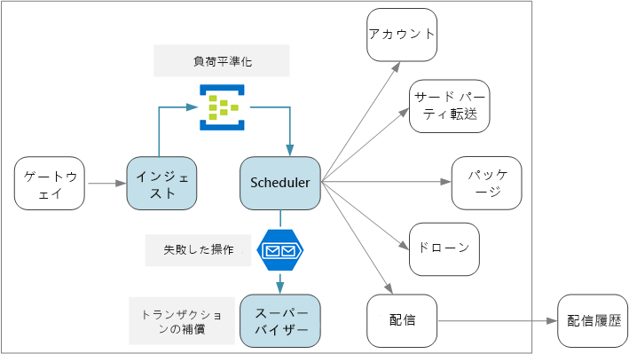
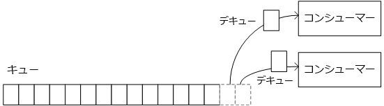
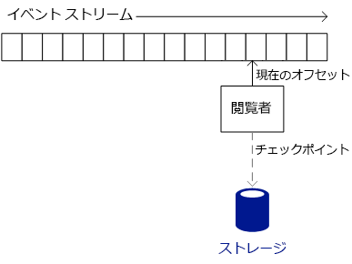
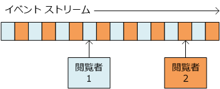
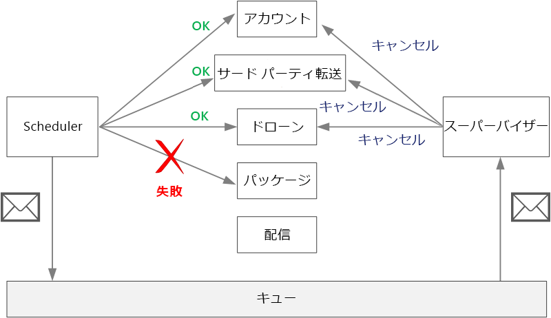

# <a name="designing-microservices-ingestion-and-workflow"></a>マイクロサービスの設計: インジェストとワークフロー

多くの場合、マイクロサービスには、1 つのトランザクションの複数のサービスにまたがるワークフローがあります。 ワークフローは信頼性が高くなくてはなりません。トランザクションが失われたり、部分的に完了した状態のままになったりしてはなりません。 また、受信要求のインジェスト速度を制御することも重要です。 多くの小さなサービスが互いに通信している状況では、受信要求の急増がサービス間通信に大きな負荷をかけることがあります。 



## <a name="the-drone-delivery-workflow"></a>ドローン配信ワークフロー

ドローン配信アプリケーションでは、配信をスケジュールするために以下の操作を実行する必要があります。

1. お客様のアカウントの状態を確認します (アカウント サービス)。
2. 新しいパッケージ エンティティを作成します (パッケージ サービス)。
3. ピックアップと配信の場所に基づいて、この配信にサードパーティの転送が必要かどうかを確認します (サードパーティ転送サービス)。
4. ドローンにピックアップをスケジュールします (ドローン サービス)。
5. 新しい配信エンティティを作成します (配信サービス)。

これはアプリケーション全体の中核であるため、エンドツーエンド プロセスには高いパフォーマンスと信頼性が必要です。 いくつかの特定の課題に対処する必要があります。

- **負荷平準化**。 クライアント要求が多すぎると、システムはサービス間ネットワーク トラフィックによって過負荷になることがあります。 ストレージやリモート サービスなどのバックエンドの依存関係も圧迫されることがあります。 これらを呼び出すサービスを調整し、システムに背圧を作成することで対応できます。 そのため、システムに送信される要求をバッファーやキューに入れて処理することで、その負荷を平準化することが重要です。 

- **保証された配信**。 クライアント要求のドロップを避けるには、インジェスト コンポーネントが少なくとも 1 回のメッセージ配信を保証する必要があります。 

- **エラー処理**。 いずれかのサービスがエラー コードを返すか、一時的ではないエラーが発生する場合は、配信をスケジュールできません。 エラー コードは、予期されるエラー状態 (たとえば、お客様のアカウントが一時停止されている) または予期しないサーバー エラー (HTTP 5xx) を示す可能性があります。 サービスも利用不可になり、ネットワーク呼び出しがタイムアウトになる原因となることがあります。 

まず、式のインジェスト側 (システムが高スループットで受信ユーザー要求を取り込む方法) を確認します。 次に、ドローン配信アプリケーションで信頼できるワークフローを実装する方法を検討します。 インジェスト サブシステムの設計がワークフロー バックエンドに影響することがわかります。 

## <a name="ingestion"></a>データの取り込み

ビジネス要件に基づいて、開発チームは、インジェストについて次の非機能的要件を識別しました。

- 10 K 要求数/秒の持続スループット。
- クライアント要求のドロップやタイムアウトなしで最大 50 K/秒の急増に対応できること。
- 99 パーセンタイルで 500 ミリ秒未満の待機時間。

トラフィックの不定期な急増の処理の要件は、設計上の課題を提示します。 理論上は、システムをスケールアウトして、予想される最大トラフィックを処理できます。 しかし、多くのリソースのプロビジョニングはとても非効率的です。 ほとんどの期間、アプリケーションはそれほど大きな容量を必要としないため、コアがアイドル状態となり、費用をかけても価値は付加されません。

より適切な手法は、受信要求をバッファーに入れて、バッファーで負荷を平準化することです。 この設計では、インジェスト サービスは短期間に最大のインジェスト速度を処理できる必要がありますが、バックエンド サービスが処理する必要があるのは最大の持続的負荷だけです。 フロント エンドでバッファー処理すると、バックエンド サービスはトラフィックの急増を処理する必要がなくなります。 ドローン配信アプリケーションに必要なスケールでは、[Azure Event Hubs](/azure/event-hubs/) が負荷平準化に適しています。 Event Hubs は、低待機時間と高スループットを提供し、大量のインジェストにおけるコスト効果の高いソリューションとなります。 

テストでは、32 パーティションと 100 スループット ユニットの Standard レベルのイベント ハブを使いました。 約 90 ミリ秒の待機時間で約 32 K イベント/秒のインジェストが見られました。 現時点では、既定の上限は 20 スループット ユニットですが、Azure のお客様は、サポート リクエストを申請することによって追加スループット ユニットを要求できます。 詳しくは、「[Event Hubs のクォータ](/azure/event-hubs/event-hubs-quotas)」をご覧ください。 すべてのパフォーマンス メトリックと同様に、メッセージ ペイロード サイズなどの多くの要因がパフォーマンスに影響する可能性があるため、これらの数値をベンチマークとして解釈しないでください。 より高いスループットが必要な場合、インジェスト サービスは複数のイベント ハブ間でシャード化することができます。 さらに高いスループット レートを実現するために、[Event Hubs Dedicated](/azure/event-hubs/event-hubs-dedicated-overview) は 1 秒あたり 200 万を超えるイベントを受信できるシングル テナント デプロイを提供します。

Event Hubs が高スループットなどを実現する方法はクライアントが Event Hubs からのメッセージを使用する方法に影響するため、これを理解することが重要です。 Event Hubs は "*キュー*" を実装しません。 代わりに、"*イベント ストリーム*" を実装します。 

キューでは、個々のコンシューマーがキューからメッセージを削除することができ、次のコンシューマーにはそのメッセージは見えません。 そのため、キューを使うと、[競合コンシューマー パターン](../patterns/competing-consumers.md)を使ってメッセージを並列に処理し、スケーラビリティを向上させることができます。 回復性を高めるために、コンシューマーはメッセージをロックし、メッセージの処理が終わったときにロックを解放します。 コンシューマーが失敗した場合 (たとえば、実行されているノードがクラッシュした場合)、ロックはタイムアウトになり、メッセージはキューに戻ります。 



一方、Event Hubs は、ストリーミング セマンティクスを使います。 コンシューマーは、独自のペースでストリームを独立して読み取ります。 各コンシューマーには、ストリームの現在位置を追跡する責任があります。 コンシューマーは、事前定義された間隔で永続的ストレージに現在位置を書き込む必要があります。 このように、コンシューマーで障害が発生した場合 (たとえば、コンシューマーがクラッシュした場合や、ホストに障害が発生した場合)、新しいインスタンスは最後に記録された位置からストリームの読み取りを再開できます。 このプロセスを "*チェックポイント処理*" と呼びます。 

パフォーマンス上の理由から、コンシューマーは一般に各メッセージの後にはチェックポイント処理を行いません。 代わりに、*n* メッセージを処理した後や *n* 秒ごとなど、固定間隔でチェックポイント処理を行います。 結果として、新しいインスタンスは常に最新のチェックポイントから取得するため、コンシューマーが失敗した場合は一部のイベントが 2 回処理されます。 頻繁なチェックポイント処理はパフォーマンスを低下させる可能性がありますが、チェックポイント処理の頻度が低いとエラー発生後に再実行するイベントが多くなるというトレードオフがあります。  


 
Event Hubs は、競合コンシューマー用に設計されていません。 複数のコンシューマーがストリームを読み取ることができますが、それぞれが独立してストリームを走査します。 代わりに、Event Hubs は、パーティション分割されたコンシューマー パターンを使います。 Event hub には、最大 32 個のパーティションがあります。 水平スケールは、各パーティションに個別のコンシューマーを割り当てることによって実現されます。

これはドローン配信ワークフローでどのような意味を持つでしょうか。 Event Hubs のメリットを最大限に活用するために、Delivery Scheduler は、次に進む前に各メッセージが処理されるのを待つことができません。 待った場合は、ほとんどの時間をネットワーク呼び出しの完了の待機に費やすことになります。 代わりに、バックエンド サービスへの非同期呼び出しを使って、メッセージのバッチを並列に処理する必要があります。 このように、正しいチェックポイント処理戦略の選択も重要です。  

## <a name="workflow"></a>ワークフロー

メッセージの読み取りと処理について、イベント プロセッサ ホスト、Service Bus キュー、IoTHub React ライブラリの 3 つのオプションを検討しました。 IoTHub React を選びましたが、その理由を理解するには、イベント プロセッサ ホストから開始するのが役立ちます。 

### <a name="event-processor-host"></a>イベント プロセッサ ホスト

イベント プロセッサ ホストは、メッセージ バッチ処理用に設計されています。 アプリケーションは `IEventProcessor` インターフェイスを実装し、プロセッサ ホストはイベント ハブのパーティションごとに 1 つのイベント プロセッサ インスタンスを作成します。 イベント プロセッサ ホストは、イベント メッセージのバッチで各イベント プロセッサの `ProcessEventsAsync` メソッドを呼び出します。 アプリケーションは `ProcessEventsAsync` メソッドの内部のチェックポイント処理のタイミングを制御し、イベント プロセッサ ホストはチェックポイントを Azure ストレージに書き込みます。 

パーティション内で、イベント プロセッサ ホストは `ProcessEventsAsync` が戻るのを待ってから、次のバッチでもう一度呼び出します。 この手法では、イベント処理コードが再入可能である必要がないため、プログラミング モデルが簡略化されます。 ただし、これはイベント プロセッサが一度に 1 つのバッチを処理することも意味するため、プロセッサ ホストがメッセージを取り込む速度が制限されます。

> [!NOTE] 
> プロセッサ ホストは、スレッドをブロックするという意味では実際には "*待機*" しません。 `ProcessEventsAsync` メソッドは非同期であるため、プロセッサ ホストはメソッドの実行中に他の作業を行うことができます。 ただし、メソッドが戻るまで、そのパーティションのメッセージの別のバッチは配信されません。 

ドローン アプリケーションでは、メッセージのバッチを並列に処理することができます。 ただし、バッチ全体の完了の待機によってボトルネックが生じることがあります。 処理の速度は、バッチ内で最も遅いメッセージの速度以下になります。 応答時間の変動により、少数の低速な応答がシステム全体の速度を低下させる "ロング テール" が作成されることがあります。 パフォーマンス テストでは、この手法を使うとターゲット スループットが達成されませんでした。 これは、イベント プロセッサ ホストの使用を避ける必要があるという意味では "*ありません*"。 ただし、高いスループットを実現するには、`ProcesssEventsAsync` メソッド内での実行時間の長いタスクの実行は避けてください。 各バッチを迅速に処理します。

### <a name="iothub-react"></a>IotHub React 

[IotHub React](https://github.com/Azure/toketi-iothubreact) は、Event Hub からイベントを読み取るための Akka Streams ライブラリです。 Akka Streams は、[Reactive Streams](http://www.reactive-streams.org/) 仕様を実装するストリーム ベースのプログラミング フレームワークです。 すべてのストリーミング操作が非同期的に実行され、パイプラインが背圧を適切に処理する効率的なストリーミング パイプラインを構築する方法を提供します。 背圧は、ダウンストリームのコンシューマーが受信できる速度よりも高速にイベント ソースがイベントを生成する場合に発生します。これはまさに、ドローン配信システムにトラフィックの急増がある状況です。 バックエンド サービスの速度が低下すると、IoTHub React の速度が低下します。 容量を増やすと、IoTHub React はパイプラインを通じてより多くのメッセージをプッシュします。

Akka Streams も、Event Hubs からのイベントのストリーミング用のとても自然なプログラミング モデルです。 イベントのバッチをループする代わりに、各イベントに適用される操作のセットを定義し、Akka Streams でストリーミングを処理します。 Akka Streams は、"*ソース*"、"*フロー*"、"*シンク*" の観点でストリーミング パイプラインを定義します。 ソースは出力ストリームを生成し、フローは入力ストリームを処理して出力ストリームを生成します。シンクは出力を生成せずにストリームを消費します。

Akka Streams パイプラインを設定する Scheduler サービスのコードを次に示します。

```java
IoTHub iotHub = new IoTHub();
Source<MessageFromDevice, NotUsed> messages = iotHub.source(options);

messages.map(msg -> DeliveryRequestEventProcessor.parseDeliveryRequest(msg))
        .filter(ad -> ad.getDelivery() != null).via(deliveryProcessor()).to(iotHub.checkpointSink())
        .run(streamMaterializer);
```

このコードは、Event Hubs をソースとして構成します。 `map` ステートメントは、各イベント メッセージを、配信要求を表す Java クラスに逆シリアル化します。 `filter` ステートメントは、ストリームから `null` オブジェクトを削除します。これにより、メッセージを逆シリアル化できないケースを防止します。 `via` ステートメントは、各配信要求を処理するフローにソースを結合します。 `to` メソッドは、IoTHub React に組み込まれているチェックポイント シンクにフローを結合します。

IoTHub React は、Event Host Processor とは異なるチェックポイント処理戦略を使います。 チェックポイントはチェックポイント シンクによって書き込まれます。これはパイプラインの終了段階です。 Akka Streams の設計では、パイプラインはシンクがチェックポイントを書き込んでいるときにデータのストリーミングを続行できます。 つまり、アップストリームの処理段階は、チェックポイント処理が行われるのを待つ必要がありません。 タイムアウトの後、または一定数のメッセージが処理された後にチェックポイント処理が行われるように構成することができます。

`deliveryProcessor` メソッドは、Akka Streams フローを作成します。  

```java
private static Flow<AkkaDelivery, MessageFromDevice, NotUsed> deliveryProcessor() {
    return Flow.of(AkkaDelivery.class).map(delivery -> {
        CompletableFuture<DeliverySchedule> completableSchedule = DeliveryRequestEventProcessor
                .processDeliveryRequestAsync(delivery.getDelivery(), 
                        delivery.getMessageFromDevice().properties());
        
        completableSchedule.whenComplete((deliverySchedule,error) -> {
            if (error!=null){
                Log.info("failed delivery" + error.getStackTrace());
            }
            else{
                Log.info("Completed Delivery",deliverySchedule.toString());
            }
                                
        });
        completableSchedule = null;
        return delivery.getMessageFromDevice();
    });
}
```

フローは、各メッセージの処理の実際の作業を行う静的な `processDeliveryRequestAsync` メソッドを呼び出します。

### <a name="scaling-with-iothub-react"></a>IoTHub React でのスケーリング

Scheduler サービスは、各コンテナー インスタンスが 1 つのパーティションから読み取るように設計されています。 たとえば、Event Hub に 32 のパーティションがある場合、Scheduler サービスは 32 のレプリカと共にデプロイされます。 このため、水平スケーリングの観点から高い柔軟性に対応できます。 

クラスターのサイズによっては、クラスター内のノードで複数の Scheduler サービス ポッドが実行されることがあります。 ただし、Scheduler サービスにより多くのリソースが必要な場合は、より多くのノードにポッドを分散するためにクラスターをスケールアウトできます。 Scheduler サービスはメモリとスレッドに依存するため、パフォーマンスは VM のサイズとノードあたりのポッド数に大きく依存することがパフォーマンス テストで示されました。

各インスタンスは、どの Event Hubs パーティションから読み取るかを知る必要があります。 パーティション番号を構成するために、Kubernetes の [StatefulSet](https://kubernetes.io/docs/concepts/workloads/controllers/statefulset/) リソースの種類を利用しました。 StatefulSet のポッドには、数値インデックスを含む永続的な識別子があります。 具体的には、ポッド名は `<statefulset name>-<index>` で、この値は Kubernetes [Downward API](https://kubernetes.io/docs/tasks/inject-data-application/downward-api-volume-expose-pod-information/) を通じてコンテナーで使用できます。 実行時に、Scheduler サービスはポッド名を読み取り、ポッド インデックスをパーティション ID として使います。

Scheduler サービスをさらにスケールアウトする必要がある場合は、イベント ハブ パーティションごとに複数のポッドを割り当てて、複数のポッドが各パーティションを読み取るようにすることができます。 ただし、その場合は、各インスタンスが割り当てられたパーティション内のすべてのイベントを読み取ります。 処理の重複を避けるために、ハッシュ アルゴリズムを使って、各インスタンスがメッセージの一部をスキップするようにする必要があります。 こうすれば、複数のリーダーがストリームを使用できますが、各メッセージは 1 つのインスタンスによってのみ処理されます。 
 


### <a name="service-bus-queues"></a>Service Bus キュー

検討した 3 番目のオプションは、Event Hubs から Service Bus キューにメッセージをコピーし、Scheduler サービスで Service Bus からメッセージを読み取ることでした。 Service Bus にコピーするためにのみ受信要求を Event Hubs に書き込むのは奇妙に思えるかもしれません。  しかし、各サービスのさまざまな長所を活用することが目的でした。Service Bus のキューのセマンティクスを活用して競合コンシューマー パターンを持つワークロードを処理しながら、Event Hubs を使って大量のトラフィックの急増を吸収します。 持続的なスループットのターゲットは、予想されるピーク時の負荷より小さいため、Service Bus キューの処理はメッセージ インジェストの処理ほど高速である必要はありません。
 
この手法を使って、概念実証の実装で 1 秒あたり約 4 K 操作を実現しました。 これらのテストでは、実際の作業を実行しないモック バックエンド サービスを使いましたが、単純に固定量のサービスあたり待機時間が追加されました。 パフォーマンスの数値は、Service Bus の理論上の最大値よりもはるかに小さいことにご注意ください。 不一致について考えられる原因は次のとおりです。

- 接続プールの制限、並列処理の程度、プリフェッチ数、バッチ サイズなど、さまざまなクライアント パラメーターの値が最適でない。

- ネットワーク I/O のボトルネック。

- [ReceiveAndDelete](/rest/api/servicebus/receive-and-delete-message-destructive-read) ではなく [PeekLock](/rest/api/servicebus/peek-lock-message-non-destructive-read) モードを使ったため、メッセージの少なくとも 1 回の配信を保証する必要があった。

さらにパフォーマンス テストを行うと根本原因が見つかり、これらの問題を解決できる可能性があります。 しかし、IotHub React がパフォーマンス ターゲットを満たしていたため、このオプションを選びました。 とは言うものの、Service Bus はこのシナリオで有効なオプションです。

## <a name="handling-failures"></a>エラー処理 

考慮すべき 3 つの一般的なエラー クラスがあります。

1. ダウンストリーム サービスに、単独では解消できない可能性が高い、一時的ではないエラーがあります。 一時的でないエラーには、メソッドへの無効な入力などの通常のエラー条件が含まれます。 アプリケーション コードのハンドルされない例外やプロセスのクラッシュも含まれます。 この種類のエラーが発生した場合は、ビジネス トランザクション全体をエラーとしてマークする必要があります。 既に成功した同じトランザクションの他のステップを元に戻すことが必要な場合があります。 (下の「補正トランザクション」をご覧ください。)
 
2. ダウンストリーム サービスで、ネットワーク タイムアウトなどの一時的なエラーが発生している可能性があります。 多くの場合、これらのエラーは呼び出しを再試行するだけで解決できます。 一定回数やり直した後も操作がまだ失敗する場合は、一時的でないエラーと見なされます。 

3. (たとえば、ノードのクラッシュが原因で) Scheduler サービス自体に障害が発生している可能性があります。 その場合、Kubernetes はサービスの新しいインスタンスを起動します。 ただし、既に進行中のトランザクションを再開する必要があります。 

## <a name="compensating-transactions"></a>補正トランザクション

一時的でないエラーが発生した場合、現在のトランザクションは、1 つ以上のステップが既に正常に完了している "*部分的に失敗*" の状態になっている可能性があります。 たとえば、ドローン サービスがドローンを既にスケジュールしている場合は、ドローンをキャンセルする必要があります。 その場合、アプリケーションは[補正トランザクション](../patterns/compensating-transaction.md)を使って成功したステップを元に戻す必要があります。 場合によっては、これは外部システムで、または手動プロセスで行う必要があります。 

補正トランザクションのロジックが複雑な場合は、このプロセスを担当する別のサービスを作成することを検討します。 ドローン配信アプリケーションでは、Scheduler サービスは失敗した操作を専用のキューに格納します。 Supervisor と呼ばれる独立したマイクロサービスは、このキューから読み取り、補正が必要なサービスに対してキャンセル API を呼び出します。 これは [Scheduler Agent Supervisor パターン][scheduler-agent-supervisor]のバリエーションです。 Supervisor サービスは、テキストまたは電子メールによるユーザーへの通知や操作ダッシュボードへのアラートの送信などの他の操作も実行できます。 



## <a name="idempotent-vs-non-idempotent-operations"></a>べき等操作と非べき等操作

要求が失われないようにするために、Scheduler サービスはすべてのメッセージが少なくとも 1 回処理されることを保証する必要があります。 Event Hubs は、クライアントがチェックポイント処理を正しく行った場合に少なくとも 1 回の配信を保証できます。

Scheduler サービスがクラッシュした場合は、1 つ以上のクライアント要求の処理の途中である可能性があります。 これらのメッセージは、Scheduler の別のインスタンスによって取得され、再処理されます。 要求が 2 回処理されるとどうなるでしょうか。 作業の重複を避けることが重要です。 同じパッケージに 2 つのドローンを送信することは望ましくありません。

1 つの手法は、すべての操作をべき等となるように設計することです。 操作は、最初の呼び出しの後に複数回呼び出しても副次的な影響が生じない場合はべき等です。 つまり、クライアントは操作を 1 回、2 回、または複数回呼び出すことができ、その結果は同じになります。 基本的に、サービスは重複する呼び出しを無視する必要があります。 副次的な影響のあるメソッドをべき等とするには、サービスが重複する呼び出しを検出できる必要があります。 たとえば、サービスで新しい ID を生成するのではなく、呼び出し元が ID を割り当てるようにすることができます。 サービスは、重複する ID を確認できます。

> [!NOTE]
> HTTP 仕様では、GET、PUT、DELETE メソッドはべき等である必要があると規定されています。 POST メソッドは、べき等であることが保証されません。 POST メソッドで新しいリソースが作成される場合、通常、この操作がべき等であることは保証されません。 

べき等メソッドを記述するのは常に簡単であるとは限りません。 別のオプションは、永続ストア内のすべてのトランザクションの進行状況を Scheduler で追跡することです。 メッセージを処理するたびに、永続ストアで状態が検索されます。 各ステップの後に、結果がストアに書き込まれます。 こ手法はパフォーマンスに影響することがあります。

## <a name="example-idempotent-operations"></a>例: べき等操作

HTTP 仕様では、PUT メソッドはべき等である必要があると規定されています。 仕様では、べき等を次のように定義しています。

>  要求メソッドによる複数の同じ要求によってサーバー上で意図された効果が、単一のそのような要求の効果と同じである場合、そのメソッドは "べき等" と見なされます。 ([RFC 7231](https://tools.ietf.org/html/rfc7231#section-4))

新しいエンティティを作成するときに、PUT と POST のセマンティクスの違いを理解しておくことが重要です。 どちらの場合も、クライアントは要求本文でエンティティの表現を送信します。 ただし、URI の意味は異なります。

- POST メソッドでは、URI は、コレクションなど、新しいエンティティの親リソースを表します。 たとえば、新しい配信を作成するには、URI を `/api/deliveries` とすることができます。 サーバーは、エンティティを作成し、`/api/deliveries/39660` などの新しい URI を割り当てます。 この URI は、応答の Location ヘッダーで返されます。 クライアントが要求を送信するたびに、サーバーは新しい URI を持つ新しいエンティティを作成します。

- PUT メソッドでは、URI はエンティティを識別します。 その URI を持つエンティティが既に存在する場合、サーバーは要求のバージョンで既存のエンティティを置換します。 その URI を持つエンティティが存在しない場合、サーバーはそのエンティティを作成します。 たとえば、クライアントが PUT 要求を `api/deliveries/39660` に送信するとします。 その URI での配信がないと仮定した場合、サーバーは新しい配信を作成します。 クライアントが同じ要求をもう一度送信した場合、サーバーは既存のエンティティを置換します。

PUT メソッドの配信サービスの実装を次に示します。 

```csharp
[HttpPut("{id}")]
[ProducesResponseType(typeof(Delivery), 201)]
[ProducesResponseType(typeof(void), 204)]
public async Task<IActionResult> Put([FromBody]Delivery delivery, string id)
{
    logger.LogInformation("In Put action with delivery {Id}: {@DeliveryInfo}", id, delivery.ToLogInfo());
    try
    {
        var internalDelivery = delivery.ToInternal();

        // Create the new delivery entity.
        await deliveryRepository.CreateAsync(internalDelivery);

        // Create a delivery status event.
        var deliveryStatusEvent = new DeliveryStatusEvent { DeliveryId = delivery.Id, Stage = DeliveryEventType.Created };
        await deliveryStatusEventRepository.AddAsync(deliveryStatusEvent);

        // Return HTTP 201 (Created)
        return CreatedAtRoute("GetDelivery", new { id= delivery.Id }, delivery);
    }
    catch (DuplicateResourceException)
    {
        // This method is mainly used to create deliveries. If the delivery already exists then update it.
        logger.LogInformation("Updating resource with delivery id: {DeliveryId}", id);

        var internalDelivery = delivery.ToInternal();
        await deliveryRepository.UpdateAsync(id, internalDelivery);

        // Return HTTP 204 (No Content)
        return NoContent();
    }
}
```

ほとんどの要求で新しいエンティティが作成されると予想されるため、メソッドはリポジトリ オブジェクトで `CreateAsync` をオプティミスティックに呼び出してから、リソースを更新することによって重複リソース例外を処理します。 

> [!div class="nextstepaction"]
> [API ゲートウェイ](./gateway.md)

<!-- links -->

[scheduler-agent-supervisor]: ../patterns/scheduler-agent-supervisor.md