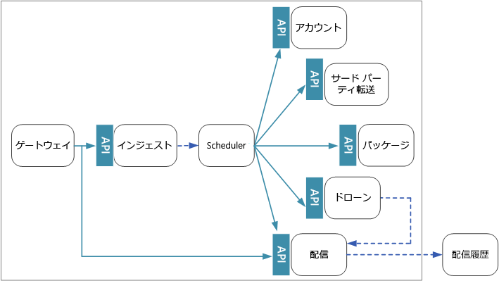
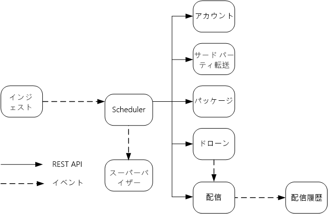

# マイクロサービスの設計: サービス間通信

マイクロサービスの間の通信は、効率的かつ堅牢である必要があります。 多数の小さいサービスが相互作用しながら 1 つのトランザクションを実行する場合、これを実現するのは容易ではない場合があります。 この章では、非同期メッセージングと同期 API の間のトレードオフについて説明します。 その後、回復性の高いサービス間通信の設計におけるいくつかの課題と、サービス メッシュが実行できる役割について説明します。

## 課題 

ここでは、サービス間通信において発生する主要な課題を示します。 サービス メッシュ (後で説明します) は、これらの課題の多くに対処するように設計されています。

**回復性**。 特定のマイクロサービスには、数十から場合によっては数百ものインスタンスが存在する可能性があります。 インスタンスは、さまざまな理由で失敗することがあります。 ハードウェア障害や仮想マシンの再起動のように、ノード レベルで障害が発生する場合があります。 インスタンスがクラッシュしたり、要求の負荷が大きすぎて新しい要求を処理できなくなる場合もあります。 これらのどのイベントによっても、ネットワーク呼び出しが失敗する可能性があります。 サービス間ネットワーク呼び出しの回復力を高めるのに役立つ 2 つの設計パターンがあります。

- **[再試行](../patterns/retry.md)**。 何もしなくても自動的に解消される一時的なエラーのために、ネットワーク呼び出し失敗することがあります。 呼び出し元は、通常、すぐに失敗として処理するのではなく、一定の回数だけ、または構成されたタイムアウト期間が経過するまで、操作を再試行する必要があります。 ただし、操作がべき等でない場合は、再試行によって意図しない副作用が発生する可能性があります。 その場合、元の呼び出しが成功したとしても、呼び出し元は応答を取得できません。 呼び出し元が再試行を行うと、操作が 2 回呼び出される可能性があります。 一般に、POST または PATCH メソッドは、べき等が保証されていないため、再試行することは安全ではありません。

- **[サーキット ブレーカー](../patterns/circuit-breaker.md)**。 失敗した要求が多すぎると、保留中の要求がキューに蓄積されるため、ボトルネックの原因になる可能性があります。 これらのブロックされた要求が重要なシステム リソース (メモリ、しきい値、データベース接続など) を保持することで、障害が連鎖する可能性があります。 サーキット ブレーカー パターンを使うと、失敗する可能性がある操作をサービスで繰り返し再試行することを回避できます。 

**負荷分散**。 サービス "A" がサービス "B" を呼び出すとき、要求はサービス "B" の実行中のインスタンスに到達する必要があります。 Kubernetes では、`Service` リソースの種類はポッドのグループに対して安定した IP アドレスを提供します。 サービスの IP アドレスへのネットワーク トラフィックは、iptable の規則によってポッドに転送されます。 既定では、ポッドはランダムに選ばれます。 サービス メッシュ (後述) は、観察された待機時間や他のメトリックに基づいて、さらにインテリジェントな負荷分散アルゴリズムを提供できます。

**分散トレース**。 1 つのトランザクションで複数のサービスが利用される場合があります。 その場合、システムの全体的なパフォーマンスと正常性の監視が困難になります。 すべてのサービスがログとメトリックを生成する場合でも、それらを結び付ける何らかの手段がないと、役に立ちません。 分散トレースについては「[ログ記録と監視](./logging-monitoring.md)」の章で詳しく説明されていますが、ここでも課題としてそのことに触れます。

**サービスのバージョン管理**。 チームは、新しいバージョンのサービスをデプロイするときに、他のサービスや、そのサービスに依存する外部クライアントで、中断が発生しないようにする必要があります。 さらに、サービスの複数のバージョンをサイド バイ サイドで実行し、要求を特定のバージョンにルーティングすることが必要になる場合があります。 この問題について詳しくは、「[API のバージョン管理](./api-design.md#api-versioning)」をご覧ください。

**TLS 暗号化と相互 TLS 認証**。 セキュリティ上の理由から、サービス間のトラフィックを TLS で暗号化し、相互 TLS 認証を使って呼び出し元を認証することが必要な場合があります。

## 同期メッセージングと非同期メッセージング

マイクロサービス間の通信には、次の 2 つの基本的なメッセージング パターンを使うことができます。 

1. 同期通信。 このパターンでは、サービスは、別のサービスによって公開されている API を、HTTP や gRPC などのプロトコルを使って呼び出します。 このオプションは、呼び出し元が受信側からの応答を待機するため、同期メッセージング パターンです。 

2. 非同期のメッセージ受け渡し。 このパターンでは、サービスは応答を待たずにメッセージを送信し、1 つまたは複数のサービスがメッセージを非同期的に処理します。

非同期 I/O と非同期プロトコルを区別することが重要です。 非同期 I/O とは、I/O が実行されている間、呼び出し元のスレッドがブロックされないことを意味します。 非同期 I/O はパフォーマンスにとって重要ですが、実装の詳細はアーキテクチャに関係します。 非同期プロトコルとは、送信側が応答を待機しないことを意味します。 HTTP クライアントは要求を送信するときに非同期 I/O を使うことができたとしても、HTTP は同期プロトコルです。 

各パターンにはトレードオフがあります。 要求/応答はよく知られたパラダイムであるため、API の設計の方が、メッセージング システムの設計より自然に感じられるかもしれません。 しかし、非同期メッセージングには、マイクロサービス アーキテクチャで非常に役に立つ利点がいくつかあります。

- **低い結合性**。 メッセージの送信側は、コンシューマーについて知っている必要はありません。 

- **複数のサブスクライバー**。 パブリッシュ/サブスクライブ モデルを使うと、複数のコンシューマーがイベントの受信をサブスクライブできます。 「[イベント ドリブン アーキテクチャのスタイル](/azure/architecture/guide/architecture-styles/event-driven)」をご覧ください。

- **障害の分離**。 コンシューマーで障害が発生した場合でも、送信側はメッセージを送信できます。 メッセージは、コンシューマーが復旧すると取得されます。 各サービスが独自のライフサイクルを持つマイクロサービス アーキテクチャでは、この機能が特に役に立ちます。 サービスがいつ使用不能になっても、またはサービスをいつ新しいバージョンに置き換えても、問題はありません。 非同期メッセージングは、断続的なダウンタイムを処理できます。 一方、同期 API では、ダウンストリーム サービスが使用可能である必要があり、使用できないと操作は失敗します。 
 
- **応答性**。 アップストリームのサービスは、ダウンストリームのサービスを待つ必要がなければ、より速く応答できます。 これは、マイクロサービス アーキテクチャで特に役に立ちます。 サービスの依存関係が連鎖している場合 (たとえば、サービス A が B を呼び出し、B が C を呼び出している場合)、同期呼び出しでの待機により待機時間が許容できないほど長くなる可能性があります。

- **負荷平準化**。 キューは、受信側が独自の速度でメッセージを処理できるように、ワークロードを平準化するためのバッファーとして機能できます。 

- **ワークフロー**。 キューを使うと、ワークフローの各ステップの後にメッセージのチェックポイントを設けることで、ワークフローを管理できます。

ただし、非同期メッセージングを効果的に使うためには、いくつかの課題もあります。

- **メッセージング インフラストラクチャとの結合**。 特定のメッセージング インフラストラクチャを使うと、そのインフラストラクチャとの間に密接な結合が発生する可能性があります。 その場合、後で別のメッセージング インフラストラクチャに切り替えるのが困難になります。

- **待機時間**。 メッセージ キューがいっぱいになった場合、操作のエンド ツー エンドの待機時間が長くなる可能性があります。  

- **コスト**。 スループットを高くすると、メッセージング インフラストラクチャの金銭的コストが大きくなることがあります。

- **複雑さ**。 非同期メッセージングの処理は、簡単なタスクではありません。 たとえば、メッセージの重複は、重複除去を行うか、または操作をべき等にすることによって、処理する必要があります。 また、非同期メッセージングを使って要求/応答のセマンティクスを実装するのは困難です。 応答を送信するには、別のキューに加えて、要求メッセージと応答メッセージを関連付ける手段が必要です。

- **スループット**。 メッセージで "*キュー セマンティクス*" が必要な場合は、キューがシステムのボトルネックになる可能性があります。 メッセージごとに、少なくとも 1 つのキュー操作と 1 つのデキュー操作が必要です。 さらに、キュー セマンティクスでは、一般に、メッセージング インフラストラクチャ内に何らかの種類のロックが必要になります。 キューが管理されたサービスの場合は、キューがクラスターの仮想ネットワークの外部にあるため、待機時間が増える可能性があります。 これらの問題はメッセージをバッチ処理することで軽減されますが、コードは複雑になります。 メッセージにキュー セマンティクスが必要ない場合は、キューの代わりにイベント "*ストリーム*" を使うことができる場合があります。 詳しくは、「[イベント ドリブン アーキテクチャのスタイル](../guide/architecture-styles/event-driven.md)」をご覧ください。  

## ドローン配送: メッセージング パターンの選択

以上の考慮事項を念頭に置き、開発チームではドローン配送アプリケーションの設計に関して次のような選択が行われました。

- インジェスト サービスでは、クライアント アプリケーションが配送のスケジュール、更新、キャンセルに使うことができるパブリック REST API を公開します。

- インジェスト サービスは、Event Hubs を使って、Scheduler サービスに非同期メッセージを送信します。 インジェストに必要な負荷平準化を実装するには、非同期メッセージが必要です。 インジェスト サービスと Scheduler サービスの相互作用方法について詳しくは、「[インジェストとワークフロー][ingestion-workflow]」をご覧ください。

- アカウント、配送、パッケージ、ドローン、サードパーティ トランスポートの各サービスはすべて、内部 REST API を公開します。 Scheduler サービスは、これらの API を呼び出してユーザーの要求を実行します。 同期 API を使う理由の 1 つは、Scheduler は各ダウンストリーム サービスから応答を取得する必要があるためです。 いずれかのダウンストリーム サービスでの障害は、操作全体が失敗することを意味します。 ただし、バックエンド サービスを呼び出すことによってもたらされる待機時間の大きさという潜在的な問題があります。 

- いずれかのダウンストリーム サービスで一時的ではないエラーが発生した場合は、トランザクション全体を失敗としてマークする必要があります。 このような場合に対処するため、Scheduler サービスはスーパーバイザーに非同期メッセージを送信し、スーパーバイザーが補正トランザクションをスケジュールできるようにします (「[インジェストとワークフロー][ingestion-workflow]」の説明を参照)。   

- 配送サービスによって公開されるパブリック API を使うことで、クライアントは配送の状態を取得できます。 「[API ゲートウェイ](./gateway.md)」の章では、どの API がどのサービスによって公開されているのかをクライアントが知らなくてもいいように、API ゲートウェイが基になるサービスをクライアントから隠ぺいする方法が説明されています。 

- ドローンの飛行中、ドローン サービスはドローンの現在の場所と状態を含むイベントを送信します。 配送サービスはこれらのイベントをリッスンして、配送の状態を追跡します。

- 配送の状態が変化すると、配送サービスは `DeliveryCreated` や `DeliveryCompleted` などの配送状態イベントを送信します。 どのサービスでもこれらのイベントをサブスクライブできます。 現在の設計では配送サービスが唯一のサブスクライバーですが、後で他のサブスクライバーが追加される可能性があります。 たとえば、イベントがリアルタイム分析サービスに送られるかもしれません。 また、Scheduler は応答を待つ必要がないため、サブスクライバーが追加されてもワークフローのメインのパスに影響はありません。

配送状態イベントはドローンの場所のイベントから派生することに注意してください。 たとえば、ドローンが配送先に着いてパッケージをドロップすると、配送サービスはこれを DeliveryCompleted イベントに変換します。 これは、ドメイン モデルの観点から考える場合の例です。 前に説明したように、ドローン管理は境界が異なるコンテキストに属しています。 ドローン イベントは、ドローンの物理的な場所を伝達します。 一方、配送イベントは配送状態の変化を表し、これは異なるビジネス エンティティです。

## サービス メッシュの使用

"*サービス メッシュ*" は、サービス間通信を処理するソフトウェア レイヤーです。 サービス メッシュは、前のセクションで挙げた問題の多くに対処し、これらの問題に対する責任をマイクロサービス自体から共有レイヤーに移すように設計されています。 サービス メッシュは、クラスター内のマイクロサービス間のネットワーク通信をインターセプトするプロキシとして機能します。 

> [!NOTE]
> サービス メッシュは[アンバサダー パターン](../patterns/ambassador.md)の例であり、アプリケーションに代わってネットワーク要求を送信するヘルパー サービスです。 

現在、Kubernetes でのサービス メッシュの主なオプションは、[linkerd](https://linkerd.io/) と [Istio](https://istio.io/) です。 どちらのテクノロジも急速に発展しています。 このガイドを書いた時点での Istio の最新リリースは 0.2 であり、まだ非常に新しいものです。 ただし、linkerd と Istio のどちらにも次のような機能が共通して含まれます。 

- 検出された待機時間または未処理の要求の数に基づく、セッション レベルでの負荷分散。 これにより、Kubernetes によって提供されるレイヤー 4 の負荷分散のパフォーマンスが向上します。 

- URL パス、ホスト ヘッダー、API のバージョン、または他のアプリケーション レベルのルールに基づく、レイヤー 7 のルーティング。

- 失敗した要求の再試行。 サービス メッシュは HTTP のエラー コードを認識し、失敗した要求を自動的に再試行できます。 ユーザーは、再試行の最大回数とタイムアウト時間を構成して、最大待機時間を制限することができます。 

- サーキット ブレーク。 インスタンスで要求が常に失敗する場合、サービス メッシュはそのインスタンスを一時的に利用不可としてマークします。 バックオフ期間の後、サービス メッシュはそのインスタンスを再び試みます。 連続した障害の数など、さまざまな条件に基づいてサーキット ブレーカーを構成できます。  

- サービス メッシュは、要求の量、待機時間、エラー率と成功率、応答のサイズなど、サービス間呼び出しに関するメトリックをキャプチャします。 サービス メッシュでは、要求内の各ホップの相関関係情報を追加することで分散トレースも可能です。

- サービス間呼び出しに対する相互 TLS 認証。

サービス メッシュが必要だとお考えですか。 たしかに、サービス メッシュによって分散システムにもたらされる価値には説得力があります。 サービス メッシュを使わない場合は、この章の最初で説明した各課題をユーザー自身が考慮する必要があります。 サービス メッシュがなくても再試行、サーキット ブレーカー、分散トレースなどの問題を解決することはできますが、サービス メッシュはこれらの問題を個々のサービスから専用のレイヤーに移してくれます。 その一方で、サービス メッシュはまだ成熟していない比較的新しいテクノロジです。 サービス メッシュを展開すると、クラスターのセットアップと構成が複雑になります。 要求はサービス メッシュ プロキシを通してルーティングされるようになり、クラスターの各ノードで実行されるサービスが増えるので、パフォーマンスに影響する可能性があります。 運用環境にサービス メッシュを展開する前に、パフォーマンスと負荷のテストを徹底的に行う必要があります。

> [!div class="nextstepaction"]
> [API 設計](./api-design.md)

<!-- links -->

[ingestion-workflow]: ./ingestion-workflow.md
