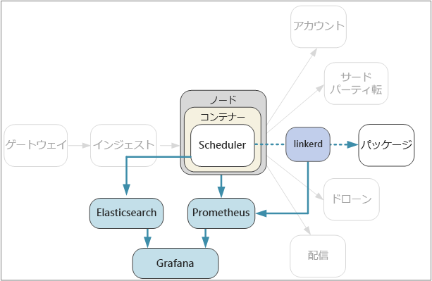

# <a name="designing-microservices-logging-and-monitoring"></a><span data-ttu-id="0ca80-103">マイクロサービスの設計:ログ記録と監視</span><span class="sxs-lookup"><span data-stu-id="0ca80-103">Designing microservices: Logging and monitoring</span></span>

<span data-ttu-id="0ca80-104">複雑なアプリケーションは、どこかの時点で何かがうまくいかなくなります。</span><span class="sxs-lookup"><span data-stu-id="0ca80-104">In any complex application, at some point something will go wrong.</span></span> <span data-ttu-id="0ca80-105">マイクロサービス アプリケーションでは、数十から数百のサービス全体で何が起こっているのかを追跡する必要があります。</span><span class="sxs-lookup"><span data-stu-id="0ca80-105">In a microservices application, you need to track what's happening across dozens or even hundreds of services.</span></span> <span data-ttu-id="0ca80-106">システムの全体像を把握するには、ログ記録と監視が非常に重要です。</span><span class="sxs-lookup"><span data-stu-id="0ca80-106">Logging and monitoring are critically important to give you a holistic view of the system.</span></span>



<span data-ttu-id="0ca80-108">マイクロサービス アーキテクチャでは、エラーやパフォーマンスのボトルネックの正確な原因を突き止めることが特に難しい場合があります。</span><span class="sxs-lookup"><span data-stu-id="0ca80-108">In a microservices architecture, it can be especially challenging to pinpoint the exact cause of errors or performance bottlenecks.</span></span> <span data-ttu-id="0ca80-109">1 つのユーザー操作が複数のサービスにまたがる場合があります。</span><span class="sxs-lookup"><span data-stu-id="0ca80-109">A single user operation might span multiple services.</span></span> <span data-ttu-id="0ca80-110">サービスは、クラスター内のネットワーク I/O 制限に達することがあります。</span><span class="sxs-lookup"><span data-stu-id="0ca80-110">Services may hit network I/O limits inside the cluster.</span></span> <span data-ttu-id="0ca80-111">サービスをまたがる一連の呼び出しによって、システムのバックプレッシャが発生し、結果として待機時間が長くなったり、連鎖するエラーが発生したりする可能性があります。</span><span class="sxs-lookup"><span data-stu-id="0ca80-111">A chain of calls across services may cause backpressure in the system, resulting in high latency or cascading failures.</span></span> <span data-ttu-id="0ca80-112">また、一般に、どのコンテナーがどのノードで実行されるかはわかりません。</span><span class="sxs-lookup"><span data-stu-id="0ca80-112">Moreover, you generally don't know which node a particular container will run in.</span></span> <span data-ttu-id="0ca80-113">同じノードに配置されたコンテナーが、限られた CPU またはメモリについて競合する可能性があります。</span><span class="sxs-lookup"><span data-stu-id="0ca80-113">Containers placed on the same node may be competing for limited CPU or memory.</span></span>

<span data-ttu-id="0ca80-114">何が起きているのかを把握するには、アプリケーションからテレメトリを収集する必要があります。</span><span class="sxs-lookup"><span data-stu-id="0ca80-114">To make sense of what's happening, you must collect telemetry from the application.</span></span>  <span data-ttu-id="0ca80-115">テレメトリは "*ログ*" と "*メトリック*" に分けられます。</span><span class="sxs-lookup"><span data-stu-id="0ca80-115">Telemetry can be divided into *logs* and *metrics*.</span></span> <span data-ttu-id="0ca80-116">[Azure Monitor](/azure/monitoring-and-diagnostics/monitoring-overview) では、Azure プラットフォーム全体でログとメトリックの両方が収集されます。</span><span class="sxs-lookup"><span data-stu-id="0ca80-116">[Azure Monitor](/azure/monitoring-and-diagnostics/monitoring-overview) collects both logs and metrics across the Azure platform.</span></span>

<span data-ttu-id="0ca80-117">**ログ**は、アプリケーションの実行中に発生するイベントに関するテキストベースの記録です。</span><span class="sxs-lookup"><span data-stu-id="0ca80-117">**Logs** are text-based records of events that occur while the application is running.</span></span> <span data-ttu-id="0ca80-118">アプリケーション ログ (トレース ステートメント) や Web サーバー ログなどが含まれます。</span><span class="sxs-lookup"><span data-stu-id="0ca80-118">They include things like application logs (trace statements) or web server logs.</span></span> <span data-ttu-id="0ca80-119">ログは、主に科学捜査と根本原因の解析に役立ちます。</span><span class="sxs-lookup"><span data-stu-id="0ca80-119">Logs are primarily useful for forensics and root cause analysis.</span></span>

<span data-ttu-id="0ca80-120">**メトリック**は、解析できる数値です。</span><span class="sxs-lookup"><span data-stu-id="0ca80-120">**Metrics** are numerical values that can be analyzed.</span></span> <span data-ttu-id="0ca80-121">メトリックを使用すると、リアルタイムで (またはほぼリアルタイムで) システムを観察したり、時間の経過と共にパフォーマンスの傾向を解析したりすることができます。</span><span class="sxs-lookup"><span data-stu-id="0ca80-121">You can use them to observe the system in real time (or close to real time), or to analyze performance trends over time.</span></span> <span data-ttu-id="0ca80-122">メトリックは、さらに次のように分類できます。</span><span class="sxs-lookup"><span data-stu-id="0ca80-122">Metrics can be further subcategorized as follows:</span></span>

- <span data-ttu-id="0ca80-123">**ノードレベル** メトリック。CPU、メモリ、ネットワーク、ディスク、ファイル システムの使用状況などです。</span><span class="sxs-lookup"><span data-stu-id="0ca80-123">**Node-level** metrics, including CPU, memory, network, disk, and file system usage.</span></span> <span data-ttu-id="0ca80-124">システム メトリックは、クラスター内の各ノードのリソース割り当てを把握し、異常値を解決するために役立ちます。</span><span class="sxs-lookup"><span data-stu-id="0ca80-124">System metrics help you to understand resource allocation for each node in the cluster, and troubleshoot outliers.</span></span>

- <span data-ttu-id="0ca80-125">**コンテナー** メトリック。</span><span class="sxs-lookup"><span data-stu-id="0ca80-125">**Container** metrics.</span></span> <span data-ttu-id="0ca80-126">サービスがコンテナーで実行されている場合、VM レベルだけでなく、コンテナー レベルでメトリックを収集する必要があります。</span><span class="sxs-lookup"><span data-stu-id="0ca80-126">If services are run inside containers, you need to collect metrics at the container level, not just at the VM level.</span></span> <span data-ttu-id="0ca80-127">Azure Monitor をセットアップすることで、Azure Kubernetes Service (AKS) のコンテナー ワークロードを監視できます。</span><span class="sxs-lookup"><span data-stu-id="0ca80-127">You can set up Azure Monitor to monitor container workloads in Azure Kubernetes Service (AKS).</span></span> <span data-ttu-id="0ca80-128">詳細については、「[コンテナーに対する Azure Monitor の概要](/azure/monitoring/monitoring-container-insights-overview)」を参照してください。</span><span class="sxs-lookup"><span data-stu-id="0ca80-128">For more information, see [Azure Monitor for containers overview](/azure/monitoring/monitoring-container-insights-overview).</span></span> <span data-ttu-id="0ca80-129">その他のコンテナー オーケストレーターについては、[Log Analytics のコンテナー監視ソリューション](/azure/log-analytics/log-analytics-containers)を使用します。</span><span class="sxs-lookup"><span data-stu-id="0ca80-129">For other container orchestrators, use the [Container Monitoring solution in Log Analytics](/azure/log-analytics/log-analytics-containers).</span></span>

- <span data-ttu-id="0ca80-130">**アプリケーション** メトリック。</span><span class="sxs-lookup"><span data-stu-id="0ca80-130">**Application** metrics.</span></span> <span data-ttu-id="0ca80-131">サービスの動作の把握に関連するメトリックが含まれます。</span><span class="sxs-lookup"><span data-stu-id="0ca80-131">This includes any metrics that are relevant to understanding the behavior of a service.</span></span> <span data-ttu-id="0ca80-132">たとえば、キューに入ったインバウンド HTTP 要求の数、要求の待機時間、メッセージ キューの長さなどです。</span><span class="sxs-lookup"><span data-stu-id="0ca80-132">Examples include the number of queued inbound HTTP requests, request latency, or message queue length.</span></span> <span data-ttu-id="0ca80-133">アプリケーションでは、1 分あたりに処理されたビジネス トランザクションの数など、ドメインに固有のカスタム メトリックを作成することもできます。</span><span class="sxs-lookup"><span data-stu-id="0ca80-133">Applications can also create custom metrics that are specific to the domain, such as the number of business transactions processed per minute.</span></span> <span data-ttu-id="0ca80-134">[アプリケーション メトリック](/azure/application-insights/app-insights-overview)を有効にするには、Application Insights を使用します。</span><span class="sxs-lookup"><span data-stu-id="0ca80-134">Use [Application Insights](/azure/application-insights/app-insights-overview) to enable application metrics.</span></span>

- <span data-ttu-id="0ca80-135">**依存サービス** メトリック。</span><span class="sxs-lookup"><span data-stu-id="0ca80-135">**Dependent service** metrics.</span></span> <span data-ttu-id="0ca80-136">サービスからは、マネージド PaaS サービスや SaaS サービスなど、外部サービスまたはエンドポイントが呼び出されることがあります。</span><span class="sxs-lookup"><span data-stu-id="0ca80-136">Services may call external services or endpoints, such as managed PaaS services or SaaS services.</span></span> <span data-ttu-id="0ca80-137">サードパーティのサービスの場合、メトリックが提供される場合と提供されない場合があります。</span><span class="sxs-lookup"><span data-stu-id="0ca80-137">Third-party services may or may not provide any metrics.</span></span> <span data-ttu-id="0ca80-138">提供されない場合、待機時間とエラー率の統計を追跡するには、独自のアプリケーション メトリックに頼る必要があります。</span><span class="sxs-lookup"><span data-stu-id="0ca80-138">If not, you'll have to rely on your own application metrics to track statistics for latency and error rate.</span></span>

## <a name="considerations"></a><span data-ttu-id="0ca80-139">考慮事項</span><span class="sxs-lookup"><span data-stu-id="0ca80-139">Considerations</span></span>

<span data-ttu-id="0ca80-140">[監視と診断](../best-practices/monitoring.md)に関する記事では、アプリケーションの監視に関する全般的なベスト プラクティスについて説明しています。</span><span class="sxs-lookup"><span data-stu-id="0ca80-140">The article [Monitoring and diagnostics](../best-practices/monitoring.md) describes general best practices for monitoring an application.</span></span> <span data-ttu-id="0ca80-141">ここでは、マイクロサービス アーキテクチャのコンテキストで考慮すべき特別な事項について説明します。</span><span class="sxs-lookup"><span data-stu-id="0ca80-141">Here are some particular things to think about in the context of a microservices architecture.</span></span>

<span data-ttu-id="0ca80-142">**構成と管理**。</span><span class="sxs-lookup"><span data-stu-id="0ca80-142">**Configuration and management**.</span></span> <span data-ttu-id="0ca80-143">ログ記録と監視にマネージド サービスを使用しますか。それともログと監視コンポーネントをクラスター内のコンテナーとして展開しますか。</span><span class="sxs-lookup"><span data-stu-id="0ca80-143">Will you use a managed service for logging and monitoring, or deploy logging and monitoring components as containers inside the cluster?</span></span> <span data-ttu-id="0ca80-144">このような選択肢の詳細については、後述の「[テクノロジの選択肢](#technology-options)」セクションを参照してください。</span><span class="sxs-lookup"><span data-stu-id="0ca80-144">For more discussion of these options, see the section [Technology Options](#technology-options) below.</span></span>

<span data-ttu-id="0ca80-145">**取り込み率**。</span><span class="sxs-lookup"><span data-stu-id="0ca80-145">**Ingestion rate**.</span></span> <span data-ttu-id="0ca80-146">システムがテレメトリ イベントを取り込ことができるスループットはどれくらいですか。</span><span class="sxs-lookup"><span data-stu-id="0ca80-146">What is the throughput at which the system can ingest telemetry events?</span></span> <span data-ttu-id="0ca80-147">その率を超えるとどうなりますか。</span><span class="sxs-lookup"><span data-stu-id="0ca80-147">What happens if that rate is exceeded?</span></span> <span data-ttu-id="0ca80-148">たとえば、システムがクライアントを制限する方法があります。この場合は、テレメトリ データが失われます。また、データをダウンサンプリングする方法があります。</span><span class="sxs-lookup"><span data-stu-id="0ca80-148">For example, the system may throttle clients, in which case telemetry data is lost, or it may downsample the data.</span></span> <span data-ttu-id="0ca80-149">場合によっては、次のように収集するデータ量を減らすことで問題を軽減できます。</span><span class="sxs-lookup"><span data-stu-id="0ca80-149">Sometimes you can mitigate this problem by reducing the amount of data that you collect:</span></span>

- <span data-ttu-id="0ca80-150">メトリックの集計。平均や標準偏差などの統計を計算し、その統計データを監視システムに送信します。</span><span class="sxs-lookup"><span data-stu-id="0ca80-150">Aggregate metrics by calculating statistics, such as average and standard deviation, and send that statistical data to the monitoring system.</span></span>
- <span data-ttu-id="0ca80-151">データのダウンサンプリング。つまり、イベントの一部のみを処理します。</span><span class="sxs-lookup"><span data-stu-id="0ca80-151">Downsample the data &mdash; that is, process only a percentage of the events.</span></span>
- <span data-ttu-id="0ca80-152">データの一括処理。監視サービスに対するネットワーク呼び出しの回数を減らします。</span><span class="sxs-lookup"><span data-stu-id="0ca80-152">Batch the data to reduce the number of network calls to the monitoring service.</span></span>

<span data-ttu-id="0ca80-153">**コスト**。</span><span class="sxs-lookup"><span data-stu-id="0ca80-153">**Cost**.</span></span> <span data-ttu-id="0ca80-154">テレメトリ データを取り込んで保存するコストは高くなる可能性があります。大量のデータの場合は特にそうです。</span><span class="sxs-lookup"><span data-stu-id="0ca80-154">The cost of ingesting and storing telemetry data may be high, especially at high volumes.</span></span> <span data-ttu-id="0ca80-155">場合によっては、アプリケーションの実行コストを上回る可能性もあります。</span><span class="sxs-lookup"><span data-stu-id="0ca80-155">In some cases it could even exceed the cost of running the application.</span></span> <span data-ttu-id="0ca80-156">その場合、前述のように、データの集計、ダウンサンプリング、または一括処理によってテレメトリの量を減らす必要が出てくることもあります。</span><span class="sxs-lookup"><span data-stu-id="0ca80-156">In that case, you may need to reduce the volume of telemetry by aggregating, downsampling, or batching the data, as described above.</span></span>

<span data-ttu-id="0ca80-157">**データの忠実性**。</span><span class="sxs-lookup"><span data-stu-id="0ca80-157">**Data fidelity**.</span></span> <span data-ttu-id="0ca80-158">メトリックはどのくらい正確ですか。</span><span class="sxs-lookup"><span data-stu-id="0ca80-158">How accurate are the metrics?</span></span> <span data-ttu-id="0ca80-159">大量のデータの場合、平均値で異常値を隠すことができます。</span><span class="sxs-lookup"><span data-stu-id="0ca80-159">Averages can hide outliers, especially at scale.</span></span> <span data-ttu-id="0ca80-160">また、サンプリング レートが低すぎると、データの変動が滑らかになる可能性があります。</span><span class="sxs-lookup"><span data-stu-id="0ca80-160">Also, if the sampling rate is too low, it can smooth out fluctuations in the data.</span></span> <span data-ttu-id="0ca80-161">実際、要求の大部分の処理時間がはるかに長い場合、エンドツーエンドの待機時間がすべての要求でほぼ同じに見えるようになることがあります。</span><span class="sxs-lookup"><span data-stu-id="0ca80-161">It may appear that all requests have about the same end-to-end latency, when in fact a significant fraction of requests are taking much longer.</span></span>

<span data-ttu-id="0ca80-162">**待機時間**。</span><span class="sxs-lookup"><span data-stu-id="0ca80-162">**Latency**.</span></span> <span data-ttu-id="0ca80-163">リアルタイムの監視とアラートを可能にするには、テレメトリ データをすばやく利用できるようにする必要があります。</span><span class="sxs-lookup"><span data-stu-id="0ca80-163">To enable real-time monitoring and alerts, telemetry data should be available quickly.</span></span> <span data-ttu-id="0ca80-164">どのくらい前のデータが監視ダッシュボードに表示されると、"リアルタイム" と言えるでしょうか。</span><span class="sxs-lookup"><span data-stu-id="0ca80-164">How "real-time" is the data that appears on the monitoring dashboard?</span></span> <span data-ttu-id="0ca80-165">数秒前でしょうか。</span><span class="sxs-lookup"><span data-stu-id="0ca80-165">A few seconds old?</span></span> <span data-ttu-id="0ca80-166">それとも 1 分よりも前でしょうか。</span><span class="sxs-lookup"><span data-stu-id="0ca80-166">More than a minute?</span></span>

<span data-ttu-id="0ca80-167">**ストレージ。**</span><span class="sxs-lookup"><span data-stu-id="0ca80-167">**Storage.**</span></span> <span data-ttu-id="0ca80-168">ログについては、ログ イベントをクラスター内の一時ストレージに書き込み、ログ ファイルをより永続的なストレージに送るようにエージェントを構成するのが最も効率的です。</span><span class="sxs-lookup"><span data-stu-id="0ca80-168">For logs, it may be most efficient to write the log events to ephemeral storage in the cluster, and configure an agent to ship the log files to more persistent storage.</span></span>  <span data-ttu-id="0ca80-169">データは最終的には長期保存に移行し、遡及解析に利用できるようにする必要があります。</span><span class="sxs-lookup"><span data-stu-id="0ca80-169">Data should eventually be moved to long-term storage so that it's available for retrospective analysis.</span></span> <span data-ttu-id="0ca80-170">マイクロサービス アーキテクチャは大量のテレメトリ データを生成する可能性があるため、そのデータを保存するコストは重要な考慮事項です。</span><span class="sxs-lookup"><span data-stu-id="0ca80-170">A microservices architecture can generate a large volume of telemetry data, so the cost of storing that data is an important consideration.</span></span> <span data-ttu-id="0ca80-171">また、データのクエリ方法も考慮します。</span><span class="sxs-lookup"><span data-stu-id="0ca80-171">Also consider how you will query the data.</span></span>

<span data-ttu-id="0ca80-172">**ダッシュボードと視覚化。**</span><span class="sxs-lookup"><span data-stu-id="0ca80-172">**Dashboard and visualization.**</span></span> <span data-ttu-id="0ca80-173">クラスターと外部サービスの両方で、すべてのサービスにわたってシステムの全体像を把握していますか。</span><span class="sxs-lookup"><span data-stu-id="0ca80-173">Do you get a holistic view of the system, across all of the services, both within the cluster and external services?</span></span> <span data-ttu-id="0ca80-174">テレメトリ データとログを複数の場所に書き込んでいる場合は、ダッシュボードでそれらのすべてを表示して相互に関連付けることはできますか。</span><span class="sxs-lookup"><span data-stu-id="0ca80-174">If you are writing telemetry data and logs to more than one location, can the dashboard show all of them and correlate?</span></span> <span data-ttu-id="0ca80-175">監視ダッシュボードには、少なくとも次の情報が表示されている必要があります。</span><span class="sxs-lookup"><span data-stu-id="0ca80-175">The monitoring dashboard should show at least the following information:</span></span>

- <span data-ttu-id="0ca80-176">容量と成長のための全体的なリソース割り当て。</span><span class="sxs-lookup"><span data-stu-id="0ca80-176">Overall resource allocation for capacity and growth.</span></span> <span data-ttu-id="0ca80-177">コンテナーの数、ファイル システムのメトリック、ネットワーク、およびコアの割り当てが含まれます。</span><span class="sxs-lookup"><span data-stu-id="0ca80-177">This includes the number of containers, file system metrics, network, and core allocation.</span></span>
- <span data-ttu-id="0ca80-178">コンテナー メトリックはサービス レベルで相関しています。</span><span class="sxs-lookup"><span data-stu-id="0ca80-178">Container metrics correlated at the service level.</span></span>
- <span data-ttu-id="0ca80-179">コンテナーに関連付けられたシステム メトリック。</span><span class="sxs-lookup"><span data-stu-id="0ca80-179">System metrics correlated with containers.</span></span>
- <span data-ttu-id="0ca80-180">サービス エラーと異常値。</span><span class="sxs-lookup"><span data-stu-id="0ca80-180">Service errors and outliers.</span></span>

## <a name="distributed-tracing"></a><span data-ttu-id="0ca80-181">分散トレース</span><span class="sxs-lookup"><span data-stu-id="0ca80-181">Distributed tracing</span></span>

<span data-ttu-id="0ca80-182">前述したように、マイクロサービスの課題の 1 つは、サービス間のイベントの流れを把握することです。</span><span class="sxs-lookup"><span data-stu-id="0ca80-182">As mentioned, one challenge in microservices is understanding the flow of events across services.</span></span> <span data-ttu-id="0ca80-183">1 つの操作またはトランザクションで複数のサービスへの呼び出しが実行される場合もあります。</span><span class="sxs-lookup"><span data-stu-id="0ca80-183">A single operation or transaction may involve calls to multiple services.</span></span> <span data-ttu-id="0ca80-184">一連の手順全体を再構成するには、各サービスがその操作の一意の識別子として機能する*相関 ID* を伝達する必要があります。</span><span class="sxs-lookup"><span data-stu-id="0ca80-184">To reconstruct the entire sequence of steps, each service should propagate a *correlation ID* that acts as a unique identifier for that operation.</span></span> <span data-ttu-id="0ca80-185">相関 ID で、サービス全体の[分散トレース](https://microservices.io/patterns/observability/distributed-tracing.html)が可能になります。</span><span class="sxs-lookup"><span data-stu-id="0ca80-185">The correlation ID enables [distributed tracing](https://microservices.io/patterns/observability/distributed-tracing.html) across services.</span></span>

<span data-ttu-id="0ca80-186">クライアント要求を受信する最初のサービスで、相関 ID を生成する必要があります。</span><span class="sxs-lookup"><span data-stu-id="0ca80-186">The first service that receives a client request should generate the correlation ID.</span></span> <span data-ttu-id="0ca80-187">そのサービスが別のサービスに HTTP 呼び出しを行う場合、要求ヘッダーに相関 ID を挿入します。</span><span class="sxs-lookup"><span data-stu-id="0ca80-187">If the service makes an HTTP call to another service, it puts the correlation ID in a request header.</span></span> <span data-ttu-id="0ca80-188">同様に、サービスが非同期メッセージを送信する場合も、相関 ID をメッセージに挿入します。</span><span class="sxs-lookup"><span data-stu-id="0ca80-188">Similarly, if the service sends an asynchronous message, it puts the correlation ID into the message.</span></span> <span data-ttu-id="0ca80-189">システム全体に流れるように、ダウンストリームのサービスは相関 ID を伝達し続けます。</span><span class="sxs-lookup"><span data-stu-id="0ca80-189">Downstream services continue to propagate the correlation ID, so that it flows through the entire system.</span></span> <span data-ttu-id="0ca80-190">さらに、アプリケーション メトリックまたはログ イベントを書き込むすべてのコードにも相関 ID を含めるようにします。</span><span class="sxs-lookup"><span data-stu-id="0ca80-190">In addition, all code that writes application metrics or log events should include the correlation ID.</span></span>

<span data-ttu-id="0ca80-191">サービス呼び出しが相互に関連する場合、完全なトランザクションのエンドツーエンドの待機時間、1 秒あたりの成功したトランザクション数、失敗したトランザクションの割合などの操作メトリックを計算できます。</span><span class="sxs-lookup"><span data-stu-id="0ca80-191">When service calls are correlated, you can calculate operational metrics such as the end-to-end latency for a complete transaction, the number of successful transactions per second, and the percentage of failed transactions.</span></span> <span data-ttu-id="0ca80-192">相関 ID をアプリケーション ログに含めることで、根本原因の解析を実行することができます。</span><span class="sxs-lookup"><span data-stu-id="0ca80-192">Including correlation IDs in application logs makes it possible to perform root cause analysis.</span></span> <span data-ttu-id="0ca80-193">操作が失敗した場合、同じ操作に含まれるすべてのサービス呼び出しのログ ステートメントを見つけることができます。</span><span class="sxs-lookup"><span data-stu-id="0ca80-193">If an operation fails, you can find the log statements for all of the service calls that were part of the same operation.</span></span>

<span data-ttu-id="0ca80-194">分散トレースを実装する場合は、次の点を考慮します。</span><span class="sxs-lookup"><span data-stu-id="0ca80-194">Here are some considerations when implementing distributed tracing:</span></span>

- <span data-ttu-id="0ca80-195">現時点では、相関 ID の標準 HTTP ヘッダーはありません。</span><span class="sxs-lookup"><span data-stu-id="0ca80-195">There is currently no standard HTTP header for correlation IDs.</span></span> <span data-ttu-id="0ca80-196">チームでカスタム ヘッダー値を標準化する必要があります。</span><span class="sxs-lookup"><span data-stu-id="0ca80-196">Your team should standardize on a custom header value.</span></span> <span data-ttu-id="0ca80-197">ログ/監視フレームワークまたはサービス メッシュの選択によって選択することができます。</span><span class="sxs-lookup"><span data-stu-id="0ca80-197">The choice may be decided by your logging/monitoring framework or choice of service mesh.</span></span>

- <span data-ttu-id="0ca80-198">非同期メッセージで、メッセージング インフラストラクチャがメッセージへのメタデータの追加をサポートしている場合は、相関 ID をメタデータとして含める必要があります。</span><span class="sxs-lookup"><span data-stu-id="0ca80-198">For asynchronous messages, if your messaging infrastructure supports adding metadata to messages, you should include the correlation ID as metadata.</span></span> <span data-ttu-id="0ca80-199">サポートしていない場合は、メッセージ スキーマに含めます。</span><span class="sxs-lookup"><span data-stu-id="0ca80-199">Otherwise, include it as part of the message schema.</span></span>

- <span data-ttu-id="0ca80-200">単一の非透過識別子ではなく、呼び出し元と呼び出し先の関係など、より豊富な情報を含む*相関コンテキスト*を送信する場合があります。</span><span class="sxs-lookup"><span data-stu-id="0ca80-200">Rather than a single opaque identifier, you might send a *correlation context* that includes richer information, such as caller-callee relationships.</span></span>

- <span data-ttu-id="0ca80-201">Azure Application Insights SDK では、HTTP ヘッダーに相関コンテキストを挿入する処理と、Application Insights ログに相関 ID を含める処理が自動的に行われます。</span><span class="sxs-lookup"><span data-stu-id="0ca80-201">The Azure Application Insights SDK automatically injects correlation context into HTTP headers, and includes the correlation ID in Application Insights logs.</span></span> <span data-ttu-id="0ca80-202">Application Insights に組み込まれている相関機能を使用する場合、使用するライブラリに応じて、相関ヘッダーを明示的に伝達する必要があるサービスもあります。</span><span class="sxs-lookup"><span data-stu-id="0ca80-202">If you decide to use the correlation features built into Application Insights, some services may still need to explicitly propagate the correlation headers, depending on the libraries being used.</span></span> <span data-ttu-id="0ca80-203">詳細については、「[Application Insights におけるテレメトリの相関付け](/azure/application-insights/application-insights-correlation)」を参照してください。</span><span class="sxs-lookup"><span data-stu-id="0ca80-203">For more information, see [Telemetry correlation in Application Insights](/azure/application-insights/application-insights-correlation).</span></span>

- <span data-ttu-id="0ca80-204">サービス メッシュとして Istio または linkerd を使用している場合、HTTP メッセージがサービス メッシュ プロキシ経由でルーティングされるときに、これらのテクノロジで相関ヘッダーが自動的に生成されます。</span><span class="sxs-lookup"><span data-stu-id="0ca80-204">If you are using Istio or linkerd as a service mesh, these technologies automatically generate correlation headers when HTTP calls are routed through the service mesh proxies.</span></span> <span data-ttu-id="0ca80-205">サービスは、関連するヘッダーを転送する必要があります。</span><span class="sxs-lookup"><span data-stu-id="0ca80-205">Services should forward the relevant headers.</span></span>

  - <span data-ttu-id="0ca80-206">Istio:[分散要求トレース](https://istio-releases.github.io/v0.1/docs/tasks/zipkin-tracing.html)</span><span class="sxs-lookup"><span data-stu-id="0ca80-206">Istio: [Distributed Request Tracing](https://istio-releases.github.io/v0.1/docs/tasks/zipkin-tracing.html)</span></span>
  - <span data-ttu-id="0ca80-207">linkerd:[コンテキスト ヘッダー](https://linkerd.io/config/1.3.0/linkerd/index.html#http-headers)</span><span class="sxs-lookup"><span data-stu-id="0ca80-207">linkerd: [Context Headers](https://linkerd.io/config/1.3.0/linkerd/index.html#http-headers)</span></span>

- <span data-ttu-id="0ca80-208">ログをどのように集計するかを検討します。</span><span class="sxs-lookup"><span data-stu-id="0ca80-208">Consider how you will aggregate logs.</span></span> <span data-ttu-id="0ca80-209">ログに相関 ID を含める方法についてチーム間で標準化することもできます。</span><span class="sxs-lookup"><span data-stu-id="0ca80-209">You may want to standardize across teams on how to include correlation IDs in logs.</span></span> <span data-ttu-id="0ca80-210">JSON などの構造化または半構造化形式を使用し、相関 ID を保持する共通フィールドを定義します。</span><span class="sxs-lookup"><span data-stu-id="0ca80-210">Use a structured or semi-structured format, such as JSON, and define a common field to hold the correlation ID.</span></span>

## <a name="technology-options"></a><span data-ttu-id="0ca80-211">テクノロジの選択肢</span><span class="sxs-lookup"><span data-stu-id="0ca80-211">Technology options</span></span>

<span data-ttu-id="0ca80-212">**Application Insights** は、テレメトリ データを取り込んで保存する Azure のマネージド サービスです。データの解析と検索のためのツールが用意されています。</span><span class="sxs-lookup"><span data-stu-id="0ca80-212">**Application Insights** is a managed service in Azure that ingests and stores telemetry data, and provides tools for analyzing and searching the data.</span></span> <span data-ttu-id="0ca80-213">Application Insights を使用するには、アプリケーションにインストルメンテーション パッケージをインストールします。</span><span class="sxs-lookup"><span data-stu-id="0ca80-213">To use Application Insights, you install an instrumentation package in your application.</span></span> <span data-ttu-id="0ca80-214">このパッケージは、アプリケーションを監視し、テレメトリ データを Application Insights サービスに送信します。</span><span class="sxs-lookup"><span data-stu-id="0ca80-214">This package monitors the app and sends telemetry data to the Application Insights service.</span></span> <span data-ttu-id="0ca80-215">また、テレメトリ データをホスト環境からプルすることもできます。</span><span class="sxs-lookup"><span data-stu-id="0ca80-215">It can also pull telemetry data from the host environment.</span></span> <span data-ttu-id="0ca80-216">Application Insights には、相関関係と依存関係の追跡機能が組み込まれています。</span><span class="sxs-lookup"><span data-stu-id="0ca80-216">Application Insights provides built-in correlation and dependency tracking.</span></span> <span data-ttu-id="0ca80-217">そのため、システム メトリック、アプリケーション メトリック、および Azure サービス メトリックをすべて 1 か所で追跡できます。</span><span class="sxs-lookup"><span data-stu-id="0ca80-217">It lets you track system metrics, application metrics, and Azure service metrics, all in one place.</span></span>

<span data-ttu-id="0ca80-218">データ レートが上限を超えた場合、Application Insights は制限されることに注意してください。詳細については、「[Application Insights の制限](/azure/azure-subscription-service-limits#application-insights-limits)」を参照してください。</span><span class="sxs-lookup"><span data-stu-id="0ca80-218">Be aware that Application Insights throttles if the data rate exceeds a maximum limit; for details, see [Application Insights limits](/azure/azure-subscription-service-limits#application-insights-limits).</span></span> <span data-ttu-id="0ca80-219">1 回の操作で複数のテレメトリ イベントが生成されることがあります。そのため、アプリケーションで大量のトラフィックが発生すると、そのイベントが制限される可能性があります。</span><span class="sxs-lookup"><span data-stu-id="0ca80-219">A single operation may generate several telemetry events, so if the application experiences a high volume of traffic, it is likely to get throttled.</span></span> <span data-ttu-id="0ca80-220">この問題を軽減するために、サンプリングを実行してテレメトリ トラフィックを減らすことができます。</span><span class="sxs-lookup"><span data-stu-id="0ca80-220">To mitigate this problem, you can perform sampling to reduce the telemetry traffic.</span></span> <span data-ttu-id="0ca80-221">その代わり、メトリックの精度は低くなります。</span><span class="sxs-lookup"><span data-stu-id="0ca80-221">The tradeoff is that your metrics will be less precise.</span></span> <span data-ttu-id="0ca80-222">詳細については、「[Application Insights におけるサンプリング](/azure/application-insights/app-insights-sampling)」を参照してください。</span><span class="sxs-lookup"><span data-stu-id="0ca80-222">For more information, see [Sampling in Application Insights](/azure/application-insights/app-insights-sampling).</span></span> <span data-ttu-id="0ca80-223">事前にメトリックを集計してデータ量を減らすこともできます。つまり、平均や標準偏差などの統計値を計算し、生テレメトリの代わりにそれらの値を送信する方法です。</span><span class="sxs-lookup"><span data-stu-id="0ca80-223">You can also reduce the data volume by pre-aggregating metrics &mdash; that is, calculating statistical values such as average and standard deviation, and sending those values instead of the raw telemetry.</span></span> <span data-ttu-id="0ca80-224">Application Insights を大規模に使用するアプローチについては、ブログ投稿の「[Azure Monitoring and Analytics at Scale](https://blogs.msdn.microsoft.com/azurecat/2017/05/11/azure-monitoring-and-analytics-at-scale/)」 (大規模な Azure の監視と解析) で説明されています。</span><span class="sxs-lookup"><span data-stu-id="0ca80-224">The following blog post describes an approach to using Application Insights at scale: [Azure Monitoring and Analytics at Scale](https://blogs.msdn.microsoft.com/azurecat/2017/05/11/azure-monitoring-and-analytics-at-scale/).</span></span>

<span data-ttu-id="0ca80-225">また、データ量に基づいて課金されるため、Application Insights の価格モデルも把握する必要があります。</span><span class="sxs-lookup"><span data-stu-id="0ca80-225">In addition, make sure that you understand the pricing model for Application Insights, because you are charged based on data volume.</span></span> <span data-ttu-id="0ca80-226">詳細については、「[Application Insights での価格とデータ ボリュームの管理](/azure/application-insights/app-insights-pricing)」を参照してください。</span><span class="sxs-lookup"><span data-stu-id="0ca80-226">For more information, see [Manage pricing and data volume in Application Insights](/azure/application-insights/app-insights-pricing).</span></span> <span data-ttu-id="0ca80-227">アプリケーションから大量のテレメトリが生成され、データのサンプリングまたは集計を実行しない場合は、Application Insights が適切な選択肢ではない可能性があります。</span><span class="sxs-lookup"><span data-stu-id="0ca80-227">If your application generates a large volume of telemetry, and you don't wish to perform sampling or aggregation of the data, then Application Insights may not be the appropriate choice.</span></span>

<span data-ttu-id="0ca80-228">Application Insights がお客様の要件を満たしていない場合は、一般的なオープンソース テクノロジを使用するアプローチをいくつか提案します。</span><span class="sxs-lookup"><span data-stu-id="0ca80-228">If Application Insights doesn't meet your requirements, here are some suggested approaches that use popular open-source technologies.</span></span>

<span data-ttu-id="0ca80-229">システムとコンテナーのメトリックについては、クラスター内で実行されている **Prometheus** や **InfluxDB** などの時系列データベースにメトリックをエクスポートすることを検討してください。</span><span class="sxs-lookup"><span data-stu-id="0ca80-229">For system and container metrics, consider exporting metrics to a time-series database such as **Prometheus** or **InfluxDB** running in the cluster.</span></span>

- <span data-ttu-id="0ca80-230">InfluxDB はプッシュベースのシステムです。</span><span class="sxs-lookup"><span data-stu-id="0ca80-230">InfluxDB is a push-based system.</span></span> <span data-ttu-id="0ca80-231">エージェントはメトリックをプッシュする必要があります。</span><span class="sxs-lookup"><span data-stu-id="0ca80-231">An agent needs to push the metrics.</span></span> <span data-ttu-id="0ca80-232">[Heubester][heapster] を使用することもできます。Heapster は、kubelet からクラスター全体のメトリックを収集し、データを集計し、InfluxDB または他の時系列ストレージ ソリューションにプッシュするサービスです。</span><span class="sxs-lookup"><span data-stu-id="0ca80-232">You can use [Heapster][heapster], which is a service that collects cluster-wide metrics from kubelet, aggregates the data, and pushes it to InfluxDB or other time-series storage solution.</span></span> <span data-ttu-id="0ca80-233">Azure Container Service はクラスター設定の一環として Heapster をデプロイしています。</span><span class="sxs-lookup"><span data-stu-id="0ca80-233">Azure Container Service deploys Heapster as part of the cluster setup.</span></span> <span data-ttu-id="0ca80-234">もう 1 つの選択肢は [Telegraf](https://www.influxdata.com/time-series-platform/telegraf/) です。Telegraf はメトリクスの収集と報告のためのエージェントです。</span><span class="sxs-lookup"><span data-stu-id="0ca80-234">Another option is [Telegraf](https://www.influxdata.com/time-series-platform/telegraf/), which is an agent for collecting and reporting metrics.</span></span>

- <span data-ttu-id="0ca80-235">Prometheus はプルベースのシステムです。</span><span class="sxs-lookup"><span data-stu-id="0ca80-235">Prometheus is a pull-based system.</span></span> <span data-ttu-id="0ca80-236">設定された場所から定期的にメトリックを収集します。</span><span class="sxs-lookup"><span data-stu-id="0ca80-236">It periodically scrapes metrics from configured locations.</span></span> <span data-ttu-id="0ca80-237">Prometheus は、cAdvisor または kube-state-metrics によって生成されたメトリクスを取得することができます。</span><span class="sxs-lookup"><span data-stu-id="0ca80-237">Prometheus can scrape metrics generated by cAdvisor or kube-state-metrics.</span></span> <span data-ttu-id="0ca80-238">[kube-state-metrics][kube-state-metrics] は、Kubernetes API サーバーからメトリックを収集し、Prometheus (または Prometheus クライアント エンドポイントと互換性のある取得ツール) で使用できるようにするサービスです。</span><span class="sxs-lookup"><span data-stu-id="0ca80-238">[kube-state-metrics][kube-state-metrics] is a service that collects metrics from the Kubernetes API server and makes them available to Prometheus (or a scraper that is compatible with a Prometheus client endpoint).</span></span> <span data-ttu-id="0ca80-239">Heapster は、Kubernetes が生成したメトリックを集計してシンクに転送します。一方、kube-state-metrics は、独自のメトリックを生成し、それらをエンドポイントから取得に利用できるようにします。</span><span class="sxs-lookup"><span data-stu-id="0ca80-239">Whereas Heapster aggregates metrics that Kubernetes generates and forwards them to a sink, kube-state-metrics generates its own metrics and makes them available through an endpoint for scraping.</span></span> <span data-ttu-id="0ca80-240">システム メトリックについては、[Node exporter](https://github.com/prometheus/node_exporter) を使用します。これは、システム メトリックの Prometheus 用エクスポート ツールです。</span><span class="sxs-lookup"><span data-stu-id="0ca80-240">For system metrics, use [Node exporter](https://github.com/prometheus/node_exporter), which is a Prometheus exporter for system metrics.</span></span> <span data-ttu-id="0ca80-241">Prometheus は浮動小数点データをサポートしますが、文字列データはサポートしないため、システム メトリックには適していますが、ログには適していません。</span><span class="sxs-lookup"><span data-stu-id="0ca80-241">Prometheus supports floating point data, but not string data, so it is appropriate for system metrics but not logs.</span></span>

- <span data-ttu-id="0ca80-242">データを視覚化して監視するには、**Kibana** や **Grafana** などのダッシュボード ツールを使用します。</span><span class="sxs-lookup"><span data-stu-id="0ca80-242">Use a dashboard tool such as **Kibana** or **Grafana** to visualize and monitor the data.</span></span> <span data-ttu-id="0ca80-243">ダッシュボード サービスは、クラスターのコンテナー内で実行することもできます。</span><span class="sxs-lookup"><span data-stu-id="0ca80-243">The dashboard service can also run inside a container in the cluster.</span></span>

<span data-ttu-id="0ca80-244">アプリケーション ログについては、**Fluentd** と **Elasticsearch** の使用を検討してください。</span><span class="sxs-lookup"><span data-stu-id="0ca80-244">For application logs, consider using **Fluentd** and **Elasticsearch**.</span></span> <span data-ttu-id="0ca80-245">Fluentd は、オープン ソースのデータ コレクターです。Elasticsearch は、検索エンジンとして機能するように最適化されたドキュメント データベースです。</span><span class="sxs-lookup"><span data-stu-id="0ca80-245">Fluentd is an open source data collector, and Elasticsearch is a document database that is optimized to act as a search engine.</span></span> <span data-ttu-id="0ca80-246">このアプローチを使用すると、各サービスは `stdout` と `stderr` にログを送信し、Kubernetes はこれらのストリームをローカル ファイル システムに書き込みます。</span><span class="sxs-lookup"><span data-stu-id="0ca80-246">Using this approach, each service sends logs to `stdout` and `stderr`, and Kubernetes writes these streams to the local file system.</span></span> <span data-ttu-id="0ca80-247">Fluentd はログを収集し、必要に応じて Kubernetes の追加のメタデータを使用してログを補足し、ログを Elasticsearch に送信します。</span><span class="sxs-lookup"><span data-stu-id="0ca80-247">Fluentd collects the logs, optionally enriches them with additional metadata from Kubernetes, and sends the logs to Elasticsearch.</span></span> <span data-ttu-id="0ca80-248">Elasticsearch のダッシュボードを作成するには、Kibana、Grafana などのツールを使用します。</span><span class="sxs-lookup"><span data-stu-id="0ca80-248">Use Kibana, Grafana, or a similar tool to create a dashboard for Elasticsearch.</span></span> <span data-ttu-id="0ca80-249">Fluentd はクラスター内のデーモンセットとして実行されるので、1 つの Fluentd ポッドが各ノードに確実に割り当てられます。</span><span class="sxs-lookup"><span data-stu-id="0ca80-249">Fluentd runs as a daemonset in the cluster, which ensures that one Fluentd pod is assigned to each node.</span></span> <span data-ttu-id="0ca80-250">kubelet ログとコンテナーログを収集するように Fluentd を設定することもできます。</span><span class="sxs-lookup"><span data-stu-id="0ca80-250">You can configure Fluentd to collect kubelet logs as well as container logs.</span></span> <span data-ttu-id="0ca80-251">ログが大量になると、特に複数のサービスが同じノード上で実行されている場合は、ログをローカル ファイル システムに書き込むことがパフォーマンスのボトルネックになる可能性があります。</span><span class="sxs-lookup"><span data-stu-id="0ca80-251">At high volumes, writing logs to the local file system could become a performance bottleneck, especially when multiple services are running on the same node.</span></span> <span data-ttu-id="0ca80-252">ディスクの待機時間とファイル システムの使用率は、実稼働環境で監視してください。</span><span class="sxs-lookup"><span data-stu-id="0ca80-252">Monitor disk latency and file system utilization in production.</span></span>

<span data-ttu-id="0ca80-253">ログ用に Elasticsearch で Fluentd を使用するメリットの 1 つは、サービスにライブラリの依存関係を追加する必要がないことです。</span><span class="sxs-lookup"><span data-stu-id="0ca80-253">One advantage of using Fluentd with Elasticsearch for logs is that services do not require any additional library dependencies.</span></span> <span data-ttu-id="0ca80-254">各サービスから `stdout` と `stderr` に書き込むだけで、Fluentd からログが Elasticsearch にエクスポートされます。</span><span class="sxs-lookup"><span data-stu-id="0ca80-254">Each service just writes to `stdout` and `stderr`, and Fluentd handles exporting the logs into Elasticsearch.</span></span> <span data-ttu-id="0ca80-255">また、サービスを作成するチームが、ログ記録インフラストラクチャを構成する方法を理解する必要はありません。</span><span class="sxs-lookup"><span data-stu-id="0ca80-255">Also, the teams writing services don't need to understand how to configure the logging infrastructure.</span></span> <span data-ttu-id="0ca80-256">1 つの課題は、Elasticsearch クラスターを実稼働環境向けに構成して、トラフィックを処理するように拡張することです。</span><span class="sxs-lookup"><span data-stu-id="0ca80-256">One challenge is to configure the Elasticsearch cluster for a production deployment, so that it scales to handle your traffic.</span></span>

<span data-ttu-id="0ca80-257">もう 1 つの選択肢は、ログを Operations Management Suite (OMS) Log Analytics に送信する方法です。</span><span class="sxs-lookup"><span data-stu-id="0ca80-257">Another option is to send logs to Operations Management Suite (OMS) Log Analytics.</span></span> <span data-ttu-id="0ca80-258">[Log Analytics][log-analytics] サービスは、ログ データを中央のリポジトリに収集します。また、アプリケーションが使用する他の Azure サービスからのデータを統合することもできます。</span><span class="sxs-lookup"><span data-stu-id="0ca80-258">The [Log Analytics][log-analytics] service collects log data into a central repository, and can also consolidate data from other Azure services that your application uses.</span></span> <span data-ttu-id="0ca80-259">詳細については、「[Microsoft Operations Management Suite (OMS) を使用して Azure Container Service クラスターを監視する][k8s-to-oms]」を参照してください。</span><span class="sxs-lookup"><span data-stu-id="0ca80-259">For more information, see [Monitor an Azure Container Service cluster with Microsoft Operations Management Suite (OMS)][k8s-to-oms].</span></span>

## <a name="example-logging-with-correlation-ids"></a><span data-ttu-id="0ca80-260">例:相関 ID を使用したログ記録</span><span class="sxs-lookup"><span data-stu-id="0ca80-260">Example: Logging with correlation IDs</span></span>

<span data-ttu-id="0ca80-261">この章で取り上げるいくつかの点を説明するために、パッケージ サービスがログ記録を実装する方法の拡張例を紹介します。</span><span class="sxs-lookup"><span data-stu-id="0ca80-261">To illustrate some of the points discussed in this chapter, here is an extended example of how the Package service implements logging.</span></span> <span data-ttu-id="0ca80-262">パッケージ サービスは TypeScript で記述され、Node.js 用の [Koa](https://koajs.com/) Web フレームワークを使用します。</span><span class="sxs-lookup"><span data-stu-id="0ca80-262">The Package service was written in TypeScript and uses the [Koa](https://koajs.com/) web framework for Node.js.</span></span> <span data-ttu-id="0ca80-263">いくつかの Node.js ログ記録ライブラリから選択できます。</span><span class="sxs-lookup"><span data-stu-id="0ca80-263">There are several Node.js logging libraries to choose from.</span></span> <span data-ttu-id="0ca80-264">ここでは [Winston](https://github.com/winstonjs/winston) を選びました。Winston は、私たちが行ったテストのパフォーマンス要件を満たした人気のあるログ記録ライブラリです。</span><span class="sxs-lookup"><span data-stu-id="0ca80-264">We picked [Winston](https://github.com/winstonjs/winston), a popular logging library that met our performance requirements when we tested it.</span></span>

<span data-ttu-id="0ca80-265">この例では、実装の詳細をカプセル化するために、抽象 `ILogger` インターフェイスを定義しました。</span><span class="sxs-lookup"><span data-stu-id="0ca80-265">To encapsulate the implementation details, we defined an abstract  `ILogger` interface:</span></span>

```ts
export interface ILogger {
    log(level: string, msg: string, meta?: any)
    debug(msg: string, meta?: any)
    info(msg: string, meta?: any)
    warn(msg: string, meta?: any)
    error(msg: string, meta?: any)
}
```

<span data-ttu-id="0ca80-266">Winston ライブラリをラップする `ILogger` 実装例を以下に示します。</span><span class="sxs-lookup"><span data-stu-id="0ca80-266">Here is an `ILogger` implementation that wraps the Winston library.</span></span> <span data-ttu-id="0ca80-267">相関 ID はコンストラクター パラメーターとして使用され、すべてのログメッセージに ID が挿入されます。</span><span class="sxs-lookup"><span data-stu-id="0ca80-267">It takes the correlation ID as a constructor parameter, and injects the ID into every log message.</span></span>

```ts
class WinstonLogger implements ILogger {
    constructor(private correlationId: string) {}
    log(level: string, msg: string, payload?: any) {
        var meta : any = {};
        if (payload) { meta.payload = payload };
        if (this.correlationId) { meta.correlationId = this.correlationId }
        winston.log(level, msg, meta)
    }
  
    info(msg: string, payload?: any) {
        this.log('info', msg, payload);
    }
    debug(msg: string, payload?: any) {
        this.log('debug', msg, payload);
    }
    warn(msg: string, payload?: any) {
        this.log('warn', msg, payload);
    }
    error(msg: string, payload?: any) {
        this.log('error', msg, payload);
    }
}
```

<span data-ttu-id="0ca80-268">パッケージ サービスは、HTTP 要求から相関 ID を抽出する必要があります。</span><span class="sxs-lookup"><span data-stu-id="0ca80-268">The Package service needs to extract the correlation ID from the HTTP request.</span></span> <span data-ttu-id="0ca80-269">たとえば、linkerd を使用している場合、相関 ID は `l5d-ctx-trace` ヘッダーにあります。</span><span class="sxs-lookup"><span data-stu-id="0ca80-269">For example, if you're using linkerd, the correlation ID is found in the `l5d-ctx-trace` header.</span></span> <span data-ttu-id="0ca80-270">Koa の場合、HTTP 要求は、リクエスト処理パイプラインを経由して Context オブジェクトに格納されます。</span><span class="sxs-lookup"><span data-stu-id="0ca80-270">In Koa, the HTTP request is stored in a Context object that gets passed through the request processing pipeline.</span></span> <span data-ttu-id="0ca80-271">Context から相関 ID を取得し、ロガーを初期化するミドルウェア関数を定義できます</span><span class="sxs-lookup"><span data-stu-id="0ca80-271">We can define a middleware function to get the correlation ID from the Context and initialize the logger.</span></span> <span data-ttu-id="0ca80-272">(Koa のミドルウェア関数は、単に要求ごとに実行される関数です)。</span><span class="sxs-lookup"><span data-stu-id="0ca80-272">(A middleware function in Koa is simply a function that gets executed for each request.)</span></span>

```ts
export type CorrelationIdFn = (ctx: Context) => string;

export function logger(level: string, getCorrelationId: CorrelationIdFn) {
    winston.configure({
        level: level,
        transports: [new (winston.transports.Console)()]
        });
    return async function(ctx: any, next: any) {
        ctx.state.logger = new WinstonLogger(getCorrelationId(ctx));
        await next();
    }
}
```

<span data-ttu-id="0ca80-273">このミドルウェアは、呼び出し側が定義した関数 `getCorrelationId` を呼び出して相関 ID を取得します。</span><span class="sxs-lookup"><span data-stu-id="0ca80-273">This middleware invokes a caller-defined function, `getCorrelationId`, to get the correlation ID.</span></span> <span data-ttu-id="0ca80-274">次に、ロガーのインスタンスを作成し、それを `ctx.state` 内に配置します。これは、Koa でパイプラインを介して情報を渡すために使用されるキーと値のディクショナリです。</span><span class="sxs-lookup"><span data-stu-id="0ca80-274">Then it creates an instance of the logger and stashes it inside `ctx.state`, which is a key-value dictionary used in Koa to pass information through the pipeline.</span></span>

<span data-ttu-id="0ca80-275">ロガー ミドルウェアは、起動時にパイプラインに追加されます。</span><span class="sxs-lookup"><span data-stu-id="0ca80-275">The logger middleware is added to the pipeline on startup:</span></span>

```ts
app.use(logger(Settings.logLevel(), function (ctx) {
    return ctx.headers[Settings.correlationHeader()];  
}));
```

<span data-ttu-id="0ca80-276">すべての構成が完了したら、ログ記録ステートメントを簡単にコードに追加できます。</span><span class="sxs-lookup"><span data-stu-id="0ca80-276">Once everything is configured, it's easy to add logging statements to the code.</span></span> <span data-ttu-id="0ca80-277">たとえば、パッケージを検索する方法を次に示します。</span><span class="sxs-lookup"><span data-stu-id="0ca80-277">For example, here is the method that looks up a package.</span></span> <span data-ttu-id="0ca80-278">`ILogger.info` メソッドが 2 回呼び出されます。</span><span class="sxs-lookup"><span data-stu-id="0ca80-278">It makes two calls to the `ILogger.info` method.</span></span>

```ts
async getById(ctx: any, next: any) {
  var logger : ILogger = ctx.state.logger;
  var packageId = ctx.params.packageId;
  logger.info('Entering getById, packageId = %s', packageId);

  await next();

  let pkg = await this.repository.findPackage(ctx.params.packageId)

  if (pkg == null) {
    logger.info(`getById: %s not found`, packageId);
    ctx.response.status= 404;
    return;
  }

  ctx.response.status = 200;
  ctx.response.body = this.mapPackageDbToApi(pkg);
}
```

<span data-ttu-id="0ca80-279">ログ記録ステートメントには相関 ID を含める必要はありません。これは、ミドルウェア関数によって自動的に行われるためです。</span><span class="sxs-lookup"><span data-stu-id="0ca80-279">We don't need to include the correlation ID in the logging statements, because that's done automatically by the middleware function.</span></span> <span data-ttu-id="0ca80-280">その結果、ログ記録コードが洗練され、開発者が相関 ID を含めることを忘れる可能性が少なくなります。</span><span class="sxs-lookup"><span data-stu-id="0ca80-280">This makes the logging code cleaner, and reduces the chance that a developer will forget to include the correlation ID.</span></span> <span data-ttu-id="0ca80-281">また、すべてのログ記録ステートメントは抽象 `ILogger` インターフェイスを使用するため、後でロガーの実装を簡単に置き換えることができます。</span><span class="sxs-lookup"><span data-stu-id="0ca80-281">And because all of the logging statements use the abstract `ILogger` interface, it would be easy to replace the logger implementation later.</span></span>

> [!div class="nextstepaction"]
> [<span data-ttu-id="0ca80-282">継続的インテグレーションと配信</span><span class="sxs-lookup"><span data-stu-id="0ca80-282">Continuous integration and delivery</span></span>](./ci-cd.md)

<!-- links -->

[app-insights]: /azure/application-insights/app-insights-overview
[heapster]: https://github.com/kubernetes/heapster
[kube-state-metrics]: https://github.com/kubernetes/kube-state-metrics
[k8s-to-oms]: /azure/container-service/kubernetes/container-service-kubernetes-oms
[log-analytics]: /azure/log-analytics/
