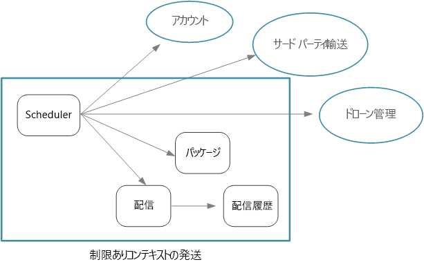
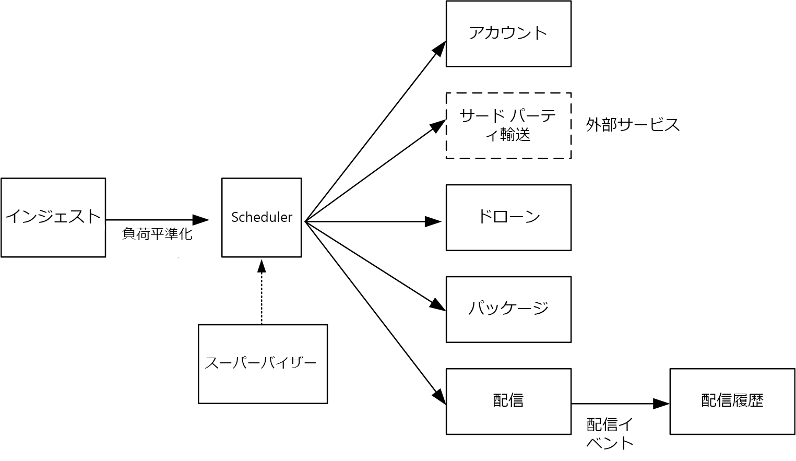

# マイクロサービスの設計:マイクロサービス境界の識別

マイクロサービスの適切なサイズとは何でしょうか。 "大きすぎず小さすぎず" といったことをよく耳にします。確かにそのとおりですが、実際にはほとんど役に立ちません。 しかし、慎重に設計されたドメイン モデルから始めると、マイクロサービスについてずっと簡単に類推できます。

## ドメイン モデルからマイクロサービスに

[前の章](./domain-analysis.md)では、ドローン配送アプリケーションの境界付けられたコンテキストのセットを定義しました。 それから、これらの境界付けられたコンテキストの 1 つである "出荷" 境界付けられたコンテキストを詳しく調べて、その境界付けられたコンテキストのエンティティ、集計、ドメイン サービスのセットを明らかにしました。

その結果、ドメイン モデルからアプリケーション設計に移行する準備ができています。 ドメイン モデルからマイクロサービスを導き出すために使うことができるアプローチを次に示します。

1. 境界付けられたコンテキストから始めます。 一般に、マイクロサービスの機能は、複数の境界付けられたコンテキストにまたがっていてはなりません。 定義上、境界付けられたコンテキストは特定のドメイン モデルの境界をマークします。 1 つのマイクロサービスに複数の異なるドメイン モデルが含まれることがわかった場合は、前に戻ってドメイン分析を修正する必要があることを示しています。

2. 次に、ドメイン モデルの集計を確認します。 集計はマイクロサービスの適切な候補になることがよくあります。 適切に設計された集計は、次のような適切に設計されたマイクロサービスの特徴を多く備えています。

    - 集計は、データ アクセスやメッセージングなどの技術的な問題ではなく、ビジネス要件から派生します。
    - 集計には、機能の高い凝集度が必要です。
    - 集計は永続性の境界です。
    - 集計同士は疎に結合されている必要があります。

3. ドメイン サービスもマイクロサービスに適した候補です。 ドメイン サービスは、複数の集計に対するステートレスな操作です。 典型的な例は、複数のマイクロサービスを含むワークフローです。 ドローン配送アプリケーションで、その例を見ることができます。

4. 最後に、機能以外の要件を検討します。 チームの規模、データの型、テクノロジ、スケーラビリティの要件、可用性の要件、セキュリティの要件などの要因を確認します。 これらの要因により、1 つのマイクロサービスを複数の小さいサービスにさらに分割したり、その逆に、複数のマイクロサービスを 1 つに結合したりすることになる場合があります。

アプリケーション内のマイクロサービスを識別した後は、次の基準に照らし合わせて設計を検証します。

- 各サービスが 1 つの役割を持っていること。
- サービス間で頻繁な呼び出しが行われないこと。 機能を 2 つのサービスに分割したことによってそれらの間で過度に頻繁に呼び出しが行われる場合、それらの関数が同じサービスに属すことを示している可能性があります。
- 各サービスが、独立して作業する小規模なチームで構築できるくらいに十分小さいこと。
- 複数のサービスをロックステップでデプロイすることが必要になる相互依存関係がないこと。 常に、他のサービスを再デプロイすることなくサービスをデプロイできる必要があります。
- サービスが密結合されておらず、個別に展開できること。
- そうすれば、サービスの境界でデータの一貫性や整合性の問題が発生することはありません。 場合によっては、単一のマイクロサービスに機能を収めることによってデータの整合性を維持することが重要になります。 ただし、強力な一貫性が本当に必要かどうかを検討する必要があります。 分散システムで最終的な整合性に対処するための戦略があり、多くの場合、サービスを分割するメリットの方が、最終的な整合性を管理する難しさより勝ります。

何よりもまず、実際的であること、そしてドメインベースの設計は反復プロセスであることを忘れないようにすることが重要です。 判断に迷うときは、より粒度の粗いマイクロサービスで始めるようにします。 1 つのマイクロサービスを 2 つの小さいサービスに分割する方が、既存の複数のマイクロサービスの機能をリファクタリングするより簡単です。
  
## ドローン配送:マイクロサービスの定義

開発チームは 4 つの集計 (配送、パッケージ、ドローン、アカウント) と 2 つのドメイン サービス (スケジューラとスーパーバイザー) を識別したことを思い出してください。

配送とパッケージは、マイクロサービスの明らかな候補です。 スケジューラとスーパーバイザーは、他のマイクロサービスによって実行されるアクティビティを調整するので、これらのドメイン サービスをマイクロサービスとして実装するのは当然のことです。

ドローンとアカウントが興味深いのは、他の境界付けられたコンテキストに属していることです。 1 つのオプションは、スケジューラでドローンとアカウントの境界付けられたコンテキストを直接呼び出すというものです。 もう 1 つのオプションは、発送の境界付けられたコンテキストの内部にドローンとアカウントのマイクロサービスを作成することです。 これらマイクロサービスは、発送コンテキストにより適した API またはデータ スキーマを公開することにより、境界付けられたコンテキストの間を仲介します。

ドローンとアカウントの境界付けられたコンテキストの詳細はこのガイドの範囲外なので、参照実装ではこれらのモック サービスを作成しました。 ただし、この状況では次のような要因を考慮する必要があります。

- 他の境界付けられたコンテキストを直接呼び出すとどのようなネットワーク オーバーヘッドがあるか。

- 他の境界付けられたコンテキストのデータ スキーマがこのコンテキストに適しているか、またはこの境界付けられたコンテキストに合わせて調整されたスキーマを作成する方がよいか。

- 他の境界付けられたコンテキストはレガシ システムか。 そうである場合は、[破損対策レイヤー](../patterns/anti-corruption-layer.md)として機能するサービスを作成し、レガシ システムと最新のアプリケーションの間の変換を行うことが考えられます。

- チームはどのような構造か。 他の境界付けられたコンテキストを担当するチームと簡単に通信できるか。 そうでない場合は、2 つのコンテキストの間を仲介するサービスを作成すると、チーム間の通信コストの削減に役立つ場合があります。

これまで、機能以外の要件については考慮してきませんでした。 アプリケーションのスループット要件を考慮し、開発チームはクライアント要求のインジェストを行うインジェスト マイクロサービスを別に作成することを決定しました。 このマイクロサービスは、着信した要求を処理のためのバッファーに入れることで、[負荷平準化](../patterns/queue-based-load-leveling.md)を実装します。 スケジューラは、バッファーから要求を読み取って、ワークフローを実行します。

機能以外の要件により、チームは 1 つの追加サービスを作成することにしました。 これまでのサービスはすべて、パッケージのスケジューリングと配送をリアルタイムで行うプロセスに関するものでした。 しかし、システムでは、データ分析のための長期的な記憶域にすべての配送の履歴を格納する必要もあります。 チームは、これを配送サービスで行うことを検討しました。 ただし、データ記憶域の要件は、履歴分析と処理中の操作ではまったく異なります (「[データに関する考慮事項](./data-considerations.md)」を参照)。 そのため、チームは配送履歴サービスを別に作成することにしました。このサービスは、配送サービスからの DeliveryTracking イベントをリッスンし、長期的な記憶域にイベントを書き込みます。

次の図は、この時点での設計を示したものです。

## コンピューティング オプションの選択

"*コンピューティング*" という用語は、アプリケーションがそこで実行されるコンピューティング リソースのホスティング モデルを指します。 マイクロサービス アーキテクチャでは、2 つのアプローチが特によく使われます。

- 専用のノード (VM) で実行されるサービスを管理するサービス オーケストレーター。
- サービスとしての関数 (FaaS) を使うサーバーレス アーキテクチャ。

オプションはこれらだけではありませんが、どちらも実証済みのマイクロサービス構築方法です。 1 つのアプリケーションに両方のアプローチが含まれることもあります。

### サービス オーケストレーター

オーケストレーターは、一連のサービスのデプロイと管理に関連するタスクを処理します。 ノードへのサービスの配置、サービスの正常性の監視、サービス インスタンス間へのネットワーク トラフィックの負荷分散、サービスの検出、サービスのインスタンスの数のスケーリング、構成の更新の適用などのタスクがあります。 よく使われるオーケストレーターとしては、Kubernetes、Service Fabric、DC/OS、Docker Swarm などがあります。

Azure プラットフォームでは、以下のオプションを検討してください。

- [Azure Kubernetes Service](/azure/aks/) (AKS) は、マネージド Kubernetes サービスです。 AKS は、Kubernetes をプロビジョニングして Kubernetes API エンドポイントを公開しますが、Kubernetes 制御プレーンをホストして管理し、自動アップグレード、修正プログラムの自動適用、自動スケーリング、その他の管理タスクを実行します。 AKS は、"サービスとしての Kubernetes API" と考えることができます。

- [Service Fabric](/azure/service-fabric/) は、マイクロサービスのパッケージ化、デプロイ、管理を行うための分散システム プラットフォームです。 マイクロサービスは、コンテナー、バイナリ実行可能ファイル、または [Reliable Services](/azure/service-fabric/service-fabric-reliable-services-introduction) として Service Fabric にデプロイできます。 Reliable Services プログラミング モデルを使うと、サービスは Service Fabric プログラミング API を直接使って、システムのクエリ、正常性のレポート、構成とコードの変更に関する通知の受信、他のサービスの検出を行うことができます。 Service Fabric に関する重要な違いは、Service Fabric では [Reliable Collection](/azure/service-fabric/service-fabric-reliable-services-reliable-collections) を使うステートフル サービスの構築が重視されていることです。

- [Azure Container Service](/azure/container-service/) (ACS) は、運用環境に対応した DC/OS、Docker Swarm、または Kubernetes クラスターをデプロイできる Azure サービスです。

  > [!NOTE]
  > Kubernetes は ACS でサポートされていますが、Azure で Kubernetes を実行する場合は AKS をお勧めします。 AKS を使用すると、強化された管理機能とコスト面の利点を得ることができます。

### Containers

コンテナーとマイクロサービスは同じものであるかのように言われることがあります。 それは正しくありませんが (マイクロサービスを構築するためにコンテナーは必要ありません)、コンテナーの次のような利点はマイクロサービスに特に関連があります。

- **移植性**。 コンテナー イメージは、ライブラリや他の依存関係をインストールする必要なしに実行するスタンドアロン パッケージです。 そのため簡単にデプロイできます。 コンテナーはすばやく開始および停止できるので、高い負荷の処理やノード障害からの復旧のために新しいインスタンスを開始できます。

- **密度**。 コンテナーは OS リソースを共有しているため、仮想マシンの実行と比較して軽量です。 そのため、複数のコンテナーを単一のノードに収めることができ、アプリケーションが多数の小さいサービスで構成される場合に特に便利です。

- **リソースの分離**。 コンテナーで利用できるメモリと CPU の量を制限することができ、ランナウェイ プロセスによってホストのリソースがすべて使われないようにするのに役立ちます。 詳しくは、「[Bulkhead pattern](../patterns/bulkhead.md)」 (バルクヘッド パターン) をご覧ください。

### サーバーレス (サービスとしての関数)

[サーバーレス](https://azure.microsoft.com/solutions/serverless/) アーキテクチャでは、ユーザーは VM や仮想ネットワーク インフラストラクチャを管理しません。 代わりに、ユーザーがコードをデプロイすると、ホスティング サービスがそのコードを VM 上に配置して実行します。 このアプローチには、イベント ベースのトリガーを使って調整される小さく細分化された関数が適しています。 たとえば、メッセージがキューに配置されると、メッセージをキューから読み取って処理する関数がトリガーされるような場合です。

[Azure Functions][functions] はサーバーレスのコンピューティング サービスであり、HTTP 要求、Service Bus キュー、Event Hubs イベントなど、さまざまな関数トリガーをサポートします。 詳しくは、「[Azure Functions でのトリガーとバインドの概念][functions-triggers]」をご覧ください。 また、Azure の管理されたイベント ルーティング サービスである [Azure Event Grid][event-grid] も検討してください。

<!-- markdownlint-disable MD026 -->

### オーケストレーターかサーバーレスか

<!-- markdownlint-enable MD026 -->

オーケストレーター アプローチとサーバーレス アプローチのどちらを選ぶかを検討するときの要因を次に示します。

**管理の容易性**。サーバーレス アプリケーションは、プラットフォームがすべてのコンピューティング リソースを管理するので、管理が容易です。 オーケストレーターはクラスターの管理と構成の一部を抽象化しますが、基になる VM を完全には隠ぺいしません。 オーケストレーターでは、負荷分散、CPU とメモリの使用量、ネットワークなどの問題について、ユーザーが考える必要があります。

**柔軟性と制御**。 オーケストレーターでは、サービスおよびクラスターの構成と管理の広い範囲をユーザーが制御できます。 その代わり、複雑さは増します。 サーバーレス アーキテクチャでは、詳細が抽象化されているため、ユーザーが制御できない部分があります。

**移植性**。 ここで示したすべてのオーケストレーター (Kubernetes、DC/OS、Docker Swarm、Service Fabric) は、オンプレミスで、または複数のパブリック クラウドで実行できます。

**アプリケーションの統合**。 サーバーレス アーキテクチャを使って複雑なアプリケーションを構築するのは、困難な場合があります。 Azure での 1 つのオプションは、[Azure Logic Apps](/azure/logic-apps/) を使って Azure Functions のセットを調整することです。 このアプローチの例については、「[Azure Logic Apps と統合される関数を作成する](/azure/azure-functions/functions-twitter-email)」をご覧ください。

**コスト**。 オーケストレーターでは、クラスターで実行している VM の料金がかかります。 サーバーレス アプリケーションでは、実際に消費したコンピューティング リソースについてだけ課金されます。 どちらの場合も、記憶域、データベース、メッセージング サービスなど、追加サービスのコストを考慮する必要があります。

**スケーラビリティ**:  Azure Functions は、受信イベントの数に基づき、需要に合わせて自動的にスケーリングします。 オーケストレーターでは、クラスターで実行するサービス インスタンスの数を増やすことによりスケールアウトできます。 また、クラスターに VM を追加してスケーリングすることもできます。

この参照実装では主に Kubernetes を使っていますが、配送履歴サービスに対しては Azure Functions を使いました。 この特定のサービスはイベント ドリブンのワークロードであるため、Azure Functions が適していました。 Event Hubs のトリガーを使って関数を呼び出すことにより、サービスで必要なコードは最小限の量で済みました。 また、配送履歴サービスはメイン ワークフローの一部ではないので、Kubernetes クラスターの外部で実行しても、ユーザー開始操作のエンド ツー エンドの待機時間には影響がありません。

> [!div class="nextstepaction"]
> [データに関する考慮事項](./data-considerations.md)

<!-- links -->

[acs-engine]: https://github.com/Azure/acs-engine
[acs-faq]: /azure/container-service/dcos-swarm/container-service-faq
[event-grid]: /azure/event-grid/
[functions]: /azure/azure-functions/functions-overview
[functions-triggers]: /azure/azure-functions/functions-triggers-bindings
