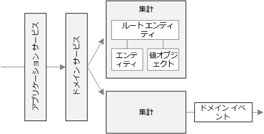
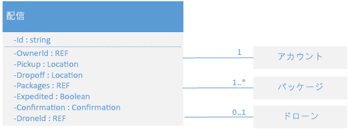
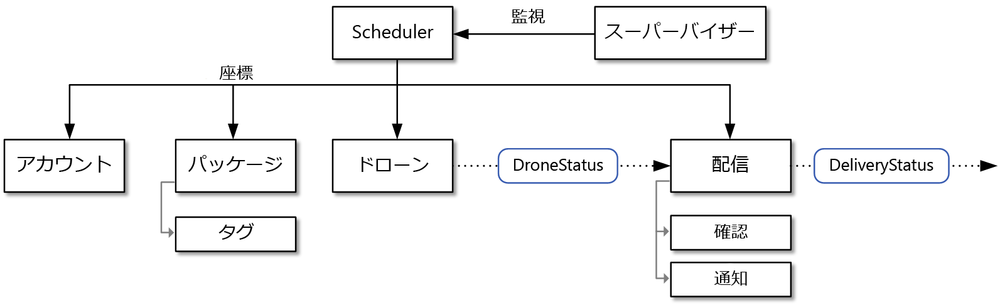

# 戦術的 DDD を使用したマイクロサービスの設計

DDD の戦略フェーズでは、ビジネス用ドメインを策定し、ドメイン モデルの境界付けられたコンテキストを定義します。 戦術的 DDD では、ドメイン モデルをより正確に定義します。 戦術的パターンは、1 つの境界付けられたコンテキスト内で適用されます。 マイクロサービスのアーキテクチャで特に興味深いのは、エンティティと集約のパターンです。 これらのパターンを適用すると、アプリケーション内のサービスの自然な境界を識別できます (このシリーズの[次の記事](./microservice-boundaries.md)を参照)。 原則として、マイクロサービスは集約よりは大きく、境界付けられたコンテキストよりは小さくする必要があります。 最初に、戦術的パターンを確認します。 次に、ドローン配送アプリケーションの境界付けられたコンテキスト "出荷" にそのパターンを適用します。

## 戦術的パターンの概要

ここでは、戦術的 DDD パターンの概要を示します。DDD について既に詳しくご存じの場合は、このセクションをスキップしてもかまいません。 各パターンについて詳しくは、Eric Evans 氏の著書の第 5 章と第 6 章、および Vaughn Vernon 氏の著書『*Implementing Domain-Driven Design*』をご覧ください。

**エンティティ**:  エンティティは、時間の経過に関係なく保持される一意の ID を持つオブジェクトです。 たとえば、銀行取引アプリケーションでは、顧客と口座がエンティティになります。

- システムでは、エンティティに一意識別子が割り当てられており、エンティティの検索や取得に使うことができます。 この識別子は必ずユーザーに対して直接公開されているわけではありません。 データベースの GUID や主キーがこれに該当します。
- ID は複数の境界付けられたコンテキストにまたがり、アプリケーションの有効期間を越えて存続する可能性があります。 たとえば、銀行口座番号や政府発行の ID が特定のアプリケーションの有効期間に関連付けられることはありません。
- エンティティの属性は時間の経過と共に変わる可能性があります。 たとえば、個人名や住所は変わる可能性がありますが、個人は同じ人物のままです。
- エンティティは他のエンティティへの参照を保持できます。

**値オブジェクト**:  値オブジェクトには ID がありません。 このオブジェクトは属性の値でのみ定義されます。 値オブジェクトも変更できません。 値オブジェクトを更新するには、必ず新しいインスタンスを作成して、古いインスタンスを置き換えます。 値オブジェクトにはドメイン ロジックをカプセル化する方法が用意されていますが、これらの方法がオブジェクトの状態に対して副次的な影響を及ぼしてはなりません。 値オブジェクトの一般的な例として、色、日付と時刻、通貨の値が挙げられます。

**集約**:  集約では、1 つ以上のエンティティを囲む一貫性の境界を定義します。 集約内の 1 つのエンティティはルートです。 ルート エンティティの識別子を使って、検索が行われます。 集約内のその他のエンティティはルートの子であり、ルートからのポインターをたどることによって参照されます。

集約の目的は、トランザクションのインバリアントをモデル化することです。 現実世界のものには複雑な関係があります。 たとえば、顧客が注文を作成し、注文には商品が含まれ、商品には供給業者が存在する、などの関係です。 アプリケーションがいくつかの関連オブジェクトを変更する場合は、どのように一貫性を保証するのでしょうか。 また、インバリアントを追跡して実現するにはどうすればよいでしょうか。  

従来のアプリケーションでは、多くの場合、データベース トランザクションを使って一貫性を実現します。 しかし、分散アプリケーションでは、多くの場合、これを実現できません。 1 つのビジネス トランザクションが複数のデータ ストアにまたがる場合、トランザクションの実行時間が長い場合、またはトランザクションにサード パーティのサービスが関与する場合があります。 最終的に、ドメインに必要なインバリアントの実現は、データ レイヤーではなくアプリケーションに依存します。 それが集約によってモデル化されるものです。

> [!NOTE]
> 集約は 1 つのエンティティで構成され、子エンティティはありません。 エンティティが集約になるために必要なのはトランザクション境界です。

**ドメイン サービスとアプリケーション サービス**:  DDD の用語では、サービスとは、状態を保持せずにいくつかのロジックを実装するオブジェクトです。 Evans 氏は、ドメイン ロジックをカプセル化する*ドメイン サービス*と、技術的な機能 (ユーザー認証や SMS メッセージの送信など) を提供する*アプリケーション サービス*を区別しています。 ドメイン サービスは、多くの場合、複数のエンティティにまたがる動作のモデル化に使われます。

> [!NOTE]
> ソフトウェア開発においては、*サービス*という用語に過剰な負荷がかかっています。 ここでの定義はマイクロサービスに直接関連しません。

**ドメイン イベント**:  ドメイン イベントを使うと、何かが発生したときにシステムの他の部分に通知できます。 その名前が示すように、ドメイン イベントはドメイン内で発生するイベントです。 たとえば、"レコードがテーブルに挿入された" ことはドメイン イベントではありません。 "配送がキャンセルされた" ことはドメイン イベントです。 ドメイン イベントはマイクロサービスのアーキテクチャに特に関連します。 マイクロサービスは分散型であり、データ ストアを共有しないので、ドメイン イベントはマイクロサービスが互いに連携するための方法を提供します。 [サービス間の通信](../design/interservice-communication.md)に関する記事では、非同期メッセージングについて詳しく説明します。

ここで説明していない DDD パターンは他にもいくつかあります (ファクトリ、リポジトリ、モジュールなど)。 これらはマイクロサービスの実装時に役立つパターンですが、マイクロサービス間の境界の設計にはあまり関連しません。

## ドローン配送:パターンの適用

最初に、境界付けられたコンテキスト "出荷" が処理する必要のあるシナリオを見てみましょう。

- 顧客は、ドローン配送サービスに登録された企業からドローンで商品を集荷するよう依頼できます。
- 荷送人は、タグ (バーコードまたは RFID) を生成して荷物に取り付けます。
- ドローンが集荷先から荷物を集荷して、配送先に届けます。
- 顧客が配送をスケジュールするときに、システムはルート情報、気象条件、履歴データに基づいて ETA を提供します。
- ドローンの飛行中、ユーザーは現在地と最新の ETA を追跡できます。
- ドローンによる荷物の集荷が完了するまで、顧客は配送をキャンセルできます。
- 配送が完了すると、顧客に通知が送信されます。
- 荷送人は、署名またはフィンガープリントの形式で顧客から配送の確認を要求できます。
- ユーザーは、完了した配送の履歴を検索できます。

これらのシナリオから、開発チームは以下の**エンティティ**を識別しました。

- 配送
- Package
- ドローン
- Account
- 確認
- 通知
- タグ

最初の 4 つ (配送、荷物、ドローン、アカウント) はすべて、トランザクションの一貫性の境界を表す**集約**です。 "確認" と "通知" は "配送" の子エンティティです。"タグ" は "荷物" の子エンティティです。

この設計の**値オブジェクト**には Location、ETA、PackageWeight、および PackageSize があります。

"配送" 集約の UML 図を次に示します。 この集約は、他の集約 (アカウント、荷物、ドローン) への参照を保持します。

次の 2 つのドメイン イベントがあります。

- ドローンの飛行中、"ドローン" エンティティはドローンの場所と状態 (飛行中、着陸) を示す DroneStatus イベントを送信します。

- "配送" エンティティは、配送の段階が変わるたびに DeliveryTracking イベントを送信します。 これらには、DeliveryCreated、DeliveryRescheduled、DeliveryHeadedToDropoff、DeliveryCompleted があります。

これらのイベントは、ドメイン モデル内で意味のある内容を示しています。 これらはドメインに関する情報を示すものであり、特定のプログラミング言語コンストラクトに関連付けられません。

開発チームは、これまでに記述されたどのエンティティにも当てはまらないもう 1 つの機能分野を識別しました。 システムの一部では、配送のスケジューリングまたは更新に関連するすべての手順を調整する必要があります。 そのため、開発チームは、2 つの**ドメイン サービス** (手順を調整する *Scheduler*、および各手順の状態を監視する *Supervisor*) を設計に追加し、いずれかの手順が失敗またはタイムアウトしたかどうかを検出するようにしました。これは [Scheduler Agent Supervisor パターン](../../patterns/scheduler-agent-supervisor.md)のバリエーションです。

## 次の手順

次の手順では、各マイクロサービスの境界を定義します。

> [!div class="nextstepaction"]
> [マイクロサービス境界の特定](./microservice-boundaries.md)