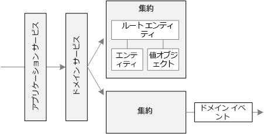

# 戦術的 DDD を使用したマイクロサービスの設計Using tactical DDD to design microservices

DDD の戦略フェーズでは、ビジネス用ドメインを策定し、ドメイン モデルの境界付けられたコンテキストを定義します。During the strategic phase of DDD, you are mapping out the business domain and defining bounded contexts for your domain models. 戦術的 DDD では、ドメイン モデルをより正確に定義します。Tactical DDD is when you define your domain models with more precision. 戦術的パターンは、1 つの境界付けられたコンテキスト内で適用されます。The tactical patterns are applied within a single bounded context. マイクロサービスのアーキテクチャで特に興味深いのは、エンティティと集約のパターンです。In a microservices architecture, we are particularly interested in the entity and aggregate patterns. これらのパターンを適用すると、アプリケーション内のサービスの自然な境界を識別できます (このシリーズの[次の記事](./microservice-boundaries.md)を参照)。Applying these patterns will help us to identify natural boundaries for the services in our application (see the [next article](./microservice-boundaries.md) in this series). 原則として、マイクロサービスは集約よりは大きく、境界付けられたコンテキストよりは小さくする必要があります。As a general principle, a microservice should be no smaller than an aggregate, and no larger than a bounded context. 最初に、戦術的パターンを確認します。First, we'll review the tactical patterns. 次に、ドローン配送アプリケーションの境界付けられたコンテキスト "出荷" にそのパターンを適用します。Then we'll apply them to the Shipping bounded context in the Drone Delivery application.

## 戦術的パターンの概要Overview of the tactical patterns

ここでは、戦術的 DDD パターンの概要を示します。DDD について既に詳しくご存じの場合は、このセクションをスキップしてもかまいません。This section provides a brief summary of the tactical DDD patterns, so if you are already familiar with DDD, you can probably skip this section. 各パターンについて詳しくは、Eric Evans 氏の著書の第 5 章と第 6 章、および Vaughn Vernon 氏の著書『*Implementing Domain-Driven Design*』をご覧ください。The patterns are described in more detail in chapters 5 &ndash; 6 of Eric Evans' book, and in *Implementing Domain-Driven Design* by Vaughn Vernon.

**エンティティ**: **Entities**. エンティティは、時間の経過に関係なく保持される一意の ID を持つオブジェクトです。An entity is an object with a unique identity that persists over time. たとえば、銀行取引アプリケーションでは、顧客と口座がエンティティになります。For example, in a banking application, customers and accounts would be entities.

- システムでは、エンティティに一意識別子が割り当てられており、エンティティの検索や取得に使うことができます。An entity has a unique identifier in the system, which can be used to look up or retrieve the entity. この識別子は必ずユーザーに対して直接公開されているわけではありません。That doesn't mean the identifier is always exposed directly to users. データベースの GUID や主キーがこれに該当します。It could be a GUID or a primary key in a database.
- ID は複数の境界付けられたコンテキストにまたがり、アプリケーションの有効期間を越えて存続する可能性があります。An identity may span multiple bounded contexts, and may endure beyond the lifetime of the application. たとえば、銀行口座番号や政府発行の ID が特定のアプリケーションの有効期間に関連付けられることはありません。For example, bank account numbers or government-issued IDs are not tied to the lifetime of a particular application.
- エンティティの属性は時間の経過と共に変わる可能性があります。The attributes of an entity may change over time. たとえば、個人名や住所は変わる可能性がありますが、個人は同じ人物のままです。For example, a person's name or address might change, but they are still the same person.
- エンティティは他のエンティティへの参照を保持できます。An entity can hold references to other entities.

**値オブジェクト**: **Value objects**. 値オブジェクトには ID がありません。A value object has no identity. このオブジェクトは属性の値でのみ定義されます。It is defined only by the values of its attributes. 値オブジェクトも変更できません。Value objects are also immutable. 値オブジェクトを更新するには、必ず新しいインスタンスを作成して、古いインスタンスを置き換えます。To update a value object, you always create a new instance to replace the old one. 値オブジェクトにはドメイン ロジックをカプセル化する方法が用意されていますが、これらの方法がオブジェクトの状態に対して副次的な影響を及ぼしてはなりません。Value objects can have methods that encapsulate domain logic, but those methods should have no side-effects on the object's state. 値オブジェクトの一般的な例として、色、日付と時刻、通貨の値が挙げられます。Typical examples of value objects include colors, dates and times, and currency values.

**集約**: **Aggregates**. 集約では、1 つ以上のエンティティを囲む一貫性の境界を定義します。An aggregate defines a consistency boundary around one or more entities. 集約内の 1 つのエンティティはルートです。Exactly one entity in an aggregate is the root. ルート エンティティの識別子を使って、検索が行われます。Lookup is done using the root entity's identifier. 集約内のその他のエンティティはルートの子であり、ルートからのポインターをたどることによって参照されます。Any other entities in the aggregate are children of the root, and are referenced by following pointers from the root.

集約の目的は、トランザクションのインバリアントをモデル化することです。The purpose of an aggregate is to model transactional invariants. 現実世界のものには複雑な関係があります。Things in the real world have complex webs of relationships. たとえば、顧客が注文を作成し、注文には商品が含まれ、商品には供給業者が存在する、などの関係です。Customers create orders, orders contain products, products have suppliers, and so on. アプリケーションがいくつかの関連オブジェクトを変更する場合は、どのように一貫性を保証するのでしょうか。If the application modifies several related objects, how does it guarantee consistency? また、インバリアントを追跡して実現するにはどうすればよいでしょうか。How do we keep track of invariants and enforce them?  

従来のアプリケーションでは、多くの場合、データベース トランザクションを使って一貫性を実現します。Traditional applications have often used database transactions to enforce consistency. しかし、分散アプリケーションでは、多くの場合、これを実現できません。In a distributed application, however, that's often not feasible. 1 つのビジネス トランザクションが複数のデータ ストアにまたがる場合、トランザクションの実行時間が長い場合、またはトランザクションにサード パーティのサービスが関与する場合があります。A single business transaction may span multiple data stores, or may be long running, or may involve third-party services. 最終的に、ドメインに必要なインバリアントの実現は、データ レイヤーではなくアプリケーションに依存します。Ultimately it's up to the application, not the data layer, to enforce the invariants required for the domain. それが集約によってモデル化されるものです。That's what aggregates are meant to model.

> [!NOTE]
> 集約は 1 つのエンティティで構成され、子エンティティはありません。An aggregate might consist of a single entity, without child entities. エンティティが集約になるために必要なのはトランザクション境界です。What makes it an aggregate is the transactional boundary.

**ドメイン サービスとアプリケーション サービス**: **Domain and application services**. DDD の用語では、サービスとは、状態を保持せずにいくつかのロジックを実装するオブジェクトです。In DDD terminology, a service is an object that implements some logic without holding any state. Evans 氏は、ドメイン ロジックをカプセル化する*ドメイン サービス*と、技術的な機能 (ユーザー認証や SMS メッセージの送信など) を提供する*アプリケーション サービス*を区別しています。Evans distinguishes between *domain services*, which encapsulate domain logic, and *application services*, which provide technical functionality, such as user authentication or sending an SMS message. ドメイン サービスは、多くの場合、複数のエンティティにまたがる動作のモデル化に使われます。Domain services are often used to model behavior that spans multiple entities.

> [!NOTE]
> ソフトウェア開発においては、*サービス*という用語に過剰な負荷がかかっています。The term *service* is overloaded in software development. ここでの定義はマイクロサービスに直接関連しません。The definition here is not directly related to microservices.

**ドメイン イベント**: **Domain events**. ドメイン イベントを使うと、何かが発生したときにシステムの他の部分に通知できます。Domain events can be used to notify other parts of the system when something happens. その名前が示すように、ドメイン イベントはドメイン内で発生するイベントです。As the name suggests, domain events should mean something within the domain. たとえば、"レコードがテーブルに挿入された" ことはドメイン イベントではありません。For example, "a record was inserted into a table" is not a domain event. "配送がキャンセルされた" ことはドメイン イベントです。"A delivery was cancelled" is a domain event. ドメイン イベントはマイクロサービスのアーキテクチャに特に関連します。Domain events are especially relevant in a microservices architecture. マイクロサービスは分散型であり、データ ストアを共有しないので、ドメイン イベントはマイクロサービスが互いに連携するための方法を提供します。Because microservices are distributed and don't share data stores, domain events provide a way for microservices to coordinate with each other. [サービス間の通信](../design/interservice-communication.md)に関する記事では、非同期メッセージングについて詳しく説明します。The article [Interservice communication](../design/interservice-communication.md) discusses asynchronous messaging in more detail.

ここで説明していない DDD パターンは他にもいくつかあります (ファクトリ、リポジトリ、モジュールなど)。There are a few other DDD patterns not listed here, including factories, repositories, and modules. これらはマイクロサービスの実装時に役立つパターンですが、マイクロサービス間の境界の設計にはあまり関連しません。These can be useful patterns for when you are implementing a microservice, but they are less relevant when designing the boundaries between microservice.

## ドローン配送:パターンの適用Drone delivery: Applying the patterns

最初に、境界付けられたコンテキスト "出荷" が処理する必要のあるシナリオを見てみましょう。We start with the scenarios that the Shipping bounded context must handle.

- 顧客は、ドローン配送サービスに登録された企業からドローンで商品を集荷するよう依頼できます。A customer can request a drone to pick up goods from a business that is registered with the drone delivery service.
- 荷送人は、タグ (バーコードまたは RFID) を生成して荷物に取り付けます。The sender generates a tag (barcode or RFID) to put on the package.
- ドローンが集荷先から荷物を集荷して、配送先に届けます。A drone will pick up and deliver a package from the source location to the destination location.
- 顧客が配送をスケジュールするときに、システムはルート情報、気象条件、履歴データに基づいて ETA を提供します。When a customer schedules a delivery, the system provides an ETA based on route information, weather conditions, and historical data.
- ドローンの飛行中、ユーザーは現在地と最新の ETA を追跡できます。When the drone is in flight, a user can track the current location and the latest ETA.
- ドローンによる荷物の集荷が完了するまで、顧客は配送をキャンセルできます。Until a drone has picked up the package, the customer can cancel a delivery.
- 配送が完了すると、顧客に通知が送信されます。The customer is notified when the delivery is completed.
- 荷送人は、署名またはフィンガープリントの形式で顧客から配送の確認を要求できます。The sender can request delivery confirmation from the customer, in the form of a signature or finger print.
- ユーザーは、完了した配送の履歴を検索できます。Users can look up the history of a completed delivery.

これらのシナリオから、開発チームは以下の**エンティティ**を識別しました。From these scenarios, the development team identified the following **entities**.

- 配送Delivery
- PackagePackage
- ドローンDrone
- AccountAccount
- 確認Confirmation
- 通知Notification
- タグTag

最初の 4 つ (配送、荷物、ドローン、アカウント) はすべて、トランザクションの一貫性の境界を表す**集約**です。The first four, Delivery, Package, Drone, and Account, are all **aggregates** that represent transactional consistency boundaries. "確認" と "通知" は "配送" の子エンティティです。"タグ" は "荷物" の子エンティティです。Confirmations and Notifications are child entities of Deliveries, and Tags are child entities of Packages.

この設計の**値オブジェクト**には Location、ETA、PackageWeight、および PackageSize があります。The **value objects** in this design include Location, ETA, PackageWeight, and PackageSize.

"配送" 集約の UML 図を次に示します。To illustrate, here is a UML diagram of the Delivery aggregate. この集約は、他の集約 (アカウント、荷物、ドローン) への参照を保持します。Notice that it holds references to other aggregates, including Account, Package, and Drone.

次の 2 つのドメイン イベントがあります。There are two domain events:

- ドローンの飛行中、"ドローン" エンティティはドローンの場所と状態 (飛行中、着陸) を示す DroneStatus イベントを送信します。While a drone is in flight, the Drone entity sends DroneStatus events that describe the drone's location and status (in-flight, landed).

- "配送" エンティティは、配送の段階が変わるたびに DeliveryTracking イベントを送信します。The Delivery entity sends DeliveryTracking events whenever the stage of a delivery changes. これらには、DeliveryCreated、DeliveryRescheduled、DeliveryHeadedToDropoff、DeliveryCompleted があります。These include DeliveryCreated, DeliveryRescheduled, DeliveryHeadedToDropoff, and DeliveryCompleted.

これらのイベントは、ドメイン モデル内で意味のある内容を示しています。Notice that these events describe things that are meaningful within the domain model. これらはドメインに関する情報を示すものであり、特定のプログラミング言語コンストラクトに関連付けられません。They describe something about the domain, and aren't tied to a particular programming language construct.

開発チームは、これまでに記述されたどのエンティティにも当てはまらないもう 1 つの機能分野を識別しました。The development team identified one more area of functionality, which doesn't fit neatly into any of the entities described so far. システムの一部では、配送のスケジューリングまたは更新に関連するすべての手順を調整する必要があります。Some part of the system must coordinate all of the steps involved in scheduling or updating a delivery. そのため、開発チームは、2 つの**ドメイン サービス** (手順を調整する *Scheduler*、および各手順の状態を監視する *Supervisor*) を設計に追加し、いずれかの手順が失敗またはタイムアウトしたかどうかを検出するようにしました。これは [Scheduler Agent Supervisor パターン](../../patterns/scheduler-agent-supervisor.md)のバリエーションです。Therefore, the development team added two **domain services** to the design: a *Scheduler* that coordinates the steps, and a *Supervisor* that monitors the status of each step, in order to detect whether any steps have failed or timed out. This is a variation of the [Scheduler Agent Supervisor pattern](../../patterns/scheduler-agent-supervisor.md).

## 次の手順Next steps

次の手順では、各マイクロサービスの境界を定義します。The next step is to define the boundaries for each microservice.

> [!div class="nextstepaction"]
> [マイクロサービス境界の特定Identify microservice boundaries](./microservice-boundaries.md)