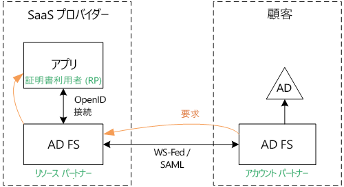
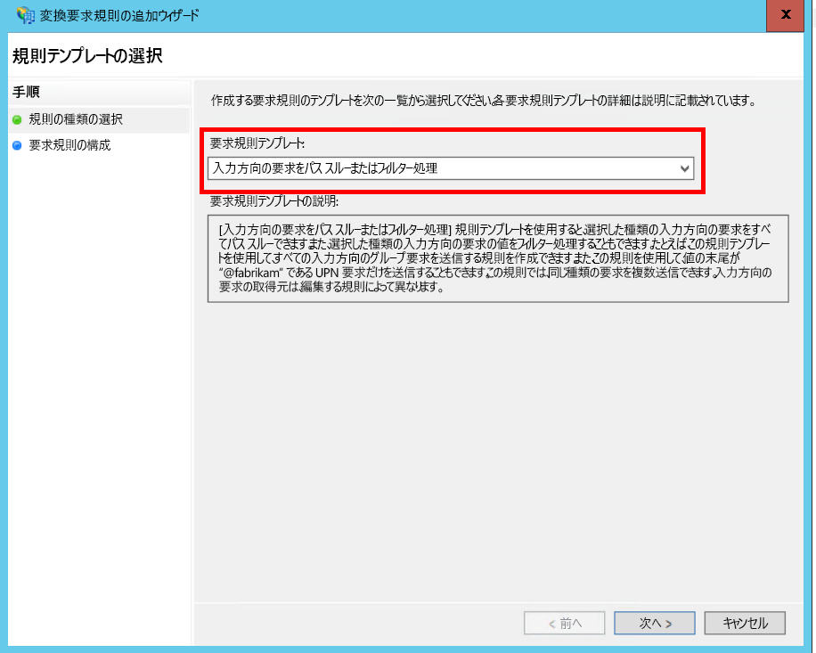
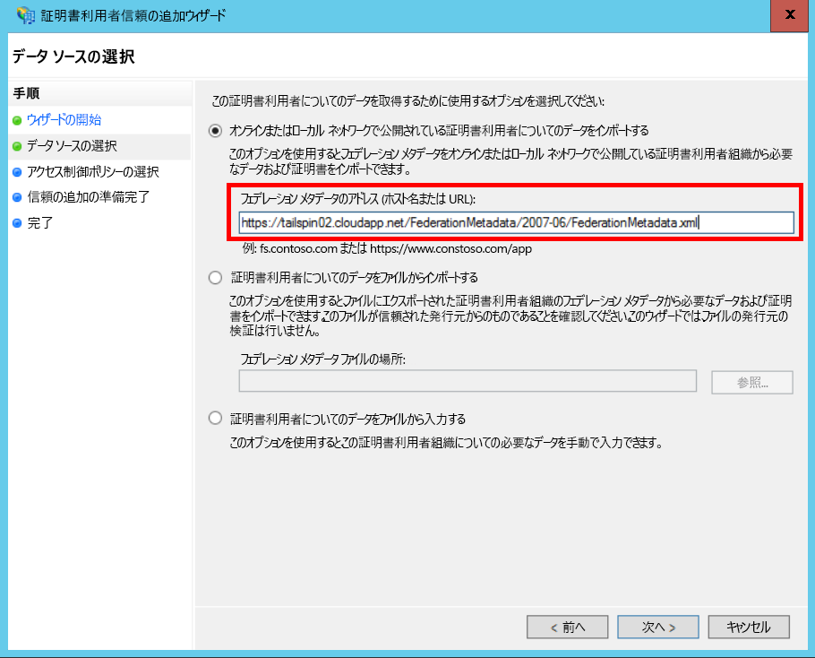
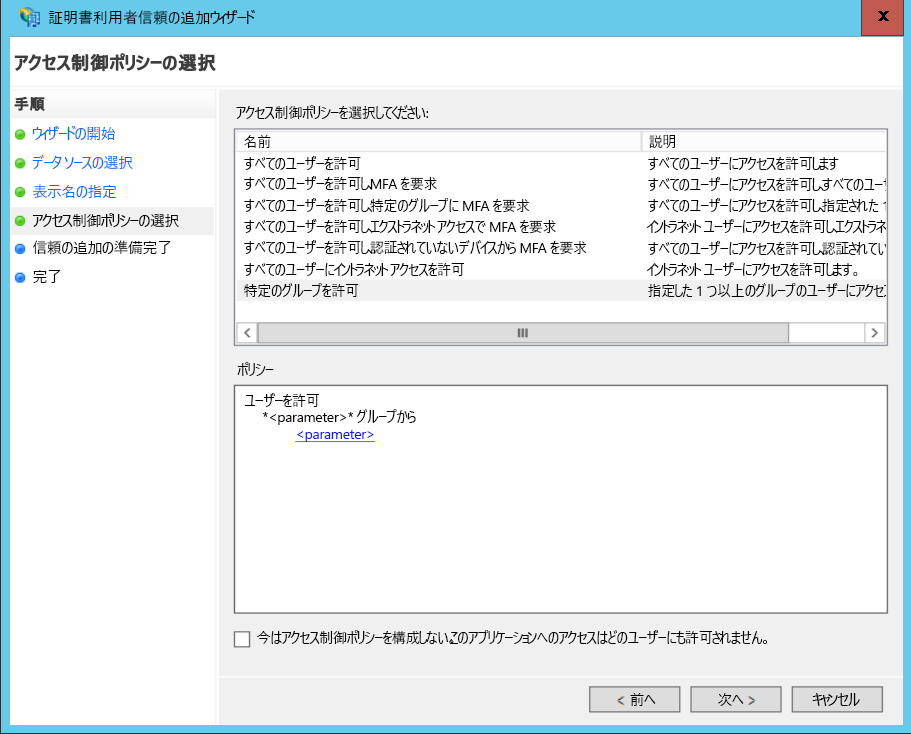
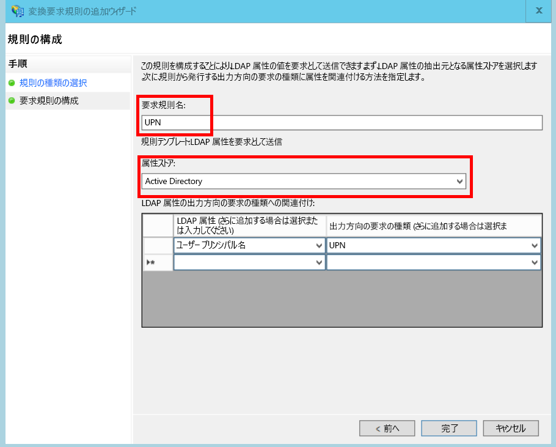

# <a name="federate-with-a-customers-ad-fs"></a>顧客の AD FS とのフェデレーション

この記事では、顧客の AD FS とのフェデレーションを行うために、マルチテナント SaaS アプリケーションで Active Directory フェデレーション サービス (AD FS) を使用して認証をサポートする方法について説明します。

## <a name="overview"></a>概要
Azure Active Directory (Azure AD) を使用すると、Office365 や Dynamics CRM Online の顧客を含め、Azure AD テナントのユーザーによるサインインが簡単になります。 では、企業のイントラネットでオンプレミスの Active Directory を使用する顧客についてはどうでしょうか。

このような顧客には、 [Azure AD Connect]を使用してオンプレミスの AD と Azure AD を同期するという方法があります。 ただし、企業の IT ポリシーやその他の理由により、この方法を使用できない顧客も存在します。 そのような場合には、Active Directory フェデレーション サービス (AD FS) を使用してフェデレーションを行う方法もあります。

このシナリオを実施するには:

* 顧客がインターネットに接続された AD FS ファームを持っている必要があります。
* SaaS プロバイダーが独自の AD FS ファームをデプロイします。
* 顧客と SaaS プロバイダーは、 [フェデレーションの信頼]を設定する必要があります。 この設定は手動で行います。

信頼関係には、3 つの主要なロールがあります。

* 顧客の AD FS は、顧客の AD からのユーザーを認証し、ユーザー要求に応じてセキュリティ トークンを作成する[アカウント パートナー]です。
* SaaS プロバイダーの AD FS は、アカウント パートナーを信頼し、ユーザー要求を受信する[リソース パートナー]です。
* アプリケーションは、SaaS プロバイダーの AD FS で証明書利用者 (RP) として構成されます。
  
  

> [!NOTE]
> この記事では、アプリケーションで認証プロトコルとして OpenID Connect を使用することを想定しています。 そのほか、WS-Federation を使用する方法もあります。
> 
> OpenID Connect を使用する場合、SaaS プロバイダーは、Windows Server 2016 で実行される AD FS 2016 を使用する必要があります。 AD FS 3.0 は、OpenID Connect をサポートしていません。
> 
> ASP.NET Core には、すぐに使用できる WS-Federation のサポートは含まれていません。
> 
> 

ASP.NET 4 による WS-Federation の使用例については、[active-directory-dotnet-webapp-wsfederation サンプル][active-directory-dotnet-webapp-wsfederation]をご覧ください。

## <a name="authentication-flow"></a>Authentication flow
1. ユーザーが [サインイン] をクリックすると、アプリケーションにより、SaaS プロバイダーの AD FS の OpenID Connect エンドポイントにリダイレクトされます。
2. ユーザーが組織のユーザー名 ("`alice@corp.contoso.com`") を入力します。 AD FS がホーム領域検出を使用して顧客の AD FS (ユーザーが資格情報を入力する場所) にリダイレクトします。
3. 顧客の AD FS が WF-Federation (または SAML) を使用して SaaS プロバイダーの AD FS にユーザー要求を送信します。
4. 要求は、OpenID Connect を使用して、AD FS からアプリケーションに渡されます。 これには、WS-Federation からのプロトコルの切り替えが必要です。

## <a name="limitations"></a>制限事項
証明書利用者アプリケーションは、次の表に示すように、既定では id_token で利用可能な要求の固定セットだけを受け取ります。 AD FS 2016 では、OpenID Connect のシナリオで id_token をカスタマイズできます。 詳細については、「[Custom ID Tokens in AD FS (AD FS でのカスタム ID トークン)](/windows-server/identity/ad-fs/development/customize-id-token-ad-fs-2016)」をご覧ください。

| 要求 | 説明 |
| --- | --- |
| aud |対象。 要求の発行先のアプリケーション。 |
| authenticationinstant |[認証インスタント]。 認証が発生した時刻。 |
| c_hash |コード ハッシュ値。 これは、トークンの内容のハッシュです。 |
| exp |[期限切れ日時]。 この時刻の後、トークンは受け入れられなくなります。 |
| iat |発行時刻。 トークンが発行された日時。 |
| iss |発行者。 この要求の値は、常にリソース パートナーの AD FS です。 |
| name |ユーザー名。 例: `john@corp.fabrikam.com` |
| nameidentifier |[名前の識別子]。 トークンが発行されたエンティティの名前の識別子。 |
| nonce |セッション nonce。 再生攻撃を防ぐために AD FS によって生成される一意の値。 |
| upn |ユーザー プリンシパル名 (UPN)。 例: `john@corp.fabrikam.com` |
| pwd_exp |パスワードの有効期限。 ユーザーのパスワード、または PIN などのような認証のシークレットが期限切れに なるまでの秒数。 |

> [!NOTE]
> "Iss" 要求には、パートナーの AD FS が含まれています (通常、この要求は SaaS プロバイダーを発行者として識別します)。 顧客の AD FS は識別しません。 UPN の一部として、顧客のドメインを見つけることができます。
> 
> 

この記事の残りの部分で、RP (アプリケーション) とアカウント パートナー (顧客) の間に信頼関係を設定する方法について説明します。

## <a name="ad-fs-deployment"></a>AD FS のデプロイ
SaaS プロバイダーは、オンプレミスまたは Azure VM に AD FS をデプロイできます。 セキュリティと可用性を確保するうえで、次のガイドラインが重要です。

* AD FS サービスの可用性を最大限高めるために、AD FS サーバーと AD FS プロキシ サーバーを少なくとも 2 つずつデプロイします。
* ドメイン コントローラーと AD FS サーバーは直接インターネットに公開せず、これらに直接アクセスできる仮想ネットワーク内に設置する必要があります。
* Web アプリケーション プロキシ (以前の AD FS プロキシ) を使用して、インターネットに AD FS サーバーを公開する必要があります。

このようなトポロジを Azure で設定するには、仮想ネットワーク、NSG、Azure VM、可用性セットを使用する必要があります。 詳細については、「 [Azure の仮想マシンでの Windows Server Active Directory のデプロイ ガイドライン][active-directory-on-azure]」をご覧ください。

## <a name="configure-openid-connect-authentication-with-ad-fs"></a>AD FS で OpenID Connect 認証を構成する
SaaS プロバイダーは、アプリケーションと AD FS の間の OpenID Connect を有効にする必要があります。 これを行うには、AD FS でアプリケーション グループを追加します。  詳細な手順については、この[ブログ記事]の「Setting up a Web App for OpenId Connect sign in AD FS (AD FS での OpenId Connect サインイン用 Web アプリの設定)」をご覧ください。 

次に、OpenID Connect ミドルウェアを構成します。 メタデータ エンドポイントは `https://domain/adfs/.well-known/openid-configuration` であり、ここでのドメインは SaaS プロバイダーの AD FS ドメインです。

通常、このメタデータ エンドポイントとその他の OpenID Connect エンドポイント (AAD など) を組み合わせます。 ユーザーが正しい認証エンドポイントに送られるように、2 つの異なるサインイン ボタンを使用するか、他の方法で 2 つのエンドポイントを区別する必要があります。

## <a name="configure-the-ad-fs-resource-partner"></a>AD FS リソース パートナーの構成
SaaS プロバイダーは、ADFS 経由で接続する顧客ごとに、次の操作を実行する必要があります。

1. 要求プロバイダー信頼を追加します。
2. 要求規則を追加します。
3. ホーム領域検出を有効にします。

詳細な手順を以下に示します。

### <a name="add-the-claims-provider-trust"></a>要求プロバイダー信頼の追加
1. サーバー マネージャーで、**[ツール]** をクリックし、次に **[AD FS の管理]** を選択します。
2. コンソール ツリーの **[AD FS]** で、**[要求プロバイダー信頼]** を右クリックします。 **[要求プロバイダー信頼の追加]** を選択します。
3. **[開始]** をクリックしてウィザードを開始します。
4. [オンラインまたはローカル ネットワークで公開されている要求プロバイダーについてのデータをインポートする] オプションを選択します。 顧客のフェデレーション メタデータ エンドポイントの URI を入力します。 (例: `https://contoso.com/FederationMetadata/2007-06/FederationMetadata.xml`。)これを顧客から入手する必要があります。
5. 既定のオプションを使用してウィザードを完了します。

### <a name="edit-claims-rules"></a>要求規則の編集
1. 新しく追加した要求プロバイダー信頼を右クリックし、 **[要求規則の編集]** を選択します。
2. **[規則の追加]** をクリックします。
3. [入力方向の要求をパス スルーまたはフィルター処理] を選択し、**[次へ]** をクリックします。
   
4. 規則の名前を入力します。
5. [入力方向の要求の種類] で、 **[UPN]** を選択します。
6. [すべての要求値をパススルーする] を選択します。
   
7. **[完了]** をクリックします。
8. 手順 2 - 7 を繰り返し、入力方向の要求の種類に **[アンカー要求の種類]** を指定します。
9. **[OK]** をクリックしてウィザードを完了します。

### <a name="enable-home-realm-discovery"></a>ホーム領域検出の有効化
次の PowerShell スクリプトを実行します。

```
Set-ADFSClaimsProviderTrust -TargetName "name" -OrganizationalAccountSuffix @("suffix")
```

"name" は要求プロバイダー信頼のフレンドリ名、"suffix" は顧客の AD の UPN サフィックス ("corp.fabrikam.com" など) です。

この構成では、エンド ユーザーが組織のアカウントを入力すると、AD FS によって対応する要求プロバイダーが自動的に選択されます。 詳細については、「 [AD FS サインイン ページのカスタマイズ]」の「特定の電子メール サフィックスを使用するための ID プロバイダーの構成」セクションを参照してください。

## <a name="configure-the-ad-fs-account-partner"></a>AD FS アカウント パートナーの構成
顧客は次の操作を実行する必要があります。

1. 証明書利用者 (RP) 信頼を追加します。
2. 要求規則を追加します。

### <a name="add-the-rp-trust"></a>RP 信頼の追加
1. サーバー マネージャーで、**[ツール]** をクリックし、次に **[AD FS の管理]** を選択します。
2. コンソール ツリーの **[AD FS]** で、**[証明書利用者信頼]** を右クリックします。 **[証明書利用者信頼の追加]** を選択します。
3. **[要求に対応する]** を選択して、**[開始]** をクリックします。
4. **[データ ソースの選択]** ページで、[オンラインまたはローカル ネットワーク上で発行された要求プロバイダーに関するデータをインポートする] オプションを選択します。 SaaS プロバイダーのフェデレーション メタデータ エンドポイントの URI を入力します。
   
5. **[表示名の指定]** ページで、任意の名前を入力します。
6. **[アクセス制御ポリシーの選択]** で、ポリシーを選択します。 組織内のすべてのユーザーを許可することも、特定のセキュリティ グループを選択することもできます。
   
7. **[ポリシー]** ボックスに必要なパラメーターを入力します。
8. **[次へ]** をクリックしてウィザードを完了します。

### <a name="add-claims-rules"></a>要求規則の追加
1. 新しく追加した証明書利用者信頼を右クリックし、 **[要求発行ポリシーの編集]** を選択します。
2. **[規則の追加]** をクリックします。
3. [要求として LDAP 属性を送信] を選択し、 **[次へ]** をクリックします。
4. "UPN" など、規則の名前を入力します。
5. **[属性ストア]** で、**[Active Directory]** を選択します。
   
6. **[LDAP 属性のマッピング]** セクションで次の操作を実行します。
   * **[LDAP 属性]** で、**[ユーザー プリンシパル名]** を選択します。
   * **[出力方向の要求の種類]** で、**[UPN]** を選択します。
     
7. **[完了]** をクリックします。
8. もう一度 **[規則の追加]** をクリックします。
9. [カスタムの規則を使用して要求を送信] を選択し、 **[次へ]** をクリックします。
10. "アンカー要求の種類" など、規則の名前を入力します。
11. **[カスタムの規則]** で、次のように入力します。
    
    ```
    EXISTS([Type == "http://schemas.microsoft.com/ws/2014/01/identity/claims/anchorclaimtype"])=>
    issue (Type = "http://schemas.microsoft.com/ws/2014/01/identity/claims/anchorclaimtype",
          Value = "http://schemas.xmlsoap.org/ws/2005/05/identity/claims/upn");
    ```
    
    この規則によって、種類が `anchorclaimtype` の要求が発行されます。 この要求は、証明書利用者にユーザーの不変 ID として UPN を使用するように指示します。
12. **[完了]** をクリックします。
13. **[OK]** をクリックしてウィザードを完了します。


<!-- Links -->
[Azure AD Connect]: /azure/active-directory/hybrid/whatis-hybrid-identity
[フェデレーションの信頼]: https://technet.microsoft.com/library/cc770993(v=ws.11).aspx
[アカウント パートナー]: https://technet.microsoft.com/library/cc731141(v=ws.11).aspx
[リソース パートナー]: https://technet.microsoft.com/library/cc731141(v=ws.11).aspx
[認証インスタント]: https://msdn.microsoft.com/library/system.security.claims.claimtypes.authenticationinstant%28v=vs.110%29.aspx
[期限切れ日時]: https://tools.ietf.org/html/draft-ietf-oauth-json-web-token-25#section-4.1.
[名前の識別子]: https://msdn.microsoft.com/library/system.security.claims.claimtypes.nameidentifier(v=vs.110).aspx
[active-directory-on-azure]: https://msdn.microsoft.com/library/azure/jj156090.aspx
[ブログ記事]: https://www.cloudidentity.com/blog/2015/08/21/OPENID-CONNECT-WEB-SIGN-ON-WITH-ADFS-IN-WINDOWS-SERVER-2016-TP3/
[AD FS サインイン ページのカスタマイズ]: https://technet.microsoft.com/library/dn280950.aspx
[sample application]: https://github.com/mspnp/multitenant-saas-guidance
[client assertion]: client-assertion.md
[active-directory-dotnet-webapp-wsfederation]: https://github.com/Azure-Samples/active-directory-dotnet-webapp-wsfederation
