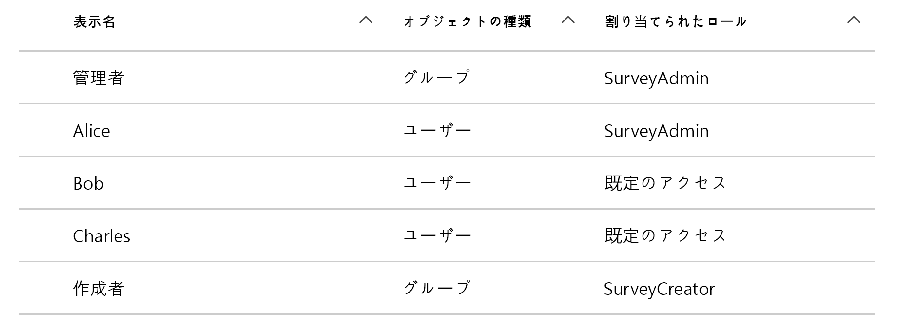
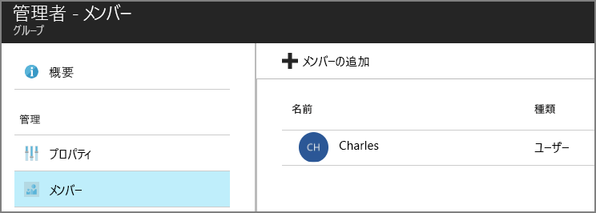

# <a name="application-roles"></a><span data-ttu-id="9190f-103">アプリケーション ロール</span><span class="sxs-lookup"><span data-stu-id="9190f-103">Application roles</span></span>

<span data-ttu-id="9190f-104">[ サンプル コード][sample application]</span><span class="sxs-lookup"><span data-stu-id="9190f-104">[ Sample code][sample application]</span></span>

<span data-ttu-id="9190f-105">アプリケーション ロールは、ユーザーにアクセス許可を割り当てるために使用されます。</span><span class="sxs-lookup"><span data-stu-id="9190f-105">Application roles are used to assign permissions to users.</span></span> <span data-ttu-id="9190f-106">たとえば、[Tailspin Surveys][Tailspin] アプリケーションでは、次のロールが定義されています。</span><span class="sxs-lookup"><span data-stu-id="9190f-106">For example, the [Tailspin Surveys][Tailspin] application defines the following roles:</span></span>

* <span data-ttu-id="9190f-107">管理者。</span><span class="sxs-lookup"><span data-stu-id="9190f-107">Administrator.</span></span> <span data-ttu-id="9190f-108">そのテナントに属するすべてのアンケートに対してすべての CRUD 操作を実行できます。</span><span class="sxs-lookup"><span data-stu-id="9190f-108">Can perform all CRUD operations on any survey that belongs to that tenant.</span></span>
* <span data-ttu-id="9190f-109">作成者。</span><span class="sxs-lookup"><span data-stu-id="9190f-109">Creator.</span></span> <span data-ttu-id="9190f-110">新しいアンケートを作成できます。</span><span class="sxs-lookup"><span data-stu-id="9190f-110">Can create new surveys.</span></span>
* <span data-ttu-id="9190f-111">閲覧者。</span><span class="sxs-lookup"><span data-stu-id="9190f-111">Reader.</span></span> <span data-ttu-id="9190f-112">そのテナントに属するすべてのアンケートを読み取ることができます。</span><span class="sxs-lookup"><span data-stu-id="9190f-112">Can read any surveys that belong to that tenant.</span></span>

<span data-ttu-id="9190f-113">[承認]処理で、最終的にロールはアクセス許可に変換されることがわかります。</span><span class="sxs-lookup"><span data-stu-id="9190f-113">You can see that roles ultimately get translated into permissions, during [authorization].</span></span> <span data-ttu-id="9190f-114">ただ、最初の問題は、どのようにロールを割り当てて管理するかです。</span><span class="sxs-lookup"><span data-stu-id="9190f-114">But the first question is how to assign and manage roles.</span></span> <span data-ttu-id="9190f-115">ここでは、主に 3 つのオプションを指定しました。</span><span class="sxs-lookup"><span data-stu-id="9190f-115">We identified three main options:</span></span>

* [<span data-ttu-id="9190f-116">Azure AD アプリ ロール</span><span class="sxs-lookup"><span data-stu-id="9190f-116">Azure AD App Roles</span></span>](#roles-using-azure-ad-app-roles)
* [<span data-ttu-id="9190f-117">Azure AD セキュリティ グループ</span><span class="sxs-lookup"><span data-stu-id="9190f-117">Azure AD security groups</span></span>](#roles-using-azure-ad-security-groups)
* <span data-ttu-id="9190f-118">[アプリケーション ロール マネージャー](#roles-using-an-application-role-manager)</span><span class="sxs-lookup"><span data-stu-id="9190f-118">[Application role manager](#roles-using-an-application-role-manager).</span></span>

## <a name="roles-using-azure-ad-app-roles"></a><span data-ttu-id="9190f-119">Azure AD アプリ ロールを使用したロール</span><span class="sxs-lookup"><span data-stu-id="9190f-119">Roles using Azure AD App Roles</span></span>
<span data-ttu-id="9190f-120">これは Tailspin Surveys アプリで使用したアプローチです。</span><span class="sxs-lookup"><span data-stu-id="9190f-120">This is the approach that we used in the Tailspin Surveys app.</span></span>

<span data-ttu-id="9190f-121">このアプローチでは、SaaS プロバイダーがアプリケーション マニフェストにアプリケーション ロールを追加して定義します。</span><span class="sxs-lookup"><span data-stu-id="9190f-121">In this approach, The SaaS provider defines the application roles by adding them to the application manifest.</span></span> <span data-ttu-id="9190f-122">顧客がサインアップした後に、顧客の AD ディレクトリ管理者がユーザーをロールに割り当てます。</span><span class="sxs-lookup"><span data-stu-id="9190f-122">After a customer signs up, an admin for the customer's AD directory assigns users to the roles.</span></span> <span data-ttu-id="9190f-123">ユーザーがサインインすると、ユーザーが割り当てたロールが要求として送信されます。</span><span class="sxs-lookup"><span data-stu-id="9190f-123">When a user signs in, the user's assigned roles are sent as claims.</span></span>

> [!NOTE]
> <span data-ttu-id="9190f-124">顧客が Azure AD Premium を利用している場合、管理者はセキュリティ グループをロールに割り当て、グループのメンバーがそのアプリ ロールを継承します。</span><span class="sxs-lookup"><span data-stu-id="9190f-124">If the customer has Azure AD Premium, the admin can assign a security group to a role, and members of the group will inherit the app role.</span></span> <span data-ttu-id="9190f-125">グループ所有者は AD 管理者になる必要はないため、これはロール管理する上で便利な方法です。</span><span class="sxs-lookup"><span data-stu-id="9190f-125">This is a convenient way to manage roles, because the group owner doesn't need to be an AD admin.</span></span>
> 
> 

<span data-ttu-id="9190f-126">このアプローチの長所:</span><span class="sxs-lookup"><span data-stu-id="9190f-126">Advantages of this approach:</span></span>

* <span data-ttu-id="9190f-127">単純なプログラミング モデル。</span><span class="sxs-lookup"><span data-stu-id="9190f-127">Simple programming model.</span></span>
* <span data-ttu-id="9190f-128">ロールはアプリケーションに固有です。</span><span class="sxs-lookup"><span data-stu-id="9190f-128">Roles are specific to the application.</span></span> <span data-ttu-id="9190f-129">1 つのアプリケーションに対するロール要求は、別のアプリケーションに送信されません。</span><span class="sxs-lookup"><span data-stu-id="9190f-129">The role claims for one application are not sent to another application.</span></span>
* <span data-ttu-id="9190f-130">顧客が AD テナントからアプリケーションを削除すると、ロールの割り当ては解除されます。</span><span class="sxs-lookup"><span data-stu-id="9190f-130">If the customer removes the application from their AD tenant, the roles go away.</span></span>
* <span data-ttu-id="9190f-131">アプリケーションは、ユーザーのプロファイルの読み取り以外の追加の Active Directory アクセス許可を必要としません。</span><span class="sxs-lookup"><span data-stu-id="9190f-131">The application doesn't need any extra Active Directory permissions, other than reading the user's profile.</span></span>

<span data-ttu-id="9190f-132">短所:</span><span class="sxs-lookup"><span data-stu-id="9190f-132">Drawbacks:</span></span>

* <span data-ttu-id="9190f-133">Azure AD Premium を利用していない顧客は、セキュリティ グループをロールに割り当てることができません。</span><span class="sxs-lookup"><span data-stu-id="9190f-133">Customers without Azure AD Premium cannot assign security groups to roles.</span></span> <span data-ttu-id="9190f-134">このような顧客の場合、AD 管理者がすべてのユーザーの割り当てを実行する必要があります。</span><span class="sxs-lookup"><span data-stu-id="9190f-134">For these customers, all user assignments must be done by an AD administrator.</span></span>
* <span data-ttu-id="9190f-135">Web アプリとは別にバックエンド Web API がある場合、Web アプリのロール割り当ては Web API に適用されません。</span><span class="sxs-lookup"><span data-stu-id="9190f-135">If you have a backend web API, which is separate from the web app, then role assignments for the web app don't apply to the web API.</span></span> <span data-ttu-id="9190f-136">この点の詳細については、 [バックエンド Web API のセキュリティ保護]に関するページを参照してください。</span><span class="sxs-lookup"><span data-stu-id="9190f-136">For more discussion of this point, see [Securing a backend web API].</span></span>

### <a name="implementation"></a><span data-ttu-id="9190f-137">実装</span><span class="sxs-lookup"><span data-stu-id="9190f-137">Implementation</span></span>
<span data-ttu-id="9190f-138">**ロールを定義します**。</span><span class="sxs-lookup"><span data-stu-id="9190f-138">**Define the roles.**</span></span> <span data-ttu-id="9190f-139">SaaS プロバイダーが、[アプリケーション マニフェスト]でアプリのロールを宣言します。</span><span class="sxs-lookup"><span data-stu-id="9190f-139">The SaaS provider declares the app roles in the [application manifest].</span></span> <span data-ttu-id="9190f-140">たとえば、Surveys アプリのマニフェスト エントリは次のとおりです。</span><span class="sxs-lookup"><span data-stu-id="9190f-140">For example, here is the manifest entry for the Surveys app:</span></span>

```json
"appRoles": [
  {
    "allowedMemberTypes": [
      "User"
    ],
    "description": "Creators can create Surveys",
    "displayName": "SurveyCreator",
    "id": "1b4f816e-5eaf-48b9-8613-7923830595ad",
    "isEnabled": true,
    "value": "SurveyCreator"
  },
  {
    "allowedMemberTypes": [
      "User"
    ],
    "description": "Administrators can manage the Surveys in their tenant",
    "displayName": "SurveyAdmin",
    "id": "c20e145e-5459-4a6c-a074-b942bbd4cfe1",
    "isEnabled": true,
    "value": "SurveyAdmin"
  }
],
```

<span data-ttu-id="9190f-141">`value` プロパティはロール要求に含まれます。</span><span class="sxs-lookup"><span data-stu-id="9190f-141">The `value`  property appears in the role claim.</span></span> <span data-ttu-id="9190f-142">`id` プロパティは、定義されたロールの一意の識別子です。</span><span class="sxs-lookup"><span data-stu-id="9190f-142">The `id` property is the unique identifier for the defined role.</span></span> <span data-ttu-id="9190f-143">常に `id`の新しい GUID 値を生成します。</span><span class="sxs-lookup"><span data-stu-id="9190f-143">Always generate a new GUID value for `id`.</span></span>

<span data-ttu-id="9190f-144">**ユーザーを割り当てます**。</span><span class="sxs-lookup"><span data-stu-id="9190f-144">**Assign users**.</span></span> <span data-ttu-id="9190f-145">新しい顧客がサインアップすると、アプリケーションは顧客の AD テナントに登録されます。</span><span class="sxs-lookup"><span data-stu-id="9190f-145">When a new customer signs up, the application is registered in the customer's AD tenant.</span></span> <span data-ttu-id="9190f-146">この時点で、そのテナントの AD 管理者はユーザーをロールに割り当てることができるようになります。</span><span class="sxs-lookup"><span data-stu-id="9190f-146">At this point, an AD admin for that tenant can assign users to roles.</span></span>

> [!NOTE]
> <span data-ttu-id="9190f-147">前述のように、Azure AD Premium を利用している顧客は、セキュリティ グループをロールに割り当てることもできます。</span><span class="sxs-lookup"><span data-stu-id="9190f-147">As noted earlier, customers with Azure AD Premium can also assign security groups to roles.</span></span>
> 
> 

<span data-ttu-id="9190f-148">Azure Portal の次のスクリーンショットは、Surveys アプリケーションのユーザーとグループを示しています。</span><span class="sxs-lookup"><span data-stu-id="9190f-148">The following screenshot from the Azure portal shows users and groups for the Survey application.</span></span> <span data-ttu-id="9190f-149">管理者と作成者はグループであり、それぞれ SurveyAdmin ロール、SurveyCreator ロールに割り当てられています。</span><span class="sxs-lookup"><span data-stu-id="9190f-149">Admin and Creator are groups, assigned to SurveyAdmin and SurveyCreator roles respectively.</span></span> <span data-ttu-id="9190f-150">Alice は、SurveyAdmin ロールに直接割り当てられたユーザーです。</span><span class="sxs-lookup"><span data-stu-id="9190f-150">Alice is a user who was assigned directly to the SurveyAdmin role.</span></span> <span data-ttu-id="9190f-151">Bob と Charles は、ロールに直接割り当てられていないユーザーです。</span><span class="sxs-lookup"><span data-stu-id="9190f-151">Bob and Charles are users that have not been directly assigned to a role.</span></span>



<span data-ttu-id="9190f-153">次のスクリーンショットに示すように、Charles は管理者グループに属しているので、SurveyAdmin ロールを継承します。</span><span class="sxs-lookup"><span data-stu-id="9190f-153">As shown in the following screenshot, Charles is part of the Admin group, so he inherits the SurveyAdmin role.</span></span> <span data-ttu-id="9190f-154">Bob にはロールがまだ割り当てられていません。</span><span class="sxs-lookup"><span data-stu-id="9190f-154">In the case of Bob, he has not been assigned a role yet.</span></span>




> [!NOTE]
> <span data-ttu-id="9190f-156">別の方法として、アプリケーションで Azure AD Graph API を使用してプログラムでロールを割り当てることもできます。</span><span class="sxs-lookup"><span data-stu-id="9190f-156">An alternative approach is for the application to assign roles programmatically, using the Azure AD Graph API.</span></span> <span data-ttu-id="9190f-157">ただし、この場合、アプリケーションは顧客の AD ディレクトリに対する書き込みアクセス許可を取得する必要があります。</span><span class="sxs-lookup"><span data-stu-id="9190f-157">However, this requires the application to obtain write permissions for the customer's AD directory.</span></span> <span data-ttu-id="9190f-158">これらのアクセス許可を持つアプリケーションは、さまざまな悪影響を及ぼす可能性がありますが、顧客はアプリを信頼しており、ディレクトリが台無しにされるとは思っていません。</span><span class="sxs-lookup"><span data-stu-id="9190f-158">An application with those permissions could do a lot of mischief &mdash; the customer is trusting the app not to mess up their directory.</span></span> <span data-ttu-id="9190f-159">多くの顧客は、このレベルのアクセス権を付与することを嫌う場合があります。</span><span class="sxs-lookup"><span data-stu-id="9190f-159">Many customers might be unwilling to grant this level of access.</span></span>
> 

<span data-ttu-id="9190f-160">**ロール要求を取得します**。</span><span class="sxs-lookup"><span data-stu-id="9190f-160">**Get role claims**.</span></span> <span data-ttu-id="9190f-161">ユーザーがサインインすると、アプリケーションは種類が `http://schemas.microsoft.com/ws/2008/06/identity/claims/role`の要求でユーザーに割り当てられたロールを受け取ります。</span><span class="sxs-lookup"><span data-stu-id="9190f-161">When a user signs in, the application receives the user's assigned role(s) in a claim with type `http://schemas.microsoft.com/ws/2008/06/identity/claims/role`.</span></span>  

<span data-ttu-id="9190f-162">ユーザーには、複数のロールが割り当てられている場合もあれば、ロールが割り当てられていない場合もあります。</span><span class="sxs-lookup"><span data-stu-id="9190f-162">A user can have multiple roles, or no role.</span></span> <span data-ttu-id="9190f-163">承認コードでは、ユーザーがロール要求を 1 つだけ持っていることを前提としないでください。</span><span class="sxs-lookup"><span data-stu-id="9190f-163">In your authorization code, don't assume the user has exactly one role claim.</span></span> <span data-ttu-id="9190f-164">代わりに、特定の要求の値が存在するかどうかを確認するコードを記述します。</span><span class="sxs-lookup"><span data-stu-id="9190f-164">Instead, write code that checks whether a particular claim value is present:</span></span>

```csharp
if (context.User.HasClaim(ClaimTypes.Role, "Admin")) { ... }
```

## <a name="roles-using-azure-ad-security-groups"></a><span data-ttu-id="9190f-165">Azure AD セキュリティ グループを使用したロール</span><span class="sxs-lookup"><span data-stu-id="9190f-165">Roles using Azure AD security groups</span></span>
<span data-ttu-id="9190f-166">このアプローチでは、ロールは AD セキュリティ グループとして表されます。</span><span class="sxs-lookup"><span data-stu-id="9190f-166">In this approach, roles are represented as AD security groups.</span></span> <span data-ttu-id="9190f-167">アプリケーションは、セキュリティ グループ メンバーシップに基づいてアクセス許可をユーザーに割り当てます。</span><span class="sxs-lookup"><span data-stu-id="9190f-167">The application assigns permissions to users based on their security group memberships.</span></span>

<span data-ttu-id="9190f-168">長所:</span><span class="sxs-lookup"><span data-stu-id="9190f-168">Advantages:</span></span>

* <span data-ttu-id="9190f-169">Azure AD Premium を利用していない顧客の場合、このアプローチで、セキュリティ グループを使用してロールの割り当てを管理できます。</span><span class="sxs-lookup"><span data-stu-id="9190f-169">For customers who do not have Azure AD Premium, this approach enables the customer to use security groups to manage role assignments.</span></span>

<span data-ttu-id="9190f-170">短所:</span><span class="sxs-lookup"><span data-stu-id="9190f-170">Disadvantages:</span></span>

* <span data-ttu-id="9190f-171">複雑。</span><span class="sxs-lookup"><span data-stu-id="9190f-171">Complexity.</span></span> <span data-ttu-id="9190f-172">各テナントが異なるグループ要求を送信するため、アプリは、各テナントについて、どのセキュリティ グループがどのアプリケーション ロールに対応するかを追跡する必要があります。</span><span class="sxs-lookup"><span data-stu-id="9190f-172">Because every tenant sends different group claims, the app must keep track of which security groups correspond to which application roles, for each tenant.</span></span>
* <span data-ttu-id="9190f-173">顧客が AD テナントからアプリケーションを削除しても、セキュリティ グループは AD ディレクトリに残ります。</span><span class="sxs-lookup"><span data-stu-id="9190f-173">If the customer removes the application from their AD tenant, the security groups are left in their AD directory.</span></span>

### <a name="implementation"></a><span data-ttu-id="9190f-174">実装</span><span class="sxs-lookup"><span data-stu-id="9190f-174">Implementation</span></span>
<span data-ttu-id="9190f-175">アプリケーション マニフェストで、 `groupMembershipClaims` プロパティを "SecurityGroup" に設定します。</span><span class="sxs-lookup"><span data-stu-id="9190f-175">In the application manifest, set the `groupMembershipClaims` property to "SecurityGroup".</span></span> <span data-ttu-id="9190f-176">この設定は、AAD からグループ メンバーシップ要求を取得するために必要です。</span><span class="sxs-lookup"><span data-stu-id="9190f-176">This is needed to get group membership claims from AAD.</span></span>

```json
{
   // ...
   "groupMembershipClaims": "SecurityGroup",
}
```

<span data-ttu-id="9190f-177">新しい顧客がサインアップすると、アプリケーションに必要なロールのセキュリティ グループを作成するように指示されます。</span><span class="sxs-lookup"><span data-stu-id="9190f-177">When a new customer signs up, the application instructs the customer to create security groups for the roles needed by the application.</span></span> <span data-ttu-id="9190f-178">顧客は、グループのオブジェクト ID をアプリケーションに入力する必要があります。</span><span class="sxs-lookup"><span data-stu-id="9190f-178">The customer then needs to enter the group object IDs into the application.</span></span> <span data-ttu-id="9190f-179">この入力内容は、テナントごとにグループ ID をアプリケーション ロールに対応付けたテーブルに保存されます。</span><span class="sxs-lookup"><span data-stu-id="9190f-179">The application stores these in a table that maps group IDs to application roles, per tenant.</span></span>

> [!NOTE]
> <span data-ttu-id="9190f-180">また、Azure AD Graph API を使用して、アプリケーションで自動的にグループを作成することもできます。</span><span class="sxs-lookup"><span data-stu-id="9190f-180">Alternatively, the application could create the groups programmatically, using the Azure AD Graph API.</span></span>  <span data-ttu-id="9190f-181">自動的に作成する方がエラーが少なくなります。</span><span class="sxs-lookup"><span data-stu-id="9190f-181">This would be less error prone.</span></span> <span data-ttu-id="9190f-182">ただし、顧客の AD ディレクトリの "すべてのグループの読み取りおよび書き込み" アクセス許可をアプリケーションが取得する必要があります。</span><span class="sxs-lookup"><span data-stu-id="9190f-182">However, it requires the application to obtain "read and write all groups" permissions for the customer's AD directory.</span></span> <span data-ttu-id="9190f-183">多くの顧客は、このレベルのアクセス権を付与することを嫌う場合があります。</span><span class="sxs-lookup"><span data-stu-id="9190f-183">Many customers might be unwilling to grant this level of access.</span></span>
> 
> 

<span data-ttu-id="9190f-184">ユーザーがサインインした場合:</span><span class="sxs-lookup"><span data-stu-id="9190f-184">When a user signs in:</span></span>

1. <span data-ttu-id="9190f-185">アプリケーションは要求としてユーザーのグループを受け取ります。</span><span class="sxs-lookup"><span data-stu-id="9190f-185">The application receives the user's groups as claims.</span></span> <span data-ttu-id="9190f-186">各要求の値はグループのオブジェクト ID です。</span><span class="sxs-lookup"><span data-stu-id="9190f-186">The value of each claim is the object ID of a group.</span></span>
2. <span data-ttu-id="9190f-187">Azure AD は、トークンで送信されるグループ数を制限しています。</span><span class="sxs-lookup"><span data-stu-id="9190f-187">Azure AD limits the number of groups sent in the token.</span></span> <span data-ttu-id="9190f-188">グループ数がその制限を超えると、Azure AD から特殊な "過剰" 要求が送信されます。</span><span class="sxs-lookup"><span data-stu-id="9190f-188">If the number of groups exceeds this limit, Azure AD sends a special "overage" claim.</span></span> <span data-ttu-id="9190f-189">この要求が存在する場合、アプリケーションから Azure AD Graph API にクエリして、そのユーザーが属するすべてのグループを取得する必要があります。</span><span class="sxs-lookup"><span data-stu-id="9190f-189">If that claim is present, the application must query the Azure AD Graph API to get all of the groups to which that user belongs.</span></span> <span data-ttu-id="9190f-190">詳細については、「[Authorization in Cloud Applications using AD Groups (AD グループを使用したクラウド アプリケーションでの承認)]」の「Groups claim overage (グループの過剰要求)」をご覧ください。</span><span class="sxs-lookup"><span data-stu-id="9190f-190">For details, see [Authorization in Cloud Applications using AD Groups], under the section titled "Groups claim overage".</span></span>
3. <span data-ttu-id="9190f-191">アプリケーションはアプリケーションのデータベースからオブジェクト ID を検索し、対応するアプリケーション ロールを見つけて、ユーザーに割り当てます。</span><span class="sxs-lookup"><span data-stu-id="9190f-191">The application looks up the object IDs in its own database, to find the corresponding application roles to assign to the user.</span></span>
4. <span data-ttu-id="9190f-192">アプリケーションは、アプリケーション ロールを表すユーザー プリンシパルにカスタム要求値を追加します。</span><span class="sxs-lookup"><span data-stu-id="9190f-192">The application adds a custom claim value to the user principal that expresses the application role.</span></span> <span data-ttu-id="9190f-193">例: `survey_role` = "SurveyAdmin".</span><span class="sxs-lookup"><span data-stu-id="9190f-193">For example: `survey_role` = "SurveyAdmin".</span></span>

<span data-ttu-id="9190f-194">承認ポリシーには、グループ要求ではなく、カスタムロール要求を使用する必要があります。</span><span class="sxs-lookup"><span data-stu-id="9190f-194">Authorization policies should use the custom role claim, not the group claim.</span></span>

## <a name="roles-using-an-application-role-manager"></a><span data-ttu-id="9190f-195">アプリケーション ロール マネージャーを使用したロール</span><span class="sxs-lookup"><span data-stu-id="9190f-195">Roles using an application role manager</span></span>
<span data-ttu-id="9190f-196">この方法では、アプリケーション ロールは Azure AD には保存されません。</span><span class="sxs-lookup"><span data-stu-id="9190f-196">With this approach, application roles are not stored in Azure AD at all.</span></span> <span data-ttu-id="9190f-197">代わりに、アプリケーションでは ASP.NET Identity の **RoleManager** クラスなどを使用して、各ユーザーのロールの割り当てを独自の DB に保存します。</span><span class="sxs-lookup"><span data-stu-id="9190f-197">Instead, the application stores the role assignments for each user in its own DB &mdash; for example, using the **RoleManager** class in ASP.NET Identity.</span></span>

<span data-ttu-id="9190f-198">長所:</span><span class="sxs-lookup"><span data-stu-id="9190f-198">Advantages:</span></span>

* <span data-ttu-id="9190f-199">アプリはロールとユーザー割り当てを完全に制御できます。</span><span class="sxs-lookup"><span data-stu-id="9190f-199">The app has full control over the roles and user assignments.</span></span>

<span data-ttu-id="9190f-200">短所:</span><span class="sxs-lookup"><span data-stu-id="9190f-200">Drawbacks:</span></span>

* <span data-ttu-id="9190f-201">さらに複雑で、保守が困難になります。</span><span class="sxs-lookup"><span data-stu-id="9190f-201">More complex, harder to maintain.</span></span>
* <span data-ttu-id="9190f-202">ロール割り当ての管理に AD セキュリティ グループを使用できません。</span><span class="sxs-lookup"><span data-stu-id="9190f-202">Cannot use AD security groups to manage role assignments.</span></span>
* <span data-ttu-id="9190f-203">アプリケーション データベースにユーザー情報が保存され、ユーザーが追加または削除されても、テナントの AD ディレクトリと同期されない可能性があります。</span><span class="sxs-lookup"><span data-stu-id="9190f-203">Stores user information in the application database, where it can get out of sync with the tenant's AD directory, as users are added or removed.</span></span>   


<span data-ttu-id="9190f-204">[**次へ**][承認]</span><span class="sxs-lookup"><span data-stu-id="9190f-204">[**Next**][authorization]</span></span>

<!-- Links -->
[Tailspin]: tailspin.md

[承認]: authorize.md
[authorization]: authorize.md
[バックエンド Web API のセキュリティ保護]: web-api.md
[Securing a backend web API]: web-api.md
[アプリケーション マニフェスト]: /azure/active-directory/active-directory-application-manifest/
[application manifest]: /azure/active-directory/active-directory-application-manifest/
[sample application]: https://github.com/mspnp/multitenant-saas-guidance
