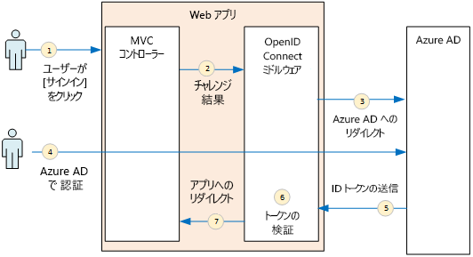
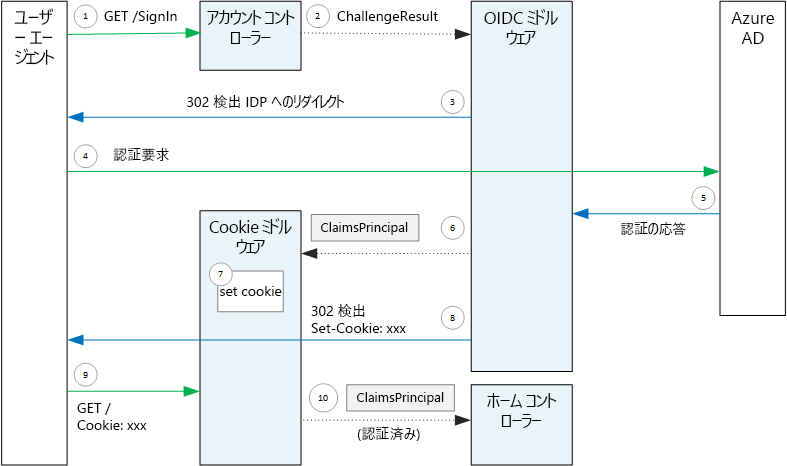

# <a name="authenticate-using-azure-ad-and-openid-connect"></a><span data-ttu-id="9af16-103">Azure AD および OpenID Connect を使用して認証する</span><span class="sxs-lookup"><span data-stu-id="9af16-103">Authenticate using Azure AD and OpenID Connect</span></span>

<span data-ttu-id="9af16-104">[ サンプル コード][sample application]</span><span class="sxs-lookup"><span data-stu-id="9af16-104">[ Sample code][sample application]</span></span>

<span data-ttu-id="9af16-105">Surveys アプリケーションでは、OpenID Connect (OIDC) プロトコルを使用して、Azure Active Directory (Azure AD) でユーザーを認証します。</span><span class="sxs-lookup"><span data-stu-id="9af16-105">The Surveys application uses the OpenID Connect (OIDC) protocol to authenticate users with Azure Active Directory (Azure AD).</span></span> <span data-ttu-id="9af16-106">Surveys アプリケーションでは、OIDC のビルトイン ミドルウェアがある ASP.NET Core を使用します。</span><span class="sxs-lookup"><span data-stu-id="9af16-106">The Surveys application uses ASP.NET Core, which has built-in middleware for OIDC.</span></span> <span data-ttu-id="9af16-107">次の図では、ユーザーがサインインしたときに行われる処理の概要を示します。</span><span class="sxs-lookup"><span data-stu-id="9af16-107">The following diagram shows what happens when the user signs in, at a high level.</span></span>



1. <span data-ttu-id="9af16-109">ユーザーがアプリの "サインイン" ボタンをクリックします。</span><span class="sxs-lookup"><span data-stu-id="9af16-109">The user clicks the "sign in" button in the app.</span></span> <span data-ttu-id="9af16-110">このアクションは、MVC コントローラーによって処理されます。</span><span class="sxs-lookup"><span data-stu-id="9af16-110">This action is handled by an MVC controller.</span></span>
2. <span data-ttu-id="9af16-111">MVC コントローラーが **ChallengeResult** アクションを返します。</span><span class="sxs-lookup"><span data-stu-id="9af16-111">The MVC controller returns a **ChallengeResult** action.</span></span>
3. <span data-ttu-id="9af16-112">ミドルウェアは **ChallengeResult** をインターセプトし、Azure AD サインイン ページにユーザーをリダイレクトする 302 応答を作成します。</span><span class="sxs-lookup"><span data-stu-id="9af16-112">The middleware intercepts the **ChallengeResult** and creates a 302 response, which redirects the user to the Azure AD sign-in page.</span></span>
4. <span data-ttu-id="9af16-113">ユーザーが Azure AD で認証を行います。</span><span class="sxs-lookup"><span data-stu-id="9af16-113">The user authenticates with Azure AD.</span></span>
5. <span data-ttu-id="9af16-114">Azure AD が ID トークンをアプリケーションに送信します。</span><span class="sxs-lookup"><span data-stu-id="9af16-114">Azure AD sends an ID token to the application.</span></span>
6. <span data-ttu-id="9af16-115">ミドルウェアが ID トークンを検証します。</span><span class="sxs-lookup"><span data-stu-id="9af16-115">The middleware validates the ID token.</span></span> <span data-ttu-id="9af16-116">この時点で、ユーザーはアプリケーションの内部で認証されます。</span><span class="sxs-lookup"><span data-stu-id="9af16-116">At this point, the user is now authenticated inside the application.</span></span>
7. <span data-ttu-id="9af16-117">ミドルウェアがユーザーをアプリケーションにリダイレクトします。</span><span class="sxs-lookup"><span data-stu-id="9af16-117">The middleware redirects the user back to application.</span></span>

## <a name="register-the-app-with-azure-ad"></a><span data-ttu-id="9af16-118">アプリの Azure AD への登録</span><span class="sxs-lookup"><span data-stu-id="9af16-118">Register the app with Azure AD</span></span>
<span data-ttu-id="9af16-119">OpenID Connect を有効にするために、SaaS プロバイダーは、アプリケーションをその Azure AD テナント内で登録します。</span><span class="sxs-lookup"><span data-stu-id="9af16-119">To enable OpenID Connect, the SaaS provider registers the application inside their own Azure AD tenant.</span></span>

<span data-ttu-id="9af16-120">アプリケーションを登録するには、「[Azure Active Directory とアプリケーションの統合](/azure/active-directory/active-directory-integrating-applications/)」の「[アプリケーションの追加](/azure/active-directory/active-directory-integrating-applications/#adding-an-application)」の手順に従います。</span><span class="sxs-lookup"><span data-stu-id="9af16-120">To register the application, follow the steps in [Integrating Applications with Azure Active Directory](/azure/active-directory/active-directory-integrating-applications/), in the section [Adding an Application](/azure/active-directory/active-directory-integrating-applications/#adding-an-application).</span></span>

<span data-ttu-id="9af16-121">Surveys アプリケーションに固有の手順については、「[Run the Surveys application (Surveys アプリケーションの実行)](./run-the-app.md)」をご覧ください。</span><span class="sxs-lookup"><span data-stu-id="9af16-121">See [Run the Surveys application](./run-the-app.md) for the specific steps for the Surveys application.</span></span> <span data-ttu-id="9af16-122">以下の点に注意してください。</span><span class="sxs-lookup"><span data-stu-id="9af16-122">Note the following:</span></span>

- <span data-ttu-id="9af16-123">マルチ テナント アプリケーションの場合は、マルチ テナント オプションを明示的に構成する必要があります。</span><span class="sxs-lookup"><span data-stu-id="9af16-123">For a multitenant application, you must configure the multi-tenanted option explicitly.</span></span> <span data-ttu-id="9af16-124">これにより、他の組織がアプリケーションにアクセスできるようになります。</span><span class="sxs-lookup"><span data-stu-id="9af16-124">This enables other organizations to to access the application.</span></span>

- <span data-ttu-id="9af16-125">応答 URL は、Azure AD が OAuth 2.0 応答を送信する URL です。</span><span class="sxs-lookup"><span data-stu-id="9af16-125">The reply URL is the URL where Azure AD will send OAuth 2.0 responses.</span></span> <span data-ttu-id="9af16-126">ASP.NET Core を使用する場合、認証ミドルウェアで構成するパスとこの URL が一致する必要があります (次のセクションをご覧ください)。</span><span class="sxs-lookup"><span data-stu-id="9af16-126">When using the ASP.NET Core, this needs to match the path that you configure in the authentication middleware (see next section),</span></span> 

## <a name="configure-the-auth-middleware"></a><span data-ttu-id="9af16-127">認証ミドルウェアの構成</span><span class="sxs-lookup"><span data-stu-id="9af16-127">Configure the auth middleware</span></span>
<span data-ttu-id="9af16-128">このセクションでは、OpenID Connect を使用したマルチテナント認証用に ASP.NET Core で認証ミドルウェアを構成する方法について説明します。</span><span class="sxs-lookup"><span data-stu-id="9af16-128">This section describes how to configure the authentication middleware in ASP.NET Core for multitenant authentication with OpenID Connect.</span></span>

<span data-ttu-id="9af16-129">[スタートアップ クラス](/aspnet/core/fundamentals/startup)で、OpenID Connect ミドルウェアを追加します。</span><span class="sxs-lookup"><span data-stu-id="9af16-129">In your [startup class](/aspnet/core/fundamentals/startup), add the OpenID Connect middleware:</span></span>

```csharp
app.UseOpenIdConnectAuthentication(new OpenIdConnectOptions {
    ClientId = configOptions.AzureAd.ClientId,
    ClientSecret = configOptions.AzureAd.ClientSecret, // for code flow
    Authority = Constants.AuthEndpointPrefix,
    ResponseType = OpenIdConnectResponseType.CodeIdToken,
    PostLogoutRedirectUri = configOptions.AzureAd.PostLogoutRedirectUri,
    SignInScheme = CookieAuthenticationDefaults.AuthenticationScheme,
    TokenValidationParameters = new TokenValidationParameters { ValidateIssuer = false },
    Events = new SurveyAuthenticationEvents(configOptions.AzureAd, loggerFactory),
});
```

<span data-ttu-id="9af16-130">設定の一部はランタイムの構成オプションから取られていることに注意してください。</span><span class="sxs-lookup"><span data-stu-id="9af16-130">Notice that some of the settings are taken from runtime configuration options.</span></span> <span data-ttu-id="9af16-131">ミドルウェア オプションの意味を次に示します。</span><span class="sxs-lookup"><span data-stu-id="9af16-131">Here's what the middleware options mean:</span></span>

* <span data-ttu-id="9af16-132">**ClientId**です。</span><span class="sxs-lookup"><span data-stu-id="9af16-132">**ClientId**.</span></span> <span data-ttu-id="9af16-133">Azure AD でアプリケーションを登録したときに取得した、アプリケーションのクライアント ID。</span><span class="sxs-lookup"><span data-stu-id="9af16-133">The application's client ID, which you got when you registered the application in Azure AD.</span></span>
* <span data-ttu-id="9af16-134">**Authority**。</span><span class="sxs-lookup"><span data-stu-id="9af16-134">**Authority**.</span></span> <span data-ttu-id="9af16-135">マルチテナント アプリケーションの場合、これを `https://login.microsoftonline.com/common/` に設定します。</span><span class="sxs-lookup"><span data-stu-id="9af16-135">For a multitenant application, set this to `https://login.microsoftonline.com/common/`.</span></span> <span data-ttu-id="9af16-136">これは、任意の Azure ADテナント からのユーザーがサインインできるようにする、Azure AD の共通 のエンドポイントの URL です。</span><span class="sxs-lookup"><span data-stu-id="9af16-136">This is the URL for the Azure AD common endpoint, which enables users from any Azure AD tenant to sign in.</span></span> <span data-ttu-id="9af16-137">共通のエンドポイントの詳細については、[このブログ記事](http://www.cloudidentity.com/blog/2014/08/26/the-common-endpoint-walks-like-a-tenant-talks-like-a-tenant-but-is-not-a-tenant/)をご覧ください。</span><span class="sxs-lookup"><span data-stu-id="9af16-137">For more information about the common endpoint, see [this blog post](http://www.cloudidentity.com/blog/2014/08/26/the-common-endpoint-walks-like-a-tenant-talks-like-a-tenant-but-is-not-a-tenant/).</span></span>
* <span data-ttu-id="9af16-138">**TokenValidationParameters** で、**ValidateIssuer** を false に設定します。</span><span class="sxs-lookup"><span data-stu-id="9af16-138">In **TokenValidationParameters**, set **ValidateIssuer** to false.</span></span> <span data-ttu-id="9af16-139">つまり、ID トークンにおける発行者の値の検証をアプリが担当します。</span><span class="sxs-lookup"><span data-stu-id="9af16-139">That means the app will be responsible for validating the issuer value in the ID token.</span></span> <span data-ttu-id="9af16-140">(トークン自体はミドルウェアが引き続き検証します。)発行者の検証に関する詳細については、「[Issuer validation (発行者の検証)](claims.md#issuer-validation)」をご覧ください。</span><span class="sxs-lookup"><span data-stu-id="9af16-140">(The middleware still validates the token itself.) For more information about validating the issuer, see [Issuer validation](claims.md#issuer-validation).</span></span>
* <span data-ttu-id="9af16-141">**PostLogoutRedirectUri**。</span><span class="sxs-lookup"><span data-stu-id="9af16-141">**PostLogoutRedirectUri**.</span></span> <span data-ttu-id="9af16-142">サインアウトしたユーザーをリダイレクトする URL を指定します。これは、匿名の要求を許可するページ (通常はホーム ページ) です。</span><span class="sxs-lookup"><span data-stu-id="9af16-142">Specify a URL to redirect users after the sign out. This should be a page that allows anonymous requests &mdash; typically the home page.</span></span>
* <span data-ttu-id="9af16-143">**SignInScheme**。</span><span class="sxs-lookup"><span data-stu-id="9af16-143">**SignInScheme**.</span></span> <span data-ttu-id="9af16-144">`CookieAuthenticationDefaults.AuthenticationScheme`に設定します。</span><span class="sxs-lookup"><span data-stu-id="9af16-144">Set this to `CookieAuthenticationDefaults.AuthenticationScheme`.</span></span> <span data-ttu-id="9af16-145">この設定は、ユーザーが承認された後、ユーザー要求がローカルの Cookie に保存されることを意味します。</span><span class="sxs-lookup"><span data-stu-id="9af16-145">This setting means that after the user is authenticated, the user claims are stored locally in a cookie.</span></span> <span data-ttu-id="9af16-146">この Cookie により、ブラウザー セッションでユーザーがログインした状態が保たれます。</span><span class="sxs-lookup"><span data-stu-id="9af16-146">This cookie is how the user stays logged in during the browser session.</span></span>
* <span data-ttu-id="9af16-147">**Events**。</span><span class="sxs-lookup"><span data-stu-id="9af16-147">**Events.**</span></span> <span data-ttu-id="9af16-148">イベントのコールバックです。「[Authentication events (認証イベント)](#authentication-events)」をご覧ください。</span><span class="sxs-lookup"><span data-stu-id="9af16-148">Event callbacks; see [Authentication events](#authentication-events).</span></span>

<span data-ttu-id="9af16-149">さらに、Cookie 認証ミドルウェアをパイプラインに追加します。</span><span class="sxs-lookup"><span data-stu-id="9af16-149">Also add the Cookie Authentication middleware to the pipeline.</span></span> <span data-ttu-id="9af16-150">このミドルウェアは、ユーザー要求を Cookie に書き込んだ後、以降のページ読み込み中に Cookie を読み取ります。</span><span class="sxs-lookup"><span data-stu-id="9af16-150">This middleware is responsible for writing the user claims to a cookie, and then reading the cookie during subsequent page loads.</span></span>

```csharp
app.UseCookieAuthentication(new CookieAuthenticationOptions {
    AutomaticAuthenticate = true,
    AutomaticChallenge = true,
    AccessDeniedPath = "/Home/Forbidden",
    CookieSecure = CookieSecurePolicy.Always,

    // The default setting for cookie expiration is 14 days. SlidingExpiration is set to true by default
    ExpireTimeSpan = TimeSpan.FromHours(1),
    SlidingExpiration = true
});
```

## <a name="initiate-the-authentication-flow"></a><span data-ttu-id="9af16-151">認証フローの開始</span><span class="sxs-lookup"><span data-stu-id="9af16-151">Initiate the authentication flow</span></span>
<span data-ttu-id="9af16-152">ASP.NET MVC で認証フローを開始するには、次のように、コントローラーから **ChallengeResult** を返します。</span><span class="sxs-lookup"><span data-stu-id="9af16-152">To start the authentication flow in ASP.NET MVC, return a **ChallengeResult** from the contoller:</span></span>

```csharp
[AllowAnonymous]
public IActionResult SignIn()
{
    return new ChallengeResult(
        OpenIdConnectDefaults.AuthenticationScheme,
        new AuthenticationProperties
        {
            IsPersistent = true,
            RedirectUri = Url.Action("SignInCallback", "Account")
        });
}
```

<span data-ttu-id="9af16-153">これにより、ミドルウェアは、認証エンドポイントにリダイレクトする 302 (Found) 応答を返します。</span><span class="sxs-lookup"><span data-stu-id="9af16-153">This causes the middleware to return a 302 (Found) response that redirects to the authentication endpoint.</span></span>

## <a name="user-login-sessions"></a><span data-ttu-id="9af16-154">ユーザー ログイン セッション</span><span class="sxs-lookup"><span data-stu-id="9af16-154">User login sessions</span></span>
<span data-ttu-id="9af16-155">既に説明したように、ユーザーが初めてサインインするときに、Cookie 認証ミドルウェアがユーザー要求を Cookie に書き込みます。</span><span class="sxs-lookup"><span data-stu-id="9af16-155">As mentioned, when the user first signs in, the Cookie Authentication middleware writes the user claims to a cookie.</span></span> <span data-ttu-id="9af16-156">それ以降、HTTP 要求は、Cookie を読み取ることによって認証されます。</span><span class="sxs-lookup"><span data-stu-id="9af16-156">After that, HTTP requests are authenticated by reading the cookie.</span></span>

<span data-ttu-id="9af16-157">既定では、Cookie ミドルウェアは[セッション Cookie][session-cookie] を書き込みます。セッション Cookie は、ユーザーがブラウザーを閉じると一度削除されます。</span><span class="sxs-lookup"><span data-stu-id="9af16-157">By default, the cookie middleware writes a [session cookie][session-cookie], which gets deleted once the user closes the browser.</span></span> <span data-ttu-id="9af16-158">ユーザーは、次にそのサイトにアクセスする際、もう一度サインインする必要があります。</span><span class="sxs-lookup"><span data-stu-id="9af16-158">The next time the user next visits the site, they will have to sign in again.</span></span> <span data-ttu-id="9af16-159">ただし、**ChallengeResult** で **IsPersistent** を true に設定すると、ミドルウェアは永続的な Cookie を書き込み、ユーザーはブラウザーを閉じた後もログインした状態のままとなります。</span><span class="sxs-lookup"><span data-stu-id="9af16-159">However, if you set **IsPersistent** to true in the **ChallengeResult**, the middleware writes a persistent cookie, so the user stays logged in after closing the browser.</span></span> <span data-ttu-id="9af16-160">Cookie の有効期限を構成できます。[Cookie のオプションの制御][cookie-options]に関する記事をご覧ください。</span><span class="sxs-lookup"><span data-stu-id="9af16-160">You can configure the cookie expiration; see [Controlling cookie options][cookie-options].</span></span> <span data-ttu-id="9af16-161">永続的な Cookie はユーザーにとってより便利ですが、毎回ユーザーにサインインを求める必要がある一部のアプリケーション (銀行取引アプリケーションなど) には適切でない場合があります。</span><span class="sxs-lookup"><span data-stu-id="9af16-161">Persistent cookies are more convenient for the user, but may be inappropriate for some applications (say, a banking application) where you want the user to sign in every time.</span></span>

## <a name="about-the-openid-connect-middleware"></a><span data-ttu-id="9af16-162">OpenID Connect ミドルウェアについて</span><span class="sxs-lookup"><span data-stu-id="9af16-162">About the OpenID Connect middleware</span></span>
<span data-ttu-id="9af16-163">ASP.NET の OpenID Connect ミドルウェアは、プロトコルの詳細のほとんどが公開されていません。</span><span class="sxs-lookup"><span data-stu-id="9af16-163">The OpenID Connect middleware in ASP.NET hides most of the protocol details.</span></span> <span data-ttu-id="9af16-164">このセクションでは、プロトコル フローを理解するのに役立つ可能性のある、実装に関するいくつかの注意事項について説明します。</span><span class="sxs-lookup"><span data-stu-id="9af16-164">This section contains some notes about the implementation, that may be useful for understanding the protocol flow.</span></span>

<span data-ttu-id="9af16-165">最初に、ASP.NET の観点から認証フローを見ていきましょう (アプリと Azure AD 間の OIDC プロトコル フローの詳細は無視します)。</span><span class="sxs-lookup"><span data-stu-id="9af16-165">First, let's examine the authentication flow in terms of ASP.NET (ignoring the details of the OIDC protocol flow between the app and Azure AD).</span></span> <span data-ttu-id="9af16-166">そのプロセスを次の図に示します。</span><span class="sxs-lookup"><span data-stu-id="9af16-166">The following diagram shows the process.</span></span>



<span data-ttu-id="9af16-168">この図では、2 つの MVC コントローラーがあります。</span><span class="sxs-lookup"><span data-stu-id="9af16-168">In this diagram, there are two MVC controllers.</span></span> <span data-ttu-id="9af16-169">Account コントローラーはサインイン要求を処理し、Home コントローラーはホーム ページを提供します。</span><span class="sxs-lookup"><span data-stu-id="9af16-169">The Account controller handles sign-in requests, and the Home controller serves up the home page.</span></span>

<span data-ttu-id="9af16-170">次に、認証プロセスを示します。</span><span class="sxs-lookup"><span data-stu-id="9af16-170">Here is the authentication process:</span></span>

1. <span data-ttu-id="9af16-171">ユーザーが [サインイン] ボタンをクリックすると、ブラウザーが GET 要求を送信します。</span><span class="sxs-lookup"><span data-stu-id="9af16-171">The user clicks the "Sign in" button, and the browser sends a GET request.</span></span> <span data-ttu-id="9af16-172">(例: `GET /Account/SignIn/`)。</span><span class="sxs-lookup"><span data-stu-id="9af16-172">For example: `GET /Account/SignIn/`.</span></span>
2. <span data-ttu-id="9af16-173">Account コントローラーが `ChallengeResult`を返します。</span><span class="sxs-lookup"><span data-stu-id="9af16-173">The account controller returns a `ChallengeResult`.</span></span>
3. <span data-ttu-id="9af16-174">OIDC ミドルウェアが、Azure AD にリダイレクトする HTTP 302 応答を返します。</span><span class="sxs-lookup"><span data-stu-id="9af16-174">The OIDC middleware returns an HTTP 302 response, redirecting to Azure AD.</span></span>
4. <span data-ttu-id="9af16-175">ブラウザーが Azure AD に認証要求を送信します。</span><span class="sxs-lookup"><span data-stu-id="9af16-175">The browser sends the authentication request to Azure AD</span></span>
5. <span data-ttu-id="9af16-176">ユーザーが Azure AD にサインインすると、Azure AD から認証応答が返されます。</span><span class="sxs-lookup"><span data-stu-id="9af16-176">The user signs in to Azure AD, and Azure AD sends back an authentication response.</span></span>
6. <span data-ttu-id="9af16-177">OIDC ミドルウェアが要求プリンシパルを作成して Cookie 認証ミドルウェアに渡します。</span><span class="sxs-lookup"><span data-stu-id="9af16-177">The OIDC middleware creates a claims principal and passes it to the Cookie Authentication middleware.</span></span>
7. <span data-ttu-id="9af16-178">Cookie ミドルウェアが要求プリンシパルをシリアル化し、Cookie を設定します。</span><span class="sxs-lookup"><span data-stu-id="9af16-178">The cookie middleware serializes the claims principal and sets a cookie.</span></span>
8. <span data-ttu-id="9af16-179">OIDC ミドルウェアにより、アプリケーションのコールバック URL にリダイレクトされます。</span><span class="sxs-lookup"><span data-stu-id="9af16-179">The OIDC middleware redirects to the application's callback URL.</span></span>
9. <span data-ttu-id="9af16-180">ブラウザーがそのリダイレクトに従い、要求で Cookie を送信します。</span><span class="sxs-lookup"><span data-stu-id="9af16-180">The browser follows the redirect, sending the cookie in the request.</span></span>
10. <span data-ttu-id="9af16-181">Cookie ミドルウェアが Cookie を要求プリンシパルに逆シリアル化し、要求プリンシパルと同じになるように `HttpContext.User` を設定します。</span><span class="sxs-lookup"><span data-stu-id="9af16-181">The cookie middleware deserializes the cookie to a claims principal and sets `HttpContext.User` equal to the claims principal.</span></span> <span data-ttu-id="9af16-182">要求は MVC コントローラーにルーティングされます。</span><span class="sxs-lookup"><span data-stu-id="9af16-182">The request is routed to an MVC controller.</span></span>

### <a name="authentication-ticket"></a><span data-ttu-id="9af16-183">認証チケット</span><span class="sxs-lookup"><span data-stu-id="9af16-183">Authentication ticket</span></span>
<span data-ttu-id="9af16-184">認証が成功すると、OIDC ミドルウェアは、ユーザーの要求を保持する要求プリンシパルが含まれている認証チケットを作成します。</span><span class="sxs-lookup"><span data-stu-id="9af16-184">If authentication succeeds, the OIDC middleware creates an authentication ticket, which contains a claims principal that holds the user's claims.</span></span> <span data-ttu-id="9af16-185">**AuthenticationValidated** または **TicketReceived** イベント内のチケットにアクセスできます。</span><span class="sxs-lookup"><span data-stu-id="9af16-185">You can access the ticket inside the **AuthenticationValidated** or **TicketReceived** event.</span></span>

> [!NOTE]
> <span data-ttu-id="9af16-186">認証フロー全体が完了するまで、`HttpContext.User` は認証されたユーザー*ではなく*、匿名のプリンシパルを引き続き保持します。</span><span class="sxs-lookup"><span data-stu-id="9af16-186">Until the entire authentication flow is completed, `HttpContext.User` still holds an anonymous principal,  *not* the authenticated user.</span></span> <span data-ttu-id="9af16-187">匿名プリンシパルには、空の要求コレクションがあります。</span><span class="sxs-lookup"><span data-stu-id="9af16-187">The anonymous principal has an empty claims collection.</span></span> <span data-ttu-id="9af16-188">認証が完了し、アプリがリダイレクトされた後、Cookie ミドルウェアは、認証 Cookie を逆シリアル化し、 `HttpContext.User` を、認証されたユーザーを表す要求プリンシパルに設定します。</span><span class="sxs-lookup"><span data-stu-id="9af16-188">After authentication completes and the app redirects, the cookie middleware deserializes the authentication cookie and sets `HttpContext.User` to a claims principal that represents the authenticated user.</span></span>
> 
> 

### <a name="authentication-events"></a><span data-ttu-id="9af16-189">認証イベント</span><span class="sxs-lookup"><span data-stu-id="9af16-189">Authentication events</span></span>
<span data-ttu-id="9af16-190">認証プロセス中、OpenID Connect ミドルウェアは、一連のイベントを発生させます。</span><span class="sxs-lookup"><span data-stu-id="9af16-190">During the authentication process, the OpenID Connect middleware raises a series of events:</span></span>

* <span data-ttu-id="9af16-191">**RedirectToIdentityProvider**。</span><span class="sxs-lookup"><span data-stu-id="9af16-191">**RedirectToIdentityProvider**.</span></span> <span data-ttu-id="9af16-192">ミドルウェアが認証エンドポイントにリダイレクトされる直前に呼び出されます。</span><span class="sxs-lookup"><span data-stu-id="9af16-192">Called right before the middleware redirects to the authentication endpoint.</span></span> <span data-ttu-id="9af16-193">このイベントを使用すると、(たとえば、要求パラメーターを追加するために) リダイレクト URL を変更できます。</span><span class="sxs-lookup"><span data-stu-id="9af16-193">You can use this event to modify the redirect URL; for example, to add request parameters.</span></span> <span data-ttu-id="9af16-194">例については、「[Adding the admin consent prompt (管理者の同意プロンプトを追加する)](signup.md#adding-the-admin-consent-prompt)」をご覧ください。</span><span class="sxs-lookup"><span data-stu-id="9af16-194">See [Adding the admin consent prompt](signup.md#adding-the-admin-consent-prompt) for an example.</span></span>
* <span data-ttu-id="9af16-195">**AuthorizationCodeReceived**。</span><span class="sxs-lookup"><span data-stu-id="9af16-195">**AuthorizationCodeReceived**.</span></span> <span data-ttu-id="9af16-196">承認コードで呼び出されます。</span><span class="sxs-lookup"><span data-stu-id="9af16-196">Called with the authorization code.</span></span>
* <span data-ttu-id="9af16-197">**TokenResponseReceived**。</span><span class="sxs-lookup"><span data-stu-id="9af16-197">**TokenResponseReceived**.</span></span> <span data-ttu-id="9af16-198">ミドルウェアが IDP からアクセス トークンを取得した後、アクセス トークンが検証される前に呼び出されます。</span><span class="sxs-lookup"><span data-stu-id="9af16-198">Called after the middleware gets an access token from the IDP, but before it is validated.</span></span> <span data-ttu-id="9af16-199">承認コード フローにのみ当てはまります。</span><span class="sxs-lookup"><span data-stu-id="9af16-199">Applies only to authorization code flow.</span></span>
* <span data-ttu-id="9af16-200">**TokenValidated**。</span><span class="sxs-lookup"><span data-stu-id="9af16-200">**TokenValidated**.</span></span> <span data-ttu-id="9af16-201">ミドルウェアが ID トークンを検証した後に呼び出されます。</span><span class="sxs-lookup"><span data-stu-id="9af16-201">Called after the middleware validates the ID token.</span></span> <span data-ttu-id="9af16-202">この時点で、アプリケーションには、ユーザーに関する一連の検証済みの要求があります。</span><span class="sxs-lookup"><span data-stu-id="9af16-202">At this point, the application has a set of validated claims about the user.</span></span> <span data-ttu-id="9af16-203">このイベントを使用すると、要求に対する追加の検証を実行したり、要求を変換したりできます。</span><span class="sxs-lookup"><span data-stu-id="9af16-203">You can use this event to perform additional validation on the claims, or to transform claims.</span></span> <span data-ttu-id="9af16-204">[要求の操作](claims.md)に関する記事をご覧ください。</span><span class="sxs-lookup"><span data-stu-id="9af16-204">See [Working with claims](claims.md).</span></span>
* <span data-ttu-id="9af16-205">**UserInformationReceived**。</span><span class="sxs-lookup"><span data-stu-id="9af16-205">**UserInformationReceived**.</span></span> <span data-ttu-id="9af16-206">ミドルウェアがユーザー情報エンドポイントからユーザー プロファイルを取得する場合に呼び出されます。</span><span class="sxs-lookup"><span data-stu-id="9af16-206">Called if the middleware gets the user profile from the user info endpoint.</span></span> <span data-ttu-id="9af16-207">承認コード フローのみ、およびミドルウェア オプションが `GetClaimsFromUserInfoEndpoint = true` の場合にのみ当てはまります。</span><span class="sxs-lookup"><span data-stu-id="9af16-207">Applies only to authorization code flow, and only when `GetClaimsFromUserInfoEndpoint = true` in the middleware options.</span></span>
* <span data-ttu-id="9af16-208">**TicketReceived**。</span><span class="sxs-lookup"><span data-stu-id="9af16-208">**TicketReceived**.</span></span> <span data-ttu-id="9af16-209">認証が完了したときに呼び出されます。</span><span class="sxs-lookup"><span data-stu-id="9af16-209">Called when authentication is completed.</span></span> <span data-ttu-id="9af16-210">これは、認証が成功したことを想定した最後のイベントです。</span><span class="sxs-lookup"><span data-stu-id="9af16-210">This is the last event, assuming that authentication succeeds.</span></span> <span data-ttu-id="9af16-211">このイベントが処理された後、ユーザーがアプリケーションにサインインします。</span><span class="sxs-lookup"><span data-stu-id="9af16-211">After this event is handled, the user is signed into the app.</span></span>
* <span data-ttu-id="9af16-212">**AuthenticationFailed**。</span><span class="sxs-lookup"><span data-stu-id="9af16-212">**AuthenticationFailed**.</span></span> <span data-ttu-id="9af16-213">認証が失敗した場合に呼び出されます。</span><span class="sxs-lookup"><span data-stu-id="9af16-213">Called if authentication fails.</span></span> <span data-ttu-id="9af16-214">このイベントを使用して、エラー ページへのリダイレクトなどによって認証エラーを処理します。</span><span class="sxs-lookup"><span data-stu-id="9af16-214">Use this event to handle authentication failures &mdash; for example, by redirecting to an error page.</span></span>

<span data-ttu-id="9af16-215">これらのイベントのコールバックを指定するには、ミドルウェアで **Events** オプションを設定します。</span><span class="sxs-lookup"><span data-stu-id="9af16-215">To provide callbacks for these events, set the **Events** option on the middleware.</span></span> <span data-ttu-id="9af16-216">イベント ハンドラーを宣言するには、ラムダを使用したインライン宣言と **OpenIdConnectEvents**から派生したクラスでの宣言という 2 つの方法があります。</span><span class="sxs-lookup"><span data-stu-id="9af16-216">There are two different ways to declare the event handlers: Inline with lambdas, or in a class that derives from **OpenIdConnectEvents**.</span></span> <span data-ttu-id="9af16-217">イベントのコールバックに大量のロジックがあり、これらによってスタートアップ クラスが煩雑になるのを避ける場合は、2 番目のアプローチをお勧めします。</span><span class="sxs-lookup"><span data-stu-id="9af16-217">The second approach is recommended if your event callbacks have any substantial logic, so they don't clutter your startup class.</span></span> <span data-ttu-id="9af16-218">リファレンス実装では、このアプローチが使用されます。</span><span class="sxs-lookup"><span data-stu-id="9af16-218">Our reference implementation uses this approach.</span></span>

### <a name="openid-connect-endpoints"></a><span data-ttu-id="9af16-219">OpenID Connect のエンドポイント</span><span class="sxs-lookup"><span data-stu-id="9af16-219">OpenID connect endpoints</span></span>
<span data-ttu-id="9af16-220">Azure AD では [OpenID Connect 検出](https://openid.net/specs/openid-connect-discovery-1_0.html)がサポートされます。[既知のエンドポイント](https://openid.net/specs/openid-connect-discovery-1_0.html#ProviderConfig)から、ID プロバイダー (IDP) が JSON メタデータ ドキュメントを返します。</span><span class="sxs-lookup"><span data-stu-id="9af16-220">Azure AD supports [OpenID Connect Discovery](https://openid.net/specs/openid-connect-discovery-1_0.html), wherein the identity provider (IDP) returns a JSON metadata document from a [well-known endpoint](https://openid.net/specs/openid-connect-discovery-1_0.html#ProviderConfig).</span></span> <span data-ttu-id="9af16-221">メタデータ ドキュメントには、次のような情報が含まれます。</span><span class="sxs-lookup"><span data-stu-id="9af16-221">The metadata document contains information such as:</span></span>

* <span data-ttu-id="9af16-222">承認エンドポイントの URL。</span><span class="sxs-lookup"><span data-stu-id="9af16-222">The URL of the authorization endpoint.</span></span> <span data-ttu-id="9af16-223">これは、アプリがユーザーの認証を行うためにリダイレクトされる場所です。</span><span class="sxs-lookup"><span data-stu-id="9af16-223">This is where the app redirects to authenticate the user.</span></span>
* <span data-ttu-id="9af16-224">アプリがユーザーをログアウトする "セッションの終了" エンドポイントの URL。</span><span class="sxs-lookup"><span data-stu-id="9af16-224">The URL of the "end session" endpoint, where the app goes to log out the user.</span></span>
* <span data-ttu-id="9af16-225">IDP から取得した OIDC トークンの検証にクライアントが使用する署名キーを取得する URL。</span><span class="sxs-lookup"><span data-stu-id="9af16-225">The URL to get the signing keys, which the client uses to validate the OIDC tokens that it gets from the IDP.</span></span>

<span data-ttu-id="9af16-226">既定では、OIDC ミドルウェアは、このメタデータを取り込む方法を認識しています。</span><span class="sxs-lookup"><span data-stu-id="9af16-226">By default, the OIDC middleware knows how to fetch this metadata.</span></span> <span data-ttu-id="9af16-227">ミドルウェアで **[機関]** オプションを設定すると、ミドルウェアはこのメタデータの URL を作成します。</span><span class="sxs-lookup"><span data-stu-id="9af16-227">Set the **Authority** option in the middleware, and the middleware constructs the URL for the metadata.</span></span> <span data-ttu-id="9af16-228">(**MetadataAddress** オプションを設定して、メタデータ URL を上書きできます。)</span><span class="sxs-lookup"><span data-stu-id="9af16-228">(You can override the metadata URL by setting the **MetadataAddress** option.)</span></span>

### <a name="openid-connect-flows"></a><span data-ttu-id="9af16-229">OpenID Connect のフロー</span><span class="sxs-lookup"><span data-stu-id="9af16-229">OpenID connect flows</span></span>
<span data-ttu-id="9af16-230">OIDC ミドルウェアは、既定で、フォーム ポスト応答モードによるハイブリッド フローを使用します。</span><span class="sxs-lookup"><span data-stu-id="9af16-230">By default, the OIDC middleware uses hybrid flow with form post response mode.</span></span>

* <span data-ttu-id="9af16-231">*ハイブリッド フロー* は、クライアントが承認サーバーへの同じラウンドトリップ内で ID トークンと承認コードを取得できることを意味します。</span><span class="sxs-lookup"><span data-stu-id="9af16-231">*Hybrid flow* means the client can get an ID token and an authorization code in the same round-trip to the authorization server.</span></span>
* <span data-ttu-id="9af16-232">*フォーム ポスト応答モード* は、承認サーバーが HTTP POST 要求を使用して ID トークンと承認コードをアプリに送信することを意味します。</span><span class="sxs-lookup"><span data-stu-id="9af16-232">*Form post reponse mode* means the authorization server uses an HTTP POST request to send the ID token and authorization code to the app.</span></span> <span data-ttu-id="9af16-233">値は form-urlencoded 形式 (content type = "application/x-www-form-urlencoded") です。</span><span class="sxs-lookup"><span data-stu-id="9af16-233">The values are form-urlencoded (content type = "application/x-www-form-urlencoded").</span></span>

<span data-ttu-id="9af16-234">OIDC ミドルウェアが承認エンドポイントにリダイレクトされる場合、リダイレクト URL には、OIDC で必要なクエリ文字列パラメーターがすべて含まれます。</span><span class="sxs-lookup"><span data-stu-id="9af16-234">When the OIDC middleware redirects to the authorization endpoint, the redirect URL includes all of the query string parameters needed by OIDC.</span></span> <span data-ttu-id="9af16-235">ハイブリッド フローのパラメーターは次のとおりです。</span><span class="sxs-lookup"><span data-stu-id="9af16-235">For hybrid flow:</span></span>

* <span data-ttu-id="9af16-236">client_id。</span><span class="sxs-lookup"><span data-stu-id="9af16-236">client_id.</span></span> <span data-ttu-id="9af16-237">この値は、 **ClientId** オプションで設定します。</span><span class="sxs-lookup"><span data-stu-id="9af16-237">This value is set in the **ClientId** option</span></span>
* <span data-ttu-id="9af16-238">スコープは "openid profile"、つまり、これは OIDC 要求であり、ユーザーのプロファイルが必要であるということを意味します。</span><span class="sxs-lookup"><span data-stu-id="9af16-238">scope = "openid profile", which means it's an OIDC request and we want the user's profile.</span></span>
* <span data-ttu-id="9af16-239">response_type は "id_token コード" です。</span><span class="sxs-lookup"><span data-stu-id="9af16-239">response_type  = "code id_token".</span></span> <span data-ttu-id="9af16-240">ハイブリッド フローを指定します。</span><span class="sxs-lookup"><span data-stu-id="9af16-240">This specifies hybrid flow.</span></span>
* <span data-ttu-id="9af16-241">response_mode は "form_post" です。</span><span class="sxs-lookup"><span data-stu-id="9af16-241">response_mode = "form_post".</span></span> <span data-ttu-id="9af16-242">フォーム ポスト応答を指定します。</span><span class="sxs-lookup"><span data-stu-id="9af16-242">This specifies form post response.</span></span>

<span data-ttu-id="9af16-243">別のフローを指定するには、オプションの **ResponseType** プロパティを設定します。</span><span class="sxs-lookup"><span data-stu-id="9af16-243">To specify a different flow, set the **ResponseType** property on the options.</span></span> <span data-ttu-id="9af16-244">For example:</span><span class="sxs-lookup"><span data-stu-id="9af16-244">For example:</span></span>

```csharp
app.UseOpenIdConnectAuthentication(options =>
{
    options.ResponseType = "code"; // Authorization code flow

    // Other options
}
```

<span data-ttu-id="9af16-245">[**次へ**][claims]</span><span class="sxs-lookup"><span data-stu-id="9af16-245">[**Next**][claims]</span></span>

[claims]: claims.md
[cookie-options]: /aspnet/core/security/authentication/cookie#controlling-cookie-options
[session-cookie]: https://en.wikipedia.org/wiki/HTTP_cookie#Session_cookie
[sample application]: https://github.com/mspnp/multitenant-saas-guidance
