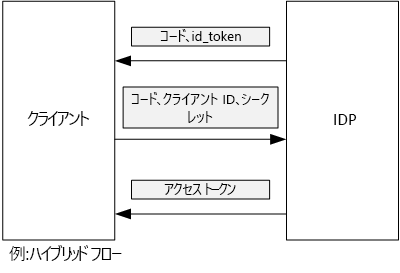

# <a name="use-client-assertion-to-get-access-tokens-from-azure-ad"></a>クライアント アサーションを使用した Azure AD からのアクセス トークンの取得

[ サンプル コード][sample application]

## <a name="background"></a>バックグラウンド
OpenID Connect で承認コード フローまたはハイブリッド フローを使用すると、クライアントはアクセス トークンの承認コードを交換します。 クライアントは、この手順中にサーバーに対して自身を認証する必要があります。



クライアントを認証する方法の 1 つは、クライアント シークレットの使用です。 [Tailspin Surveys][Surveys] アプリケーションは、クライアント シークレットを使用するように既定で構成されます。

次に、クライアントから IDP に対して、アクセス トークンを要求する要求の例を示します。 `client_secret` パラメーターに注目してください。

```
POST https://login.microsoftonline.com/b9bd2162xxx/oauth2/token HTTP/1.1
Content-Type: application/x-www-form-urlencoded

resource=https://tailspin.onmicrosoft.com/surveys.webapi
  &client_id=87df91dc-63de-4765-8701-b59cc8bd9e11
  &client_secret=i3Bf12Dn...
  &grant_type=authorization_code
  &code=PG8wJG6Y...
```

シークレットは単なる文字列なので、値が漏えいしないように注意する必要があります。 ベスト プラクティスは、クライアント シークレットをソース制御とは別に保存することです。 Azure にデプロイするときは、[アプリ設定][configure-web-app]にシークレットを保存します。

ただし、Azure サブスクリプションにアクセス権を持つ全員がアプリ設定を表示できます。 さらに、シークレットをソース制御 (たとえばデプロイ スクリプトなど) に組み入れたり、電子メールで共有したりするなどの誘惑は常にあります。

セキュリティを強化するために、クライアント シークレットではなく、[クライアント アサーション]をご利用いただけます。 クライアント アサーションの場合、クライアントは X.509 証明書を使用して、クライアントから送信されたトークン要求を証明します。 クライアント証明書は Web サーバーにインストールされています。 一般的に、クライアント シークレットが誤って暴露されないようにするよりも、証明書に対するアクセス権を制限する方が簡単です。 Web アプリで証明書を構成する方法の詳細については、「[Using Certificates in Azure Websites Applications (Azure Websites アプリケーションでの証明書の使用)][using-certs-in-websites]」をご覧ください。

クライアント アサーションを使用したトークン要求を次に示します。

```
POST https://login.microsoftonline.com/b9bd2162xxx/oauth2/token HTTP/1.1
Content-Type: application/x-www-form-urlencoded

resource=https://tailspin.onmicrosoft.com/surveys.webapi
  &client_id=87df91dc-63de-4765-8701-b59cc8bd9e11
  &client_assertion_type=urn:ietf:params:oauth:client-assertion-type:jwt-bearer
  &client_assertion=eyJhbGci...
  &grant_type=authorization_code
  &code= PG8wJG6Y...
```

`client_secret` パラメーターは使用されなくなったことに注意してください。 代わりに、クライアント証明書を使用して署名された JWT トークンは `client_assertion` パラメーターに含まれます。 `client_assertion_type` パラメーターでは、アサーションの種類 (この例では JWT トークン) を指定します。 サーバーが JWT トークンを検証します。 JWT トークンが無効の場合、トークン要求からエラーが返されます。

> [!NOTE]
> X.509 証明書は、クライアント アサーションの唯一の形式ではありませんが、Azure AD でサポートされているため、この記事では取り上げています。
> 
> 

実行時に、Web アプリケーションは証明書ストアから証明書を読み取ります。 証明書は Web アプリと同じコンピューターにインストールされている必要があります。

Surveys アプリケーションには、Azure AD からトークンを取得する [AuthenticationContext.AcquireTokenSilentAsync](/dotnet/api/microsoft.identitymodel.clients.activedirectory.authenticationcontext.acquiretokensilentasync) メソッドに渡すことができる、[ClientAssertionCertificate](/dotnet/api/microsoft.identitymodel.clients.activedirectory.clientassertioncertificate) を作成するヘルパー クラスが含まれています。

```csharp
public class CertificateCredentialService : ICredentialService
{
    private Lazy<Task<AdalCredential>> _credential;

    public CertificateCredentialService(IOptions<ConfigurationOptions> options)
    {
        var aadOptions = options.Value?.AzureAd;
        _credential = new Lazy<Task<AdalCredential>>(() =>
        {
            X509Certificate2 cert = CertificateUtility.FindCertificateByThumbprint(
                aadOptions.Asymmetric.StoreName,
                aadOptions.Asymmetric.StoreLocation,
                aadOptions.Asymmetric.CertificateThumbprint,
                aadOptions.Asymmetric.ValidationRequired);
            string password = null;
            var certBytes = CertificateUtility.ExportCertificateWithPrivateKey(cert, out password);
            return Task.FromResult(new AdalCredential(new ClientAssertionCertificate(aadOptions.ClientId, new X509Certificate2(certBytes, password))));
        });
    }

    public async Task<AdalCredential> GetCredentialsAsync()
    {
        return await _credential.Value;
    }
}
```

Surveys アプリケーションでのクライアント アサーションの設定については、「[Use Azure Key Vault to protect application secrets (Azure Key Vault を使用したアプリケーション シークレットの保護)][key vault]」をご覧ください。

[**次へ**][key vault]

<!-- Links -->
[configure-web-app]: /azure/app-service-web/web-sites-configure/
[azure-management-portal]: https://portal.azure.com
[クライアント アサーション]: https://tools.ietf.org/html/rfc7521
[key vault]: key-vault.md
[Setup-KeyVault]: https://github.com/mspnp/multitenant-saas-guidance/blob/master/scripts/Setup-KeyVault.ps1
[Surveys]: tailspin.md
[using-certs-in-websites]: https://azure.microsoft.com/blog/using-certificates-in-azure-websites-applications/

[sample application]: https://github.com/mspnp/multitenant-saas-guidance
