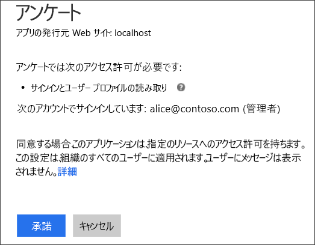
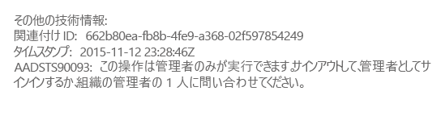
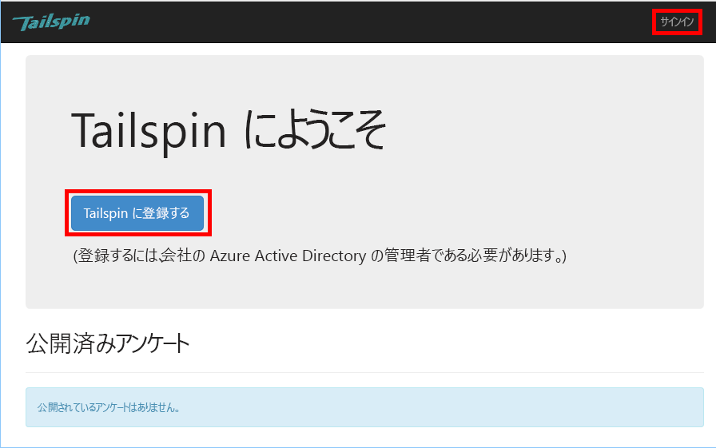
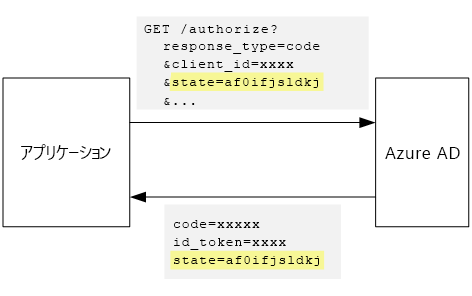

# <a name="tenant-sign-up-and-onboarding"></a>テナントのサインアップとオンボード

[ サンプル コード][sample application]

この記事では、マルチテナント アプリケーションに *サインアップ* プロセスを実装し、顧客がアプリケーションに、組織をサインアップできるようにする方法について説明します。
サインアップ プロセスを実装する理由はいくつかあります。

* AD 管理者が、顧客の組織全体がアプリケーションを使用することに同意できるようにするため。
* クレジット カードの支払いなど、顧客情報を収集するため。
* アプリケーションに必要な 1 回限りのテナント別セットアップを実行するため。

## <a name="admin-consent-and-azure-ad-permissions"></a>管理者の同意と Azure AD のアクセス許可
Azure AD に対して認証するには、アプリケーションがユーザーのディレクトリにアクセスできる必要があります。 少なくとも、アプリケーションがユーザーのプロファイルを読み取ることができるアクセス許可が必要です。 初めてユーザーがサインインすると、Azure AD は、要求されたアクセス許可の一覧が表示された同意ページを表示します。 ユーザーが **[同意する]** をクリックすると、アプリケーションに対するアクセス許可が付与されます。

既定では、同意はユーザーごとに求められます。 サインインするユーザーすべてに、同意ページが表示されます。 ただし、Azure AD では*管理者の同意*もサポートしており、組織全体を代表して AD 管理者が同意することも可能です。

管理者の同意フローを使用すると、同意ページには、AD 管理者がテナント全体の代わりにアクセス許可を付与しているというメッセージが表示されます。



管理者が **[同意する]** をクリックすると、同じテナント内の他のユーザーはサインインできるようになり、Azure AD の同意画面はスキップされます。

組織全体を代表して権限を付与することになるため、管理者の同意を行えるのは、AD 管理者のみとなっています。 管理者以外のユーザーが、管理者の同意のフローを用いて認証を試みると、Azure AD によって次のエラーが表示されます。



後で、アプリケーションに追加のアクセス許可が必要になった場合、顧客はもう一度サインアップし、更新されたアクセス許可に同意する必要があります。  

## <a name="implementing-tenant-sign-up"></a>テナントのサインアップを実装する
[Tailspin Surveys][Tailspin] アプリケーションのサインアップ プロセスでは、いくつかの要件が定義されています。

* ユーザーがサインインするには、テナントのサインアップを完了する必要があります。
* サインアップには、管理者の同意フローを使用します。
* サインアップによって、ユーザーのテナントがアプリケーション データベースに追加されます。
* テナントがサインアップすると、アプリケーションにはオンボーディング ページが表示されます。

ここでは、サインアップ プロセスの実装手順について説明します。
"サインアップ" と "サインイン" はアプリケーションの概念である点を理解することが重要です。 認証フローで、Azure AD はユーザーがサインアップのプロセス中かどうかを本質的に認識していません。 コンテキストを継続的に追跡するのは、アプリケーションの役割です。

匿名ユーザーが Surveys アプリケーションにアクセスすると、サインイン用ボタンと、会社の登録 (サインアップ) 用ボタンの、2 つのボタンが表示されます。



これらのボタンをクリックすると、 `AccountController` クラスのアクションが呼び出されます。

`SignIn` アクションは、**ChallegeResult** を返します。これにより、OpenID Connect ミドルウェアが認証エンドポイントにリダイレクトされます。 ASP.NET Core では、これが認証をトリガーする既定の方法となっています。  

```csharp
[AllowAnonymous]
public IActionResult SignIn()
{
    return new ChallengeResult(
        OpenIdConnectDefaults.AuthenticationScheme,
        new AuthenticationProperties
        {
            IsPersistent = true,
            RedirectUri = Url.Action("SignInCallback", "Account")
        });
}
```

次に `SignUp` アクションと比較してみましょう。

```csharp
[AllowAnonymous]
public IActionResult SignUp()
{
    var state = new Dictionary<string, string> { { "signup", "true" }};
    return new ChallengeResult(
        OpenIdConnectDefaults.AuthenticationScheme,
        new AuthenticationProperties(state)
        {
            RedirectUri = Url.Action(nameof(SignUpCallback), "Account")
        });
}
```

`SignIn` と同様に、`SignUp` アクションも `ChallengeResult` を返します。 ただし、今回は 1 つの状態情報を `AuthenticationProperties` in the `ChallengeResult`に追加します。

* サインアップ: ユーザーによるサインアップ プロセスを開始したことを示す、ブール型フラグ。

`AuthenticationProperties` の状態情報が OpenID Connect [状態] パラメーターに追加され、認証フローの際にラウンド トリップします。



ユーザーが Azure AD で認証され、元のアプリケーションにリダイレクトされると、認証チケットに状態が含まれています。 ここでは、このファクトを使用して、"signup" 値が認証フロー全体で継続されていることを確認します。

## <a name="adding-the-admin-consent-prompt"></a>管理者の同意プロンプトを追加する
Azure AD の管理者の同意フローは、認証要求のクエリ文字列に "prompt" パラメーターを追加することでトリガーされます。

```
/authorize?prompt=admin_consent&...
```

Surveys アプリケーションでは、 `RedirectToAuthenticationEndpoint` イベント中に prompt が追加されます。 このイベントは、ミドルウェアが認証エンドポイントにリダイレクトする直前に呼び出されます。

```csharp
public override Task RedirectToAuthenticationEndpoint(RedirectContext context)
{
    if (context.IsSigningUp())
    {
        context.ProtocolMessage.Prompt = "admin_consent";
    }

    _logger.RedirectToIdentityProvider();
    return Task.FromResult(0);
}
```

` ProtocolMessage.Prompt` を設定すると、ミドルウェアによって "prompt" パラメーターが認証要求に追加されます。

prompt はサインアップ中にのみ必要です。 通常のサインインには含めないでください。 サインアップとサインインを区別するには、認証状態の `signup` 値を確認します。 次の拡張メソッドで、この条件を確認します。

```csharp
internal static bool IsSigningUp(this BaseControlContext context)
{
    Guard.ArgumentNotNull(context, nameof(context));

    string signupValue;
    // Check the HTTP context and convert to string
    if ((context.Ticket == null) ||
        (!context.Ticket.Properties.Items.TryGetValue("signup", out signupValue)))
    {
        return false;
    }

    // We have found the value, so see if it's valid
    bool isSigningUp;
    if (!bool.TryParse(signupValue, out isSigningUp))
    {
        // The value for signup is not a valid boolean, throw                
        throw new InvalidOperationException($"'{signupValue}' is an invalid boolean value");
    }

    return isSigningUp;
}
```

## <a name="registering-a-tenant"></a>テナントを登録する
Surveys アプリケーションは、各テナントとユーザーに関する一部の情報をアプリケーション データベースに保存します。


Tenant テーブルの IssuerValue は、テナントの発行者要求の値です。 Azure AD では、これは `https://sts.windows.net/<tentantID>` であり、テナントごとに一意の値が付与されます。

新しいテナントがサインアップすると、Surveys アプリケーションでテナント レコードがデータベースに書き込まれます。 この処理は、 `AuthenticationValidated` イベント内で発生します(このイベント前には実行しないでください。 ID トークンはまだ検証されていないため、要求値を信頼できません)。 [認証]に関するページを参照してください。

Surveys アプリケーションの関連するコードを次に示します。

```csharp
public override async Task TokenValidated(TokenValidatedContext context)
{
    var principal = context.AuthenticationTicket.Principal;
    var userId = principal.GetObjectIdentifierValue();
    var tenantManager = context.HttpContext.RequestServices.GetService<TenantManager>();
    var userManager = context.HttpContext.RequestServices.GetService<UserManager>();
    var issuerValue = principal.GetIssuerValue();
    _logger.AuthenticationValidated(userId, issuerValue);

    // Normalize the claims first.
    NormalizeClaims(principal);
    var tenant = await tenantManager.FindByIssuerValueAsync(issuerValue)
        .ConfigureAwait(false);

    if (context.IsSigningUp())
    {
        if (tenant == null)
        {
            tenant = await SignUpTenantAsync(context, tenantManager)
                .ConfigureAwait(false);
        }

        // In this case, we need to go ahead and set up the user signing us up.
        await CreateOrUpdateUserAsync(context.Ticket, userManager, tenant)
            .ConfigureAwait(false);
    }
    else
    {
        if (tenant == null)
        {
            _logger.UnregisteredUserSignInAttempted(userId, issuerValue);
            throw new SecurityTokenValidationException($"Tenant {issuerValue} is not registered");
        }

        await CreateOrUpdateUserAsync(context.Ticket, userManager, tenant)
            .ConfigureAwait(false);
    }
}
```

このコードは、次の処理を実行します。

1. テナントの発行者値がデータベース内に既にあるかどうかを確認します。 テナントがサインアップしていない場合、 `FindByIssuerValueAsync` は null を返します。
2. ユーザーがサインアップ中の場合:
   1. テナントをデータベースに追加します (`SignUpTenantAsync`)。
   2. 認証されたユーザーをデータベースに追加します (`CreateOrUpdateUserAsync`)。
3. それ以外の場合、通常のサインイン フローを完了します。
   1. テナントの発行者がデータベース内に見つからなかった場合、テナントが登録されておらず、顧客がサインアップする必要があることを意味します。 この場合、例外をスローして認証を失敗させます。
   2. それ以外の場合、ユーザーのデータベース レコードがなければ作成します (`CreateOrUpdateUserAsync`)。

テナントをデータベースに追加する `SignUpTenantAsync` メソッドの例を次に示します。

```csharp
private async Task<Tenant> SignUpTenantAsync(BaseControlContext context, TenantManager tenantManager)
{
    Guard.ArgumentNotNull(context, nameof(context));
    Guard.ArgumentNotNull(tenantManager, nameof(tenantManager));

    var principal = context.Ticket.Principal;
    var issuerValue = principal.GetIssuerValue();
    var tenant = new Tenant
    {
        IssuerValue = issuerValue,
        Created = DateTimeOffset.UtcNow
    };

    try
    {
        await tenantManager.CreateAsync(tenant)
            .ConfigureAwait(false);
    }
    catch(Exception ex)
    {
        _logger.SignUpTenantFailed(principal.GetObjectIdentifierValue(), issuerValue, ex);
        throw;
    }

    return tenant;
}
```

Surveys アプリケーションの全体的なサインアップ フローの概要を次に示します。

1. ユーザーが **[Sign Up]** ボタンをクリックします。
2. `AccountController.SignUp` アクションからチャレンジの結果が返されます。  認証の状態に "signup" 値が含まれます。
3. `RedirectToAuthenticationEndpoint` イベントで、`admin_consent` プロンプトを追加します。
4. OpenID Connect ミドルウェアによって Azure AD にリダイレクトされ、ユーザーが認証されます。
5. `AuthenticationValidated` イベントで、"signup" 状態を確認します。
6. テナントをデータベースに追加します。

[**次へ**][app roles]

<!-- Links -->
[app roles]: app-roles.md
[Tailspin]: tailspin.md

[状態]: http://openid.net/specs/openid-connect-core-1_0.html#AuthRequest
[認証]: authenticate.md
[sample application]: https://github.com/mspnp/multitenant-saas-guidance
