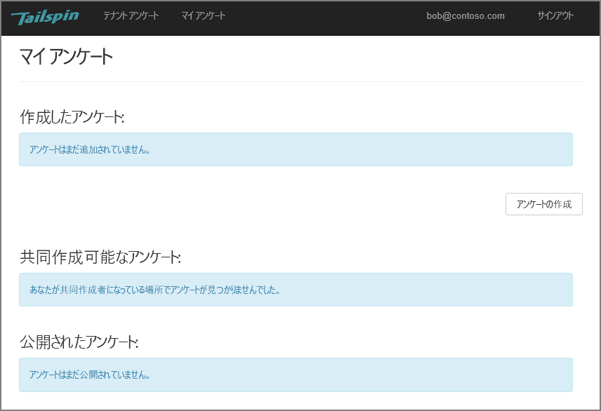
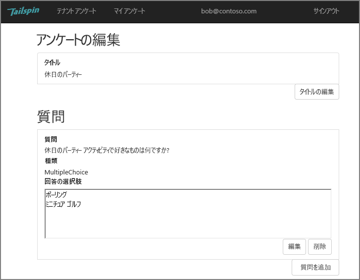
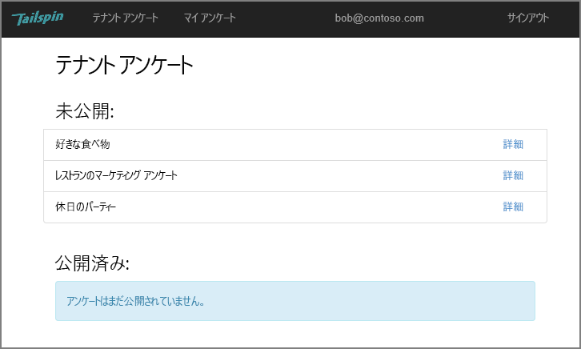
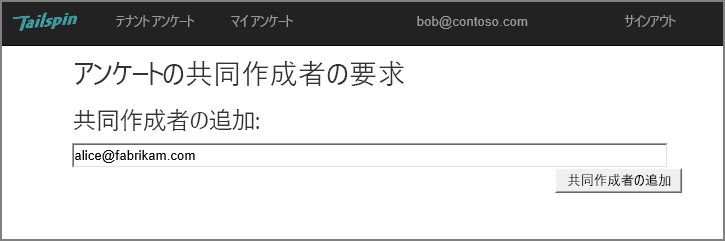
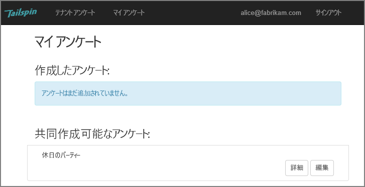
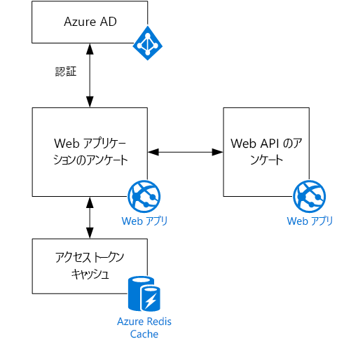

# Tailspin シナリオThe Tailspin scenario

[ サンプル コード][sample application][ Sample code][sample application]

Tailspin は、Surveys という名前の SaaS アプリケーションを開発している仮の会社です。Tailspin is a fictitious company that is developing a SaaS application named Surveys. このアプリケーションを使用すると、オンライン アンケートを作成および発行することができます。This application enables organizations to create and publish online surveys.

* 組織はアプリケーションにサインアップできます。An organization can sign up for the application.
* 組織がサインアップした後、ユーザーはその組織の資格情報でアプリケーションにサインインできます。After the organization is signed up, users can sign into the application with their organizational credentials.
* ユーザーはアンケートを作成、編集、および発行することができます。Users can create, edit, and publish surveys.

> [!NOTE]
> アプリケーションを開始するには、「[Surveys アプリケーションの実行]」を参照してください。To get started with the application, see [Run the Surveys application].

## ユーザーがアンケートを作成、編集、および表示できるUsers can create, edit, and view surveys

認証されたユーザーは、自身が作成した、または自身が共同作成者の権限を持つすべてのアンケートを表示し、新しいアンケートを作成することができます。An authenticated user can view all the surveys that he or she has created or has contributor rights to, and create new surveys. ユーザーが組織 ID `bob@contoso.com` でサインインしていることに注意してください。Notice that the user is signed in with his organizational identity, `bob@contoso.com`.

このスクリーンショットには、[アンケートの編集] ページが表示されます。This screenshot shows the Edit Survey page:

ユーザーは、同じテナント内で他のユーザーによって作成されたアンケートを表示することもできます。Users can also view any surveys created by other users within the same tenant.

## アンケートの所有者が共同作成者を招待できるSurvey owners can invite contributors

ユーザーがアンケートを作成する場合は、アンケートの共同作成者に他のユーザーを招待できます。When a user creates a survey, he or she can invite other people to be contributors on the survey. 共同作成者はアンケートを編集することはできますが、削除または公開することはできません。Contributors can edit the survey, but cannot delete or publish it.

ユーザーが他のテナントから共同作成者を追加できます。これにより、リソースのテナント間共有が可能になります。A user can add contributors from other tenants, which enables cross-tenant sharing of resources. このスクリーンショットでは、Bob (`bob@contoso.com`) が自身で作成したアンケートに、Alice (`alice@fabrikam.com`) を共同作成者として追加しています。In this screenshot, Bob (`bob@contoso.com`) is adding Alice (`alice@fabrikam.com`) as a contributor to a survey that Bob created.

Alice がログインすると、[共同作成できるアンケート] の下にアンケートが表示されます。When Alice logs in, she sees the survey listed under "Surveys I can contribute to".

Alice が Contoso テナントのゲストとしてではなく、自分のテナントにサインインすることに注意してください。Note that Alice signs into her own tenant, not as a guest of the Contoso tenant. Alice に付与されているのは、そのアンケートの共同作成者のアクセス許可だけです &mdash; Contoso テナントから他のアンケートを表示することはできません。Alice has contributor permissions only for that survey &mdash; she cannot view other surveys from the Contoso tenant.

## アーキテクチャArchitecture

Surveys アプリケーションは、Web フロント エンドおよび Web API バックエンドで構成されます。The Surveys application consists of a web front end and a web API backend. 両方とも [ASP.NET Core] を使用して実装されます。Both are implemented using [ASP.NET Core].

Web アプリケーションでは、Azure Active Directory (Azure AD) を使用して、ユーザーを認証します。The web application uses Azure Active Directory (Azure AD) to authenticate users. また、Web アプリケーションでは Azure AD を呼び出して、Web API の OAuth 2 アクセス トークンを取得します。The web application also calls Azure AD to get OAuth 2 access tokens for the Web API. アクセス トークンは、Azure Redis Cache でキャッシュされます。Access tokens are cached in Azure Redis Cache. キャッシュを使用すると、複数のインスタンスで同じトークンのキャッシュ (たとえば、サーバー ファーム) を共有できます。The cache enables multiple instances to share the same token cache (e.g., in a server farm).

[**次へ**][authentication][**Next**][authentication]

<!-- links -->

[authentication]: authenticate.md

[Surveys アプリケーションの実行]: ./run-the-app.md
[Run the Surveys application]: ./run-the-app.md
[ASP.NET Core]: /aspnet/core
[sample application]: https://github.com/mspnp/multitenant-saas-guidance
