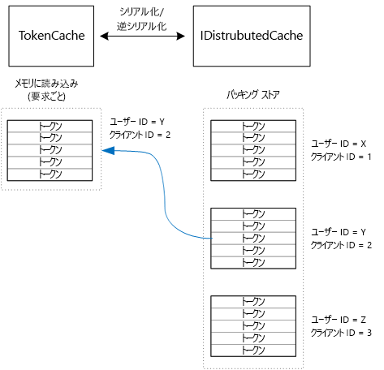

# <a name="cache-access-tokens"></a><span data-ttu-id="95b60-103">アクセス トークンのキャッシュ</span><span class="sxs-lookup"><span data-stu-id="95b60-103">Cache access tokens</span></span>

<span data-ttu-id="95b60-104">[ サンプル コード][sample application]</span><span class="sxs-lookup"><span data-stu-id="95b60-104">[ Sample code][sample application]</span></span>

<span data-ttu-id="95b60-105">トークン エンドポイントに対する HTTP 要求が必要なので、OAuth アクセス トークンの取得は比較的コストが高い処理です。</span><span class="sxs-lookup"><span data-stu-id="95b60-105">It's relatively expensive to get an OAuth access token, because it requires an HTTP request to the token endpoint.</span></span> <span data-ttu-id="95b60-106">そのため、可能な限りトークンをキャッシュすることをお勧めします。</span><span class="sxs-lookup"><span data-stu-id="95b60-106">Therefore, it's good to cache tokens whenever possible.</span></span> <span data-ttu-id="95b60-107">[Azure AD Authentication Library][ADAL] (ADAL) が Azure AD から取得したトークンを自動的にキャッシュします。トークンには更新トークンも含まれます。</span><span class="sxs-lookup"><span data-stu-id="95b60-107">The [Azure AD Authentication Library][ADAL] (ADAL)  automatically caches tokens obtained from Azure AD, including refresh tokens.</span></span>

<span data-ttu-id="95b60-108">ADAL には、既定のトークン キャッシュ機能が実装されています。</span><span class="sxs-lookup"><span data-stu-id="95b60-108">ADAL provides a default token cache implementation.</span></span> <span data-ttu-id="95b60-109">ただし、このトークン キャッシュは、ネイティブ クライアント アプリ用なので、Web アプリには **適していません** 。</span><span class="sxs-lookup"><span data-stu-id="95b60-109">However, this token cache is intended for native client apps, and is **not** suitable for web apps:</span></span>

* <span data-ttu-id="95b60-110">また、静的インスタンスなので、スレッド セーフではありません。</span><span class="sxs-lookup"><span data-stu-id="95b60-110">It is a static instance, and not thread safe.</span></span>
* <span data-ttu-id="95b60-111">すべてのユーザーのトークンは同じディレクトリに保存されるので、多数のユーザーに合わせて拡張されません。</span><span class="sxs-lookup"><span data-stu-id="95b60-111">It doesn't scale to large numbers of users, because tokens from all users go into the same dictionary.</span></span>
* <span data-ttu-id="95b60-112">フォーム内の Web サーバー全体で共有することはできません。</span><span class="sxs-lookup"><span data-stu-id="95b60-112">It can't be shared across web servers in a farm.</span></span>

<span data-ttu-id="95b60-113">代わりに、ADAL `TokenCache` クラスから派生したカスタムのトークン キャッシュを実装する必要がありますが、サーバー環境に適しており、異なるユーザーのトークン間を適度なレベルで分離できます。</span><span class="sxs-lookup"><span data-stu-id="95b60-113">Instead, you should implement a custom token cache that derives from the ADAL `TokenCache` class but is suitable for a server environment and provides the desirable level of isolation between tokens for different users.</span></span>

<span data-ttu-id="95b60-114">`TokenCache` クラスは、発行者、リソース、クライアント ID、およびユーザーでインデックス付けされたトークンのディクショナリを格納します。</span><span class="sxs-lookup"><span data-stu-id="95b60-114">The `TokenCache` class stores a dictionary of tokens, indexed by issuer, resource, client ID, and user.</span></span> <span data-ttu-id="95b60-115">カスタム トークンのキャッシュは、Redis キャッシュなどのバッキング ストアに、このディクショナリを書き込む必要があります。</span><span class="sxs-lookup"><span data-stu-id="95b60-115">A custom token cache should write this dictionary to a backing store, such as a Redis cache.</span></span>

<span data-ttu-id="95b60-116">Tailspin Surveys アプリケーションでは、 `DistributedTokenCache` クラスがトークン キャッシュを実装します。</span><span class="sxs-lookup"><span data-stu-id="95b60-116">In the Tailspin Surveys application, the `DistributedTokenCache` class implements the token cache.</span></span> <span data-ttu-id="95b60-117">この実装には、ASP.NET Core の [IDistributedCache][distributed-cache] 抽象化を使用します。</span><span class="sxs-lookup"><span data-stu-id="95b60-117">This implementation uses the [IDistributedCache][distributed-cache] abstraction from ASP.NET Core.</span></span> <span data-ttu-id="95b60-118">このように、 `IDistributedCache` 実装はバッキング ストアとして使用できます。</span><span class="sxs-lookup"><span data-stu-id="95b60-118">That way, any `IDistributedCache` implementation can be used as a backing store.</span></span>

* <span data-ttu-id="95b60-119">Surveys アプリの既定では、Redis Cache を使用します。</span><span class="sxs-lookup"><span data-stu-id="95b60-119">By default, the Surveys app uses a Redis cache.</span></span>
* <span data-ttu-id="95b60-120">単一のインスタンスの Web サーバーの場合は、ASP.NET Core の[メモリ内キャッシュ][in-memory-cache]を使用できます。</span><span class="sxs-lookup"><span data-stu-id="95b60-120">For a single-instance web server, you could use the ASP.NET Core [in-memory cache][in-memory-cache].</span></span> <span data-ttu-id="95b60-121">(アプリ開発中にローカルで実行するのにも適しています。)</span><span class="sxs-lookup"><span data-stu-id="95b60-121">(This is also a good option for running the app locally during development.)</span></span>

<span data-ttu-id="95b60-122">`DistributedTokenCache` は、キー/値ペアとしてキャッシュ データをバッキング ストアに保存します。</span><span class="sxs-lookup"><span data-stu-id="95b60-122">`DistributedTokenCache` stores the cache data as key/value pairs in the backing store.</span></span> <span data-ttu-id="95b60-123">キーはユーザー ID + クライアント ID なので、ユーザー/クライアントの一意の組み合わせごとに異なるキャッシュ データがバッキング ストアに保存されます。</span><span class="sxs-lookup"><span data-stu-id="95b60-123">The key is the user ID plus client ID, so the backing store holds separate cache data for each unique combination of user/client.</span></span>



<span data-ttu-id="95b60-125">バッキング ストアは、ユーザーごとにパーティション分割されています。</span><span class="sxs-lookup"><span data-stu-id="95b60-125">The backing store is partitioned by user.</span></span> <span data-ttu-id="95b60-126">各 HTTP 要求に対して、そのユーザーのトークンはバッキング ストアから読み取られ、`TokenCache` ディクショナリに読み込まれます。</span><span class="sxs-lookup"><span data-stu-id="95b60-126">For each HTTP request, the tokens for that user are read from the backing store and loaded into the `TokenCache` dictionary.</span></span> <span data-ttu-id="95b60-127">Redis をバッキング ストアとして使用する場合は、サーバー ファーム内のすべてのサーバー インスタンスが同じキャッシュに読み取りと書き込みを行い、このアプローチは多数のユーザーに適用されます。</span><span class="sxs-lookup"><span data-stu-id="95b60-127">If Redis is used as the backing store, every server instance in a server farm reads/writes to the same cache, and this approach scales to many users.</span></span>

## <a name="encrypting-cached-tokens"></a><span data-ttu-id="95b60-128">キャッシュされたトークンを暗号化する</span><span class="sxs-lookup"><span data-stu-id="95b60-128">Encrypting cached tokens</span></span>
<span data-ttu-id="95b60-129">トークンによりユーザーのリソースへのアクセス権が付与されるため、トークンは機密性の高いデータです。</span><span class="sxs-lookup"><span data-stu-id="95b60-129">Tokens are sensitive data, because they grant access to a user's resources.</span></span> <span data-ttu-id="95b60-130">(さらに、ユーザー パスワードと異なり、トークンのハッシュだけを格納することはできません。)そのため、侵害される前にトークンを保護することが非常に重要です。</span><span class="sxs-lookup"><span data-stu-id="95b60-130">(Moreover, unlike a user's password, you can't just store a hash of the token.) Therefore, it's critical to protect tokens from being compromised.</span></span> <span data-ttu-id="95b60-131">Redis でサポートされるキャッシュはパスワードで保護されますが、他のユーザーがパスワードを取得した場合、そのユーザーはすべてのキャッシュされたアクセス トークンを取得できます。</span><span class="sxs-lookup"><span data-stu-id="95b60-131">The Redis-backed cache is protected by a password, but if someone obtains the password, they could get all of the cached access tokens.</span></span> <span data-ttu-id="95b60-132">このような理由から、`DistributedTokenCache` は、バッキング ストアへのすべての書き込みを暗号化します。</span><span class="sxs-lookup"><span data-stu-id="95b60-132">For that reason, the `DistributedTokenCache` encrypts everything that it writes to the backing store.</span></span> <span data-ttu-id="95b60-133">暗号化は、ASP.NET Core の[データ保護][data-protection] API を使用して行われます。</span><span class="sxs-lookup"><span data-stu-id="95b60-133">Encryption is done using the ASP.NET Core [data protection][data-protection] APIs.</span></span>

> [!NOTE]
> <span data-ttu-id="95b60-134">Azure Web サイトにデプロイする場合、暗号化キーはネットワーク ストレージにバックアップされ、すべてのマシン間で同期されます (詳細は、「[キーの管理と有効期間][key-management]」をご覧ください)。</span><span class="sxs-lookup"><span data-stu-id="95b60-134">If you deploy to Azure Web Sites, the encryption keys are backed up to network storage and synchronized across all machines (see [Key management and lifetime][key-management]).</span></span> <span data-ttu-id="95b60-135">既定では、キーは Azure Web サイト内で実行されるときには暗号化されませんが、[X.509 証明書を使用して暗号化を有効にする][x509-cert-encryption]ことができます。</span><span class="sxs-lookup"><span data-stu-id="95b60-135">By default, keys are not encrypted when running in Azure Web Sites, but you can [enable encryption using an X.509 certificate][x509-cert-encryption].</span></span>
> 
> 

## <a name="distributedtokencache-implementation"></a><span data-ttu-id="95b60-136">DistributedTokenCache の実装</span><span class="sxs-lookup"><span data-stu-id="95b60-136">DistributedTokenCache implementation</span></span>
<span data-ttu-id="95b60-137">`DistributedTokenCache` クラスは、ADAL [TokenCache][tokencache-class] クラスから派生しています。</span><span class="sxs-lookup"><span data-stu-id="95b60-137">The `DistributedTokenCache` class derives from the ADAL [TokenCache][tokencache-class] class.</span></span>

<span data-ttu-id="95b60-138">コンストラクターの `DistributedTokenCache` クラスによって、現在のユーザーのキーが作成され、バッキング ストアからキャッシュが読み込まれます。</span><span class="sxs-lookup"><span data-stu-id="95b60-138">In the constructor, the `DistributedTokenCache` class creates a key for the current user and loads the cache from the backing store:</span></span>

```csharp
public DistributedTokenCache(
    ClaimsPrincipal claimsPrincipal,
    IDistributedCache distributedCache,
    ILoggerFactory loggerFactory,
    IDataProtectionProvider dataProtectionProvider)
    : base()
{
    _claimsPrincipal = claimsPrincipal;
    _cacheKey = BuildCacheKey(_claimsPrincipal);
    _distributedCache = distributedCache;
    _logger = loggerFactory.CreateLogger<DistributedTokenCache>();
    _protector = dataProtectionProvider.CreateProtector(typeof(DistributedTokenCache).FullName);
    AfterAccess = AfterAccessNotification;
    LoadFromCache();
}
```

<span data-ttu-id="95b60-139">キーは、ユーザー ID とクライアント ID を連結して作成されます。</span><span class="sxs-lookup"><span data-stu-id="95b60-139">The key is created by concatenating the user ID and client ID.</span></span> <span data-ttu-id="95b60-140">この両方の ID は、ユーザーの `ClaimsPrincipal`で見つかった要求から取得されます。</span><span class="sxs-lookup"><span data-stu-id="95b60-140">Both of these are taken from claims found in the user's `ClaimsPrincipal`:</span></span>

```csharp
private static string BuildCacheKey(ClaimsPrincipal claimsPrincipal)
{
    string clientId = claimsPrincipal.FindFirstValue("aud", true);
    return string.Format(
        "UserId:{0}::ClientId:{1}",
        claimsPrincipal.GetObjectIdentifierValue(),
        clientId);
}
```

<span data-ttu-id="95b60-141">キャッシュ データを読み込むには、バッキング ストアからシリアル化された BLOB を読み取り、 `TokenCache.Deserialize` を呼び出して BLOB をキャッシュ データに変換します。</span><span class="sxs-lookup"><span data-stu-id="95b60-141">To load the cache data, read the serialized blob from the backing store, and call `TokenCache.Deserialize` to convert the blob into cache data.</span></span>

```csharp
private void LoadFromCache()
{
    byte[] cacheData = _distributedCache.Get(_cacheKey);
    if (cacheData != null)
    {
        this.Deserialize(_protector.Unprotect(cacheData));
    }
}
```

<span data-ttu-id="95b60-142">ADAL がキャッシュにアクセスするたびに、 `AfterAccess` イベントが発生します。</span><span class="sxs-lookup"><span data-stu-id="95b60-142">Whenever ADAL access the cache, it fires an `AfterAccess` event.</span></span> <span data-ttu-id="95b60-143">キャッシュ データが変更されると、 `HasStateChanged` プロパティは true になります。</span><span class="sxs-lookup"><span data-stu-id="95b60-143">If the cache data has changed, the `HasStateChanged` property is true.</span></span> <span data-ttu-id="95b60-144">その場合、バッキング ストアを更新して変更を反映し、 `HasStateChanged` を false に設定します。</span><span class="sxs-lookup"><span data-stu-id="95b60-144">In that case, update the backing store to reflect the change, and then set `HasStateChanged` to false.</span></span>

```csharp
public void AfterAccessNotification(TokenCacheNotificationArgs args)
{
    if (this.HasStateChanged)
    {
        try
        {
            if (this.Count > 0)
            {
                _distributedCache.Set(_cacheKey, _protector.Protect(this.Serialize()));
            }
            else
            {
                // There are no tokens for this user/client, so remove the item from the cache.
                _distributedCache.Remove(_cacheKey);
            }
            this.HasStateChanged = false;
        }
        catch (Exception exp)
        {
            _logger.WriteToCacheFailed(exp);
            throw;
        }
    }
}
```

<span data-ttu-id="95b60-145">TokenCache からは、他にも 2 つのイベントが送信されます。</span><span class="sxs-lookup"><span data-stu-id="95b60-145">TokenCache sends two other events:</span></span>

* <span data-ttu-id="95b60-146">`BeforeWrite`</span><span class="sxs-lookup"><span data-stu-id="95b60-146">`BeforeWrite`.</span></span> <span data-ttu-id="95b60-147">ADAL がキャッシュに書き込む直前の呼び出し。</span><span class="sxs-lookup"><span data-stu-id="95b60-147">Called immediately before ADAL writes to the cache.</span></span> <span data-ttu-id="95b60-148">これを使用して、コンカレンシー戦略を実装できます。</span><span class="sxs-lookup"><span data-stu-id="95b60-148">You can use this to implement a concurrency strategy</span></span>
* <span data-ttu-id="95b60-149">`BeforeAccess`</span><span class="sxs-lookup"><span data-stu-id="95b60-149">`BeforeAccess`.</span></span> <span data-ttu-id="95b60-150">ADAL がキャッシュから読み取る直前の呼び出し。</span><span class="sxs-lookup"><span data-stu-id="95b60-150">Called immediately before ADAL reads from the cache.</span></span> <span data-ttu-id="95b60-151">ここで、最新バージョンを取得するキャッシュを再読み込みできます。</span><span class="sxs-lookup"><span data-stu-id="95b60-151">Here you can reload the cache to get the latest version.</span></span>

<span data-ttu-id="95b60-152">この例では、これら 2 つのイベントを処理していません。</span><span class="sxs-lookup"><span data-stu-id="95b60-152">In our case, we decided not to handle these two events.</span></span>

* <span data-ttu-id="95b60-153">コンカレンシーの場合、最後の書き込みが有効になりますが、問題ありません。</span><span class="sxs-lookup"><span data-stu-id="95b60-153">For concurrency, last write wins.</span></span> <span data-ttu-id="95b60-154">ユーザー + クライアントごとにトークンは独立して保存されるので、同一ユーザーが同時にログイン セッションを実行した場合にのみ、競合が発生します。</span><span class="sxs-lookup"><span data-stu-id="95b60-154">That's OK, because tokens are stored independently for each user + client, so a conflict would only happen if the same user had two concurrent login sessions.</span></span>
* <span data-ttu-id="95b60-155">読み取りについては、要求ごとにキャッシュを読み込みます。</span><span class="sxs-lookup"><span data-stu-id="95b60-155">For reading, we load the cache on every request.</span></span> <span data-ttu-id="95b60-156">要求の存続期間は短期です。</span><span class="sxs-lookup"><span data-stu-id="95b60-156">Requests are short lived.</span></span> <span data-ttu-id="95b60-157">存続期間内にキャッシュが変更された場合、次の要求は新しい値を選択します。</span><span class="sxs-lookup"><span data-stu-id="95b60-157">If the cache gets modified in that time, the next request will pick up the new value.</span></span>

<span data-ttu-id="95b60-158">[**次へ**][client-assertion]</span><span class="sxs-lookup"><span data-stu-id="95b60-158">[**Next**][client-assertion]</span></span>

<!-- links -->
[ADAL]: https://msdn.microsoft.com/library/azure/jj573266.aspx
[client-assertion]: ./client-assertion.md
[data-protection]: /aspnet/core/security/data-protection/
[distributed-cache]: /aspnet/core/performance/caching/distributed
[key-management]: /aspnet/core/security/data-protection/configuration/default-settings
[in-memory-cache]: /aspnet/core/performance/caching/memory
[tokencache-class]: https://msdn.microsoft.com/library/azure/microsoft.identitymodel.clients.activedirectory.tokencache.aspx
[x509-cert-encryption]: /aspnet/core/security/data-protection/implementation/key-encryption-at-rest#x509-certificate
[sample application]: https://github.com/mspnp/multitenant-saas-guidance
