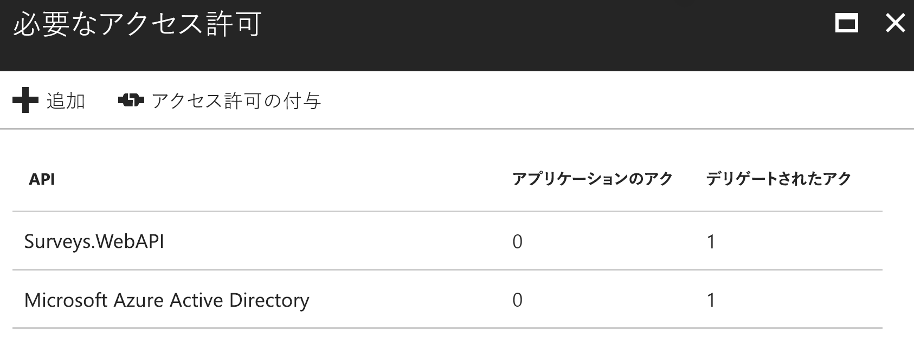

# <a name="secure-a-backend-web-api"></a>バックエンド Web API をセキュリティで保護する

[ サンプル コード][sample application]

[Tailspin Surveys] アプリケーションは、バックエンド Web API を使用してアンケートに対する CRUD 操作を管理しています。 たとえば、ユーザーが [My Surveys] をクリックすると、Web アプリケーションから HTTP 要求が Web API に送信されます。

```
GET /users/{userId}/surveys
```

Web API からは JSON オブジェクトが返されます。

```
{
  "Published":[],
  "Own":[
    {"Id":1,"Title":"Survey 1"},
    {"Id":3,"Title":"Survey 3"},
    ],
  "Contribute": [{"Id":8,"Title":"My survey"}]
}
```

Web API は匿名要求を許可しないため、Web アプリは OAuth 2 ベアラー トークンを使用して自身を認証する必要があります。

> [!NOTE]
> これはサーバー対サーバーのシナリオです。 アプリケーションは、ブラウザーから API に対して AJAX の呼び出しを実行しません。
> 
> 

使用できる主なアプローチは 2 つです。

* デリゲートされたユーザー ID。 Web アプリケーションは、ユーザーの ID を使用して認証します。
* アプリケーション ID。 Web アプリケーションは、OAuth2 クライアント資格情報フローで、自身のクライアント ID を使用して認証します。

Tailspin アプリケーションは、デリゲートされたユーザー ID を実装しています。 主な違いは次のとおりです。

**デリゲートされたユーザー ID**

* Web API に送信されるベアラー トークンには、ユーザー ID が含まれています。
* Web API は、ユーザー ID に基づいて承認を決定します。
* ユーザーにアクションを実行する権限がない場合、Web アプリケーションは Web API から送信される 403 (Forbidden) エラーを処理する必要があります。
* 通常、Web アプリケーションは、UI に影響がある何らかの承認の決定を行います (UI 要素の表示、非表示など)。
* Web API は、信用されていないクライアント (JavaScript アプリケーションや、ネイティブ クライアント アプリケーションなど) によって使用されている可能性があります。

**アプリケーション ID**

* Web API は、ユーザーに関する情報を取得しません。
* Web API は、ユーザー ID に基づく承認を実行できません。 すべての承認は、Web アプリケーションが決定します。  
* 信頼されていないクライアント (JavaScript やネイティブ クライアント アプリケーション) は、Web API を使用できません。
* このアプローチは、Web API に承認ロジックがないため、実装がやや簡単です。

いずれのアプローチにおいても、Web アプリケーションは Web API を呼び出すのに必要な資格情報であるアクセス トークンを取得する必要があります。

* デリゲートされたユーザー ID の場合、トークンは、ユーザーの代わりにトークンを発行できる IDP から入手します。
* クライアントの資格情報の場合、アプリケーションは IDP からトークンを取得するか、独自のトークン サーバーをホストします。 (ただし、トークン サーバーを最初から作成することはせずに、十分にテストされているフレームワーク ([IdentityServer3] など) を使用してください。)Azure AD で認証する場合、クライアントの資格情報フローでも、Azure AD からアクセス トークンを取得することを強くお勧めします。

以降、この記事では、アプリケーションが Azure AD を使用して認証している前提で説明します。


## <a name="register-the-web-api-in-azure-ad"></a>Azure AD に Web API を登録する
Azure AD から Web API のベアラー トークンを発行するには、Azure AD で構成が必要です。

1. Azure AD に Web API を登録します。

2. Web アプリのクライアント ID を、Web API アプリケーション マニフェストの `knownClientApplications` プロパティに追加します。 [アプリケーション マニフェストの更新]に関するページを参照してください。

3. Web API を呼び出すアクセス許可を Web アプリケーションに付与します。 Azure の管理ポータルでは、アプリケーション ID 向け (クライアントの資格情報フロー) の "アプリケーションのアクセス許可"、またはデリゲートされたユーザー ID 向けの "デリゲートされたアクセス許可" の 2 種類のアクセス許可を設定できます。
   
   

## <a name="getting-an-access-token"></a>アクセス トークンの取得
Web API を呼び出す前に、Web アプリケーションは Azure AD からアクセス トークンを取得します。 .NET アプリケーションで、[Azure AD Authentication Library (ADAL) for .NET][ADAL] を使用します。

OAuth 2 承認コード フローの場合、アプリケーションはアクセス トークンの承認コードを交換します。 次のコードでは、ADAL を使用してアクセス トークンを取得します。 このコードは、 `AuthorizationCodeReceived` イベント中に呼び出されます。

```csharp
// The OpenID Connect middleware sends this event when it gets the authorization code.   
public override async Task AuthorizationCodeReceived(AuthorizationCodeReceivedContext context)
{
    string authorizationCode = context.ProtocolMessage.Code;
    string authority = "https://login.microsoftonline.com/" + tenantID
    string resourceID = "https://tailspin.onmicrosoft.com/surveys.webapi" // App ID URI
    ClientCredential credential = new ClientCredential(clientId, clientSecret);

    AuthenticationContext authContext = new AuthenticationContext(authority, tokenCache);
    AuthenticationResult authResult = await authContext.AcquireTokenByAuthorizationCodeAsync(
        authorizationCode, new Uri(redirectUri), credential, resourceID);

    // If successful, the token is in authResult.AccessToken
}
```

必要な各種パラメーターを次に示します。

* `authority`」を参照してください。 サインインしたユーザーのテナント ID が元になります。 (SaaS プロバイダーのテナント ID ではありません)  
* `authorizationCode`」を参照してください。 IDP から取得し直した認証コード。
* `clientId`」を参照してください。 Web アプリケーションのクライアント ID。
* `clientSecret`」を参照してください。 Web アプリケーションのクライアント シークレット。
* `redirectUri`」を参照してください。 OpenID 接続用に設定したリダイレクト URI。 ここに、IDP がトークンでコールバックします。
* `resourceID`」を参照してください。 Azure AD で Web API を登録するときに作成した URI です。
* `tokenCache`」を参照してください。 アクセス トークンをキャッシュするオブジェクト。 [トークンのキャッシュ]に関する記事をご覧ください。

`AcquireTokenByAuthorizationCodeAsync` が成功すると、ADAL はトークンをキャッシュします。 後でキャッシュからトークンを取得するには、次のように AcquireTokenSilentAsync を呼び出します。

```csharp
AuthenticationContext authContext = new AuthenticationContext(authority, tokenCache);
var result = await authContext.AcquireTokenSilentAsync(resourceID, credential, new UserIdentifier(userId, UserIdentifierType.UniqueId));
```

`userId` は、`http://schemas.microsoft.com/identity/claims/objectidentifier` 要求にあるユーザーのオブジェクト ID です。

## <a name="using-the-access-token-to-call-the-web-api"></a>アクセス トークンを使用して Web API を呼び出す
トークンを取得したら、HTTP 要求の Authorization ヘッダーで Web API に送信します。

```
Authorization: Bearer xxxxxxxxxx
```

Surveys アプリケーションの次の拡張メソッドで、 **HttpClient** クラスを使用して HTTP 要求の Authorization ヘッダーを設定します。

```csharp
public static async Task<HttpResponseMessage> SendRequestWithBearerTokenAsync(this HttpClient httpClient, HttpMethod method, string path, object requestBody, string accessToken, CancellationToken ct)
{
    var request = new HttpRequestMessage(method, path);
    if (requestBody != null)
    {
        var json = JsonConvert.SerializeObject(requestBody, Formatting.None);
        var content = new StringContent(json, Encoding.UTF8, "application/json");
        request.Content = content;
    }

    request.Headers.Authorization = new AuthenticationHeaderValue("Bearer", accessToken);
    request.Headers.Accept.Add(new MediaTypeWithQualityHeaderValue("application/json"));

    var response = await httpClient.SendAsync(request, ct);
    return response;
}
```

## <a name="authenticating-in-the-web-api"></a>Web API で認証する
Web API は、ベアラー トークンを認証する必要があります。 ASP.NET Core では、[Microsoft.AspNet.Authentication.JwtBearer][JwtBearer] パッケージを使用できます。 このパッケージには、OpenID Connect ベアラー トークンをアプリケーションに渡すことができるミドルウェアが含まれています。

Web API の `Startup` クラスにミドルウェアを登録します。

```csharp
public void Configure(IApplicationBuilder app, IHostingEnvironment env, ApplicationDbContext dbContext, ILoggerFactory loggerFactory)
{
    // ...

    app.UseJwtBearerAuthentication(new JwtBearerOptions {
        Audience = configOptions.AzureAd.WebApiResourceId,
        Authority = Constants.AuthEndpointPrefix,
        TokenValidationParameters = new TokenValidationParameters {
            ValidateIssuer = false
        },
        Events= new SurveysJwtBearerEvents(loggerFactory.CreateLogger<SurveysJwtBearerEvents>())
    });
    
    // ...
}
```

* **Audience**。 Azure AD に Web API を登録したときに作成した Web API のアプリ ID URL に Audience を設定します。
* **Authority**。 マルチテナント アプリケーションの場合、これを `https://login.microsoftonline.com/common/` に設定します。
* **TokenValidationParameters**。 マルチテナント アプリケーションの場合、**ValidateIssuer** を false に設定します。 つまり、アプリケーションは発行者を検証します。
* **イベント**は、**JwtBearerEvents** から派生するクラスです。

### <a name="issuer-validation"></a>発行者の検証
**JwtBearerEvents.TokenValidated** イベントでトークン発行者を検証します。 発行者は "iss" 要求で送信されます。

Surveys アプリケーションでは、Web API は [テナントのサインアップ]を処理しません。 そのため、発行者がアプリケーション データベース内に存在するかどうかのみを確認します。 存在しない場合は例外がスローされ、認証が失敗します。

```csharp
public override async Task TokenValidated(TokenValidatedContext context)
{
    var principal = context.Ticket.Principal;
    var tenantManager = context.HttpContext.RequestServices.GetService<TenantManager>();
    var userManager = context.HttpContext.RequestServices.GetService<UserManager>();
    var issuerValue = principal.GetIssuerValue();
    var tenant = await tenantManager.FindByIssuerValueAsync(issuerValue);

    if (tenant == null)
    {
        // The caller was not from a trusted issuer. Throw to block the authentication flow.
        throw new SecurityTokenValidationException();
    }

    var identity = principal.Identities.First();

    // Add new claim for survey_userid
    var registeredUser = await userManager.FindByObjectIdentifier(principal.GetObjectIdentifierValue());
    identity.AddClaim(new Claim(SurveyClaimTypes.SurveyUserIdClaimType, registeredUser.Id.ToString()));
    identity.AddClaim(new Claim(SurveyClaimTypes.SurveyTenantIdClaimType, registeredUser.TenantId.ToString()));

    // Add new claim for Email
    var email = principal.FindFirst(ClaimTypes.Upn)?.Value;
    if (!string.IsNullOrWhiteSpace(email))
    {
        identity.AddClaim(new Claim(ClaimTypes.Email, email));
    }
}
```

この例に示すように、**TokenValidated** イベントを使用して要求を変更することもできます。 要求は Azure AD から直接送信されることに注意してください。 Web アプリケーションが取得した要求を変更する場合、それらの変更は Web API が受信するベアラー トークンでは表示されません。 詳細については、「[Claims transformations (要求の変換)][claims-transformation]」をご覧ください。

## <a name="authorization"></a>承認
承認の一般的な説明については、「[Role-based and resource-based authorization (ロールベースおよびリソースベースの承認)][Authorization]」をご覧ください。 

JwtBearer ミドルウェアは、承認応答を処理します。 たとえば、認証されたユーザーに対するコントローラーのアクションを制御するには、**[承認]** 属性を使用して、認証スキームに **JwtBearerDefaults.AuthenticationScheme** を指定します。

```csharp
[Authorize(ActiveAuthenticationSchemes = JwtBearerDefaults.AuthenticationScheme)]
```

ユーザーが認証されていない場合、401 状態コードが返されます。

承認ポリシーによってコントローラーのアクションを制限するには、**[承認]** 属性でポリシー名を指定します。

```csharp
[Authorize(Policy = PolicyNames.RequireSurveyCreator)]
```

ユーザーが認証されていない場合は 401 状態コードが、ユーザーが認証されているが承認されていない場合は 403 状態コードが返されます。 スタートアップ時にポリシーを登録します。

```csharp
public void ConfigureServices(IServiceCollection services)
{
    services.AddAuthorization(options =>
    {
        options.AddPolicy(PolicyNames.RequireSurveyCreator,
            policy =>
            {
                policy.AddRequirements(new SurveyCreatorRequirement());
                policy.RequireAuthenticatedUser(); // Adds DenyAnonymousAuthorizationRequirement 
                policy.AddAuthenticationSchemes(JwtBearerDefaults.AuthenticationScheme);
            });
        options.AddPolicy(PolicyNames.RequireSurveyAdmin,
            policy =>
            {
                policy.AddRequirements(new SurveyAdminRequirement());
                policy.RequireAuthenticatedUser(); // Adds DenyAnonymousAuthorizationRequirement 
                policy.AddAuthenticationSchemes(JwtBearerDefaults.AuthenticationScheme);
            });
    });
    
    // ...
}
```

[**次へ**][token cache]

<!-- links -->
[ADAL]: https://msdn.microsoft.com/library/azure/jj573266.aspx
[JwtBearer]: https://www.nuget.org/packages/Microsoft.AspNet.Authentication.JwtBearer

[Tailspin Surveys]: tailspin.md
[IdentityServer3]: https://github.com/IdentityServer/IdentityServer3
[アプリケーション マニフェストの更新]: ./run-the-app.md#update-the-application-manifests
[トークンのキャッシュ]: token-cache.md
[テナントのサインアップ]: signup.md
[claims-transformation]: claims.md#claims-transformations
[Authorization]: authorize.md
[sample application]: https://github.com/mspnp/multitenant-saas-guidance
[token cache]: token-cache.md
