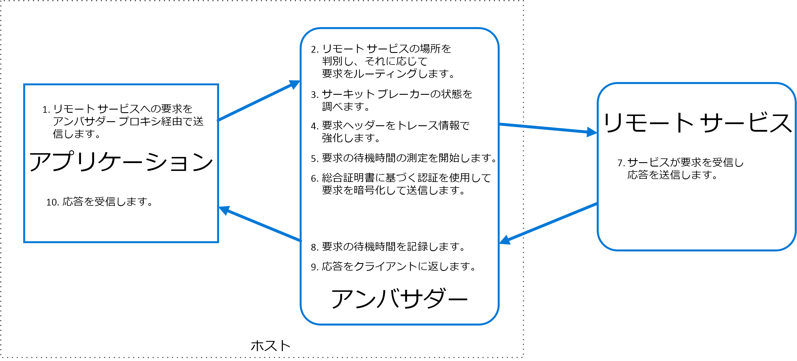

# アンバサダー パターン

コンシューマー サービスまたはアプリケーションの代わりにネットワーク要求を送信するヘルパー サービスを作成します。 アンバサダー サービスは、クライアントに併置されているプロセス外のプロキシと考えることができます。

このパターンは、監視、ログ記録、ルーティング、セキュリティ (TLS など)、[回復性パターン][ resiliency-patterns]といった一般的なクライアント接続のタスクを言語に関係ない方法でオフロードするのに役立ちます。 これは、レガシ アプリケーションまたは変更が困難なアプリケーションで、ネットワーク機能を拡張するためによく使用されます。 専門のチームでこれらの機能を実装することもできます。

## コンテキストと問題

回復力のあるクラウド ベースのアプリケーションには、[サーキット ブレーク][circuit-breaker]、ルーティング、計測と監視、ネットワークに関連する構成を更新する機能などの機能が必要です。 こうした機能を追加するためにレガシ アプリケーションまたは既存のコード ライブラリを更新するのは、コードがもはや管理されていないか、開発チームで変更するのが容易ではないために、困難あるいは不可能な場合があります。

ネットワークの呼び出しも、接続、認証、および承認について大幅な構成が必要かもしれません。 これらの呼び出しが、複数の言語とフレームワークで構築された複数のアプリケーションで使用されている場合、こうしたインスタンスの各々について呼び出しを構成しなければいけません。 さらに、ネットワークとセキュリティの機能は、組織内の中核チームによって管理される必要があるかもしれません。 大規模なコード ベースでは、そうしたチームがなじみのないアプリケーション コードを更新するのは危険な場合があります。

## 解決策

クライアント フレームワークおよびライブラリを、アプリケーションと外部サービス間のプロキシとして機能する外部プロセスに配置します。 アプリケーションと同じホスト環境にプロキシを展開して、ルーティング、回復性、セキュリティ機能の制御を許可し、ホストに関連するアクセス制限を回避します。 アンバサダー パターンを使用して、インストルメンテーションを標準化および拡張することもできます。 プロキシは、待機時間やリソース使用率などのパフォーマンス メトリックを監視することができ、この監視はアプリケーションと同じホスト環境で行われます。

アンバサダーにオフロードされる機能は、アプリケーションとは別に管理できます。 アンバサダーは、アプリケーションの従来の機能を妨げることなく、更新および変更することができます。 さらに別の専門チームが、アンバサダーに移動されたセキュリティ、ネットワーク、認証の機能を実装および管理することも可能です。

アンバサダー サービスは、使用するアプリケーションまたはサービスのライフ サイクルを伴う[サイドカー][sidecar]としてデプロイすることができます。 あるいは、アンバサダーが共通のホストで複数の個別のプロセスによって共有されている場合は、デーモンまたは Windows サービスとしてデプロイできます。 使用するサービスがコンテナー化されている場合は、アンバサダーは通信用に構成した適切なリンクとともに、同じホスト上の別のコンテナーとして作成する必要があります。

## 問題と注意事項

- このプロキシは、待機時間のオーバーヘッドをもたらします。 アプリケーションによって直接呼び出されるクライアント ライブラリのほうがより適切な方法かもしれませんので、検討してください。
- プロキシに汎用的な機能を含めることで考えられる影響を考慮してください。 たとえば、アンバサダーは再試行を処理する可能性がありますが、すべての操作がべき等でない限り、それは安全ではないかもしれません。
- クライアントがコンテキストをプロキシに渡すだけでなく、そのクライアントに返すこともできるようなメカニズムを検討してください。 たとえば、再試行を除外する、または再試行の最大回数を指定する HTTP 要求ヘッダーを含めます。
- プロキシをどのようにパッケージ化しデプロイするか検討してください。
- すべてのクライアントに 1 つの共有インスタンスを使用するか、各クライアントに 1 つのインスタンスを使用するか、検討してください。

## このパターンを使用する状況

このパターンは次の状況で使用します。

- 複数の言語やフレームワークに、クライアント接続機能の共通セットを構築する必要がある。
- インフラストラクチャの開発者または他のさらに特殊化されたチームに、横断的なクライアント接続の懸案事項をまかせる必要がある。
- レガシ アプリケーションまたは変更が困難なアプリケーションで、クラウドまたはクラスターの接続要件をサポートする必要がある。

このパターンは次の状況では適切でない可能性があります。

- ネットワーク要求の待機時間が重要である場合。 プロキシによって、わずかだとしてもオーバーヘッドが発生し、場合によってはそれがアプリケーションに影響を与える可能性があります。
- クライアント接続の機能が、単一言語によって使用されている場合。 その場合、パッケージとして開発チームに配布するクライアント ライブラリが、より適切な選択かもしれません。
- 接続機能を一般化することができず、クライアント アプリケーションとの緊密な統合が必要な場合。

## 例

次の図は、アンバサダー プロキシを経由してリモート サービスに要求を送るアプリケーションを示しています。 アンバサダーは、ルーティング、サーキット ブレーキ、およびログ記録を提供します。 リモート サービスを呼び出してから、クライアント アプリケーションへ応答を返します。

 

## 関連するガイダンス

- [サイドカー パターン](./sidecar.md)

<!-- links -->

[circuit-breaker]: ./circuit-breaker.md
[resiliency-patterns]: ./category/resiliency.md
[sidecar]: ./sidecar.md
