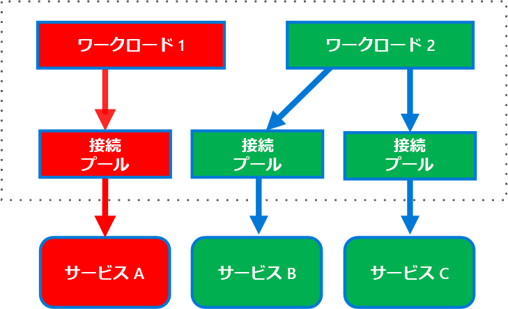
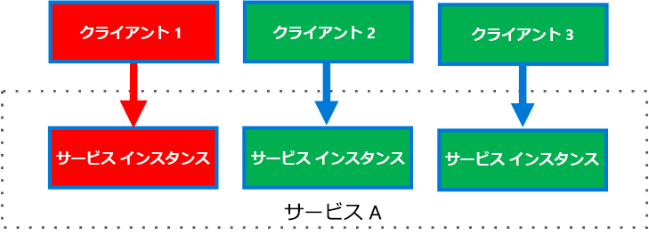

# <a name="bulkhead-pattern"></a>バルクヘッド パターン

アプリケーションの要素をプールに分離し、1 つの要素が失敗しても、他の要素が引き続き機能できるようにします。

このパターンは*バルクヘッド* (隔壁) という名前ですが、それは区分けされた船体部分に似ているためです。 船体が傷つけられた場合、水浸しになるのは破損した部分だけで、これによって船が沈むのを防ぎます。 

## <a name="context-and-problem"></a>コンテキストと問題

クラウド ベースのアプリケーションには複数のサービスが含まれ、各々のサービスは 1 つ以上のコンシューマーを持ちます。 サービスで過度の負荷やエラーがあると、そのサービスのすべてのコンシューマーに影響します。

さらに、コンシューマーは複数のサービスに同時に要求を送信し、要求ごとにリソースを使用しています。 コンシューマーが、正しく構成されていないまたは応答していないサービスに要求を送信すると、クライアントの要求で使用されるリソースが適切なタイミングで解放されない可能性があります。 このサービスへの要求が続くと、これらのリソースが不足する場合があります。 たとえば、クライアントの接続プールを使い果たすことがあります。 その時点で、このコンシューマーによる他のサービスへの要求が影響を受けます。 最終的にコンシューマーは、元々応答していないサービスだけでなく、他のサービスにも要求を送信できなくなります。

同様のリソース不足の問題が、複数のコンシューマーを伴うサービスに影響します。 1 つのクライアントから送信された大量の要求が、サービスで使用可能なリソースを使い果たす可能性があります。 他のコンシューマーがサービスを利用できなくなり、エラーが積み重なるという結果になります。

## <a name="solution"></a>解決策

コンシューマーの負荷と可用性の要件に基づいて、サービス インスタンスを別々のグループに分割します。 この設計は障害を特定するのに役立ち、障害中でも一部のコンシューマーに対してサービス機能を維持することができます。

コンシューマーはまた、リソースを分割し、1 つのサービスの呼び出しに使用されるリソースが別のサービスの呼び出しに使用されるリソースに影響しないようにできます。 たとえば、複数のサービスを呼び出すコンシューマーに、各々のサービス用の接続プールを割り当てることができます。 サービスが失敗し始めると、そのサービスに割り当てられている接続プールのみに影響し、コンシューマーは他のサービスを引き続き使用できます。

このパターンには次のような利点があります。

- コンシューマーとサービスを、障害の連鎖から分離します。 コンシューマーまたはサービスに影響する問題は、自身のバルクヘッド内に分離でき、ソリューション全体に障害が発生するのを妨ぎます。
- サービス エラーが発生した場合、一部の機能を保持できます。 アプリケーションのその他のサービスと機能は、引き続き機能します。
- 使用するアプリケーションに別の品質のサービスを提供するサービスを展開できます。 優先度の高いサービスを使用するように、優先度の高いコンシューマー プールを構成することができます。 

次の図は、個々 のサービスを呼び出す接続プールを中心に構造化したバルクヘッドを示しています。 サービス A で障害や他の問題が発生すると、接続プールが分離され、サービス A に割り当てられているスレッド プールを使用するワークロードだけが影響を受けます。 サービス B および C を使用するワークロードは影響を受けず、中断することなく機能し続けることができます。

 

次の図は、1 つのサービスを呼び出す複数のクライアントを示しています。 各クライアントには、別々のサービス インスタンスが割り当てられます。 クライアント 1 の要求が多すぎて、そのインスタンスを圧迫しています。 各サービス インスタンスは他から分離されているため、他のクライアントは呼び出しを続行することができます。


     
## <a name="issues-and-considerations"></a>問題と注意事項

- アプリケーションのビジネス要件と技術的要件を中心にパーティションを定義します。
- サービスまたはコンシューマーをバルクヘッドに分割するときは、コスト、パフォーマンス、管理容易性の観点からのオーバーヘッドと、テクノロジによる分離レベルを考慮してください。
- より高度なエラー処理を提供するために、バルクヘッドを再試行、サーキット ブレーカー、調整パターンと組み合わせることを検討してください。
- コンシューマーをバルクヘッドに分割する場合は、プロセス、スレッド プール、およびセマフォの使用を検討します。 [Netflix Hystrix][hystrix] および [Polly][polly] のようなプロジェクトは、コンシューマー バルクヘッドを作成するためのフレームワークを提供しています。
- サービスをバルクヘッドに分割する場合は、別々 の仮想マシン、コンテナー、またはプロセスに展開することを検討してください。 コンテナーは、かなり少ないオーバーヘッドで、バランスのとれたリソース分離を提供します。
- 非同期メッセージを使用して通信するサービスは、異なるセットのキューを介して分離することができます。 各キューは、そのキュー上のメッセージを処理するインスタンスの専用セット、または、デキューして処理をディスパッチするアルゴリズムを使用するインスタンスの単一グループを持つことができます。
- バルクヘッドの細分性のレベルを決定します。 たとえば、テナントをパーティションに分散する場合は、各テナントを別のパーティションに配置するか、1 つのパーティションに複数のテナントを置きます。
- 各パーティションのパフォーマンスと SLA を監視します。

## <a name="when-to-use-this-pattern"></a>このパターンを使用する状況

このパターンは次の目的で使用します。

- バックエンド サービスのセットを使用するのに使われているリソースを分離する。特に、サービスのいずれかが応答していない場合でも、アプリケーションがなんらかのレベルの機能を提供できる場合。
- 標準的なコンシューマーから重要なコンシューマーを分離する。
- エラーの連鎖からアプリケーションを保護する。

このパターンは、次の状況では適切でない可能性があります。

- プロジェクト内で、効率性の低いリソース使用は受け入れられない。
- 複雑さを追加する必要はない。

## <a name="example"></a>例

次の Kubernetes 構成ファイルでは、独自の CPU とメモリ リソースと制限で 1 つのサービスを実行する、分離されたコンテナーを作成します。

```yml
apiVersion: v1
kind: Pod
metadata:
  name: drone-management
spec:
  containers:
  - name: drone-management-container
    image: drone-service
    resources:
      requests:
        memory: "64Mi"
        cpu: "250m"
      limits:
        memory: "128Mi"
        cpu: "1"
```

## <a name="related-guidance"></a>関連するガイダンス

- [サーキット ブレーカー パターン](./circuit-breaker.md)
- [回復性に優れた Azure 用アプリケーションの設計](../resiliency/index.md)
- [再試行パターン](./retry.md)
- [調整パターン](./throttling.md)


<!-- links -->

[hystrix]: https://github.com/Netflix/Hystrix
[polly]: https://github.com/App-vNext/Polly