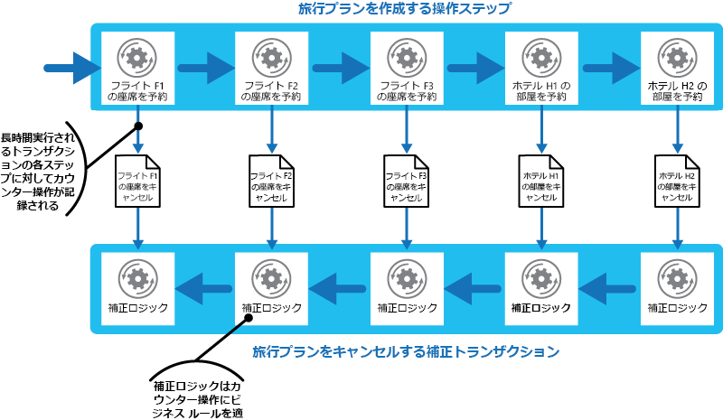

# 補正トランザクション パターン

[!INCLUDE [header](../_includes/header.md)]

最終的に整合性がある操作を定義する一連のステップの中で、1 つ以上のステップが失敗した場合に、実行された作業を元に戻します。 最終的整合性モデルに従う操作は、複雑なビジネス プロセスとワークフローを実装するクラウド ホスト型アプリケーションでよく見られます。

## コンテキストと問題

クラウドで実行されるアプリケーションでは、データが頻繁に変更されます。 このデータは、異なる地理的場所に保持されているさまざまなデータ ソースに散在する可能性があります。 分散環境で競合を回避しパフォーマンスを向上させるために、アプリケーションは、常にトランザクションの整合性を維持しようと努力すべきではありません。 代わりに、アプリケーションで最終的整合性を実装します。 このモデルでは、一般的なビジネス操作は、一連の独立したステップで構成されます。 これらのステップの実行中は、システムの全体的な状態は整合性がないように見えますが、操作が完了してすべてのステップが実行されると、システムは再び整合性のある状態に戻ります。

> 分散トランザクションでスケーリングが適切に機能しない理由と最終的整合性モデルの原理に関する情報については、「[Data Consistency Primer](https://msdn.microsoft.com/library/dn589800.aspx)」(データ整合性入門) を参照してください。

最終的整合性モデルの課題は、失敗したステップをどのように処理するかです。 ステップが失敗した場合は、操作内のそれまでのステップによって完了された作業をすべて元に戻す必要が生じることがあります。 ただし、アプリケーションの他の同時実行インスタンスがデータを変更している場合があるため、データを単純にロールバックすることはできません。 同時実行インスタンスによるデータの変更がない場合でも、ステップを元に戻すことは、単に元の状態を復元するという問題ではないことがあります。 場合によっては、さまざまなビジネス固有の規則を適用する必要があります (「例」セクションで説明する旅行 Web サイトを参照してください)。

最終的整合性を実装する操作が複数の異種データ ストアにまたがっている場合、操作内のステップを元に戻すには、各データ ストアに順にアクセスする必要があります。 システムに不整合が残らないようにするために、すべてのデータ ストアで実行された作業を確実に元に戻す必要があります。

最終的整合性を実装する操作によって影響を受けるすべてのデータが、データベースに保持されているわけではありません。 サービス指向アーキテクチャ (SOA) 環境では、操作によってサービス内のアクションが呼び出され、それによって、そのサービスが保持している状態が変更される可能性があります。 この操作を元に戻すには、この状態の変更も元に戻す必要があります。 これを行うには、サービスをもう一度呼び出して、最初のアクションによる影響を逆転させる別のアクションの実行が必要になる可能性があります。

## 解決策

解決策は、補正トランザクションを実装することです。 補正トランザクション内のステップは、元の操作内のステップの影響を元に戻す必要があります。 場合によっては、補正トランザクションは、現在の状態を、操作開始時のシステムの状態に単純に置き換えることはできません。この方法では、アプリケーションの他の同実行インスタンスによって行なわれた変更が上書きされる可能性があるためです。 補正トランザクションは、同時実行インスタンスによって実行されたすべての作業を考慮に入れたインテリジェントなプロセスである必要があります。 このプロセスは、通常はアプリケーション固有であり、元の操作によって実行される作業の性質に依存します。

一般的な方法は、補正を必要とする最終的に整合性がある操作を実装するワークフローを使用することです。 元の操作が進行するときに、システムは、各ステップに関する情報と、そのステップで実行された作業を元に戻す方法を記録します。 ある時点で操作が失敗した場合、ワークフローは、完了したステップを巻き戻して各ステップを逆転させる作業を実行します。 場合によっては、補正トランザクションは、元の操作と正反対の順序で作業を元に戻す必要がなく、一部の元に戻す操作は並列で実行できます。

> この方法は、[Clemens Vasters のブログ](https://vasters.com/clemensv/2012/09/01/Sagas.aspx)で説明されている Sagas 戦略に似ています。

補正トランザクションも最終的に整合性がある操作であるため、失敗する可能性があります。 システムは、失敗した時点で補正トランザクションを再開して続行できる必要があります。 場合によっては、失敗したステップを繰り返して、補正トランザクション内のステップをべき等コマンドとして定義する必要があります。 詳細については、[べき等パターン](https://blog.jonathanoliver.com/idempotency-patterns/)に関する Jonathan Oliver のブログを参照してください。

失敗したステップからの回復が、手動による介入以外では実行できないことがあります。 この場合、システムはアラートを発生させ、失敗の理由についてできるだけ多くの情報を提供する必要があります。

## 問題と注意事項

このパターンの実装方法を決めるときには、以下の点に注意してください。

最終的な整合性を実装する操作内のステップがいつ失敗したのかを容易に判断できない場合があります。 場合によっては、ステップはすぐに失敗するのではなく、ブロックされる可能性があります。 何らかの形でタイムアウト メカニズムを実装する必要があります。

- 補正ロジックの一般化は容易ではありません。 補正トランザクションは、アプリケーション固有です。 失敗した操作の各ステップの影響を元に戻すには、アプリケーションが十分な情報を持っている必要があります。

補正トランザクション内のステップは、べき等コマンドとして定義する必要があります。 これにより、補正トランザクション自体が失敗した場合に、ステップを繰り返すことができます。

元の操作内のステップを処理するインフラストラクチャと補正トランザクションは、回復力を持っている必要があります。 失敗したステップを補正するために必要な情報が失われることがなく、補正ロジックの進行状況を確実に監視できる必要があります。

補正トランザクションは、システムのデータを常に元の操作の開始時の状態に戻す必要はありません。 代わりに、操作が失敗する前に正常に完了したステップによって実行された作業を補正します。

補正トランザクション内のステップの順序は、必ず元の操作内のステップの正反対の順序にする必要があるわけではありません。 たとえば、あるデータ ストアのほうが他のデータストアよりも不整合の影響を受けやすい場合は、そのストアに対する変更を元に戻すステップを補正トランザクション内で先に実行する必要があります。

操作を完了するために必要な各リソースに短期のタイムアウト ベースのロックを配置して、それらのリソースを事前に取得しておくことで、アクティビティ全体が成功する確率を上げることができます。 すべてのリソースが取得された後でのみ、作業を実行する必要があります。 ロックが期限切れになる前に、すべてのアクションを終了する必要があります。

補正トランザクションをトリガーするエラーを最小限に抑えるために、通常よりも寛容な再試行ロジックの使用を検討します。 最終的な整合性を実装する操作内のステップが失敗した場合は、エラーを一時的な例外として処理してステップを繰り返すことを試みます。 ステップが繰り返し失敗するか回復できない場合のみ、操作を停止して補正トランザクションを開始します。

> 補正トランザクションの実装に関する課題の多くは、最終的整合性を実装するための課題と同じです。 詳細については、「[Data Consistency Primer ](https://msdn.microsoft.com/library/dn589800.aspx)」(データ整合性入門) の最終的整合性を実装するための考慮事項に関するセクションを参照してください。

## このパターンを使用する状況

このパターンは、失敗した場合は元に戻す必要がある操作に対してのみ使用します。 可能であれば、補正トランザクションを必要とする複雑さを持たないようにソリューションを設計します。

## 例

旅行 Web サイトで、顧客は旅行プランを予約できます。 旅行プランは、一連の航空券とホテルの予約で構成される可能性があります。 シアトルからロンドンへ、ロンドンからパリに旅行する顧客は、旅行プランを作成するときに次のステップを実行する可能性があります。

1. シアトルからロンドンへのフライト F1 の座席を予約する。
2. ロンドンからパリへのフライト F2 の座席を予約する。
3. パリからシアトルへの F3 便の座席を予約する。
4. ロンドンのホテル H1 の部屋を予約する。
5. パリのホテル H2 の部屋を予約する。

これらのステップは、最終的に整合性がある操作を構成しますが、各ステップは独立したアクションです。 そのため、システムは、これらのステップを実行するだけではなく、顧客がこの旅行プランをキャンセルした場合に各ステップを元に戻すために必要なカウンター操作も記録しておく必要があります。 カウンター操作を実行するために必要なステップを補正トランザクションとして実行できます。

補正トランザクション内のステップの順序は元のステップの正反対ではない場合があること、補正トランザクション内の各ステップのロジックはビジネス固有のルールを考慮に入れる必要があることに注意します。 たとえば、ある航空券の予約を取り消しても、支払い済みの費用の全額が顧客に返金されるとは限りません。 図は、旅行プランを予約するために長時間実行されるトランザクションを元に戻すための補正トランザクションの生成を示しています。

> [!NOTE]
> 各ステップに対する補正ロジックの設計方法によっては、補正トランザクション内の手順を並列で実行できる場合があります。

多くのビジネス ソリューションでは、1 つのステップの失敗によって、補正トランザクションを使用したシステムのロールバックが常に必要になるわけではありません。 たとえば、&mdash;旅行 Web サイトのシナリオで、顧客が F1 便、F2 便、および F3 便を予約した後で&mdash;、ホテル H1 の部屋を予約できなかった場合、望ましいのは航空券の予約を取り消すことではなく、同じ市内にある別のホテルを提案することです。 顧客はこの旅行プランをキャンセルすると決めることができます (この場合、補正トランザクションが実行され、F1 便、F2 便、および F3 便の予約が元に戻されます) が、この決定は、システムではなく顧客が行う必要があります。

## 関連のあるパターンとガイダンス

このパターンを実装する場合は、次のパターンとガイダンスも関連している可能性があります。

- [Data consistency primer (データ整合性入門)](https://msdn.microsoft.com/library/dn589800.aspx)。 最終的整合性モデルを実装する操作を元に戻すには、補正トランザクション パターンがよく使用されます。 この入門では、最終的整合性の利点とトレードオフについて説明します。

- [Scheduler-Agent-Supervisor パターン](./scheduler-agent-supervisor.md)。 分散型サービスとリソースを使用するビジネス操作を実行する、回復力のあるシステムを実装する方法について説明します。 場合によっては、操作によって実行された作業を補正トランザクションを使用して元に戻す必要があります。

- [再試行パターン](./retry.md)。 補正トランザクションの実行は負荷が高くなる可能性があり、場合によっては、失敗した操作を再試行パターンに従って再試行する有効なポリシーを実装することによって、その使用を最小限に抑えることができます。
