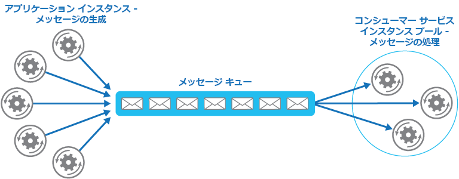

# <a name="competing-consumers-pattern"></a>競合コンシューマー パターン

[!INCLUDE [header](../_includes/header.md)]

複数の同時実行コンシューマーが、同じメッセージング チャネルで受信したメッセージを処理できるようにします。 このパターンでは、システムは複数のメッセージを同時に処理して、スループットを最適化し、スケーラビリティと可用性を向上させ、ワークロードのバランスを取ることができます。

## <a name="context-and-problem"></a>コンテキストと問題

クラウドで実行されるアプリケーションには、多数の要求を処理することが求められます。 各要求を同期的に処理するのではなく、アプリケーションがメッセージング システムを介して、要求を非同期で処理する別のサービス (コンシューマー サービス) に要求を渡すのが一般的な手法です。 この方法では、要求が処理されている間に、アプリケーションのビジネス ロジックがブロックされないようにすることができます。

多くの理由から、要求の数が経時的に大きく変わる可能性があります。 ユーザー アクティビティや複数のテナントから集約された要求の急増により、予測不可能なワークロードが発生する場合があります。 ピーク時には、システムは 1 秒あたり何百件もの要求を処理する必要がありますが、他の時間帯は要求数が非常に少ない可能性があります。 さらに、これらの要求を処理するために実行される作業の性質は非常に多様であると考えられます。 コンシューマー サービスのインスタンスを 1 つしか使用していない場合、そのインスタンスが要求で溢れてしまう可能性があります。また、アプリケーションから送信されるメッセージの流入によって、メッセージング システムが過負荷になることもあります。 この変動するワークロードを処理するために、システムはコンシューマー サービスの複数のインスタンスを実行できます。 ただし、各メッセージが 1 つのコンシューマーにのみ配信されるように、これらのコンシューマーを調整する必要があります。 また、コンシューマー間でワークロードを負荷分散して、インスタンスがボトルネックにならないようにする必要があります。

## <a name="solution"></a>解決策

メッセージ キューを使用して、アプリケーションとコンシューマー サービスのインスタンス間の通信チャネルを実装します。 アプリケーションは要求をメッセージの形でキューに入れ、コンシューマー サービス インスタンスはキューからメッセージを受け取って処理します。 この方法を使用すると、コンシューマー サービス インスタンスの同じプールで、アプリケーションのインスタンスからのメッセージを処理できます。 次の図は、メッセージ キューを使用した複数のサービス インスタンスへの処理の分散を示しています。



このソリューションには次の利点があります。

- アプリケーション インスタンスから送信される要求量が大幅に変動する場合でも要求を処理できる負荷平準化システムがあります。 キューは、アプリケーション インスタンスとコンシューマー サービス インスタンス間のバッファーとして機能します。 これは、「[Queue-based Load Leveling pattern](queue-based-load-leveling.md)」(キューベースの負荷平準化パターン) で説明されているよう、アプリケーションとサービス インスタンスの両方の可用性と応答性に影響を最小限に抑えるために役立ちます。 一部の実行時間が長い処理が必要なメッセージの処理では、コンシューマー サービスの他のインスタンスによる他のメッセージの同時処理が回避されません。

- そのため、信頼性が向上します。 プロデューサーがこのパターンを使用するのではなく、コンシューマーと直接通信し、コンシューマーの監視は行わない場合、コンシューマーが失敗したときにメッセージが失われたり、処理に失敗したりする可能性が高くなります。 このパターンでは、メッセージは特定のサービス インスタンスに送信されません。 失敗したサービス インスタンスによってプロデューサーはブロックされず、機能している任意のサービス インスタンスがメッセージを処理できます。

- コンシューマー間、またはプロデューサー インスタンスとコンシューマー インスタンス間に複雑な調整は必要ありません。 メッセージ キューによって、各メッセージは少なくとも 1 回は配信されます。

- スケーラブルです。 メッセージ量の変動に応じて、システムはコンシューマー サービスのインスタンス数を動的に増減することができます。

- メッセージ キューでトランザクションの読み取り操作を提供する場合、回復性を改善できます。 コンシューマー サービス インスタンスがトランザクション操作の一環としてメッセージの読み取りと処理を行い、コンシューマー サービス インスタンスが失敗した場合、このパターンによってメッセージはキューに返され、コンシューマー サービスの別インスタンスで受け取り、処理することができます。

## <a name="issues-and-considerations"></a>問題と注意事項

このパターンの実装方法を決めるときには、以下の点に注意してください。

- **メッセージの順序付け**。 コンシューマー サービス インスタンスでメッセージを受け取る順序は保証されていません。また、メッセージが作成された順序を反映しているとは限りません。 メッセージが処理される順序への依存を排除できるので、メッセージ処理がべき等になるようにシステムを設計します。 詳細については、Jonathan Oliver のブログ「[Idempotency Patterns](http://blog.jonathanoliver.com/idempotency-patterns/)」(べき等パターン) を参照してください。

    > Microsoft Azure Service Bus Queues は、メッセージ セッションを使用して、保証された先入れ先出しの順序を実装することができます。 詳細については、「[セッションを使用するメッセージング パターン](https://msdn.microsoft.com/magazine/jj863132.aspx)」を参照してください。

- **回復性に対応するサービスの設計**。 失敗したサービス インスタンスを検出して再起動するようにシステムを設計する場合、必要に応じて、サービス インスタンスがべき等操作として実行する処理を実装し、単一のメッセージが複数回取得および処理される影響を最小限に抑えます。

- **有害メッセージの検出**。 不適切な形式のメッセージ、または使用できないリソースにアクセスする必要があるタスクによって、サービス インスタンスが失敗する可能性があります。 システムでこのようなメッセージがキューに返されないように防ぎ、代わりにこれらのメッセージをキャプチャしてどこか別の場所に格納して、必要に応じて分析できるようにすることをお勧めします。

- **結果の処理**。 メッセージを処理するサービス インスタンスは、メッセージを生成するアプリケーション ロジックから完全に切り離されているので、直接通信できない可能性があります。 サービス インスタンスから、アプリケーション ロジックに戻す必要がある結果が生成される場合、この情報は、両方からアクセスできる場所に保存する必要があります。 アプリケーション ロジックで不完全なデータが取得されないようにするために、システムで処理が完了したときを示す必要があります。

     > Azure を使用している場合、ワーカー プロセスで専用のメッセージ返信キューを使用することで、アプリケーション ロジックに結果を戻すことができます。 アプリケーション ロジックで、このような結果を元のメッセージと関連付けられる必要があります。 このシナリオの詳細については、「[Asynchronous Messaging Primer](https://msdn.microsoft.com/library/dn589781.aspx)」(非同期メッセージングの基本) を参照してください。

- **メッセージング システムのスケーリング**。 大規模なソリューションの場合、1 つのメッセージ キューが大量のメッセージで一杯になり、システムのボトルネックになる可能性があります。 このような場合は、メッセージング システムをパーティション分割し、特定のプロデューサーからのメッセージを特定のキューに送信するか、負荷分散を使用して、複数のメッセージ キュー全体にメッセージを分散させることを検討します。

- **メッセージング システムの信頼性を確保**。 信頼できるメッセージング システムは、アプリケーションがメッセージをキューに格納した後に、メッセージが失われないことを保証する必要があります。 これは、すべてのメッセージを少なくとも 1 回配信するために重要です。

## <a name="when-to-use-this-pattern"></a>このパターンを使用する状況

このパターンは次の状況で使用します。

- アプリケーションのワークロードは、非同期に実行できる複数のタスクに分割されます。
- タスクは独立しており、並列して実行できます。
- 作業量の変動が大きい場合、スケーラブルなソリューションが必要です。
- ソリューションは高可用性を提供する必要があります。また、タスクの処理が失敗した場合に回復できる必要があります。

このパターンが適さない状況

- アプリケーションのワークロードを個別のタスクに分離することが容易ではない場合、またはタスク間の依存度が高い場合。
- タスクを同期して実行する必要があり、アプリケーション ロジックで 1 つのタスクが完了するまで待ってから続行する必要がある場合。
- 特定の順序でタスクを実行する必要がある場合。

> 一部のメッセージング システムは、プロデューサーがメッセージをグループ化し、そのすべてを同じコンシューマーが処理するように確保するセッションをサポートしています。 このメカニズムを優先度が付けられたメッセージ (優先度付けがサポートされている場合) に使用して、プロデューサーから単一のコンシューマーに対して順番にメッセージを配信するメッセージの順序付けのフォームを実装することができます。

## <a name="example"></a>例

Azure には、このパターンを実装するメカニズムとして機能するストレージ キューと Service Bus キューが用意されています。 アプリケーション ロジックで、メッセージをキューに投稿できます。また、1 つ以上のロールでタスクとして実装されているコンシューマーで、このキューからメッセージを取得し、処理することができます。 Service Bus キューでは回復性のために、コンシューマーがキューからメッセージを取得するときに `PeekLock` モードを使用できます。 このモードでは、メッセージは実際に削除されず、他のコンシューマーには単に非表示にされます。 元のコンシューマーは、処理の完了時にメッセージを削除できます。 コンシューマーが失敗した場合はピーク ロックがタイムアウトし、メッセージは再び可視状態になり、別のコンシューマーが取得できるようになります。

> Azure Service Bus キューの使用の詳細については、「[Service Bus のキュー、トピック、サブスクリプション](https://msdn.microsoft.com/library/windowsazure/hh367516.aspx)」を参照してください。
Azure Storage キューの使用の詳細については、「[.NET を使用して Azure Queue Storage を使用する](https://azure.microsoft.com/documentation/articles/storage-dotnet-how-to-use-queues/)」を参照してください。

[GitHub](https://github.com/mspnp/cloud-design-patterns/tree/master/competing-consumers) で入手できる CompetingConsumers ソリューションの `QueueManager` クラスから引用した次のコードは、Web または worker ロールで `Start` イベント ハンドラーの `QueueClient` インスタンスを使用してキューを作成する方法を示しています。

```csharp
private string queueName = ...;
private string connectionString = ...;
...

public async Task Start()
{
  // Check if the queue already exists.
  var manager = NamespaceManager.CreateFromConnectionString(this.connectionString);
  if (!manager.QueueExists(this.queueName))
  {
    var queueDescription = new QueueDescription(this.queueName);

    // Set the maximum delivery count for messages in the queue. A message
    // is automatically dead-lettered after this number of deliveries. The
    // default value for dead letter count is 10.
    queueDescription.MaxDeliveryCount = 3;

    await manager.CreateQueueAsync(queueDescription);
  }
  ...

  // Create the queue client. By default the PeekLock method is used.
  this.client = QueueClient.CreateFromConnectionString(
    this.connectionString, this.queueName);
}
```

次のコード スニペットは、アプリケーションでメッセージのバッチを作成し、キューに送信する方法を示しています。

```csharp
public async Task SendMessagesAsync()
{
  // Simulate sending a batch of messages to the queue.
  var messages = new List<BrokeredMessage>();

  for (int i = 0; i < 10; i++)
  {
    var message = new BrokeredMessage() { MessageId = Guid.NewGuid().ToString() };
    messages.Add(message);
  }
  await this.client.SendBatchAsync(messages);
}
```

次のコードは、コンシューマー サービス インスタンスが、イベント主導の手法に従ってキューからメッセージを受け取る方法を示しています。 `ReceiveMessages` メソッドに対する `processMessageTask` パラメーターは、メッセージを受け取ったときに実行するコードを参照するデリゲートです。 このコードは非同期に実行されます。

```csharp
private ManualResetEvent pauseProcessingEvent;
...

public void ReceiveMessages(Func<BrokeredMessage, Task> processMessageTask)
{
  // Set up the options for the message pump.
  var options = new OnMessageOptions();

  // When AutoComplete is disabled it's necessary to manually
  // complete or abandon the messages and handle any errors.
  options.AutoComplete = false;
  options.MaxConcurrentCalls = 10;
  options.ExceptionReceived += this.OptionsOnExceptionReceived;

  // Use of the Service Bus OnMessage message pump.
  // The OnMessage method must be called once, otherwise an exception will occur.
  this.client.OnMessageAsync(
    async (msg) =>
    {
      // Will block the current thread if Stop is called.
      this.pauseProcessingEvent.WaitOne();

      // Execute processing task here.
      await processMessageTask(msg);
    },
    options);
}
...

private void OptionsOnExceptionReceived(object sender,
  ExceptionReceivedEventArgs exceptionReceivedEventArgs)
{
  ...
}
```

Azure などで使用できる自動スケール機能を使用して、キューの長さの変動に応じてロール インスタンスを開始および停止できます。 詳細については、[自動スケールのガイダンス](https://msdn.microsoft.com/library/dn589774.aspx)を参照してください。 また、ロール インスタンスとワーカー プロセス間に 1 対 1 の対応が維持されているとは限りません。1 つのロール インスタンスが複数のワーカー プロセスを実装している可能性があります。 詳細については、「[Compute Resource Consolidation pattern](compute-resource-consolidation.md)」(コンピューティング リソース統合パターン) を参照してください。

## <a name="related-patterns-and-guidance"></a>関連のあるパターンとガイダンス

このパターンを実装する場合は、次のパターンとガイダンスが関連している可能性があります。

- [非同期メッセージングの基本](https://msdn.microsoft.com/library/dn589781.aspx)。 メッセージ キューは、非同期通信メカニズムです。 コンシューマー サービスがアプリケーションに返信を送信する必要がある場合、状況に応じて何らかの形式の応答メッセージングを実装します。 「Asynchronous Messaging Primer」(非同期メッセージングの基本) では、メッセージ キューを使用して要求/返信メッセージングを実装する方法が説明されています。

- [自動スケール ガイダンス](https://msdn.microsoft.com/library/dn589774.aspx)。 キュー アプリケーションの投稿メッセージの長さは変動するので、コンシューマー サービスのインスタンスを開始および停止できることがあります。 自動スケールは、ピーク時処理中のスループットの維持に役立ちます。

- [コンピューティング リソース統合パターン](compute-resource-consolidation.md)。 複数のインスタンスのコンシューマー サービスを 1 つのプロセスに統合して、コストと管理のオーバーヘッドを軽減できることがあります。 「Compute Resource Consolidation」(コンピューティング リソース統合パターン) では、この手法に従う場合の利点とトレードオフについて説明しています。

- [キューベースの負荷平準化パターン](queue-based-load-leveling.md)。 メッセージ キューを導入すると、システムに回復性が加わり、アプリケーション インスタンスからの変動が大きい要求量をサービス インスタンスで処理できるようになります。 メッセージ キューはバッファーとして機能し、負荷が平準化されます。 「Queue-based Load Leveling pattern」(キューベースの負荷平準化パターン) では、このスキーマについて詳しく説明しています。

- このパターンには、[サンプル アプリケーション](https://github.com/mspnp/cloud-design-patterns/tree/master/competing-consumers)が関連付けられています。
