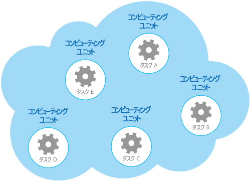

# <a name="compute-resource-consolidation-pattern"></a><span data-ttu-id="ce7cf-104">コンピューティング リソース統合パターン</span><span class="sxs-lookup"><span data-stu-id="ce7cf-104">Compute Resource Consolidation pattern</span></span>

[!INCLUDE [header](../_includes/header.md)]

<span data-ttu-id="ce7cf-105">複数のタスクまたは操作を 1 つのコンピューティング単位に統合します。</span><span class="sxs-lookup"><span data-stu-id="ce7cf-105">Consolidate multiple tasks or operations into a single computational unit.</span></span> <span data-ttu-id="ce7cf-106">これにより、コンピューティング リソースの使用率を高め、クラウドでホストされるアプリケーションでコンピューティング処理を実行することに関連するコストと管理オーバーヘッドを削減できます。</span><span class="sxs-lookup"><span data-stu-id="ce7cf-106">This can increase compute resource utilization, and reduce the costs and management overhead associated with performing compute processing in cloud-hosted applications.</span></span>

## <a name="context-and-problem"></a><span data-ttu-id="ce7cf-107">コンテキストと問題</span><span class="sxs-lookup"><span data-stu-id="ce7cf-107">Context and problem</span></span>

<span data-ttu-id="ce7cf-108">多くの場合、クラウド アプリケーションはさまざまな操作を実装しています。</span><span class="sxs-lookup"><span data-stu-id="ce7cf-108">A cloud application often implements a variety of operations.</span></span> <span data-ttu-id="ce7cf-109">一部のソリューションでは、最初に問題分離の設計原則に従い、これらの操作を、独立してホストされ、デプロイされる別個のコンピューティング単位 (別個の App Service Web アプリ、別個の仮想マシン、または別個の Cloud Service ロール) に分割するのが理にかなっています。</span><span class="sxs-lookup"><span data-stu-id="ce7cf-109">In some solutions it makes sense to follow the design principle of separation of concerns initially, and divide these operations into separate computational units that are hosted and deployed individually (for example, as separate App Service web apps, separate Virtual Machines, or separate Cloud Service roles).</span></span> <span data-ttu-id="ce7cf-110">ただしこの戦略は、ソリューションの論理設計を簡略化する助けにはなりますが、多数のコンピューティング単位を同じアプリケーションの一部としてデプロイすることで、実行時のホストのコストが増加し、システムの管理がより複雑になる可能性があります。</span><span class="sxs-lookup"><span data-stu-id="ce7cf-110">However, although this strategy can help simplify the logical design of the solution, deploying a large number of computational units as part of the same application can increase runtime hosting costs and make management of the system more complex.</span></span>

<span data-ttu-id="ce7cf-111">例として、図に、複数のコンピューティング単位を使用して実装された、クラウドでホストされるソリューションの簡略化された構造を示します。</span><span class="sxs-lookup"><span data-stu-id="ce7cf-111">As an example, the figure shows the simplified structure of a cloud-hosted solution that is implemented using more than one computational unit.</span></span> <span data-ttu-id="ce7cf-112">各コンピューティング単位は、独自の仮想環境で実行されます。</span><span class="sxs-lookup"><span data-stu-id="ce7cf-112">Each computational unit runs in its own virtual environment.</span></span> <span data-ttu-id="ce7cf-113">各機能は、独自のコンピューティング単位で実行される別個のタスク (タスク A からタスク E までラベル付けされてます) として実装されています。</span><span class="sxs-lookup"><span data-stu-id="ce7cf-113">Each function has been implemented as a separate task (labeled Task A through Task E) running in its own computational unit.</span></span>




<span data-ttu-id="ce7cf-115">各コンピューティング単位は、アイドル状態や軽い負荷で使用されているときでも課金対象のリソースを消費します。</span><span class="sxs-lookup"><span data-stu-id="ce7cf-115">Each computational unit consumes chargeable resources, even when it's idle or lightly used.</span></span> <span data-ttu-id="ce7cf-116">そのため、これが常に最もコスト効果の高いソリューションであるとは限りません。</span><span class="sxs-lookup"><span data-stu-id="ce7cf-116">Therefore, this isn't always the most cost-effective solution.</span></span>

<span data-ttu-id="ce7cf-117">Azure では、この問題は Cloud Service、App Services、および仮想マシンのロールにも当てはまります。</span><span class="sxs-lookup"><span data-stu-id="ce7cf-117">In Azure, this concern applies to roles in a Cloud Service, App Services, and Virtual Machines.</span></span> <span data-ttu-id="ce7cf-118">これらの項目は、独自の仮想環境で実行されます。</span><span class="sxs-lookup"><span data-stu-id="ce7cf-118">These items run in their own virtual environment.</span></span> <span data-ttu-id="ce7cf-119">適切に定義された操作のセットを実行するために設計されていても、単一ソリューションの一部として通信し、連携する必要がある別個のロール、Web サイト、または仮想マシンのコレクションを実行すると、リソースを非効率的に使用することになる可能性があります。</span><span class="sxs-lookup"><span data-stu-id="ce7cf-119">Running a collection of separate roles, websites, or virtual machines that are designed to perform a set of well-defined operations, but that need to communicate and cooperate as part of a single solution, can be an inefficient use of resources.</span></span>

## <a name="solution"></a><span data-ttu-id="ce7cf-120">解決策</span><span class="sxs-lookup"><span data-stu-id="ce7cf-120">Solution</span></span>

<span data-ttu-id="ce7cf-121">コストの削減、使用率の向上、通信速度の向上、および管理の削減に役立つように、複数のタスクや操作を 1 つのコンピューティング単位に統合することが可能です。</span><span class="sxs-lookup"><span data-stu-id="ce7cf-121">To help reduce costs, increase utilization, improve communication speed, and reduce management it's possible to consolidate multiple tasks or operations into a single computational unit.</span></span>

<span data-ttu-id="ce7cf-122">タスクは、環境によって提供される機能と、それらの機能に関連するコストに基づく条件に従ってグループ化できます。</span><span class="sxs-lookup"><span data-stu-id="ce7cf-122">Tasks can be grouped according to criteria based on the features provided by the environment and the costs associated with these features.</span></span> <span data-ttu-id="ce7cf-123">よく使われるのは、スケーラビリティ、有効期間、および処理の要件に関するプロファイルが類似しているタスクを探す方法です。</span><span class="sxs-lookup"><span data-stu-id="ce7cf-123">A common approach is to look for tasks that have a similar profile concerning their scalability, lifetime, and processing requirements.</span></span> <span data-ttu-id="ce7cf-124">これらを一緒にグループ化すると、単位としてスケールできます。</span><span class="sxs-lookup"><span data-stu-id="ce7cf-124">Grouping these together allows them to scale as a unit.</span></span> <span data-ttu-id="ce7cf-125">多くのクラウド環境で提供される柔軟性により、コンピューティング単位の追加インスタンスをワークロードに従って開始および停止できます。</span><span class="sxs-lookup"><span data-stu-id="ce7cf-125">The elasticity provided by many cloud environments enables additional instances of a computational unit to be started and stopped according to the workload.</span></span> <span data-ttu-id="ce7cf-126">たとえば Azure には、Cloud Service、App Services、および仮想マシンのロールに適用できる自動スケールが用意されています。</span><span class="sxs-lookup"><span data-stu-id="ce7cf-126">For example, Azure provides autoscaling that you can apply to roles in a Cloud Service, App Services, and Virtual Machines.</span></span> <span data-ttu-id="ce7cf-127">詳細については、「[自動スケールのガイダンス](https://msdn.microsoft.com/library/dn589774.aspx)」を参照してください。</span><span class="sxs-lookup"><span data-stu-id="ce7cf-127">For more information, see [Autoscaling Guidance](https://msdn.microsoft.com/library/dn589774.aspx).</span></span>

<span data-ttu-id="ce7cf-128">どの操作を一緒にグループ化してはいけないかを確認するため、スケーラビリティをどう使用できるかを示す逆の例として、次の 2 つのタスクについて考えてみてください。</span><span class="sxs-lookup"><span data-stu-id="ce7cf-128">As a counter example to show how scalability can be used to determine which operations shouldn't be grouped together, consider the following two tasks:</span></span>

- <span data-ttu-id="ce7cf-129">タスク 1 では、低い頻度でキューに送信される、時間的区別がないメッセージをポーリングします。</span><span class="sxs-lookup"><span data-stu-id="ce7cf-129">Task 1 polls for infrequent, time-insensitive messages sent to a queue.</span></span>
- <span data-ttu-id="ce7cf-130">タスク 2 では、急増する大量のネットワーク トラフィックを処理します。</span><span class="sxs-lookup"><span data-stu-id="ce7cf-130">Task 2 handles high-volume bursts of network traffic.</span></span>

<span data-ttu-id="ce7cf-131">2 番目のタスクでは、コンピューティング単位の多数のインスタンスの開始と停止を伴うことがある弾力性が求められます。</span><span class="sxs-lookup"><span data-stu-id="ce7cf-131">The second task requires elasticity that can involve starting and stopping a large number of instances of the computational unit.</span></span> <span data-ttu-id="ce7cf-132">同じスケールを最初のタスクに適用すると、同じキューで頻度が低いメッセージをリッスンするタスクが増える結果となるだけで、それはリソースの無駄です。</span><span class="sxs-lookup"><span data-stu-id="ce7cf-132">Applying the same scaling to the first task would simply result in more tasks listening for infrequent messages on the same queue, and is a waste of resources.</span></span>

<span data-ttu-id="ce7cf-133">多くのクラウド環境では、CPU コアの数、メモリ、ディスク領域などの点で、コンピューティング単位が使用できるリソースを指定することが可能です。</span><span class="sxs-lookup"><span data-stu-id="ce7cf-133">In many cloud environments it's possible to specify the resources available to a computational unit in terms of the number of CPU cores, memory, disk space, and so on.</span></span> <span data-ttu-id="ce7cf-134">一般に、多くのリソースを指定するだけコストが増加します。</span><span class="sxs-lookup"><span data-stu-id="ce7cf-134">Generally, the more resources specified, the greater the cost.</span></span> <span data-ttu-id="ce7cf-135">コストを節約するには、高価なコンピューティング単位が実行する作業を最大化し、長期間にわたってコンピューティング単位が非アクティブにならないようにすることが重要です。</span><span class="sxs-lookup"><span data-stu-id="ce7cf-135">To save money, it's important to maximize the work an expensive computational unit performs, and not let it become inactive for an extended period.</span></span>

<span data-ttu-id="ce7cf-136">短時間に CPU パワーを大量に必要とする複数のタスクがある場合、それらのタスクを、必要なパワーを提供する 1 つのコンピューティング単位に統合することを検討してください。</span><span class="sxs-lookup"><span data-stu-id="ce7cf-136">If there are tasks that require a great deal of CPU power in short bursts, consider consolidating these into a single computational unit that provides the necessary power.</span></span> <span data-ttu-id="ce7cf-137">ただし、高価なリソースをビジー状態に維持する必要性と、リソースに負荷が掛りすぎた場合に発生する可能性がある競合とのバランスを取ることが重要です。</span><span class="sxs-lookup"><span data-stu-id="ce7cf-137">However, it's important to balance this need to keep expensive resources busy against the contention that could occur if they are over stressed.</span></span> <span data-ttu-id="ce7cf-138">たとえば、実行時間が長く、多くのコンピューティング処理を要するタスクで同じコンピューティング単位を共有しないでください。</span><span class="sxs-lookup"><span data-stu-id="ce7cf-138">Long-running, compute-intensive tasks shouldn't share the same computational unit, for example.</span></span>

## <a name="issues-and-considerations"></a><span data-ttu-id="ce7cf-139">問題と注意事項</span><span class="sxs-lookup"><span data-stu-id="ce7cf-139">Issues and considerations</span></span>

<span data-ttu-id="ce7cf-140">このパターンを実装するときには、以下の点を考慮に入れてください。</span><span class="sxs-lookup"><span data-stu-id="ce7cf-140">Consider the following points when implementing this pattern:</span></span>

<span data-ttu-id="ce7cf-141">**スケーラビリティと弾力性**。</span><span class="sxs-lookup"><span data-stu-id="ce7cf-141">**Scalability and elasticity**.</span></span> <span data-ttu-id="ce7cf-142">多くのクラウド ソリューションでは、単位のインスタンスを開始および停止することで、コンピューティング単位のレベルでスケーラビリティと弾力性を実装しています。</span><span class="sxs-lookup"><span data-stu-id="ce7cf-142">Many cloud solutions implement scalability and elasticity at the level of the computational unit by starting and stopping instances of units.</span></span> <span data-ttu-id="ce7cf-143">スケーラビリティの要件が競合するタスクを、同じコンピューティング単位内にグループ化することは避けてください。</span><span class="sxs-lookup"><span data-stu-id="ce7cf-143">Avoid grouping tasks that have conflicting scalability requirements in the same computational unit.</span></span>

<span data-ttu-id="ce7cf-144">**有効期間**。</span><span class="sxs-lookup"><span data-stu-id="ce7cf-144">**Lifetime**.</span></span> <span data-ttu-id="ce7cf-145">クラウド インフラストラクチャは、コンピューティング単位をホストする仮想環境を定期的にリサイクルします。</span><span class="sxs-lookup"><span data-stu-id="ce7cf-145">The cloud infrastructure periodically recycles the virtual environment that hosts a computational unit.</span></span> <span data-ttu-id="ce7cf-146">コンピューティング単位内に実行時間の長いタスクが多数あるときには、これらのタスクが完了するまで単位が再利用されないように単位を構成することが必要な場合があります。</span><span class="sxs-lookup"><span data-stu-id="ce7cf-146">When there are many long-running tasks inside a computational unit, it might be necessary to configure the unit to prevent it from being recycled until these tasks have finished.</span></span> <span data-ttu-id="ce7cf-147">または、チェックポイント型のアプローチを使用してタスクを設計します。これは、タスクを正常に停止し、コンピューティング単位が再開されたときにタスクの中断点から続行できるようにするアプローチです。</span><span class="sxs-lookup"><span data-stu-id="ce7cf-147">Alternatively, design the tasks by using a check-pointing approach that enables them to stop cleanly, and continue at the point they were interrupted when the computational unit is restarted.</span></span>

<span data-ttu-id="ce7cf-148">**リリースの周期**。</span><span class="sxs-lookup"><span data-stu-id="ce7cf-148">**Release cadence**.</span></span> <span data-ttu-id="ce7cf-149">タスクの実装や構成が頻繁に変更される場合、更新されたコードをホストしているコンピューティング単位を停止し、単位の再構成と再デプロイをしてから、単位を再開する必要が生じることがあります。</span><span class="sxs-lookup"><span data-stu-id="ce7cf-149">If the implementation or configuration of a task changes frequently, it might be necessary to stop the computational unit hosting the updated code, reconfigure and redeploy the unit, and then restart it.</span></span> <span data-ttu-id="ce7cf-150">このプロセスでは、同じコンピューティング単位内の他のタスクをすべて停止、再デプロイ、および再開することも必要になります。</span><span class="sxs-lookup"><span data-stu-id="ce7cf-150">This process will also require that all other tasks within the same computational unit are stopped, redeployed, and restarted.</span></span>

<span data-ttu-id="ce7cf-151">**セキュリティ**。</span><span class="sxs-lookup"><span data-stu-id="ce7cf-151">**Security**.</span></span> <span data-ttu-id="ce7cf-152">同じコンピューティング単位内のタスクは、同じセキュリティ コンテキストを共有していて、同じリソースにアクセスできる可能性があります。</span><span class="sxs-lookup"><span data-stu-id="ce7cf-152">Tasks in the same computational unit might share the same security context and be able to access the same resources.</span></span> <span data-ttu-id="ce7cf-153">タスク間には高いレベルの信頼性があり、1 つのタスクが壊れたり他方に悪影響を及ぼしたりしないという確実性が存在する必要があります。</span><span class="sxs-lookup"><span data-stu-id="ce7cf-153">There must be a high degree of trust between the tasks, and confidence that one task isn't going to corrupt or adversely affect another.</span></span> <span data-ttu-id="ce7cf-154">さらに、コンピューティング単位内で実行されるタスクの数を増やすことで、単位の攻撃対象領域が拡大します。</span><span class="sxs-lookup"><span data-stu-id="ce7cf-154">Additionally, increasing the number of tasks running in a computational unit increases the attack surface of the unit.</span></span> <span data-ttu-id="ce7cf-155">各タスクは、最も脆弱性が多いタスクと同じだけ安全です。</span><span class="sxs-lookup"><span data-stu-id="ce7cf-155">Each task is only as secure as the one with the most vulnerabilities.</span></span>

<span data-ttu-id="ce7cf-156">**フォールト トレランス**。</span><span class="sxs-lookup"><span data-stu-id="ce7cf-156">**Fault tolerance**.</span></span> <span data-ttu-id="ce7cf-157">1 つのコンピューティング単位が失敗したり異常動作を起こしたりした場合、同じ単位内で実行中の他のタスクに影響する可能性があります。</span><span class="sxs-lookup"><span data-stu-id="ce7cf-157">If one task in a computational unit fails or behaves abnormally, it can affect the other tasks running within the same unit.</span></span> <span data-ttu-id="ce7cf-158">たとえば、1 つのタスクが正常に起動できなかった場合、そのコンピューティング単位のスタートアップ ロジック全体の失敗が発生し、同じ単位内の他のタスクが実行されない可能性があります。</span><span class="sxs-lookup"><span data-stu-id="ce7cf-158">For example, if one task fails to start correctly it can cause the entire startup logic for the computational unit to fail, and prevent other tasks in the same unit from running.</span></span>

<span data-ttu-id="ce7cf-159">**競合**。</span><span class="sxs-lookup"><span data-stu-id="ce7cf-159">**Contention**.</span></span> <span data-ttu-id="ce7cf-160">同じコンピューティング単位内のリソースに対して競合する、タスク間の競合が引き起こされないようにしてください。</span><span class="sxs-lookup"><span data-stu-id="ce7cf-160">Avoid introducing contention between tasks that compete for resources in the same computational unit.</span></span> <span data-ttu-id="ce7cf-161">理想的には、同じコンピューティング単位を共有するタスクは、異なるリソース使用率の特性を示す必要があります。</span><span class="sxs-lookup"><span data-stu-id="ce7cf-161">Ideally, tasks that share the same computational unit should exhibit different resource utilization characteristics.</span></span> <span data-ttu-id="ce7cf-162">たとえば、多くのコンピューティング処理を要するタスクが 2 つある場合、それらはおそらく同じコンピューティング単位内にあってはならず、2 つのタスクはどちらも大量のメモリを消費してはいけません。</span><span class="sxs-lookup"><span data-stu-id="ce7cf-162">For example, two compute-intensive tasks should probably not reside in the same computational unit, and neither should two tasks that consume large amounts of memory.</span></span> <span data-ttu-id="ce7cf-163">ただし、多くのコンピューティング処理を要するタスクと、大量のメモリを必要とするタスクは、混在を実現できる組み合わせです。</span><span class="sxs-lookup"><span data-stu-id="ce7cf-163">However, mixing a compute intensive task with a task that requires a large amount of memory is a workable combination.</span></span>

> [!NOTE]
>  <span data-ttu-id="ce7cf-164">オペレーターや開発者がシステムを監視し、各タスクが異なるリソースをどのように利用しているかを識別する_ヒート マップ_を作成できるように、一定期間にわたって運用環境にあったシステムだけのためにコンピューティング リソースを統合することを検討してください。</span><span class="sxs-lookup"><span data-stu-id="ce7cf-164">Consider consolidating compute resources only for a system that's been in production for a period of time so that operators and developers can monitor the system and create a _heat map_ that identifies how each task utilizes differing resources.</span></span> <span data-ttu-id="ce7cf-165">このマップを使用して、どのタスクがコンピューティング リソースを共有するのに適した候補であるかを特定できます。</span><span class="sxs-lookup"><span data-stu-id="ce7cf-165">This map can be used to determine which tasks are good candidates for sharing compute resources.</span></span>

<span data-ttu-id="ce7cf-166">**複雑さ**。</span><span class="sxs-lookup"><span data-stu-id="ce7cf-166">**Complexity**.</span></span> <span data-ttu-id="ce7cf-167">複数のタスクを 1 つのコンピューティング単位に組み合わせると、単位のコードの複雑さを高めることになり、テスト、デバッグ、および管理がより難しくなる可能性があります。</span><span class="sxs-lookup"><span data-stu-id="ce7cf-167">Combining multiple tasks into a single computational unit adds complexity to the code in the unit, possibly making it more difficult to test, debug, and maintain.</span></span>

<span data-ttu-id="ce7cf-168">**安定した論理アーキテクチャ**。</span><span class="sxs-lookup"><span data-stu-id="ce7cf-168">**Stable logical architecture**.</span></span> <span data-ttu-id="ce7cf-169">タスクが実行される物理環境が実際に変わった場合でもコードの変更が必要にならないように、各タスクのコードを設計して実装します。</span><span class="sxs-lookup"><span data-stu-id="ce7cf-169">Design and implement the code in each task so that it shouldn't need to change, even if the physical environment the task runs in does change.</span></span>

<span data-ttu-id="ce7cf-170">**その他の戦略**。</span><span class="sxs-lookup"><span data-stu-id="ce7cf-170">**Other strategies**.</span></span> <span data-ttu-id="ce7cf-171">コンピューティング リソースの統合は、複数のタスクを同時に実行することに関連するコストの削減に役立つ方法の 1 つにすぎません。</span><span class="sxs-lookup"><span data-stu-id="ce7cf-171">Consolidating compute resources is only one way to help reduce costs associated with running multiple tasks concurrently.</span></span> <span data-ttu-id="ce7cf-172">それが効果的なアプローチであり続けるようにするには、慎重な計画と監視が必要です。</span><span class="sxs-lookup"><span data-stu-id="ce7cf-172">It requires careful planning and monitoring to ensure that it remains an effective approach.</span></span> <span data-ttu-id="ce7cf-173">作業の性質や、これらのタスクを実行しているユーザーの所在地によっては、他の戦略がより適切な場合もあります。</span><span class="sxs-lookup"><span data-stu-id="ce7cf-173">Other strategies might be more appropriate, depending on the nature of the work and where the users these tasks are running are located.</span></span> <span data-ttu-id="ce7cf-174">たとえば (「[計算分割ガイダンス](https://msdn.microsoft.com/library/dn589773.aspx)」で説明されている) ワークロードの機能的分解が、より適したオプションとなる場合があります。</span><span class="sxs-lookup"><span data-stu-id="ce7cf-174">For example, functional decomposition of the workload (as described by the [Compute Partitioning Guidance](https://msdn.microsoft.com/library/dn589773.aspx)) might be a better option.</span></span>

## <a name="when-to-use-this-pattern"></a><span data-ttu-id="ce7cf-175">このパターンを使用する状況</span><span class="sxs-lookup"><span data-stu-id="ce7cf-175">When to use this pattern</span></span>

<span data-ttu-id="ce7cf-176">このパターンは、独自のコンピューティング単位で実行されるとコスト効果が高くないタスクに使用してください。</span><span class="sxs-lookup"><span data-stu-id="ce7cf-176">Use this pattern for tasks that are not cost effective if they run in their own computational units.</span></span> <span data-ttu-id="ce7cf-177">タスクがその時間の多くをアイドル状態で費やしている場合、このタスクを専用の単位で実行するのはコスト高の可能性があります。</span><span class="sxs-lookup"><span data-stu-id="ce7cf-177">If a task spends much of its time idle, running this task in a dedicated unit can be expensive.</span></span>

<span data-ttu-id="ce7cf-178">このパターンは、重要なフォールト トレランス操作を実行するタスクや、機密性の高いデータまたはプライベート データを処理し、独自のセキュリティ コンテキストを必要とするタスクには適さない場合があります。</span><span class="sxs-lookup"><span data-stu-id="ce7cf-178">This pattern might not be suitable for tasks that perform critical fault-tolerant operations, or tasks that process highly sensitive or private data and require their own security context.</span></span> <span data-ttu-id="ce7cf-179">これらのタスクは、別個のコンピューティング単位で、独自の分離された環境において実行する必要があります。</span><span class="sxs-lookup"><span data-stu-id="ce7cf-179">These tasks should run in their own isolated environment, in a separate computational unit.</span></span>

## <a name="example"></a><span data-ttu-id="ce7cf-180">例</span><span class="sxs-lookup"><span data-stu-id="ce7cf-180">Example</span></span>

<span data-ttu-id="ce7cf-181">Azure でクラウド サービスを作成するときに、複数のタスクで実行される処理を 1 つのロールに統合することが可能です。</span><span class="sxs-lookup"><span data-stu-id="ce7cf-181">When building a cloud service on Azure, it’s possible to consolidate the processing performed by multiple tasks into a single role.</span></span> <span data-ttu-id="ce7cf-182">通常これは、バック グラウンド タスクまたは非同期処理タスクを実行する worker ロールです。</span><span class="sxs-lookup"><span data-stu-id="ce7cf-182">Typically this is a worker role that performs background or asynchronous processing tasks.</span></span>

> <span data-ttu-id="ce7cf-183">場合によっては、Web ロールにバック グラウンド タスクまたは非同期処理タスクを含めることができます。</span><span class="sxs-lookup"><span data-stu-id="ce7cf-183">In some cases it's possible to include background or asynchronous processing tasks in the web role.</span></span> <span data-ttu-id="ce7cf-184">この手法は、Web ロールで提供される、公開されたインターフェイスのスケーラビリティと応答性に影響を及ぼす場合がありますが、コストを削減し、デプロイを簡略化するのに役立ちます。</span><span class="sxs-lookup"><span data-stu-id="ce7cf-184">This technique helps to reduce costs and simplify deployment, although it can impact the scalability and responsiveness of the public-facing interface provided by the web role.</span></span> 

<span data-ttu-id="ce7cf-185">このロールが、タスクの開始と停止を行います。</span><span class="sxs-lookup"><span data-stu-id="ce7cf-185">The role is responsible for starting and stopping the tasks.</span></span> <span data-ttu-id="ce7cf-186">Azure ファブリック コント ローラーがロールを読み込むと、そのロールの `Start` イベントが発生します。</span><span class="sxs-lookup"><span data-stu-id="ce7cf-186">When the Azure fabric controller loads a role, it raises the `Start` event for the role.</span></span> <span data-ttu-id="ce7cf-187">`WebRole` または `WorkerRole` クラスの `OnStart` メソッドデータをオーバーライドし、このイベントを処理できます。このメソッド内のタスクが依存するデータおよびその他のリソースを初期化するなどです。</span><span class="sxs-lookup"><span data-stu-id="ce7cf-187">You can override the `OnStart` method of the `WebRole` or `WorkerRole` class to handle this event, perhaps to initialize the data and other resources the tasks in this method depend on.</span></span>

<span data-ttu-id="ce7cf-188">`OnStart` メソッドが完了すると、ロールは要求への応答を開始できます。</span><span class="sxs-lookup"><span data-stu-id="ce7cf-188">When the `OnStart` method completes, the role can start responding to requests.</span></span> <span data-ttu-id="ce7cf-189">ロールでの `OnStart` メソッドと `Run` メソッドの使用に関する詳細とガイダンスは、パターンとプラクティスに関するガイド「[Moving Applications to the Cloud (アプリケーションのクラウドへの移行)](https://msdn.microsoft.com/library/ff728592.aspx)」の「[Application Startup Processes (アプリケーションのスタートアップ プロセス)](https://msdn.microsoft.com/library/ff803371.aspx#sec16)」セクションに記載されています。</span><span class="sxs-lookup"><span data-stu-id="ce7cf-189">You can find more information and guidance about using the `OnStart` and `Run` methods in a role in the [Application Startup Processes](https://msdn.microsoft.com/library/ff803371.aspx#sec16) section in the patterns & practices guide [Moving Applications to the Cloud](https://msdn.microsoft.com/library/ff728592.aspx).</span></span>

> <span data-ttu-id="ce7cf-190">`OnStart` メソッド内のコードはできるだけ簡潔に保ってください。</span><span class="sxs-lookup"><span data-stu-id="ce7cf-190">Keep the code in the `OnStart` method as concise as possible.</span></span> <span data-ttu-id="ce7cf-191">Azure はこのメソッドを完了するのにかかる時間に制限を適用しませんが、ロールは、このメソッドが完了するまで、送信されたネットワーク要求への応答を開始できません。</span><span class="sxs-lookup"><span data-stu-id="ce7cf-191">Azure doesn't impose any limit on the time taken for this method to complete, but the role won't be able to start responding to network requests sent to it until this method completes.</span></span>

<span data-ttu-id="ce7cf-192">`OnStart` メソッドが完了すると、ロールは `Run` メソッドを実行します。</span><span class="sxs-lookup"><span data-stu-id="ce7cf-192">When the `OnStart` method has finished, the role executes the `Run` method.</span></span> <span data-ttu-id="ce7cf-193">この時点で、ファブリック コント ローラーはロールへの要求の送信を開始できます。</span><span class="sxs-lookup"><span data-stu-id="ce7cf-193">At this point, the fabric controller can start sending requests to the role.</span></span>

<span data-ttu-id="ce7cf-194">実際にタスクを作成するコードを `Run` メソッド内に配置します。</span><span class="sxs-lookup"><span data-stu-id="ce7cf-194">Place the code that actually creates the tasks in the `Run` method.</span></span> <span data-ttu-id="ce7cf-195">`Run` メソッドがロール インスタンスの有効期間を定義することに注意してください。</span><span class="sxs-lookup"><span data-stu-id="ce7cf-195">Note that the `Run` method defines the lifetime of the role instance.</span></span> <span data-ttu-id="ce7cf-196">このメソッドが完了したら、ファブリック コント ローラーが、シャット ダウンされるロールを準備します。</span><span class="sxs-lookup"><span data-stu-id="ce7cf-196">When this method completes, the fabric controller will arrange for the role to be shut down.</span></span>

<span data-ttu-id="ce7cf-197">ロールがシャット ダウンまたはリサイクルされると、ファブリック コント ローラーは受信要求をロード バランサーからこれ以上受信しないようにして、`Stop` イベントを発生させます。</span><span class="sxs-lookup"><span data-stu-id="ce7cf-197">When a role shuts down or is recycled, the fabric controller prevents any more incoming requests being received from the load balancer and raises the `Stop` event.</span></span> <span data-ttu-id="ce7cf-198">ロールの `OnStop` メソッドをオーバーライドすることでこのイベントをキャプチャし、ロールが終了する前に必要なすべての後処理を実行できます。</span><span class="sxs-lookup"><span data-stu-id="ce7cf-198">You can capture this event by overriding the `OnStop` method of the role and perform any tidying up required before the role terminates.</span></span>

> <span data-ttu-id="ce7cf-199">`OnStop` メソッドで実行されるアクションはすべて、5 分 (ローカル コンピューターで Azure エミュレーターを使用している場合は 30 秒) 以内に完了する必要があります。</span><span class="sxs-lookup"><span data-stu-id="ce7cf-199">Any actions performed in the `OnStop` method must be completed within five minutes (or 30 seconds if you are using the Azure emulator on a local computer).</span></span> <span data-ttu-id="ce7cf-200">それ以外の場合、Azure ファブリック コント ローラーはロールが停止したと見なし、ロールを強制的に停止します。</span><span class="sxs-lookup"><span data-stu-id="ce7cf-200">Otherwise the Azure fabric controller assumes that the role has stalled and will force it to stop.</span></span>

<span data-ttu-id="ce7cf-201">タスクは、タスクが完了するまで待機する `Run` メソッドによって開始されます。</span><span class="sxs-lookup"><span data-stu-id="ce7cf-201">The tasks are started by the `Run` method that waits for the tasks to complete.</span></span> <span data-ttu-id="ce7cf-202">タスクはクラウド サービスのビジネス ロジックを実装し、Azure ロード バランサー経由でロールに投稿されたメッセージに応答できます。</span><span class="sxs-lookup"><span data-stu-id="ce7cf-202">The tasks implement the business logic of the cloud service, and can respond to messages posted to the role through the Azure load balancer.</span></span> <span data-ttu-id="ce7cf-203">図は、Azure クラウド サービスのロールのタスクとリソースのライフサイクルを示しています。</span><span class="sxs-lookup"><span data-stu-id="ce7cf-203">The figure shows the lifecycle of tasks and resources in a role in an Azure cloud service.</span></span>


<span data-ttu-id="ce7cf-205">_ComputeResourceConsolidation.Worker_ プロジェクト内の _WorkerRole.cs_ ファイルに、Azure クラウド サービスにこのパターンを実装する方法の例が示されています。</span><span class="sxs-lookup"><span data-stu-id="ce7cf-205">The _WorkerRole.cs_ file in the _ComputeResourceConsolidation.Worker_ project shows an example of how you might implement this pattern in an Azure cloud service.</span></span>

> <span data-ttu-id="ce7cf-206">_ComputeResourceConsolidation.Worker_ プロジェクトは、[GitHub](https://github.com/mspnp/cloud-design-patterns/tree/master/compute-resource-consolidation) からダウンロードできる _ComputeResourceConsolidation_ ソリューションの一部です。</span><span class="sxs-lookup"><span data-stu-id="ce7cf-206">The _ComputeResourceConsolidation.Worker_ project is part of the _ComputeResourceConsolidation_ solution available for download from [GitHub](https://github.com/mspnp/cloud-design-patterns/tree/master/compute-resource-consolidation).</span></span>

<span data-ttu-id="ce7cf-207">`MyWorkerTask1` メソッドと `MyWorkerTask2` メソッドは、同じ worker ロール内で異なるタスクを実行する方法を示しています。</span><span class="sxs-lookup"><span data-stu-id="ce7cf-207">The `MyWorkerTask1` and the `MyWorkerTask2` methods illustrate how to perform different tasks within the same worker role.</span></span> <span data-ttu-id="ce7cf-208">次のコードは `MyWorkerTask1` を示しています。</span><span class="sxs-lookup"><span data-stu-id="ce7cf-208">The following code shows `MyWorkerTask1`.</span></span> <span data-ttu-id="ce7cf-209">これは、30 秒間スリープ状態になり、その後トレース メッセージを出力する単純なタスクです。</span><span class="sxs-lookup"><span data-stu-id="ce7cf-209">This is a simple task that sleeps for 30 seconds and then outputs a trace message.</span></span> <span data-ttu-id="ce7cf-210">タスクが取り消されるまで、このプロセスが繰り返されます。</span><span class="sxs-lookup"><span data-stu-id="ce7cf-210">It repeats this process until the task is canceled.</span></span> <span data-ttu-id="ce7cf-211">`MyWorkerTask2` 内のコードは同様です。</span><span class="sxs-lookup"><span data-stu-id="ce7cf-211">The code in `MyWorkerTask2` is similar.</span></span>

```csharp
// A sample worker role task.
private static async Task MyWorkerTask1(CancellationToken ct)
{
  // Fixed interval to wake up and check for work and/or do work.
  var interval = TimeSpan.FromSeconds(30);

  try
  {
    while (!ct.IsCancellationRequested)
    {
      // Wake up and do some background processing if not canceled.
      // TASK PROCESSING CODE HERE
      Trace.TraceInformation("Doing Worker Task 1 Work");

      // Go back to sleep for a period of time unless asked to cancel.
      // Task.Delay will throw an OperationCanceledException when canceled.
      await Task.Delay(interval, ct);
    }
  }
  catch (OperationCanceledException)
  {
    // Expect this exception to be thrown in normal circumstances or check
    // the cancellation token. If the role instances are shutting down, a
    // cancellation request will be signaled.
    Trace.TraceInformation("Stopping service, cancellation requested");

    // Rethrow the exception.
    throw;
  }
}
```

> <span data-ttu-id="ce7cf-212">サンプル コードは、バックグラウンド プロセスの一般的な実装を示しています。</span><span class="sxs-lookup"><span data-stu-id="ce7cf-212">The sample code shows a common implementation of a background process.</span></span> <span data-ttu-id="ce7cf-213">実際のアプリケーションでは、キャンセル要求を待機するループの本体に独自の処理ロジックを配置する必要がある点を除いて、これと同じ構造にならうことができます。</span><span class="sxs-lookup"><span data-stu-id="ce7cf-213">In a real world application you can follow this same structure, except that you should place your own processing logic in the body of the loop that waits for the cancellation request.</span></span>

<span data-ttu-id="ce7cf-214">worker ロールが、使用するリソースを初期化した後、`Run` メソッドは、次に示すように 2 つのタスクを同時に開始します。</span><span class="sxs-lookup"><span data-stu-id="ce7cf-214">After the worker role has initialized the resources it uses, the `Run` method starts the two tasks concurrently, as shown here.</span></span>

```csharp
/// <summary>
/// The cancellation token source use to cooperatively cancel running tasks
/// </summary>
private readonly CancellationTokenSource cts = new CancellationTokenSource();

/// <summary>
/// List of running tasks on the role instance
/// </summary>
private readonly List<Task> tasks = new List<Task>();

// RoleEntry Run() is called after OnStart().
// Returning from Run() will cause a role instance to recycle.
public override void Run()
{
  // Start worker tasks and add to the task list
  tasks.Add(MyWorkerTask1(cts.Token));
  tasks.Add(MyWorkerTask2(cts.Token));

  foreach (var worker in this.workerTasks)
  {
      this.tasks.Add(worker);
  }

  Trace.TraceInformation("Worker host tasks started");
  // The assumption is that all tasks should remain running and not return,
  // similar to role entry Run() behavior.
  try
  {
    Task.WaitAll(tasks.ToArray());
  }
  catch (AggregateException ex)
  {
    Trace.TraceError(ex.Message);

    // If any of the inner exceptions in the aggregate exception
    // are not cancellation exceptions then re-throw the exception.
    ex.Handle(innerEx => (innerEx is OperationCanceledException));
  }

  // If there wasn't a cancellation request, stop all tasks and return from Run()
  // An alternative to canceling and returning when a task exits would be to
  // restart the task.
  if (!cts.IsCancellationRequested)
  {
    Trace.TraceInformation("Task returned without cancellation request");
    Stop(TimeSpan.FromMinutes(5));
  }
}
...
```

<span data-ttu-id="ce7cf-215">この例では、`Run` メソッドはタスクが完了するのを待機します。</span><span class="sxs-lookup"><span data-stu-id="ce7cf-215">In this example, the `Run` method waits for tasks to be completed.</span></span> <span data-ttu-id="ce7cf-216">タスクが取り消された場合、`Run` メソッドはロールがシャット ダウンされようとしていると見なし、終了する前に残りのタスクが取り消されるのを待ちます (最大で 5 分待機してから終了します)。</span><span class="sxs-lookup"><span data-stu-id="ce7cf-216">If a task is canceled, the `Run` method assumes that the role is being shut down and waits for the remaining tasks to be canceled before finishing (it waits for a maximum of five minutes before terminating).</span></span> <span data-ttu-id="ce7cf-217">予期された例外のためにタスクが失敗した場合、`Run` メソッドはタスクを取り消します。</span><span class="sxs-lookup"><span data-stu-id="ce7cf-217">If a task fails due to an expected exception, the `Run` method cancels the task.</span></span>

> <span data-ttu-id="ce7cf-218">`Run` メソッドには、失敗したタスクを再開したり、ロールが個々のタスクの停止と開始を行えるようにするコードを含めたりなど、より包括的な監視および例外処理の戦略を実装してもかまいません。</span><span class="sxs-lookup"><span data-stu-id="ce7cf-218">You could implement more comprehensive monitoring and exception handling strategies in the `Run` method such as restarting tasks that have failed, or including code that enables the role to stop and start individual tasks.</span></span>

<span data-ttu-id="ce7cf-219">次のコードに示した `Stop` メソッドは、ファブリック コント ローラーがロール インスタンスをシャットダウンすると呼び出されます (`OnStop` メソッドから呼び出されます)。</span><span class="sxs-lookup"><span data-stu-id="ce7cf-219">The `Stop` method shown in the following code is called when the fabric controller shuts down the role instance (it's invoked from the `OnStop` method).</span></span> <span data-ttu-id="ce7cf-220">コードは、タスクを取り消すと、適切に各タスクを停止します。</span><span class="sxs-lookup"><span data-stu-id="ce7cf-220">The code stops each task gracefully by canceling it.</span></span> <span data-ttu-id="ce7cf-221">完了するまで 5 分以上かかったタスクがあると、`Stop` メソッド内の取り消し処理によって待機が終わり、ロールが終了されます。</span><span class="sxs-lookup"><span data-stu-id="ce7cf-221">If any task takes more than five minutes to complete, the cancellation processing in the `Stop` method ceases waiting and the role is terminated.</span></span>

```csharp
// Stop running tasks and wait for tasks to complete before returning
// unless the timeout expires.
private void Stop(TimeSpan timeout)
{
  Trace.TraceInformation("Stop called. Canceling tasks.");
  // Cancel running tasks.
  cts.Cancel();

  Trace.TraceInformation("Waiting for canceled tasks to finish and return");

  // Wait for all the tasks to complete before returning. Note that the
  // emulator currently allows 30 seconds and Azure allows five
  // minutes for processing to complete.
  try
  {
    Task.WaitAll(tasks.ToArray(), timeout);
  }
  catch (AggregateException ex)
  {
    Trace.TraceError(ex.Message);

    // If any of the inner exceptions in the aggregate exception
    // are not cancellation exceptions then rethrow the exception.
    ex.Handle(innerEx => (innerEx is OperationCanceledException));
  }
}
```

## <a name="related-patterns-and-guidance"></a><span data-ttu-id="ce7cf-222">関連のあるパターンとガイダンス</span><span class="sxs-lookup"><span data-stu-id="ce7cf-222">Related patterns and guidance</span></span>

<span data-ttu-id="ce7cf-223">このパターンを実装する場合は、次のパターンとガイダンスも関連している可能性があります。</span><span class="sxs-lookup"><span data-stu-id="ce7cf-223">The following patterns and guidance might also be relevant when implementing this pattern:</span></span>

- <span data-ttu-id="ce7cf-224">[自動スケール ガイダンス](https://msdn.microsoft.com/library/dn589774.aspx)。</span><span class="sxs-lookup"><span data-stu-id="ce7cf-224">[Autoscaling Guidance](https://msdn.microsoft.com/library/dn589774.aspx).</span></span> <span data-ttu-id="ce7cf-225">処理で予想される需要に応じて、コンピューティング リソースをホストしているサービスのインスタンスを開始および停止するために、自動スケールを使用できます。</span><span class="sxs-lookup"><span data-stu-id="ce7cf-225">Autoscaling can be used to start and stop instances of service hosting computational resources, depending on the anticipated demand for processing.</span></span>

- <span data-ttu-id="ce7cf-226">[計算分割ガイダンス](https://msdn.microsoft.com/library/dn589773.aspx)。</span><span class="sxs-lookup"><span data-stu-id="ce7cf-226">[Compute Partitioning Guidance](https://msdn.microsoft.com/library/dn589773.aspx).</span></span> <span data-ttu-id="ce7cf-227">サービスのスケーラビリティ、パフォーマンス、可用性、およびセキュリティを維持しながら実行コストを最小限に抑える 1 つの方法として、クラウド サービスのサービスとコンポーネントを割り当てる方法について説明します。</span><span class="sxs-lookup"><span data-stu-id="ce7cf-227">Describes how to allocate the services and components in a cloud service in a way that helps to minimize running costs while maintaining the scalability, performance, availability, and security of the service.</span></span>

- <span data-ttu-id="ce7cf-228">このパターンには、ダウンロード可能な[サンプル アプリケーション](https://github.com/mspnp/cloud-design-patterns/tree/master/compute-resource-consolidation)が含まれています。</span><span class="sxs-lookup"><span data-stu-id="ce7cf-228">This pattern includes a downloadable [sample application](https://github.com/mspnp/cloud-design-patterns/tree/master/compute-resource-consolidation).</span></span>
