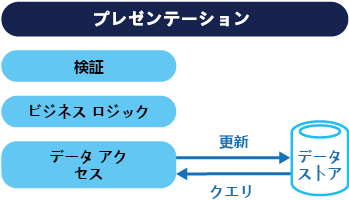
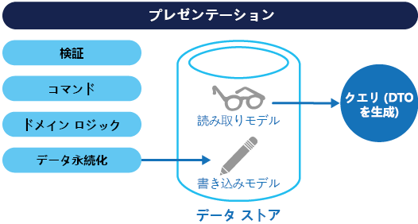
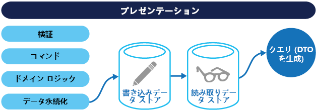

# <a name="command-and-query-responsibility-segregation-cqrs-pattern"></a><span data-ttu-id="11e92-104">コマンド クエリ責務分離 (CQRS) パターン</span><span class="sxs-lookup"><span data-stu-id="11e92-104">Command and Query Responsibility Segregation (CQRS) pattern</span></span>

[!INCLUDE [header](../_includes/header.md)]

<span data-ttu-id="11e92-105">個別のインターフェイスを使用して、データを更新する操作とデータを読み取る操作を分離します。</span><span class="sxs-lookup"><span data-stu-id="11e92-105">Segregate operations that read data from operations that update data by using separate interfaces.</span></span> <span data-ttu-id="11e92-106">これにより、パフォーマンス、スケーラビリティ、セキュリティを最大化できます。</span><span class="sxs-lookup"><span data-stu-id="11e92-106">This can maximize performance, scalability, and security.</span></span> <span data-ttu-id="11e92-107">高い柔軟性でシステムの進化に経時的に対応し、更新コマンドによってドメイン レベルでマージ競合が発生するのを防ぐことができます。</span><span class="sxs-lookup"><span data-stu-id="11e92-107">Supports the evolution of the system over time through higher flexibility, and prevents update commands from causing merge conflicts at the domain level.</span></span>

## <a name="context-and-problem"></a><span data-ttu-id="11e92-108">コンテキストと問題</span><span class="sxs-lookup"><span data-stu-id="11e92-108">Context and problem</span></span>

<span data-ttu-id="11e92-109">従来のデータ管理システムでは、コマンド (データの更新) とクエリ (データの要求) は、1 つのデータ リポジトリ内のエンティティの同じセットに対して実行されます。</span><span class="sxs-lookup"><span data-stu-id="11e92-109">In traditional data management systems, both commands (updates to the data) and queries (requests for data) are executed against the same set of entities in a single data repository.</span></span> <span data-ttu-id="11e92-110">これらのエンティティは、リレーショナル データベース (SQL Server など) における 1 つ以上のテーブル内の行のサブセットである可能性があります。</span><span class="sxs-lookup"><span data-stu-id="11e92-110">These entities can be a subset of the rows in one or more tables in a relational database such as SQL Server.</span></span>

<span data-ttu-id="11e92-111">これらのシステムでは通常、作成、読み取り、更新、削除 (CRUD) の操作はすべて、同じエンティティ表現に適用されます。</span><span class="sxs-lookup"><span data-stu-id="11e92-111">Typically in these systems, all create, read, update, and delete (CRUD) operations are applied to the same representation of the entity.</span></span> <span data-ttu-id="11e92-112">たとえば、顧客を表すデータ転送オブジェクト (DTO) は、データ アクセス層 (DAL) によってデータ ストアから取得され、画面に表示されます。</span><span class="sxs-lookup"><span data-stu-id="11e92-112">For example, a data transfer object (DTO) representing a customer is retrieved from the data store by the data access layer (DAL) and displayed on the screen.</span></span> <span data-ttu-id="11e92-113">ユーザーが (データ バインドによって) DTO の一部のフィールドを更新すると、DTO は DAL によってデータ ストアに保存されます。</span><span class="sxs-lookup"><span data-stu-id="11e92-113">A user updates some fields of the DTO (perhaps through data binding) and the DTO is then saved back in the data store by the DAL.</span></span> <span data-ttu-id="11e92-114">読み取り操作と書き込み操作に同じ DTO が使用されます。</span><span class="sxs-lookup"><span data-stu-id="11e92-114">The same DTO is used for both the read and write operations.</span></span> <span data-ttu-id="11e92-115">次の図は、従来の CRUD アーキテクチャを示しています。</span><span class="sxs-lookup"><span data-stu-id="11e92-115">The figure illustrates a traditional CRUD architecture.</span></span>



<span data-ttu-id="11e92-117">従来の CRUD 設計は、限られたビジネス ロジックだけをデータ操作に適用する場合に適しています。</span><span class="sxs-lookup"><span data-stu-id="11e92-117">Traditional CRUD designs work well when only limited business logic is applied to the data operations.</span></span> <span data-ttu-id="11e92-118">開発ツールで提供されるスキャフォールディング メカニズムにより、データ アクセス コードを非常に迅速に作成することができ、必要に応じてカスタマイズできます。</span><span class="sxs-lookup"><span data-stu-id="11e92-118">Scaffold mechanisms provided by development tools can create data access code very quickly, which can then be customized as required.</span></span>

<span data-ttu-id="11e92-119">ただし、従来の CRUD アプローチには、いくつかの短所があります。</span><span class="sxs-lookup"><span data-stu-id="11e92-119">However, the traditional CRUD approach has some disadvantages:</span></span>

- <span data-ttu-id="11e92-120">読み取りと書き込みのデータ表現が一致しないことがよくあります。具体的には、操作の一部としては必要ないものの、正しく更新しなければならない追加の列やプロパティなどです。</span><span class="sxs-lookup"><span data-stu-id="11e92-120">It often means that there's a mismatch between the read and write representations of the data, such as additional columns or properties that must be updated correctly even though they aren't required as part of an operation.</span></span>

- <span data-ttu-id="11e92-121">複数のアクターが同じデータ セットに対して操作を並列で実行するコラボレーション ドメインのデータ ストアでレコードがロックされている場合、データ競合のリスクがあります。</span><span class="sxs-lookup"><span data-stu-id="11e92-121">It risks data contention when records are locked in the data store in a collaborative domain, where multiple actors operate in parallel on the same set of data.</span></span> <span data-ttu-id="11e92-122">また、オプティミスティック ロックを使用している場合、同時更新による更新の競合のリスクもあります。</span><span class="sxs-lookup"><span data-stu-id="11e92-122">Or update conflicts caused by concurrent updates when optimistic locking is used.</span></span> <span data-ttu-id="11e92-123">システムの複雑さとスループットの増加に伴って、これらのリスクも増加します。</span><span class="sxs-lookup"><span data-stu-id="11e92-123">These risks increase as the complexity and throughput of the system grows.</span></span> <span data-ttu-id="11e92-124">さらに、従来のアプローチは、データ ストアとデータ アクセス層への負荷、および情報を取得するために必要なクエリの複雑さによって、パフォーマンスに悪影響を及ぼす可能性があります。</span><span class="sxs-lookup"><span data-stu-id="11e92-124">In addition, the traditional approach can have a negative effect on performance due to load on the data store and data access layer, and the complexity of queries required to retrieve information.</span></span>

- <span data-ttu-id="11e92-125">各エンティティは読み取りと書き込みの両方の操作の対象となり、誤ったコンテキストでデータが公開されることがあるため、セキュリティとアクセス許可の管理が複雑化する可能性があります。</span><span class="sxs-lookup"><span data-stu-id="11e92-125">It can make managing security and permissions more complex because each entity is subject to both read and write operations, which might expose data in the wrong context.</span></span>

## <a name="solution"></a><span data-ttu-id="11e92-126">解決策</span><span class="sxs-lookup"><span data-stu-id="11e92-126">Solution</span></span>

<span data-ttu-id="11e92-127">コマンド クエリ責務分離 (CQRS) は、別のインターフェイスを使用することで、データを更新する操作 (コマンド) からデータを読み取る操作 (クエリ) を分離するパターンです。</span><span class="sxs-lookup"><span data-stu-id="11e92-127">Command and Query Responsibility Segregation (CQRS) is a pattern that segregates the operations that read data (queries) from the operations that update data (commands) by using separate interfaces.</span></span> <span data-ttu-id="11e92-128">つまり、クエリと更新にそれぞれ異なるデータ モデルを使用します。</span><span class="sxs-lookup"><span data-stu-id="11e92-128">This means that the data models used for querying and updates are different.</span></span> <span data-ttu-id="11e92-129">絶対条件ではありませんが、次の図に示すようにモデルを分離できます。</span><span class="sxs-lookup"><span data-stu-id="11e92-129">The models can then be isolated, as shown in the following figure, although that's not an absolute requirement.</span></span>



<span data-ttu-id="11e92-131">CQRS ベースのシステムでデータのクエリと更新の分離モデルを使用すると、CRUD ベースのシステムで使用される単一データ モデルと比べて、設計と実装が簡単になります。</span><span class="sxs-lookup"><span data-stu-id="11e92-131">Compared to the single data model used in CRUD-based systems, the use of separate query and update models for the data in CQRS-based systems simplifies design and implementation.</span></span> <span data-ttu-id="11e92-132">ただし、CRUD 設計とは異なり、CQRS コードはスキャフォールディング メカニズムを使用して自動的に生成できないという短所があります。</span><span class="sxs-lookup"><span data-stu-id="11e92-132">However, one disadvantage is that unlike CRUD designs, CQRS code can't automatically be generated using scaffold mechanisms.</span></span>

<span data-ttu-id="11e92-133">データを読み取るためのクエリ モデルとデータを書き込むための更新モデルは、おそらく SQL ビューを使用するか、即時にプロジェクションを生成することにより、同じ物理ストアにアクセスできます。</span><span class="sxs-lookup"><span data-stu-id="11e92-133">The query model for reading data and the update model for writing data can access the same physical store, perhaps by using SQL views or by generating projections on the fly.</span></span> <span data-ttu-id="11e92-134">ただし、パフォーマンス、スケーラビリティ、セキュリティを最大化するため、次の図に示すように、データを異なる物理ストアに分けるのが一般的です。</span><span class="sxs-lookup"><span data-stu-id="11e92-134">However, it's common to separate the data into different physical stores to maximize performance, scalability, and security, as shown in the next figure.</span></span>



<span data-ttu-id="11e92-136">書き込みストアの読み取り専用レプリカを読み取りストアにすることも、読み取りストアと書き込みストアをまったく別の構造にすることもできます。</span><span class="sxs-lookup"><span data-stu-id="11e92-136">The read store can be a read-only replica of the write store, or the read and write stores can have a different structure altogether.</span></span> <span data-ttu-id="11e92-137">読み取りストアの読み取り専用レプリカを複数使用すると、読み取り専用レプリカがアプリケーション インスタンスの近くに配置されている分散シナリオでは特に、クエリのパフォーマンスとアプリケーション UI の応答性が大幅に向上します。</span><span class="sxs-lookup"><span data-stu-id="11e92-137">Using multiple read-only replicas of the read store can greatly increase query performance and application UI responsiveness, especially in distributed scenarios where read-only replicas are located close to the application instances.</span></span> <span data-ttu-id="11e92-138">一部のデータベース システム (SQL Server) には、可用性を最大化するためのフェールオーバー レプリカなどの追加機能があります。</span><span class="sxs-lookup"><span data-stu-id="11e92-138">Some database systems (SQL Server) provide additional features such as failover replicas to maximize availability.</span></span>

<span data-ttu-id="11e92-139">読み取りストアと書き込みストアを分離することにより、それぞれの負荷に合わせて適切にスケーリングすることもできます。</span><span class="sxs-lookup"><span data-stu-id="11e92-139">Separation of the read and write stores also allows each to be scaled appropriately to match the load.</span></span> <span data-ttu-id="11e92-140">たとえば、読み取りストアには通常、書き込みストアよりはるかに高い負荷が発生します。</span><span class="sxs-lookup"><span data-stu-id="11e92-140">For example, read stores typically encounter a much higher load than write stores.</span></span>

<span data-ttu-id="11e92-141">クエリ/読み取りモデルに非正規化データが含まれている場合 (「[具体化されたビュー パターン](materialized-view.md)」を参照)、パフォーマンスが最大化されるのは、アプリケーションの各ビューのデータを読み取るときと、システム内のデータを照会する実行するときです。</span><span class="sxs-lookup"><span data-stu-id="11e92-141">When the query/read model contains denormalized data (see [Materialized View pattern](materialized-view.md)), performance is maximized when reading data for each of the views in an application or when querying the data in the system.</span></span>

## <a name="issues-and-considerations"></a><span data-ttu-id="11e92-142">問題と注意事項</span><span class="sxs-lookup"><span data-stu-id="11e92-142">Issues and considerations</span></span>

<span data-ttu-id="11e92-143">このパターンの実装方法を決めるときには、以下の点に注意してください。</span><span class="sxs-lookup"><span data-stu-id="11e92-143">Consider the following points when deciding how to implement this pattern:</span></span>

- <span data-ttu-id="11e92-144">データ ストアを読み取り操作用と書き込み操作用という別々の物理ストアに分けると、システムのパフォーマンスとセキュリティは向上する一方で、回復性と最終的な整合性の観点からは複雑さが増す可能性があります。</span><span class="sxs-lookup"><span data-stu-id="11e92-144">Dividing the data store into separate physical stores for read and write operations can increase the performance and security of a system, but it can add complexity in terms of resiliency and eventual consistency.</span></span> <span data-ttu-id="11e92-145">読み取りモデル ストアは、書き込みモデル ストアへの変更を反映させるために更新する必要がありますが、ユーザーが古い読み取りデータに基づいた要求をいつ発行したのかを検出するのは容易ではなく、この場合、操作を完了できません。</span><span class="sxs-lookup"><span data-stu-id="11e92-145">The read model store must be updated to reflect changes to the write model store, and it can be difficult to detect when a user has issued a request based on stale read data, which means that the operation can't be completed.</span></span>

    > <span data-ttu-id="11e92-146">最終的な整合性の詳細については、「[Data Consistency Primer (データ整合性入門)](https://msdn.microsoft.com/library/dn589800.aspx)」を参照してください。</span><span class="sxs-lookup"><span data-stu-id="11e92-146">For a description of eventual consistency see the [Data Consistency Primer](https://msdn.microsoft.com/library/dn589800.aspx).</span></span>

- <span data-ttu-id="11e92-147">システムの最も重要な、限られたセクションに CQRS を適用することを検討してください。</span><span class="sxs-lookup"><span data-stu-id="11e92-147">Consider applying CQRS to limited sections of your system where it will be most valuable.</span></span>

- <span data-ttu-id="11e92-148">最終的な整合性をデプロイする一般的な方法は、イベント ソーシングと CQRS を併用することです。これにより、書き込みモデルは、コマンドの実行によって発生するイベントの追加専用ストリームになります。</span><span class="sxs-lookup"><span data-stu-id="11e92-148">A typical approach to deploying eventual consistency is to use event sourcing in conjunction with CQRS so that the write model is an append-only stream of events driven by execution of commands.</span></span> <span data-ttu-id="11e92-149">これらのイベントは、読み取りモデルとして機能する具体化されたビューの更新に使用されます。</span><span class="sxs-lookup"><span data-stu-id="11e92-149">These events are used to update materialized views that act as the read model.</span></span> <span data-ttu-id="11e92-150">詳細については、「[Event Sourcing and CQRS (イベント ソーシングと CQRS)](/azure/architecture/patterns/cqrs#event-sourcing-and-cqrs)」を参照してください。</span><span class="sxs-lookup"><span data-stu-id="11e92-150">For more information see [Event Sourcing and CQRS](/azure/architecture/patterns/cqrs#event-sourcing-and-cqrs).</span></span>

## <a name="when-to-use-this-pattern"></a><span data-ttu-id="11e92-151">このパターンを使用する状況</span><span class="sxs-lookup"><span data-stu-id="11e92-151">When to use this pattern</span></span>

<span data-ttu-id="11e92-152">このパターンは次の状況で使用します。</span><span class="sxs-lookup"><span data-stu-id="11e92-152">Use this pattern in the following situations:</span></span>

- <span data-ttu-id="11e92-153">同じデータに対して複数の操作が並列で実行されるコラボレーション ドメイン。</span><span class="sxs-lookup"><span data-stu-id="11e92-153">Collaborative domains where multiple operations are performed in parallel on the same data.</span></span> <span data-ttu-id="11e92-154">CQRS を使用すると、同じ種類のデータに見えるものを更新する場合でも、ドメイン レベルでマージの競合を最小化するのに十分な細分性でコマンドを定義できます (発生したすべての競合をコマンドでマージできます)。</span><span class="sxs-lookup"><span data-stu-id="11e92-154">CQRS allows you to define commands with enough granularity to minimize merge conflicts at the domain level (any conflicts that do arise can be merged by the command), even when updating what appears to be the same type of data.</span></span>

- <span data-ttu-id="11e92-155">一連の手順として、または複雑なドメイン モデルを使用して、複雑なプロセスがユーザーにされるタスクベースのユーザー インターフェイス。</span><span class="sxs-lookup"><span data-stu-id="11e92-155">Task-based user interfaces where users are guided through a complex process as a series of steps or with complex domain models.</span></span> <span data-ttu-id="11e92-156">既にドメインベースの設計 (DDD) 手法を使い慣れているチームにも有用です。</span><span class="sxs-lookup"><span data-stu-id="11e92-156">Also, useful for teams already familiar with domain-driven design (DDD) techniques.</span></span> <span data-ttu-id="11e92-157">書き込みモデルには、ビジネス ロジック、入力の検証、ビジネスの検証を使用する完全なコマンド処理スタックがあり、その書き込みモデル内で各集計 (データ変更の単位として処理される関連オブジェクトの各クラスター) についてすべてが一貫していることを保証します。</span><span class="sxs-lookup"><span data-stu-id="11e92-157">The write model has a full command-processing stack with business logic, input validation, and business validation to ensure that everything is always consistent for each of the aggregates (each cluster of associated objects treated as a unit for data changes) in the write model.</span></span> <span data-ttu-id="11e92-158">読み取りモデルにはビジネス ロジックや検証スタックはなく、ビュー モデルで使用する DTO を返すだけです。</span><span class="sxs-lookup"><span data-stu-id="11e92-158">The read model has no business logic or validation stack and just returns a DTO for use in a view model.</span></span> <span data-ttu-id="11e92-159">読み取りモデルは、最終的には書き込みモデルと一致します。</span><span class="sxs-lookup"><span data-stu-id="11e92-159">The read model is eventually consistent with the write model.</span></span>

- <span data-ttu-id="11e92-160">データ読み取りのパフォーマンスを、データ書き込みのパフォーマンスとは別に細かく調整する必要があるシナリオ (特に、読み取り/書き込みの比率が非常に高く、水平スケーリングが必要な場合)。</span><span class="sxs-lookup"><span data-stu-id="11e92-160">Scenarios where performance of data reads must be fine tuned separately from performance of data writes, especially when the read/write ratio is very high, and when horizontal scaling is required.</span></span> <span data-ttu-id="11e92-161">たとえば、多くのシステムで、読み取り操作の回数は書き込み操作の回数の数倍になります。</span><span class="sxs-lookup"><span data-stu-id="11e92-161">For example, in many systems the number of read operations is many times greater than the number of write operations.</span></span> <span data-ttu-id="11e92-162">これに対応できるように、読み取りモデルをスケール アウトし、書き込みモデルは 1 つまたは少数のインスタンスでのみ実行することを検討してください。</span><span class="sxs-lookup"><span data-stu-id="11e92-162">To accommodate this, consider scaling out the read model, but running the write model on only one or a few instances.</span></span> <span data-ttu-id="11e92-163">書き込みモデルのインスタンス数を少なくすることは、マージ競合の発生を最小化するうえでも役立ちます。</span><span class="sxs-lookup"><span data-stu-id="11e92-163">A small number of write model instances also helps to minimize the occurrence of merge conflicts.</span></span>

- <span data-ttu-id="11e92-164">1 つの開発者チームが書き込みモデルの一部である複雑なドメイン モデルに注力し、もう 1 つのチームが読み取りモデルとユーザー インターフェイスに注力できるシナリオ。</span><span class="sxs-lookup"><span data-stu-id="11e92-164">Scenarios where one team of developers can focus on the complex domain model that is part of the write model, and another team can focus on the read model and the user interfaces.</span></span>

- <span data-ttu-id="11e92-165">システムが時間の経過に伴って進化し、モデルの複数のバージョンを含むようになることが予測されるシナリオや、ビジネス ルールが定期的に変更されるシナリオ。</span><span class="sxs-lookup"><span data-stu-id="11e92-165">Scenarios where the system is expected to evolve over time and might contain multiple versions of the model, or where business rules change regularly.</span></span>

- <span data-ttu-id="11e92-166">他のシステムとの統合 (特にイベント ソーシングとの組み合わせ)。この場合、1 つのサブシステムの一時的なエラーは、他のサブシステムの可用性に影響しません。</span><span class="sxs-lookup"><span data-stu-id="11e92-166">Integration with other systems, especially in combination with event sourcing, where the temporal failure of one subsystem shouldn't affect the availability of the others.</span></span>

<span data-ttu-id="11e92-167">次の状況では、このパターンはお勧めしません。</span><span class="sxs-lookup"><span data-stu-id="11e92-167">This pattern isn't recommended in the following situations:</span></span>

- <span data-ttu-id="11e92-168">ドメインやビジネス ルールが単純な場合。</span><span class="sxs-lookup"><span data-stu-id="11e92-168">Where the domain or the business rules are simple.</span></span>

- <span data-ttu-id="11e92-169">単純な CRUD スタイルのユーザー インターフェイスと、関連するデータ アクセス操作で十分な場合。</span><span class="sxs-lookup"><span data-stu-id="11e92-169">Where a simple CRUD-style user interface and the related data access operations are sufficient.</span></span>

- <span data-ttu-id="11e92-170">システム全体にまたがる実装の場合。</span><span class="sxs-lookup"><span data-stu-id="11e92-170">For implementation across the whole system.</span></span> <span data-ttu-id="11e92-171">CQRS が役立つ全体的なデータ管理シナリオに特有のコンポーネントもあるものの、必要ない場合には煩雑さが増してしまう可能性があります。</span><span class="sxs-lookup"><span data-stu-id="11e92-171">There are specific components of an overall data management scenario where CQRS can be useful, but it can add considerable and unnecessary complexity when it isn't required.</span></span>

## <a name="event-sourcing-and-cqrs"></a><span data-ttu-id="11e92-172">イベント ソーシングと CQRS</span><span class="sxs-lookup"><span data-stu-id="11e92-172">Event Sourcing and CQRS</span></span>

<span data-ttu-id="11e92-173">CQRS パターンは、イベント ソーシング パターンと共によく使用されます。</span><span class="sxs-lookup"><span data-stu-id="11e92-173">The CQRS pattern is often used along with the Event Sourcing pattern.</span></span> <span data-ttu-id="11e92-174">CQRS ベースのシステムは、個別の読み取りデータ モデルと書き込みデータ モデルを使用します。これらはそれぞれ関連するタスクに合わせて調整されており、多くの場合、物理的に分離されたストアに存在します。</span><span class="sxs-lookup"><span data-stu-id="11e92-174">CQRS-based systems use separate read and write data models, each tailored to relevant tasks and often located in physically separate stores.</span></span> <span data-ttu-id="11e92-175">[イベント ソーシング](event-sourcing.md) パターンと共に使用される場合、イベントのストアは書き込みモデルであり、公式の情報ソースです。</span><span class="sxs-lookup"><span data-stu-id="11e92-175">When used with the [Event Sourcing](event-sourcing.md) pattern, the store of events is the write model, and is the official source of information.</span></span> <span data-ttu-id="11e92-176">CQRS ベースのシステムの読み取りモデルは、データの具体化されたビュー (通常は高度に非正規化されたビュー) を提供します。</span><span class="sxs-lookup"><span data-stu-id="11e92-176">The read model of a CQRS-based system provides materialized views of the data, typically as highly denormalized views.</span></span> <span data-ttu-id="11e92-177">これらのビューは、アプリケーションのインターフェイスとディスプレイの要件に合わせて調整されており、ディスプレイとクエリの両方のパフォーマンスを最大化するのに役立ちます。</span><span class="sxs-lookup"><span data-stu-id="11e92-177">These views are tailored to the interfaces and display requirements of the application, which helps to maximize both display and query performance.</span></span>

<span data-ttu-id="11e92-178">ある時点での実際のデータではなく、イベントのストリームを書き込みストアとして使用することにより、単一の集計での更新の競合を回避し、パフォーマンスとスケーラビリティを最大化します。</span><span class="sxs-lookup"><span data-stu-id="11e92-178">Using the stream of events as the write store, rather than the actual data at a point in time, avoids update conflicts on a single aggregate and maximizes performance and scalability.</span></span> <span data-ttu-id="11e92-179">イベントを使用して、読み取りストアへのデータ入力に使用されるデータの具体化されたビューを非同期的に生成できます。</span><span class="sxs-lookup"><span data-stu-id="11e92-179">The events can be used to asynchronously generate materialized views of the data that are used to populate the read store.</span></span>

<span data-ttu-id="11e92-180">イベント ストアは公式の情報ソースであるため、システムが進化したり読み取りモデルの変更が必要になったりした場合に、具体化されたビューを削除し、過去のすべてのイベントを再生して最新の状態の新しい表現を作成することができます。</span><span class="sxs-lookup"><span data-stu-id="11e92-180">Because the event store is the official source of information, it is possible to delete the materialized views and replay all past events to create a new representation of the current state when the system evolves, or when the read model must change.</span></span> <span data-ttu-id="11e92-181">具体化されたビューは、実質的にはデータの持続的な読み取り専用キャッシュです。</span><span class="sxs-lookup"><span data-stu-id="11e92-181">The materialized views are in effect a durable read-only cache of the data.</span></span>

<span data-ttu-id="11e92-182">CQRS とイベント ソーシング パターンを組み合わせて使用する場合、次の点を考慮してください。</span><span class="sxs-lookup"><span data-stu-id="11e92-182">When using CQRS combined with the Event Sourcing pattern, consider the following:</span></span>

- <span data-ttu-id="11e92-183">書き込みストアと読み取りストアが分離しているすべてのシステムと同様に、このパターンに基づくシステムは、最後の段階にならないと一貫性が確保されません。</span><span class="sxs-lookup"><span data-stu-id="11e92-183">As with any system where the write and read stores are separate, systems based on this pattern are only eventually consistent.</span></span> <span data-ttu-id="11e92-184">イベントの生成とデータ ストアの更新の間には、いくらかの遅延があります。</span><span class="sxs-lookup"><span data-stu-id="11e92-184">There will be some delay between the event being generated and the data store being updated.</span></span>

- <span data-ttu-id="11e92-185">イベントを開始および処理し、クエリや読み取りモデルで必要な適切なビューやオブジェクトをアセンブルまたは更新するようにコードを作成する必要があるため、このパターンでは複雑さが増します。</span><span class="sxs-lookup"><span data-stu-id="11e92-185">The pattern adds complexity because code must be created to initiate and handle events, and assemble or update the appropriate views or objects required by queries or a read model.</span></span> <span data-ttu-id="11e92-186">CQRS パターンをイベント ソーシング パターンと併用すると複雑さが増すため、実装が難しくなる可能性があり、システム設計に別のアプローチが必要になります。</span><span class="sxs-lookup"><span data-stu-id="11e92-186">The complexity of the CQRS pattern when used with the Event Sourcing pattern can make a successful implementation more difficult, and requires a different approach to designing systems.</span></span> <span data-ttu-id="11e92-187">ただし、イベント ソーシングを使用するとドメインのモデル化が容易になります。また、データの変更の目的が保持されるため、ビューの再構築や新規作成も容易になります。</span><span class="sxs-lookup"><span data-stu-id="11e92-187">However, event sourcing can make it easier to model the domain, and makes it easier to rebuild views or create new ones because the intent of the changes in the data is preserved.</span></span>

- <span data-ttu-id="11e92-188">特定のエンティティまたはエンティティのコレクションのイベントを再生または処理することにより、データの読み取りモデルまたはプロジェクションで使用する具体化されたビューを生成すると、大量の処理時間とリソース使用量が必要になる可能性があります。</span><span class="sxs-lookup"><span data-stu-id="11e92-188">Generating materialized views for use in the read model or projections of the data by replaying and handling the events for specific entities or collections of entities can require significant processing time and resource usage.</span></span> <span data-ttu-id="11e92-189">これは特に、長期にわたる値の合計や解析が必要な場合に当てはまります。関連するすべてのイベントの検証が必要な場合があるためです。</span><span class="sxs-lookup"><span data-stu-id="11e92-189">This is especially true if it requires summation or analysis of values over long periods, because all the associated events might need to be examined.</span></span> <span data-ttu-id="11e92-190">この問題を解決するには、スケジュールされた間隔 (発生した特定のアクションの合計数、エンティティの現在の状態など) でデータのスナップショットを実装します。</span><span class="sxs-lookup"><span data-stu-id="11e92-190">Resolve this by implementing snapshots of the data at scheduled intervals, such as a total count of the number of a specific action that have occurred, or the current state of an entity.</span></span>

## <a name="example"></a><span data-ttu-id="11e92-191">例</span><span class="sxs-lookup"><span data-stu-id="11e92-191">Example</span></span>

<span data-ttu-id="11e92-192">次のコードは、読み取りモデルと書き込みモデルに異なる定義を使用する CQRS 実装の例から抽出したものです。</span><span class="sxs-lookup"><span data-stu-id="11e92-192">The following code shows some extracts from an example of a CQRS implementation that uses different definitions for the read and the write models.</span></span> <span data-ttu-id="11e92-193">モデル インターフェイスは、基になるデータ ストアの機能に影響しません。また、進化することができ、インターフェイスどうしが分離しているため個別に微調整もできます。</span><span class="sxs-lookup"><span data-stu-id="11e92-193">The model interfaces don't dictate any features of the underlying data stores, and they can evolve and be fine-tuned independently because these interfaces are separated.</span></span>

<span data-ttu-id="11e92-194">次のコードは、読み取りモデルの定義を示しています。</span><span class="sxs-lookup"><span data-stu-id="11e92-194">The following code shows the read model definition.</span></span>

```csharp
// Query interface
namespace ReadModel
{
  public interface ProductsDao
  {
    ProductDisplay FindById(int productId);
    ICollection<ProductDisplay> FindByName(string name);
    ICollection<ProductInventory> FindOutOfStockProducts();
    ICollection<ProductDisplay> FindRelatedProducts(int productId);
  }

  public class ProductDisplay
  {
    public int Id { get; set; }
    public string Name { get; set; }
    public string Description { get; set; }
    public decimal UnitPrice { get; set; }
    public bool IsOutOfStock { get; set; }
    public double UserRating { get; set; }
  }

  public class ProductInventory
  {
    public int Id { get; set; }
    public string Name { get; set; }
    public int CurrentStock { get; set; }
  }
}
```

<span data-ttu-id="11e92-195">ユーザーは製品を評価することができます。</span><span class="sxs-lookup"><span data-stu-id="11e92-195">The system allows users to rate products.</span></span> <span data-ttu-id="11e92-196">そのためには、次のコードに示すように、アプリケーション コードで `RateProduct` コマンドを使用します。</span><span class="sxs-lookup"><span data-stu-id="11e92-196">The application code does this using the `RateProduct` command shown in the following code.</span></span>

```csharp
public interface ICommand
{
  Guid Id { get; }
}

public class RateProduct : ICommand
{
  public RateProduct()
  {
    this.Id = Guid.NewGuid();
  }
  public Guid Id { get; set; }
  public int ProductId { get; set; }
  public int Rating { get; set; }
  public int UserId {get; set; }
}
```

<span data-ttu-id="11e92-197">システムは `ProductsCommandHandler` クラスを使用して、アプリケーションから送信されたコマンドを処理します。</span><span class="sxs-lookup"><span data-stu-id="11e92-197">The system uses the `ProductsCommandHandler` class to handle commands sent by the application.</span></span> <span data-ttu-id="11e92-198">クライアントは通常、キューなどのメッセージング システムを使用して、ドメインにコマンドを送信します。</span><span class="sxs-lookup"><span data-stu-id="11e92-198">Clients typically send commands to the domain through a messaging system such as a queue.</span></span> <span data-ttu-id="11e92-199">コマンド ハンドラーはこれらのコマンドを受け入れ、ドメイン インターフェイスのメソッドを呼び出します。</span><span class="sxs-lookup"><span data-stu-id="11e92-199">The command handler accepts these commands and invokes methods of the domain interface.</span></span> <span data-ttu-id="11e92-200">各コマンドの細分性は、要求の競合が発生する可能性が少なくなるように設計されています。</span><span class="sxs-lookup"><span data-stu-id="11e92-200">The granularity of each command is designed to reduce the chance of conflicting requests.</span></span> <span data-ttu-id="11e92-201">次のコードは、`ProductsCommandHandler` クラスのアウトラインを示しています。</span><span class="sxs-lookup"><span data-stu-id="11e92-201">The following code shows an outline of the `ProductsCommandHandler` class.</span></span>

```csharp
public class ProductsCommandHandler :
    ICommandHandler<AddNewProduct>,
    ICommandHandler<RateProduct>,
    ICommandHandler<AddToInventory>,
    ICommandHandler<ConfirmItemShipped>,
    ICommandHandler<UpdateStockFromInventoryRecount>
{
  private readonly IRepository<Product> repository;

  public ProductsCommandHandler (IRepository<Product> repository)
  {
    this.repository = repository;
  }

  void Handle (AddNewProduct command)
  {
    ...
  }

  void Handle (RateProduct command)
  {
    var product = repository.Find(command.ProductId);
    if (product != null)
    {
      product.RateProduct(command.UserId, command.Rating);
      repository.Save(product);
    }
  }

  void Handle (AddToInventory command)
  {
    ...
  }

  void Handle (ConfirmItemsShipped command)
  {
    ...
  }

  void Handle (UpdateStockFromInventoryRecount command)
  {
    ...
  }
}
```

<span data-ttu-id="11e92-202">次のコードは、書き込みモデルからの `IProductsDomain` インターフェイスを示しています。</span><span class="sxs-lookup"><span data-stu-id="11e92-202">The following code shows the `IProductsDomain` interface from the write model.</span></span>

```csharp
public interface IProductsDomain
{
  void AddNewProduct(int id, string name, string description, decimal price);
  void RateProduct(int userId, int rating);
  void AddToInventory(int productId, int quantity);
  void ConfirmItemsShipped(int productId, int quantity);
  void UpdateStockFromInventoryRecount(int productId, int updatedQuantity);
}
```

<span data-ttu-id="11e92-203">ドメイン内で意味を持つメソッドが `IProductsDomain` インターフェイスにどのように含まれているかにも注意してください。</span><span class="sxs-lookup"><span data-stu-id="11e92-203">Also notice how the `IProductsDomain` interface contains methods that have a meaning in the domain.</span></span> <span data-ttu-id="11e92-204">通常、これらのメソッドは CRUD 環境では `Save` や `Update` などの汎用的な名前を持ち、DTO が唯一の引数です。</span><span class="sxs-lookup"><span data-stu-id="11e92-204">Typically, in a CRUD environment these methods would have generic names such as `Save` or `Update`, and have a DTO as the only argument.</span></span> <span data-ttu-id="11e92-205">CQRS アプローチは、この組織のビジネスと在庫管理システムのニーズを満たすように設計できます。</span><span class="sxs-lookup"><span data-stu-id="11e92-205">The CQRS approach can be designed to meet the needs of this organization's business and inventory management systems.</span></span>

## <a name="related-patterns-and-guidance"></a><span data-ttu-id="11e92-206">関連のあるパターンとガイダンス</span><span class="sxs-lookup"><span data-stu-id="11e92-206">Related patterns and guidance</span></span>

<span data-ttu-id="11e92-207">このパターンを実装する場合、次のパターンとガイダンスが役に立ちます。</span><span class="sxs-lookup"><span data-stu-id="11e92-207">The following patterns and guidance are useful when implementing this pattern:</span></span>

- <span data-ttu-id="11e92-208">CQRS と他のアーキテクチャ スタイルとの比較については、「[アーキテクチャ スタイル](/azure/architecture/guide/architecture-styles/)」と「[CQRS アーキテクチャのスタイル](/azure/architecture/guide/architecture-styles/cqrs)」を参照してください。</span><span class="sxs-lookup"><span data-stu-id="11e92-208">For a comparison of CQRS with other architectural styles, see [Architecture styles](/azure/architecture/guide/architecture-styles/) and [CQRS architecture style](/azure/architecture/guide/architecture-styles/cqrs).</span></span>

- <span data-ttu-id="11e92-209">[Data consistency primer (データ整合性入門)](https://msdn.microsoft.com/library/dn589800.aspx)。</span><span class="sxs-lookup"><span data-stu-id="11e92-209">[Data Consistency Primer](https://msdn.microsoft.com/library/dn589800.aspx).</span></span> <span data-ttu-id="11e92-210">CQRS パターン使用時に読み取りデータ ストアと書き込みデータ ストアの間の最終的な整合性が原因で通常発生する問題と、これらの問題の解決方法について説明します。</span><span class="sxs-lookup"><span data-stu-id="11e92-210">Explains the issues that are typically encountered due to eventual consistency between the read and write data stores when using the CQRS pattern, and how these issues can be resolved.</span></span>

- <span data-ttu-id="11e92-211">[データのパーティション分割のガイダンス](https://msdn.microsoft.com/library/dn589795.aspx)。</span><span class="sxs-lookup"><span data-stu-id="11e92-211">[Data Partitioning Guidance](https://msdn.microsoft.com/library/dn589795.aspx).</span></span> <span data-ttu-id="11e92-212">CQRS パターンで使用される読み取りデータ ストアと書き込みデータ ストアを、個別に管理およびアクセス可能なパーティションに分割して、スケーラビリティの向上、競合の削減、パフォーマンスの最適化を図る方法について説明します。</span><span class="sxs-lookup"><span data-stu-id="11e92-212">Describes how the read and write data stores used in the CQRS pattern can be divided into partitions that can be managed and accessed separately to improve scalability, reduce contention, and optimize performance.</span></span>

- <span data-ttu-id="11e92-213">[イベント ソーシング パターン](event-sourcing.md)。</span><span class="sxs-lookup"><span data-stu-id="11e92-213">[Event Sourcing Pattern](event-sourcing.md).</span></span> <span data-ttu-id="11e92-214">イベント ソーシングを CQRS パターンと共に使用して、複雑なドメインでのタスクを簡略化しながら、パフォーマンス、スケーラビリティ、応答性を向上させる方法について、さらに詳しく説明します。</span><span class="sxs-lookup"><span data-stu-id="11e92-214">Describes in more detail how Event Sourcing can be used with the CQRS pattern to simplify tasks in complex domains while improving performance, scalability, and responsiveness.</span></span> <span data-ttu-id="11e92-215">補正アクションを有効にできる完全な監査証跡と履歴を保持しながら、トランザクション データの整合性を提供する方法についても説明します。</span><span class="sxs-lookup"><span data-stu-id="11e92-215">As well as how to provide consistency for transactional data while maintaining full audit trails and history that can enable compensating actions.</span></span>

- <span data-ttu-id="11e92-216">[具体化されたビュー パターン](materialized-view.md)。</span><span class="sxs-lookup"><span data-stu-id="11e92-216">[Materialized View Pattern](materialized-view.md).</span></span> <span data-ttu-id="11e92-217">CQRS 実装の読み取りモデルには、書き込みモデル データの具体化されたビューを含めることができます。また、読み取りモデルは具体化されたビューの生成に使用できます。</span><span class="sxs-lookup"><span data-stu-id="11e92-217">The read model of a CQRS implementation can contain materialized views of the write model data, or the read model can be used to generate materialized views.</span></span>

- <span data-ttu-id="11e92-218">パターンとプラクティスのガイド「[CQRS Journey (CQRS の旅)](https://aka.ms/cqrs)」。</span><span class="sxs-lookup"><span data-stu-id="11e92-218">The patterns & practices guide [CQRS Journey](https://aka.ms/cqrs).</span></span> <span data-ttu-id="11e92-219">具体的には、「[Introducing the Command Query Responsibility Segregation Pattern (コマンド クエリ責務分離パターンの概要)](https://msdn.microsoft.com/library/jj591573.aspx)」でパターンとそのパターンが役立つ状況について説明します。「[Epilogue: Lessons Learned (エピローグ: 得られた教訓)](https://msdn.microsoft.com/library/jj591568.aspx)」は、このパターンを使用したときに発生する問題の一部を理解するのに役立ちます。</span><span class="sxs-lookup"><span data-stu-id="11e92-219">In particular, [Introducing the Command Query Responsibility Segregation Pattern](https://msdn.microsoft.com/library/jj591573.aspx) explores the pattern and when it's useful, and [Epilogue: Lessons Learned](https://msdn.microsoft.com/library/jj591568.aspx) helps you understand some of the issues that come up when using this pattern.</span></span>

- <span data-ttu-id="11e92-220">Martin Fowler の投稿「[CQRS](https://martinfowler.com/bliki/CQRS.html)」では、パターンの基本と他の有用なリソースへのリンクを紹介しています。</span><span class="sxs-lookup"><span data-stu-id="11e92-220">The post [CQRS by Martin Fowler](https://martinfowler.com/bliki/CQRS.html), which explains the basics of the pattern and links to other useful resources.</span></span>
