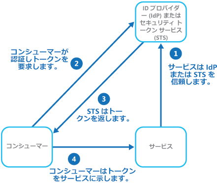
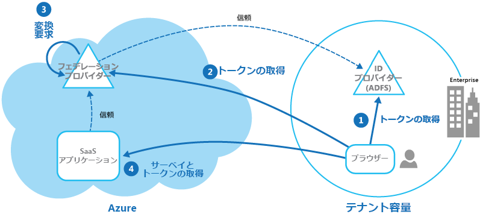

# フェデレーション ID パターン

[!INCLUDE [header](../_includes/header.md)]

外部の ID プロバイダーに認証を委任します。 これにより、開発を簡略化し、ユーザー管理の要件を最小限に抑え、アプリケーションのユーザー エクスペリエンスを向上させることができます。

## コンテキストと問題

通常、ユーザーは、取引関係にあるさまざまな組織によって提供されホストされる複数のアプリケーションを操作する必要があります。 これらのユーザーは、アプリケーションごとに特定の (異なった) 資格情報を使用するよう求められる場合があります。 これにより、次のことが起こる場合があります。

- **まとまりのないユーザー エクスペリエンスの発生**。 多くの異なるアプリケーションがあると、ユーザーはよくサインイン資格情報を忘れてしまいます。

- **セキュリティの脆弱性の露呈**。 ユーザーが退職する場合、アカウントは早急にプロビジョニング解除される必要があります。 大規模な組織では、これが見落とされがちになります。

- **ユーザー管理の複雑化**。 管理者は、すべてのユーザーの資格情報を管理し、さらにパスワードのリマインダーの提供などの追加タスクを実行する必要があります。

通常、ユーザーはこれらのアプリケーションすべてに対して同じ資格情報を使用したいと考えます。

## 解決策

フェデレーション ID を使用できる認証メカニズムを実装します。 アプリケーション コードからユーザー認証を分離し、信頼できる ID プロバイダーに認証を委任します。 これにより開発が簡略化され、管理オーバーヘッドを最小限に抑えながらより広い範囲の ID プロバイダー (IdP) を使用して認証できます。 承認から認証を明確に分離することもできます。

信頼できる ID プロバイダーとしては、企業のディレクトリ、オンプレミスのフェデレーション サービス、ビジネス パートナーによって提供されるその他のセキュリティ トークン サービス (STS)、または Microsoft、Google、yahoo!、Facebook などのアカウントを持つユーザーを認証できるソーシャル ID プロバイダーなどがあります。

次の図は、クライアント アプリケーションが認証を必要とするサービスにアクセスする必要がある場合のフェデレーション ID のパターンを示しています。 認証は、STS と連携して動作する IdP によって実行されます。 IdP は、認証されたユーザーの情報を提供するセキュリティ トークンを発行します。 要求と呼ばれるこの情報にはユーザーの ID が含まれ、ロール メンバーシップ、より詳細なアクセス権などのその他の情報が含まれることもあります。

このモデルは一般に要求ベースのアクセス制御と呼ばれます。 アプリケーションとサービスは、トークンに含まれる要求に基づいて、機能へのアクセスを承認します。 認証が必要なサービスは、IdP を信頼する必要があります。 クライアント アプリケーションは、認証を実行する IdP と接続します。 認証が成功すると、IdP はユーザーを識別する要求を含んだトークンを STS に返します (IdP と STS は同じサービスになることがあります)。 STS では、クライアントにトークンを返す前に、定義済みの規則に基づいてトークン内の要求を変換したり補強したりできます。 これで、クライアント アプリケーションは ID の証明としてこのトークンをサービスに渡すことができます。

> 信頼チェーンに追加の STS がある場合があります。 たとえば、後ほど説明するシナリオでは、オンプレミスの STS は、ユーザーを認証するために ID プロバイダーへのアクセスを担当する別の STS を信頼します。 この方法は、オンプレミスの STS とディレクトリが存在するエンタープライズのシナリオでは一般的です。

フェデレーション認証は、多様なドメイン間で ID を信頼する問題に標準ベースのソリューションを提供し、シングル サインオンをサポートできます。 これはあらゆる種類のアプリケーション、特にクラウドでホストされるアプリケーション間でより一般的になりつつあります。これは、ID プロバイダーへの直接のネットワーク接続を必要とせずにシングル サインオンをサポートするためです。 ユーザーはすべてのアプリケーションに対して資格情報を入力する必要はありません。 これにより、多数の異なるアプリケーションへのアクセスに必要な資格情報の作成が回避され、また元の ID プロバイダー以外からユーザーの資格情報が隠されるため、セキュリティが向上します。 アプリケーションでは、トークン内に含まれる認証済み ID 情報だけが参照されます。

フェデレーション ID には他にも、ID と資格情報の管理が ID プロバイダーの責任であるという大きな利点があります。 アプリケーションやサービスでは、ID 管理機能を提供する必要がありません。 さらに企業のシナリオでは、企業のディレクトリは、ID プロバイダーを信頼している場合、ユーザーに関する情報を必要としません。 これにより、ディレクトリ内でユーザー ID を管理するための管理オーバーヘッドがすべてなくなります。

## 問題と注意事項

フェデレーション認証を実装するアプリケーションを設計する際には、以下の点を考慮してください。

- 認証は単一障害点になる可能性があります。 複数のデータ センターにアプリケーションをデプロイする場合は、アプリケーションの信頼性と可用性を維持するために、ID 管理メカニズムを同じデータ センターにデプロイすることを検討してください。

- 認証ツールを使用すれば、認証トークンに含まれるロール要求に基づくアクセス制御を構成できます。 これは一般にロールベースのアクセス制御 (RBAC) と呼ばれ、機能とリソースへのアクセスをより細かいレベルで制御できます。

- 企業のディレクトリとは異なり、ソーシャル ID プロバイダーを使用する要求ベース認証は、通常、メール アドレスや名前などの他には認証されたユーザーに関する情報を提供しません。 Microsoft アカウントなどの一部のソーシャル ID プロバイダーは、一意識別子のみを提供します。 通常、アプリケーションでは、登録済みユーザーに関する情報を維持し、この情報をトークンの要求に含まれる識別子と一致させることができる必要があります。 これは一般的に、ユーザーが最初にアプリケーションにアクセスする際の登録の過程で実行され、情報は各認証の後に追加の要求としてトークンに挿入されます。

- STS 用に構成された ID プロバイダーが複数ある場合、アプリケーションは、認証のためにユーザーがどの ID プロバイダーにリダイレクトされるのか検出する必要があります。 このプロセスはホーム領域検出と呼ばれます。 STS は、ユーザーが提供するメール アドレスやユーザー名、ユーザーがアクセスしているアプリケーションのサブドメイン、ユーザーの IP アドレスの範囲、またはユーザーのブラウザーに格納されている Cookie の内容に基づいて、自動的にこれを行うことがあります。 たとえば、ユーザーが Microsoft ドメインで user@live.com のようなメール アドレスを入力した場合、STS はユーザーを Microsoft アカウントのサインイン ページにリダイレクトします。 以降のアクセスでは、STS は Cookie を使用して、前回は Microsoft アカウントを使用してサインインしたことを示すことができます。 自動検出がホーム領域を決定できない場合は、STS によって信頼できる ID プロバイダーを一覧表示するホーム領域検出ページが表示され、ユーザーは使用するものを選択する必要があります。

## このパターンを使用する状況

このパターンは、次のようなシナリオで役立ちます。

- **エンタープライズでのシングル サインオン**。 このシナリオでは、企業のセキュリティ境界外のクラウドでホストされている企業アプリケーションのために従業員を認証し、1 つのアプリケーションにアクセスするたびにサインインを要求することがないようにする必要があります。 ユーザー エクスペリエンスはオンプレミスのアプリケーションを使用するときと同様です。そこでは、ユーザーは企業ネットワークにサインインする際に認証され、それ以降は関連するすべてのアプリケーションにアクセスでき、再度サインインする必要はありません。

- **複数パートナーとのフェデレーション ID**。 このシナリオでは、企業の従業員と、企業のディレクトリ内にアカウントを持たないビジネス パートナーの両方を認証する必要があります。 このような状況は、企業間アプリケーション、サードパーティのサービスと統合されるアプリケーション、および異なる IT システムを持った企業が合併またはリソースを共有している場合によく見られます。

- **SaaS アプリケーションでのフェデレーション ID**。 このシナリオでは、独立系ソフトウェア ベンダーが、複数のクライアントまたはテナントにすぐに使用できるサービスを提供します。 各テナントは適切な ID プロバイダーを使用して認証を行います。 たとえば、ビジネス ユーザーは企業の資格情報を使用し、テナントのコンシューマーとクライアントは自分のソーシャル ID 資格情報を使用します。

このパターンは、次の状況では役に立たない場合があります。

- アプリケーションのすべてのユーザーが 1 つの ID プロバイダーで認証でき、その他の ID プロバイダーを使用して認証する必要がない場合。 これは、VPN を使用するか、(クラウドでホストされるシナリオでは) オンプレミスのディレクトリとアプリケーション間の仮想ネットワーク接続を使用することで、認証に (アプリケーション内からアクセスできる) 企業のディレクトリを使用するビジネス アプリケーションによく見られます。

- アプリケーションが、元はカスタム ユーザー ストアなどの異なる認証メカニズムを使用して構築されたか、要求ベースのテクノロジによって使用されるネゴシエーション スタンダードを処理する機能がない場合。 要求ベースの認証とアクセス制御を既存のアプリケーションに改良することは複雑になる場合があり、おそらくコスト効率も良くありません。

## 例

ある組織が、Microsoft Azure でマルチテナント SaaS (サービスとしてのソフトウェア) アプリケーションをホストします。 アプリケーションには、テナントが自分のユーザー用のアプリケーションの管理に使用できる Web サイトが含まれています。 その組織の独自の Active Directory によってユーザーが認証されるときに Active Directory フェデレーション サービス (AD FS) によって生成されるフェデレーション ID を使用することで、アプリケーションはテナントに Web サイトへのアクセスを許可します。

図では、テナントが独自の ID プロバイダー、ここでは ADFS を使用して認証する方法が示されています (ステップ 1)。 テナントを正常に認証した後、ADFS がトークンを発行します。 クライアントのブラウザーは、このトークンを、テナントの ADFS が発行したトークンを信頼する SaaS アプリケーションのフェデレーション プロバイダーに転送して、SaaS フェデレーション プロバイダーに有効なトークンを取り戻します (ステップ 2)。 必要に応じて、SaaS フェデレーション プロバイダーは、新しいトークンをクライアントのブラウザーに返す前にトークン内の要求をアプリケーションが認識する要求に変換します (ステップ 3)。 アプリケーションは SaaS フェデレーション プロバイダーによって発行されたトークンを信頼し、トークン内の要求を使用して承認規則を適用します (ステップ 4)。

テナントはアプリケーションにアクセスするために個別の資格情報を保存する必要がなく、テナントの会社の管理者は独自の ADFS 内でアプリケーションにアクセスできるユーザーの一覧を構成できます。

## 関連するガイダンス

- [Microsoft Azure Active Directory](https://azure.microsoft.com/services/active-directory/)
- [Active Directory Domain Services](https://msdn.microsoft.com/library/bb897402.aspx)
- [Active Directory フェデレーション サービス (AD FS)](https://msdn.microsoft.com/library/bb897402.aspx)
- [Microsoft Azure のマルチテナント アプリケーションの ID 管理](https://azure.microsoft.com/documentation/articles/guidance-multitenant-identity/)
- [Azure 上のマルチテナント アプリケーション](https://azure.microsoft.com/documentation/articles/dotnet-develop-multitenant-applications/)
