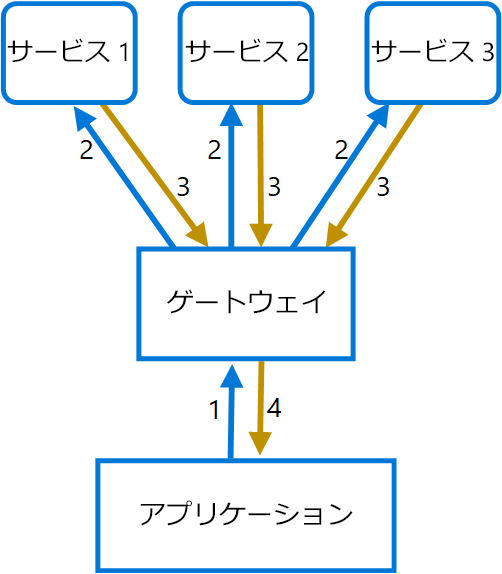

# <a name="gateway-aggregation-pattern"></a><span data-ttu-id="1337b-103">ゲートウェイ集約パターン</span><span class="sxs-lookup"><span data-stu-id="1337b-103">Gateway Aggregation pattern</span></span>

<span data-ttu-id="1337b-104">ゲートウェイを使用して、複数の個々の要求を 1 つの要求に集約します。</span><span class="sxs-lookup"><span data-stu-id="1337b-104">Use a gateway to aggregate multiple individual requests into a single request.</span></span> <span data-ttu-id="1337b-105">このパターンは、クライアントが操作を実行するために、さまざまなバックエンド システムに複数の呼び出しを行う必要がある場合に便利です。</span><span class="sxs-lookup"><span data-stu-id="1337b-105">This pattern is useful when a client must make multiple calls to different backend systems to perform an operation.</span></span>

## <a name="context-and-problem"></a><span data-ttu-id="1337b-106">コンテキストと問題</span><span class="sxs-lookup"><span data-stu-id="1337b-106">Context and problem</span></span>

<span data-ttu-id="1337b-107">1 つのタスクを実行するには、クライアントはさまざまなバックエンド サービスへの呼び出しを行う必要があります。</span><span class="sxs-lookup"><span data-stu-id="1337b-107">To perform a single task, a client may have to make multiple calls to various backend services.</span></span> <span data-ttu-id="1337b-108">タスクを実行するのに多くのサービスに依存するアプリケーションでは、要求ごとにリソースを展開する必要があります。</span><span class="sxs-lookup"><span data-stu-id="1337b-108">An application that relies on many services to perform a task must expend resources on each request.</span></span> <span data-ttu-id="1337b-109">アプリケーションに新しい機能やサービスが追加されると、追加の要求が必要になり、リソース要件およびネットワーク呼び出しが増加します。</span><span class="sxs-lookup"><span data-stu-id="1337b-109">When any new feature or service is added to the application, additional requests are needed, further increasing resource requirements and network calls.</span></span> <span data-ttu-id="1337b-110">このクライアントとバックエンド間の頻繁な通信が、アプリケーションのパフォーマンスとスケールに悪影響を及ぼす可能性があります。</span><span class="sxs-lookup"><span data-stu-id="1337b-110">This chattiness between a client and a backend can adversely impact the performance and scale of the application.</span></span>  <span data-ttu-id="1337b-111">サービス間で大量の呼び出しがある小さなサービスを中心にアプリケーションが構築されるマイクロサービス アーキテクチャでは、より頻繁にこの問題が発生します。</span><span class="sxs-lookup"><span data-stu-id="1337b-111">Microservice architectures have made this problem more common, as applications built around many smaller services naturally have a higher amount of cross-service calls.</span></span> 

<span data-ttu-id="1337b-112">次の図では、クライアントは、各サービスに要求を送信します (1、2、3)。</span><span class="sxs-lookup"><span data-stu-id="1337b-112">In the following diagram, the client sends requests to each service (1,2,3).</span></span> <span data-ttu-id="1337b-113">サービスはそれぞれ要求メッセージを処理し、アプリケーションに応答を送り返します (4、5、6)。</span><span class="sxs-lookup"><span data-stu-id="1337b-113">Each service processes the request and sends the response back to the application (4,5,6).</span></span> <span data-ttu-id="1337b-114">一般的に待機時間の長い携帯ネットワークでは、この方法で個々の要求を使用することは効率が悪く、接続が切断されたり、要求が不完全になったりする可能性があります。</span><span class="sxs-lookup"><span data-stu-id="1337b-114">Over a cellular network with typically high latency, using individual requests in this manner is inefficient and could result in broken connectivity or incomplete requests.</span></span> <span data-ttu-id="1337b-115">要求は並列で実行できますが、アプリケーションは各要求のデータをすべて個別の接続で送信、待機、および処理する必要があるため、エラーが発生する可能性が高くなります。</span><span class="sxs-lookup"><span data-stu-id="1337b-115">While each request may be done in parallel, the application must send, wait, and process data for each request, all on separate connections, increasing the chance of failure.</span></span>

 

## <a name="solution"></a><span data-ttu-id="1337b-116">解決策</span><span class="sxs-lookup"><span data-stu-id="1337b-116">Solution</span></span>

<span data-ttu-id="1337b-117">ゲートウェイを使用すると、クライアントとサービス間の頻繁な通信を削減できます。</span><span class="sxs-lookup"><span data-stu-id="1337b-117">Use a gateway to reduce chattiness between the client and the services.</span></span> <span data-ttu-id="1337b-118">ゲートウェイはクライアント要求を受信し、さまざまなバックエンド システムに要求をディスパッチして結果を集計し、それらを要求元のクライアントに送り返します。</span><span class="sxs-lookup"><span data-stu-id="1337b-118">The gateway receives client requests, dispatches requests to the various backend systems, and then aggregates the results and sends them back to the requesting client.</span></span>

<span data-ttu-id="1337b-119">このパターンでは、アプリケーションがバックエンド サービスに対して行う要求の数を削減して、待機時間の長いネットワーク経由でのアプリケーションのパフォーマンスを向上することができます。</span><span class="sxs-lookup"><span data-stu-id="1337b-119">This pattern can reduce the number of requests that the application makes to backend services, and improve application performance over high-latency networks.</span></span>

<span data-ttu-id="1337b-120">次の図では、アプリケーションはゲートウェイに要求を送信します (1)。</span><span class="sxs-lookup"><span data-stu-id="1337b-120">In the following diagram, the application sends a request to the gateway (1).</span></span> <span data-ttu-id="1337b-121">要求には、追加の要求のパッケージが含まれています。</span><span class="sxs-lookup"><span data-stu-id="1337b-121">The request contains a package of additional requests.</span></span> <span data-ttu-id="1337b-122">ゲートウェイがこれらを分解し、関連するサービスに各要求を送信して (2) 処理します。</span><span class="sxs-lookup"><span data-stu-id="1337b-122">The gateway decomposes these and processes each request by sending it to the relevant service (2).</span></span> <span data-ttu-id="1337b-123">各サービスが応答をゲートウェイに返します (3)。</span><span class="sxs-lookup"><span data-stu-id="1337b-123">Each service returns a response to the gateway (3).</span></span> <span data-ttu-id="1337b-124">ゲートウェイは、各サービスからの応答を結合し、アプリケーションに応答を送信します (4)。</span><span class="sxs-lookup"><span data-stu-id="1337b-124">The gateway combines the responses from each service and sends the response to the application (4).</span></span> <span data-ttu-id="1337b-125">アプリケーションは、1 つの要求を行い、ゲートウェイから 1 つの応答のみを受信します。</span><span class="sxs-lookup"><span data-stu-id="1337b-125">The application makes a single request and receives only a single response from the gateway.</span></span>



## <a name="issues-and-considerations"></a><span data-ttu-id="1337b-126">問題と注意事項</span><span class="sxs-lookup"><span data-stu-id="1337b-126">Issues and considerations</span></span>

- <span data-ttu-id="1337b-127">ゲートウェイがバックエンド間のサービス結合を行わないようにする必要があります。</span><span class="sxs-lookup"><span data-stu-id="1337b-127">The gateway should not introduce service coupling across the backend services.</span></span>
- <span data-ttu-id="1337b-128">できる限り待機時間を短縮するため、ゲートウェイはバックエンド サービスの近くに配置する必要があります。</span><span class="sxs-lookup"><span data-stu-id="1337b-128">The gateway should be located near the backend services to reduce latency as much as possible.</span></span>
- <span data-ttu-id="1337b-129">ゲートウェイ サービスによって、単一障害点が生じる可能性があります。</span><span class="sxs-lookup"><span data-stu-id="1337b-129">The gateway service may introduce a single point of failure.</span></span> <span data-ttu-id="1337b-130">アプリケーションの可用性の要件が満たされるように、ゲートウェイが適切に設計されていることを確認してください。</span><span class="sxs-lookup"><span data-stu-id="1337b-130">Ensure the gateway is properly designed to meet your application's availability requirements.</span></span>
- <span data-ttu-id="1337b-131">ゲートウェイによって、ボトルネックが生じる可能性があります。</span><span class="sxs-lookup"><span data-stu-id="1337b-131">The gateway may introduce a bottleneck.</span></span> <span data-ttu-id="1337b-132">負荷を処理するための適切なパフォーマンスがゲートウェイに備わっており、予測した成長に応じて拡張できることを確認してください。</span><span class="sxs-lookup"><span data-stu-id="1337b-132">Ensure the gateway has adequate performance to handle load and can be scaled to meet your anticipated growth.</span></span>
- <span data-ttu-id="1337b-133">サービスの連鎖的なエラーが発生しないように、ゲートウェイに対してロード テストを実行します。</span><span class="sxs-lookup"><span data-stu-id="1337b-133">Perform load testing against the gateway to ensure you don't introduce cascading failures for services.</span></span>
- <span data-ttu-id="1337b-134">[バルクヘッド][bulkhead]、[サーキット ブレーク][circuit-breaker]、[再試行][retry]、タイムアウトなどの手法を使用して、耐障害性のある設計を実装します。</span><span class="sxs-lookup"><span data-stu-id="1337b-134">Implement a resilient design, using techniques such as [bulkheads][bulkhead], [circuit breaking][circuit-breaker], [retry][retry], and timeouts.</span></span>
- <span data-ttu-id="1337b-135">1 つまたは複数のサービスの呼び出しに時間がかかりすぎる場合、タイムアウトが許容され、データの部分的なセットが返されることがあります。</span><span class="sxs-lookup"><span data-stu-id="1337b-135">If one or more service calls takes too long, it may be acceptable to timeout and return a partial set of data.</span></span> <span data-ttu-id="1337b-136">アプリケーションがこのシナリオを処理する方法を検討してください。</span><span class="sxs-lookup"><span data-stu-id="1337b-136">Consider how your application will handle this scenario.</span></span>
- <span data-ttu-id="1337b-137">非同期 I/O を使用して、バックエンドでの遅延によってアプリケーションでパフォーマンスの問題が発生しないようにしてください。</span><span class="sxs-lookup"><span data-stu-id="1337b-137">Use asynchronous I/O to ensure that a delay at the backend doesn't cause performance issues in the application.</span></span>
- <span data-ttu-id="1337b-138">相関 ID を使用して分散トレースを実装し、個々の呼び出しを追跡します。</span><span class="sxs-lookup"><span data-stu-id="1337b-138">Implement distributed tracing using correlation IDs to track each individual call.</span></span>
- <span data-ttu-id="1337b-139">要求メトリックおよび応答のサイズを監視します。</span><span class="sxs-lookup"><span data-stu-id="1337b-139">Monitor request metrics and response sizes.</span></span>
- <span data-ttu-id="1337b-140">エラーを処理するため、キャッシュ データをフェールオーバー戦略として返すことを検討してください。</span><span class="sxs-lookup"><span data-stu-id="1337b-140">Consider returning cached data as a failover strategy to handle failures.</span></span>
- <span data-ttu-id="1337b-141">ゲートウェイに集約を構築する代わりに、ゲートウェイの背後に集約サービスを配置することを検討してください。</span><span class="sxs-lookup"><span data-stu-id="1337b-141">Instead of building aggregation into the gateway, consider placing an aggregation service behind the gateway.</span></span> <span data-ttu-id="1337b-142">要求の集約には、ゲートウェイの他のサービスとは異なるリソース要件がある可能性があり、ゲートウェイのルーティングおよびオフロード機能に影響を及ぼすことがあります。</span><span class="sxs-lookup"><span data-stu-id="1337b-142">Request aggregation will likely have different resource requirements than other services in the gateway and may impact the gateway's routing and offloading functionality.</span></span>

## <a name="when-to-use-this-pattern"></a><span data-ttu-id="1337b-143">このパターンを使用する状況</span><span class="sxs-lookup"><span data-stu-id="1337b-143">When to use this pattern</span></span>

<span data-ttu-id="1337b-144">このパターンは次の状況で使用します。</span><span class="sxs-lookup"><span data-stu-id="1337b-144">Use this pattern when:</span></span>

- <span data-ttu-id="1337b-145">クライアントは、操作を実行するために、複数のバックエンド サービスと通信する必要があります。</span><span class="sxs-lookup"><span data-stu-id="1337b-145">A client needs to communicate with multiple backend services to perform an operation.</span></span>
- <span data-ttu-id="1337b-146">クライアントは、携帯ネットワークなどの待機時間が長いネットワークを使用することがあります。</span><span class="sxs-lookup"><span data-stu-id="1337b-146">The client may use networks with significant latency, such as cellular networks.</span></span>

<span data-ttu-id="1337b-147">このパターンは、次の状況では適切でない可能性があります。</span><span class="sxs-lookup"><span data-stu-id="1337b-147">This pattern may not be suitable when:</span></span>

- <span data-ttu-id="1337b-148">複数の操作で、クライアントと 1 つのサービス間の呼び出しの回数を削減したい場合。</span><span class="sxs-lookup"><span data-stu-id="1337b-148">You want to reduce the number of calls between a client and a single service across multiple operations.</span></span> <span data-ttu-id="1337b-149">このシナリオでは、サービスにバッチ操作を追加すると効果的である可能性があります。</span><span class="sxs-lookup"><span data-stu-id="1337b-149">In that scenario, it may be better to add a batch operation to the service.</span></span>
- <span data-ttu-id="1337b-150">クライアントまたはアプリケーションがバックエンド サービスの近くに配置されており、待機時間が重要な要因ではない場合。</span><span class="sxs-lookup"><span data-stu-id="1337b-150">The client or application is located near the backend services and latency is not a significant factor.</span></span>

## <a name="example"></a><span data-ttu-id="1337b-151">例</span><span class="sxs-lookup"><span data-stu-id="1337b-151">Example</span></span>

<span data-ttu-id="1337b-152">次の例では、Lua を使用してシンプルなゲートウェイ集約 NGINX サービスを作成する方法を示します。</span><span class="sxs-lookup"><span data-stu-id="1337b-152">The following example illustrates how to create a simple a gateway aggregation NGINX service using Lua.</span></span>

```lua
worker_processes  4;

events {
  worker_connections 1024;
}

http {
  server {
    listen 80;

    location = /batch {
      content_by_lua '
        ngx.req.read_body()

        -- read json body content
        local cjson = require "cjson"
        local batch = cjson.decode(ngx.req.get_body_data())["batch"]

        -- create capture_multi table
        local requests = {}
        for i, item in ipairs(batch) do
          table.insert(requests, {item.relative_url, { method = ngx.HTTP_GET}})
        end

        -- execute batch requests in parallel
        local results = {}
        local resps = { ngx.location.capture_multi(requests) }
        for i, res in ipairs(resps) do
          table.insert(results, {status = res.status, body = cjson.decode(res.body), header = res.header})
        end

        ngx.say(cjson.encode({results = results}))
      ';
    }

    location = /service1 {
      default_type application/json;
      echo '{"attr1":"val1"}';
    }

    location = /service2 {
      default_type application/json;
      echo '{"attr2":"val2"}';
    }
  }
}
```

## <a name="related-guidance"></a><span data-ttu-id="1337b-153">関連するガイダンス</span><span class="sxs-lookup"><span data-stu-id="1337b-153">Related guidance</span></span>

- [<span data-ttu-id="1337b-154">フロントエンド パターン用バックエンド</span><span class="sxs-lookup"><span data-stu-id="1337b-154">Backends for Frontends pattern</span></span>](./backends-for-frontends.md)
- [<span data-ttu-id="1337b-155">ゲートウェイ オフロード パターン</span><span class="sxs-lookup"><span data-stu-id="1337b-155">Gateway Offloading pattern</span></span>](./gateway-offloading.md)
- [<span data-ttu-id="1337b-156">ゲートウェイ ルーティング パターン</span><span class="sxs-lookup"><span data-stu-id="1337b-156">Gateway Routing pattern</span></span>](./gateway-routing.md)

[bulkhead]: ./bulkhead.md
[circuit-breaker]: ./circuit-breaker.md
[retry]: ./retry.md