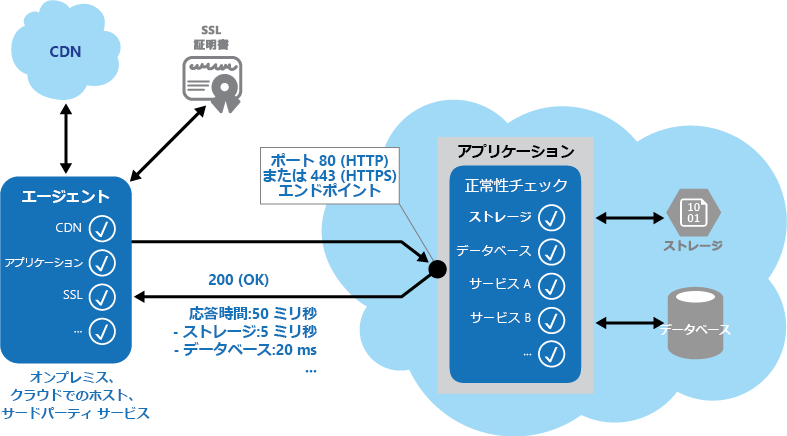

# <a name="health-endpoint-monitoring-pattern"></a><span data-ttu-id="9ae58-104">正常性エンドポイントの監視パターン</span><span class="sxs-lookup"><span data-stu-id="9ae58-104">Health Endpoint Monitoring pattern</span></span>

[!INCLUDE [header](../_includes/header.md)]

<span data-ttu-id="9ae58-105">公開されたエンドポイントを通じて外部ツールが定期的にアクセスできる機能チェックをアプリケーションに実装します。</span><span class="sxs-lookup"><span data-stu-id="9ae58-105">Implement functional checks in an application that external tools can access through exposed endpoints at regular intervals.</span></span> <span data-ttu-id="9ae58-106">これは、アプリケーションとサービスが正常に実行されていることを確認するのに役立ちます。</span><span class="sxs-lookup"><span data-stu-id="9ae58-106">This can help to verify that applications and services are performing correctly.</span></span>

## <a name="context-and-problem"></a><span data-ttu-id="9ae58-107">コンテキストと問題</span><span class="sxs-lookup"><span data-stu-id="9ae58-107">Context and problem</span></span>

<span data-ttu-id="9ae58-108">Web アプリケーションとバックエンド サービスを監視して、それらが利用可能で正しく実行されるようにすることは、望ましい取り組みであり、多くの場合、ビジネスの要件でもあります。</span><span class="sxs-lookup"><span data-stu-id="9ae58-108">It's a good practice, and often a business requirement, to monitor web applications and back-end services, to ensure they're available and performing correctly.</span></span> <span data-ttu-id="9ae58-109">しかし、クラウドで実行されているサービスの監視は、オンプレミスのサービスの監視よりも困難です。</span><span class="sxs-lookup"><span data-stu-id="9ae58-109">However, it's more difficult to monitor services running in the cloud than it is to monitor on-premises services.</span></span> <span data-ttu-id="9ae58-110">たとえば、ホスティング環境は完全に制御することができません。また、サービスは通常、プラットフォーム ベンダーなどが提供する他のサービスに依存しています。</span><span class="sxs-lookup"><span data-stu-id="9ae58-110">For example, you don't have full control of the hosting environment, and the services typically depend on other services provided by platform vendors and others.</span></span>

<span data-ttu-id="9ae58-111">クラウドでホストされているアプリケーションに影響する要素は、ネットワーク待ち時間、基盤となるコンピューティング システムおよびストレージ システムのパフォーマンスと可用性、それらの間のネットワーク帯域幅など、多数あります。</span><span class="sxs-lookup"><span data-stu-id="9ae58-111">There are many factors that affect cloud-hosted applications such as network latency, the performance and availability of the underlying compute and storage systems, and the network bandwidth between them.</span></span> <span data-ttu-id="9ae58-112">サービスは、これらの要素のいずれかが原因で、完全に失敗することもあれば、部分的に失敗することもあります。</span><span class="sxs-lookup"><span data-stu-id="9ae58-112">The service can fail entirely or partially due to any of these factors.</span></span> <span data-ttu-id="9ae58-113">そのため、必要なレベルの可用性が確保されるよう、サービスが正常に実行されていることを定期的に確認する必要があります。これは、場合によってはサービス レベル アグリーメント (SLA) に含まれています。</span><span class="sxs-lookup"><span data-stu-id="9ae58-113">Therefore, you must verify at regular intervals that the service is performing correctly to ensure the required level of availability, which might be part of your service level agreement (SLA).</span></span>

## <a name="solution"></a><span data-ttu-id="9ae58-114">解決策</span><span class="sxs-lookup"><span data-stu-id="9ae58-114">Solution</span></span>

<span data-ttu-id="9ae58-115">アプリケーションのエンドポイントに要求を送信して、正常性の監視を実装します。</span><span class="sxs-lookup"><span data-stu-id="9ae58-115">Implement health monitoring by sending requests to an endpoint on the application.</span></span> <span data-ttu-id="9ae58-116">アプリケーションによって必要なチェックが実行され、その状態を示す値が返されます。</span><span class="sxs-lookup"><span data-stu-id="9ae58-116">The application should perform the necessary checks, and return an indication of its status.</span></span>

<span data-ttu-id="9ae58-117">通常、正常性の監視のチェックでは 2 つの要素が組み合わされます。</span><span class="sxs-lookup"><span data-stu-id="9ae58-117">A health monitoring check typically combines two factors:</span></span>

- <span data-ttu-id="9ae58-118">正常性確認エンドポイントへの要求に応じて、アプリケーションまたはサービスによって実行されるチェック (ある場合)。</span><span class="sxs-lookup"><span data-stu-id="9ae58-118">The checks (if any) performed by the application or service in response to the request to the health verification endpoint.</span></span>
- <span data-ttu-id="9ae58-119">正常性確認チェックを実行するツールまたはフレームワークによる結果の分析。</span><span class="sxs-lookup"><span data-stu-id="9ae58-119">Analysis of the results by the tool or framework that performs the health verification check.</span></span>

<span data-ttu-id="9ae58-120">応答コードは、アプリケーションの状態のほか、必要に応じて、そのアプリケーションで使用されているコンポーネントまたはサービスの状態も示します。</span><span class="sxs-lookup"><span data-stu-id="9ae58-120">The response code indicates the status of the application and, optionally, any components or services it uses.</span></span> <span data-ttu-id="9ae58-121">待ち時間または応答時間のチェックは、監視ツールまたはフレームワークによって実行されます。</span><span class="sxs-lookup"><span data-stu-id="9ae58-121">The latency or response time check is performed by the monitoring tool or framework.</span></span> <span data-ttu-id="9ae58-122">この図は、パターンの概要を示しています。</span><span class="sxs-lookup"><span data-stu-id="9ae58-122">The figure provides an overview of the pattern.</span></span>



<span data-ttu-id="9ae58-124">アプリケーションの正常性監視コードによって実行されるその他のチェックには、以下があります。</span><span class="sxs-lookup"><span data-stu-id="9ae58-124">Other checks that might be carried out by the health monitoring code in the application include:</span></span>

- <span data-ttu-id="9ae58-125">クラウド ストレージまたはデータベースの可用性と応答時間のチェック。</span><span class="sxs-lookup"><span data-stu-id="9ae58-125">Checking cloud storage or a database for availability and response time.</span></span>
- <span data-ttu-id="9ae58-126">アプリケーション内にあるその他のリソースやサービス、または他の場所にあるがアプリケーションで使用されるその他のリソースやサービスのチェック。</span><span class="sxs-lookup"><span data-stu-id="9ae58-126">Checking other resources or services located in the application, or located elsewhere but used by the application.</span></span>

<span data-ttu-id="9ae58-127">Web アプリケーションを監視するサービスとツールを利用できます。Web アプリケーションを監視するには、構成可能な一連のエンドポイントに要求を送信し、構成可能な一連のルールに基づいて結果を評価します。</span><span class="sxs-lookup"><span data-stu-id="9ae58-127">Services and tools are available that monitor web applications by submitting a request to a configurable set of endpoints, and evaluating the results against a set of configurable rules.</span></span> <span data-ttu-id="9ae58-128">システムでいくつかの機能テストを実行することだけが目的のサービス エンドポイントの作成は比較的簡単です。</span><span class="sxs-lookup"><span data-stu-id="9ae58-128">It's relatively easy to create a service endpoint whose sole purpose is to perform some functional tests on the system.</span></span>

<span data-ttu-id="9ae58-129">監視ツールで実行できる一般的なチェックには、以下があります。</span><span class="sxs-lookup"><span data-stu-id="9ae58-129">Typical checks that can be performed by the monitoring tools include:</span></span>

- <span data-ttu-id="9ae58-130">応答コードの確認。</span><span class="sxs-lookup"><span data-stu-id="9ae58-130">Validating the response code.</span></span> <span data-ttu-id="9ae58-131">たとえば HTTP 応答 200 (OK) は、アプリケーションがエラーなしで応答したことを示します。</span><span class="sxs-lookup"><span data-stu-id="9ae58-131">For example, an HTTP response of 200 (OK) indicates that the application responded without error.</span></span> <span data-ttu-id="9ae58-132">監視システムは、より包括的な結果が得られるように、他の応答コードをチェックする場合もあります。</span><span class="sxs-lookup"><span data-stu-id="9ae58-132">The monitoring system might also check for other response codes to give more comprehensive results.</span></span>
- <span data-ttu-id="9ae58-133">200 (OK) 状態コードが返された場合でもエラーを検出することを目的とした、応答の内容のチェック。</span><span class="sxs-lookup"><span data-stu-id="9ae58-133">Checking the content of the response to detect errors, even when a 200 (OK) status code is returned.</span></span> <span data-ttu-id="9ae58-134">これにより、返された Web ページまたはサービスの応答の一部にのみ影響するエラーを検出できます。</span><span class="sxs-lookup"><span data-stu-id="9ae58-134">This can detect errors that affect only a section of the returned web page or service response.</span></span> <span data-ttu-id="9ae58-135">たとえば、ページのタイトルのチェックや、正しいページが返されたことを示す特定のフレーズの検索です。</span><span class="sxs-lookup"><span data-stu-id="9ae58-135">For example, checking the title of a page or looking for a specific phrase that indicates the correct page was returned.</span></span>
- <span data-ttu-id="9ae58-136">応答時間の測定。この応答時間は、ネットワーク待ち時間とアプリケーションが要求の実行に要した時間を足した時間を指します。</span><span class="sxs-lookup"><span data-stu-id="9ae58-136">Measuring the response time, which indicates a combination of the network latency and the time that the application took to execute the request.</span></span> <span data-ttu-id="9ae58-137">値が大きくなると、アプリケーションまたはネットワークで新しく発生した問題を示唆している可能性があります。</span><span class="sxs-lookup"><span data-stu-id="9ae58-137">An increasing value can indicate an emerging problem with the application or network.</span></span>
- <span data-ttu-id="9ae58-138">アプリケーション外のリソースまたはサービスのチェック (グローバルなキャッシュからコンテンツを配信するためにアプリケーションで使用されているコンテンツ配信ネットワークなど)。</span><span class="sxs-lookup"><span data-stu-id="9ae58-138">Checking resources or services located outside the application, such as a content delivery network used by the application to deliver content from global caches.</span></span>
- <span data-ttu-id="9ae58-139">SSL 証明書の期限切れのチェック。</span><span class="sxs-lookup"><span data-stu-id="9ae58-139">Checking for expiration of SSL certificates.</span></span>
- <span data-ttu-id="9ae58-140">DNS の待ち時間およびエラーを測定することを目的とした、アプリケーションの URL に対する DNS 参照の応答時間の測定。</span><span class="sxs-lookup"><span data-stu-id="9ae58-140">Measuring the response time of a DNS lookup for the URL of the application to measure DNS latency and DNS failures.</span></span>
- <span data-ttu-id="9ae58-141">正しいエントリを確保することを目的とした、DNS 参照によって返される URL の検証。</span><span class="sxs-lookup"><span data-stu-id="9ae58-141">Validating the URL returned by the DNS lookup to ensure correct entries.</span></span> <span data-ttu-id="9ae58-142">これは、DNS サーバーへの攻撃が成功して悪意のある要求リダイレクトが行われるのを防ぐうえで役に立ちます。</span><span class="sxs-lookup"><span data-stu-id="9ae58-142">This can help to avoid malicious request redirection through a successful attack on the DNS server.</span></span>

<span data-ttu-id="9ae58-143">また、可能であれば、これらのチェックをさまざまなオンプレミスの場所またホストされた場所から実行し、応答時間の測定と比較を行うことも役立ちます。</span><span class="sxs-lookup"><span data-stu-id="9ae58-143">It's also useful, where possible, to run these checks from different on-premises or hosted locations to measure and compare response times.</span></span> <span data-ttu-id="9ae58-144">理想的には、顧客に近い場所からアプリケーションを監視し、それぞれの場所からのパフォーマンスを正確に把握することが推奨されます。</span><span class="sxs-lookup"><span data-stu-id="9ae58-144">Ideally you should monitor applications from locations that are close to customers to get an accurate view of the performance from each location.</span></span> <span data-ttu-id="9ae58-145">チェック メカニズムの堅牢性を高めることができるうえ、アプリケーションのデプロイ場所を決定したり、それを複数のデータセンターにデプロイするかどうかを決定したりする際に、結果が役に立ちます。</span><span class="sxs-lookup"><span data-stu-id="9ae58-145">In addition to providing a more robust checking mechanism, the results can help you decide on the deployment location for the application&mdash;and whether to deploy it in more than one datacenter.</span></span>

<span data-ttu-id="9ae58-146">またテストは、顧客が使用するすべてのサービス インスタンスに対して実行し、アプリケーションがすべての顧客に対して正常に動作していることを確認する必要があります。</span><span class="sxs-lookup"><span data-stu-id="9ae58-146">Tests should also be run against all the service instances that customers use to ensure the application is working correctly for all customers.</span></span> <span data-ttu-id="9ae58-147">たとえば、顧客のストレージが複数のストレージ アカウントに分散されている場合、監視プロセスではこれらをすべてチェックする必要があります。</span><span class="sxs-lookup"><span data-stu-id="9ae58-147">For example, if customer storage is spread across more than one storage account, the monitoring process should check all of these.</span></span>

## <a name="issues-and-considerations"></a><span data-ttu-id="9ae58-148">問題と注意事項</span><span class="sxs-lookup"><span data-stu-id="9ae58-148">Issues and considerations</span></span>

<span data-ttu-id="9ae58-149">このパターンの実装方法を決めるときには、以下の点に注意してください。</span><span class="sxs-lookup"><span data-stu-id="9ae58-149">Consider the following points when deciding how to implement this pattern:</span></span>

<span data-ttu-id="9ae58-150">応答を確認する方法。</span><span class="sxs-lookup"><span data-stu-id="9ae58-150">How to validate the response.</span></span> <span data-ttu-id="9ae58-151">たとえば、アプリケーションが正常に動作していることを確認するには、200 (OK) 状態コードだけで十分でしょうか。</span><span class="sxs-lookup"><span data-stu-id="9ae58-151">For example, is just a single 200 (OK) status code sufficient to verify the application is working correctly?</span></span> <span data-ttu-id="9ae58-152">これは、アプリケーション可用性の最も基本的な基準であり、このパターンの最低限の実装である一方、アプリケーションの動作、傾向、問題発生の可能性に関する情報をほとんど提供してくれません。</span><span class="sxs-lookup"><span data-stu-id="9ae58-152">While this provides the most basic measure of application availability, and is the minimum implementation of this pattern, it provides little information about the operations, trends, and possible upcoming issues in the application.</span></span>

   > <span data-ttu-id="9ae58-153">200 (OK) がアプリケーションによって正常に返されるのは、ターゲット リソースが見つかって処理された場合のみであることを確認してください。</span><span class="sxs-lookup"><span data-stu-id="9ae58-153">Make sure that the application correctly returns a 200 (OK) only when the target resource is found and processed.</span></span> <span data-ttu-id="9ae58-154">一部のシナリオ (ターゲット Web ページのホストにマスター ページを使用している場合など) では、ターゲットのコンテンツ ページが見つからなかった場合でも、サーバーから 404 (見つかりません) コードではなく 200 (OK) 状態コードが返されます。</span><span class="sxs-lookup"><span data-stu-id="9ae58-154">In some scenarios, such as when using a master page to host the target web page, the server sends back a 200 (OK) status code instead of a 404 (Not Found) code, even when the target content page was not found.</span></span>

<span data-ttu-id="9ae58-155">アプリケーション用に公開されるエンドポイントの数。</span><span class="sxs-lookup"><span data-stu-id="9ae58-155">The number of endpoints to expose for an application.</span></span> <span data-ttu-id="9ae58-156">1 つのアプローチとしては、アプリケーションによって使用されるコア サービス用に少なくとも 1 つのエンドポイントを公開し、優先度の低いサービス用に別のエンドポイントを公開する方法があります。これにより、それぞれの監視結果に異なる重要度を割り当てることができます。</span><span class="sxs-lookup"><span data-stu-id="9ae58-156">One approach is to expose at least one endpoint for the core services that the application uses and another for lower priority services, allowing different levels of importance to be assigned to each monitoring result.</span></span> <span data-ttu-id="9ae58-157">また、監視の粒度を高めるために、(コア サービスごとに 1 つなど) 公開するエンドポイントを増やすことも検討します。</span><span class="sxs-lookup"><span data-stu-id="9ae58-157">Also consider exposing more endpoints, such as one for each core service, for additional monitoring granularity.</span></span> <span data-ttu-id="9ae58-158">たとえば、正常性確認チェックでは、アプリケーションで使用されるデータベース、ストレージ、外部のジオコーディング サービスをチェックする場合があります。これらはそれぞれ、異なるレベルのアップタイムと応答時間が必要とされています。</span><span class="sxs-lookup"><span data-stu-id="9ae58-158">For example, a health verification check might check the database, storage, and an external geocoding service that an application uses, with each requiring a different level of uptime and response time.</span></span> <span data-ttu-id="9ae58-159">ジオコーディング サービスやその他のバックグラウンド タスクが数分間利用できない場合でも、アプリケーションは依然として正常である可能性があります。</span><span class="sxs-lookup"><span data-stu-id="9ae58-159">The application could still be healthy if the geocoding service, or some other background task, is unavailable for a few minutes.</span></span>

<span data-ttu-id="9ae58-160">監視用のエンドポイントに一般的なアクセスと同じエンドポイントを使用するかどうか (ただし、一般のアクセス エンドポイント上に正常性確認チェック用の固有のパス (例: /HealthCheck/{GUID}/) を作成)。</span><span class="sxs-lookup"><span data-stu-id="9ae58-160">Whether to use the same endpoint for monitoring as is used for general access, but to a specific path designed for health verification checks, for example, /HealthCheck/{GUID}/ on the general access endpoint.</span></span> <span data-ttu-id="9ae58-161">これにより、一般のアクセス エンドポイントが利用可能であることを確認しながら、監視ツールでアプリケーションの一部の機能テストを実行できます (新しいユーザー登録の追加、サインイン、テストの注文など)。</span><span class="sxs-lookup"><span data-stu-id="9ae58-161">This allows some functional tests in the application to be run by the monitoring tools, such as adding a new user registration, signing in, and placing a test order, while also verifying that the general access endpoint is available.</span></span>

<span data-ttu-id="9ae58-162">監視の要求に応じてサービスで収集される情報の種類と、その情報を返す方法。</span><span class="sxs-lookup"><span data-stu-id="9ae58-162">The type of information to collect in the service in response to monitoring requests, and how to return this information.</span></span> <span data-ttu-id="9ae58-163">ほとんどの既存のツールとフレームワークでは、エンドポイントから返された HTTP 状態コードしか表示されません。</span><span class="sxs-lookup"><span data-stu-id="9ae58-163">Most existing tools and frameworks look only at the HTTP status code that the endpoint returns.</span></span> <span data-ttu-id="9ae58-164">その他の情報が返されて確認できるようにするには、カスタム監視ユーティリティまたはサービスの作成が必要な場合があります。</span><span class="sxs-lookup"><span data-stu-id="9ae58-164">To return and validate additional information, you might have to create a custom monitoring utility or service.</span></span>

<span data-ttu-id="9ae58-165">収集する情報の量。</span><span class="sxs-lookup"><span data-stu-id="9ae58-165">How much information to collect.</span></span> <span data-ttu-id="9ae58-166">チェック中に過剰な処理を実行すると、アプリケーションのオーバーロードが発生し、他のユーザーに影響が及ぶ可能性があります。</span><span class="sxs-lookup"><span data-stu-id="9ae58-166">Performing excessive processing during the check can overload the application and impact other users.</span></span> <span data-ttu-id="9ae58-167">所要時間が監視システムのタイムアウト時間を超える場合があり、そうなると、アプリケーションが利用不可としてマークされます。</span><span class="sxs-lookup"><span data-stu-id="9ae58-167">The time it takes might exceed the timeout of the monitoring system so it marks the application as unavailable.</span></span> <span data-ttu-id="9ae58-168">ほとんどのアプリケーションには、パフォーマンスと詳細なエラー情報を記録するエラー ハンドラーやパフォーマンス カウンターなど、インストルメンテーションが備わっています。正常性確認チェックで追加の情報が返されるようにしなくても、それで十分な場合があります。</span><span class="sxs-lookup"><span data-stu-id="9ae58-168">Most applications include instrumentation such as error handlers and performance counters that log performance and detailed error information, this might be sufficient instead of returning additional information from a health verification check.</span></span>

<span data-ttu-id="9ae58-169">エンドポイントの状態のキャッシュ。</span><span class="sxs-lookup"><span data-stu-id="9ae58-169">Caching the endpoint status.</span></span> <span data-ttu-id="9ae58-170">正常性チェックを実行する頻度が高すぎると、コストが高くなる可能性があります。</span><span class="sxs-lookup"><span data-stu-id="9ae58-170">It could be expensive to run the health check too frequently.</span></span> <span data-ttu-id="9ae58-171">たとえば、正常性の状態がダッシュボード経由で報告される場合、正常性チェックのトリガーには、ダッシュボードのすべての要求が必要なわけではありません。</span><span class="sxs-lookup"><span data-stu-id="9ae58-171">If the health status is reported through a dashboard, for example, you don't want every request from the dashboard to trigger a health check.</span></span> <span data-ttu-id="9ae58-172">その代わり、定期的にシステムの正常性をチェックし、状態をキャッシュします。</span><span class="sxs-lookup"><span data-stu-id="9ae58-172">Instead, periodically check the system health and cache the status.</span></span> <span data-ttu-id="9ae58-173">キャッシュされた状態を返すエンドポイントを公開します。</span><span class="sxs-lookup"><span data-stu-id="9ae58-173">Expose an endpoint that returns the cached status.</span></span>

<span data-ttu-id="9ae58-174">パブリック アクセスから監視エンドポイントを保護するためのセキュリティを構成する方法。パブリック アクセスでは、アプリケーションが悪意のある攻撃にさらされるほか、機密情報の漏洩のリスクが生じたり、サービス拒否 (DoS) 攻撃が誘発されたりする可能性があります。</span><span class="sxs-lookup"><span data-stu-id="9ae58-174">How to configure security for the monitoring endpoints to protect them from public access, which might expose the application to malicious attacks, risk the exposure of sensitive information, or attract denial of service (DoS) attacks.</span></span> <span data-ttu-id="9ae58-175">これは通常、アプリケーションを再起動せずに簡単に更新できるよう、アプリケーション構成で行う必要があります。</span><span class="sxs-lookup"><span data-stu-id="9ae58-175">Typically this should be done in the application configuration so that it can be updated easily without restarting the application.</span></span> <span data-ttu-id="9ae58-176">以下の手法を 1 つ以上使用することを検討してください。</span><span class="sxs-lookup"><span data-stu-id="9ae58-176">Consider using one or more of the following techniques:</span></span>

- <span data-ttu-id="9ae58-177">認証を要求することでエンドポイントをセキュリティで保護する。</span><span class="sxs-lookup"><span data-stu-id="9ae58-177">Secure the endpoint by requiring authentication.</span></span> <span data-ttu-id="9ae58-178">これを行うには、監視サービスまたは監視ツールで認証がサポートされているという条件で、要求ヘッダーで認証セキュリティ キーを使用するか、要求と共に資格情報を渡します。</span><span class="sxs-lookup"><span data-stu-id="9ae58-178">You can do this by using an authentication security key in the request header or by passing credentials with the request, provided that the monitoring service or tool supports authentication.</span></span>

  - <span data-ttu-id="9ae58-179">不明瞭なエンドポイントまたは非表示のエンドポイントを使用する。</span><span class="sxs-lookup"><span data-stu-id="9ae58-179">Use an obscure or hidden endpoint.</span></span> <span data-ttu-id="9ae58-180">たとえば、別の IP アドレスのエンドポイントを既定のアプリケーション URL で使用される IP アドレスに公開したり、非標準の HTTP ポートでエンドポイントを構成したり、テスト ページに複雑なパスを使用したりします。</span><span class="sxs-lookup"><span data-stu-id="9ae58-180">For example, expose the endpoint on a different IP address to that used by the default application URL, configure the endpoint on a nonstandard HTTP port, and/or use a complex path to the test page.</span></span> <span data-ttu-id="9ae58-181">通常、アプリケーション構成で追加のエンドポイント アドレスとポートを指定できます。また必要な場合は、IP アドレスを直接指定しなくてもよいように、これらのエンドポイントのエントリを DNS サーバーに追加できます。</span><span class="sxs-lookup"><span data-stu-id="9ae58-181">You can usually specify additional endpoint addresses and ports in the application configuration, and add entries for these endpoints to the DNS server if required to avoid having to specify the IP address directly.</span></span>

  - <span data-ttu-id="9ae58-182">キー値や操作モード値などのパラメーターを受け入れるメソッドをエンドポイントで公開する。</span><span class="sxs-lookup"><span data-stu-id="9ae58-182">Expose a method on an endpoint that accepts a parameter such as a key value or an operation mode value.</span></span> <span data-ttu-id="9ae58-183">このパラメーターに指定された値に応じて、要求が受信された際に、コードは特定のテストまたは一連のテストを実行できます。また、パラメーター値が認識されない場合は 404 (見つかりません) エラーが返されます。</span><span class="sxs-lookup"><span data-stu-id="9ae58-183">Depending on the value supplied for this parameter, when a request is received the code can perform a specific test or set of tests, or return a 404 (Not Found) error if the parameter value isn't recognized.</span></span> <span data-ttu-id="9ae58-184">認識されるパラメーター値は、アプリケーション構成で設定できます。</span><span class="sxs-lookup"><span data-stu-id="9ae58-184">The recognized parameter values could be set in the application configuration.</span></span>

     >  <span data-ttu-id="9ae58-185">アプリケーションの操作が損なわれることなく基本的な機能テストが実行される別個のエンドポイントへの影響は、多くの場合、DoS 攻撃の及ぼす影響が少なくなります。</span><span class="sxs-lookup"><span data-stu-id="9ae58-185">DoS attacks are likely to have less impact on a separate endpoint that performs basic functional tests without compromising the operation of the application.</span></span> <span data-ttu-id="9ae58-186">機密情報の漏洩につながる可能性のあるテストの使用は避けるのが理想的です。</span><span class="sxs-lookup"><span data-stu-id="9ae58-186">Ideally, avoid using a test that might expose sensitive information.</span></span> <span data-ttu-id="9ae58-187">攻撃者にとって有益な情報を返す必要がある場合は、エンドポイントとデータを未承認のアクセスから防ぐ方法を検討してください。</span><span class="sxs-lookup"><span data-stu-id="9ae58-187">If you must return information that might be useful to an attacker, consider how you'll protect the endpoint and the data from unauthorized access.</span></span> <span data-ttu-id="9ae58-188">この場合、不明瞭さに依存するだけでは不十分です。</span><span class="sxs-lookup"><span data-stu-id="9ae58-188">In this case just relying on obscurity isn't enough.</span></span> <span data-ttu-id="9ae58-189">サーバーの負荷を増加させることになりますが、HTTPS 接続の使用と機密データの暗号化も検討する必要があります。</span><span class="sxs-lookup"><span data-stu-id="9ae58-189">You should also consider using an HTTPS connection and encrypting any sensitive data, although this will increase the load on the server.</span></span>

- <span data-ttu-id="9ae58-190">認証を使用してセキュリティで保護されているエンドポイントにアクセスする方法。</span><span class="sxs-lookup"><span data-stu-id="9ae58-190">How to access an endpoint that's secured using authentication.</span></span> <span data-ttu-id="9ae58-191">正常性確認要求での資格情報の追加は、すべてのツールとフレームワークで構成できるわけではありません。</span><span class="sxs-lookup"><span data-stu-id="9ae58-191">Not all tools and frameworks can be configured to include credentials with the health verification request.</span></span> <span data-ttu-id="9ae58-192">たとえば、Microsoft Azure の組み込みの正常性確認機能では、認証資格情報を指定できません。</span><span class="sxs-lookup"><span data-stu-id="9ae58-192">For example, Microsoft Azure built-in health verification features can't provide authentication credentials.</span></span> <span data-ttu-id="9ae58-193">サードパーティの選択肢には、[Pingdom](https://www.pingdom.com/)、[Panopta](https://www.panopta.com/)、[NewRelic](https://newrelic.com/)、[Statuscake](https://www.statuscake.com/) があります。</span><span class="sxs-lookup"><span data-stu-id="9ae58-193">Some third-party alternatives are [Pingdom](https://www.pingdom.com/), [Panopta](https://www.panopta.com/), [NewRelic](https://newrelic.com/), and [Statuscake](https://www.statuscake.com/).</span></span>

- <span data-ttu-id="9ae58-194">監視エージェントが正しく実行されるようにする方法。</span><span class="sxs-lookup"><span data-stu-id="9ae58-194">How to ensure that the monitoring agent is performing correctly.</span></span> <span data-ttu-id="9ae58-195">1 つの手法として、アプリケーション構成からの値、またはエージェントのテストに使用できるランダムな値を返すだけのエンドポイントを公開します。</span><span class="sxs-lookup"><span data-stu-id="9ae58-195">One approach is to expose an endpoint that simply returns a value from the application configuration or a random value that can be used to test the agent.</span></span>

   >  <span data-ttu-id="9ae58-196">また、誤検知の結果の発行を防ぐため、監視システムでそれ自体のチェック (自己テストや組み込みのテストなど) が実行されるようにします。</span><span class="sxs-lookup"><span data-stu-id="9ae58-196">Also ensure that the monitoring system performs checks on itself, such as a self-test and built-in test, to avoid it issuing false positive results.</span></span>

## <a name="when-to-use-this-pattern"></a><span data-ttu-id="9ae58-197">このパターンを使用する状況</span><span class="sxs-lookup"><span data-stu-id="9ae58-197">When to use this pattern</span></span>

<span data-ttu-id="9ae58-198">このパターンは次の目的に役立ちます。</span><span class="sxs-lookup"><span data-stu-id="9ae58-198">This pattern is useful for:</span></span>

- <span data-ttu-id="9ae58-199">Web サイトと Web アプリケーションを監視して可用性を確認する。</span><span class="sxs-lookup"><span data-stu-id="9ae58-199">Monitoring websites and web applications to verify availability.</span></span>
- <span data-ttu-id="9ae58-200">Web サイトと Web アプリケーションを監視して動作の正常性をチェックする。</span><span class="sxs-lookup"><span data-stu-id="9ae58-200">Monitoring websites and web applications to check for correct operation.</span></span>
- <span data-ttu-id="9ae58-201">中間層または共有のサービスを監視し、他のアプリケーションを中断させる可能性があるエラーを検出して分離する。</span><span class="sxs-lookup"><span data-stu-id="9ae58-201">Monitoring middle-tier or shared services to detect and isolate a failure that could disrupt other applications.</span></span>
- <span data-ttu-id="9ae58-202">アプリケーションの既存のインストルメンテーション (パフォーマンス カウンターやエラー ハンドラーなど) を補完する。</span><span class="sxs-lookup"><span data-stu-id="9ae58-202">Complementing existing instrumentation in the application, such as performance counters and error handlers.</span></span> <span data-ttu-id="9ae58-203">正常性確認チェックは、アプリケーションのログと監査に関する要件に代わるものではありません。</span><span class="sxs-lookup"><span data-stu-id="9ae58-203">Health verification checking doesn't replace the requirement for logging and auditing in the application.</span></span> <span data-ttu-id="9ae58-204">インストルメンテーションからは、エラーやその他の問題を検出するためにカウンターとエラー ログを監視する既存のフレームワークに関して、有益な情報を提供できます。</span><span class="sxs-lookup"><span data-stu-id="9ae58-204">Instrumentation can provide valuable information for an existing framework that monitors counters and error logs to detect failures or other issues.</span></span> <span data-ttu-id="9ae58-205">しかし、アプリケーションが利用できない場合、情報は提供できません。</span><span class="sxs-lookup"><span data-stu-id="9ae58-205">However, it can't provide information if the application is unavailable.</span></span>

## <a name="example"></a><span data-ttu-id="9ae58-206">例</span><span class="sxs-lookup"><span data-stu-id="9ae58-206">Example</span></span>

<span data-ttu-id="9ae58-207">`HealthCheckController` クラス (このパターンを紹介するサンプルは [GitHub](https://github.com/mspnp/cloud-design-patterns/tree/master/health-endpoint-monitoring) で入手できます) から抜粋された次のコード サンプルでは、さまざまな正常性チェックを実行するためのエンドポイントの公開を示しています。</span><span class="sxs-lookup"><span data-stu-id="9ae58-207">The following code examples, taken from the `HealthCheckController` class (a sample that demonstrates this pattern is available on [GitHub](https://github.com/mspnp/cloud-design-patterns/tree/master/health-endpoint-monitoring)), demonstrates exposing an endpoint for performing a range of health checks.</span></span>

<span data-ttu-id="9ae58-208">下に示す C# の `CoreServices` メソッドでは、アプリケーションで使用されるサービスに対して一連のチェックを実行します。</span><span class="sxs-lookup"><span data-stu-id="9ae58-208">The `CoreServices` method, shown below in C#, performs a series of checks on services used in the application.</span></span> <span data-ttu-id="9ae58-209">すべてのテストがエラーなしで実行されると、このメソッドは 200 (OK) 状態コードを返します。</span><span class="sxs-lookup"><span data-stu-id="9ae58-209">If all of the tests run without error, the method returns a 200 (OK) status code.</span></span> <span data-ttu-id="9ae58-210">いずれかのテストで例外が発生すると、このメソッドは 500 (内部エラー) 状態コードを返します。</span><span class="sxs-lookup"><span data-stu-id="9ae58-210">If any of the tests raises an exception, the method returns a 500 (Internal Error) status code.</span></span> <span data-ttu-id="9ae58-211">監視ツールまたは監視フレームワークでこのメソッドを使用できる場合、エラーが発生したときにオプションで追加の情報が返されることがあります。</span><span class="sxs-lookup"><span data-stu-id="9ae58-211">The method could optionally return additional information when an error occurs, if the monitoring tool or framework is able to make use of it.</span></span>

```csharp
public ActionResult CoreServices()
{
  try
  {
    // Run a simple check to ensure the database is available.
    DataStore.Instance.CoreHealthCheck();

    // Run a simple check on our external service.
    MyExternalService.Instance.CoreHealthCheck();
  }
  catch (Exception ex)
  {
    Trace.TraceError("Exception in basic health check: {0}", ex.Message);

    // This can optionally return different status codes based on the exception.
    // Optionally it could return more details about the exception.
    // The additional information could be used by administrators who access the
    // endpoint with a browser, or using a ping utility that can display the
    // additional information.
    return new HttpStatusCodeResult((int)HttpStatusCode.InternalServerError);
  }
  return new HttpStatusCodeResult((int)HttpStatusCode.OK);
}
```

<span data-ttu-id="9ae58-212">`ObscurePath` メソッドは、アプリケーション構成からパスを読み取り、それをテストのエンドポイントとして使用する方法を示します。</span><span class="sxs-lookup"><span data-stu-id="9ae58-212">The `ObscurePath` method shows how you can read a path from the application configuration and use it as the endpoint for tests.</span></span> <span data-ttu-id="9ae58-213">この例 (C#) では、ID をパラメーターとして受け取り、それを使用して有効な要求をチェックする方法も示します。</span><span class="sxs-lookup"><span data-stu-id="9ae58-213">This example, in C#, also shows how you can accept an ID as a parameter and use it to check for valid requests.</span></span>

```csharp
public ActionResult ObscurePath(string id)
{
  // The id could be used as a simple way to obscure or hide the endpoint.
  // The id to match could be retrieved from configuration and, if matched,
  // perform a specific set of tests and return the result. If not matched it
  // could return a 404 (Not Found) status.

  // The obscure path can be set through configuration to hide the endpoint.
  var hiddenPathKey = CloudConfigurationManager.GetSetting("Test.ObscurePath");

  // If the value passed does not match that in configuration, return 404 (Not Found).
  if (!string.Equals(id, hiddenPathKey))
  {
    return new HttpStatusCodeResult((int)HttpStatusCode.NotFound);
  }

  // Else continue and run the tests...
  // Return results from the core services test.
  return this.CoreServices();
}
```

<span data-ttu-id="9ae58-214">`TestResponseFromConfig` メソッドは、指定した構成設定値のチェックを実行するエンドポイントを公開する方法を示します。</span><span class="sxs-lookup"><span data-stu-id="9ae58-214">The `TestResponseFromConfig` method shows how you can expose an endpoint that performs a check for a specified configuration setting value.</span></span>

```csharp
public ActionResult TestResponseFromConfig()
{
  // Health check that returns a response code set in configuration for testing.
  var returnStatusCodeSetting = CloudConfigurationManager.GetSetting(
                                                          "Test.ReturnStatusCode");

  int returnStatusCode;

  if (!int.TryParse(returnStatusCodeSetting, out returnStatusCode))
  {
    returnStatusCode = (int)HttpStatusCode.OK;
  }

  return new HttpStatusCodeResult(returnStatusCode);
}
```

## <a name="monitoring-endpoints-in-azure-hosted-applications"></a><span data-ttu-id="9ae58-215">Azure でホストされているアプリケーションのエンドポイントの監視</span><span class="sxs-lookup"><span data-stu-id="9ae58-215">Monitoring endpoints in Azure hosted applications</span></span>

<span data-ttu-id="9ae58-216">Azure アプリケーションのエンドポイントの監視には、いくつかのオプションがあります。</span><span class="sxs-lookup"><span data-stu-id="9ae58-216">Some options for monitoring endpoints in Azure applications are:</span></span>

- <span data-ttu-id="9ae58-217">Azure の組み込みの監視機能を使用する。</span><span class="sxs-lookup"><span data-stu-id="9ae58-217">Use the built-in monitoring features of Azure.</span></span>

- <span data-ttu-id="9ae58-218">サードパーティのサービスまたはフレームワークを使用する (Microsoft System Center Operations Manager など)。</span><span class="sxs-lookup"><span data-stu-id="9ae58-218">Use a third-party service or a framework such as Microsoft System Center Operations Manager.</span></span>

- <span data-ttu-id="9ae58-219">独自のサーバーまたはホストされているサーバーで実行されるカスタム ユーティリティまたはサービスを作成する。</span><span class="sxs-lookup"><span data-stu-id="9ae58-219">Create a custom utility or a service that runs on your own or on a hosted server.</span></span>

   >  <span data-ttu-id="9ae58-220">Azure には、かなり包括的な一連の監視オプションが用意されていますが、さらに情報を得るために、その他のサービスとツールを使用できます。</span><span class="sxs-lookup"><span data-stu-id="9ae58-220">Even though Azure provides a reasonably comprehensive set of monitoring options, you can use additional services and tools to provide extra information.</span></span> <span data-ttu-id="9ae58-221">Azure 管理サービスには、アラート ルール用の組み込みの監視メカニズムがあります。</span><span class="sxs-lookup"><span data-stu-id="9ae58-221">Azure Management Services provides a built-in monitoring mechanism for alert rules.</span></span> <span data-ttu-id="9ae58-222">Azure Portal にある管理サービス ページのアラート セクションで、サービスのサブスクリプションあたり最大 10 個のアラート ルールを構成できます。</span><span class="sxs-lookup"><span data-stu-id="9ae58-222">The alerts section of the management services page in the Azure portal allows you to configure up to ten alert rules per subscription for your services.</span></span> <span data-ttu-id="9ae58-223">これらのルールでは、サービスの条件としきい値 (CPU 負荷など) や、1 秒あたりの要求またはエラーの数を指定します。そしてサービスは、それぞれのルールで定義されたアドレスに電子メール通知を自動で送信できます。</span><span class="sxs-lookup"><span data-stu-id="9ae58-223">These rules specify a condition and a threshold value for a service such as CPU load, or the number of requests or errors per second, and the service can automatically send email notifications to addresses you define in each rule.</span></span>

<span data-ttu-id="9ae58-224">監視できる条件は、アプリケーションに選択したホスティング メカニズム (Websites、Cloud Services、Virtual Machines、Mobile Services など) によって異なりますが、これらすべてのメカニズムでは、サービスに関する設定で指定した Web エンドポイントが使用されるアラート ルールを作成できます。</span><span class="sxs-lookup"><span data-stu-id="9ae58-224">The conditions you can monitor vary depending on the hosting mechanism you choose for your application (such as Web Sites, Cloud Services, Virtual Machines, or Mobile Services), but all of these include the ability to create an alert rule that uses a web endpoint you specify in the settings for your service.</span></span> <span data-ttu-id="9ae58-225">アプリケーションが正常に動作していることをアラート システムが検出できるように、このエンドポイントは迅速に応答する必要があります。</span><span class="sxs-lookup"><span data-stu-id="9ae58-225">This endpoint should respond in a timely way so that the alert system can detect that the application is operating correctly.</span></span>

> <span data-ttu-id="9ae58-226">詳細については、[アラート通知の作成][portal-alerts]に関するページを参照してください。</span><span class="sxs-lookup"><span data-stu-id="9ae58-226">Read more information about [creating alert notifications][portal-alerts].</span></span>

<span data-ttu-id="9ae58-227">Azure Cloud Services Web ロールおよび worker ロール、または Virtual Machines でアプリケーションをホストする場合、Azure の組み込みサービスの 1 つである Traffic Manager を活用できます。</span><span class="sxs-lookup"><span data-stu-id="9ae58-227">If you host your application in Azure Cloud Services web and worker roles or Virtual Machines, you can take advantage of one of the built-in services in Azure called Traffic Manager.</span></span> <span data-ttu-id="9ae58-228">Traffic Manager は、ルーティングおよび負荷分散サービスであり、さまざまなルールと設定に基づいて、Cloud Services でホストされたアプリケーションの固有のインスタンスに要求を分散できます。</span><span class="sxs-lookup"><span data-stu-id="9ae58-228">Traffic Manager is a routing and load-balancing service that can distribute requests to specific instances of your Cloud Services hosted application based on a range of rules and settings.</span></span>

<span data-ttu-id="9ae58-229">Traffic Manager は要求をルーティングするほか、指定された URL、ポート、相対パスに対して定期的に ping を実行します。これにより、ルールで定義されたアプリケーションのインスタンスのうち、どれがアクティブであり、要求に応答しているのかを特定します。</span><span class="sxs-lookup"><span data-stu-id="9ae58-229">In addition to routing requests, Traffic Manager pings a URL, port, and relative path that you specify on a regular basis to determine which instances of the application defined in its rules are active and are responding to requests.</span></span> <span data-ttu-id="9ae58-230">状態コード 200 (OK) が検出されると、アプリケーションは利用可能としてマークされます。</span><span class="sxs-lookup"><span data-stu-id="9ae58-230">If it detects a status code 200 (OK), it marks the application as available.</span></span> <span data-ttu-id="9ae58-231">他のいずれかの状態コードの場合は、アプリケーションはオフラインとしてマークされます。</span><span class="sxs-lookup"><span data-stu-id="9ae58-231">Any other status code causes Traffic Manager to mark the application as offline.</span></span> <span data-ttu-id="9ae58-232">状態は Traffic Manager コンソールで確認できます。また、応答中の他のアプリケーション インスタンスに要求を再ルーティングするようルールを構成できます。</span><span class="sxs-lookup"><span data-stu-id="9ae58-232">You can view the status in the Traffic Manager console, and configure the rule to reroute requests to other instances of the application that are responding.</span></span>

<span data-ttu-id="9ae58-233">ただし、Traffic Manager は、監視対象の URL からの応答を受け取るために 10 秒しか待機しません。</span><span class="sxs-lookup"><span data-stu-id="9ae58-233">However, Traffic Manager will only wait ten seconds to receive a response from the monitoring URL.</span></span> <span data-ttu-id="9ae58-234">そのため、この時間内に正常性確認コードが実行されるようにする必要があります。そうすることで、Traffic Manager とアプリケーションの間のラウンド トリップのネットワーク待ち時間に対応できます。</span><span class="sxs-lookup"><span data-stu-id="9ae58-234">Therefore, you should ensure that your health verification code executes in this time, allowing for network latency for the round trip from Traffic Manager to your application and back again.</span></span>

> <span data-ttu-id="9ae58-235">詳細については、[アプリケーションの監視での Traffic Manager の使用](/azure/traffic-manager/)に関するページを参照してください。</span><span class="sxs-lookup"><span data-stu-id="9ae58-235">Read more information about using [Traffic Manager to monitor your applications](/azure/traffic-manager/).</span></span> <span data-ttu-id="9ae58-236">Traffic Manager については、「[Multiple Datacenter Deployment Guidance (複数のデータセンターへのデプロイ ガイダンス)](https://msdn.microsoft.com/library/dn589779.aspx)」でも説明されています。</span><span class="sxs-lookup"><span data-stu-id="9ae58-236">Traffic Manager is also discussed in [Multiple Datacenter Deployment Guidance](https://msdn.microsoft.com/library/dn589779.aspx).</span></span>

## <a name="related-guidance"></a><span data-ttu-id="9ae58-237">関連するガイダンス</span><span class="sxs-lookup"><span data-stu-id="9ae58-237">Related guidance</span></span>

<span data-ttu-id="9ae58-238">次のガイダンスは、このパターンを実装する際に役に立ちます。</span><span class="sxs-lookup"><span data-stu-id="9ae58-238">The following guidance can be useful when implementing this pattern:</span></span>

- <span data-ttu-id="9ae58-239">[Instrumentation and Telemetry Guidance (インストルメンテーションと製品利用統計情報のガイダンス)](https://msdn.microsoft.com/library/dn589775.aspx)。</span><span class="sxs-lookup"><span data-stu-id="9ae58-239">[Instrumentation and Telemetry Guidance](https://msdn.microsoft.com/library/dn589775.aspx).</span></span> <span data-ttu-id="9ae58-240">サービスとコンポーネントの正常性のチェックは、通常プローブで行います。しかし、アプリケーションのパフォーマンスを監視し、実行時に発生したイベントを検出するための情報を整理することも有用です。</span><span class="sxs-lookup"><span data-stu-id="9ae58-240">Checking the health of services and components is typically done by probing, but it's also useful to have information in place to monitor application performance and detect events that occur at runtime.</span></span> <span data-ttu-id="9ae58-241">このデータは、正常性監視に関する追加の情報として監視ツールに送り返すことができます。</span><span class="sxs-lookup"><span data-stu-id="9ae58-241">This data can be transmitted back to monitoring tools as additional information for health monitoring.</span></span> <span data-ttu-id="9ae58-242">インストルメンテーションとテレメトリに関するガイダンスでは、アプリケーションのインストルメンテーションで収集されるリモート診断情報の収集について説明しています。</span><span class="sxs-lookup"><span data-stu-id="9ae58-242">Instrumentation and Telemetry Guidance explores gathering remote diagnostics information that's collected by instrumentation in applications.</span></span>
- <span data-ttu-id="9ae58-243">[アラート通知の受信][portal-alerts]。</span><span class="sxs-lookup"><span data-stu-id="9ae58-243">[Receiving alert notifications][portal-alerts].</span></span>
- <span data-ttu-id="9ae58-244">このパターンには、ダウンロード可能な[サンプル アプリケーション](https://github.com/mspnp/cloud-design-patterns/tree/master/health-endpoint-monitoring)が含まれています。</span><span class="sxs-lookup"><span data-stu-id="9ae58-244">This pattern includes a downloadable [sample application](https://github.com/mspnp/cloud-design-patterns/tree/master/health-endpoint-monitoring).</span></span>

[portal-alerts]: /azure/azure-monitor/platform/alerts-metric
