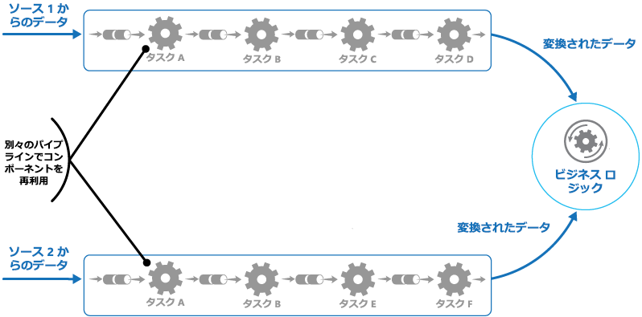
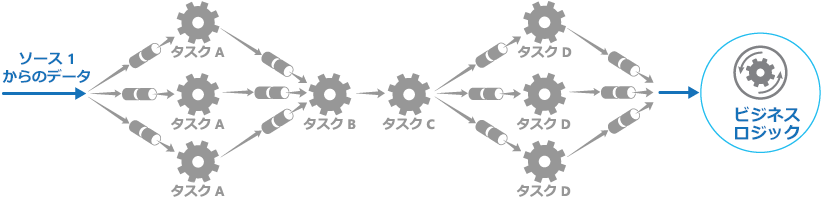

# <a name="pipes-and-filters-pattern"></a><span data-ttu-id="d6dba-104">パイプとフィルターのパターン</span><span class="sxs-lookup"><span data-stu-id="d6dba-104">Pipes and Filters pattern</span></span>

[!INCLUDE [header](../_includes/header.md)]

<span data-ttu-id="d6dba-105">複雑な処理を実行するタスクを、再利用できる一連の独立した要素に分解します。</span><span class="sxs-lookup"><span data-stu-id="d6dba-105">Decompose a task that performs complex processing into a series of separate elements that can be reused.</span></span> <span data-ttu-id="d6dba-106">この設計パターンを使用すると、処理を実行する複数のタスク要素を別々に展開およびスケール変更することにより、パフォーマンス、スケーラビリティ、および再利用性を向上させることができます。</span><span class="sxs-lookup"><span data-stu-id="d6dba-106">This can improve performance, scalability, and reusability by allowing task elements that perform the processing to be deployed and scaled independently.</span></span>

## <a name="context-and-problem"></a><span data-ttu-id="d6dba-107">コンテキストと問題</span><span class="sxs-lookup"><span data-stu-id="d6dba-107">Context and problem</span></span>

<span data-ttu-id="d6dba-108">アプリケーションは、その処理の対象となる情報に対し、複雑度の異なる多様なタスクを実行する必要があります。</span><span class="sxs-lookup"><span data-stu-id="d6dba-108">An application is required to perform a variety of tasks of varying complexity on the information that it processes.</span></span> <span data-ttu-id="d6dba-109">その処理をモノシリック モジュールとして実行するのが、柔軟性は低いものの実装方法としては簡単です。</span><span class="sxs-lookup"><span data-stu-id="d6dba-109">A straightforward but inflexible approach to implementing an application is to perform this processing as a monolithic module.</span></span> <span data-ttu-id="d6dba-110">しかしそのアプリケーション内のどこか他の箇所で同じ処理の一部分が必要になったとき、この方法では、コードのリファクタリングや最適化、再利用の可能性が制限されます。</span><span class="sxs-lookup"><span data-stu-id="d6dba-110">However, this approach is likely to reduce the opportunities for refactoring the code, optimizing it, or reusing it if parts of the same processing are required elsewhere within the application.</span></span>

<span data-ttu-id="d6dba-111">図は、モノリシック アプローチを使用してデータを処理する場合の問題を示しています。</span><span class="sxs-lookup"><span data-stu-id="d6dba-111">The figure illustrates the issues with processing data using the monolithic approach.</span></span> <span data-ttu-id="d6dba-112">アプリケーションは、2 つのソースからデータを受け取って処理します。</span><span class="sxs-lookup"><span data-stu-id="d6dba-112">An application receives and processes data from two sources.</span></span> <span data-ttu-id="d6dba-113">各ソースからのデータは、これらのデータを変換する一連のタスクを実行する個別のモジュールによって処理されてから、アプリケーションのビジネス ロジックに渡されます。</span><span class="sxs-lookup"><span data-stu-id="d6dba-113">The data from each source is processed by a separate module that performs a series of tasks to transform this data, before passing the result to the business logic of the application.</span></span>


<span data-ttu-id="d6dba-115">これらのモノリシック モジュールが実行するタスクの一部は機能的によく似ていますが、モジュールはそれぞれ独立した設計となっています。</span><span class="sxs-lookup"><span data-stu-id="d6dba-115">Some of the tasks that the monolithic modules perform are functionally very similar, but the modules have been designed separately.</span></span> <span data-ttu-id="d6dba-116">タスクを実装するコードはモジュール内で密接に結び付けられており、再利用性やスケーラビリティをほとんどあるいはまったく考慮しないで開発されています。</span><span class="sxs-lookup"><span data-stu-id="d6dba-116">The code that implements the tasks is closely coupled in a module, and has been developed with little or no thought given to reuse or scalability.</span></span>

<span data-ttu-id="d6dba-117">ただし、各モジュールによって実行される処理タスク、またはタスクごとのデプロイ要件は、ビジネス要件が更新されると変わる可能性があります。</span><span class="sxs-lookup"><span data-stu-id="d6dba-117">However, the processing tasks performed by each module, or the deployment requirements for each task, could change as business requirements are updated.</span></span> <span data-ttu-id="d6dba-118">タスクの中には、コンピューティング集中型のため高性能のハードウェアで実行することで利点が得られるタスクもあれば、そのような高価なリソースを必要としないタスクもあります。</span><span class="sxs-lookup"><span data-stu-id="d6dba-118">Some tasks might be compute intensive and could benefit from running on powerful hardware, while others might not require such expensive resources.</span></span> <span data-ttu-id="d6dba-119">また、将来的に追加の処理が必要になることもあれば、処理におけるタスクの実行順序が変更される可能性もあります。</span><span class="sxs-lookup"><span data-stu-id="d6dba-119">Also, additional processing might be required in the future, or the order in which the tasks performed by the processing could change.</span></span> <span data-ttu-id="d6dba-120">これらの問題に対処し、コード再利用の可能性を高める解決策が必要です。</span><span class="sxs-lookup"><span data-stu-id="d6dba-120">A solution is required that addresses these issues, and increases the possibilities for code reuse.</span></span>

## <a name="solution"></a><span data-ttu-id="d6dba-121">解決策</span><span class="sxs-lookup"><span data-stu-id="d6dba-121">Solution</span></span>

<span data-ttu-id="d6dba-122">各ストリームで必要な処理を、一連の独立したコンポーネント (またはフィルター) に分解し、各コンポーネントでそれぞれ 1 つのタスクを実行します。</span><span class="sxs-lookup"><span data-stu-id="d6dba-122">Break down the processing required for each stream into a set of separate components (or filters), each performing a single task.</span></span> <span data-ttu-id="d6dba-123">各コンポーネントが受信および送信するデータの形式を標準化することにより、このようなフィルターを 1 つのパイプラインにまとめることができます。</span><span class="sxs-lookup"><span data-stu-id="d6dba-123">By standardizing the format of the data that each component receives and sends, these filters can be combined together into a pipeline.</span></span> <span data-ttu-id="d6dba-124">この方法は、コードの重複を回避するのに役立ちます。また、処理の要件が変化した場合に、コンポーネントの削除や置換、追加のコンポーネントの統合を容易に行うことができます。</span><span class="sxs-lookup"><span data-stu-id="d6dba-124">This helps to avoid duplicating code, and makes it easy to remove, replace, or integrate additional components if the processing requirements change.</span></span> <span data-ttu-id="d6dba-125">次の図に、パイプとフィルターを使用して実装されたソリューションを示します。</span><span class="sxs-lookup"><span data-stu-id="d6dba-125">The next figure shows a solution implemented using pipes and filters.</span></span>



<span data-ttu-id="d6dba-127">1 つの要求を処理するのにかかる時間は、パイプライン内で最も低速なフィルターの速度によって決まります。</span><span class="sxs-lookup"><span data-stu-id="d6dba-127">The time it takes to process a single request depends on the speed of the slowest filter in the pipeline.</span></span> <span data-ttu-id="d6dba-128">特定のデータ ソースからのストリーム内に多数の要求が含まれている場合は特に、1 つまたは複数のフィルターがボトルネックになる可能性があります。</span><span class="sxs-lookup"><span data-stu-id="d6dba-128">One or more filters could be a bottleneck, especially if a large number of requests appear in a stream from a particular data source.</span></span> <span data-ttu-id="d6dba-129">パイプラインの構造の主な利点は、低速フィルターのインスタンスを並列に実行する機会が与えられていることです。これにより、システムの負荷を分散し、スループットを高めることができます。</span><span class="sxs-lookup"><span data-stu-id="d6dba-129">A key advantage of the pipeline structure is that it provides opportunities for running parallel instances of slow filters, enabling the system to spread the load and improve throughput.</span></span>

<span data-ttu-id="d6dba-130">パイプラインを構成するフィルターは別々のコンピューターで実行できます。このため、フィルターを個別にスケール変更したり、多くのクラウド環境で提供されている弾力性を活用したりできます。</span><span class="sxs-lookup"><span data-stu-id="d6dba-130">The filters that make up a pipeline can run on different machines, enabling them to be scaled independently and take advantage of the elasticity that many cloud environments provide.</span></span> <span data-ttu-id="d6dba-131">計算負荷の高いフィルターは高性能のハードウェアで実行し、その他の必要条件が低いフィルターは低価格の汎用的なハードウェアで実行することができます。</span><span class="sxs-lookup"><span data-stu-id="d6dba-131">A filter that is computationally intensive can run on high performance hardware, while other less demanding filters can be hosted on less expensive commodity hardware.</span></span> <span data-ttu-id="d6dba-132">フィルターは同じデータ センターまたは地理的な場所に配置される必要はないので、パイプライン内の各要素は、必要とするリソースに近い環境で実行することができます。</span><span class="sxs-lookup"><span data-stu-id="d6dba-132">The filters don't even have to be in the same data center or geographical location, which allows each element in a pipeline to run in an environment that is close to the resources it requires.</span></span>  <span data-ttu-id="d6dba-133">次の図に、ソース 1 からのデータに対するパイプラインの適用例を示します。</span><span class="sxs-lookup"><span data-stu-id="d6dba-133">The next figure shows an example applied to the pipeline for the data from Source 1.</span></span>



<span data-ttu-id="d6dba-135">フィルターの入出力をストリームとして構成した場合は、各フィルターの処理を並列に実行することができます。</span><span class="sxs-lookup"><span data-stu-id="d6dba-135">If the input and output of a filter are structured as a stream, it's possible to perform the processing for each filter in parallel.</span></span> <span data-ttu-id="d6dba-136">パイプライン内の最初のフィルターが作業を開始し、結果を出力すると、最初のフィルターの作業が完了する前に、シーケンス内の次のフィルターに結果が直接渡されます。</span><span class="sxs-lookup"><span data-stu-id="d6dba-136">The first filter in the pipeline can start its work and output its results, which are passed directly on to the next filter in the sequence before the first filter has completed its work.</span></span>

<span data-ttu-id="d6dba-137">もう 1 つの利点は、このモデルで実現される回復性です。</span><span class="sxs-lookup"><span data-stu-id="d6dba-137">Another benefit is the resiliency that this model can provide.</span></span> <span data-ttu-id="d6dba-138">フィルターで障害が発生したり、フィルターを実行していたコンピューターが使用できなくなったりした場合、パイプラインは、フィルターで実行されていた作業のスケジュールを設定し直して、その作業をコンポーネントの別のインスタンスに割り当てることができます。</span><span class="sxs-lookup"><span data-stu-id="d6dba-138">If a filter fails or the machine it's running on is no longer available, the pipeline can reschedule the work that the filter was performing and direct this work to another instance of the component.</span></span> <span data-ttu-id="d6dba-139">1 つのフィルターでエラーが発生した場合、必ずしもそれが原因でパイプライン全体がエラーになるとは限りません。</span><span class="sxs-lookup"><span data-stu-id="d6dba-139">Failure of a single filter doesn't necessarily result in failure of the entire pipeline.</span></span>

<span data-ttu-id="d6dba-140">分散トランザクションを実装するための別のアプローチとして、パイプとフィルターのパターンを [Compensating Transaction パターン](./compensating-transaction.md) と組み合わせて使用するという方法があります。</span><span class="sxs-lookup"><span data-stu-id="d6dba-140">Using the Pipes and Filters pattern in conjunction with the [Compensating Transaction pattern](./compensating-transaction.md) is an alternative approach to implementing distributed transactions.</span></span> <span data-ttu-id="d6dba-141">この場合、分散トランザクションを補正可能な個別のタスクに分けることができ、各タスクは Compensating Transaction パターンも実装するフィルターを使用して実装することができます。</span><span class="sxs-lookup"><span data-stu-id="d6dba-141">A distributed transaction can be broken down into separate, compensable tasks, each of which can be implemented by using a filter that also implements the Compensating Transaction pattern.</span></span> <span data-ttu-id="d6dba-142">パイプライン内のフィルターは、管理しているデータの近くで個別のホストされたタスクが実行されるように実装することができます。</span><span class="sxs-lookup"><span data-stu-id="d6dba-142">The filters in a pipeline can be implemented as separate hosted tasks running close to the data that they maintain.</span></span>

## <a name="issues-and-considerations"></a><span data-ttu-id="d6dba-143">問題と注意事項</span><span class="sxs-lookup"><span data-stu-id="d6dba-143">Issues and considerations</span></span>

<span data-ttu-id="d6dba-144">このパターンの実装方法を決めるときには、以下の点に注意してください。</span><span class="sxs-lookup"><span data-stu-id="d6dba-144">You should consider the following points when deciding how to implement this pattern:</span></span>

- <span data-ttu-id="d6dba-145">**複雑さ**。</span><span class="sxs-lookup"><span data-stu-id="d6dba-145">**Complexity**.</span></span> <span data-ttu-id="d6dba-146">パイプライン内のフィルターをさまざまなサーバー間で分散する場合は特に、このパターンによって柔軟性が向上する一方で、複雑性が増大します。</span><span class="sxs-lookup"><span data-stu-id="d6dba-146">The increased flexibility that this pattern provides can also introduce complexity, especially if the filters in a pipeline are distributed across different servers.</span></span>

- <span data-ttu-id="d6dba-147">**信頼性**。</span><span class="sxs-lookup"><span data-stu-id="d6dba-147">**Reliability**.</span></span> <span data-ttu-id="d6dba-148">パイプライン内のフィルター間を流れるデータが失われないことを保証したインフラストラクチャを使用します。</span><span class="sxs-lookup"><span data-stu-id="d6dba-148">Use an infrastructure that ensures that data flowing between filters in a pipeline won't be lost.</span></span>

- <span data-ttu-id="d6dba-149">**べき等性**。</span><span class="sxs-lookup"><span data-stu-id="d6dba-149">**Idempotency**.</span></span> <span data-ttu-id="d6dba-150">メッセージを受信した後にパイプライン内のフィルターが失敗し、作業のスケジュールがフィルターの別のインスタンスで実行されるように変更された場合、作業の一部が既に完了している場合があります。</span><span class="sxs-lookup"><span data-stu-id="d6dba-150">If a filter in a pipeline fails after receiving a message and the work is rescheduled to another instance of the filter, part of the work might have already been completed.</span></span> <span data-ttu-id="d6dba-151">このような作業によって、グローバル状態の一部 (データベースに格納されている情報など) が更新されている場合、同一の更新が繰り返される可能性があります。</span><span class="sxs-lookup"><span data-stu-id="d6dba-151">If this work updates some aspect of the global state (such as information stored in a database), the same update could be repeated.</span></span> <span data-ttu-id="d6dba-152">フィルターにおいて、パイプライン内の次のフィルターに結果を送信してから自身の作業が正常に完了したことを表明するまでの間に、障害が発生した場合にも、同様の問題が発生することがあります。</span><span class="sxs-lookup"><span data-stu-id="d6dba-152">A similar issue might occur if a filter fails after posting its results to the next filter in the pipeline, but before indicating that it's completed its work successfully.</span></span> <span data-ttu-id="d6dba-153">このような場合は、フィルターの別のインスタンスでも同じ作業が繰り返され、同じ作業を 2 回ポストすることになる可能性があります。</span><span class="sxs-lookup"><span data-stu-id="d6dba-153">In these cases, the same work could be repeated by another instance of the filter, causing the same results to be posted twice.</span></span> <span data-ttu-id="d6dba-154">この結果、パイプライン内の後続のフィルターでも同じデータが繰り返し処理される可能性があります。</span><span class="sxs-lookup"><span data-stu-id="d6dba-154">This could result in subsequent filters in the pipeline processing the same data twice.</span></span> <span data-ttu-id="d6dba-155">したがって、パイプライン内のフィルターは、べき等になるように設計する必要があります。</span><span class="sxs-lookup"><span data-stu-id="d6dba-155">Therefore filters in a pipeline should be designed to be idempotent.</span></span> <span data-ttu-id="d6dba-156">詳細については、Jonathan Oliver のブログ「[Idempotency パターン](https://blog.jonathanoliver.com/idempotency-patterns/)」を参照してください。</span><span class="sxs-lookup"><span data-stu-id="d6dba-156">For more information see [Idempotency Patterns](https://blog.jonathanoliver.com/idempotency-patterns/) on Jonathan Oliver’s blog.</span></span>

- <span data-ttu-id="d6dba-157">**メッセージの繰り返し**。</span><span class="sxs-lookup"><span data-stu-id="d6dba-157">**Repeated messages**.</span></span> <span data-ttu-id="d6dba-158">パイプライン内のフィルターが、パイプラインの次のステージにメッセージをポストした後でエラーになった場合は、フィルターの別のインスタンスが実行される可能性があります。そのようにして実行されたインスタンスはパイプラインに同じメッセージのコピーをポストします。</span><span class="sxs-lookup"><span data-stu-id="d6dba-158">If a filter in a pipeline fails after posting a message to the next stage of the pipeline, another instance of the filter might be run, and it'll post a copy of the same message to the pipeline.</span></span> <span data-ttu-id="d6dba-159">これにより、同一メッセージの 2 つのインスタンスが次のフィルターに渡される可能性があります。</span><span class="sxs-lookup"><span data-stu-id="d6dba-159">This could cause two instances of the same message to be passed to the next filter.</span></span> <span data-ttu-id="d6dba-160">この問題を回避するには、パイプラインが重複するメッセージを検出し削除する必要があります。</span><span class="sxs-lookup"><span data-stu-id="d6dba-160">To avoid this, the pipeline should detect and eliminate duplicate messages.</span></span>

    >  <span data-ttu-id="d6dba-161">メッセージ キュー (Microsoft Azure Service Bus キューなど) を使用してパイプラインを実装した場合、メッセージ キュー インフラストラクチャでは重複するメッセージの自動検出および削除を実現することができます。</span><span class="sxs-lookup"><span data-stu-id="d6dba-161">If you're implementing the pipeline by using message queues (such as Microsoft Azure Service Bus queues), the message queuing infrastructure might provide automatic duplicate message detection and removal.</span></span>

- <span data-ttu-id="d6dba-162">**コンテキストと状態**。</span><span class="sxs-lookup"><span data-stu-id="d6dba-162">**Context and state**.</span></span> <span data-ttu-id="d6dba-163">パイプライン内の各フィルターは、基本的に分離して実行され、自身がどのように呼び出されたかについて推測する必要はありません。</span><span class="sxs-lookup"><span data-stu-id="d6dba-163">In a pipeline, each filter essentially runs in isolation and shouldn't make any assumptions about how it was invoked.</span></span> <span data-ttu-id="d6dba-164">すなわち、各フィルターには作業を実行するためのコンテキストが十分に提供されるということです。</span><span class="sxs-lookup"><span data-stu-id="d6dba-164">This means that each filter should be provided with sufficient context to perform its work.</span></span> <span data-ttu-id="d6dba-165">このコンテキストには、大量の状態情報を含めることが可能です。</span><span class="sxs-lookup"><span data-stu-id="d6dba-165">This context could include a large amount of state information.</span></span>

## <a name="when-to-use-this-pattern"></a><span data-ttu-id="d6dba-166">このパターンを使用する状況</span><span class="sxs-lookup"><span data-stu-id="d6dba-166">When to use this pattern</span></span>

<span data-ttu-id="d6dba-167">このパターンは次の状況で使用します。</span><span class="sxs-lookup"><span data-stu-id="d6dba-167">Use this pattern when:</span></span>

- <span data-ttu-id="d6dba-168">アプリケーションで必要な処理を一連の独立した手順に容易に分割することができる。</span><span class="sxs-lookup"><span data-stu-id="d6dba-168">The processing required by an application can easily be broken down into a set of independent steps.</span></span>

- <span data-ttu-id="d6dba-169">アプリケーションによって実行される処理手順に、さまざまなスケーラビリティ要件がある。</span><span class="sxs-lookup"><span data-stu-id="d6dba-169">The processing steps performed by an application have different scalability requirements.</span></span>

    >  <span data-ttu-id="d6dba-170">スケールの変更が必要なフィルターを同じプロセスにグループ化することができます。</span><span class="sxs-lookup"><span data-stu-id="d6dba-170">It's possible to group filters that should scale together in the same process.</span></span> <span data-ttu-id="d6dba-171">詳細については、「[Compute Resource Consolidation pattern](./compute-resource-consolidation.md)」 (Compute Resource Consolidation パターン) を参照してください。</span><span class="sxs-lookup"><span data-stu-id="d6dba-171">For more information, see the [Compute Resource Consolidation pattern](./compute-resource-consolidation.md).</span></span>

- <span data-ttu-id="d6dba-172">アプリケーションによって実行される処理手順の並び替えを可能にする柔軟性、または手順を追加および削除する機能が必要である。</span><span class="sxs-lookup"><span data-stu-id="d6dba-172">Flexibility is required to allow reordering of the processing steps performed by an application, or the capability to add and remove steps.</span></span>

- <span data-ttu-id="d6dba-173">手順の処理をさまざまなサーバーに分散することでシステムに利点がある。</span><span class="sxs-lookup"><span data-stu-id="d6dba-173">The system can benefit from distributing the processing for steps across different servers.</span></span>

- <span data-ttu-id="d6dba-174">データの処理中に手順において発生したエラーの影響を最小限に抑えることができる信頼性の高いソリューションが必要である。</span><span class="sxs-lookup"><span data-stu-id="d6dba-174">A reliable solution is required that minimizes the effects of failure in a step while data is being processed.</span></span>

<span data-ttu-id="d6dba-175">このパターンが適さない状況</span><span class="sxs-lookup"><span data-stu-id="d6dba-175">This pattern might not be useful when:</span></span>

- <span data-ttu-id="d6dba-176">アプリケーションによって実行される処理手順が独立していない。すなわち、それらの手順を同じトランザクションの一部としてまとめて実行する必要がある。</span><span class="sxs-lookup"><span data-stu-id="d6dba-176">The processing steps performed by an application aren't independent, or they have to be performed together as part of the same transaction.</span></span>

- <span data-ttu-id="d6dba-177">手順で必要とされるコンテキストまたは状態情報の量が、このアプローチを使用するには不十分である。</span><span class="sxs-lookup"><span data-stu-id="d6dba-177">The amount of context or state information required by a step makes this approach inefficient.</span></span> <span data-ttu-id="d6dba-178">状態情報をデータベースに保存しておくことができる場合があります。しかし、データベース上での負荷の増加が過剰な競合を引き起こす場合、この手法は使用しないでください。</span><span class="sxs-lookup"><span data-stu-id="d6dba-178">It might be possible to persist state information to a database instead, but don't use this strategy if the additional load on the database causes excessive contention.</span></span>

## <a name="example"></a><span data-ttu-id="d6dba-179">例</span><span class="sxs-lookup"><span data-stu-id="d6dba-179">Example</span></span>

<span data-ttu-id="d6dba-180">メッセージ キューのシーケンスを使用して、パイプラインの実装に必要なインフラストラクチャを実現することができます。</span><span class="sxs-lookup"><span data-stu-id="d6dba-180">You can use a sequence of message queues to provide the infrastructure required to implement a pipeline.</span></span> <span data-ttu-id="d6dba-181">最初のメッセージ キューは、未処理のメッセージを受信します。</span><span class="sxs-lookup"><span data-stu-id="d6dba-181">An initial message queue receives unprocessed messages.</span></span> <span data-ttu-id="d6dba-182">フィルター タスクとして実装されたコンポーネントは、このキューでメッセージをリッスンし、作業を実行し、変換したメッセージをシーケンス内の次のキューにポストします。</span><span class="sxs-lookup"><span data-stu-id="d6dba-182">A component implemented as a filter task listens for a message on this queue, performs its work, and then posts the transformed message to the next queue in the sequence.</span></span> <span data-ttu-id="d6dba-183">別のフィルター タスクも、このキューでメッセージをリッスンし、そのメッセージを処理し、結果を別のキューにポストするという具合に進められ、キュー内の最後のメッセージに完全に変換されたデータが現れるまで継続されます。</span><span class="sxs-lookup"><span data-stu-id="d6dba-183">Another filter task can listen for messages on this queue, process them, post the results to another queue, and so on until the fully transformed data appears in the final message in the queue.</span></span> <span data-ttu-id="d6dba-184">次の図に、メッセージ キューを使用したパイプラインの実装を示します。</span><span class="sxs-lookup"><span data-stu-id="d6dba-184">The next figure illustrates implementing a pipeline using message queues.</span></span>


<span data-ttu-id="d6dba-186">Azure 上でソリューションを構築する場合は、Service Bus キューを使用して信頼性が高くスケーラブルなキュー メカニズムを実現できます。</span><span class="sxs-lookup"><span data-stu-id="d6dba-186">If you're building a solution on Azure you can use Service Bus queues to provide a reliable and scalable queuing mechanism.</span></span> <span data-ttu-id="d6dba-187">次の C# で作成された `ServiceBusPipeFilter` クラスは、キューからの入力メッセージを受信し、これらのメッセージを処理し、結果を別のキューにポストするフィルターを実装する方法を示しています。</span><span class="sxs-lookup"><span data-stu-id="d6dba-187">The `ServiceBusPipeFilter` class shown below in C# demonstrates how you can implement a filter that receives input messages from a queue, processes these messages, and posts the results to another queue.</span></span>

> <span data-ttu-id="d6dba-188">`ServiceBusPipeFilter` クラスは、[GitHub](https://github.com/mspnp/cloud-design-patterns/tree/master/pipes-and-filters) から入手可能な PipesAndFilters.Shared プロジェクト内に定義されています。</span><span class="sxs-lookup"><span data-stu-id="d6dba-188">The `ServiceBusPipeFilter` class is defined in the PipesAndFilters.Shared project available from [GitHub](https://github.com/mspnp/cloud-design-patterns/tree/master/pipes-and-filters).</span></span>

```csharp
public class ServiceBusPipeFilter
{
  ...
  private readonly string inQueuePath;
  private readonly string outQueuePath;
  ...
  private QueueClient inQueue;
  private QueueClient outQueue;
  ...

  public ServiceBusPipeFilter(..., string inQueuePath, string outQueuePath = null)
  {
     ...
     this.inQueuePath = inQueuePath;
     this.outQueuePath = outQueuePath;
  }

  public void Start()
  {
    ...
    // Create the outbound filter queue if it doesn't exist.
    ...
    this.outQueue = QueueClient.CreateFromConnectionString(...);

    ...
    // Create the inbound and outbound queue clients.
    this.inQueue = QueueClient.CreateFromConnectionString(...);
  }

  public void OnPipeFilterMessageAsync(
    Func<BrokeredMessage, Task<BrokeredMessage>> asyncFilterTask, ...)
  {
    ...

    this.inQueue.OnMessageAsync(
      async (msg) =>
    {
      ...
      // Process the filter and send the output to the
      // next queue in the pipeline.
      var outMessage = await asyncFilterTask(msg);

      // Send the message from the filter processor
      // to the next queue in the pipeline.
      if (outQueue != null)
      {
        await outQueue.SendAsync(outMessage);
      }

      // Note: There's a chance that the same message could be sent twice
      // or that a message gets processed by an upstream or downstream
      // filter at the same time.
      // This would happen in a situation where processing of a message was
      // completed, it was sent to the next pipe/queue, and then failed
      // to complete when using the PeekLock method.
      // Idempotent message processing and concurrency should be considered
      // in a real-world implementation.
    },
    options);
  }

  public async Task Close(TimeSpan timespan)
  {
    // Pause the processing threads.
    this.pauseProcessingEvent.Reset();

    // There's no clean approach for waiting for the threads to complete
    // the processing. This example simply stops any new processing, waits
    // for the existing thread to complete, then closes the message pump
    // and finally returns.
    Thread.Sleep(timespan);

    this.inQueue.Close();
    ...
  }

  ...
}
```

<span data-ttu-id="d6dba-189">`ServiceBusPipeFilter` クラス内の `Start` メソッドは、入力キューと出力キューのペアに接続し、`Close` メソッドは入力キューとの接続を解除します。</span><span class="sxs-lookup"><span data-stu-id="d6dba-189">The `Start` method in the `ServiceBusPipeFilter` class connects to a pair of input and output queues, and the `Close` method disconnects from the input queue.</span></span> <span data-ttu-id="d6dba-190">`OnPipeFilterMessageAsync` メソッドは、メッセージの実際の処理を実行します。実行する処理は、このメソッドの `asyncFilterTask` パラメーターで指定されます。</span><span class="sxs-lookup"><span data-stu-id="d6dba-190">The `OnPipeFilterMessageAsync` method performs the actual processing of messages, the `asyncFilterTask` parameter to this method specifies the processing to be performed.</span></span> <span data-ttu-id="d6dba-191">`OnPipeFilterMessageAsync` メソッドは、入力キューで着信メッセージを待機し、メッセージが着信すると `asyncFilterTask` パラメーターで指定されたコードを各メッセージに対して実行し、結果を出力キューにポストします。</span><span class="sxs-lookup"><span data-stu-id="d6dba-191">The `OnPipeFilterMessageAsync` method waits for incoming messages on the input queue, runs the code specified by the `asyncFilterTask` parameter over each message as it arrives, and posts the results to the output queue.</span></span> <span data-ttu-id="d6dba-192">キュー自体はコンストラクターで指定されます。</span><span class="sxs-lookup"><span data-stu-id="d6dba-192">The queues themselves are specified by the constructor.</span></span>

<span data-ttu-id="d6dba-193">サンプル ソリューションでは、一連のworker ロールでフィルターを実装しています。</span><span class="sxs-lookup"><span data-stu-id="d6dba-193">The sample solution implements filters in a set of worker roles.</span></span> <span data-ttu-id="d6dba-194">各 worker ロールは、実行するビジネス プロセスの複雑さや処理に必要なリソースに応じて、個別にスケールを変更することができます。</span><span class="sxs-lookup"><span data-stu-id="d6dba-194">Each worker role can be scaled independently, depending on the complexity of the business processing that it performs or the resources required for processing.</span></span> <span data-ttu-id="d6dba-195">さらに、各 worker ロールの複数のインスタンスを並列に実行して、スループットを向上させることができます。</span><span class="sxs-lookup"><span data-stu-id="d6dba-195">Additionally, multiple instances of each worker role can be run in parallel to improve throughput.</span></span>

<span data-ttu-id="d6dba-196">次のコードは、サンプル ソリューションの PipeFilterA プロジェクトに `PipeFilterARoleEntry` という名前で定義された Azure worker ロールを示しています。</span><span class="sxs-lookup"><span data-stu-id="d6dba-196">The following code shows an Azure worker role named `PipeFilterARoleEntry`, defined in the PipeFilterA project in the sample solution.</span></span>

```csharp
public class PipeFilterARoleEntry : RoleEntryPoint
{
  ...
  private ServiceBusPipeFilter pipeFilterA;

  public override bool OnStart()
  {
    ...
    this.pipeFilterA = new ServiceBusPipeFilter(
      ...,
      Constants.QueueAPath,
      Constants.QueueBPath);

    this.pipeFilterA.Start();
    ...
  }

  public override void Run()
  {
    this.pipeFilterA.OnPipeFilterMessageAsync(async (msg) =>
    {
      // Clone the message and update it.
      // Properties set by the broker (Deliver count, enqueue time, ...)
      // aren't cloned and must be copied over if required.
      var newMsg = msg.Clone();

      await Task.Delay(500); // DOING WORK

      Trace.TraceInformation("Filter A processed message:{0} at {1}",
        msg.MessageId, DateTime.UtcNow);

      newMsg.Properties.Add(Constants.FilterAMessageKey, "Complete");

      return newMsg;
    });

    ...
  }

  ...
}
```

<span data-ttu-id="d6dba-197">このロールには、`ServiceBusPipeFilter` オブジェクトが含まれています。</span><span class="sxs-lookup"><span data-stu-id="d6dba-197">This role contains a `ServiceBusPipeFilter` object.</span></span> <span data-ttu-id="d6dba-198">ロール内の `OnStart` メソッドは、入力メッセージを受信し、出力メッセージを送信するためのキューに接続します (キューの名前は `Constants` クラスに定義されています)。</span><span class="sxs-lookup"><span data-stu-id="d6dba-198">The `OnStart` method in the role connects to the queues for receiving input messages and posting output messages (the names of the queues are defined in the `Constants` class).</span></span> <span data-ttu-id="d6dba-199">`Run` メソッドは、`OnPipeFilterMessagesAsync` メソッドを呼び出して、受信された各メッセージに対して何らかの処理を実行します (この例では、短い時間待ってから処理がシミュレーションされます)。</span><span class="sxs-lookup"><span data-stu-id="d6dba-199">The `Run` method invokes the `OnPipeFilterMessagesAsync` method to perform some processing on each message that's received (in this example, the processing is simulated by waiting for a short period of time).</span></span> <span data-ttu-id="d6dba-200">処理が完了すると、結果を含む新しいメッセージが作成され (この場合は、入力メッセージにカスタム プロパティが追加される)、そのメッセージが出力キューにポストされます。</span><span class="sxs-lookup"><span data-stu-id="d6dba-200">When processing is complete, a new message is constructed containing the results (in this case, the input message has a custom property added), and this message is posted to the output queue.</span></span>

<span data-ttu-id="d6dba-201">サンプル コードでは、PipeFilterB プロジェクト内に `PipeFilterBRoleEntry` という名前の別の worker ロールが含まれています。</span><span class="sxs-lookup"><span data-stu-id="d6dba-201">The sample code contains another worker role named `PipeFilterBRoleEntry` in the PipeFilterB project.</span></span> <span data-ttu-id="d6dba-202">このロールは、`Run` メソッドでさまざまな処理を実行する点を除いて、`PipeFilterARoleEntry` メソッドによく似ています。</span><span class="sxs-lookup"><span data-stu-id="d6dba-202">This role is similar to `PipeFilterARoleEntry` except that it performs different processing in the `Run` method.</span></span> <span data-ttu-id="d6dba-203">ソリューションの例では、この 2 つのロールを組み合わせてパイプラインを作成します。`PipeFilterARoleEntry` ロールの出力キューは、`PipeFilterBRoleEntry` ロールの入力キューです。</span><span class="sxs-lookup"><span data-stu-id="d6dba-203">In the example solution, these two roles are combined to construct a pipeline, the output queue for the `PipeFilterARoleEntry` role is the input queue for the `PipeFilterBRoleEntry` role.</span></span>

<span data-ttu-id="d6dba-204">サンプル ソリューションでは、`InitialSenderRoleEntry` という名前のロール (InitialSender プロジェクト) と `FinalReceiverRoleEntry` という名前のロール (FinalReceiver プロジェクト) も追加しています。</span><span class="sxs-lookup"><span data-stu-id="d6dba-204">The sample solution also provides two additional roles named `InitialSenderRoleEntry` (in the InitialSender project) and `FinalReceiverRoleEntry` (in the FinalReceiver project).</span></span> <span data-ttu-id="d6dba-205">`InitialSenderRoleEntry` ロールは、パイプライン内に最初のメッセージを提供します。</span><span class="sxs-lookup"><span data-stu-id="d6dba-205">The `InitialSenderRoleEntry` role provides the initial message in the pipeline.</span></span> <span data-ttu-id="d6dba-206">`OnStart` メソッドは 1 つのキューに接続し、`Run` メソッドはこのキューにメソッドをポストします。</span><span class="sxs-lookup"><span data-stu-id="d6dba-206">The `OnStart` method connects to a single queue and the `Run` method posts a method to this queue.</span></span> <span data-ttu-id="d6dba-207">このキューは `PipeFilterARoleEntry` ロールで使用される入力キューです。メッセージをそのキューにポストすると、`PipeFilterARoleEntry` ロールがそのメッセージを受信して処理します。</span><span class="sxs-lookup"><span data-stu-id="d6dba-207">This queue is the input queue used by the `PipeFilterARoleEntry` role, so posting a message to it causes the message to be received and processed by the `PipeFilterARoleEntry` role.</span></span> <span data-ttu-id="d6dba-208">処理されたメッセージは、`PipeFilterBRoleEntry` ロールを通して渡されます。</span><span class="sxs-lookup"><span data-stu-id="d6dba-208">The processed message then passes through the `PipeFilterBRoleEntry` role.</span></span>

<span data-ttu-id="d6dba-209">`FinalReceiveRoleEntry` ロールの入力キューは、`PipeFilterBRoleEntry` ロールの出力キューです。</span><span class="sxs-lookup"><span data-stu-id="d6dba-209">The input queue for the `FinalReceiveRoleEntry` role is the output queue for the `PipeFilterBRoleEntry` role.</span></span> <span data-ttu-id="d6dba-210">以下に示す `FinalReceiveRoleEntry`ロール内の `Run` メソッドは、メッセージを受信し、何らかの最終処理を実行します。</span><span class="sxs-lookup"><span data-stu-id="d6dba-210">The `Run` method in the `FinalReceiveRoleEntry` role, shown below, receives the message and performs some final processing.</span></span> <span data-ttu-id="d6dba-211">パイプライン内のフィルターによって追加されたカスタム プロパティの値がトレース出力に書き込まれます。</span><span class="sxs-lookup"><span data-stu-id="d6dba-211">Then it writes the values of the custom properties added by the filters in the pipeline to the trace output.</span></span>

```csharp
public class FinalReceiverRoleEntry : RoleEntryPoint
{
  ...
  // Final queue/pipe in the pipeline to process data from.
  private ServiceBusPipeFilter queueFinal;

  public override bool OnStart()
  {
    ...
    // Set up the queue.
    this.queueFinal = new ServiceBusPipeFilter(...,Constants.QueueFinalPath);
    this.queueFinal.Start();
    ...
  }

  public override void Run()
  {
    this.queueFinal.OnPipeFilterMessageAsync(
      async (msg) =>
      {
        await Task.Delay(500); // DOING WORK

        // The pipeline message was received.
        Trace.TraceInformation(
          "Pipeline Message Complete - FilterA:{0} FilterB:{1}",
          msg.Properties[Constants.FilterAMessageKey],
          msg.Properties[Constants.FilterBMessageKey]);

        return null;
      });
    ...
  }

  ...
}
```

## <a name="related-patterns-and-guidance"></a><span data-ttu-id="d6dba-212">関連のあるパターンとガイダンス</span><span class="sxs-lookup"><span data-stu-id="d6dba-212">Related patterns and guidance</span></span>

<span data-ttu-id="d6dba-213">このパターンを実装する場合は、次のパターンとガイダンスも関連している可能性があります。</span><span class="sxs-lookup"><span data-stu-id="d6dba-213">The following patterns and guidance might also be relevant when implementing this pattern:</span></span>

- <span data-ttu-id="d6dba-214">このパターンを示すサンプルは [GitHub](https://github.com/mspnp/cloud-design-patterns/tree/master/pipes-and-filters) から入手できます。</span><span class="sxs-lookup"><span data-stu-id="d6dba-214">A sample that demonstrates this pattern is available on [GitHub](https://github.com/mspnp/cloud-design-patterns/tree/master/pipes-and-filters).</span></span>
- <span data-ttu-id="d6dba-215">[競合コンシューマー パターン](./competing-consumers.md)。</span><span class="sxs-lookup"><span data-stu-id="d6dba-215">[Competing Consumers pattern](./competing-consumers.md).</span></span> <span data-ttu-id="d6dba-216">パイプラインには、1 つまたは複数のフィルターの複数のインスタンスを含めることができます。</span><span class="sxs-lookup"><span data-stu-id="d6dba-216">A pipeline can contain multiple instances of one or more filters.</span></span> <span data-ttu-id="d6dba-217">このアプローチは、低速フィルターのインスタンスを並列実行することで、システムの負荷を分散しスループットを向上させる場合に便利です。</span><span class="sxs-lookup"><span data-stu-id="d6dba-217">This approach is useful for running parallel instances of slow filters, enabling the system to spread the load and improve throughput.</span></span> <span data-ttu-id="d6dba-218">フィルターの各インスタンスは、入力に対して互いに競合するので、フィルターの 2 つのインスタンスで同じデータを処理すべきではありません。</span><span class="sxs-lookup"><span data-stu-id="d6dba-218">Each instance of a filter will compete for input with the other instances, two instances of a filter shouldn't be able to process the same data.</span></span> <span data-ttu-id="d6dba-219">このアプローチの説明を入力します。</span><span class="sxs-lookup"><span data-stu-id="d6dba-219">Provides an explanation of this approach.</span></span>
- <span data-ttu-id="d6dba-220">[Compute Resource Consolidation パターン](./compute-resource-consolidation.md)。</span><span class="sxs-lookup"><span data-stu-id="d6dba-220">[Compute Resource Consolidation pattern](./compute-resource-consolidation.md).</span></span> <span data-ttu-id="d6dba-221">スケールの変更が必要なフィルターを同じプロセスにグループ化することができる場合があります。</span><span class="sxs-lookup"><span data-stu-id="d6dba-221">It might be possible to group filters that should scale together into the same process.</span></span> <span data-ttu-id="d6dba-222">この方法の利点とトレードオフの詳細について説明します。</span><span class="sxs-lookup"><span data-stu-id="d6dba-222">Provides more information about the benefits and tradeoffs of this strategy.</span></span>
- <span data-ttu-id="d6dba-223">[Compensating Transaction パターン](./compensating-transaction.md)。</span><span class="sxs-lookup"><span data-stu-id="d6dba-223">[Compensating Transaction pattern](./compensating-transaction.md).</span></span> <span data-ttu-id="d6dba-224">フィルターは、取り消し可能な操作として、または、障害発生時に前の状態に復元するための補正操作を備えた操作として実装できます。</span><span class="sxs-lookup"><span data-stu-id="d6dba-224">A filter can be implemented as an operation that can be reversed, or that has a compensating operation that restores the state to a previous version in the event of a failure.</span></span> <span data-ttu-id="d6dba-225">最終的な一貫性を維持または実現するためには、この方法をどのように実装すればよいかを説明します。</span><span class="sxs-lookup"><span data-stu-id="d6dba-225">Explains how this can be implemented to maintain or achieve eventual consistency.</span></span>
- <span data-ttu-id="d6dba-226">Jonathan Oliver のブログの [Idempotency パターン](https://blog.jonathanoliver.com/idempotency-patterns/)。</span><span class="sxs-lookup"><span data-stu-id="d6dba-226">[Idempotency Patterns](https://blog.jonathanoliver.com/idempotency-patterns/) on Jonathan Oliver’s blog.</span></span>
