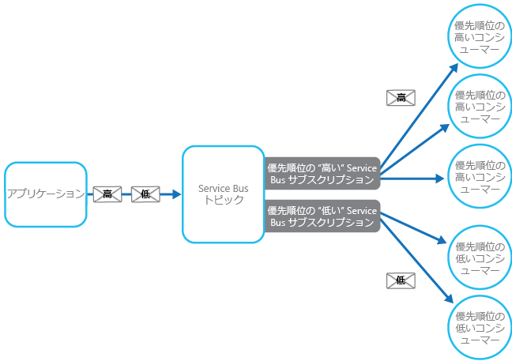

# <a name="priority-queue-pattern"></a><span data-ttu-id="681b2-104">Priority Queue パターン</span><span class="sxs-lookup"><span data-stu-id="681b2-104">Priority Queue pattern</span></span>

[!INCLUDE [header](../_includes/header.md)]

<span data-ttu-id="681b2-105">サービスに送信される要求に優先順位を設定し、優先順位の高い要求から順番に受信および処理されるようにします。</span><span class="sxs-lookup"><span data-stu-id="681b2-105">Prioritize requests sent to services so that requests with a higher priority are received and processed more quickly than those with a lower priority.</span></span> <span data-ttu-id="681b2-106">このパターンは、個々のクライアントにそれぞれ異なるサービス レベルを保証するアプリケーションにおいて有用です。</span><span class="sxs-lookup"><span data-stu-id="681b2-106">This pattern is useful in applications that offer different service level guarantees to individual clients.</span></span>

## <a name="context-and-problem"></a><span data-ttu-id="681b2-107">コンテキストと問題</span><span class="sxs-lookup"><span data-stu-id="681b2-107">Context and Problem</span></span>

<span data-ttu-id="681b2-108">アプリケーションは、特定のタスクを他のサービスに委任して、バック グラウンド処理の実行や他のアプリケーションまたはサービスとの統合などを行うことができます。</span><span class="sxs-lookup"><span data-stu-id="681b2-108">Applications can delegate specific tasks to other services, for example, to perform background processing or to integrate with other applications or services.</span></span> <span data-ttu-id="681b2-109">クラウドでは通常、タスクをバック グラウンド処理に委任するためにメッセージ キューを使用しています。</span><span class="sxs-lookup"><span data-stu-id="681b2-109">In the cloud, a message queue is typically used to delegate tasks to background processing.</span></span> <span data-ttu-id="681b2-110">多くの場合に、サービスが要求を受信する順番は重要ではありません。</span><span class="sxs-lookup"><span data-stu-id="681b2-110">In many cases the order requests are received in by a service isn't important.</span></span> <span data-ttu-id="681b2-111">しかし、場合によっては、特定の要求を優先する必要があります。</span><span class="sxs-lookup"><span data-stu-id="681b2-111">In some cases, though, it's necessary to prioritize specific requests.</span></span> <span data-ttu-id="681b2-112">そのような要求は、アプリケーションによって先に送信された優先順位の低い要求よりも早く処理する必要があります。</span><span class="sxs-lookup"><span data-stu-id="681b2-112">These requests should be processed earlier than lower priority requests that were sent previously by the application.</span></span>

## <a name="solution"></a><span data-ttu-id="681b2-113">解決策</span><span class="sxs-lookup"><span data-stu-id="681b2-113">Solution</span></span>

<span data-ttu-id="681b2-114">キューは一般に先入れ先出し (FIFO) 構造になっているため、コンシューマーは通常、キューにポストされた順にメッセージを受信することになります。</span><span class="sxs-lookup"><span data-stu-id="681b2-114">A queue is usually a first-in, first-out (FIFO) structure, and consumers typically receive messages in the same order that they were posted to the queue.</span></span> <span data-ttu-id="681b2-115">ただし、一部のメッセージ キューでは、優先順位メッセージングをサポートします。</span><span class="sxs-lookup"><span data-stu-id="681b2-115">However, some message queues support priority messaging.</span></span> <span data-ttu-id="681b2-116">メッセージをポストするアプリケーションは、優先順位を割り当てることができます。これにより、キュー内のメッセージは自動的に並べ替えられ、優先順位の高い順に受信されるようになります。</span><span class="sxs-lookup"><span data-stu-id="681b2-116">The application posting a message can assign a priority and the messages in the queue are automatically reordered so that those with a higher priority will be received before those with a lower priority.</span></span> <span data-ttu-id="681b2-117">図に優先順位メッセージングを使用したキューを示します。</span><span class="sxs-lookup"><span data-stu-id="681b2-117">The figure illustrates a queue with priority messaging.</span></span>


> <span data-ttu-id="681b2-119">ほとんどのメッセージ キューの実装では複数のコンシューマーをサポートし ([競合コンシューマー パターン](./competing-consumers.md) に従って)、要求に応じてコンシューマー プロセスの数をスケールアップまたはスケールダウンします。</span><span class="sxs-lookup"><span data-stu-id="681b2-119">Most message queue implementations support multiple consumers (following the [Competing Consumers pattern](./competing-consumers.md)), and the number of consumer processes can be scaled up or down depending on demand.</span></span>

<span data-ttu-id="681b2-120">優先順位に基づくメッセージ キューをサポートしないシステムでは、代替ソリューションとして、優先順位ごとに個別のキューを維持します。</span><span class="sxs-lookup"><span data-stu-id="681b2-120">In systems that don't support priority-based message queues, an alternative solution is to maintain a separate queue for each priority.</span></span> <span data-ttu-id="681b2-121">メッセージを適切なキューに送信するのはアプリケーションの役割です。</span><span class="sxs-lookup"><span data-stu-id="681b2-121">The application is responsible for posting messages to the appropriate queue.</span></span> <span data-ttu-id="681b2-122">各キューはそれぞれ異なるコンシューマー プールを備えることができます。</span><span class="sxs-lookup"><span data-stu-id="681b2-122">Each queue can have a separate pool of consumers.</span></span> <span data-ttu-id="681b2-123">優先順位の高いキューほどコンシューマー プールのサイズは大きく、より高速のハードウェアで実行されます。</span><span class="sxs-lookup"><span data-stu-id="681b2-123">Higher priority queues can have a larger pool of consumers running on faster hardware than lower priority queues.</span></span> <span data-ttu-id="681b2-124">次の図に、優先順位ごとに別々のメッセージ キューを使用する方法を示します。</span><span class="sxs-lookup"><span data-stu-id="681b2-124">The next figure illustrates using separate message queues for each priority.</span></span>


<span data-ttu-id="681b2-126">この方法の変形型として、コンシューマー プールを 1 つだけ備え、まず優先順位の高いキューにメッセージがないか確認し、その後で優先順位の低いキューからメッセージの取得を開始するという方法があります。</span><span class="sxs-lookup"><span data-stu-id="681b2-126">A variation on this strategy is to have a single pool of consumers that check for messages on high priority queues first, and only then start to fetch messages from lower priority queues.</span></span> <span data-ttu-id="681b2-127">単一のコンシューマー プールを使用して処理するソリューション (さまざまな優先順位のメッセージをサポートする単一キューを使用する場合、または複数のキューを使用しそれぞれが単一の優先順位を持つメッセージを処理する場合) と、複数のキューを使用しキューごとに別々のプールを備えるソリューションとの間にはセマンティックの差異があります。</span><span class="sxs-lookup"><span data-stu-id="681b2-127">There are some semantic differences between a solution that uses a single pool of consumer processes (either with a single queue that supports messages with different priorities or with multiple queues that each handle messages of a single priority), and a solution that uses multiple queues with a separate pool for each queue.</span></span>

<span data-ttu-id="681b2-128">単一プール アプローチでは、常に優先度の高い順にメッセージが受信され処理されます。</span><span class="sxs-lookup"><span data-stu-id="681b2-128">In the single pool approach, higher priority messages are always received and processed before lower priority messages.</span></span> <span data-ttu-id="681b2-129">理論上、優先順位がとても低いメッセージは、繰り返し置き換えられ、いつまでたっても処理されない可能性があります。</span><span class="sxs-lookup"><span data-stu-id="681b2-129">In theory, messages that have a very low priority could be continually superseded and might never be processed.</span></span> <span data-ttu-id="681b2-130">複数プール アプローチでは、優先順位の低いメッセージも、優先順位の高いメッセージほど早くはないにしても (プールのサイズの相対関係と、利用可能なリソースに依存する)、必ず処理されます。</span><span class="sxs-lookup"><span data-stu-id="681b2-130">In the multiple pool approach, lower priority messages will always be processed, just not as quickly as those of a higher priority (depending on the relative size of the pools and the resources that they have available).</span></span>

<span data-ttu-id="681b2-131">優先順位キュー メカニズムを使用すると、次の利点が得られます。</span><span class="sxs-lookup"><span data-stu-id="681b2-131">Using a priority queuing mechanism can provide the following advantages:</span></span>

- <span data-ttu-id="681b2-132">特定の顧客グループに異なるレベルのサービスを提供するなど、アプリケーションで、可用性またはパフォーマンスの優先順位付けを必要とするビジネス要件を満たすことができます。</span><span class="sxs-lookup"><span data-stu-id="681b2-132">It allows applications to meet business requirements that require prioritization of availability or performance, such as offering different levels of service to specific groups of customers.</span></span>

- <span data-ttu-id="681b2-133">運用コストを最小限に抑えるのに役立ちます。</span><span class="sxs-lookup"><span data-stu-id="681b2-133">It can help to minimize operational costs.</span></span> <span data-ttu-id="681b2-134">単一キュー アプローチでは、必要に応じてコンシューマーの数を減らすことができます。</span><span class="sxs-lookup"><span data-stu-id="681b2-134">In the single queue approach, you can scale back the number of consumers if necessary.</span></span> <span data-ttu-id="681b2-135">優先順位の高いメッセージはやはり最初に処理されます (遅くなる可能性はありますが)。しかし、優先順位の低いメッセージは待ち時間がさらに長くなる場合があります。</span><span class="sxs-lookup"><span data-stu-id="681b2-135">High priority messages will still be processed first (although possibly more slowly), and lower priority messages might be delayed for longer.</span></span> <span data-ttu-id="681b2-136">キューごとに別々のコンシューマー プールを使用する複数メッセージ キュー アプローチを実装している場合は、優先順位の低いキュー用のコンシューマー プールを削減することも、優先順位がとても低いキューでメッセージを待機しているすべてのコンシューマーを停止してそれらのキューに対する処理を中断することもできます。</span><span class="sxs-lookup"><span data-stu-id="681b2-136">If you've implemented the multiple message queue approach with separate pools of consumers for each queue, you can reduce the pool of consumers for lower priority queues, or even suspend processing for some very low priority queues by stopping all the consumers that listen for messages on those queues.</span></span>

- <span data-ttu-id="681b2-137">複数メッセージ キュー アプローチでは、処理要件に基づいてメッセージを分割することにより、アプリケーションのパフォーマンスとスケーラビリティを最大限に高めることができます。</span><span class="sxs-lookup"><span data-stu-id="681b2-137">The multiple message queue approach can help maximize application performance and scalability by partitioning messages based on processing requirements.</span></span> <span data-ttu-id="681b2-138">たとえば、重要なタスクは、すぐに実行する受信側によって処理されるように優先順位を設定できます。一方、重要度の低いバック グラウンド タスクは、稼働率の低い期間に実行するようにスケジュールされた受信側で処理することができます。</span><span class="sxs-lookup"><span data-stu-id="681b2-138">For example, vital tasks can be prioritized to be handled by receivers that run immediately while less important background tasks can be handled by receivers that are scheduled to run at less busy periods.</span></span>

## <a name="issues-and-considerations"></a><span data-ttu-id="681b2-139">問題と注意事項</span><span class="sxs-lookup"><span data-stu-id="681b2-139">Issues and Considerations</span></span>

<span data-ttu-id="681b2-140">このパターンの実装方法を決めるときには、以下の点に注意してください。</span><span class="sxs-lookup"><span data-stu-id="681b2-140">Consider the following points when deciding how to implement this pattern:</span></span>

<span data-ttu-id="681b2-141">ソリューションのコンテキストで、優先順位を定義します。</span><span class="sxs-lookup"><span data-stu-id="681b2-141">Define the priorities in the context of the solution.</span></span> <span data-ttu-id="681b2-142">たとえば、高い優先順位の場合は、メッセージを 10 秒以内に処理する必要があるものとします。</span><span class="sxs-lookup"><span data-stu-id="681b2-142">For example, high priority could mean that messages should be processed within ten seconds.</span></span> <span data-ttu-id="681b2-143">優先度の高い項目を処理するための要件、および、これらの条件を満たすために割り当てる必要があるその他のリソースを明らかにします。</span><span class="sxs-lookup"><span data-stu-id="681b2-143">Identify the requirements for handling high priority items, and the other resources that should be allocated to meet these criteria.</span></span>

<span data-ttu-id="681b2-144">優先順位の高い項目から順番に処理していく必要があるかどうかを決定します。</span><span class="sxs-lookup"><span data-stu-id="681b2-144">Decide if all high priority items must be processed before any lower priority items.</span></span> <span data-ttu-id="681b2-145">単一のコンシューマー プールでメッセージを処理する場合、メッセージの処理中に、より優先順位の高いメッセージが有効になったら、優先順位の低い方のメッセージを処理しているタスクを置き換えて中断するメカニズムを備える必要があります。</span><span class="sxs-lookup"><span data-stu-id="681b2-145">If the messages are being processed by a single pool of consumers, you have to provide a mechanism that can preempt and suspend a task that's handling a low priority message if a higher priority message becomes available.</span></span>

<span data-ttu-id="681b2-146">複数キュー アプローチにおいて、キューごとに専用のコンシューマー プールを使用するのでなく、すべてのキューで待機するコンシューマー プロセスの単一プールを使用する場合、コンシューマーは優先順位の低いキューからのメッセージよりも優先順位の高いキューからのメッセージを必ず先に処理するアルゴリズムを適用する必要があります。</span><span class="sxs-lookup"><span data-stu-id="681b2-146">In the multiple queue approach, when using a single pool of consumer processes that listen on all queues rather than a dedicated consumer pool for each queue, the consumer must apply an algorithm that ensures it always services messages from higher priority queues before those from lower priority queues.</span></span>

<span data-ttu-id="681b2-147">優先順位の高いキューおよび優先順位の低いキューで処理速度を監視し、これらのキューにあるメッセージが期待どおりのレートで処理されるようにします。</span><span class="sxs-lookup"><span data-stu-id="681b2-147">Monitor the processing speed on high and low priority queues to ensure that messages in these queues are processed at the expected rates.</span></span>

<span data-ttu-id="681b2-148">優先順位の低いメッセージも処理されるように保証する必要がある場合は、複数のコンシューマー プールを使用して複数メッセージ キュー アプローチを実装する必要があります。</span><span class="sxs-lookup"><span data-stu-id="681b2-148">If you need to guarantee that low priority messages will be processed, it's necessary to implement the multiple message queue approach with multiple pools of consumers.</span></span> <span data-ttu-id="681b2-149">あるいは、メッセージの優先順位設定をサポートするキューでは、キューに置かれたメッセージの優先順位をその年齢に応じて動的に上げることができます。</span><span class="sxs-lookup"><span data-stu-id="681b2-149">Alternatively, in a queue that supports message prioritization, it's possible to dynamically increase the priority of a queued message as it ages.</span></span> <span data-ttu-id="681b2-150">ただし、このアプローチは、この機能を提供するメッセージ キューによって異なります。</span><span class="sxs-lookup"><span data-stu-id="681b2-150">However, this approach depends on the message queue providing this feature.</span></span>

<span data-ttu-id="681b2-151">メッセージの優先順位ごとに別々のキューを使用する方法は、明確に定義された優先順位の数が少ないシステムで最適に機能します。</span><span class="sxs-lookup"><span data-stu-id="681b2-151">Using a separate queue for each message priority works best for systems that have a small number of well-defined priorities.</span></span>

<span data-ttu-id="681b2-152">メッセージの優先順位は、システムによって論理的に決定できます。</span><span class="sxs-lookup"><span data-stu-id="681b2-152">Message priorities can be determined logically by the system.</span></span> <span data-ttu-id="681b2-153">たとえば、メッセージの優先順位の高い低いを明示的に指定しているのでなく、"料金を払っている顧客" または "料金を払っていない顧客" として指定している場合が考えられます。</span><span class="sxs-lookup"><span data-stu-id="681b2-153">For example, rather than having explicit high and low priority messages, they could be designated as “fee paying customer,” or “non-fee paying customer.”</span></span> <span data-ttu-id="681b2-154">ビジネス モデルによっては、システムは、"料金を払っていない顧客" よりも "料金を払っている顧客" からのメッセージの処理に多くのリソースを割り当てる可能性があります。</span><span class="sxs-lookup"><span data-stu-id="681b2-154">Depending on your business model, your system can allocate more resources to processing messages from fee paying customers than non-fee paying ones.</span></span>

<span data-ttu-id="681b2-155">キューにメッセージが置かれているかどうかの確認に関連して財務および処理費用が発生する場合があります (商用システムの中にはメッセージのポストまたは検索が行われるたびに、またキューに対してメッセージの照会が行われるたびに少額の料金を請求するものがあります)。</span><span class="sxs-lookup"><span data-stu-id="681b2-155">There might be a financial and processing cost associated with checking a queue for a message (some commercial messaging systems charge a small fee each time a message is posted or retrieved, and each time a queue is queried for messages).</span></span> <span data-ttu-id="681b2-156">複数のキューをチェックする場合は、コストが増えます。</span><span class="sxs-lookup"><span data-stu-id="681b2-156">This cost increases when checking multiple queues.</span></span>

<span data-ttu-id="681b2-157">プールで処理するキューの長さに基づいてコンシューマー プールのサイズを動的に調整することができます。</span><span class="sxs-lookup"><span data-stu-id="681b2-157">It's possible to dynamically adjust the size of a pool of consumers based on the length of the queue that the pool is servicing.</span></span> <span data-ttu-id="681b2-158">詳細については、「[自動スケール ガイダンス](https://msdn.microsoft.com/library/dn589774.aspx)」を参照してください。</span><span class="sxs-lookup"><span data-stu-id="681b2-158">For more information, see the [Autoscaling Guidance](https://msdn.microsoft.com/library/dn589774.aspx).</span></span>

## <a name="when-to-use-this-pattern"></a><span data-ttu-id="681b2-159">このパターンを使用する状況</span><span class="sxs-lookup"><span data-stu-id="681b2-159">When to use this pattern</span></span>

<span data-ttu-id="681b2-160">このパターンは、次のシナリオで役立ちます。</span><span class="sxs-lookup"><span data-stu-id="681b2-160">This pattern is useful in scenarios where:</span></span>

- <span data-ttu-id="681b2-161">システムでは、優先順位が異なる複数のタスクを処理する必要があります。</span><span class="sxs-lookup"><span data-stu-id="681b2-161">The system must handle multiple tasks that have different priorities.</span></span>

- <span data-ttu-id="681b2-162">優先順位の異なるさまざまなユーザーまたはテナントに対応する必要があります。</span><span class="sxs-lookup"><span data-stu-id="681b2-162">Different users or tenants should be served with different priority.</span></span>

## <a name="example"></a><span data-ttu-id="681b2-163">例</span><span class="sxs-lookup"><span data-stu-id="681b2-163">Example</span></span>

<span data-ttu-id="681b2-164">Microsoft Azure では、並べ替えによるメッセージの自動的な優先順位付けをネイティブでサポートするキュー メカニズムは提供していません。</span><span class="sxs-lookup"><span data-stu-id="681b2-164">Microsoft Azure doesn't provide a queuing mechanism that natively supports automatic prioritization of messages through sorting.</span></span> <span data-ttu-id="681b2-165">しかしながら、Microsoft Azure では Azure Service Bus トピックおよびサブスクリプションを提供しています。これにより、メッセージ フィルター機能を備えたキュー メカニズムと共に、大部分の優先順位キュー実装での使用に適した柔軟性の高い各種機能がサポートされています。</span><span class="sxs-lookup"><span data-stu-id="681b2-165">However, it does provide Azure Service Bus topics and subscriptions that support a queuing mechanism that provides message filtering, together with a wide range of flexible capabilities that make it ideal for use in most priority queue implementations.</span></span>

<span data-ttu-id="681b2-166">Azure ソリューションでは、アプリケーションがキューと同じ方法でメッセージをポストできる Service Bus トピックを実装できます。</span><span class="sxs-lookup"><span data-stu-id="681b2-166">An Azure solution can implement a Service Bus topic an application can post messages to, in the same way as a queue.</span></span> <span data-ttu-id="681b2-167">メッセージには、アプリケーションで定義されたカスタム プロパティの形式でメタデータを含めることができます。</span><span class="sxs-lookup"><span data-stu-id="681b2-167">Messages can contain metadata in the form of application-defined custom properties.</span></span> <span data-ttu-id="681b2-168">Service Bus サブスクリプションはトピックに関連付けることができます。このようなサブスクリプションは、そのプロパティに基づいてメッセージをフィルター処理できます。</span><span class="sxs-lookup"><span data-stu-id="681b2-168">Service Bus subscriptions can be associated with the topic, and these subscriptions can filter messages based on their properties.</span></span> <span data-ttu-id="681b2-169">アプリケーションがトピックにメッセージを送信すると、そのメッセージは、コンシューマーがメッセージを読み取り可能な適切なサブスクリプションに送信されます。</span><span class="sxs-lookup"><span data-stu-id="681b2-169">When an application sends a message to a topic, the message is directed to the appropriate subscription where it can be read by a consumer.</span></span> <span data-ttu-id="681b2-170">コンシューマー プロセスでは、メッセージ キュー (サブスクリプションは論理キュー) と同じセマンティクスを使用してサブスクリプションからメッセージを取得できます。</span><span class="sxs-lookup"><span data-stu-id="681b2-170">Consumer processes can retrieve messages from a subscription using the same semantics as a message queue (a subscription is a logical queue).</span></span> <span data-ttu-id="681b2-171">次の図に、Azure Service Bus トピックとサブスクリプションを使用した優先順位キューの実装を示します。</span><span class="sxs-lookup"><span data-stu-id="681b2-171">The following figure illustrates implementing a priority queue with Azure Service Bus topics and subscriptions.</span></span>



<span data-ttu-id="681b2-173">上図で、アプリケーションは複数のメッセージを作成し、各メッセージ内に `High` または `Low` のいずれかの値を持つ `Priority` と呼ばれるカスタム プロパティを割り当てています。</span><span class="sxs-lookup"><span data-stu-id="681b2-173">In the figure above, the application creates several messages and assigns a custom property called `Priority` in each message with a value, either `High` or `Low`.</span></span> <span data-ttu-id="681b2-174">アプリケーションは、これらのメッセージをトピックにポストします。</span><span class="sxs-lookup"><span data-stu-id="681b2-174">The application posts these messages to a topic.</span></span> <span data-ttu-id="681b2-175">トピックには 2 つの関連するサブスクリプションがあります。両方とも、`Priority` プロパティを確認してメッセージをフィルター処理します。</span><span class="sxs-lookup"><span data-stu-id="681b2-175">The topic has two associated subscriptions that both filter messages by examining the `Priority` property.</span></span> <span data-ttu-id="681b2-176">1 つのサブスクリプションは、`Priority` プロパティが `High` に設定されたメッセージを受け入れ、もう 1 つのサブスクリプションは `Priority` プロパティが `Low` に設定されたメッセージを受け入れます。</span><span class="sxs-lookup"><span data-stu-id="681b2-176">One subscription accepts messages where the `Priority` property is set to `High`, and the other accepts messages where the `Priority` property is set to `Low`.</span></span> <span data-ttu-id="681b2-177">コンシューマー プールは、各サブスクリプションからメッセージを読み取ります。</span><span class="sxs-lookup"><span data-stu-id="681b2-177">A pool of consumers reads messages from each subscription.</span></span> <span data-ttu-id="681b2-178">優先順位の高いサブスクリプションには、より大きなプールが用意されます。これらのコンシューマーの場合は、優先順位の低いプールのコンシューマーに比べて、より多くのリソースが使用可能なより強力なコンピューターで実行されます。</span><span class="sxs-lookup"><span data-stu-id="681b2-178">The high priority subscription has a larger pool, and these consumers might be running on more powerful computers with more resources available than the consumers in the low priority pool.</span></span>

<span data-ttu-id="681b2-179">この例では、優先順位の高いメッセージと優先順位の低いメッセージの指定に関して特筆すべき点はありません。</span><span class="sxs-lookup"><span data-stu-id="681b2-179">Note that there's nothing special about the designation of high and low priority messages in this example.</span></span> <span data-ttu-id="681b2-180">それらは各メッセージ内のプロパティに従って指定された単なるラベルであり、特定のサブスクリプションにメッセージを送信するために使用されます。</span><span class="sxs-lookup"><span data-stu-id="681b2-180">They're simply labels specified as properties in each message, and are used to direct messages to a specific subscription.</span></span> <span data-ttu-id="681b2-181">追加の優先順位が必要な場合は、これらのプロパティを処理するためのコンシューマー プロセスのプールを比較的簡単に作成できます。</span><span class="sxs-lookup"><span data-stu-id="681b2-181">If additional priorities are required, it's relatively easy to create further subscriptions and pools of consumer processes to handle these priorities.</span></span>

<span data-ttu-id="681b2-182">[GitHub](https://github.com/mspnp/cloud-design-patterns/tree/master/priority-queue) で入手可能な PriorityQueue ソリューションには、このアプローチの実装が含まれています。</span><span class="sxs-lookup"><span data-stu-id="681b2-182">The PriorityQueue solution available on [GitHub](https://github.com/mspnp/cloud-design-patterns/tree/master/priority-queue) contains an implementation of this approach.</span></span> <span data-ttu-id="681b2-183">このソリューションには、`PriorityQueue.High` および `PriorityQueue.Low` という名前の 2 つの worker ロール プロジェクトが含まれています。</span><span class="sxs-lookup"><span data-stu-id="681b2-183">This solution contains two worker role projects named `PriorityQueue.High` and `PriorityQueue.Low`.</span></span> <span data-ttu-id="681b2-184">これらの worker ロールは、`OnStart` メソッド内の指定されたサブスクリプションに接続するための機能を含む `PriorityWorkerRole` クラスを継承します。</span><span class="sxs-lookup"><span data-stu-id="681b2-184">These worker roles inherit from the `PriorityWorkerRole` class that contains the functionality for connecting to a specified subscription in the `OnStart` method.</span></span>

<span data-ttu-id="681b2-185">`PriorityQueue.High` worker ロールと `PriorityQueue.Low` worker ロールは、それぞれの構成設定によって定義された別々のサブスクリプションに接続します。</span><span class="sxs-lookup"><span data-stu-id="681b2-185">The `PriorityQueue.High` and `PriorityQueue.Low` worker roles connect to different subscriptions, defined by their configuration settings.</span></span> <span data-ttu-id="681b2-186">管理者は、実行する各ロールの数をそれぞれ異なる値に構成できます。</span><span class="sxs-lookup"><span data-stu-id="681b2-186">An administrator can configure different numbers of each role to be run.</span></span> <span data-ttu-id="681b2-187">通常、`PriorityQueue.Low` worker ロールのインスタンスよりも `PriorityQueue.High` worker ロールのインスタンスの方が多くなります。</span><span class="sxs-lookup"><span data-stu-id="681b2-187">Typically there'll be more instances of the `PriorityQueue.High` worker role than the `PriorityQueue.Low` worker role.</span></span>

<span data-ttu-id="681b2-188">`PriorityWorkerRole` クラス内の `Run` メソッドは、仮想的な `ProcessMessage` メソッド (`PriorityWorkerRole` クラスでも定義されている) がキューで受信した各メッセージに対して実行されるように配置されます。</span><span class="sxs-lookup"><span data-stu-id="681b2-188">The `Run` method in the `PriorityWorkerRole` class arranges for the virtual `ProcessMessage` method (also defined in the `PriorityWorkerRole` class) to be run for each message received on the queue.</span></span> <span data-ttu-id="681b2-189">次のコードは、`Run` メソッドと `ProcessMessage` メソッドを示します。</span><span class="sxs-lookup"><span data-stu-id="681b2-189">The following code shows the `Run` and `ProcessMessage` methods.</span></span> <span data-ttu-id="681b2-190">PriorityQueue.Shared プロジェクトで定義された `QueueManager` クラスは、Azure Service Bus キューを使用するためのヘルパー メソッドを提供します。</span><span class="sxs-lookup"><span data-stu-id="681b2-190">The `QueueManager` class, defined in the PriorityQueue.Shared project, provides helper methods for using Azure Service Bus queues.</span></span>

```csharp
public class PriorityWorkerRole : RoleEntryPoint
{
  private QueueManager queueManager;
  ...

  public override void Run()
  {
    // Start listening for messages on the subscription.
    var subscriptionName = CloudConfigurationManager.GetSetting("SubscriptionName");
    this.queueManager.ReceiveMessages(subscriptionName, this.ProcessMessage);
    ...;
  }
  ...

  protected virtual async Task ProcessMessage(BrokeredMessage message)
  {
    // Simulating processing.
    await Task.Delay(TimeSpan.FromSeconds(2));
  }
}
```

<span data-ttu-id="681b2-191">`PriorityQueue.High` worker ロールと `PriorityQueue.Low` worker ロールは両方とも、`ProcessMessage` メソッドの既定の機能をオーバーライドします。</span><span class="sxs-lookup"><span data-stu-id="681b2-191">The `PriorityQueue.High` and `PriorityQueue.Low` worker roles both override the default functionality of the `ProcessMessage` method.</span></span> <span data-ttu-id="681b2-192">次のコードは、`PriorityQueue.High` worker ロール `ProcessMessage` メソッドを示しています。</span><span class="sxs-lookup"><span data-stu-id="681b2-192">The code below shows the `ProcessMessage` method for the `PriorityQueue.High` worker role.</span></span>

```csharp
protected override async Task ProcessMessage(BrokeredMessage message)
{
  // Simulate message processing for High priority messages.
  await base.ProcessMessage(message);
  Trace.TraceInformation("High priority message processed by " +
    RoleEnvironment.CurrentRoleInstance.Id + " MessageId: " + message.MessageId);
}
```

<span data-ttu-id="681b2-193">`PriorityQueue.High` worker ロールと `PriorityQueue.Low` worker ロールで使用されるサブスクリプションに関連付けられたトピックにアプリケーションがメッセージをポストする場合、アプリケーションは、次のコード例に示すように、`Priority` カスタム プロパティを使用して優先順位を指定します。</span><span class="sxs-lookup"><span data-stu-id="681b2-193">When an application posts messages to the topic associated with the subscriptions used by the `PriorityQueue.High` and `PriorityQueue.Low` worker roles, it specifies the priority by using the `Priority` custom property, as shown in the following code example.</span></span> <span data-ttu-id="681b2-194">このコード (PriorityQueue.Sender プロジェクト内の `WorkerRole` クラスに実装されている) は、`QueueManager` クラスの `SendBatchAsync` ヘルパー メソッドを使用して、メッセージをバッチでトピックにポストします。</span><span class="sxs-lookup"><span data-stu-id="681b2-194">This code (implemented in the `WorkerRole` class in the PriorityQueue.Sender project), uses the `SendBatchAsync` helper method of the `QueueManager` class to post messages to a topic in batches.</span></span>

```csharp
// Send a low priority batch.
var lowMessages = new List<BrokeredMessage>();

for (int i = 0; i < 10; i++)
{
  var message = new BrokeredMessage() { MessageId = Guid.NewGuid().ToString() };
  message.Properties["Priority"] = Priority.Low;
  lowMessages.Add(message);
}

this.queueManager.SendBatchAsync(lowMessages).Wait();
...

// Send a high priority batch.
var highMessages = new List<BrokeredMessage>();

for (int i = 0; i < 10; i++)
{
  var message = new BrokeredMessage() { MessageId = Guid.NewGuid().ToString() };
  message.Properties["Priority"] = Priority.High;
  highMessages.Add(message);
}

this.queueManager.SendBatchAsync(highMessages).Wait();
```

## <a name="related-patterns-and-guidance"></a><span data-ttu-id="681b2-195">関連のあるパターンとガイダンス</span><span class="sxs-lookup"><span data-stu-id="681b2-195">Related patterns and guidance</span></span>

<span data-ttu-id="681b2-196">このパターンを実装する場合は、次のパターンとガイダンスも関連している可能性があります。</span><span class="sxs-lookup"><span data-stu-id="681b2-196">The following patterns and guidance might also be relevant when implementing this pattern:</span></span>

- <span data-ttu-id="681b2-197">このパターンを示すサンプルは [GitHub](https://github.com/mspnp/cloud-design-patterns/tree/master/priority-queue) から入手できます。</span><span class="sxs-lookup"><span data-stu-id="681b2-197">A sample that demonstrates this pattern is available on [GitHub](https://github.com/mspnp/cloud-design-patterns/tree/master/priority-queue).</span></span>

- <span data-ttu-id="681b2-198">[非同期メッセージングの基本](https://msdn.microsoft.com/library/dn589781.aspx)。</span><span class="sxs-lookup"><span data-stu-id="681b2-198">[Asynchronous Messaging Primer](https://msdn.microsoft.com/library/dn589781.aspx).</span></span> <span data-ttu-id="681b2-199">要求を処理するコンシューマー サービスは、要求をポストしたアプリケーションのインスタンスに応答を送信することが必要な場合があります。</span><span class="sxs-lookup"><span data-stu-id="681b2-199">A consumer service that processes a request might need to send a reply to the instance of the application that posted the request.</span></span> <span data-ttu-id="681b2-200">要求/応答メッセージングを実装する場合に使用する方法に関する情報を提供します。</span><span class="sxs-lookup"><span data-stu-id="681b2-200">Provides information on the strategies that you can use to implement request/response messaging.</span></span>

- <span data-ttu-id="681b2-201">[競合コンシューマー パターン](./competing-consumers.md)。</span><span class="sxs-lookup"><span data-stu-id="681b2-201">[Competing Consumers pattern](./competing-consumers.md).</span></span> <span data-ttu-id="681b2-202">キューのスループットを高めるには、同一のキューで待機する複数のコンシューマーを使用し、タスクを並列に処理します。</span><span class="sxs-lookup"><span data-stu-id="681b2-202">To increase the throughput of the queues, it’s possible to have multiple consumers that listen on the same queue, and process the tasks in parallel.</span></span> <span data-ttu-id="681b2-203">これらのコンシューマーはメッセージに対して競合し、各メッセージを処理できるのは 1 つのコンシューマーだけです。</span><span class="sxs-lookup"><span data-stu-id="681b2-203">These consumers will compete for messages, but only one should be able to process each message.</span></span> <span data-ttu-id="681b2-204">このアプローチを実装することでもたらされる利点と発生するトレードオフの詳細について説明します。</span><span class="sxs-lookup"><span data-stu-id="681b2-204">Provides more information on the benefits and tradeoffs of implementing this approach.</span></span>

- <span data-ttu-id="681b2-205">[スロットル パターン](./throttling.md)。</span><span class="sxs-lookup"><span data-stu-id="681b2-205">[Throttling pattern](./throttling.md).</span></span> <span data-ttu-id="681b2-206">キューを使用してスロットルを実装することができます。</span><span class="sxs-lookup"><span data-stu-id="681b2-206">You can implement throttling by using queues.</span></span> <span data-ttu-id="681b2-207">優先順位メッセージングを使用すると、重要なアプリケーション (または重要な顧客によって実行されているアプリケーション) からの要求に対する優先順位を重要度が低いアプリケーションからの要求に対する優先順位より高くするすることができます。</span><span class="sxs-lookup"><span data-stu-id="681b2-207">Priority messaging can be used to ensure that requests from critical applications, or applications being run by high-value customers, are given priority over requests from less important applications.</span></span>

- <span data-ttu-id="681b2-208">[自動スケール ガイダンス](https://msdn.microsoft.com/library/dn589774.aspx)。</span><span class="sxs-lookup"><span data-stu-id="681b2-208">[Autoscaling Guidance](https://msdn.microsoft.com/library/dn589774.aspx).</span></span> <span data-ttu-id="681b2-209">キューの長さに応じてキューを処理するコンシューマー プロセスのプールのサイズは、スケールを変更できる場合があります。</span><span class="sxs-lookup"><span data-stu-id="681b2-209">It might be possible to scale the size of the pool of consumer processes handling a queue depending on the length of the queue.</span></span> <span data-ttu-id="681b2-210">この方法は、特に優先度の高いメッセージを処理するプールにおいて、パフォーマンスを向上するのに役立ちます。</span><span class="sxs-lookup"><span data-stu-id="681b2-210">This strategy can help to improve performance, especially for pools handling high priority messages.</span></span>

- <span data-ttu-id="681b2-211">Abhishek Lal のブログにある「[Service Bus を使用したEnterprise Integration パターン](https://abhishekrlal.com/2013/01/11/enterprise-integration-patterns-with-service-bus-part-2/)」。</span><span class="sxs-lookup"><span data-stu-id="681b2-211">[Enterprise Integration Patterns with Service Bus](https://abhishekrlal.com/2013/01/11/enterprise-integration-patterns-with-service-bus-part-2/) on Abhishek Lal’s blog.</span></span>
