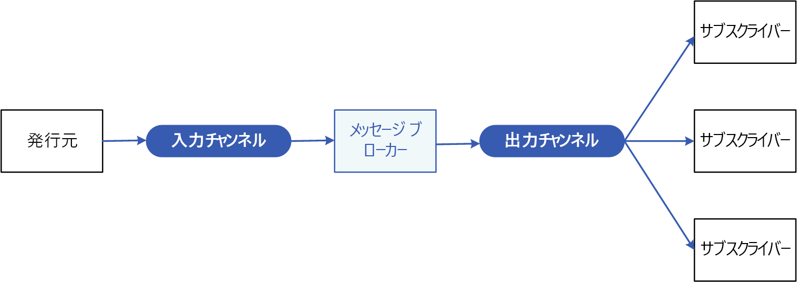

# パブリッシャーとサブスクライバーのパターン

送信側と受信側を結合せずに、アプリケーションから複数の対象コンシューマーに対して非同期的にイベントを通知できるようにします。

**別名**:パブリッシュ/サブスクライブ メッセージング

## コンテキストと問題

クラウド ベースの分散アプリケーションでは、システムのコンポーネントは、多くの場合、イベントが発生したときに他のコンポーネントに情報を提供する必要があります。

非同期メッセージングは、送信者をコンシューマーから切り離し、送信者が応答を待機するのをブロックしないようにする有効な方法です。 ただし、各コンシューマーのために専用のメッセージ キューを使用しても、多数のコンシューマーに対して効果的にスケーリングすることにはなりません。 また、一部のコンシューマーは、情報のサブセットにのみ興味を持っている場合があります。 送信者はどのようにすれば、ID を知らずに、対象のコンシューマー全員にイベントを通知できるでしょうか。

## 解決策

以下を含む非同期メッセージング サブシステムを導入します。

- 送信者によって使用される入力メッセージング チャネル。 送信者は、既知のメッセージ形式を使用して、メッセージ内にイベントをパッケージ化し、入力チャネルを介してこれらのメッセージを送信します。 このパターンの送信者は、*パブリッシャー*とも呼ばれます。

  > [!NOTE]
  > *メッセージ*はデータのパケットです。 *イベント*は、発生した変更またはアクションについて、その他のコンポーネントに通知するメッセージです。

- コンシューマーごとに 1 つの出力メッセージング チャネル。 コンシューマーは*サブスクライバー*とも呼ばれます。

- そのメッセージに関心があるすべてのサブスクライバーのために、入力チャネルから出力チャネルに各メッセージをコピーするためのメカニズム。 この操作は通常、メッセージ ブローカーやイベント バスなどの仲介機能によって処理されます。

次の図は、このパターンの論理コンポーネントを示しています。

 
パブリッシュ/サブスクライブ メッセージングには以下の利点があります。

- これにより、まだ通信する必要があるサブシステムが切り離されます。 サブシステムは別個に管理可能で、1 つまたは複数の受信者がオフラインになっている場合でも、メッセージを正しく管理できます。

- スケーラビリティが向上し、送信者の応答性が向上します。 送信者は入力チャネルにすばやく単一のメッセージを送信し、担っているコアの処理に戻ることができます。 興味を持っているサブスクライバーに確実にメッセージが配信されるようにすることは、メッセージング インフラストラクチャが行います。

- そのため、信頼性が向上します。 非同期メッセージングは、増加した負荷のもとでアプリケーションがスムーズに実行され続けるようにして、断続的なエラーをより効果的に処理する助けとなります。

- 遅延処理やスケジュールされた処理が可能です。 サブスクライバーがオフピークの時間までメッセージの取得を待機することも、特定のスケジュールに従って、メッセージのルーティングまたは処理を行うこともできます。

- 異なるプラットフォーム、プログラミング言語、または通信プロトコルを使用するシステム間だけでなく、オンプレミス システムとクラウドで実行されるアプリケーション間の統合をより簡単にすることができます。

- 企業全体にわたる非同期ワークフローが容易になります。

- テストの容易性が向上します。 チャネルを監視することができ、全体の統合テスト戦略の一部として、メッセージの検査やログへの記録が可能です。

- アプリケーションの懸念事項の分離が提供されます。 メッセージング インフラストラクチャがメッセージを複数のコンシューマーに確実にルーティングするために必要なすべてを処理している間、各アプリケーションはコア機能に集中できます。 

## 問題と注意事項

このパターンの実装方法を決めるときには、以下の点に注意してください。

- **既存のテクノロジ。** 独自に構築するのではなく、パブリッシュ-サブスクライブ モデルをサポートしている、入手できるメッセージング製品とサービスを使用することを強くお勧めします。 Azure では、[Service Bus](/azure/service-bus-messaging/) または [Event Grid](/azure/event-grid/) の使用を検討してください。 パブリッシュ/サブスクライブ メッセージング用に使用できるその他のテクノロジには、Redis、RabbitMQ、Apache Kafka が含まれます。

- **サブスクリプションの処理。** メッセージング インフラストラクチャでは、コンシューマーがチャネルのサブスクライブまたはサブスクライブ解除に使用できるメカニズムを提供する必要があります。

- **セキュリティ。** 承認されていないユーザーやアプリケーションによる盗聴を防ぐため、どのメッセージ チャネルへの接続も、セキュリティ ポリシーによって制限する必要があります。

- **メッセージのサブセット。** サブスクライバーは、通常、パブリッシャーによって配布されるメッセージのサブセットにのみ興味を持っています。 メッセージング サービスでは、多くの場合、受信したメッセージのセットをサブスクライバーが絞り込むことができます。

  - **トピック。** 各トピックには専用の出力チャネルがあり、各コンシューマーは、すべての関連トピックをサブスクライブできます。
  - **コンテンツのフィルター処理。** 各メッセージのコンテンツに基づいてメッセージの検査と配布が行われます。 各サブスクライバーは、興味のあるコンテンツを指定できます。

- **ワイルドカード サブスクライバー。** サブスクライバーによる、ワイルドカードを使用した複数トピックのサブスクライブを許可することを検討してください。

- **双方向通信。** パブリッシュ-サブスクライブ システムのチャネルは、一方向として扱われます。 特定のサブスクライバーが受信確認の送信や、パブリッシャーに状態を返す通信を行う必要がある場合は、[要求/応答パターン](http://www.enterpriseintegrationpatterns.com/patterns/messaging/RequestReply.html)の使用を検討します。 このパターンでは、1 つのチャネルを使用してサブスクライバーにメッセージが送信され、パブリッシャーに返す通信には別個の応答チャネルが使用されます。

- **メッセージの順序付け。** コンシューマー インスタンスでは、メッセージを受け取る順序は保証されません。また、受け取る順序に、メッセージが作成された順序が反映されるとは限りません。 メッセージ処理の順序への依存をなくす助けになるように、メッセージ処理がべき等になるようにシステムを設計します。

- **メッセージの優先度。** 一部のソリューションでは、特定の順序でメッセージが処理される必要があります。 [Priority Queue パターン](priority-queue.md)は、特定のメッセージが確実に、他のメッセージより前に配信されるようにするメカニズムを提供します。

- **有害メッセージ。** 不適切な形式のメッセージ、または使用できないリソースにアクセスする必要があるタスクによって、サービス インスタンスが失敗する可能性があります。 システムでは、そのようなメッセージがキューに返されないようにする必要があります。 代わりに、必要な場合は分析できるように、これらのメッセージの詳細を他の場所でキャプチャして保存します。

- **メッセージの繰り返し。** 同じメッセージが複数回送信されることがあります。 たとえば、送信者がメッセージ投稿後に失敗することがあります。 その後、送信者の新しいインスタンスが起動されて、メッセージを繰り返します。 多くて 1 回のメッセージ配信を提供するために、メッセージング インフラストラクチャには、メッセージ ID に基づく重複メッセージの検出と削除 (重複除外とも呼ばれます) を実装する必要があります。

- **メッセージの有効期限。** メッセージの有効期間は制限されていることがあります。 この期間内に処理されない場合、もう関連がなくなった可能性があり、破棄する必要があります。 送信者は、メッセージ内のデータの一部として、有効期限の時間を指定できます。 受信者は、メッセージに関連付けられているビジネス ロジックを実行するかどうかを決める前に、この情報を調べることができます。

- **メッセージのスケジュール設定。** メッセージは、一時的に停止される可能性があり、特定の日付と時刻まで処理してはいけません。 この時点まで、受信者がメッセージを使用できてはいけません。

## このパターンを使用する状況

このパターンは次の状況で使用します。

- アプリケーションは、非常に多くのコンシューマーに情報をブロードキャストする必要があります。

- アプリケーションは、独立して開発された 1 つまたは複数のアプリケーションまたはサービスと通信する必要があります。これらは、異なるプラットフォーム、プログラミング言語、および通信プロトコルを使用している可能性があります。

- アプリケーションは、コンシューマーからのリアルタイムの応答を必要とせずに、コンシューマーに情報を送信できます。

- 統合されようとしているシステムは、データの最終的整合性モデルをサポートするように設計されています。

- アプリケーションは、複数のコンシューマーに情報を通信する必要がありますが、これらには、送信者とは異なる可用性要件や稼働スケジュールがある場合もあります。

このパターンが適さない状況

- 作成側アプリケーションの大きく異なる情報を必要とするコンシューマーが、数人だけしかいない場合。

- アプリケーションが、ほぼリアルタイムの、コンシューマーとの対話を必要とする場合。

## 例

次の図は、Service Bus を使用してワークフローを調整するエンタープライズ統合アーキテクチャと、Event Grid の、発生するイベントの通知サブシステムを示しています。 詳細については、「[メッセージ キューとイベントを使用した Azure でのエンタープライズ統合](../reference-architectures/enterprise-integration/queues-events.md)」を参照してください。

## 関連のあるパターンとガイダンス

このパターンを実装する場合は、次のパターンとガイダンスが関連している可能性があります。

- [メッセージを配信する Azure サービスの選択](/azure/event-grid/compare-messaging-services)。

- [イベント ドリブン アーキテクチャ スタイル](../guide/architecture-styles/event-driven.md)は、パブリッシュ/サブスクライブ メッセージングを使用するアーキテクチャ スタイルです。

- [非同期メッセージングの基本](https://msdn.microsoft.com/library/dn589781.aspx)。 メッセージ キューは、非同期通信メカニズムです。 コンシューマー サービスがアプリケーションに返信を送信する必要がある場合、状況に応じて何らかの形式の応答メッセージングを実装します。 「Asynchronous Messaging Primer」(非同期メッセージングの基本) では、メッセージ キューを使用して要求/返信メッセージングを実装する方法が説明されています。

- [オブザーバー パターン。](https://en.wikipedia.org/wiki/Observer_pattern) パブリッシュ-サブスクライブ パターンは、非同期メッセージングによってオブザーバーからサブジェクトを切り離すことで、オブザーバー パターンを基盤として作成されています。

- [メッセージ ブローカー パターン](https://en.wikipedia.org/wiki/Message_broker)。 パブリッシュ-サブスクライブ モデルをサポートする多くのメッセージング サブシステムは、メッセージ ブローカーによって実装されています。
