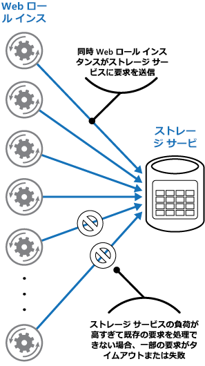
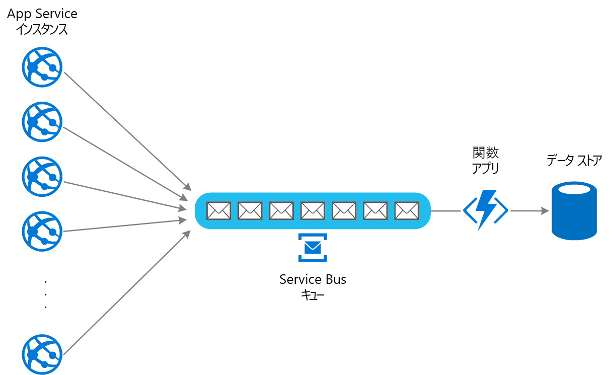

# キュー ベースの負荷平準化パターン

タスクとそのタスクが呼び出すサービスの間のバッファーとして機能するキューを使用して、サービスの障害やタスクのタイム アウトが発生する場合がある断続的な大きい負荷を平準化します。これは、タスクとサービスの両方の可用性と応答性の需要ピークへの影響を最小限に抑えるのに役立ちます。

## コンテキストと問題

クラウド内の多くのソリューションでは、サービスを呼び出すタスクを実行する必要があります。 この環境では、サービスに断続的に大きい負荷がかかると、パフォーマンスまたは信頼性の問題が発生する場合があります。

サービスはそのサービスを使用するタスクと同じソリューションの一部である場合や、キャッシュまたはストレージ サービスなどの頻繁に使用されるリソースへのアクセスを提供するサードパーティのサービスである場合があります。 同じサービスが同時に実行されている多数のタスクで使用されると、サービスに対する要求のボリュームを常に予測するのが困難になる場合があります。

サービスの需要がピークに達する可能性があります。その場合、過負荷となり、適時に要求に応答できなくなります。 多数の同時要求がサービスに殺到すると、これらの要求が原因の競合を処理できない場合にサービス障害が発生することもあります。

## 解決策

ソリューションをリファクタリングし、タスクとサービス間でキューを導入します。 タスクとサービスを非同期に実行します。 タスクは、キューにサービスで必要なデータを含むメッセージを投稿します。 キューは、サービスが取得するまでメッセージを格納するバッファーとして機能します。 サービスはキューからメッセージを取得して処理します。 さまざま速度で生成可能な、多数のタスクからの要求は、同じメッセージ キューを通じてサービスに渡すことができます。 以下の図は、キューを使用したサービス負荷の平準化を示しています。

キューはサービスからタスクを切り離すため、サービスは、同時タスクからの要求のボリュームに関係なく、独自のペースでメッセージを処理できます。 また、サービスがキューにメッセージを投稿したときに使用できない場合でも、タスクの遅延は発生しません。

このパターンには次のような利点があります。

- サービスで発生する遅延がすぐにアプリケーションに直接影響することはないため、可用性を最大化するのに役立ちます。サービスが使用できない場合や、現在、メッセージを処理していない場合であっても、キューにメッセージを継続的に投稿できます。
- 需要を満たすためにキューの数とサービスの数の両方を変更できるため、スケーラビリティを最大化するのに役立ちます。
- ピーク時の負荷ではなく、平均負荷に対応するのに十分な数のサービス インスタンスをデプロイするだけでよいため、コスト管理に役立ちます。

    >  一部のサービスでは、それを超えるとシステムで障害が発生する可能性があるしきい値に需要が達した場合に、スロットルを実装します。 スロットルにより使用可能な機能を減らすことができます。 このしきい値に達しないように、これらのサービスの負荷を平準化することができます。

## 問題と注意事項

このパターンの実装方法を決めるときには、以下の点に注意してください。

- ターゲット リソースが過多にならないように、サービスによるメッセージの処理速度を制御するアプリケーション ロジックを実装する必要があります。 システムの次のステージで需要が急増しないようにしてください。 負荷がかかっているシステムをテストし、必要な平準化が行われることを確認し、キューの数とメッセージを処理するサービス インスタンスの数を調整してください。
- メッセージ キューは一方向の通信メカニズムです。 タスクがサービスからの応答を予期している場合、サービスが応答を送信するために使用できるメカニズムを実装する必要がある場合があります。 詳細については、「[非同期メッセージングの基本](https://msdn.microsoft.com/library/dn589781.aspx)」を参照してください。
- キューで要求をリッスンしているサービスに自動スケールを適用する場合は注意してください。 これにより、サービスが共有するすべてのリソースの競合が増え、負荷を平準化するためのキューの使用効果が弱まる場合があります。

## このパターンを使用する状況

このパターンは、過負荷になる可能性のあるサービスを使用するすべてのアプリケーションに有効です。

アプリケーションが最短の待機時間でサービスからの応答を予期している場合、このパターンは有効ではありません。

## 例

Web アプリでは、外部データ ストアにデータを書き込みます。 Web アプリの多くのインスタンスが同時に実行されている場合、データ ストアでは要求に迅速に応答できない可能性があります。これにより、要求がタイムアウトになるか、調整されるか、それ以外の場合は失敗します。 以下の図は、アプリケーションのインスタンスからの多くの同時要求がデータ ストアに殺到している様子を示しています。

これを解決するために、キューを使用して、アプリケーション インスタンスとデータ ストア間の負荷を平準化することができます。 Azure 関数アプリではメッセージをキューから読み取り、データ ストアへの読み取り/書き込み要求を実行します。 関数アプリのアプリケーション ロジックでは、データ ストアの過負荷を防ぐために、データ ストアに要求を渡す速度を制御できます  (それ以外の場合、関数アプリではバック エンドで同じ問題が再発するだけです)。

## 関連のあるパターンとガイダンス

このパターンを実装する場合は、次のパターンとガイダンスも関連している可能性があります。

- [非同期メッセージングの基本](https://msdn.microsoft.com/library/dn589781.aspx)。 メッセージ キューでは本質的に非同期です。 サービスとの直接通信からメッセージ キューの使用にまで適応される場合は、タスクでアプリケーション ロジックを再設計する必要がある可能性があります。 同様に、メッセージ キューからの要求を受け入れるためにサービスをリファクタリングする必要がある場合があります。 例に示されているように、プロキシ サービスを実装できる場合もあります。

- [競合コンシューマー パターン](./competing-consumers.md)。 それぞれが負荷平準化キューのメッセージ コンシューマーとして機能する、サービスの複数のインスタンスを実行できる場合があります。 この方法を使用して、メッセージを受信してサービスに渡す速度を調整することができます。

- [スロットル パターン](./throttling.md)。 サービスでスロットルを実装する簡単な方法は、キュー ベースの負荷平準化を使用し、メッセージ キューを通じてすべての要求をサービスにルーティングすることです。 サービスは、必要なリソースを使い切らない速度で要求を処理し、発生する可能性のある競合量を減らすことができます。

- [Azure メッセージング サービスの選択](/azure/event-grid/compare-messaging-services)。 Azure アプリケーションのメッセージングおよびキューイング メカニズムの選択に関する情報です。

- [Azure Web アプリケーションのスケーラビリティの向上](../reference-architectures/app-service-web-app/scalable-web-app.md)。 この参照アーキテクチャには、アーキテクチャの一部として、キュー ベースの負荷の平準化が含まれています。
