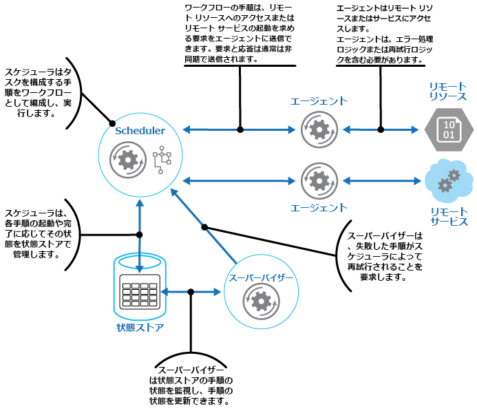
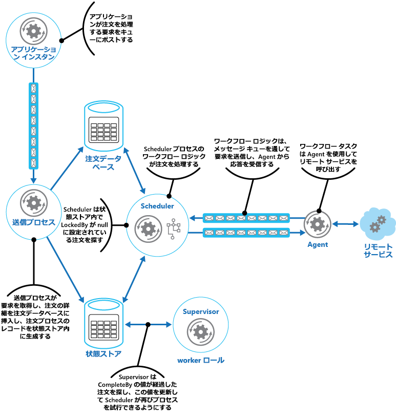

# Scheduler Agent Supervisor パターンScheduler Agent Supervisor pattern

[!INCLUDE [header](../_includes/header.md)]

分散された一連のアクションを 1 つの操作として調整します。Coordinate a set of distributed actions as a single operation. いずれかのアクションが失敗した場合は、全体の操作が全体として成功または失敗するように、その失敗を透過的に処理しようとするか、または実行された作業を元に戻します。If any of the actions fail, try to handle the failures transparently, or else undo the work that was performed, so the entire operation succeeds or fails as a whole. これにより、一時的な例外、長期間続く障害、プロセスのエラーなどのために失敗したアクションを復旧して再試行することが可能になるため、分散システムに回復性が追加される場合があります。This can add resiliency to a distributed system, by enabling it to recover and retry actions that fail due to transient exceptions, long-lasting faults, and process failures.

## コンテキストと問題Context and problem

アプリケーションは、その一部でリモート サービスが呼び出されたり、リモート リソースにアクセスしたりする可能性のあるいくつかの手順を含むタスクを実行します。An application performs tasks that include a number of steps, some of which might invoke remote services or access remote resources. それぞれのステップは互いに独立しているかもしれませんが、それらを指揮するのは、タスクを実装するアプリケーションのロジックです。The individual steps might be independent of each other, but they are orchestrated by the application logic that implements the task.

可能な場合は常に、アプリケーションはタスクが完了まで実行されるようにし、リモート サービスまたはリソースへのアクセス時に発生する可能性のあるすべての障害を解決する必要があります。Whenever possible, the application should ensure that the task runs to completion and resolve any failures that might occur when accessing remote services or resources. 障害は、さまざまな原因で発生することがあります。Failures can occur for many reasons. たとえば、ネットワークが停止したり、通信が中断されたり、リモート サービスが無応答または不安定な状態になったり、おそらくリソースの制約のためにリモート リソースが一時的にアクセスできなくなったりすることがあります。For example, the network might be down, communications could be interrupted, a remote service might be unresponsive or in an unstable state, or a remote resource might be temporarily inaccessible, perhaps due to resource constraints. 多くの場合、障害は一時的なものであり、[再試行パターン](./retry.md)を使用して処理できます。In many cases the failures will be transient and can be handled by using the [Retry pattern](./retry.md).

アプリケーションは、容易に復旧できないより永続的な障害を検出した場合、システムを整合性のある状態に復元し、操作全体の整合性を保証できる必要があります。If the application detects a more permanent fault it can't easily recover from, it must be able to restore the system to a consistent state and ensure integrity of the entire operation.

## 解決策Solution

Scheduler Agent Supervisor パターンは、次のアクターを定義します。The Scheduler Agent Supervisor pattern defines the following actors. これらのアクターは、全体的なタスクの一部として実行される手順を調整します。These actors orchestrate the steps to be performed as part of the overall task.

- **Scheduler** は、実行されるタスクを構成する手順を準備し、その操作を調整します。The **Scheduler** arranges for the steps that make up the task to be executed and orchestrates their operation. これらの手順は、パイプラインまたはワークフローに結合できます。These steps can be combined into a pipeline or workflow. Scheduler は、このワークフロー内の手順が正しい順序で実行されるようにすることに責任を負います。The Scheduler is responsible for ensuring that the steps in this workflow are performed in the right order. 各手順が実行されると、Scheduler は、"まだ開始されていない手順"、"実行中の手順"、"完了した手順" などのワークフローの状態を記録します。As each step is performed, the Scheduler records the state of the workflow, such as "step not yet started," "step running," or "step completed." 状態情報にはまた、完了期限と呼ばれる、手順が完了するまでに許可される時間の上限も含まれます。The state information should also include an upper limit of the time allowed for the step to finish, called the complete-by time. ある手順にリモート サービスまたはリソースへのアクセスが必要な場合、Scheduler は適切な Agent を呼び出し、実行される作業の詳細を渡します。If a step requires access to a remote service or resource, the Scheduler invokes the appropriate Agent, passing it the details of the work to be performed. Scheduler は通常、非同期の要求/応答メッセージングを使用して Agent と通信します。The Scheduler typically communicates with an Agent using asynchronous request/response messaging. これはキューを使用して実装できますが、代わりに、その他の分散メッセージング テクノロジも使用できます。This can be implemented using queues, although other distributed messaging technologies could be used instead.

    > Scheduler は、[Process Manager パターン](https://www.enterpriseintegrationpatterns.com/patterns/messaging/ProcessManager.html)で Process Manager に対して同様の機能を実行します。The Scheduler performs a similar function to the Process Manager in the [Process Manager pattern](https://www.enterpriseintegrationpatterns.com/patterns/messaging/ProcessManager.html). 実際のワークフローは通常、Scheduler によって制御されるワークフロー エンジンによって定義および実装されます。The actual workflow is typically defined and implemented by a workflow engine that's controlled by the Scheduler. このアプローチにより、ワークフロー内のビジネス ロジックが Scheduler から分離されます。This approach decouples the business logic in the workflow from the Scheduler.

- **Agent** には、リモート サービスの呼び出し、またはタスク内の手順によって参照されるリモート リソースへのアクセスをカプセル化するロジックが含まれています。The **Agent** contains logic that encapsulates a call to a remote service, or access to a remote resource referenced by a step in a task. 各 Agent は通常、1 つのサービスまたはリソースの呼び出しをラップし、適切なエラー処理と再試行ロジックを実装します (後で説明される、タイムアウトの制約に従います)。Each Agent typically wraps calls to a single service or resource, implementing the appropriate error handling and retry logic (subject to a timeout constraint, described later). Scheduler によって実行されるワークフロー内の手順が別の手順にまたがっていくつかのサービスやリソースを使用する場合は、各手順が別の Agent を参照する可能性があります (これがパターンの実装の詳細です)。If the steps in the workflow being run by the Scheduler use several services and resources across different steps, each step might reference a different Agent (this is an implementation detail of the pattern).

- **Supervisor** は、Scheduler によって実行されているタスク内の手順の状態を監視します。The **Supervisor** monitors the status of the steps in the task being performed by the Scheduler. これは定期的に実行され (頻度はシステムに固有です)、Scheduler によって保持されている手順の状態を調べます。It runs periodically (the frequency will be system specific), and examines the status of steps maintained by the Scheduler. いずれかの手順がタイムアウトまたは失敗したことを検出した場合は、その手順を復旧するか、または適切な是正アクション (これには手順の状態の変更が含まれることがあります) を実行する適切な Agent を準備します。If it detects any that have timed out or failed, it arranges for the appropriate Agent to recover the step or execute the appropriate remedial action (this might involve modifying the status of a step). 復旧または是正アクションが Scheduler と Agent によって実装されることに注意してください。Note that the recovery or remedial actions are implemented by the Scheduler and Agents. Supervisor は単純に、これらのアクションが実行されることを要求します。The Supervisor should simply request that these actions be performed.

Scheduler、Agent、および Supervisor は論理的なコンポーネントであり、それらの物理的な実装は使用されているテクノロジによって異なります。The Scheduler, Agent, and Supervisor are logical components and their physical implementation depends on the technology being used. たとえば、1 つの Web サービスの一部として複数の論理的な Agent が実装される可能性があります。For example, several logical agents might be implemented as part of a single web service.

Scheduler は、タスクの進行状況や各手順の状態に関する情報を、状態ストアと呼ばれる持続性のあるデータ ストア内に保持します。The Scheduler maintains information about the progress of the task and the state of each step in a durable data store, called the state store. Supervisor は、手順が失敗したかどうかの判定に役立てるためにこの情報を使用できます。The Supervisor can use this information to help determine whether a step has failed. この図は、Scheduler、Agent、Supervisor、および状態ストアの関係を示しています。The figure illustrates the relationship between the Scheduler, the Agents, the Supervisor, and the state store.

> [!NOTE]
> この図は、パターンの簡略版を示しています。This diagram shows a simplified version of the pattern. 実際の実装では、それぞれがタスクのサブセットである、Scheduler の多数のインスタンスが同時に実行されることがあります。In a real implementation, there might be many instances of the Scheduler running concurrently, each a subset of tasks. 同様に、システムが各 Agent の複数のインスタンス、場合によっては複数の Supervisor を実行する可能性があります。Similarly, the system could run multiple instances of each Agent, or even multiple Supervisors. この場合、各 Supervisor は自身の作業を互いに慎重に調整して、同じ失敗した手順やタスクを復旧するために競合しないようにする必要があります。In this case, Supervisors must coordinate their work with each other carefully to ensure that they don’t compete to recover the same failed steps and tasks. [リーダー選定パターン](./leader-election.md)は、この問題に対する 1 つの可能性のある解決策を提供します。The [Leader Election pattern](./leader-election.md) provides one possible solution to this problem.

アプリケーションは、タスクを実行する準備が整うと Scheduler に要求を送信します。When the application is ready to run a task, it submits a request to the Scheduler. Scheduler は、タスクとその手順に関する初期の状態情報を状態ストア内に記録した後 (たとえば、まだ開始されていない手順)、ワークフローによって定義された操作の実行を開始します。The Scheduler records initial state information about the task and its steps (for example, step not yet started) in the state store and then starts performing the operations defined by the workflow. Scheduler は、各手順を開始すると、状態ストア内のその手順の状態に関する情報を更新します (たとえば、実行中の手順)。As the Scheduler starts each step, it updates the information about the state of that step in the state store (for example, step running).

ある手順がリモート サービスまたはリソースを参照した場合、Scheduler は適切な Agent にメッセージを送信します。If a step references a remote service or resource, the Scheduler sends a message to the appropriate Agent. このメッセージには、操作の完了期限に加えて、Agent がそのサービスに渡すか、またはそのリソースにアクセスするために必要な情報が含まれています。The message contains the information that the Agent needs to pass to the service or access the resource, in addition to the complete-by time for the operation. その操作を正常に完了した場合、Agent は Scheduler に応答を返します。If the Agent completes its operation successfully, it returns a response to the Scheduler. その後、Scheduler は状態ストア内の状態情報を更新してから (たとえば、完了した手順)、次の手順を実行できます。The Scheduler can then update the state information in the state store (for example, step completed) and perform the next step. タスク全体が完了するまで、このプロセスが続行されます。This process continues until the entire task is complete.

Agent は、その作業を実行するために必要な任意の再試行ロジックを実装できます。An Agent can implement any retry logic that's necessary to perform its work. ただし、完了期限が切れる前に Agent が作業を完了しない場合、Scheduler はその操作が失敗したと見なします。However, if the Agent doesn't complete its work before the complete-by period expires, the Scheduler will assume that the operation has failed. この場合、Agent はその作業を停止し、Scheduler に何も (エラー メッセージさえ) 返そうとせず、またどのような形式の復旧も試行しません。In this case, the Agent should stop its work and not try to return anything to the Scheduler (not even an error message), or try any form of recovery. この制限の理由は、手順がタイムアウトまたは失敗した後、その失敗した手順を実行するために Agent の別のインスタンスがスケジュールされる可能性がある点にあります (このプロセスについては後で説明します)。The reason for this restriction is that, after a step has timed out or failed, another instance of the Agent might be scheduled to run the failing step (this process is described later).

Agent が失敗した場合、Scheduler は応答を受信しません。If the Agent fails, the Scheduler won't receive a response. パターンでは、タイムアウトした手順と、純粋に失敗した手順が区別されません。The pattern doesn't make a distinction between a step that has timed out and one that has genuinely failed.

ある手順がタイムアウトまたは失敗した場合、状態ストアにはその手順が実行中であることを示すレコードが含まれますが、完了期限は切れます。If a step times out or fails, the state store will contain a record that indicates that the step is running, but the complete-by time will have passed. Supervisor はこのような手順を探し、それらを復旧しようとします。The Supervisor looks for steps like this and tries to recover them. 1 つの可能性のある方式として、Supervisor が完了期限の値を更新して手順を完了するために使用できる時間を延長してから、タイムアウトした手順を識別するメッセージを Scheduler に送信する方法があります。その後、Scheduler はこの手順を繰り返そうとします。One possible strategy is for the Supervisor to update the complete-by value to extend the time available to complete the step, and then send a message to the Scheduler identifying the step that has timed out. The Scheduler can then try to repeat this step. ただし、この設計では、タスクが冪等である必要があります。However, this design requires the tasks to be idempotent.

手順が継続的に失敗またはタイムアウトした場合は、Supervisor で、同じ手順が再試行されないようにすることが必要になる場合があります。これを行うために、Supervisor は、状態情報と共に各手順の再試行カウントを状態ストア内に保持できます。The Supervisor might need to prevent the same step from being retried if it continually fails or times out. To do this, the Supervisor could maintain a retry count for each step, along with the state information, in the state store. このカウントが定義済みのしきい値を超えた場合、Supervisor は Scheduler に手順を再試行すべきことを通知する前に長期間待つことにより、この期間中に障害が解決されることを期待する方法を採用できます。If this count exceeds a predefined threshold the Supervisor can adopt a strategy of waiting for an extended period before notifying the Scheduler that it should retry the step, in the expectation that the fault will be resolved during this period. あるいは、[補正トランザクション パターン](./compensating-transaction.md)を実装することにより、Supervisor は Scheduler にメッセージを送信してタスク全体を元に戻すことを要求できます。Alternatively, the Supervisor can send a message to the Scheduler to request the entire task be undone by implementing a [Compensating Transaction pattern](./compensating-transaction.md). このアプローチは、正常に完了した手順ごとの補正操作を実装するために必要な情報を提供する Scheduler と Agent に依存します。This approach will depend on the Scheduler and Agents providing the information necessary to implement the compensating operations for each step that completed successfully.

> Scheduler と Agent を監視し、失敗した場合にそれらを再起動することは Supervisor の目的ではありません。It isn't the purpose of the Supervisor to monitor the Scheduler and Agents, and restart them if they fail. システムのこの側面は、これらのコンポーネントが実行されているインフラストラクチャによって処理される必要があります。This aspect of the system should be handled by the infrastructure these components are running in. 同様に、Supervisor には、Scheduler によって実行されるタスクが実行している実際のビジネス運用の知識 (これらのタスクが失敗した場合に補正する方法を含む) もありません。Similarly, the Supervisor shouldn't have knowledge of the actual business operations that the tasks being performed by the Scheduler are running (including how to compensate should these tasks fail). これが、Scheduler によって実装されたワークフロー ロジックの目的です。This is the purpose of the workflow logic implemented by the Scheduler. Supervisor の責任は、ある手順が失敗したかどうかを判定し、それを繰り返すように、または失敗した手順を含むタスク全体を元に戻すように準備することだけです。The sole responsibility of the Supervisor is to determine whether a step has failed and arrange either for it to be repeated or for the entire task containing the failed step to be undone.

障害の後に Scheduler が再起動されたり、Scheduler によって実行されているワークフローが予期せず終了したりした場合、Scheduler は失敗したときに処理していた処理中タスクの状態を判定し、その時点からこのタスクを再開するように準備できます。If the Scheduler is restarted after a failure, or the workflow being performed by the Scheduler terminates unexpectedly, the Scheduler should be able to determine the status of any inflight task that it was handling when it failed, and be prepared to resume this task from that point. このプロセスの実装の詳細は、システム固有である可能性があります。The implementation details of this process are likely to be system specific. タスクを復旧できない場合は、そのタスクによって既に実行された作業を元に戻す操作が必要になることがあります。If the task can't be recovered, it might be necessary to undo the work already performed by the task. これにはまた、[補正トランザクション](./compensating-transaction.md)の実装も必要になります。This might also require implementing a [compensating transaction](./compensating-transaction.md).

このパターンの主な利点は、予期しない一時的または回復不可能な障害が発生した場合のシステムの回復性が高いことです。The key advantage of this pattern is that the system is resilient in the event of unexpected temporary or unrecoverable failures. システムを自己復旧するように構成できます。The system can be constructed to be self healing. たとえば、Agent または Scheduler が失敗した場合は、新しい Agent または Scheduler を開始でき、Supervisor は再開されるタスクを準備できます。For example, if an Agent or the Scheduler fails, a new one can be started and the Supervisor can arrange for a task to be resumed. Supervisor が失敗した場合は、別のインスタンスを開始でき、そのインスタンスが障害の発生した場所から引き継ぐことができます。If the Supervisor fails, another instance can be started and can take over from where the failure occurred. Supervisor が定期的に実行されるようにスケジュールされている場合は、定義済みの間隔の後、新しいインスタンスを自動的に開始できます。If the Supervisor is scheduled to run periodically, a new instance can be automatically started after a predefined interval. 状態ストアは、さらに高い回復性を実現するためにレプリケートできます。The state store can be replicated to reach an even greater degree of resiliency.

## 問題と注意事項Issues and considerations

このパターンの実装方法を決めるときには、以下の点に注意してください。You should consider the following points when deciding how to implement this pattern:

- このパターンは実装が難しい場合があり、システムの可能性のある各障害モードの徹底的なテストが必要になります。This pattern can be difficult to implement and requires thorough testing of each possible failure mode of the system.

- Scheduler によって実装される復旧/再試行ロジックは複雑であり、状態ストア内に保持されている状態情報に依存します。The recovery/retry logic implemented by the Scheduler is complex and dependent on state information held in the state store. また、補正トランザクションを実装するために必要な情報を持続性のあるデータ ストア内に記録することも必要になる可能性があります。It might also be necessary to record the information required to implement a compensating transaction in a durable data store.

- Supervisor をどれだけ頻繁に実行するかが重要になります。How often the Supervisor runs will be important. 失敗した手順がアプリケーションを長期間ブロックしないようにするために十分なほど頻繁に実行する必要がありますが、オーバーヘッドになるほど頻繁には実行すべきでありません。It should run often enough to prevent any failed steps from blocking an application for an extended period, but it shouldn't run so often that it becomes an overhead.

- Agent によって実行される手順は複数回実行できます。The steps performed by an Agent could be run more than once. これらの手順を実装するロジックは冪等である必要があります。The logic that implements these steps should be idempotent.

## このパターンを使用する状況When to use this pattern

このパターンは、クラウドなどの分散環境で実行されるプロセスの、通信障害または動作障害に対する回復性を高くする必要がある場合に使用します。Use this pattern when a process that runs in a distributed environment, such as the cloud, must be resilient to communications failure and/or operational failure.

このパターンは、リモート サービスを呼び出したり、リモート リソースにアクセスしたりしないタスクには適していない可能性があります。This pattern might not be suitable for tasks that don't invoke remote services or access remote resources.

## 例Example

e コマース システムを実装する Web アプリケーションが Microsoft Azure にデプロイされました。A web application that implements an ecommerce system has been deployed on Microsoft Azure. ユーザーは、使用可能な製品を参照して注文するためにこのアプリケーションを実行できます。Users can run this application to browse the available products and to place orders. ユーザー インターフェイスは Web ロールとして実行され、アプリケーションの注文処理要素は一連の worker ロールとして実装されます。The user interface runs as a web role, and the order processing elements of the application are implemented as a set of worker roles. 注文処理ロジックの一部にはリモート サービスへのアクセスが含まれ、システムのこの側面が一時的な障害、またはより長期間続く障害になりやすくなる可能性があります。Part of the order processing logic involves accessing a remote service, and this aspect of the system could be prone to transient or more long-lasting faults. このため、デザイナーは Scheduler Agent Supervisor パターンを使用して、システムの注文処理要素を実装しました。For this reason, the designers used the Scheduler Agent Supervisor pattern to implement the order processing elements of the system.

顧客が注文を行うと、アプリケーションはその注文が記述されたメッセージを作成し、このメッセージをキューにポストします。When a customer places an order, the application constructs a message that describes the order and posts this message to a queue. worker ロールで実行されている個別の送信プロセスがそのメッセージを取得し、注文の詳細を注文データベースに挿入して、注文プロセスのレコードを状態ストア内に作成します。A separate submission process, running in a worker role, retrieves the message, inserts the order details into the orders database, and creates a record for the order process in the state store. 注文データベースと状態ストアへの挿入が同じ操作の一部として実行されることに注意してください。Note that the inserts into the orders database and the state store are performed as part of the same operation. 送信プロセスは、両方の挿入が必ず一緒に完了するように設計されています。The submission process is designed to ensure that both inserts complete together.

送信プロセスが注文のために作成する状態情報には、次のものがあります。The state information that the submission process creates for the order includes:

- **OrderID**。**OrderID**. 注文データベース内の注文の ID。The ID of the order in the orders database.

- **LockedBy**。**LockedBy**. 注文を処理している worker ロールのインスタンス ID。The instance ID of the worker role handling the order. Scheduler を実行している worker ロールの現在のインスタンスは複数存在する可能性がありますが、各注文は 1 つのインスタンスによってのみ処理される必要があります。There might be multiple current instances of the worker role running the Scheduler, but each order should only be handled by a single instance.

- **CompleteBy**。**CompleteBy**. 注文を処理する必要のある期限。The time the order should be processed by.

- **ProcessState**。**ProcessState**. 注文を処理しているタスクの現在の状態。The current state of the task handling the order. 可能性のある状態は次のとおりです。The possible states are:

  - **保留中**。**Pending**. 注文が作成されましたが、処理はまだ開始されていません。The order has been created but processing hasn't yet been started.
  - **処理中**。**Processing**. 注文は現在処理されています。The order is currently being processed.
  - **処理済み**。**Processed**. 注文は正常に処理されました。The order has been processed successfully.
  - **エラー**。**Error**. 注文処理が失敗しました。The order processing has failed.

- **FailureCount**。**FailureCount**. 注文のために処理が試行された回数。The number of times that processing has been tried for the order.

この状態情報では、`OrderID` フィールドは新しい注文の注文 ID からコピーされます。In this state information, the `OrderID` field is copied from the order ID of the new order. `LockedBy` および `CompleteBy` フィールドは `null` に設定され、`ProcessState` フィールドは `Pending` に設定され、`FailureCount` フィールドは 0 に設定されます。The `LockedBy` and `CompleteBy` fields are set to `null`, the `ProcessState` field is set to `Pending`, and the `FailureCount` field is set to 0.

> [!NOTE]
> この例では、注文処理ロジックは比較的単純であり、リモート サービスを呼び出す手順が 1 つしか存在しません。In this example, the order handling logic is relatively simple and only has a single step that invokes a remote service. より複雑な複数手順のシナリオでは、送信プロセスに複数の手順が含まれるため、それぞれに個別の手順の状態が記述された複数のレコードが状態ストア内に作成される可能性があります。In a more complex multistep scenario, the submission process would likely involve several steps, and so several records would be created in the state store &mdash; each one describing the state of an individual step.

Scheduler もまた worker ロールの一部として実行され、注文を処理するビジネス ロジックを実装します。The Scheduler also runs as part of a worker role and implements the business logic that handles the order. 新しい注文をポーリングする Scheduler のインスタンスは、`LockedBy` フィールドが null で、`ProcessState` フィールドが保留中であるレコードがないかどうか状態ストアを調べます。An instance of the Scheduler polling for new orders examines the state store for records where the `LockedBy` field is null and the `ProcessState` field is pending. Scheduler は新しい注文を見つけると、直ちに `LockedBy` フィールドに独自のインスタンス ID を入力し、`CompleteBy` フィールドを適切な時間に設定し、`ProcessState` フィールドを処理中に設定します。When the Scheduler finds a new order, it immediately populates the `LockedBy` field with its own instance ID, sets the `CompleteBy` field to an appropriate time, and sets the `ProcessState` field to processing. このコードは、Scheduler の 2 つの同時実行インスタンスが同じ注文を同時に処理しようと試みることができないように、排他的かつアトミックであるように設計されています。The code is designed to be exclusive and atomic to ensure that two concurrent instances of the Scheduler can't try to handle the same order simultaneously.

Scheduler は次に、注文を非同期的に処理するビジネス ワークフローを実行し、それに状態ストアの `OrderID` フィールド内の値を渡します。The Scheduler then runs the business workflow to process the order asynchronously, passing it the value in the `OrderID` field from the state store. 注文を処理しているワークフローは、注文データベースから注文の詳細を取得し、その作業を実行します。The workflow handling the order retrieves the details of the order from the orders database and performs its work. 注文処理ワークフローの手順がリモート サービスを呼び出す必要がある場合、その手順は Agent を使用します。When a step in the order processing workflow needs to invoke the remote service, it uses an Agent. ワークフローの手順は、要求/応答チャンネルとして機能している 1 対の Azure Service Bus メッセージ キューを使用して Agent と通信します。The workflow step communicates with the Agent using a pair of Azure Service Bus message queues acting as a request/response channel. この図は、このソリューションの高レベルのビューを示しています。The figure shows a high level view of the solution.

ワークフローの手順から Agent に送信されるメッセージには注文が記述され、完了期限が含まれています。The message sent to the Agent from a workflow step describes the order and includes the complete-by time. Agent は、完了期限が切れる前にリモート サービスからの応答を受信した場合、ワークフローがリッスンしている Service Bus キューに応答メッセージをポストします。If the Agent receives a response from the remote service before the complete-by time expires, it posts a reply message on the Service Bus queue on which the workflow is listening. ワークフローの手順は、有効な応答メッセージを受信すると処理を完了し、Scheduler が注文状態の ProcessState フィールドを処理済みに設定します。When the workflow step receives the valid reply message, it completes its processing and the Scheduler sets the \`ProcessState field of the order state to processed. この時点で、注文処理は正常に完了しました。At this point, the order processing has completed successfully.

Agent がリモート サービスからの応答を受信する前に完了期限が切れた場合、Agent は単純に処理を停止し、注文の処理を終了します。If the complete-by time expires before the Agent receives a response from the remote service, the Agent simply halts its processing and terminates handling the order. 同様に、注文を処理しているワークフローが完了期限を経過した場合は、そのワークフローも終了します。Similarly, if the workflow handling the order exceeds the complete-by time, it also terminates. どちらの場合も、状態ストア内の注文の状態は処理中に設定されたままになりますが、完了期限により注文を処理するための時間が経過したことが示され、そのプロセスは失敗したと見なされます。In both cases, the state of the order in the state store remains set to processing, but the complete-by time indicates that the time for processing the order has passed and the process is deemed to have failed. リモート サービスにアクセスしている Agent、または注文を処理しているワークフロー (またはその両方) が予期せず終了した場合も、状態ストア内の情報が処理中に設定されたままになり、最終的には完了期限の値が経過することに注意してください。Note that if the Agent that's accessing the remote service, or the workflow that's handling the order (or both) terminate unexpectedly, the information in the state store will again remain set to processing and eventually will have an expired complete-by value.

Agent は、リモート サービスへの接続を試行している間に一時的ではない、回復不可能な障害を検出した場合、ワークフローにエラー応答を戻すことができます。If the Agent detects an unrecoverable, nontransient fault while it's trying to contact the remote service, it can send an error response back to the workflow. Scheduler は注文の状態をエラーに設定し、オペレーターにアラートを送信するイベントを生成できます。The Scheduler can set the status of the order to error and raise an event that alerts an operator. その後、オペレーターは手動で障害の原因の解決を試み、失敗した処理手順を再送信できます。The operator can then try to resolve the reason for the failure manually and resubmit the failed processing step.

Supervisor は、完了期限の値が経過した注文がないかどうか状態ストアを定期的に調べます。The Supervisor periodically examines the state store looking for orders with an expired complete-by value. Supervisor はレコードを見つけると、`FailureCount` フィールドを増分します。If the Supervisor finds a record, it increments the `FailureCount` field. 障害カウントの値が指定されたしきい値を下回った場合、Supervisor は `LockedBy` フィールドを null にリセットし、`CompleteBy` フィールドを新しい期限切れ日時で更新し、`ProcessState` フィールドを保留中に設定します。If the failure count value is below a specified threshold value, the Supervisor resets the `LockedBy` field to null, updates the `CompleteBy` field with a new expiration time, and sets the `ProcessState` field to pending. Scheduler のインスタンスはこの注文を選択し、以前と同様にその処理を実行できます。An instance of the Scheduler can pick up this order and perform its processing as before. 障害カウントの値が指定されたしきい値を超えた場合は、障害の原因が一時的ではないと見なされます。If the failure count value exceeds a specified threshold, the reason for the failure is assumed to be nontransient. Supervisor は注文の状態をエラーに設定し、オペレーターにアラートを送信するイベントを生成します。The Supervisor sets the status of the order to error and raises an event that alerts an operator.

> この例では、Supervisor は個別の worker ロールで実装されます。In this example, the Supervisor is implemented in a separate worker role. 実行される Supervisor タスクを準備するには、Azure Scheduler サービスの使用を含むさまざまな方式を使用できます (このパターンでの Scheduler コンポーネントと混同しないでください)。You can use a variety of strategies to arrange for the Supervisor task to be run, including using the Azure Scheduler service (not to be confused with the Scheduler component in this pattern). Azure Scheduler サービスの詳細については、「[Scheduler](https://azure.microsoft.com/services/scheduler/)」のページを参照してください。For more information about the Azure Scheduler service, visit the [Scheduler](https://azure.microsoft.com/services/scheduler/) page.

この例では示されていませんが、Scheduler は注文を送信したアプリケーションを、注文の進行状況や状態が常に通知される状態に維持することが必要になる場合があります。Although it isn't shown in this example, the Scheduler might need to keep the application that submitted the order informed about the progress and status of the order. アプリケーションと Scheduler は、それらの間に依存関係が存在しないようにするために互いに分離されています。The application and the Scheduler are isolated from each other to eliminate any dependencies between them. アプリケーションは Scheduler のどのインスタンスが注文を処理しているかを知らず、Scheduler は特定のどのアプリケーション インスタンスが注文をポストしたかを認識していません。The application has no knowledge of which instance of the Scheduler is handling the order, and the Scheduler is unaware of which specific application instance posted the order.

注文状態を報告できるようにするために、アプリケーションは独自のプライベートな応答キューを使用できます。To allow the order status to be reported, the application could use its own private response queue. この応答キューの詳細は、送信プロセスに送信される要求の一部として含まれ、その送信プロセスがこの情報を状態ストア内に含めます。The details of this response queue would be included as part of the request sent to the submission process, which would include this information in the state store. Scheduler は次に、注文の状態 (受信された要求、完了した注文、失敗した注文など) を示すメッセージをこのキューにポストします。The Scheduler would then post messages to this queue indicating the status of the order (request received, order completed, order failed, and so on). これらのメッセージには注文 ID を含め、それをアプリケーションによる元の要求と関連付けることができるようにします。It should include the order ID in these messages so they can be correlated with the original request by the application.

## 関連のあるパターンとガイダンスRelated patterns and guidance

このパターンを実装する場合は、次のパターンとガイダンスも関連している可能性があります。The following patterns and guidance might also be relevant when implementing this pattern:

- [再試行パターン](./retry.md)。[Retry pattern](./retry.md). Agent は、このパターンを使用して、以前に失敗したリモート サービスまたはリソースにアクセスする操作を透過的に再試行できます。An Agent can use this pattern to transparently retry an operation that accesses a remote service or resource that has previously failed. 障害の原因が一時的であり、修正できることが予測される場合に使用します。Use when the expectation is that the cause of the failure is transient and can be corrected.
- [サーキット ブレーカー パターン](./circuit-breaker.md)。[Circuit Breaker pattern](./circuit-breaker.md). Agent は、このパターンを使用して、リモート サービスまたはリソースへの接続時に修正にかかる時間が一定しない障害を処理できます。An Agent can use this pattern to handle faults that take a variable amount of time to correct when connecting to a remote service or resource.
- [Compensating Transaction パターン](./compensating-transaction.md)。[Compensating Transaction pattern](./compensating-transaction.md). Scheduler によって実行されているワークフローを正常に完了できない場合は、以前に実行されたすべての作業を元に戻す操作が必要になることがあります。If the workflow being performed by a Scheduler can't be completed successfully, it might be necessary to undo any work it's previously performed. 補正トランザクション パターンには、最終的整合性モデルに従う操作でこれを実現する方法が記述されています。The Compensating Transaction pattern describes how this can be achieved for operations that follow the eventual consistency model. これらの種類の操作は一般に、複雑なビジネス プロセスおよびワークフローを実行する Scheduler によって実装されます。These types of operations are commonly implemented by a Scheduler that performs complex business processes and workflows.
- [非同期メッセージングの基本](https://msdn.microsoft.com/library/dn589781.aspx)。[Asynchronous Messaging Primer](https://msdn.microsoft.com/library/dn589781.aspx). Scheduler Agent Supervisor パターンのコンポーネントは通常、互いに分離された状態で実行され、非同期的に通信します。The components in the Scheduler Agent Supervisor pattern typically run decoupled from each other and communicate asynchronously. メッセージ キューに基づいた非同期通信を実装するために使用できるいくつかのアプローチが記述されています。Describes some of the approaches that can be used to implement asynchronous communication based on message queues.
- [リーダー選定パターン](./leader-election.md)。[Leader Election pattern](./leader-election.md). Supervisor の複数のインスタンスのアクションを調整して、それらが同じ失敗したプロセスの復旧を試みないようにすることが必要になる場合があります。It might be necessary to coordinate the actions of multiple instances of a Supervisor to prevent them from attempting to recover the same failed process. リーダー選定パターンには、これを行う方法が記述されています。The Leader Election pattern describes how to do this.
- [クラウド アーキテクチャ:Scheduler-Agent-Supervisor パターン](https://blogs.msdn.microsoft.com/clemensv/2010/09/27/cloud-architecture-the-scheduler-agent-supervisor-pattern/) (Clemens Vasters のブログにあります)[Cloud Architecture: The Scheduler-Agent-Supervisor Pattern](https://blogs.msdn.microsoft.com/clemensv/2010/09/27/cloud-architecture-the-scheduler-agent-supervisor-pattern/) on Clemens Vasters' blog
- [Process Manager パターンProcess Manager pattern](https://www.enterpriseintegrationpatterns.com/patterns/messaging/ProcessManager.html)
- [リファレンス 6:Saga on Sagas](https://msdn.microsoft.com/library/jj591569.aspx)。[Reference 6: A Saga on Sagas](https://msdn.microsoft.com/library/jj591569.aspx). CQRS パターンで Process Manager を使用する方法を示す例 (CQRS Journey ガイダンスの一部)。An example showing how the CQRS pattern uses a process manager (part of the CQRS Journey guidance).
- [Microsoft Azure SchedulerMicrosoft Azure Scheduler](https://azure.microsoft.com/services/scheduler/)
