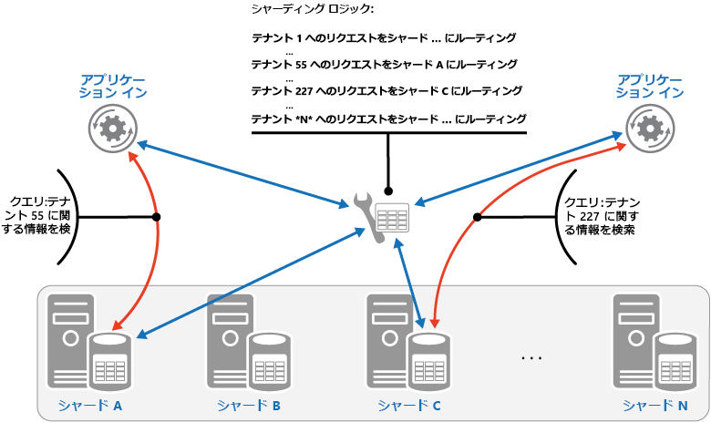

# <a name="sharding-pattern"></a><span data-ttu-id="98223-104">シャーディング パターン</span><span class="sxs-lookup"><span data-stu-id="98223-104">Sharding pattern</span></span>

[!INCLUDE [header](../_includes/header.md)]

<span data-ttu-id="98223-105">データ ストアを水平方向のパーティションまたはシャードのセットに分割します。</span><span class="sxs-lookup"><span data-stu-id="98223-105">Divide a data store into a set of horizontal partitions or shards.</span></span> <span data-ttu-id="98223-106">これにより、データを大量に保存したり、膨大なデータにアクセスするときのスケーラビリティを改善できます。</span><span class="sxs-lookup"><span data-stu-id="98223-106">This can improve scalability when storing and accessing large volumes of data.</span></span>

## <a name="context-and-problem"></a><span data-ttu-id="98223-107">コンテキストと問題</span><span class="sxs-lookup"><span data-stu-id="98223-107">Context and problem</span></span>

<span data-ttu-id="98223-108">データ ストアが1台のサーバーにホストされている場合、次の制限が適用される可能性があります。</span><span class="sxs-lookup"><span data-stu-id="98223-108">A data store hosted by a single server might be subject to the following limitations:</span></span>

- <span data-ttu-id="98223-109">**記憶域スペース**</span><span class="sxs-lookup"><span data-stu-id="98223-109">**Storage space**.</span></span> <span data-ttu-id="98223-110">大規模なクラウド アプリケーションのデータ ストアには膨大なデータが保存され、その量は時間の経過とともに増大することが想定されます。</span><span class="sxs-lookup"><span data-stu-id="98223-110">A data store for a large-scale cloud application is expected to contain a huge volume of data that could increase significantly over time.</span></span> <span data-ttu-id="98223-111">基本的にサーバーによって提供されるディスク記憶域には制限がありますが、データ量が増加するのに合わせて既存のディスクをより大型のディスクと置き換えたり、マシンにディスクをさらに追加したりできます。</span><span class="sxs-lookup"><span data-stu-id="98223-111">A server typically provides only a finite amount of disk storage, but you can replace existing disks with larger ones, or add further disks to a machine as data volumes grow.</span></span> <span data-ttu-id="98223-112">しかし、最終的にシステムはある制限に達し、使用しているサーバーでは簡単にこれ以上記憶域の容量を増やすことができなくなります。</span><span class="sxs-lookup"><span data-stu-id="98223-112">However, the system will eventually reach a limit where it isn't possible to easily increase the storage capacity on a given server.</span></span>

- <span data-ttu-id="98223-113">**コンピューティング リソース**</span><span class="sxs-lookup"><span data-stu-id="98223-113">**Computing resources**.</span></span> <span data-ttu-id="98223-114">クラウド アプリケーションでは、同時に多数のユーザーをサポートすることが要求され、こうしたユーザーは、データ ストアから情報を取得するクエリをそれぞれ実行します。</span><span class="sxs-lookup"><span data-stu-id="98223-114">A cloud application is required to support a large number of concurrent users, each of which run queries that retrieve information from the data store.</span></span> <span data-ttu-id="98223-115">データ ストアをホストするサーバーが 1 台しかない場合、サーバーはこうした負荷をサポートするために必要な処理能力を提供できず、その結果、データの保存や取得を試みたアプリケーションがタイムアウトして、ユーザーへの応答時間が遅くなったり、頻繁に障害が発生したりする可能性があります。メモリの追加やプロセッサのアップグレードが可能な場合もありますが、システムはいずれ限界に達し、コンピューティング リソースをそれ以上増加できなくなります。</span><span class="sxs-lookup"><span data-stu-id="98223-115">A single server hosting the data store might not be able to provide the necessary computing power to support this load, resulting in extended response times for users and frequent failures as applications attempting to store and retrieve data time out. It might be possible to add memory or upgrade processors, but the system will reach a limit when it isn't possible to increase the compute resources any further.</span></span>

- <span data-ttu-id="98223-116">**ネットワーク帯域幅**</span><span class="sxs-lookup"><span data-stu-id="98223-116">**Network bandwidth**.</span></span> <span data-ttu-id="98223-117">サーバー 1 台で動作しているデータ ストアのパフォーマンスは、リクエストを受信して応答を送信するサーバーのレートにより最終的に決定します。</span><span class="sxs-lookup"><span data-stu-id="98223-117">Ultimately, the performance of a data store running on a single server is governed by the rate the server can receive requests and send replies.</span></span> <span data-ttu-id="98223-118">ネットワーク トラフィックの量が、サーバーへの接続に使用するネットワークの容量を超える可能性もあり、その結果、リクエストに障害が発生します。</span><span class="sxs-lookup"><span data-stu-id="98223-118">It's possible that the volume of network traffic might exceed the capacity of the network used to connect to the server, resulting in failed requests.</span></span>

- <span data-ttu-id="98223-119">**地理的な場所**</span><span class="sxs-lookup"><span data-stu-id="98223-119">**Geography**.</span></span> <span data-ttu-id="98223-120">ある特定のユーザーが生成したデータを、同じリージョン内に格納する必要がある場合があります。これは、法律、法令遵守、パフォーマンスに関する理由、またはデータ アクセスの待ち時間を減らすためです。</span><span class="sxs-lookup"><span data-stu-id="98223-120">It might be necessary to store data generated by specific users in the same region as those users for legal, compliance, or performance reasons, or to reduce latency of data access.</span></span> <span data-ttu-id="98223-121">ユーザーが異なる国や地域にわたって分散しており、アプリケーションが単一のデータ ストアにしかない場合には、データ全体を保存できない可能性があります。</span><span class="sxs-lookup"><span data-stu-id="98223-121">If the users are dispersed across different countries or regions, it might not be possible to store the entire data for the application in a single data store.</span></span>

<span data-ttu-id="98223-122">ディスク容量、処理能力、メモリ、ネットワーク接続をさらに追加して垂直にスケールすることで、こうした制限がもたらす影響の発生を遅らせることができますが、これは一時的な解決策にしかならない可能性があります。</span><span class="sxs-lookup"><span data-stu-id="98223-122">Scaling vertically by adding more disk capacity, processing power, memory, and network connections can postpone the effects of some of these limitations, but it's likely to only be a temporary solution.</span></span> <span data-ttu-id="98223-123">多数のユーザーと膨大なデータをサポートできる商用クラウド アプリケーションは、ほぼ無制限にスケールできることになっているため、垂直にスケールすることは必ずしも最適な解決策ではありません。</span><span class="sxs-lookup"><span data-stu-id="98223-123">A commercial cloud application capable of supporting large numbers of users and high volumes of data must be able to scale almost indefinitely, so vertical scaling isn't necessarily the best solution.</span></span>

## <a name="solution"></a><span data-ttu-id="98223-124">解決策</span><span class="sxs-lookup"><span data-stu-id="98223-124">Solution</span></span>

<span data-ttu-id="98223-125">データ ストアを水平方向のパーティションやシャードに分割します。</span><span class="sxs-lookup"><span data-stu-id="98223-125">Divide the data store into horizontal partitions or shards.</span></span> <span data-ttu-id="98223-126">各シャードにはスキーマがありますが、それぞれ特定のデータのサブセットを保持しています。</span><span class="sxs-lookup"><span data-stu-id="98223-126">Each shard has the same schema, but holds its own distinct subset of the data.</span></span> <span data-ttu-id="98223-127">シャードは、自身の権限を持つデータ ストア (異なる種類の多数のエンティティのデータを格納できます) で、ストレージ ノードとして機能するサーバー上で動作します。</span><span class="sxs-lookup"><span data-stu-id="98223-127">A shard is a data store in its own right (it can contain the data for many entities of different types), running on a server acting as a storage node.</span></span>

<span data-ttu-id="98223-128">このパターンには次のような利点があります。</span><span class="sxs-lookup"><span data-stu-id="98223-128">This pattern has the following benefits:</span></span>

- <span data-ttu-id="98223-129">別のストレージ ノード上で動作するシャードをさらに追加して、システムをスケールアウトすることができます。</span><span class="sxs-lookup"><span data-stu-id="98223-129">You can scale the system out by adding further shards running on additional storage nodes.</span></span>

- <span data-ttu-id="98223-130">システムには、各ストレージ ノード専用の高価なコンピューターではなく、既製品のハードウェアを使用できます。</span><span class="sxs-lookup"><span data-stu-id="98223-130">A system can use off-the-shelf hardware rather than specialized and expensive computers for each storage node.</span></span>

- <span data-ttu-id="98223-131">シャード間の作業負荷を分散させることにより、競合を少なくし、パフォーマンスを向上させることができます。</span><span class="sxs-lookup"><span data-stu-id="98223-131">You can reduce contention and improve performance by balancing the workload across shards.</span></span>

- <span data-ttu-id="98223-132">クラウドでは、データにアクセスするユーザーに対して物理的に近い距離にシャードを配置できます。</span><span class="sxs-lookup"><span data-stu-id="98223-132">In the cloud, shards can be located physically close to the users that'll access the data.</span></span>

<span data-ttu-id="98223-133">データ ストアをシャーディングするときには、どのデータを各シャードに配置するかを決定します。</span><span class="sxs-lookup"><span data-stu-id="98223-133">When dividing a data store up into shards, decide which data should be placed in each shard.</span></span> <span data-ttu-id="98223-134">通常、シャードには、複数のデータ属性により決定された特定の範囲に該当する項目が含まれます。</span><span class="sxs-lookup"><span data-stu-id="98223-134">A shard typically contains items that fall within a specified range determined by one or more attributes of the data.</span></span> <span data-ttu-id="98223-135">こうした属性により、シャード キー (パーティション キーとも呼ばれます) が設定されます。</span><span class="sxs-lookup"><span data-stu-id="98223-135">These attributes form the shard key (sometimes referred to as the partition key).</span></span> <span data-ttu-id="98223-136">シャード キーは、静的である必要があります。</span><span class="sxs-lookup"><span data-stu-id="98223-136">The shard key should be static.</span></span> <span data-ttu-id="98223-137">変更の可能性があるデータに基づくことはできません。</span><span class="sxs-lookup"><span data-stu-id="98223-137">It shouldn't be based on data that might change.</span></span>

<span data-ttu-id="98223-138">シャーディングにより、データは物理的に整理されます。</span><span class="sxs-lookup"><span data-stu-id="98223-138">Sharding physically organizes the data.</span></span> <span data-ttu-id="98223-139">アプリケーションがデータを格納したり取得したりするときに、シャーディングのロジックにより、アプリケーションは適切なシャードへ割り当てられます。</span><span class="sxs-lookup"><span data-stu-id="98223-139">When an application stores and retrieves data, the sharding logic directs the application to the appropriate shard.</span></span> <span data-ttu-id="98223-140">このシャーディングのロジックは、アプリケーションのデータ アクセス コードの一部、またはデータ記憶域システムが透過的にシャーディングをサポートする場合には、そのシステムによって実装できます。</span><span class="sxs-lookup"><span data-stu-id="98223-140">This sharding logic can be implemented as part of the data access code in the application, or it could be implemented by the data storage system if it transparently supports sharding.</span></span>

<span data-ttu-id="98223-141">シャーディングのロジックでデータの物理的な場所をあいまいにすることで、シャードへのデータ保存先に対して高度に制御できます。</span><span class="sxs-lookup"><span data-stu-id="98223-141">Abstracting the physical location of the data in the sharding logic provides a high level of control over which shards contain which data.</span></span> <span data-ttu-id="98223-142">また、シャードの負荷が不均一であるために後からシャードの分散を設定しなおす必要がある場合には、ビジネス ロジックを再度やり直すことなくシャード間でのデータ移行が可能になります。</span><span class="sxs-lookup"><span data-stu-id="98223-142">It also enables data to migrate between shards without reworking the business logic of an application if the data in the shards need to be redistributed later (for example, if the shards become unbalanced).</span></span> <span data-ttu-id="98223-143">トレードオフは、各データを取得するときに、その保存先を決める上でデータ アクセスのオーバーヘッドがさらに発生することです。</span><span class="sxs-lookup"><span data-stu-id="98223-143">The tradeoff is the additional data access overhead required in determining the location of each data item as it's retrieved.</span></span>

<span data-ttu-id="98223-144">最適なパフォーマンスとスケーラビリティを確保するためには、アプリケーションが実行するクエリのタイプに適した方法でデータを分割することが重要です。</span><span class="sxs-lookup"><span data-stu-id="98223-144">To ensure optimal performance and scalability, it's important to split the data in a way that's appropriate for the types of queries that the application performs.</span></span> <span data-ttu-id="98223-145">ほとんどの場合、シャーディング スキームが各クエリの要件と完全に一致することはありません。</span><span class="sxs-lookup"><span data-stu-id="98223-145">In many cases, it's unlikely that the sharding scheme will exactly match the requirements of every query.</span></span> <span data-ttu-id="98223-146">たとえば、マルチ テナント システムでアプリケーションがテナント データを取得するときに、テナント ID を使用するだけでなく、テナントの名前や場所といった他の属性にも基づいてこのデータを検索しなければならない場合があります。</span><span class="sxs-lookup"><span data-stu-id="98223-146">For example, in a multi-tenant system an application might need to retrieve tenant data using the tenant ID, but it might also need to look up this data based on some other attribute such as the tenant’s name or location.</span></span> <span data-ttu-id="98223-147">このような状況を処理するためには、最も頻繁に実行されるクエリをサポートするシャード キーを使用した、シャーディング戦略を実装します。</span><span class="sxs-lookup"><span data-stu-id="98223-147">To handle these situations, implement a sharding strategy with a shard key that supports the most commonly performed queries.</span></span>

<span data-ttu-id="98223-148">属性値の組み合わせを使用してクエリが頻繁にデータを取得する場合には、属性値をリンクすることで複合のシャード キーを定義できる可能性があります。</span><span class="sxs-lookup"><span data-stu-id="98223-148">If queries regularly retrieve data using a combination of attribute values, you can likely define a composite shard key by linking attributes together.</span></span> <span data-ttu-id="98223-149">または、[インデックス テーブル](index-table.md)といったパターンを使用して、シャード キーが対応していない属性に基づいたデータで検索を高速に行うことができます。</span><span class="sxs-lookup"><span data-stu-id="98223-149">Alternatively, use a pattern such as [Index Table](index-table.md) to provide fast lookup to data based on attributes that aren't covered by the shard key.</span></span>

## <a name="sharding-strategies"></a><span data-ttu-id="98223-150">シャーディング戦略</span><span class="sxs-lookup"><span data-stu-id="98223-150">Sharding strategies</span></span>

<span data-ttu-id="98223-151">シャードを選択しデータを分配する方法を決定する場合に、3 つの戦略がよく使用されます。</span><span class="sxs-lookup"><span data-stu-id="98223-151">Three strategies are commonly used when selecting the shard key and deciding how to distribute data across shards.</span></span> <span data-ttu-id="98223-152">シャードとそれをホストするサーバーが 1 対 1 で対応していなければならないわけではありません。&mdash;サーバー 1 台で複数のシャードをホストできます。</span><span class="sxs-lookup"><span data-stu-id="98223-152">Note that there doesn't have to be a one-to-one correspondence between shards and the servers that host them&mdash;a single server can host multiple shards.</span></span> <span data-ttu-id="98223-153">戦略は次のとおりです。</span><span class="sxs-lookup"><span data-stu-id="98223-153">The strategies are:</span></span>

<span data-ttu-id="98223-154">**Lookup 戦略**</span><span class="sxs-lookup"><span data-stu-id="98223-154">**The Lookup strategy**.</span></span> <span data-ttu-id="98223-155">この戦略では、シャード キーを使用して、データのリクエストをそのデータが格納されたシャードまでルーティングするマップが、シャーディング ロジックによって実装されます。</span><span class="sxs-lookup"><span data-stu-id="98223-155">In this strategy the sharding logic implements a map that routes a request for data to the shard that contains that data using the shard key.</span></span> <span data-ttu-id="98223-156">マルチ テナント アプリケーションでは、テナント ID をシャード キーとして、あるテナントのデータすべてがひとつのシャードにまとめて格納されている可能性があります。</span><span class="sxs-lookup"><span data-stu-id="98223-156">In a multi-tenant application all the data for a tenant might be stored together in a shard using the tenant ID as the shard key.</span></span> <span data-ttu-id="98223-157">複数のテナントで同じシャードを共有する可能性はありますが、1 つのテナントのデータが複数のシャードにまたがることはありません。</span><span class="sxs-lookup"><span data-stu-id="98223-157">Multiple tenants might share the same shard, but the data for a single tenant won't be spread across multiple shards.</span></span> <span data-ttu-id="98223-158">この図表は、テナント ID によるテナント データのシャーディングを示しています。</span><span class="sxs-lookup"><span data-stu-id="98223-158">The figure illustrates sharding tenant data based on tenant IDs.</span></span>

   


   <span data-ttu-id="98223-160">シャード キーと物理的な保存スペースのマッピングは、各シャード キーが物理的なパーティションに対しマッピングされている物理的なシャードによる場合があります。</span><span class="sxs-lookup"><span data-stu-id="98223-160">The mapping between the shard key and the physical storage can be based on physical shards where each shard key maps to a physical partition.</span></span> <span data-ttu-id="98223-161">または、より柔軟にシャードの負荷を分散する方法として、仮想パーティション分割があります。この方法では、シャード キーは同じ数の仮想シャードにマッピングされ、その結果マッピングされる物理パーティションの数が少なくなります。</span><span class="sxs-lookup"><span data-stu-id="98223-161">Alternatively, a more flexible technique for rebalancing shards is virtual partitioning, where shard keys map to the same number of virtual shards, which in turn map to fewer physical partitions.</span></span> <span data-ttu-id="98223-162">このアプローチでは、仮想シャードを参照するシャード キーを使用してアプリケーションがデータを配置し、システムが透過的に仮想シャードを物理パーティションにマッピングします。</span><span class="sxs-lookup"><span data-stu-id="98223-162">In this approach, an application locates data using a shard key that refers to a virtual shard, and the system transparently maps virtual shards to physical partitions.</span></span> <span data-ttu-id="98223-163">仮想シャードと物理パーティションのマッピングは、アプリケーション コードを修正して異なるシャード キーを使用しなくても変更できます。</span><span class="sxs-lookup"><span data-stu-id="98223-163">The mapping between a virtual shard and a physical partition can change without requiring the application code be modified to use a different set of shard keys.</span></span>

<span data-ttu-id="98223-164">**範囲戦略**</span><span class="sxs-lookup"><span data-stu-id="98223-164">**The Range strategy**.</span></span> <span data-ttu-id="98223-165">この方法では、関連するアイテムが同じシャードにまとめられ、アイテムはシャード キー順に整列されます。&mdash;シャード キーは、順番になっています。</span><span class="sxs-lookup"><span data-stu-id="98223-165">This strategy groups related items together in the same shard, and orders them by shard key&mdash;the shard keys are sequential.</span></span> <span data-ttu-id="98223-166">範囲クエリ (ある範囲に該当するシャード キーに対してデータ項目を返すクエリ) を使用して、項目を頻繁に取得するアプリケーションにおいて便利な方法です。</span><span class="sxs-lookup"><span data-stu-id="98223-166">It's useful for applications that frequently retrieve sets of items using range queries (queries that return a set of data items for a shard key that falls within a given range).</span></span> <span data-ttu-id="98223-167">たとえば、ある月に発生した注文をすべてアプリケーションが定期的に検索しなければならない場合に、月の注文がすべて同じシャード内に日時順で格納されていれば、より迅速にデータを取得できます。</span><span class="sxs-lookup"><span data-stu-id="98223-167">For example, if an application regularly needs to find all orders placed in a given month, this data can be retrieved more quickly if all orders for a month are stored in date and time order in the same shard.</span></span> <span data-ttu-id="98223-168">各注文が異なるシャードに保存されていると、膨大な数のポイント クエリ (1 つのデータ項目を返すクエリ) を実行して個別に取得しなければなりません。</span><span class="sxs-lookup"><span data-stu-id="98223-168">If each order was stored in a different shard, they'd have to be fetched individually by performing a large number of point queries (queries that return a single data item).</span></span> <span data-ttu-id="98223-169">次の図表は、順番に並んだデータセット (範囲) をシャードに保存する状態を示しています。</span><span class="sxs-lookup"><span data-stu-id="98223-169">The next figure illustrates storing sequential sets (ranges) of data in shard.</span></span>

   

<span data-ttu-id="98223-171">この例でのシャード キーは、注文月そして注文日時の順に、最上位要素としている複合キーです。</span><span class="sxs-lookup"><span data-stu-id="98223-171">In this example, the shard key is a composite key containing the order month as the most significant element, followed by the order day and the time.</span></span> <span data-ttu-id="98223-172">新しい注文が作成されシャードに追加されると、注文データは自然に並べ替えられます。</span><span class="sxs-lookup"><span data-stu-id="98223-172">The data for orders is naturally sorted when new orders are created and added to a shard.</span></span> <span data-ttu-id="98223-173">一部のデータ ストアでは、2 つのパートから成るシャード キーをサポートしており、このキーにはシャードを識別するパーティション キー要素と、シャード内のアイテムを一意に識別する行キーが含まれています。</span><span class="sxs-lookup"><span data-stu-id="98223-173">Some data stores support two-part shard keys containing a partition key element that identifies the shard and a row key that uniquely identifies an item in the shard.</span></span> <span data-ttu-id="98223-174">データは通常、シャードで行キーの順番に保持されています。</span><span class="sxs-lookup"><span data-stu-id="98223-174">Data is usually held in row key order in the shard.</span></span> <span data-ttu-id="98223-175">範囲クエリの対象でグループ化される必要のある項目は、パーティション キーに対して同じ値を持ち、行キーに対して一意の値を持つシャード キーを使用できます。</span><span class="sxs-lookup"><span data-stu-id="98223-175">Items that are subject to range queries and need to be grouped together can use a shard key that has the same value for the partition key but a unique value for the row key.</span></span>

<span data-ttu-id="98223-176">**ハッシュ戦略**</span><span class="sxs-lookup"><span data-stu-id="98223-176">**The Hash strategy**.</span></span> <span data-ttu-id="98223-177">この戦略の目的は、ホットスポット (過剰な負荷を受けるシャード) の可能性を減らすことです。</span><span class="sxs-lookup"><span data-stu-id="98223-177">The purpose of this strategy is to reduce the chance of hotspots (shards that receive a disproportionate amount of load).</span></span> <span data-ttu-id="98223-178">各シャードのサイズとシャードに対する平均負荷でバランスを取るように、シャード間でデータが分散されます。</span><span class="sxs-lookup"><span data-stu-id="98223-178">It distributes the data across the shards in a way that achieves a balance between the size of each shard and the average load that each shard will encounter.</span></span> <span data-ttu-id="98223-179">シャーディング ロジックにより、1 つ以上のデータの属性のハッシュに基づいて、項目をシャードに格納するよう計算されます。</span><span class="sxs-lookup"><span data-stu-id="98223-179">The sharding logic computes the shard to store an item in based on a hash of one or more attributes of the data.</span></span> <span data-ttu-id="98223-180">選択されたハッシュ関数により、ランダムな要素を計算に導入することで、データはシャード間で均等に分配されます。</span><span class="sxs-lookup"><span data-stu-id="98223-180">The chosen hashing function should distribute data evenly across the shards, possibly by introducing some random element into the computation.</span></span> <span data-ttu-id="98223-181">次の図表は、テナント ID のハッシュに基づいたテナント データのシャーディングを示しています。</span><span class="sxs-lookup"><span data-stu-id="98223-181">The next figure illustrates sharding tenant data based on a hash of tenant IDs.</span></span>

   

<span data-ttu-id="98223-183">ハッシュ戦略がその他のシャーディング戦略より優れている点を理解するには、新しいテナントを順番に登録するマルチ テナント アプリケーションがどのようにテナントをデータ ストアのシャードに割り当てる可能性があるかを考えてください。</span><span class="sxs-lookup"><span data-stu-id="98223-183">To understand the advantage of the Hash strategy over other sharding strategies, consider how a multi-tenant application that enrolls new tenants sequentially might assign the tenants to shards in the data store.</span></span> <span data-ttu-id="98223-184">範囲戦略では、テナント 1 から n のデータはすべてシャード A に、テナント (n+1) のデータはすべてシャード B にといったように格納されます。</span><span class="sxs-lookup"><span data-stu-id="98223-184">When using the Range strategy, the data for tenants 1 to n will all be stored in shard A, the data for tenants n+1 to m will all be stored in shard B, and so on.</span></span> <span data-ttu-id="98223-185">最後に登録したテナントが最もアクティブな場合、多くのデータ操作は少ない数のシャードで行われることとなり、ホット スポットの原因となる可能性があります。</span><span class="sxs-lookup"><span data-stu-id="98223-185">If the most recently registered tenants are also the most active, most data activity will occur in a small number of shards, which could cause hotspots.</span></span> <span data-ttu-id="98223-186">一方ハッシュ戦略では、テナントはテナント ID のハッシュに基づいてシャードに割り当てられます。</span><span class="sxs-lookup"><span data-stu-id="98223-186">In contrast, the Hash strategy allocates tenants to shards based on a hash of their tenant ID.</span></span> <span data-ttu-id="98223-187">これにより、順に並んだテナント同士は別々のシャードに割り当てられる可能性が最も高く、負荷がシャード間で分散されます。</span><span class="sxs-lookup"><span data-stu-id="98223-187">This means that sequential tenants are most likely to be allocated to different shards, which will distribute the load across them.</span></span> <span data-ttu-id="98223-188">前の図表は、テナント 55 と 56 についてこれを示しています。</span><span class="sxs-lookup"><span data-stu-id="98223-188">The previous figure shows this for tenants 55 and 56.</span></span>

<span data-ttu-id="98223-189">3 つのシャーディング戦略の利点と注意点は、次のとおりです。</span><span class="sxs-lookup"><span data-stu-id="98223-189">The three sharding strategies have the following advantages and considerations:</span></span>

- <span data-ttu-id="98223-190">**Lookup**</span><span class="sxs-lookup"><span data-stu-id="98223-190">**Lookup**.</span></span> <span data-ttu-id="98223-191">この方法では、シャードの構成と使用方法について詳細に制御できます。</span><span class="sxs-lookup"><span data-stu-id="98223-191">This offers more control over the way that shards are configured and used.</span></span> <span data-ttu-id="98223-192">仮想シャードを使用すると、新しい物理パーティションが追加して負荷を均等するため、負荷を調整するときの影響を抑えることができます。</span><span class="sxs-lookup"><span data-stu-id="98223-192">Using virtual shards reduces the impact when rebalancing data because new physical partitions can be added to even out the workload.</span></span> <span data-ttu-id="98223-193">仮想シャードとシャードを実装する物理パーティション間のマッピングは、データの格納や取得にシャード キーを使用するアプリケーション コードに影響を与えずに変更できます。</span><span class="sxs-lookup"><span data-stu-id="98223-193">The mapping between a virtual shard and the physical partitions that implement the shard can be modified without affecting application code that uses a shard key to store and retrieve data.</span></span> <span data-ttu-id="98223-194">シャードの場所を検索すると、追加のオーバーヘッドが適用される場合があります。</span><span class="sxs-lookup"><span data-stu-id="98223-194">Looking up shard locations can impose an additional overhead.</span></span>

- <span data-ttu-id="98223-195">**範囲**</span><span class="sxs-lookup"><span data-stu-id="98223-195">**Range**.</span></span> <span data-ttu-id="98223-196">これは簡単に実装でき、1 回の操作で 1 つのシャードから複数のデータ項目を取得できることが多いため、範囲クエリに適しています。</span><span class="sxs-lookup"><span data-stu-id="98223-196">This is easy to implement and works well with range queries because they can often fetch multiple data items from a single shard in a single operation.</span></span> <span data-ttu-id="98223-197">この戦略を採用すると、データ管理がより容易になります。</span><span class="sxs-lookup"><span data-stu-id="98223-197">This strategy offers easier data management.</span></span> <span data-ttu-id="98223-198">たとえば、同じリージョン内のユーザーが同じシャードにある場合、その地域の負荷や要求パターンに基づいて、各タイム ゾーンで更新プログラムをスケジュールできます。</span><span class="sxs-lookup"><span data-stu-id="98223-198">For example, if users in the same region are in the same shard, updates can be scheduled in each time zone based on the local load and demand pattern.</span></span> <span data-ttu-id="98223-199">ただし、この戦略では、シャード間での分散は最適化されません。</span><span class="sxs-lookup"><span data-stu-id="98223-199">However, this strategy doesn't provide optimal balancing between shards.</span></span> <span data-ttu-id="98223-200">シャードの再調整は難しく、アクティビティの大部分が隣接するシャード キーの場合、不均一な負荷の問題を解決できない可能性があります。</span><span class="sxs-lookup"><span data-stu-id="98223-200">Rebalancing shards is difficult and might not resolve the problem of uneven load if the majority of activity is for adjacent shard keys.</span></span>

- <span data-ttu-id="98223-201">**ハッシュ**</span><span class="sxs-lookup"><span data-stu-id="98223-201">**Hash**.</span></span> <span data-ttu-id="98223-202">この方法によって、データと負荷の配分がより均等になる可能性が高くなります。</span><span class="sxs-lookup"><span data-stu-id="98223-202">This strategy offers a better chance of more even data and load distribution.</span></span> <span data-ttu-id="98223-203">ハッシュ関数を使用して、直接ルーティングを要求できる可能性があります。</span><span class="sxs-lookup"><span data-stu-id="98223-203">Request routing can be accomplished directly by using the hash function.</span></span> <span data-ttu-id="98223-204">マップを管理する必要はありません。</span><span class="sxs-lookup"><span data-stu-id="98223-204">There's no need to maintain a map.</span></span> <span data-ttu-id="98223-205">ハッシュの計算により、オーバー ヘッドが追加される可能性があることにご注意ください。</span><span class="sxs-lookup"><span data-stu-id="98223-205">Note that computing the hash might impose an additional overhead.</span></span> <span data-ttu-id="98223-206">また、シャードを再調整することは困難です。</span><span class="sxs-lookup"><span data-stu-id="98223-206">Also, rebalancing shards is difficult.</span></span>

<span data-ttu-id="98223-207">最も一般的なシャーディング システムは上記のいずれかのアプローチを実装しますが、アプリケーションのビジネス要件とデータの使用状況のパターンも考慮する必要があります。</span><span class="sxs-lookup"><span data-stu-id="98223-207">Most common sharding systems implement one of the approaches described above, but you should also consider the business requirements of your applications and their patterns of data usage.</span></span> <span data-ttu-id="98223-208">たとえば、マルチ テナント アプリケーションでは</span><span class="sxs-lookup"><span data-stu-id="98223-208">For example, in a multi-tenant application:</span></span>

- <span data-ttu-id="98223-209">ワークロードに基づいてデータをシャーディングできます。</span><span class="sxs-lookup"><span data-stu-id="98223-209">You can shard data based on workload.</span></span> <span data-ttu-id="98223-210">変動が大きいテナントのデータを別のシャードに分離できる場合があります。</span><span class="sxs-lookup"><span data-stu-id="98223-210">You could segregate the data for highly volatile tenants in separate shards.</span></span> <span data-ttu-id="98223-211">その結果、その他のテナントに対するデータ アクセスの速度が向上する可能性があります。</span><span class="sxs-lookup"><span data-stu-id="98223-211">The speed of data access for other tenants might be improved as a result.</span></span>

- <span data-ttu-id="98223-212">テナントの場所に基づいてデータをシャーディングできます。</span><span class="sxs-lookup"><span data-stu-id="98223-212">You can shard data based on the location of tenants.</span></span> <span data-ttu-id="98223-213">特定の地理的リージョンにおけるテナントのデータをオフラインでバックアップとして取得し、その地域のオフピーク時間内にメンテナンスできます。この間に、他のリージョンのテナントのデータをオンラインにし、業務時間内にアクセスできるようにしておけます。</span><span class="sxs-lookup"><span data-stu-id="98223-213">You can take the data for tenants in a specific geographic region offline for backup and maintenance during off-peak hours in that region, while the data for tenants in other regions remains online and accessible during their business hours.</span></span>

- <span data-ttu-id="98223-214">重要なテナントは、高性能で軽負荷の独自のシャードに割り当てることができ、反対に重要度の低いテナントは、より密度と使用率の高いシャードを共有することができます。</span><span class="sxs-lookup"><span data-stu-id="98223-214">High-value tenants could be assigned their own private, high performing, lightly loaded shards, whereas lower-value tenants might be expected to share more densely-packed, busy shards.</span></span>

- <span data-ttu-id="98223-215">高度なデータの分離とプライバシーを必要とするテナントのデータは、完全に別のサーバーに格納できます。</span><span class="sxs-lookup"><span data-stu-id="98223-215">The data for tenants that need a high degree of data isolation and privacy can be stored on a completely separate server.</span></span>

## <a name="scaling-and-data-movement-operations"></a><span data-ttu-id="98223-216">スケーリングとデータ移動の操作</span><span class="sxs-lookup"><span data-stu-id="98223-216">Scaling and data movement operations</span></span>

<span data-ttu-id="98223-217">それぞれのシャーディング戦略は、スケールイン、スケールアウト、データ移動の管理と状態の維持において、それぞれ異なる機能と複雑性のレベルを含んでいます。</span><span class="sxs-lookup"><span data-stu-id="98223-217">Each of the sharding strategies implies different capabilities and levels of complexity for managing scale in, scale out, data movement, and maintaining state.</span></span>

<span data-ttu-id="98223-218">Lookup 戦略では、オンラインまたはオフライン問わずユーザー レベルでスケーリングとデータ移動を行うことができます。</span><span class="sxs-lookup"><span data-stu-id="98223-218">The Lookup strategy permits scaling and data movement operations to be carried out at the user level, either online or offline.</span></span> <span data-ttu-id="98223-219">このテクニックでは、一部またはすべてのユーザー アクティビティを中断し (オフピーク時)、データを新しい仮想パーティションまたは物理シャードに移動し、マッピングを変更して、このデータを保持するキャッシュを無効にするか、更新してから、ユーザー アクティビティの再開を許可します。</span><span class="sxs-lookup"><span data-stu-id="98223-219">The technique is to suspend some or all user activity (perhaps during off-peak periods), move the data to the new virtual partition or physical shard, change the mappings, invalidate or refresh any caches that hold this data, and then allow user activity to resume.</span></span> <span data-ttu-id="98223-220">ほとんどの場合、このタイプの操作は一元的に管理できます。</span><span class="sxs-lookup"><span data-stu-id="98223-220">Often this type of operation can be centrally managed.</span></span> <span data-ttu-id="98223-221">Lookup 戦略では、キャッシュ可能かつレプリカしやすい状態が必要です。</span><span class="sxs-lookup"><span data-stu-id="98223-221">The Lookup strategy requires state to be highly cacheable and replica friendly.</span></span>

<span data-ttu-id="98223-222">範囲戦略では、シャード全体でデータを分割したり統合したりする必要があるため、データ ストアの一部や全体がオフラインのときに実行する必要のあるスケーリングやデータ移動の操作に一部の制限がかかります。</span><span class="sxs-lookup"><span data-stu-id="98223-222">The Range strategy imposes some limitations on scaling and data movement operations, which must typically be carried out when a part or all of the data store is offline because the data must be split and merged across the shards.</span></span> <span data-ttu-id="98223-223">アクティビティの大半が隣接するシャード キーまたは同じ範囲内にあるデータの識別子の場合、シャードを再調整するためにデータを移動しても、不均一な負荷の問題を解決できない場合があります。</span><span class="sxs-lookup"><span data-stu-id="98223-223">Moving the data to rebalance shards might not resolve the problem of uneven load if the majority of activity is for adjacent shard keys or data identifiers that are within the same range.</span></span> <span data-ttu-id="98223-224">また、範囲戦略では範囲を物理パーティションにマップするために、一部の状態を保持しておく必要があることがあります。</span><span class="sxs-lookup"><span data-stu-id="98223-224">The Range strategy might also require some state to be maintained in order to map ranges to the physical partitions.</span></span>

<span data-ttu-id="98223-225">ハッシュ戦略では、パーティション キーがシャード キーまたはデータ識別子のハッシュであるため、スケーリングとデータ移動がさらに複雑になります。</span><span class="sxs-lookup"><span data-stu-id="98223-225">The Hash strategy makes scaling and data movement operations more complex because the partition keys are hashes of the shard keys or data identifiers.</span></span> <span data-ttu-id="98223-226">各シャードの新しい場所は、ハッシュ関数または正しいマッピングを提供するために修正された関数から特定する必要があります。</span><span class="sxs-lookup"><span data-stu-id="98223-226">The new location of each shard must be determined from the hash function, or the function modified to provide the correct mappings.</span></span> <span data-ttu-id="98223-227">ただし、ハッシュ戦略では、状態のメンテナンスは不要です。</span><span class="sxs-lookup"><span data-stu-id="98223-227">However, the Hash strategy doesn't require maintenance of state.</span></span>

## <a name="issues-and-considerations"></a><span data-ttu-id="98223-228">問題と注意事項</span><span class="sxs-lookup"><span data-stu-id="98223-228">Issues and considerations</span></span>

<span data-ttu-id="98223-229">このパターンの実装方法を決めるときには、以下の点に注意してください。</span><span class="sxs-lookup"><span data-stu-id="98223-229">Consider the following points when deciding how to implement this pattern:</span></span>

- <span data-ttu-id="98223-230">シャーディングは、垂直的パーティション分割や機能的パーティション分割といったパーティション分割の他の形式を補完するものです。</span><span class="sxs-lookup"><span data-stu-id="98223-230">Sharding is complementary to other forms of partitioning, such as vertical partitioning and functional partitioning.</span></span> <span data-ttu-id="98223-231">たとえば、1 つのシャードに垂直方向にパーティション分割されているエンティティを含めたり、機能パーティションを複数のシャードとして実装したりできます。</span><span class="sxs-lookup"><span data-stu-id="98223-231">For example, a single shard can contain entities that have been partitioned vertically, and a functional partition can be implemented as multiple shards.</span></span> <span data-ttu-id="98223-232">パーティション分割の詳細については、「[データのパーティション分割のガイダンス](https://msdn.microsoft.com/library/dn589795.aspx)」をご覧ください。</span><span class="sxs-lookup"><span data-stu-id="98223-232">For more information about partitioning, see the [Data Partitioning Guidance](https://msdn.microsoft.com/library/dn589795.aspx).</span></span>

- <span data-ttu-id="98223-233">I/O の同様のボリュームを処理するために分散されたシャードを保持します。</span><span class="sxs-lookup"><span data-stu-id="98223-233">Keep shards balanced so they all handle a similar volume of I/O.</span></span> <span data-ttu-id="98223-234">データの挿入や削除に際し、シャードを定期的に再調整して、均等な配分を保証し、ホットスポットの可能性を軽減する必要があります。</span><span class="sxs-lookup"><span data-stu-id="98223-234">As data is inserted and deleted, it's necessary to periodically rebalance the shards to guarantee an even distribution and to reduce the chance of hotspots.</span></span> <span data-ttu-id="98223-235">再調整はコストのかかる操作です。</span><span class="sxs-lookup"><span data-stu-id="98223-235">Rebalancing can be an expensive operation.</span></span> <span data-ttu-id="98223-236">再調整の必要性を減らすには、予想されるボリュームの変化に対応できるよう各シャードに十分な空き領域を持たせ、拡張に備えます。</span><span class="sxs-lookup"><span data-stu-id="98223-236">To reduce the necessity of rebalancing, plan for growth by ensuring that each shard contains sufficient free space to handle the expected volume of changes.</span></span> <span data-ttu-id="98223-237">再調整が必要になったときに備えて、迅速にシャードを再調整するための戦略とスクリプトを作成しておくことも必要です。</span><span class="sxs-lookup"><span data-stu-id="98223-237">You should also develop strategies and scripts you can use to quickly rebalance shards if this becomes necessary.</span></span>

- <span data-ttu-id="98223-238">シャード キーには安定したデータを使用します。</span><span class="sxs-lookup"><span data-stu-id="98223-238">Use stable data for the shard key.</span></span> <span data-ttu-id="98223-239">シャード キーが変更された場合は、対応するデータ項目をシャード間で移動する必要が生じ、更新作業が増える場合があります。</span><span class="sxs-lookup"><span data-stu-id="98223-239">If the shard key changes, the corresponding data item might have to move between shards, increasing the amount of work performed by update operations.</span></span> <span data-ttu-id="98223-240">このため、不安定な情報に基づいてシャードを作成しないようにします。</span><span class="sxs-lookup"><span data-stu-id="98223-240">For this reason, avoid basing the shard key on potentially volatile information.</span></span> <span data-ttu-id="98223-241">代わりに、バリアントではない、または自然にキーを形成する属性を探します。</span><span class="sxs-lookup"><span data-stu-id="98223-241">Instead, look for attributes that are invariant or that naturally form a key.</span></span>

- <span data-ttu-id="98223-242">シャード キーは必ず一意である必要があります。</span><span class="sxs-lookup"><span data-stu-id="98223-242">Ensure that shard keys are unique.</span></span> <span data-ttu-id="98223-243">たとえば、自動増分されるフィールドをシャード キーとして使用しないでください。</span><span class="sxs-lookup"><span data-stu-id="98223-243">For example, avoid using autoincrementing fields as the shard key.</span></span> <span data-ttu-id="98223-244">一部のシステムでは、自動増分されるフィールドをシャード全体で調整することができないため、異なるシャードに同じシャード キーがあるという状態になる場合があります。</span><span class="sxs-lookup"><span data-stu-id="98223-244">Is some systems, autoincremented fields can't be coordinated across shards, possibly resulting in items in different shards having the same shard key.</span></span>

    >  <span data-ttu-id="98223-245">シャード キー以外でも、他のフィールドで自動増分される値がある場合は問題の原因となることがあります。</span><span class="sxs-lookup"><span data-stu-id="98223-245">Autoincremented values in other fields that are not shard keys can also cause problems.</span></span> <span data-ttu-id="98223-246">たとえば、自動増分されるフィールドを使って一意の ID を作成した場合、異なるシャード内の異なる 2 つのアイテムに、同じ ID が割り当てられる可能性があります。</span><span class="sxs-lookup"><span data-stu-id="98223-246">For example, if you use autoincremented fields to generate unique IDs, then two different items located in different shards might be assigned the same ID.</span></span>

- <span data-ttu-id="98223-247">データに対するすべてのクエリの要件に一致するシャード キーを設計できない可能性があります。</span><span class="sxs-lookup"><span data-stu-id="98223-247">It might not be possible to design a shard key that matches the requirements of every possible query against the data.</span></span> <span data-ttu-id="98223-248">データをシャーディングして最も頻繁に実行されるクエリに対応し、必要に応じてセカンダリのインデックス テーブルを作成して、シャード キーの一部ではない属性に基づいた条件を使ってデータを取得するクエリをサポートします。</span><span class="sxs-lookup"><span data-stu-id="98223-248">Shard the data to support the most frequently performed queries, and if necessary create secondary index tables to support queries that retrieve data using criteria based on attributes that aren't part of the shard key.</span></span> <span data-ttu-id="98223-249">詳細については、「[Index Table Pattern (インデックス テーブル パターン)](index-table.md)」をご覧ください。</span><span class="sxs-lookup"><span data-stu-id="98223-249">For more information, see the [Index Table pattern](index-table.md).</span></span>

- <span data-ttu-id="98223-250">1 つのシャードのみにアクセスするクエリは、複数のシャードからデータを取得するクエリよりも効率的であるため、アプリケーションが別のシャードにあるデータを結合するような大量のクエリを実行することになるシャーディング システムは実施しないようにします。</span><span class="sxs-lookup"><span data-stu-id="98223-250">Queries that access only a single shard are more efficient than those that retrieve data from multiple shards, so avoid implementing a sharding system that results in applications performing large numbers of queries that join data held in different shards.</span></span> <span data-ttu-id="98223-251">1 つのシャードには、複数のエンティティ タイプを含めることができます。</span><span class="sxs-lookup"><span data-stu-id="98223-251">Remember that a single shard can contain the data for multiple types of entities.</span></span> <span data-ttu-id="98223-252">データを非正規化して、同時に照会されることの多い、関連するエンティティ (顧客やその注文の詳細など) を同じシャードに維持することで、アプリケーションが実行する個別の読み取り数を減らします。</span><span class="sxs-lookup"><span data-stu-id="98223-252">Consider denormalizing your data to keep related entities that are commonly queried together (such as the details of customers and the orders that they have placed) in the same shard to reduce the number of separate reads that an application performs.</span></span>

    >  <span data-ttu-id="98223-253">1 つのシャード内のエンティティが別のシャードにあるエンティティを参照する場合、2 つ目のエンティティのシャード キーを、1 つ目のエンティティのスキーマの一部に含めます。</span><span class="sxs-lookup"><span data-stu-id="98223-253">If an entity in one shard references an entity stored in another shard, include the shard key for the second entity as part of the schema for the first entity.</span></span> <span data-ttu-id="98223-254">これは、シャード間で関連するデータを参照するクエリのパフォーマンス向上に役立ちます。</span><span class="sxs-lookup"><span data-stu-id="98223-254">This can help to improve the performance of queries that reference related data across shards.</span></span>

- <span data-ttu-id="98223-255">アプリケーションが複数のシャードからデータを取得するクエリを実行する必要がある場合は、並列タスクを使用してこのデータを取得できる場合があります。</span><span class="sxs-lookup"><span data-stu-id="98223-255">If an application must perform queries that retrieve data from multiple shards, it might be possible to fetch this data by using parallel tasks.</span></span> <span data-ttu-id="98223-256">例として、複数のシャードからのデータを並列で取得し、1 つの結果に集計するファンアウト クエリなどがあります。</span><span class="sxs-lookup"><span data-stu-id="98223-256">Examples include fan-out queries, where data from multiple shards is retrieved in parallel and then aggregated into a single result.</span></span> <span data-ttu-id="98223-257">ただし、この方法では必然的にソリューションのデータ アクセス ロジックが複雑化します。</span><span class="sxs-lookup"><span data-stu-id="98223-257">However, this approach inevitably adds some complexity to the data access logic of a solution.</span></span>

- <span data-ttu-id="98223-258">多くのアプリケーションでは、小さなシャードを多数作成する方が、負荷分散のチャンスが増加するため、大きなシャードを少数持つよりも効果的になります。</span><span class="sxs-lookup"><span data-stu-id="98223-258">For many applications, creating a larger number of small shards can be more efficient than having a small number of large shards because they can offer increased opportunities for load balancing.</span></span> <span data-ttu-id="98223-259">これは、シャードを物理的な場所から別の場所に移行させる予定がある場合に特に便利です。</span><span class="sxs-lookup"><span data-stu-id="98223-259">This can also be useful if you anticipate the need to migrate shards from one physical location to another.</span></span> <span data-ttu-id="98223-260">シャードの移動は、大きいよりも小さいほうが早く行えます。</span><span class="sxs-lookup"><span data-stu-id="98223-260">Moving a small shard is quicker than moving a large one.</span></span>

- <span data-ttu-id="98223-261">各シャード ストレージ ノードで利用できるリソースが、データ サイズとスループットの観点で拡張性の要件を満たすことを確認します。</span><span class="sxs-lookup"><span data-stu-id="98223-261">Make sure the resources available to each shard storage node are sufficient to handle the scalability requirements in terms of data size and throughput.</span></span> <span data-ttu-id="98223-262">詳細については、「[データのパーティション分割ガイダンス](https://msdn.microsoft.com/library/dn589795.aspx)」の「拡張性の観点でのパーティション分割の設計」セクションをご覧ください。</span><span class="sxs-lookup"><span data-stu-id="98223-262">For more information, see the section “Designing Partitions for Scalability” in the [Data Partitioning Guidance](https://msdn.microsoft.com/library/dn589795.aspx).</span></span>

- <span data-ttu-id="98223-263">すべてのシャードへの参照データのレプリケーションをご検討ください。</span><span class="sxs-lookup"><span data-stu-id="98223-263">Consider replicating reference data to all shards.</span></span> <span data-ttu-id="98223-264">シャードからデータを取得する操作で、同じクエリの一部として静的データまたは低速データも参照する場合は、このデータをシャードに追加します。</span><span class="sxs-lookup"><span data-stu-id="98223-264">If an operation that retrieves data from a shard also references static or slow-moving data as part of the same query, add this data to the shard.</span></span> <span data-ttu-id="98223-265">そうすれば、アプリケーションが別のデータ ストアにラウンド トリップすることなくクエリのすべてのデータを簡単に取得できるようになります。</span><span class="sxs-lookup"><span data-stu-id="98223-265">The application can then fetch all of the data for the query easily, without having to make an additional round trip to a separate data store.</span></span>

    >  <span data-ttu-id="98223-266">複数のシャードにある参照データが変更された場合、システムはその変更点をすべてのシャードで同期する必要があります。</span><span class="sxs-lookup"><span data-stu-id="98223-266">If reference data held in multiple shards changes, the system must synchronize these changes across all shards.</span></span> <span data-ttu-id="98223-267">この同期処理中に、ある程度の不整合が発生することがあります。</span><span class="sxs-lookup"><span data-stu-id="98223-267">The system can experience a degree of inconsistency while this synchronization occurs.</span></span> <span data-ttu-id="98223-268">この操作を行う場合は、それを処理できるアプリケーションを設計する必要があります。</span><span class="sxs-lookup"><span data-stu-id="98223-268">If you do this, you should design your applications to be able to handle it.</span></span>

- <span data-ttu-id="98223-269">参照の整合性とシャード間の一貫性を維持するのは難しいため、複数のシャードのデータに影響を与える操作は最小限に抑える必要があります。</span><span class="sxs-lookup"><span data-stu-id="98223-269">It can be difficult to maintain referential integrity and consistency between shards, so you should minimize operations that affect data in multiple shards.</span></span> <span data-ttu-id="98223-270">アプリケーションでシャード間のデータを修正する必要がある場合は、完全なデータの整合性が必要かどうかを評価します。</span><span class="sxs-lookup"><span data-stu-id="98223-270">If an application must modify data across shards, evaluate whether complete data consistency is actually required.</span></span> <span data-ttu-id="98223-271">クラウドでの一般的な手法では、強力な整合性の代わりに、結果整合性を実装します。</span><span class="sxs-lookup"><span data-stu-id="98223-271">Instead, a common approach in the cloud is to implement eventual consistency.</span></span> <span data-ttu-id="98223-272">各パーティションのデータは個別に更新され、アプリケーションのロジックですべての更新が正常に完了したことを確認する必要があります。また、結果整合性の操作が実行している間、データをクエリすることにより発生する可能性のある不整合を処理することができます。</span><span class="sxs-lookup"><span data-stu-id="98223-272">The data in each partition is updated separately, and the application logic must take responsibility for ensuring that the updates all complete successfully, as well as handling the inconsistencies that can arise from querying data while an eventually consistent operation is running.</span></span> <span data-ttu-id="98223-273">結果整合性を実装する方法の詳細については、「[Data consistency primer (データ整合性入門)](https://msdn.microsoft.com/library/dn589800.aspx)」をご覧ください。</span><span class="sxs-lookup"><span data-stu-id="98223-273">For more information about implementing eventual consistency, see the [Data Consistency Primer](https://msdn.microsoft.com/library/dn589800.aspx).</span></span>

- <span data-ttu-id="98223-274">多数のシャードの構成と管理は難しい作業です。</span><span class="sxs-lookup"><span data-stu-id="98223-274">Configuring and managing a large number of shards can be a challenge.</span></span> <span data-ttu-id="98223-275">監視、バックアップ、一貫性のチェック、ログ記録、監査などのタスクは、複数のシャード、サーバー、場合によっては複数の場所で実施する必要があります。</span><span class="sxs-lookup"><span data-stu-id="98223-275">Tasks such as monitoring, backing up, checking for consistency, and logging or auditing must be accomplished on multiple shards and servers, possibly held in multiple locations.</span></span> <span data-ttu-id="98223-276">これらのタスクはスクリプトや他の自動化ソリューションを使用して実施されることがよくありますが、それでも追加の管理要件が必要になる場合があります。</span><span class="sxs-lookup"><span data-stu-id="98223-276">These tasks are likely to be implemented using scripts or other automation solutions, but that might not completely eliminate the additional administrative requirements.</span></span>

- <span data-ttu-id="98223-277">シャードに含まれるデータを、それを使用するアプリケーションのインスタンスの近くに置くことができます。</span><span class="sxs-lookup"><span data-stu-id="98223-277">Shards can be geolocated so that the data that they contain is close to the instances of an application that use it.</span></span> <span data-ttu-id="98223-278">この方法によってパフォーマンスを大幅に向上させることができますが、異なる場所にある複数のシャードにアクセスする必要のあるタスクの場合、考慮すべき点もあります。</span><span class="sxs-lookup"><span data-stu-id="98223-278">This approach can considerably improve performance, but requires additional consideration for tasks that must access multiple shards in different locations.</span></span>

## <a name="when-to-use-this-pattern"></a><span data-ttu-id="98223-279">このパターンを使用する状況</span><span class="sxs-lookup"><span data-stu-id="98223-279">When to use this pattern</span></span>

<span data-ttu-id="98223-280">データ ストアを 1 つのストレージ ノードで利用できるリソースの範囲を超えて拡張する必要がある場合、またはデータ ストア内の競合を減らすことでパフォーマンスを向上させる場合に、このパターンを使用します。</span><span class="sxs-lookup"><span data-stu-id="98223-280">Use this pattern when a data store is likely to need to scale beyond the resources available to a single storage node, or to improve performance by reducing contention in a data store.</span></span>

>  <span data-ttu-id="98223-281">シャーディングの主な目的は、パフォーマンスとシステムのスケーラビリティを向上させることですが、同時に、データがどのように別のパーティションに分けられるかによって可用性も改善される場合があります。</span><span class="sxs-lookup"><span data-stu-id="98223-281">The primary focus of sharding is to improve the performance and scalability of a system, but as a by-product it can also improve availability due to how the data is divided into separate partitions.</span></span> <span data-ttu-id="98223-282">1 つのパーティションで障害が起こったとしても、アプリケーションから他のパーティションにあるデータには問題なくアクセスできる場合があり、すべてのデータをアクセス不可にすることなく、1 つまたは複数のパーティションのメンテナンスやリカバリを実行できます。</span><span class="sxs-lookup"><span data-stu-id="98223-282">A failure in one partition doesn't necessarily prevent an application from accessing data held in other partitions, and an operator can perform maintenance or recovery of one or more partitions without making the entire data for an application inaccessible.</span></span> <span data-ttu-id="98223-283">詳細については、「[データのパーティション分割のガイダンス](https://msdn.microsoft.com/library/dn589795.aspx)」をご覧ください。</span><span class="sxs-lookup"><span data-stu-id="98223-283">For more information, see the [Data Partitioning Guidance](https://msdn.microsoft.com/library/dn589795.aspx).</span></span>

## <a name="example"></a><span data-ttu-id="98223-284">例</span><span class="sxs-lookup"><span data-stu-id="98223-284">Example</span></span>

<span data-ttu-id="98223-285">次の C# の例では、SQL Server データベースのセットをシャードとして使用しています。</span><span class="sxs-lookup"><span data-stu-id="98223-285">The following example in C# uses a set of SQL Server databases acting as shards.</span></span> <span data-ttu-id="98223-286">各データベースには、アプリケーションによって使用されるデータのサブセットがあります。</span><span class="sxs-lookup"><span data-stu-id="98223-286">Each database holds a subset of the data used by an application.</span></span> <span data-ttu-id="98223-287">アプリケーションは、独自のシャーディング ロジック (ここではファンアウト クエリ) を使用してシャード全体に分散するデータを取得します。</span><span class="sxs-lookup"><span data-stu-id="98223-287">The application retrieves data that's distributed across the shards using its own sharding logic (this is an example of a fan-out query).</span></span> <span data-ttu-id="98223-288">各シャードに配置されているデータの詳細は、`GetShards` のメソッドで返されます。</span><span class="sxs-lookup"><span data-stu-id="98223-288">The details of the data that's located in each shard is returned by a method called `GetShards`.</span></span> <span data-ttu-id="98223-289">このメソッドでは、列挙可能な `ShardInformation` オブジェクトの一覧を返し、`ShardInformation` 型にはシャードへの接続時にアプリケーションで使用する各シャードの識別子と SQL Server の接続文字列が含まれます (接続文字列はコード サンプルに表示されていません)。</span><span class="sxs-lookup"><span data-stu-id="98223-289">This method returns an enumerable list of `ShardInformation` objects, where the `ShardInformation` type contains an identifier for each shard and the SQL Server connection string that an application should use to connect to the shard (the connection strings aren't shown in the code example).</span></span>

```csharp
private IEnumerable<ShardInformation> GetShards()
{
  // This retrieves the connection information from a shard store
  // (commonly a root database).
  return new[]
  {
    new ShardInformation
    {
      Id = 1,
      ConnectionString = ...
    },
    new ShardInformation
    {
      Id = 2,
      ConnectionString = ...
    }
  };
}
```

<span data-ttu-id="98223-290">次のコードは、アプリケーションが `ShardInformation` オブジェクトの一覧を使用してクエリを実行し、各シャードから平行してデータを取得する方法を示しています。</span><span class="sxs-lookup"><span data-stu-id="98223-290">The code below shows how the application uses the list of `ShardInformation` objects to perform a query that fetches data from each shard in parallel.</span></span> <span data-ttu-id="98223-291">クエリの詳細は表示されていませんが、この例では取得したデータに顧客名などの情報 (シャードに顧客の詳細が含まれている場合) を含む文字列が含まれています。</span><span class="sxs-lookup"><span data-stu-id="98223-291">The details of the query aren't shown, but in this example the data that's retrieved contains a string that could hold information such as the name of a customer if the shards contain the details of customers.</span></span> <span data-ttu-id="98223-292">結果は、アプリケーションによって処理される `ConcurrentBag` コレクションに集計されます。</span><span class="sxs-lookup"><span data-stu-id="98223-292">The results are aggregated into a `ConcurrentBag` collection for processing by the application.</span></span>

```csharp
// Retrieve the shards as a ShardInformation[] instance.
var shards = GetShards();

var results = new ConcurrentBag<string>();

// Execute the query against each shard in the shard list.
// This list would typically be retrieved from configuration
// or from a root/master shard store.
Parallel.ForEach(shards, shard =>
{
  // NOTE: Transient fault handling isn't included,
  // but should be incorporated when used in a real world application.
  using (var con = new SqlConnection(shard.ConnectionString))
  {
    con.Open();
    var cmd = new SqlCommand("SELECT ... FROM ...", con);

    Trace.TraceInformation("Executing command against shard: {0}", shard.Id);

    var reader = cmd.ExecuteReader();
    // Read the results in to a thread-safe data structure.
    while (reader.Read())
    {
      results.Add(reader.GetString(0));
    }
  }
});

Trace.TraceInformation("Fanout query complete - Record Count: {0}",
                        results.Count);
```

## <a name="related-patterns-and-guidance"></a><span data-ttu-id="98223-293">関連のあるパターンとガイダンス</span><span class="sxs-lookup"><span data-stu-id="98223-293">Related patterns and guidance</span></span>

<span data-ttu-id="98223-294">このパターンを実装する場合は、次のパターンとガイダンスも関連している可能性があります。</span><span class="sxs-lookup"><span data-stu-id="98223-294">The following patterns and guidance might also be relevant when implementing this pattern:</span></span>
- <span data-ttu-id="98223-295">[Data consistency primer (データ整合性入門)](https://msdn.microsoft.com/library/dn589800.aspx)。</span><span class="sxs-lookup"><span data-stu-id="98223-295">[Data Consistency Primer](https://msdn.microsoft.com/library/dn589800.aspx).</span></span> <span data-ttu-id="98223-296">異なるシャード間に分散したデータの一貫性を維持する必要がある場合があります。</span><span class="sxs-lookup"><span data-stu-id="98223-296">It might be necessary to maintain consistency for data distributed across different shards.</span></span> <span data-ttu-id="98223-297">分散型データの一貫性の維持にまつわる問題と、異なる一貫性モデルのメリットとトレードオフについて説明します。</span><span class="sxs-lookup"><span data-stu-id="98223-297">Summarizes the issues surrounding maintaining consistency over distributed data, and describes the benefits and tradeoffs of different consistency models.</span></span>
- <span data-ttu-id="98223-298">[データのパーティション分割のガイダンス](https://msdn.microsoft.com/library/dn589795.aspx)。</span><span class="sxs-lookup"><span data-stu-id="98223-298">[Data Partitioning Guidance](https://msdn.microsoft.com/library/dn589795.aspx).</span></span> <span data-ttu-id="98223-299">データ ストアのシャーディングでは、新しい問題が発生する場合があります。</span><span class="sxs-lookup"><span data-stu-id="98223-299">Sharding a data store can introduce a range of additional issues.</span></span> <span data-ttu-id="98223-300">スケーラビリティの向上、競合の削減、パフォーマンスの最適化のため、クラウドのデータ ストアのパーティション分割に関する問題について説明します。</span><span class="sxs-lookup"><span data-stu-id="98223-300">Describes these issues in relation to partitioning data stores in the cloud to improve scalability, reduce contention, and optimize performance.</span></span>
- <span data-ttu-id="98223-301">[Index Table Pattern (インデックス テーブル パターン)](index-table.md)。</span><span class="sxs-lookup"><span data-stu-id="98223-301">[Index Table pattern](index-table.md).</span></span> <span data-ttu-id="98223-302">場合によっては、シャード キーの設計だけでクエリを完全にサポートできないことがあります。</span><span class="sxs-lookup"><span data-stu-id="98223-302">Sometimes it isn't possible to completely support queries just through the design of the shard key.</span></span> <span data-ttu-id="98223-303">シャード キー以外のキーを指定して、アプリケーションが大規模なデータ ストアからデータを簡単に取得できるようにします。</span><span class="sxs-lookup"><span data-stu-id="98223-303">Enables an application to quickly retrieve data from a large data store by specifying a key other than the shard key.</span></span>
- <span data-ttu-id="98223-304">[Materialized View Pattern (具体化されたビュー パターン)](materialized-view.md)</span><span class="sxs-lookup"><span data-stu-id="98223-304">[Materialized View pattern](materialized-view.md).</span></span> <span data-ttu-id="98223-305">クエリ操作のパフォーマンスを維持するには、特に、サマリー データがシャード全体に分散された情報に基づいている場合は、データを集計、要約する具体化されたビューを作成すると便利です。</span><span class="sxs-lookup"><span data-stu-id="98223-305">To maintain the performance of some query operations, it's useful to create materialized views that aggregate and summarize data, especially if this summary data is based on information that's distributed across shards.</span></span> <span data-ttu-id="98223-306">これらのビューの生成、作成方法について説明します。</span><span class="sxs-lookup"><span data-stu-id="98223-306">Describes how to generate and populate these views.</span></span>
- <span data-ttu-id="98223-307">[シャード レッスン](http://www.addsimplicity.com/adding_simplicity_an_engi/2008/08/shard-lessons.html): Adding Simplicity ブログ。</span><span class="sxs-lookup"><span data-stu-id="98223-307">[Shard Lessons](http://www.addsimplicity.com/adding_simplicity_an_engi/2008/08/shard-lessons.html) on the Adding Simplicity blog.</span></span>
- <span data-ttu-id="98223-308">[データベースのシャーディング](http://dbshards.com/database-sharding/): CodeFutures web サイト。</span><span class="sxs-lookup"><span data-stu-id="98223-308">[Database Sharding](http://dbshards.com/database-sharding/) on the CodeFutures web site.</span></span>
- <span data-ttu-id="98223-309">[スケーラビリティ戦略の概要: データベース シャーディング](http://blog.maxindelicato.com/2008/12/scalability-strategies-primer-database-sharding.html): Max Indelicato のブログ。</span><span class="sxs-lookup"><span data-stu-id="98223-309">[Scalability Strategies Primer: Database Sharding](http://blog.maxindelicato.com/2008/12/scalability-strategies-primer-database-sharding.html) on Max Indelicato's blog.</span></span>
- <span data-ttu-id="98223-310">[スケーラブルなデータベースの構築: データベース シャーディング スキームの長所と短所](http://www.25hoursaday.com/weblog/2009/01/16/BuildingScalableDatabasesProsAndConsOfVariousDatabaseShardingSchemes.aspx): Dare Obasanjo のブログ。</span><span class="sxs-lookup"><span data-stu-id="98223-310">[Building Scalable Databases: Pros and Cons of Various Database Sharding Schemes](http://www.25hoursaday.com/weblog/2009/01/16/BuildingScalableDatabasesProsAndConsOfVariousDatabaseShardingSchemes.aspx) on Dare Obasanjo's blog.</span></span>
