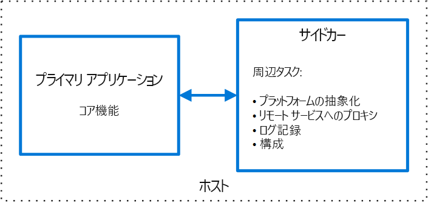

# サイドカー パターン

アプリケーションのコンポーネントを別のプロセスまたはコンテナーにデプロイして、分離性とカプセル化を実現します。 このパターンは、種類が異なるコンポーネントとテクノロジでアプリケーションを構成することも可能にします。

このパターンは、オートバイに取り付けられるサイドカーに似ているため、"*サイドカー*" と名付けられています。 このパターンでは、サイドカーは親アプリケーションに接続され、アプリケーションにサポート機能を提供します。 また、サイドカーは、親アプリケーションと同じライフ サイクルを共有し、親アプリケーションと共に作成され、終了します。 サイドカー パターンは、サイドキック パターンと呼ばれることもある分解パターンです。

## コンテキストと問題

多くの場合、アプリケーションとサービスは、監視、ログ記録、構成、ネットワーク サービスなどの関連する機能を必要とします。 これらの周辺タスクを、独立したコンポーネントまたはサービスとして実装できます。

コンポーネントまたはサービスをアプリケーションに緊密に統合すると、アプリケーションと同じプロセスで実行でき、共有リソースを効率的に使用できます。 ただし、緊密な結合は、十分に分離されていないことも意味し、あるコンポーネントで発生した障害が他のコンポーネントやアプリケーション全体に影響する可能性があります。 さらに、通常は、親アプリケーションと同じ言語を使用して実装する必要があります。 その結果、コンポーネントとアプリケーションは、密接に相互依存することになります。

アプリケーションを複数のサービスに分解すれば、各サービスを異なる言語とテクノロジを使用して構築できます。 これによって柔軟性は向上しますが、各コンポーネントが独自の依存関係を持つことになり、基になるプラットフォームと親アプリケーションと共有しているリソースにアクセスするには、言語固有のライブラリが必要であることを意味します。 さらに、これらの機能を独立したサービスとしてデプロイすると、アプリケーションに待ち時間が追加される可能性があります。 さらに、これらの言語固有のインターフェイスのコードと依存関係の管理が非常に複雑になる可能性があります。これは特にホスト、デプロイ、および管理に当てはまります。

## 解決策

まとまりのあるタスク セットをプライマリ アプリケーションと併置しますが、独自のプロセスまたはコンテナー内にセットを配置して、プラットフォーム サービス用の言語を越えた同種インターフェイスを実現します。

サイドカー サービスは、必ずアプリケーションの一部であるわけではありませんが、アプリケーションに接続されます。 サイドカー サービスは、常に親アプリケーションの傍に存在します。 サイドカーは、プライマリ アプリケーションと共にデプロイされるサポート プロセスまたはサービスです。 オートバイのサイドカーは、1 台のバイクに取り付けられ、オートバイはそれぞれ専用のサイドカーを持つことができます。 同じように、サイドカー サービスは、その親アプリケーションと運命を共にします。 アプリケーションの各インスタンスにサイドカー インスタンスがデプロイされ、一緒にホストされます。

サイドカー パターンを使用する利点は次のとおりです。

- サイドカーは、ランタイム環境とプログラミング言語に関してプライマリ アプリケーションから独立しているため、言語ごとにサイドカーを開発する必要はありません。

- サイドカーは、プライマリ アプリケーションと同じリソースにアクセスできます。 たとえば、サイドカーは、サイドカーとプライマリ アプリケーションの両方で使用されるシステム リソースを監視できます。

- プライマリ アプリケーションに近接しているため、通信時に有意な待ち時間は発生しません。

- 拡張メカニズムがないアプリケーションでも、サイドカーを 独自のプロセスとしてプライマリ アプリケーションと同じホストまたはサブコンテナーに接続することで、機能を拡張できます。

多くの場合、サイドカー パターンはコンテナーで使用され、サイドカー コンテナーまたはサイドキック コンテナーと呼ばれます。

## 問題と注意事項

- サービス、プロセス、またはコンテナーをデプロイするために使用するデプロイとパッケージの形式を検討します。 サイドカー パターンに特に適しているのはコンテナーです。
- サイドカー サービスを設計する際は、プロセス間通信メカニズムを慎重に決定します。 パフォーマンスの要件によって実現が難しい場合を除いて、言語またはフレームワークに依存しないテクノロジを使用するようにします。
- 機能をサイドカーに配置する前に、独立したサービスまたは従来のデーモンのほうがうまく動作するかどうかを検討します。
- さらに、機能をライブラリとして実装できるか、従来の拡張メカニズムを使用して実装できるかを検討します。 言語固有のライブラリのほうが、より深いレベルで統合され、ネットワークのオーバーヘッドが少ない場合があります。

## このパターンを使用する状況

このパターンは次の状況で使用します。

- プライマリ アプリケーションが、異なる種類の言語とフレームワークのセットを使用している。 サイドカー サービスに配置されるコンポーネントは、さまざまな言語で記述され、異なるフレームワークを使用しているアプリケーションによって使用できます。
- コンポーネントが、リモート チームまたは別の組織によって所有されている。
- コンポーネントまたは機能を、アプリケーションと同じホストに併置する必要がある。
- メイン アプリケーションの全体的なライフ サイクルを共有するが、別々に更新できるサービスが必要である。
- 特定のリソースまたはコンポーネントのリソース制限をきめ細かく制御する必要がある。 たとえば、特定のコンポーネントが使用するメモリの量を制限できます。 コンポーネントをサイドカーとしてデプロイし、メイン アプリケーションとは別にメモリ使用量を管理できます。

このパターンは、次の場合には適切でない可能性があります。

- プロセス間通信を最適化する必要がある。 親アプリケーションとサイドカー サービス間の通信には、オーバーヘッドが含まれています。大きいのは、呼び出し時の待ち時間です。 対話が多いインターフェイスでは、これは容認できるトレードオフではない可能性があります。
- 各インスタンスにサイドカー サービスをデプロイするリソース コストと分離によるメリットが釣り合わない小規模なアプリケーション。
- サービスのスケールをメイン アプリケーションとは異なるようにするか、メイン アプリケーションと無関係にスケーリングする必要がある。 この場合は、機能を別のサービスとしてデプロイするほうが適している可能性があります。

## 例

サイドカー パターンは多くのシナリオに適用できます。 一般的な例を次に示します。

- インフラストラクチャ API。 インフラストラクチャ開発チームは、インフラストラクチャにアクセスするための言語固有のクライアント ライブラリではなく、各アプリケーションと一緒にデプロイされるサービスを作成します。 サービスはサイドカーとして読み込まれ、ログ記録、環境データ、構成ストア、検出、正常性チェック、ウォッチドッグ サービスなどのインフラストラクチャ サービス用の共通層を提供します。 さらに、サイドカーは、親アプリケーションのホスト環境とプロセス (またはコンテナー) を監視し、情報を一元的なサービスに記録します。
- NGINX/HAProxy を管理する。 NGINX と環境の状態を監視するサイドカー サービスをデプロイした後、NGINX 構成ファイルを更新し、状態の変更が必要なときにプロセスをリサイクルします。
- アンバサダー サイドカー。 [アンバサダー](./ambassador.md) サービスをサイドカーとしてデプロイします。 アプリケーションは、要求のログ、ルーティング、回線切断、およびその他の接続関連の機能を処理するアンバサダーを介して呼び出しを行います。
- オフロード プロキシ。 node.js サービス インスタンスの前に NGINX プロキシを配置して、サービスの静的ファイルの内容を処理します。

## 関連するガイダンス

- [アンバサダー パターン](./ambassador.md)
