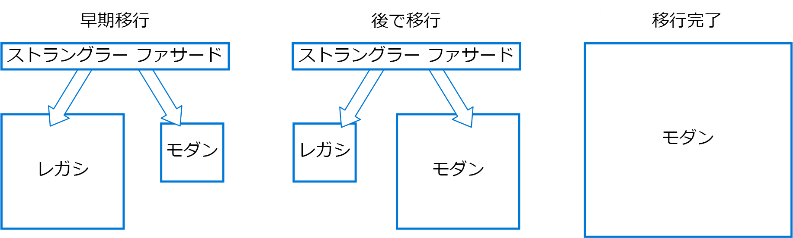

# ストラングラー パターンStrangler pattern

機能の特定の部分を新しいアプリケーションやサービスに徐々に置き換えることで、レガシ システムを段階的に移行します。Incrementally migrate a legacy system by gradually replacing specific pieces of functionality with new applications and services. レガシ システムからの機能が置き換えられていくと、新しいシステムは最終的に古いシステムの機能すべてを置き換え、古いシステムを抑圧して使用停止できるようにします。As features from the legacy system are replaced, the new system eventually replaces all of the old system's features, strangling the old system and allowing you to decommission it.

## コンテキストと問題Context and problem

システムが古くなるにつれ、このシステムが構築された開発ツール、ホスティング テクノロジ、システム アーキテクチャも徐々に使われなくなっていきます。As systems age, the development tools, hosting technology, and even system architectures they were built on can become increasingly obsolete. 新機能が追加されると、これらのアプリケーションも大幅に複雑化し、メンテナンスや新機能の追加が難しくなっていきます。As new features and functionality are added, the complexity of these applications can increase dramatically, making them harder to maintain or add new features to.

複雑なシステムを完全に置き換えるには、膨大な作業が発生することがあります。Completely replacing a complex system can be a huge undertaking. 多くの場合、まだ移行されていない機能を古いシステムで処理し続けながら、新しいシステムに段階的に移行する必要があります。Often, you will need a gradual migration to a new system, while keeping the old system to handle features that haven't been migrated yet. ただし、2 つの異なるバージョンのアプリケーションを実行している場合、クライアントが特定の機能の場所を把握している必要があることになります。However, running two separate versions of an application means that clients have to know where particular features are located. 機能またはサービスが移行されるたびに、クライアントを更新して、新しい場所が示されるようにする必要があります。Every time a feature or service is migrated, clients need to be updated to point to the new location.

## 解決策Solution

段階的に、機能の特定の部分を新しいアプリケーションやサービスに置き換えます。Incrementally replace specific pieces of functionality with new applications and services. バックエンド レガシ システムに送信される要求をインターセプトするファサードを作成します。Create a façade that intercepts requests going to the backend legacy system. ファサードは、これらの要求をレガシ アプリケーションまたは新しいサービスにルーティングします。The façade routes these requests either to the legacy application or the new services. 既存の機能は段階的に新しいシステムに移行でき、コンシューマーは、移行が行われていることに気付くことなく、同じインターフェイスを引き続き使用できます。Existing features can be migrated to the new system gradually, and consumers can continue using the same interface, unaware that any migration has taken place.

このパターンは、移行によるリスクを最小化し、長期にわたって開発を分散させるのに役立ちます。This pattern helps to minimize risk from the migration, and spread the development effort over time. ファサードを使用すると、ユーザーを正しいアプリケーションに安全にルーティングし、レガシ アプリケーションが引き続き機能するようにしながら、任意のペースで新しいシステムに機能を追加できます。With the façade safely routing users to the correct application, you can add functionality to the new system at whatever pace you like, while ensuring the legacy application continues to function. 時間の経過とともに、機能が新しいシステムに移行されると、レガシ システムは最終的に "抑圧" されて、必要なくなります。Over time, as features are migrated to the new system, the legacy system is eventually "strangled" and is no longer necessary. このプロセスが完了すると、レガシ システムを安全に廃止できます。Once this process is complete, the legacy system can safely be retired.

## 問題と注意事項Issues and considerations

- 新旧両方のシステムで使用される可能性のあるサービスとデータ ストアを処理する方法を検討してください。Consider how to handle services and data stores that are potentially used by both new and legacy systems. 両方が並列でこれらのリソースにアクセスできるようにしてください。Make sure both can access these resources side-by-side.
- 新しいアプリケーションおよびサービスを、これらのインターセプトと将来のストラングラー移行による置き換えが簡単になるように構成します。Structure new applications and services in a way that they can easily be intercepted and replaced in future strangler migrations.
- ある時点で、移行が完了すると、ストラングラー ファサードは消失するか、レガシ クライアントのアダプターに進化します。At some point, when the migration is complete, the strangler façade will either go away or evolve into an adaptor for legacy clients.
- ファサードが移行に対して古くならないようにしてください。Make sure the façade keeps up with the migration.
- ファサードが単一障害点やパフォーマンスのボトルネックとならないようにしてください。Make sure the façade doesn't become a single point of failure or a performance bottleneck.

## このパターンを使用する状況When to use this pattern

バックエンド アプリケーションを新しいアーキテクチャに段階的に移行する場合に、このパターンを使用します。Use this pattern when gradually migrating a back-end application to a new architecture.

このパターンは、次の場合には適切でない可能性があります。This pattern may not be suitable:

- バックエンド システムへの要求がインターセプトされない場合。When requests to the back-end system cannot be intercepted.
- システム全体の置き換えの複雑さが少ない、小規模なシステムの場合。For smaller systems where the complexity of wholesale replacement is low.

## 関連するガイダンスRelated guidance

- [StranglerApplication](https://www.martinfowler.com/bliki/StranglerApplication.html) に関する Martin Fowler のブログ記事Martin Fowler's blog post on [StranglerApplication](https://www.martinfowler.com/bliki/StranglerApplication.html)
