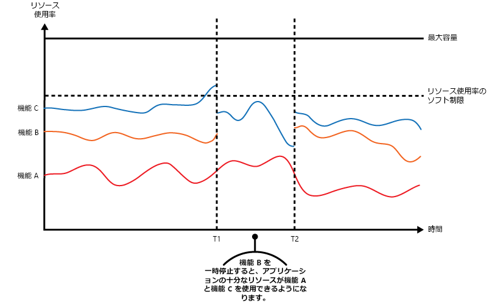
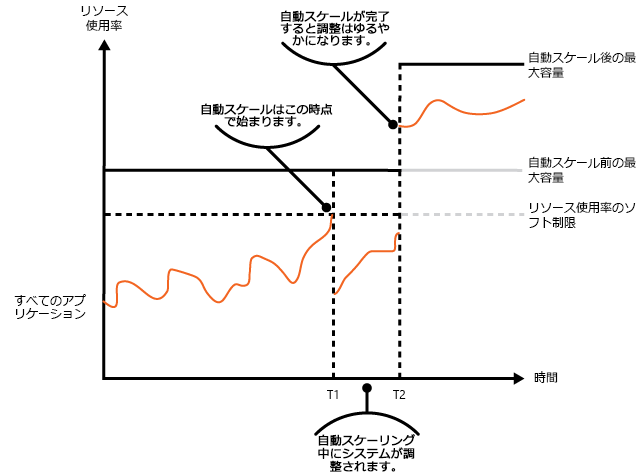
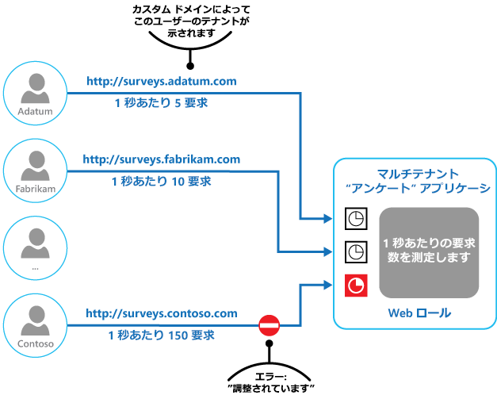

# 調整パターン

[!INCLUDE [header](../_includes/header.md)]

アプリケーションのインスタンス、個々のテナント、またはサービス全体によって使用されるリソースの使用量を制御します。 これによりシステムは、需要の増加に伴ってリソースに過度な負荷がかけられた場合でも正常な動作を継続し、サービス レベル アグリーメントに準拠することができます。

## コンテキストと問題

通常、クラウド アプリケーションにかかる負荷は、アクティブ ユーザー数、またはアクティブ ユーザーが実行しているアクティビティの種類に応じて、時間の経過とともに変化します。 たとえば、より多くのユーザーが業務時間中にアクティブになる可能性がある、あるいはシステム上で計算コストの高い分析を毎月月末に実行しなければならない可能性がある、などの場合です。 突然、予期せずアクティビティが急増することもあります。 システムの処理要件が使用可能なリソースの容量を超えると、パフォーマンスが低下することや、障害が発生することさえあり得ます。 そのシステムにおいて、契約したサービス レベルに準拠する必要がある場合は、そのような障害は許容できません。

クラウドには、アプリケーションのビジネス目標に応じて、変化する負荷に対応するための戦略が数多くあります。 戦略の 1 つは、自動スケールを使用して、プロビジョニング済みのリソースを特定の時点のユーザーのニーズに合わせることです。 これにより、ランニング コストを最適化しつつ、一貫してユーザーの要求に応えていくことが可能になります。 ただし、自動スケールはその他のリソースのプロビジョニングをトリガーできますが、このプロビジョニングは即時ではありません。 要求が急激に増加した場合、リソースが不足する期間が発生する可能性があります。

## 解決策

自動スケールに代わる戦略として、アプリケーションに上限までのリソースの使用を許可し、この上限に達したときに調整を行う方法があります。 使用量がしきい値を超えたときに 1 人または複数のユーザーの要求を制限できるよう、システムがリソースの使用状況を監視します。 これにより、システムは正常な動作を継続し、適用されるすべてのサービス レベル アグリーメント (SLA) に準拠することができます。 リソース使用状況の監視の詳細については、「[Instrumentation and Telemetry Guidance (インストルメンテーションとテレメトリに関するガイダンス)](https://msdn.microsoft.com/library/dn589775.aspx)」をご覧ください。

システムには次のような複数の調整戦略を実装できます。

- システムの API に指定した期間に 1 秒あたり n 回よりも多くアクセスした個人ユーザーからの要求を拒絶する。 これには、システムで各テナントのリソース使用量、またはアプリケーションを実行するユーザー数を測定することが必要です。 詳細については、「[Service Metering Guidance (サービスの測定に関するガイダンス)](https://msdn.microsoft.com/library/dn589796.aspx)」をご覧ください。

- 重要なサービスを十分なリソースで滞りなく実行できるよう、選択した重要でないサービスの機能を無効にする、または品質を下げる。 たとえば、アプリケーションでビデオ出力をストリーミングしている場合、低解像度に切り替えることができます。

- 負荷平準化によってアクティビティのボリュームを平準化する (このアプローチの詳細については、「[Queue-based Load Leveling pattern (キュー ベースの負荷平準化パターン)](./queue-based-load-leveling.md)」をご覧ください)。 マルチテナント環境では、このアプローチですべてのテナントのパフォーマンスを縮小します。 SLA の異なるテナントが混在している状態がシステムによってサポートされている必要があれば、高価値のテナントの作業を即時に実行することがあります。 その他のテナントの要求処理は差し止められ、バックログが収まった時点で処理されます。 このアプローチを導入しやすくするために、[優先順位キュー パターン](./priority-queue.md)を使用できます。

- 優先度の低いアプリケーションまたはテナントの代わりとして実行される操作を延期する。 システムがビジー状態であることと、その操作をあとで再試行すべきであることをテナントに知らせるために例外を生成して、操作を一時停止または制限できます。

次の図では、3 つの機能を使用しているアプリケーションの、リソース使用量 (メモリ、CPU、帯域幅などの要素の組み合わせ) の領域グラフを時系列で示しています。 1 つの機能は、特定のタスク セットを実行するコンポーネント、複雑な計算を実行する 1 つのコード、またはメモリ内キャッシュなどのサービスを提供する要素など、1 つの機能領域を示しています。 これらの機能に A、B、C という名前が付けられています。

> 機能の線のすぐ下の領域は、その機能が呼び出されたときにアプリケーションが使用するリソースを示しています。 たとえば、機能 A の線の下の領域は、機能 A を使用しているアプリケーションが使用するリソースを示しており、機能 A と機能 B の線の間にある領域は、機能 B を呼び出すアプリケーションが使用するリソースを示しています。各機能の領域の合計が、そのシステムが使用するリソースの総計です。

上の図では、操作を延期することによる効果を示しています。 時間 T1 の直前で、これらの機能を使用するすべてのアプリケーションに割り当てられたリソースの総計がしきい値 (リソース使用上限) に達しています。 この時点で、アプリケーションが使用可能なリソースを使い果たす危険性が生じます。 このシステムでは、機能 B は 機能 A や機能 C よりも重要ではないため一時的に無効化され、機能 B が使用していたリソースが解放されます。 時間 T1 と T2 の間では、機能 A と機能 C を使用しているアプリケーションが引き続き通常どおり実行されています。 最終的には、これら 2 つの機能のリソース使用量が機能 B をもう一度有効にするための十分な容量が確保される時点 (時間 T2) まで減少します。

自動スケールと調整のアプローチは、アプリケーションの応答性を保ち SLA に準拠させるために、組み合わせることも可能です。 需要が高いままになると予想される場合は、システムがスケールアウトしている間に、調整によって一時的な解決がなされます。この時点では、システムのすべての機能を復元できます。

次の図は、システムで実行しているすべてのアプリケーションが使用する全体的なリソース使用量の領域グラフを時系列で示しており、調整と自動スケールをどのように組み合わせることができるかを説明しています。

時間 T1 の時点で、リソース使用のソフト制限を指定するしきい値に達しています。 この時点で、システムはスケールアウトを開始できます。ただし、新しいリソースが使用できる状態になるのが間に合わなければ、既存のリソースを使い果たすか、システムに障害が発生する可能性があります。 この問題の発生を防ぐために、前述のとおりにシステムは一時的に調整されます。 自動スケールが完了してその他のリソースが使用可能になると、調整が緩和されます。

## 問題と注意事項

このパターンの実装方法を決めるときには、以下の点に注意してください。

- アプリケーションの調整 (およびその使用の戦略) は、システム設計の全体に影響を与えるアーキテクチャの決定です。 システムが実装されてしまうとあとから追加することが難しいため、アプリケーション設計の早い段階で調整について検討する必要があります。

- 調整は迅速に実行する必要があります。 システムは、アクティビティの増加を検出して、それに対応できる必要があります。 システムは、負荷が緩和されたらすぐ元の状態に戻ることができる必要もあります。 そのためには、適切なパフォーマンス データが継続的にキャプチャされ、監視されていることが必要です。

- サービスが一時的にユーザーの要求を拒否する必要がある場合、特定のエラー コードを返して、操作の実行が拒否されたのは調整のためだということを、クライアント アプリケーションが理解できるようにする必要があります。 クライアント アプリケーションは、要求を再試行するまでの間、待機することができます。

- システムが自動スケールしている間、一時的な措置として調整を使用することができます。 アクティビティの急増が突然で長くは続かないと予想される場合は、スケールにはかなりのランニング コストがかかるため、スケールするよりも単純に調整する方が良い場合があります。

- システムが自動スケールしている間に一時的な措置として調整を使用する場合、また、リソースの需要が急激に増加する場合は、調整モードで運用されていたとしても、システムの正常な動作を継続できない場合があります。 これを許容できない場合は、より大きな予備容量を維持することと、よりアグレッシブな自動スケールを構成することを検討してください。

## このパターンを使用する状況

このパターンは次の目的で使用します。

- システムが継続してサービス レベル アグリーメントに準拠するようにする。

- 単一のテナントが、アプリケーションによって提供されるリソースを占有することを防止する。

- アクティビティの急増に対応する。

- システムの正常な動作を継続するのに必要な、リソースの最大レベルを制限することで、システムのコスト最適化に役立てる。

## 例

最後の図は、マルチテナント システムで調整を実装する方法を示しています。 各テナント組織のユーザーが、クラウドでホストされているアプリケーションにアクセスし、アンケートに記入して送信します。 このアプリケーションには、これらのユーザーがアプリケーションに要求を送信する頻度を監視するインストルメンテーションが含まれています。

1 つのテナントのユーザーが、他のすべてのユーザーに対するアプリケーションの応答性と可用性に影響を与えることを防止するため、ユーザーが 1 つのテナントから送信できる 1 秒あたりの要求数を制限します。 このアプリケーションは、制限を超える要求をブロックします。

## 関連のあるパターンとガイダンス

このパターンを実装する場合は、次のパターンとガイダンスも関連している可能性があります。

- [Instrumentation and Telemetry Guidance (インストルメンテーションと製品利用統計情報のガイダンス)](https://msdn.microsoft.com/library/dn589775.aspx)。 調整は、サービスの使用頻度に関する情報をどれだけ収集できるかにかかっています。 カスタムの監視情報を生成してキャプチャする方法を説明します。
- [Service Metering Guidance (サービスの測定に関するガイダンス)](https://msdn.microsoft.com/library/dn589796.aspx)。 サービスの使用状況を理解するために、サービスの使用量を測定する方法を説明します。 この情報は、サービスを調整する方法を決めるのに役立ちます。
- [自動スケール ガイダンス](https://msdn.microsoft.com/library/dn589774.aspx)。 調整は、システムが自動スケールしている間に、またはシステムが自動スケールする必要をなくすために、暫定的な措置として使用されます。 自動スケール戦略に関する情報が含まれています。
- [キュー ベースの負荷平準化パターン](./queue-based-load-leveling.md)。 キュー ベースの負荷平準化は、調整を実装するためによく使用されるメカニズムです。 キューは、アプリケーションから送信された要求がサービスまで届く頻度を平準化するのに役立つバッファーとして機能します。
- [優先順位キュー パターン](./priority-queue.md)。 システムは、調整戦略の一部として優先順位キューを使用して、比較的重要ではないアプリケーションのパフォーマンスを低下させつつ、非常に重要な、または比較的高価値のアプリケーションのパフォーマンスを維持することができます。
