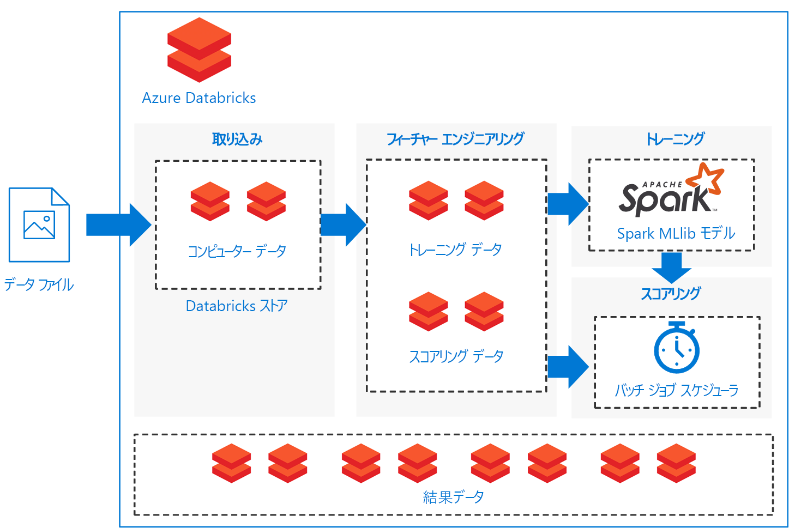

# Azure Databricks での Spark モデルのバッチ スコアリングBatch scoring of Spark models on Azure Databricks

この参照アーキテクチャでは、Azure 向けに最適化された Apache Spark ベースの分析プラットフォームである Azure Databricks を使用して、スケジュールに従って Apache Spark 分類モデルをバッチ スコアリングするスケーラブルなソリューションを構築する方法を示します。This reference architecture shows how to build a scalable solution for batch scoring an Apache Spark classification model on a schedule using Azure Databricks, an Apache Spark-based analytics platform optimized for Azure. このソリューションは、他のシナリオのために一般化できるテンプレートとして使用できます。The solution can be used as a template that can be generalized to other scenarios.

このアーキテクチャのリファレンス実装は、 [GitHub][github] で入手できます。A reference implementation for this architecture is available on [GitHub][github].

**シナリオ**: 資産が多い業界の企業が、予期しない機械の不具合に関連するコストとダウンタイムを最小化することを望んでいます。**Scenario**: A business in an asset-heavy industry wants to minimize the costs and downtime associated with unexpected mechanical failures. 機械から収集される IoT データを使用して、予知メンテナンス モデルを作成できます。Using IoT data collected from their machines, they can create a predictive maintenance model. 企業は、このモデルを使用して、部品を積極的に保守し、不具合が発生する前にそれらを修繕できます。This model enables the business to maintain components proactively and repair them before they fail. 機械部品を最大限使用できるようにすることで、コストを制御し、ダウンタイムを短縮できます。By maximizing mechanical component use, they can control costs and reduce downtime.

予知メンテナンス モデルでは、機械からデータが収集され、部品の不具合例の履歴が保持されます。A predictive maintenance model collects data from the machines and retains historical examples of component failures. その後、このモデルを使用して、部品の現在の状態を監視し、特定の部品で近い将来不具合が発生するかどうかを予測します。The model can then be used to monitor the current state of the components and predict if a given component will fail in the near future. 一般的なユース ケースとモデリング アプローチについては、「[予測メンテナンス ソリューションのための Azure AI ガイド][ai-guide]」をご覧ください。For common use cases and modeling approaches, see [Azure AI guide for predictive maintenance solutions][ai-guide].

この参照アーキテクチャは、機械部品の新しいデータの存在によってトリガーされるワークロード用に設計されています。This reference architecture is designed for workloads that are triggered by the presence of new data from the component machines. 処理には次の手順が含まれます。Processing involves the following steps:

1. 外部データ ストアから Azure Databricks データ ストアにデータを取り込みます。Ingest the data from the external data store onto an Azure Databricks data store.

2. データをトレーニング データセットに変換した後、Spark MLlib モデルを構築して、機械学習モデルをトレーニングします。Train a machine learning model by transforming the data into a training data set, then building a Spark MLlib model. MLlib は、最も一般的な機械学習アルゴリズムと、Spark のデータ スケーラビリティ機能を活用するように最適化されたユーティリティで構成されています。MLlib consists of most common machine learning algorithms and utilities optimized to take advantage of Spark data scalability capabilities.

3. データをスコアリング データセットに変換することで、部品の不具合を予測 (分類) するトレーニング済みモデルを適用します。Apply the trained model to predict (classify) component failures by transforming the data into a scoring data set. Spark MLLib モデルを使用してデータをスコア付けします。Score the data with the Spark MLLib model.

4. 処理後の使用のために、Databricks データ ストアに結果を格納します。Store results on the Databricks data store for post-processing consumption.

これらのタスクのそれぞれを実行するノートブックが  [GitHub][github] に提供されています。Notebooks are provided on [GitHub][github] to perform each of these tasks.

## アーキテクチャArchitecture

アーキテクチャでは、順を追って実行される一連の[ノートブック][notebooks]に基づく [Azure Databricks][databricks] の中にその全体が含まれるデータ フローが定義されます。The architecture defines a data flow that is entirely contained within [Azure Databricks][databricks] based on a set of sequentially executed [notebooks][notebooks]. これは、次のコンポーネントで構成されます。It consists of the following components:

**[データ ファイル][github]**。**[Data files][github]**. 参照実装では、5 つの静的なデータ ファイルに含まれているシミュレートされたデータ セットが使用されます。The reference implementation uses a simulated data set contained in five static data files.

**[取り込み][notebooks]**。**[Ingestion][notebooks]**. データ取り込みノートブックでは、入力データ ファイルを Databricks データ セットのコレクションにダウンロードします。The data ingestion notebook downloads the input data files into a collection of Databricks data sets. 現実のシナリオでは、IoT デバイスからのデータが、Databricks にアクセス可能なストレージ (Azure SQL Server や Azure Blob Storage など) にストリーミングされます。In a real-world scenario, data from IoT devices would stream onto Databricks-accessible storage such as Azure SQL Server or Azure Blob storage. Databricks では、複数の[データソース][data-sources]がサポートされています。Databricks supports multiple [data sources][data-sources].

**トレーニング パイプライン**。**Training pipeline**. このノートブックでは、取り込まれたデータから分析データ セットを作成する特徴エンジニアリング ノートブックが実行されます。This notebook executes the feature engineering notebook to create an analysis data set from the ingested data. その後、[Apache Spark MLlib][mllib] スケーラブル機械学習ライブラリを使用して機械学習モデルをトレーニングするモデル構築ノートブックが実行されます。It then executes a model building notebook that trains the machine learning model using the [Apache Spark MLlib][mllib] scalable machine learning library.

**スコアリング パイプライン**。**Scoring pipeline**. このノートブックでは、取り込まれたデータからスコアリング データ セットを作成する特徴エンジニアリング ノートブックが実行され、スコアリング ノートブックが実行されます。This notebook executes the feature engineering notebook to create scoring data set from the ingested data and executes the scoring notebook. スコアリング ノートブックでは、トレーニング済みの [Spark MLlib][mllib-spark] モデルを使用して、スコアリング データ セットの観測結果から予測が生成されます。The scoring notebook uses the trained [Spark MLlib][mllib-spark] model to generate predictions for the observations in the scoring data set. 予測は、結果ストアに格納され、Databricks データ ストアの新しいデータ セットになります。The predictions are stored in the results store, a new data set on the Databricks data store.

**スケジューラ**。**Scheduler**. スケジュールされた Databricks [ジョブ][job]によって、Spark モデルによるバッチ スコアリングが処理されます。A scheduled Databricks [job][job] handles batch scoring with the Spark model. このジョブでは、スコアリング パイプライン ノートブックが実行され、スコアリング データ セットを構築するための詳細と結果データ セットの格納場所を指定する変数の引数が、ノートブックのパラメーターを通して渡されます。The job executes the scoring pipeline notebook, passing variable arguments through notebook parameters to specify the details for constructing the scoring data set and where to store the results data set.

このシナリオは、パイプライン フローとして構築されます。The scenario is constructed as a pipeline flow. 各ノートブックは、操作 (取り込み、特徴エンジニアリング、モデルの構築、およびモデルのスコアリング) の各操作をバッチ設定で実行するように最適化されています。Each notebook is optimized to perform in a batch setting for each of the operations: ingestion, feature engineering, model building, and model scorings. これを実現するため、特徴エンジニアリング ノートブックは、トレーニング、較正、テスト、またはスコアリング操作のすべてにとって一般的なデータ セットを生成するように設計されています。To accomplish this, the feature engineering notebook is designed to generate a general data set for any of the training, calibration, testing, or scoring operations. このシナリオでは、これらの操作に対して一時分割戦略を使用するため、ノートブックのパラメーターを使用して日付範囲フィルターが設定されます。In this scenario, we use a temporal split strategy for these operations, so the notebook parameters are used to set date-range filtering.

このシナリオでは、バッチ パイプラインを作成しているため、パイプライン ノートブックの出力を調査するための一連の調査ノートブックがオプションとして用意されています。Because the scenario creates a batch pipeline, we provide a set of optional examination notebooks to explore the output of the pipeline notebooks. これらは、GitHub リポジトリで見つけることができます。You can find these in the GitHub repository:

- `1a_raw-data_exploring`
- `2a_feature_exploration`
- `2b_model_testing`
- `3b_model_scoring_evaluation`

## RecommendationsRecommendations

Databricks は、お客様がご自身でトレーニングしたモデルを読み込んでデプロイし、新しいデータを使用して予測を行えるようにセットアップされています。Databricks is set up so you can load and deploy your trained models to make predictions with new data. このシナリオで Databricks を使用したのは、次のような利点が追加されるためです。We used Databricks for this scenario because it provides these additional advantages:

- Azure Active Directory 資格情報を使用したシングル サインオンのサポート。Single sign-on support using Azure Active Directory credentials.
- 運用パイプライン用のジョブを実行するジョブ スケジューラ。Job scheduler to execute jobs for production pipelines.
- コラボレーション、ダッシュボード、REST API による完全対話型ノートブック。Fully interactive notebook with collaboration, dashboards, REST APIs.
- 任意のサイズにスケーリングできる制限のないクラスター。Unlimited clusters that can scale to any size.
- 高度なセキュリティ、ロールベースのアクセス制御、および監査ログ。Advanced security, role-based access controls, and audit logs.

Azure Databricks サービスを操作するには、Web ブラウザーまたは[コマンド ライン インターフェイス][cli] (CLI) で Databricks [ワークスペース][workspace] インターフェイスを使用します。To interact with the Azure Databricks service, use the Databricks [Workspace][workspace] interface in a web browser or the [command-line interface][cli] (CLI). Databricks CLI には、Python 2.7.9 から 3.6 をサポートするプラットフォームからアクセスします。Access the Databricks CLI from any platform that supports Python 2.7.9 to 3.6.

この参照実装では、[ノートブック][notebooks]を使用して、タスクを順を追って実行します。The reference implementation uses [notebooks][notebooks] to execute tasks in sequence. 各ノートブックでは、入力データと同じデータ ストアに、中間データ成果物 (トレーニング、テスト、スコアリング、または結果データ セット) が格納されます。Each notebook stores intermediate data artifacts (training, test, scoring, or results data sets) to the same data store as the input data. 目標は、お客様固有のユース ケースで、必要に応じて簡単に使用できるようにすることです。The goal is to make it easy for you to use it as needed in your particular use case. 実際には、お使いのデータ ソースをノートブックの Azure Databricks インスタンスに接続して、ストレージとの読み取りと書き込みを直接的に実行します。In practice, you would connect your data source to your Azure Databricks instance for the notebooks to read and write directly back into your storage.

必要に応じて、Databricks ユーザー インターフェイス、データ ストア、または Databricks [CLI][cli] を通してジョブの実行を監視できます。You can monitor job execution through the Databricks user interface, the data store, or the Databricks [CLI][cli] as necessary. Databricks が提供する[イベント ログ][log]やその他の[メトリック][metrics]を使用して、クラスターを監視します。Monitor the cluster using the [event log][log] and other [metrics][metrics] that Databricks provides.

## パフォーマンスに関する考慮事項Performance considerations

Azure Databricks クラスターは、既定で自動スケールが可能になっているため、実行時に Databricks によってお客様のジョブの特性を構成するワーカーが動的に再割り当てされます。An Azure Databricks cluster enables autoscaling by default so that during runtime, Databricks dynamically reallocates workers to account for the characteristics of your job. パイプラインの特定の部分で、その計算負荷が他の部分よりも高くなる場合があります。Certain parts of your pipeline may be more computationally demanding than others. Databricks では、ジョブのこれらのフェーズ中にワーカーが追加されます (不要になったときには削除されます)。Databricks adds additional workers during these phases of your job (and removes them when they’re no longer needed). ワークロードと一致するクラスターを自身でプロビジョニングする必要がないため、自動スケールによって高い[クラスター使用率][cluster]を簡単に達成できるようになります。Autoscaling makes it easier to achieve high [cluster utilization][cluster], because you don’t need to provision the cluster to match a workload.

さらに、[Azure Data Factory][adf] と Azure Databricks を使用して、さらに複雑なスケジュールのパイプラインを開発できます。Additionally, more complex scheduled pipelines can be developed by using [Azure Data Factory][adf] with Azure Databricks.

## ストレージに関する考慮事項Storage considerations

この参照実装では、単純化するために、データは Databricks ストレージ内に直接格納されます。In this reference implementation, the data is stored directly within Databricks storage for simplicity. ただし、運用環境の設定では、[Azure Blob Storage][blob] などのクラウド データ ストレージにデータを格納できます。In a production setting, however, the data can be stored on cloud data storage such as [Azure Blob Storage][blob]. [Databricks][databricks-connect] では、Azure Data Lake Store、Azure SQL Data Warehouse、Azure Cosmos DB、Apache Kafka、および Hadoop もサポートしています。[Databricks][databricks-connect] also supports Azure Data Lake Store, Azure SQL Data Warehouse, Azure Cosmos DB, Apache Kafka, and Hadoop.

## コストに関する考慮事項Cost considerations

Azure Databricks は、優れた Spark サービスであり、関連するコストがあります。Azure Databricks is a premium Spark offering with an associated cost. さらに、Databricks の[価格レベル][pricing]には、Standard と Premium があります。In addition, there are standard and premium Databricks [pricing tiers][pricing].

このシナリオでは、Standard 価格レベルで十分です。For this scenario, the standard pricing tier is sufficient. ただし、特定のアプリケーションで、大規模なワークロードまたは Databricks の対話型ダッシュボードを処理するために、自動的にスケーリングされるクラスターが必要な場合は、Premium レベルの使用によってコストが増加する可能性があります。However, if your specific application requires automatically scaling clusters to handle larger workloads or interactive Databricks dashboards, the premium level could increase costs further.

このソリューションのノートブックは、Databricks 固有のパッケージを削除するという最小限の編集によって、任意の Spark ベースのプラットフォームで実行できます。The solution notebooks can run on any Spark-based platform with minimal edits to remove the Databricks-specific packages. 次のさまざまな Azure プラットフォーム向けの類似するソリューションを参照してください。See the following similar solutions for various Azure platforms:

- [Azure Machine Learning Studio 上の Python][python-aml][Python on Azure Machine Learning Studio][python-aml]
- [SQL Server R Services][sql-r][SQL Server R services][sql-r]
- [Azure Data Science Virtual Machine 上の PySpark][py-dvsm][PySpark on an Azure Data Science Virtual Machine][py-dvsm]

## ソリューションのデプロイ方法Deploy the solution

この参照アーキテクチャをデプロイするには、 [GitHub][github] リポジトリで説明されている手順に従って、Azure Databricks で Spark モデルをスコアリングするためのスケーラブルなソリューションを構築します。To deploy this reference architecture, follow the steps described in the [GitHub][github] repository to build a scalable solution for scoring Spark models in batch on Azure Databricks.

## 関連するアーキテクチャRelated architectures

オフラインの事前計算済みのスコアを使用する[リアルタイム レコメンデーション システム][recommendation]を構築するために Spark を使用する参照アーキテクチャも用意されています。We have also built a reference architecture that uses Spark for building [real-time recommendation systems][recommendation] with offline, pre-computed scores. これらのレコメンデーション システムは、スコアがバッチ処理される一般的なシナリオです。These recommendation systems are common scenarios where scores are batch-processed.

[adf]: https://azure.microsoft.com/blog/operationalize-azure-databricks-notebooks-using-data-factory/
[ai-guide]: /azure/machine-learning/team-data-science-process/cortana-analytics-playbook-predictive-maintenance
[blob]: https://docs.databricks.com/spark/latest/data-sources/azure/azure-storage.html
[cli]: https://docs.databricks.com/user-guide/dev-tools/databricks-cli.html
[cluster]: https://docs.azuredatabricks.net/user-guide/clusters/sizing.html
[databricks]: /azure/azure-databricks/
[databricks-connect]: /azure/azure-databricks/databricks-connect-to-data-sources
[data-sources]: https://docs.databricks.com/spark/latest/data-sources/index.html
[github]: https://github.com/Azure/BatchSparkScoringPredictiveMaintenance
[job]: https://docs.databricks.com/user-guide/jobs.html
[log]: https://docs.databricks.com/user-guide/clusters/event-log.html
[metrics]: https://docs.databricks.com/user-guide/clusters/metrics.html
[mllib]: https://docs.databricks.com/spark/latest/mllib/index.html
[mllib-spark]: https://docs.databricks.com/spark/latest/mllib/index.html#apache-spark-mllib
[notebooks]: https://docs.databricks.com/user-guide/notebooks/index.html
[pricing]: https://azure.microsoft.com/en-us/pricing/details/databricks/
[python-aml]: https://gallery.azure.ai/Notebook/Predictive-Maintenance-Modelling-Guide-Python-Notebook-1
[py-dvsm]: https://gallery.azure.ai/Tutorial/Predictive-Maintenance-using-PySpark
[recommendation]: /azure/architecture/reference-architectures/ai/real-time-recommendation
[sql-r]: https://gallery.azure.ai/Tutorial/Predictive-Maintenance-Modeling-Guide-using-SQL-R-Services-1
[workspace]: https://docs.databricks.com/user-guide/workspace.html
