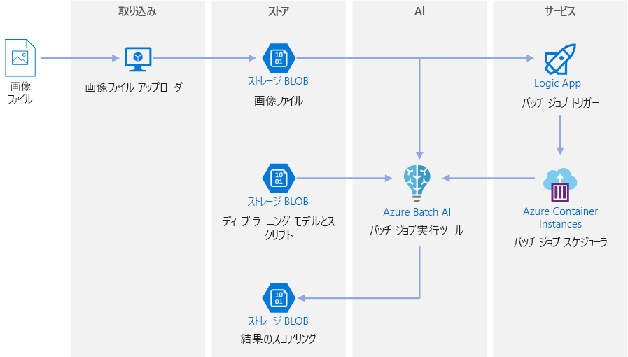
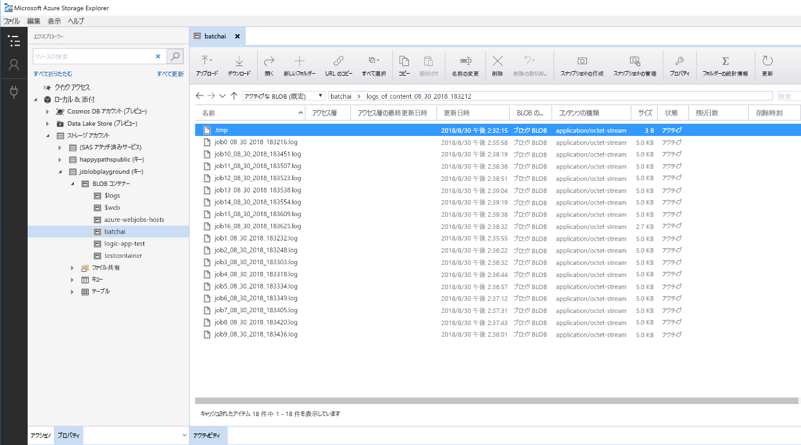

# ディープ ラーニング モデル用の Azure でのバッチ スコアリング

この参照アーキテクチャでは、Azure Batch AI を使用してニューラル スタイルの転送を動画に適用する方法を示します。 "*スタイルの転送*" とは、別の画像のスタイルに既存の画像を組み込むディープ ラーニングの手法です。 このアーキテクチャは、ディープ ラーニングでバッチ スコアリングを使用する任意のシナリオに一般化することができます。 [**このソリューションをデプロイします**](#deploy-the-solution)。

**シナリオ**:あるメディア組織は、動画のスタイルを特定の絵画のように変更したいと考えています。 組織は、適切なタイミングで自動的に動画のすべてのフレームにこのスタイルを適用できることを望んでいます。 ニューラル スタイル転送アルゴリズムの背景について詳しくは、「[Image Style Transfer Using Convolutional Neural Networks][image-style-transfer]」(畳み込みニューラル ネットワークを使用した画像スタイルの転送) (PDF) をご覧ください。

| スタイル画像: | 入力/コンテンツ動画: | 出力動画: |
|--------|--------|---------|
|  |  *クリックすると動画が表示されます* |  *クリックすると動画が表示されます* |

この参照アーキテクチャは、Azure Storage に新しいメディアが存在することによってトリガーされるワークロード用に設計されています。 処理には次の手順が含まれます。

1. 選択したスタイル画像 (ゴッホの絵など) とスタイル転送スクリプトを、Blob Storage にアップロードします。
1. 処理を開始する準備ができている自動スケール Batch AI クラスターを作成します。
1. 動画ファイルを個々のフレームに分割し、それらのフレームを Blob Storage にアップロードします。
1. すべてのフレームがアップロードされたら、トリガー ファイルを Blob Storage にアップロードします。
1. このファイルは、Azure Container Instances 内で実行されるコンテナーを作成するロジック アプリをトリガーします。
1. コンテナーで、Batch AI ジョブを作成するスクリプトが実行されます。 各ジョブで、Batch AI クラスターのノード間に並列にニューラル スタイル転送が適用されます。
1. イメージが生成されると、Blob Storage に保存されます。
1. 生成されたフレームをダウンロードして、画像を動画に合成します。

## アーキテクチャ

このアーキテクチャは、次のコンポーネントで構成されます。

### Compute

**[Azure Batch AI][batch-ai]** は、ニューラル スタイル転送アルゴリズムを実行するために使用されます。 Batch AI は、GPU 対応の VM でディープ ラーニング フレームワーク用にあらかじめ構成されているコンテナー化された環境を提供することにより、ディープ ラーニング ワークロードをサポートします。 Batch AI は、BLOB ストレージにコンピューティング クラスターを接続することもできます。

### Storage

**[BLOB ストレージ][blob-storage]** は、すべての画像 (入力画像、スタイル画像、出力画像) および Batch AI から生成されるすべてのログを格納するために使用されます。 BLOB ストレージは、BLOB ストレージでサポートされるオープン ソースの仮想ファイル システムである [blobfuse][blobfuse] を使用して、Batch AI と統合されます。 BLOB ストレージは、このワークロードに必要なパフォーマンスに対してコスト効率も非常に優れています。

### トリガー/スケジュール

**[Azure Logic Apps][logic-apps]** は、ワークフローをトリガーするために使用されます。 Logic Apps は、コンテナーに BLOB が追加されたことを検出すると、Batch AI プロセスをトリガーします。 Logic Apps は、BLOB ストレージに対する変更を検出する簡単な方法であり、トリガーを変更するための簡単なプロセスを備えているため、この参照アーキテクチャに非常に適しています。

**[Azure Container Instances][container-instances]** は、Batch AI ジョブを作成する Python スクリプトを実行するために使用されます。 Docker コンテナー内でこれらのスクリプトを実行することは、オンデマンドでスクリプトを実行する便利な方法です。 このアーキテクチャでは、Container Instances 用の構築済みのロジック アプリ コネクタがあるため、Container Instances を使用します。これにより、ロジック アプリは Batch AI ジョブをトリガーできます。 Container Instances は、ステートレス プロセスを迅速に開始できます。

**[DockerHub][dockerhub]** は、Container Instances がジョブ作成プロセスの実行に使用する Docker イメージを格納するために使用されます。 DockerHub は、使いやすく、Docker ユーザーに対する既定のイメージ リポジトリであるため、このアーキテクチャに選択されました。 [Azure Container Registry][container-registry] を使用することもできます。

### データの準備

この参照アーキテクチャでは、木の中にいるオランウータンの動画映像を使用します。 [こちら][source-video]から映像をダウンロードし、次の手順に従ってワークフロー用に処理できます。

1. [AzCopy][azcopy] を使用して、パブリック BLOB から動画をダウンロードします。
2. [FFmpeg][ffmpeg] を使用してオーディオ ファイルを抽出し、後で出力動画にオーディオ ファイルを合成できるようにします。
3. FFmpeg を使用して、動画を個々のフレームに分割します。 フレームは、並列で個別に処理されます。
4. AzCopy を使用して、個々のフレームを BLOB コンテナーにコピーします。

この段階で、動画映像はニューラル スタイル転送に使用できる形式になっています。

## パフォーマンスに関する考慮事項

### GPU と CPU

ディープ ラーニング ワークロードでは、同等のパフォーマンスを得るためには非常に大規模な CPU クラスターが必要になるため、一般に、CPU より GPU の方がかなり優れています。 このアーキテクチャでは CPU のみを使用することもできますが、GPU の方が優れたコスト/パフォーマンス プロファイルを提供します。 GPU 最適化 VM の最新の [NCv3 シリーズ]vm-sizes-gpu を使用することをお勧めします。

すべてのリージョンで、GPU は既定では有効になっていません。 GPU が有効になっているリージョンを選択してください。 さらに、サブスクリプションの既定のクォータでは、GPU 最適化 VM のコア数は 0 です。 サポート要求を開くことで、このクォータを増やすことができます。 ワークロードを実行するための十分なクォータがサブスクリプションにあることを確認してください。

### VM とコアの間の並列化

スタイル転送プロセスをバッチ ジョブとして実行するとき、主に GPU 上で実行されるジョブは、VM 間で並列化する必要があります。 2 つの方法が可能であり、単一の GPU を備えた VM を使用して大規模なクラスターを作成するか、または多くの GPU を備えた VM を使用して小規模なクラスターを作成することができます。

このワークロードでは、これら 2 つのオプションのパフォーマンスは同等です。 VM あたりの GPU が多い少数の VM を使用すると、データ移動を削減するのに役立ちます。 ただし、このワークロードではジョブごとのデータ量がそれほど多くないので、BLOB ストレージによって大きく制限されることはありません。

### Batch AI ジョブごとの画像バッチ サイズ

構成する必要があるもう 1 つのパラメーターは、Batch AI ジョブごとに処理する画像の数です。 一方では、処理をノード間に広く分散させ、ジョブが失敗した場合に再処理する必要のある画像が多くなりすぎないようにする必要があります。 そのためには、多数の Batch AI ジョブを使用して、ジョブごとに処理する画像の数を減らします。 しかし他方では、ジョブごとに処理される画像が少なすぎると、セットアップ/起動時間が不釣り合いに大きくなります。 ジョブの数を、クラスター内のノードの最大数と等しくなるように設定することができます。 このようにすると、セットアップ/起動コストの量が最小限になるため、ジョブが失敗しなければ、パフォーマンスは最大になります。 ただし、ジョブが失敗した場合は、多数の画像の再処理が必要になる可能性があります。

### ファイル サーバー

Batch AI を使用する場合は、シナリオに必要なスループットに応じて、複数のストレージ オプションを選択できます。 必要なスループットが低いワークロードでは、(blobfuse を介して) BLOB を使用するので十分なはずです。 または、Batch AI では管理された単一ノード NFS である Batch AI ファイル サーバーもサポートされており、クラスター ノードに自動的にマウントされて、ジョブに対して一元的にアクセス可能なストレージの場所を提供できます。 ほとんどの場合、ワークスペースで必要なファイル サーバーは 1 つだけであり、トレーニング ジョブのデータを異なるディレクトリに分離することができます。 単一ノードの NFS がワークロードに適していない場合、Batch AI では、Azure Files または Gluster や Lustre ファイル システムといったカスタム ソリューションなど、他のストレージ オプションがサポートされています。

## セキュリティに関する考慮事項

### Azure Blob Storage へのアクセスの制限

この参照アーキテクチャでは、Azure Blob Storage が保護する必要のあるメイン ストレージ コンポーネントです。 GitHub リポジトリで示されているベースライン展開では、ストレージ アカウント キーを使用して BLOB ストレージにアクセスしています。 さらに制御と保護を強化するには、共有アクセス署名 (SAS) を代わりに使用することを検討します。 これは、ストレージ内のオブジェクトへの制限されたアクセスを付与し、アカウント キーをハード コーディングしたり、それをプレーンテキストで保存したりする必要はありません。 ロジック アプリのデザイナー インターフェイスの内部ではアカウント キーがプレーンテキストで表示されるので、このアプローチは特に便利です。 SAS を使用すると、ストレージ アカウントに適切なガバナンスがあること、およびアクセス権がそれを必要とするユーザーだけに付与されることを保証するのにも役立ちます。

ストレージ キーはワークロードのすべての入出力データに対するフル アクセス権を与えるため、データの機密性がさらに高いシナリオでは、すべてのストレージ キーが保護されるようにします。

### データの暗号化とデータの移動

この参照アーキテクチャでは、バッチ スコアリング プロセスの例として、スタイルの転送を使用しています。 データの機密性がさらに高いシナリオでは、ストレージに保存されているときのデータを暗号化する必要があります。 データがある場所から次の場所に移動されるたびに、SSL を使用してデータ転送をセキュリティ保護します。 詳しくは、「[Azure Storage セキュリティ ガイド][storage-security]」をご覧ください。

### 仮想ネットワーク内のデータのセキュリティ保護

Batch AI クラスターを展開するときは、仮想ネットワークのサブネット内にプロビジョニングされるようにクラスターを構成できます。 これにより、クラスター内のコンピューティング ノードは、他の仮想マシンや、オンプレミスのネットワークとさえ、安全に通信できます。 また、BLOB ストレージで[サービス エンドポイント][service-endpoints]を使用して仮想ネットワークからのアクセスを許可したり、Batch AI の VNET 内で単一ノード NFS を使用して、データが常に保護されるようにすることもできます。

### 悪意のあるアクティビティからの保護

複数のユーザーがいるシナリオでは、機密データが悪意のあるアクティビティに対して保護されるようにします。 この展開にアクセスして入力データをカスタマイズすることを他のユーザーに許可する場合は、次の注意事項と考慮事項に留意します。

- RBAC を使用して、ユーザーのアクセスを必要なリソースのみに制限します。
- 2 つのストレージ アカウントを個別にプロビジョニングします。 1 つのアカウントで、入力と出力のデータを格納します。 外部ユーザーにはこのアカウントへのアクセスを許可できます。 もう 1 つのアカウントには、実行可能なスクリプトと出力ログ ファイルを格納します。 外部ユーザーはこのアカウントにアクセスできないようにします。 このようにすると、外部ユーザーは実行可能ファイルを変更 (して悪意のあるコードを挿入) することができず、機密情報が保持されている可能性があるログ ファイルにアクセスできません。
- 悪意のあるユーザーは、ジョブ キューに対して DDOS を行ったり、不正な形式の有害なメッセージをジョブ キューに挿入したりして、システムをロックさせたりデキュー エラーを発生させたりする可能性があります。

## 監視およびログ記録

### Batch AI ジョブの監視

ジョブの実行中は、進行状況を監視し、想定どおりに動作していることを確認することが重要です。 ただし、アクティブなノードのクラスター全体を監視するのは困難な場合があります。

クラスターの全体的な状態を把握するには、Azure Portal の Batch AI ブレードに移動して、クラスター内のノードの状態を検査します。 ノードが非アクティブになった場合、またはジョブが失敗した場合は、エラー ログが BLOB ストレージに保存されており、Azure Portal の [ジョブ] ブレードでもアクセスできます。

ログを Application Insights に接続することで、または別のプロセスを実行して Batch AI クラスターとそのジョブの状態をポーリングすることで、監視をさらに強化できます。

### Batch AI でのログ

Batch AI は、関連付けられている BLOB ストレージ アカウントに、すべての stdout/stderr を自動的に記録します。 Storage Explorer などのストレージ ナビゲーション ツールを使用すると、ログ ファイルをナビゲートするエクスペリエンスがはるかに簡単になります。

この参照アーキテクチャの展開の手順では、さらに簡単なログ記録システムをセットアップする方法も示されています。このシステムでは、次に示すように、さまざまなジョブ全体のすべてのログが、BLOB コンテナー内の同じディレクトリに保存されます。 これらのログを使用して、各ジョブおよび各画像の処理にかかった時間を監視します。 このようにすると、プロセスをさらに最適化するのにいっそうよい方法を思い付くことができます。

## コストに関する考慮事項

コストの点では、この参照アーキテクチャで使用されているコンピューティング リソースは、ストレージおよびスケジュール コンポーネントより、はるかに大きい部分を占めます。 主要な課題の 1 つは、GPU 対応マシンのクラスター全体に作業を効果的に並列化することです。

Batch AI クラスターのサイズは、キュー内のジョブに応じて、自動的にスケールアップおよびスケールダウンできます。 2 つの方法のいずれかで、Batch AI の自動スケールを有効にできます。 プログラムで行う場合は、[展開手順][deployment]の一部である `.env` ファイルで構成できます。または、クラスターを作成した後、ポータルで直接スケール式を変更することもできます。

即時処理を必要としない作業の場合は、既定の状態 (最小) が 0 個のノードのクラスターであるように、自動スケールの式を構成します。 この構成では、クラスターは 0 個のノードで開始し、キュー内でジョブが検出されたときのみスケールアップします。 バッチ スコアリング プロセスが 1 日に数回以下しか発生しない場合は、この設定により大幅なコスト削減を実現できます。

非常に短い間隔で発生するバッチ ジョブでは、自動スケールが適切ではない場合があります。 クラスターの起動と停止に要する時間にもコストがかかるので、前のジョブの終了後ほんの数分でバッチ ワークロードが開始する場合は、ジョブ間もクラスターを実行したままにする方がコスト効率がよくなる可能性があります。

## ソリューションのデプロイ方法

この参照アーキテクチャを展開するには、[GitHub リポジトリ][deployment]で説明されている手順に従ってください。

<!-- links -->

[azcopy]: /azure/storage/common/storage-use-azcopy-linux
[batch-ai]: /azure/batch-ai/
[blobfuse]: https://github.com/Azure/azure-storage-fuse
[blob-storage]: /azure/storage/blobs/storage-blobs-introduction
[container-instances]: /azure/container-instances/
[container-registry]: /azure/container-registry/
[deployment]: https://github.com/Azure/batch-scoring-for-dl-models
[dockerhub]: https://hub.docker.com/
[ffmpeg]: https://www.ffmpeg.org/
[image-style-transfer]: https://www.cv-foundation.org/openaccess/content_cvpr_2016/papers/Gatys_Image_Style_Transfer_CVPR_2016_paper.pdf
[logic-apps]: /azure/logic-apps/
[service-endpoints]: /azure/storage/common/storage-network-security?toc=%2fazure%2fvirtual-network%2ftoc.json#grant-access-from-a-virtual-network
[source-video]: https://happypathspublic.blob.core.windows.net/videos/orangutan.mp4
[storage-security]: /azure/storage/common/storage-security-guide
[vm-sizes-gpu]: /azure/virtual-machines/windows/sizes-gpu