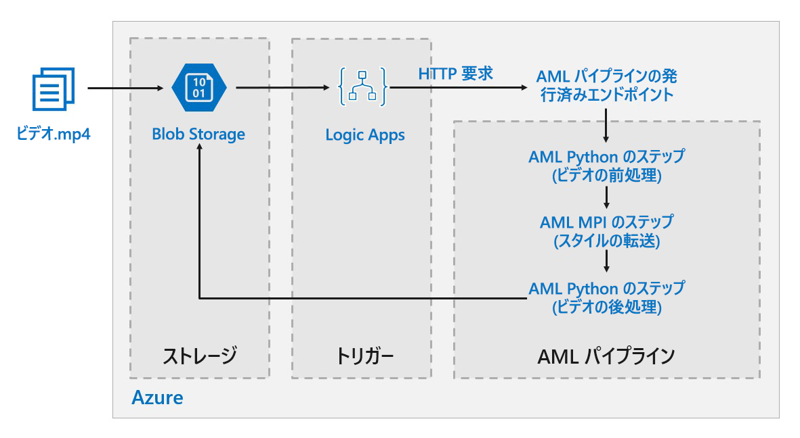

# ディープ ラーニング モデル用の Azure でのバッチ スコアリング

この参照アーキテクチャでは、Azure Machine Learning を使用してニューラル スタイルの転送を動画に適用する方法を示します。 "*スタイルの転送*" とは、別の画像のスタイルに既存の画像を組み込むディープ ラーニングの手法です。 このアーキテクチャは、ディープ ラーニングでバッチ スコアリングを使用する任意のシナリオに一般化することができます。 [**このソリューションをデプロイします**](#deploy-the-solution)。

**シナリオ**: あるメディア組織は、動画のスタイルを特定の絵画のように変更したいと考えています。 組織は、適切なタイミングで自動的に動画のすべてのフレームにこのスタイルを適用できることを望んでいます。 ニューラル スタイル転送アルゴリズムの背景について詳しくは、「[Image Style Transfer Using Convolutional Neural Networks][image-style-transfer]」(畳み込みニューラル ネットワークを使用した画像スタイルの転送) (PDF) をご覧ください。

| スタイル画像: | 入力/コンテンツ動画: | 出力動画: |
|--------|--------|---------|
|  |  *クリックすると動画が表示されます* |  *クリックすると動画が表示されます* |

この参照アーキテクチャは、Azure Storage に新しいメディアが存在することによってトリガーされるワークロード用に設計されています。

処理には次の手順が含まれます。

1. 動画ファイルをアップロードします。
1. 動画ファイルによってロジック アプリがトリガーされ、Azure Machine Learning パイプラインで公開されているエンドポイントに要求が送信されます。
1. パイプラインによって動画が処理され、MPI を使用してスタイル転送が適用され、動画が後処理されます。
1. パイプラインが完了すると、出力が Blob Storage に保存されます。

## アーキテクチャ

このアーキテクチャは、次のコンポーネントで構成されます。

### Compute

**[Azure Machine Learning service][amls]** は、Azure Machine Learning Pipelines を使用して、再現可能で管理が容易な計算シーケンスを作成します。 また、[Azure Machine Learning コンピューティング][aml-compute]という、機械学習モデルのトレーニング、デプロイ、およびスコアリングのためのマネージド コンピューティング先 (これに対してパイプラインの計算が実行されます) も提供します。 

### Storage

**[Blob Storage][blob-storage]** は、すべての画像 (入力画像、スタイル画像、出力画像) を格納するために使用されます。 Azure Machine Learning service は、ユーザーがコンピューティング プラットフォームと Blob Storage の間でデータを手動で移動する必要がないように、Blob Storage と統合されています。 BLOB ストレージは、このワークロードに必要なパフォーマンスに対してコスト効率も非常に優れています。

### トリガー/スケジュール

**[Azure Logic Apps][logic-apps]** は、ワークフローをトリガーするために使用されます。 Logic Apps は、コンテナーに BLOB が追加されたことを検出すると、Azure Machine Learning Pipelines をトリガーします。 Logic Apps は、BLOB ストレージに対する変更を検出する簡単な方法であり、トリガーを変更するための簡単なプロセスを備えているため、この参照アーキテクチャに非常に適しています。

### データの前処理と後処理

この参照アーキテクチャでは、木の中にいるオランウータンの動画映像を使用します。 映像は [こちら][source-video]からダウンロードできます。

1. [FFmpeg][ffmpeg] を使用して動画映像からオーディオ ファイルを抽出し、後で出力動画にオーディオ ファイルを合成できるようにします。
1. FFmpeg を使用して、動画を個々のフレームに分割します。 フレームは、並列で個別に処理されます。
1. この時点で、ニューラル スタイルの転送を個々のフレームに並列で適用できます。
1. 各フレームの処理が完了したら、FFmpeg を使用して、フレームを元のように再合成する必要があります。
1. 最後に、合成された映像にオーディオ ファイルを再合成します。

## パフォーマンスに関する考慮事項

### GPU と CPU

ディープ ラーニング ワークロードでは、同等のパフォーマンスを得るためには非常に大規模な CPU クラスターが必要になるため、一般に、CPU より GPU の方がかなり優れています。 このアーキテクチャでは CPU のみを使用することもできますが、GPU の方が優れたコスト/パフォーマンス プロファイルを提供します。 GPU 最適化 VM の最新の [NCv3 シリーズ]vm-sizes-gpu を使用することをお勧めします。

すべてのリージョンで、GPU は既定では有効になっていません。 GPU が有効になっているリージョンを選択してください。 さらに、サブスクリプションの既定のクォータでは、GPU 最適化 VM のコア数は 0 です。 サポート要求を開くことで、このクォータを増やすことができます。 ワークロードを実行するための十分なクォータがサブスクリプションにあることを確認してください。

### VM とコアの間の並列化

スタイル転送プロセスをバッチ ジョブとして実行するとき、主に GPU 上で実行されるジョブは、VM 間で並列化する必要があります。 2 つの方法が可能であり、単一の GPU を備えた VM を使用して大規模なクラスターを作成するか、または多くの GPU を備えた VM を使用して小規模なクラスターを作成することができます。

このワークロードでは、これら 2 つのオプションのパフォーマンスは同等です。 VM あたりの GPU が多い少数の VM を使用すると、データ移動を削減するのに役立ちます。 ただし、このワークロードではジョブごとのデータ量がそれほど多くないので、BLOB ストレージによって大きく制限されることはありません。

### MPI のステップ 

Azure Machine Learning でパイプラインを作成する場合、並列計算を実行するために使用されるステップの 1 つが MPI のステップです。 MPI のステップは、使用可能なノード間でデータを均等に分割するのに役立ちます。 MPI のステップは、要求されたすべてのノードの準備が整うまでは実行されません。 1 つのノードが失敗したり、割り込まれたりした場合 (それが優先順位の低い仮想マシンであっても)、MPI のステップを再実行する必要があります。 

## セキュリティに関する考慮事項

### Azure Blob Storage へのアクセスの制限

この参照アーキテクチャでは、Azure Blob Storage が保護する必要のあるメイン ストレージ コンポーネントです。 GitHub リポジトリで示されているベースライン展開では、ストレージ アカウント キーを使用して BLOB ストレージにアクセスしています。 さらに制御と保護を強化するには、共有アクセス署名 (SAS) を代わりに使用することを検討します。 これは、ストレージ内のオブジェクトへの制限されたアクセスを付与し、アカウント キーをハード コーディングしたり、それをプレーンテキストで保存したりする必要はありません。 ロジック アプリのデザイナー インターフェイスの内部ではアカウント キーがプレーンテキストで表示されるので、このアプローチは特に便利です。 SAS を使用すると、ストレージ アカウントに適切なガバナンスがあること、およびアクセス権がそれを必要とするユーザーだけに付与されることを保証するのにも役立ちます。

ストレージ キーはワークロードのすべての入出力データに対するフル アクセス権を与えるため、データの機密性がさらに高いシナリオでは、すべてのストレージ キーが保護されるようにします。

### データの暗号化とデータの移動

この参照アーキテクチャでは、バッチ スコアリング プロセスの例として、スタイルの転送を使用しています。 データの機密性がさらに高いシナリオでは、ストレージに保存されているときのデータを暗号化する必要があります。 データがある場所から次の場所に移動されるたびに、SSL を使用してデータ転送をセキュリティ保護します。 詳しくは、「[Azure Storage セキュリティ ガイド][storage-security]」をご覧ください。

### 仮想ネットワーク内での計算のセキュリティ保護

Machine Learning コンピューティング クラスターをデプロイするときは、[仮想ネットワーク][virtual-network]のサブネット内にプロビジョニングされるようにクラスターを構成できます。 これにより、クラスター内のコンピューティング ノードは、他の仮想マシンと安全に通信できます。 

### 悪意のあるアクティビティからの保護

複数のユーザーがいるシナリオでは、機密データが悪意のあるアクティビティに対して保護されるようにします。 この展開にアクセスして入力データをカスタマイズすることを他のユーザーに許可する場合は、次の注意事項と考慮事項に留意します。

- RBAC を使用して、ユーザーのアクセスを必要なリソースのみに制限します。
- 2 つのストレージ アカウントを個別にプロビジョニングします。 1 つのアカウントで、入力と出力のデータを格納します。 外部ユーザーにはこのアカウントへのアクセスを許可できます。 もう 1 つのアカウントには、実行可能なスクリプトと出力ログ ファイルを格納します。 外部ユーザーはこのアカウントにアクセスできないようにします。 このようにすると、外部ユーザーは実行可能ファイルを変更 (して悪意のあるコードを挿入) することができず、機密情報が保持されている可能性があるログ ファイルにアクセスできません。
- 悪意のあるユーザーは、ジョブ キューに対して DDOS を行ったり、不正な形式の有害なメッセージをジョブ キューに挿入したりして、システムをロックさせたりデキュー エラーを発生させたりする可能性があります。

## 監視およびログ記録

### Batch ジョブの監視

ジョブの実行中は、進行状況を監視し、想定どおりに動作していることを確認することが重要です。 ただし、アクティブなノードのクラスター全体を監視するのは困難な場合があります。

クラスターの全体的な状態を把握するには、Azure portal の [Machine Learning] ブレードに移動して、クラスター内のノードの状態を調べます。 ノードが非アクティブになった場合、またはジョブが失敗した場合は、エラー ログが Blob Storage に保存され、Azure portal からアクセスすることもできます。

ログを Application Insights に接続することで、または別のプロセスを実行してクラスターとそのジョブの状態をポーリングすることで、監視をさらに強化できます。

### Azure Machine Learning によるログ記録

Azure Machine Learning は、関連付けられている Blob ストレージ アカウントに、すべての stdout/stderr を自動的に記録します。 特に指定しない場合、Azure Machine Learning ワークスペースによって、自動的にストレージ アカウントがプロビジョニングされ、そこにログがダンプされます。 Storage Explorer などのストレージ ナビゲーション ツールを使用することもできます。これにより、ログ ファイル間を移動するエクスペリエンスがはるかに簡単になります。

## コストに関する考慮事項

コストの点では、この参照アーキテクチャで使用されているコンピューティング リソースは、ストレージおよびスケジュール コンポーネントより、はるかに大きい部分を占めます。 主要な課題の 1 つは、GPU 対応マシンのクラスター全体に作業を効果的に並列化することです。

Machine Learning コンピューティング クラスターのサイズは、キュー内のジョブに応じて、自動的にスケールアップおよびスケールダウンできます。 プログラムで最小ノード数と最大ノード数を設定することで、自動スケーリングを有効にできます。

即時処理を必要としない作業の場合は、既定の状態 (最小) が、ノード数 0 個のクラスターになるように、自動スケーリングを構成します。 この構成では、クラスターは 0 個のノードで開始し、キュー内でジョブが検出されたときのみスケールアップします。 バッチ スコアリング プロセスが 1 日に数回以下しか発生しない場合は、この設定により大幅なコスト削減を実現できます。

非常に短い間隔で発生するバッチ ジョブでは、自動スケールが適切ではない場合があります。 クラスターの起動と停止に要する時間にもコストがかかるので、前のジョブの終了後ほんの数分でバッチ ワークロードが開始する場合は、ジョブ間もクラスターを実行したままにする方がコスト効率がよくなる可能性があります。

Machine Learning コンピューティングでは、低優先度の仮想マシンもサポートしています。 これにより、割引料金の仮想マシンで計算処理を実行できます。ただし、これらの仮想マシンでは割り込みが発生する可能性が常にあることに注意が必要です。 低優先度の仮想マシンは、重要度の低いバッチ スコアリング ワークロードに最適です。

## ソリューションのデプロイ方法

この参照アーキテクチャを展開するには、[GitHub リポジトリ][deployment]で説明されている手順に従ってください。

> [!NOTE]
> また、Azure Kubernetes Service を使用して、ディープ ラーニング モデル用にバッチ スコアリング アーキテクチャをデプロイすることもできます。 この [Github リポジトリ][deployment2]で説明されている手順に従ってください。

<!-- links -->

[aml-compute]: /azure/machine-learning/service/how-to-set-up-training-targets#amlcompute
[amls]: /azure/machine-learning/service/overview-what-is-azure-ml
[azcopy]: /azure/storage/common/storage-use-azcopy-linux
[blob-storage]: /azure/storage/blobs/storage-blobs-introduction
[container-instances]: /azure/container-instances/
[container-registry]: /azure/container-registry/
[deployment]: https://github.com/Azure/Batch-Scoring-Deep-Learning-Models-With-AML
[deployment2]: https://github.com/Azure/Batch-Scoring-Deep-Learning-Models-With-AKS
[ffmpeg]: https://www.ffmpeg.org/
[image-style-transfer]: https://www.cv-foundation.org/openaccess/content_cvpr_2016/papers/Gatys_Image_Style_Transfer_CVPR_2016_paper.pdf
[logic-apps]: /azure/logic-apps/
[source-video]: https://happypathspublic.blob.core.windows.net/videos/orangutan.mp4
[storage-security]: /azure/storage/common/storage-security-guide
[vm-sizes-gpu]: /azure/virtual-machines/windows/sizes-gpu
[virtual-network]: /azure/machine-learning/service/how-to-enable-virtual-network
